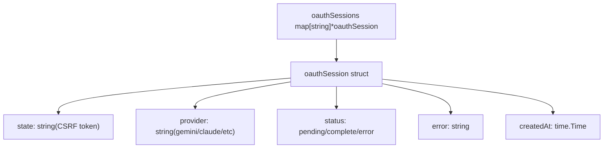
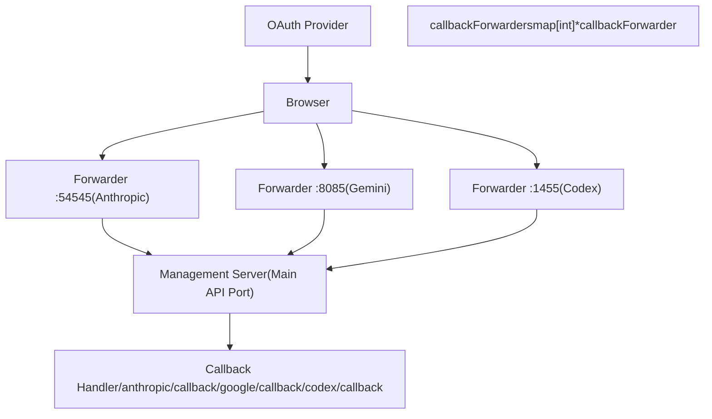
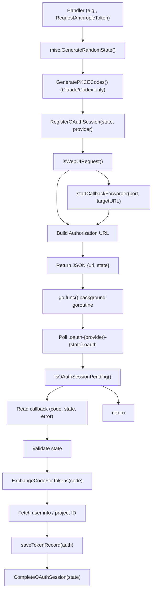
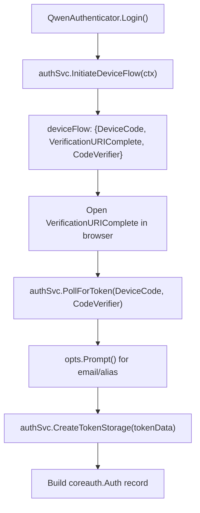
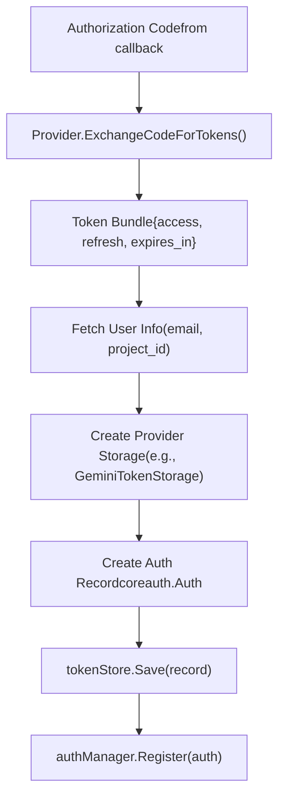
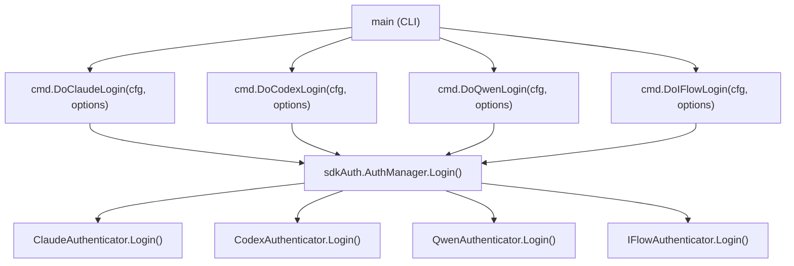
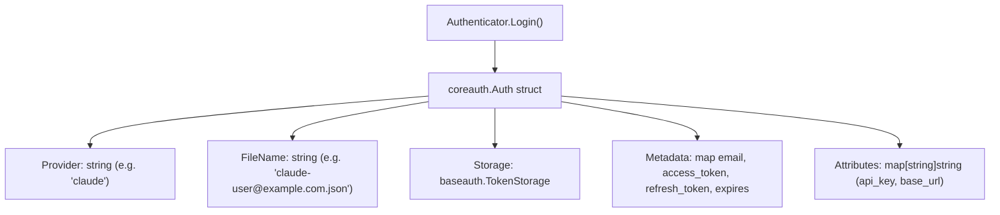
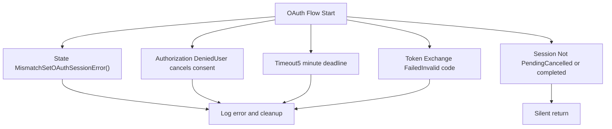

# OAuth Flow Architecture

Relevant source files

-   [internal/auth/antigravity/auth.go](https://github.com/router-for-me/CLIProxyAPI/blob/c66cb0af/internal/auth/antigravity/auth.go)
-   [internal/cmd/anthropic\_login.go](https://github.com/router-for-me/CLIProxyAPI/blob/c66cb0af/internal/cmd/anthropic_login.go)
-   [internal/cmd/iflow\_login.go](https://github.com/router-for-me/CLIProxyAPI/blob/c66cb0af/internal/cmd/iflow_login.go)
-   [internal/cmd/openai\_login.go](https://github.com/router-for-me/CLIProxyAPI/blob/c66cb0af/internal/cmd/openai_login.go)
-   [internal/cmd/qwen\_login.go](https://github.com/router-for-me/CLIProxyAPI/blob/c66cb0af/internal/cmd/qwen_login.go)
-   [internal/watcher/config\_reload.go](https://github.com/router-for-me/CLIProxyAPI/blob/c66cb0af/internal/watcher/config_reload.go)
-   [sdk/auth/antigravity.go](https://github.com/router-for-me/CLIProxyAPI/blob/c66cb0af/sdk/auth/antigravity.go)
-   [sdk/auth/claude.go](https://github.com/router-for-me/CLIProxyAPI/blob/c66cb0af/sdk/auth/claude.go)
-   [sdk/auth/codex.go](https://github.com/router-for-me/CLIProxyAPI/blob/c66cb0af/sdk/auth/codex.go)
-   [sdk/auth/iflow.go](https://github.com/router-for-me/CLIProxyAPI/blob/c66cb0af/sdk/auth/iflow.go)
-   [sdk/auth/qwen.go](https://github.com/router-for-me/CLIProxyAPI/blob/c66cb0af/sdk/auth/qwen.go)
-   [sdk/cliproxy/auth/conductor.go](https://github.com/router-for-me/CLIProxyAPI/blob/c66cb0af/sdk/cliproxy/auth/conductor.go)
-   [sdk/cliproxy/auth/selector.go](https://github.com/router-for-me/CLIProxyAPI/blob/c66cb0af/sdk/cliproxy/auth/selector.go)
-   [sdk/cliproxy/auth/selector\_test.go](https://github.com/router-for-me/CLIProxyAPI/blob/c66cb0af/sdk/cliproxy/auth/selector_test.go)
-   [sdk/cliproxy/auth/types.go](https://github.com/router-for-me/CLIProxyAPI/blob/c66cb0af/sdk/cliproxy/auth/types.go)
-   [sdk/cliproxy/auth/types\_test.go](https://github.com/router-for-me/CLIProxyAPI/blob/c66cb0af/sdk/cliproxy/auth/types_test.go)

## Purpose and Scope

This document describes the OAuth 2.0 flow architecture used by CLIProxyAPI to authenticate users with multiple AI providers. It covers the state management system, callback handling mechanisms, and the callback forwarder infrastructure that enables both CLI and web UI authentication flows.

For provider-specific OAuth setup instructions, see [Provider-Specific OAuth Setup](/router-for-me/CLIProxyAPI/7.2-provider-specific-oauth-setup). For token refresh and lifecycle management, see [Token Refresh and Lifecycle](/router-for-me/CLIProxyAPI/7.4-token-refresh-and-lifecycle). For general authentication concepts, see [Authentication and Credential Management](/router-for-me/CLIProxyAPI/3.3-authentication-and-credential-management).

---

## OAuth Flow Overview

CLIProxyAPI implements OAuth 2.0 authorization code flows (with optional PKCE) for most providers. Qwen uses OAuth 2.0 device flow. The system has two distinct execution paths:

1.  **SDK/CLI Mode** (`Authenticator.Login()`): Starts a local HTTP server to receive the OAuth callback directly. Used when executing the CLI `login` command or using the Go SDK.
2.  **Management API Mode** (e.g., `RequestAnthropicToken`): Used via the web UI; uses a lightweight callback forwarder to bridge provider callback ports to the management server, then coordinates via a file written to the auth directory.

### SDK/CLI OAuth Sequence (Authorization Code Flow)

This flow applies to Claude, Codex, Antigravity, and iFlow when using the SDK authenticators.

**SDK Authorization Code Flow**

> **[Mermaid sequence]**
> *(图表结构无法解析)*

Sources: [sdk/auth/claude.go38-214](https://github.com/router-for-me/CLIProxyAPI/blob/c66cb0af/sdk/auth/claude.go#L38-L214) [sdk/auth/codex.go38-192](https://github.com/router-for-me/CLIProxyAPI/blob/c66cb0af/sdk/auth/codex.go#L38-L192) [sdk/auth/antigravity.go35-215](https://github.com/router-for-me/CLIProxyAPI/blob/c66cb0af/sdk/auth/antigravity.go#L35-L215) [sdk/auth/iflow.go33-190](https://github.com/router-for-me/CLIProxyAPI/blob/c66cb0af/sdk/auth/iflow.go#L33-L190)

### Management API OAuth Sequence (Web UI)

This flow applies when OAuth is initiated via the management REST API (e.g., for web UI integrations).

**Management API OAuth Flow**

> **[Mermaid sequence]**
> *(图表结构无法解析)*

Sources: [internal/api/handlers/management/auth\_files.go870-1012](https://github.com/router-for-me/CLIProxyAPI/blob/c66cb0af/internal/api/handlers/management/auth_files.go#L870-L1012) [internal/api/handlers/management/auth\_files.go1014-1242](https://github.com/router-for-me/CLIProxyAPI/blob/c66cb0af/internal/api/handlers/management/auth_files.go#L1014-L1242)

---

## State Management and Session Tracking

OAuth flows require tracking pending authentication sessions to prevent CSRF attacks and coordinate between the authorization request and callback handler.

### OAuth Session Data Structure

The system maintains in-memory session state using a synchronized map structure:


### Session Management Functions

The OAuth session lifecycle is managed by these key functions in [internal/api/handlers/management/auth\_files.go2241-2332](https://github.com/router-for-me/CLIProxyAPI/blob/c66cb0af/internal/api/handlers/management/auth_files.go#L2241-L2332):

| Function | Purpose |
| --- | --- |
| `RegisterOAuthSession(state, provider)` | Creates new pending session with unique state token |
| `IsOAuthSessionPending(state, provider)` | Checks if session is still awaiting callback |
| `CompleteOAuthSession(state)` | Marks session as successfully completed |
| `CompleteOAuthSessionsByProvider(provider)` | Completes all pending sessions for a provider |
| `SetOAuthSessionError(state, error)` | Records error and marks session as failed |
| `CleanupExpiredOAuthSessions()` | Removes sessions older than 10 minutes |

State tokens are generated using cryptographically secure random bytes. PKCE codes (code verifier and challenge) are generated separately and are only used for Claude and Codex:

| Provider | State Generation | PKCE |
| --- | --- | --- |
| Claude | `misc.GenerateRandomState()` | `claude.GeneratePKCECodes()` |
| Codex | `misc.GenerateRandomState()` | `codex.GeneratePKCECodes()` |
| Antigravity | `misc.GenerateRandomState()` | None |
| iFlow | `misc.GenerateRandomState()` | None |
| Gemini (management API) | `gem-{timestamp}` format | None |
| Qwen | N/A (device flow) | N/A |

Sources: [sdk/auth/claude.go54-60](https://github.com/router-for-me/CLIProxyAPI/blob/c66cb0af/sdk/auth/claude.go#L54-L60) [sdk/auth/codex.go58-64](https://github.com/router-for-me/CLIProxyAPI/blob/c66cb0af/sdk/auth/codex.go#L58-L64) [sdk/auth/antigravity.go54-57](https://github.com/router-for-me/CLIProxyAPI/blob/c66cb0af/sdk/auth/antigravity.go#L54-L57) [sdk/auth/iflow.go66-70](https://github.com/router-for-me/CLIProxyAPI/blob/c66cb0af/sdk/auth/iflow.go#L66-L70) [internal/api/handlers/management/auth\_files.go884](https://github.com/router-for-me/CLIProxyAPI/blob/c66cb0af/internal/api/handlers/management/auth_files.go#L884-L884) [internal/api/handlers/management/auth\_files.go1034](https://github.com/router-for-me/CLIProxyAPI/blob/c66cb0af/internal/api/handlers/management/auth_files.go#L1034-L1034)

---

## Callback Forwarder System

The callback forwarder enables OAuth flows when the management API server is running on a port different from the provider's registered callback port. This is essential for web UI integrations where the browser cannot directly write files.

### Callback Forwarder Architecture


### Callback Forwarder Implementation

Each `callbackForwarder` is a lightweight HTTP server that performs a single function: redirect incoming requests to the management API server.

**Key Components:**

| Component | Location | Purpose |
| --- | --- | --- |
| `callbackForwarder` struct | [internal/api/handlers/management/auth\_files.go55-59](https://github.com/router-for-me/CLIProxyAPI/blob/c66cb0af/internal/api/handlers/management/auth_files.go#L55-L59) | Encapsulates HTTP server and lifecycle |
| `startCallbackForwarder()` | [internal/api/handlers/management/auth\_files.go132-189](https://github.com/router-for-me/CLIProxyAPI/blob/c66cb0af/internal/api/handlers/management/auth_files.go#L132-L189) | Spawns forwarder on specified port |
| `stopCallbackForwarder()` | [internal/api/handlers/management/auth\_files.go192-201](https://github.com/router-for-me/CLIProxyAPI/blob/c66cb0af/internal/api/handlers/management/auth_files.go#L192-L201) | Gracefully shuts down forwarder |
| `callbackForwarders` map | [internal/api/handlers/management/auth\_files.go61-64](https://github.com/router-for-me/CLIProxyAPI/blob/c66cb0af/internal/api/handlers/management/auth_files.go#L61-L64) | Tracks active forwarders by port |

**Port Assignments:**

```
const (    anthropicCallbackPort = 54545  // Claude/Anthropic OAuth    geminiCallbackPort    = 8085   // Gemini OAuth      codexCallbackPort     = 1455   // Codex OAuth)
```
**Sources:** [internal/api/handlers/management/auth\_files.go44-52](https://github.com/router-for-me/CLIProxyAPI/blob/c66cb0af/internal/api/handlers/management/auth_files.go#L44-L52) [internal/api/handlers/management/auth\_files.go55-64](https://github.com/router-for-me/CLIProxyAPI/blob/c66cb0af/internal/api/handlers/management/auth_files.go#L55-L64)

### Forwarder Request Flow

> **[Mermaid sequence]**
> *(图表结构无法解析)*

The forwarder handler is a simple HTTP redirect [internal/api/handlers/management/auth\_files.go150-161](https://github.com/router-for-me/CLIProxyAPI/blob/c66cb0af/internal/api/handlers/management/auth_files.go#L150-L161):

```
handler := http.HandlerFunc(func(w http.ResponseWriter, r *http.Request) {
    target := targetBase
    if raw := r.URL.RawQuery; raw != "" {
        if strings.Contains(target, "?") {
            target = target + "&" + raw
        } else {
            target = target + "?" + raw
        }
    }
    w.Header().Set("Cache-Control", "no-store")
    http.Redirect(w, r, target, http.StatusFound)
})
```
**Sources:** [internal/api/handlers/management/auth\_files.go132-189](https://github.com/router-for-me/CLIProxyAPI/blob/c66cb0af/internal/api/handlers/management/auth_files.go#L132-L189) [internal/api/handlers/management/auth\_files.go150-161](https://github.com/router-for-me/CLIProxyAPI/blob/c66cb0af/internal/api/handlers/management/auth_files.go#L150-L161)

---

## Provider OAuth Flow Implementations

Each provider implements OAuth with slight variations. The system handles these through provider-specific handler functions.

### Provider Endpoints and Flow Initiation

The following table covers both the management API endpoints and the SDK authenticator implementations. Callback ports are where the local OAuth callback server listens.

| Provider | Management Endpoint | Callback Port | Flow Type | PKCE | SDK Authenticator |
| --- | --- | --- | --- | --- | --- |
| Claude | `/v0/management/auth/request/anthropic` | 54545 | Authorization code | Yes | `ClaudeAuthenticator` |
| Gemini CLI | `/v0/management/auth/request/gemini` | 8085 | Authorization code | No | `GeminiAuthenticator` |
| Codex | `/v0/management/auth/request/codex` | 1455 | Auth code or device flow | Yes | `CodexAuthenticator` |
| Qwen | `/v0/management/auth/request/qwen` | None | Device flow | No | `QwenAuthenticator` |
| iFlow | `/v0/management/auth/request/iflow` | `iflow.CallbackPort` | Authorization code | No | `IFlowAuthenticator` |
| Antigravity | SDK only | `antigravity.CallbackPort` | Authorization code | No | `AntigravityAuthenticator` |

Sources: [sdk/auth/claude.go22-28](https://github.com/router-for-me/CLIProxyAPI/blob/c66cb0af/sdk/auth/claude.go#L22-L28) [sdk/auth/codex.go22-28](https://github.com/router-for-me/CLIProxyAPI/blob/c66cb0af/sdk/auth/codex.go#L22-L28) [sdk/auth/iflow.go19-22](https://github.com/router-for-me/CLIProxyAPI/blob/c66cb0af/sdk/auth/iflow.go#L19-L22) [sdk/auth/qwen.go19-23](https://github.com/router-for-me/CLIProxyAPI/blob/c66cb0af/sdk/auth/qwen.go#L19-L23) [sdk/auth/antigravity.go21-27](https://github.com/router-for-me/CLIProxyAPI/blob/c66cb0af/sdk/auth/antigravity.go#L21-L27) [internal/api/handlers/management/auth\_files.go870-1012](https://github.com/router-for-me/CLIProxyAPI/blob/c66cb0af/internal/api/handlers/management/auth_files.go#L870-L1012)

### Authorization Code Flow Pattern (Management API)

The management API handlers follow this common pattern:

**Management API Auth Code Flow**


Sources: [internal/api/handlers/management/auth\_files.go870-1012](https://github.com/router-for-me/CLIProxyAPI/blob/c66cb0af/internal/api/handlers/management/auth_files.go#L870-L1012) [internal/api/handlers/management/auth\_files.go1014-1242](https://github.com/router-for-me/CLIProxyAPI/blob/c66cb0af/internal/api/handlers/management/auth_files.go#L1014-L1242)

### Device Flow Pattern (Qwen)

Qwen uses OAuth 2.0 device authorization grant instead of a callback server.

**QwenAuthenticator Device Flow**


Sources: [sdk/auth/qwen.go44-113](https://github.com/router-for-me/CLIProxyAPI/blob/c66cb0af/sdk/auth/qwen.go#L44-L113)

---

## Callback Handling

### Management API: File-Based Coordination

In the management API flow, callback handlers write JSON files to the auth directory with this naming pattern:

```
.oauth-{provider}-{state}.oauth
```
File contents:

```
{    "code": "authorization_code_from_provider",    "state": "csrf_state_token",    "error": "error_description_if_failed"}
```
**Management API Callback Handlers:**

| Provider | Endpoint | Implementation |
| --- | --- | --- |
| Anthropic | `/anthropic/callback` | [internal/api/handlers/management/auth\_files.go1747-1778](https://github.com/router-for-me/CLIProxyAPI/blob/c66cb0af/internal/api/handlers/management/auth_files.go#L1747-L1778) |
| Google | `/google/callback` | [internal/api/handlers/management/auth\_files.go1780-1813](https://github.com/router-for-me/CLIProxyAPI/blob/c66cb0af/internal/api/handlers/management/auth_files.go#L1780-L1813) |
| Codex | `/codex/callback` | [internal/api/handlers/management/auth\_files.go1815-1846](https://github.com/router-for-me/CLIProxyAPI/blob/c66cb0af/internal/api/handlers/management/auth_files.go#L1815-L1846) |

### SDK: Local HTTP Server Callback

In the SDK/CLI flow, each authenticator creates a provider-specific callback HTTP server that receives the redirect directly:

| Authenticator | Server Type | Result Type |
| --- | --- | --- |
| `ClaudeAuthenticator` | `claude.NewOAuthServer(callbackPort)` | `*claude.OAuthResult` |
| `CodexAuthenticator` | `codex.NewOAuthServer(callbackPort)` | `*codex.OAuthResult` |
| `IFlowAuthenticator` | `iflow.NewOAuthServer(callbackPort)` | `*iflow.OAuthResult` |
| `AntigravityAuthenticator` | `startAntigravityCallbackServer(callbackPort)` | `callbackResult` |

Each server calls `WaitForCallback(5 * time.Minute)` in a goroutine and sends the result to a channel. The authenticator's `Login()` function selects on that channel.

Sources: [sdk/auth/claude.go64-78](https://github.com/router-for-me/CLIProxyAPI/blob/c66cb0af/sdk/auth/claude.go#L64-L78) [sdk/auth/codex.go68-82](https://github.com/router-for-me/CLIProxyAPI/blob/c66cb0af/sdk/auth/codex.go#L68-L82) [sdk/auth/iflow.go50-65](https://github.com/router-for-me/CLIProxyAPI/blob/c66cb0af/sdk/auth/iflow.go#L50-L65) [sdk/auth/antigravity.go58-64](https://github.com/router-for-me/CLIProxyAPI/blob/c66cb0af/sdk/auth/antigravity.go#L58-L64)

### Manual URL Paste Fallback

All SDK authenticators supporting authorization code flow also accept a manually pasted callback URL. If `opts.Prompt` is set, the authenticator starts a 15-second timer after which it prompts the user to paste the full callback URL. This supports headless environments (e.g., SSH remote servers) where the browser redirect cannot reach localhost.

The pasted URL is parsed with `misc.ParseOAuthCallback(input)` which extracts `code`, `state`, and `error` fields.

Sources: [sdk/auth/claude.go120-170](https://github.com/router-for-me/CLIProxyAPI/blob/c66cb0af/sdk/auth/claude.go#L120-L170) [sdk/auth/codex.go123-174](https://github.com/router-for-me/CLIProxyAPI/blob/c66cb0af/sdk/auth/codex.go#L123-L174) [sdk/auth/iflow.go103-150](https://github.com/router-for-me/CLIProxyAPI/blob/c66cb0af/sdk/auth/iflow.go#L103-L150) [sdk/auth/antigravity.go93-138](https://github.com/router-for-me/CLIProxyAPI/blob/c66cb0af/sdk/auth/antigravity.go#L93-L138)

### Callback Handler Pattern

> **[Mermaid sequence]**
> *(图表结构无法解析)*

**Sources:** [internal/api/handlers/management/auth\_files.go1747-1813](https://github.com/router-for-me/CLIProxyAPI/blob/c66cb0af/internal/api/handlers/management/auth_files.go#L1747-L1813)

### Polling Loop Implementation

Background goroutines use a polling pattern to wait for callback files [internal/api/handlers/management/auth\_files.go928-946](https://github.com/router-for-me/CLIProxyAPI/blob/c66cb0af/internal/api/handlers/management/auth_files.go#L928-L946):

```
waitForFile := func(path string, timeout time.Duration) (map[string]string, error) {
    deadline := time.Now().Add(timeout)
    for {
        if !IsOAuthSessionPending(state, "anthropic") {
            return nil, errOAuthSessionNotPending
        }
        if time.Now().After(deadline) {
            SetOAuthSessionError(state, "Timeout waiting for OAuth callback")
            return nil, fmt.Errorf("timeout waiting for OAuth callback")
        }
        data, errRead := os.ReadFile(path)
        if errRead == nil {
            var m map[string]string
            _ = json.Unmarshal(data, &m)
            _ = os.Remove(path)
            return m, nil
        }
        time.Sleep(500 * time.Millisecond)
    }
}
```
**Sources:** [internal/api/handlers/management/auth\_files.go928-947](https://github.com/router-for-me/CLIProxyAPI/blob/c66cb0af/internal/api/handlers/management/auth_files.go#L928-L947)

---

## Token Exchange and Storage

After receiving the authorization code, the system exchanges it for access and refresh tokens and persists them to storage.

### Token Exchange Flow


### Provider-Specific Token Storage

Each provider uses a custom storage format adapted to its authentication requirements:

| Provider | Storage Type | Key Metadata Fields |
| --- | --- | --- |
| Claude | `ClaudeTokenStorage` | `email`, `access_token`, `refresh_token`, `api_key` |
| Gemini | `GeminiTokenStorage` | OAuth2 token, `project_id`, `email`, `auto`, `checked` |
| Codex | Generic metadata | `access_token`, `refresh_token`, `id_token`, session cookies |
| Antigravity | Generic metadata | `access_token`, `refresh_token`, `project_id`, `email`, `expired` |
| iFlow | `iflow.TokenStorage` | `email`, `api_key`, `access_token`, `refresh_token`, `expired` |
| Qwen | `qwen.TokenStorage` | `email`, tokens |

Sources: [internal/auth/claude/storage.go](https://github.com/router-for-me/CLIProxyAPI/blob/c66cb0af/internal/auth/claude/storage.go) [internal/auth/gemini/storage.go](https://github.com/router-for-me/CLIProxyAPI/blob/c66cb0af/internal/auth/gemini/storage.go) [sdk/auth/antigravity.go182-197](https://github.com/router-for-me/CLIProxyAPI/blob/c66cb0af/sdk/auth/antigravity.go#L182-L197) [sdk/auth/iflow.go162-177](https://github.com/router-for-me/CLIProxyAPI/blob/c66cb0af/sdk/auth/iflow.go#L162-L177) [sdk/auth/qwen.go99-107](https://github.com/router-for-me/CLIProxyAPI/blob/c66cb0af/sdk/auth/qwen.go#L99-L107)

### Auth Record Structure

The system wraps provider-specific storage in a `coreauth.Auth` record, which is then registered with `auth.Manager`:

```
record := &coreauth.Auth{
    ID:       fileName,          // e.g., "claude-user@example.com.json"
    Provider: "claude",          // Provider identifier
    FileName: fileName,          // Filename for persistence
    Storage:  tokenStorage,      // Provider-specific TokenStorage
    Metadata: map[string]any{    // Indexed at runtime for expiry, refresh
        "email": email,
        "project_id": projectID,
        "expired": "2025-...",
    },
}
```
The `Auth.ExpirationTime()` method reads expiry from metadata keys such as `expired`, `expire`, `expires_at`, `expiresAt`, `expiry`, and `expires` — including those nested under a `"token"` key — to support legacy file formats.

Sources: [sdk/cliproxy/auth/types.go400-457](https://github.com/router-for-me/CLIProxyAPI/blob/c66cb0af/sdk/cliproxy/auth/types.go#L400-L457) [internal/api/handlers/management/auth\_files.go988-1000](https://github.com/router-for-me/CLIProxyAPI/blob/c66cb0af/internal/api/handlers/management/auth_files.go#L988-L1000) [internal/api/handlers/management/auth\_files.go1226-1232](https://github.com/router-for-me/CLIProxyAPI/blob/c66cb0af/internal/api/handlers/management/auth_files.go#L1226-L1232)

---

## Code Components and Entry Points

### Management API Endpoints

The management API exposes OAuth initiation and callback endpoints:

**Initiation Endpoints:**

| Method | Path | Handler | Purpose |
| --- | --- | --- | --- |
| GET | `/v0/management/auth/request/anthropic` | `RequestAnthropicToken` | Initiate Claude OAuth |
| GET | `/v0/management/auth/request/gemini` | `RequestGeminiCLIToken` | Initiate Gemini OAuth |
| GET | `/v0/management/auth/request/codex` | `RequestCodexToken` | Initiate Codex OAuth |
| GET | `/v0/management/auth/request/qwen` | `RequestQwenToken` | Initiate Qwen OAuth |
| GET | `/v0/management/auth/request/iflow` | `RequestIFlowToken` | Initiate iFlow OAuth |

**Callback Endpoints:**

| Method | Path | Handler | Purpose |
| --- | --- | --- | --- |
| GET | `/anthropic/callback` | `AnthropicCallback` | Handle Claude OAuth callback |
| GET | `/google/callback` | `GoogleCallback` | Handle Gemini OAuth callback |
| GET | `/codex/callback` | `CodexCallback` | Handle Codex OAuth callback |

Sources: [internal/api/handlers/management/routes.go](https://github.com/router-for-me/CLIProxyAPI/blob/c66cb0af/internal/api/handlers/management/routes.go)

### SDK Authenticator Interface and Implementations

The SDK authenticators are all in the `sdk/auth` package. Each implements the `Authenticator` interface and is registered with an `AuthManager`.

**SDK Authenticator class diagram**

```mermaid
flowchart TD
    classId_Authenticator_38["«interface»"]
    classId_ClaudeAuthenticator_39["ClaudeAuthenticator"]
    classId_CodexAuthenticator_40["CodexAuthenticator"]
    classId_AntigravityAuthenticator_41["AntigravityAuthenticator"]
    classId_IFlowAuthenticator_42["IFlowAuthenticator"]
    classId_QwenAuthenticator_43["QwenAuthenticator"]
    classId_GeminiAuthenticator_44["GeminiAuthenticator"]
```


Sources: [sdk/auth/claude.go21-28](https://github.com/router-for-me/CLIProxyAPI/blob/c66cb0af/sdk/auth/claude.go#L21-L28) [sdk/auth/codex.go21-28](https://github.com/router-for-me/CLIProxyAPI/blob/c66cb0af/sdk/auth/codex.go#L21-L28) [sdk/auth/antigravity.go21-27](https://github.com/router-for-me/CLIProxyAPI/blob/c66cb0af/sdk/auth/antigravity.go#L21-L27) [sdk/auth/iflow.go19-22](https://github.com/router-for-me/CLIProxyAPI/blob/c66cb0af/sdk/auth/iflow.go#L19-L22) [sdk/auth/qwen.go19-23](https://github.com/router-for-me/CLIProxyAPI/blob/c66cb0af/sdk/auth/qwen.go#L19-L23)

**Key `LoginOptions` fields** (in `sdk/auth` package):

| Field | Type | Purpose |
| --- | --- | --- |
| `NoBrowser` | `bool` | Skip automatic browser open; print URL only |
| `CallbackPort` | `int` | Override default callback port |
| `Prompt` | `func(string) (string, error)` | Enable manual URL paste fallback |
| `Metadata` | `map[string]string` | Pass extra data (e.g., email for Qwen) |

Sources: [internal/cmd/openai\_login.go15-27](https://github.com/router-for-me/CLIProxyAPI/blob/c66cb0af/internal/cmd/openai_login.go#L15-L27) [internal/cmd/anthropic\_login.go34-39](https://github.com/router-for-me/CLIProxyAPI/blob/c66cb0af/internal/cmd/anthropic_login.go#L34-L39)

### CLI Login Entry Points

The CLI delegates each provider's OAuth flow to a dedicated `Do*Login` function:

**CLI login dispatch**


Sources: [internal/cmd/anthropic\_login.go22-59](https://github.com/router-for-me/CLIProxyAPI/blob/c66cb0af/internal/cmd/anthropic_login.go#L22-L59) [internal/cmd/openai\_login.go36-72](https://github.com/router-for-me/CLIProxyAPI/blob/c66cb0af/internal/cmd/openai_login.go#L36-L72) [internal/cmd/qwen\_login.go20-60](https://github.com/router-for-me/CLIProxyAPI/blob/c66cb0af/internal/cmd/qwen_login.go#L20-L60) [internal/cmd/iflow\_login.go14-48](https://github.com/router-for-me/CLIProxyAPI/blob/c66cb0af/internal/cmd/iflow_login.go#L14-L48)

### Auth Record and Token Persistence

After a successful OAuth exchange, the authenticator builds a `coreauth.Auth` record. The key fields populated during login:

**`coreauth.Auth` fields populated during OAuth**


Sources: [sdk/cliproxy/auth/types.go46-96](https://github.com/router-for-me/CLIProxyAPI/blob/c66cb0af/sdk/cliproxy/auth/types.go#L46-L96) [sdk/auth/claude.go197-213](https://github.com/router-for-me/CLIProxyAPI/blob/c66cb0af/sdk/auth/claude.go#L197-L213) [sdk/auth/antigravity.go182-213](https://github.com/router-for-me/CLIProxyAPI/blob/c66cb0af/sdk/auth/antigravity.go#L182-L213) [sdk/auth/iflow.go168-189](https://github.com/router-for-me/CLIProxyAPI/blob/c66cb0af/sdk/auth/iflow.go#L168-L189) [sdk/auth/qwen.go98-113](https://github.com/router-for-me/CLIProxyAPI/blob/c66cb0af/sdk/auth/qwen.go#L98-L113)

---

## Error Handling and Timeouts

OAuth flows include comprehensive error handling and timeout mechanisms:

### Timeout Configuration

| Flow Component | Timeout | Configurable |
| --- | --- | --- |
| Authorization wait | 5 minutes | No |
| Callback forwarder shutdown | 2 seconds | No |
| Token exchange request | 30 seconds | Via context |
| Session expiration | 10 minutes | No |

### Error Scenarios


**Error Handling Functions:**

-   `SetOAuthSessionError(state, error)`: Records error in session [internal/api/handlers/management/auth\_files.go2287-2304](https://github.com/router-for-me/CLIProxyAPI/blob/c66cb0af/internal/api/handlers/management/auth_files.go#L2287-L2304)
-   `CleanupExpiredOAuthSessions()`: Removes stale sessions [internal/api/handlers/management/auth\_files.go2306-2332](https://github.com/router-for-me/CLIProxyAPI/blob/c66cb0af/internal/api/handlers/management/auth_files.go#L2306-L2332)
-   Provider-specific error types: [internal/auth/claude/errors.go](https://github.com/router-for-me/CLIProxyAPI/blob/c66cb0af/internal/auth/claude/errors.go) [internal/auth/gemini/errors.go](https://github.com/router-for-me/CLIProxyAPI/blob/c66cb0af/internal/auth/gemini/errors.go)

**Sources:** [internal/api/handlers/management/auth\_files.go2287-2332](https://github.com/router-for-me/CLIProxyAPI/blob/c66cb0af/internal/api/handlers/management/auth_files.go#L2287-L2332) [internal/api/handlers/management/auth\_files.go928-971](https://github.com/router-for-me/CLIProxyAPI/blob/c66cb0af/internal/api/handlers/management/auth_files.go#L928-L971)
