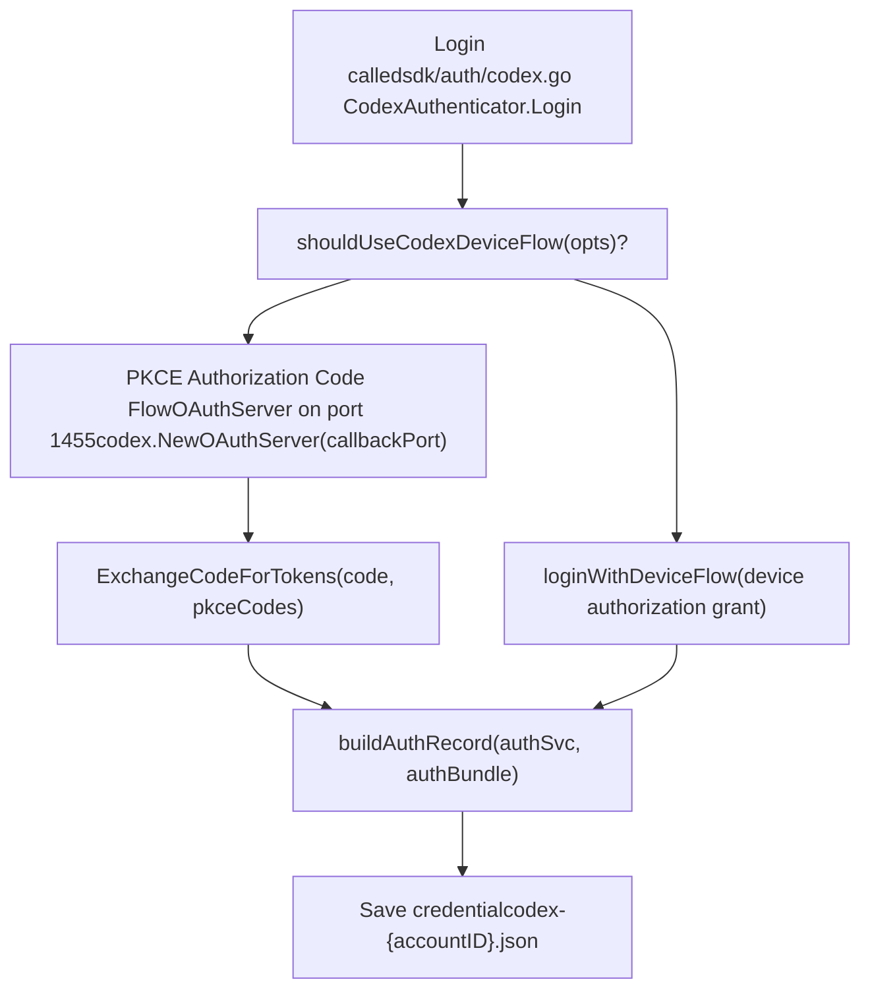
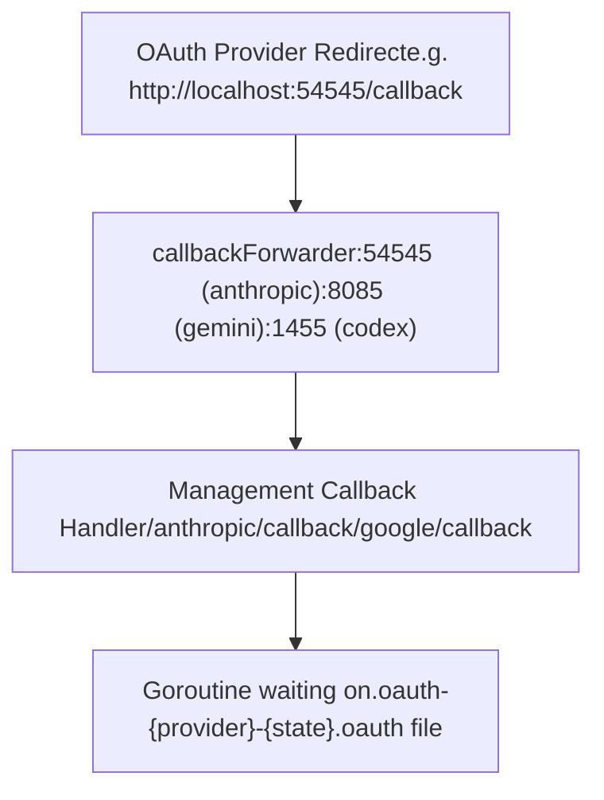

# Provider-Specific OAuth Setup

Relevant source files

-   [README.md](https://github.com/router-for-me/CLIProxyAPI/blob/c66cb0af/README.md)
-   [README\_CN.md](https://github.com/router-for-me/CLIProxyAPI/blob/c66cb0af/README_CN.md)
-   [internal/api/handlers/management/auth\_files.go](https://github.com/router-for-me/CLIProxyAPI/blob/c66cb0af/internal/api/handlers/management/auth_files.go)
-   [internal/auth/antigravity/auth.go](https://github.com/router-for-me/CLIProxyAPI/blob/c66cb0af/internal/auth/antigravity/auth.go)
-   [internal/auth/claude/token.go](https://github.com/router-for-me/CLIProxyAPI/blob/c66cb0af/internal/auth/claude/token.go)
-   [internal/auth/codex/token.go](https://github.com/router-for-me/CLIProxyAPI/blob/c66cb0af/internal/auth/codex/token.go)
-   [internal/auth/gemini/gemini\_token.go](https://github.com/router-for-me/CLIProxyAPI/blob/c66cb0af/internal/auth/gemini/gemini_token.go)
-   [internal/auth/iflow/iflow\_token.go](https://github.com/router-for-me/CLIProxyAPI/blob/c66cb0af/internal/auth/iflow/iflow_token.go)
-   [internal/auth/kimi/token.go](https://github.com/router-for-me/CLIProxyAPI/blob/c66cb0af/internal/auth/kimi/token.go)
-   [internal/auth/qwen/qwen\_token.go](https://github.com/router-for-me/CLIProxyAPI/blob/c66cb0af/internal/auth/qwen/qwen_token.go)
-   [internal/cmd/anthropic\_login.go](https://github.com/router-for-me/CLIProxyAPI/blob/c66cb0af/internal/cmd/anthropic_login.go)
-   [internal/cmd/iflow\_login.go](https://github.com/router-for-me/CLIProxyAPI/blob/c66cb0af/internal/cmd/iflow_login.go)
-   [internal/cmd/login.go](https://github.com/router-for-me/CLIProxyAPI/blob/c66cb0af/internal/cmd/login.go)
-   [internal/cmd/openai\_login.go](https://github.com/router-for-me/CLIProxyAPI/blob/c66cb0af/internal/cmd/openai_login.go)
-   [internal/cmd/qwen\_login.go](https://github.com/router-for-me/CLIProxyAPI/blob/c66cb0af/internal/cmd/qwen_login.go)
-   [internal/cmd/run.go](https://github.com/router-for-me/CLIProxyAPI/blob/c66cb0af/internal/cmd/run.go)
-   [internal/misc/credentials.go](https://github.com/router-for-me/CLIProxyAPI/blob/c66cb0af/internal/misc/credentials.go)
-   [sdk/auth/antigravity.go](https://github.com/router-for-me/CLIProxyAPI/blob/c66cb0af/sdk/auth/antigravity.go)
-   [sdk/auth/claude.go](https://github.com/router-for-me/CLIProxyAPI/blob/c66cb0af/sdk/auth/claude.go)
-   [sdk/auth/codex.go](https://github.com/router-for-me/CLIProxyAPI/blob/c66cb0af/sdk/auth/codex.go)
-   [sdk/auth/iflow.go](https://github.com/router-for-me/CLIProxyAPI/blob/c66cb0af/sdk/auth/iflow.go)
-   [sdk/auth/qwen.go](https://github.com/router-for-me/CLIProxyAPI/blob/c66cb0af/sdk/auth/qwen.go)

This page provides step-by-step instructions for completing OAuth authentication for each supported provider. It covers both the CLI flag approach and the Management API approach, describes the local callback ports in use, explains any provider-specific steps, and shows the resulting credential file name patterns.

For a conceptual explanation of how the OAuth 2.0 flow works internally (PKCE, local callback server, state validation, token exchange), see the [OAuth Flow Architecture](/router-for-me/CLIProxyAPI/7.1-oauth-flow-architecture) page. For details on how OAuth tokens are refreshed after initial setup, see [Token Refresh and Lifecycle](/router-for-me/CLIProxyAPI/7.4-token-refresh-and-lifecycle). For the full Management API reference, including all `/v0/management/*` routes used here, see the [Management API](/router-for-me/CLIProxyAPI/4.4-management-api) reference.

---

## Flow Types by Provider

Not all providers use the same OAuth mechanism. The table below summarizes the flow type, local callback port, and credential file pattern for each provider.

| Provider | Flow Type | Local Callback Port | Credential File Pattern |
| --- | --- | --- | --- |
| Gemini / Vertex | Authorization Code (Google OAuth2) | `8085` | `gemini-{email}-{projectID}.json` |
| Claude (Anthropic) | Authorization Code + PKCE | `54545` | `claude-{email}.json` |
| Codex (OpenAI) | Authorization Code + PKCE, or Device Flow | `1455` | `codex-{accountID}.json` |
| Antigravity | Authorization Code | `antigravity.CallbackPort` | `antigravity-{email}.json` |
| iFlow | Authorization Code | `iflow.CallbackPort` | `iflow-{email}-{timestamp}.json` |
| Qwen | Device Flow | N/A (polling) | `qwen-{email}.json` |
| Kimi | Device Flow | N/A (polling) | `kimi-{...}.json` |

The callback ports for Claude, Gemini, and Codex are defined as named constants in `internal/api/handlers/management/auth_files.go`:

[internal/api/handlers/management/auth\_files.go44-53](https://github.com/router-for-me/CLIProxyAPI/blob/c66cb0af/internal/api/handlers/management/auth_files.go#L44-L53)

---

## Initiating OAuth: Two Paths

Each provider can be authenticated either through a **CLI flag** (runs the flow directly in the terminal at startup) or through the **Management API** (triggers the flow from a running server instance). The Management API path is used by web UIs and remote management clients.

**Provider authenticator classes** diagram — showing the code entities involved in each path:

```mermaid
flowchart TD
    DL["DoLogininternal/cmd/login.go"]
    DCL["DoClaudeLogininternal/cmd/anthropic_login.go"]
    DCODEX["DoCodexLogininternal/cmd/openai_login.go"]
    DQL["DoQwenLogininternal/cmd/qwen_login.go"]
    DIL["DoIFlowLogininternal/cmd/iflow_login.go"]
    RAT["RequestAnthropicToken"]
    RGT["RequestGeminiCLIToken"]
    RCODEX["RequestCodexToken"]
    RANT["RequestAntigravityToken"]
    RQWEN["RequestQwenToken"]
    RIFLOW["RequestIFlowToken"]
    RKIMI["RequestKimiToken"]
    GA["GeminiAuthenticatorsdk/auth/gemini.go"]
    CA["ClaudeAuthenticatorsdk/auth/claude.go"]
    COXA["CodexAuthenticatorsdk/auth/codex.go"]
    AGA["AntigravityAuthenticatorsdk/auth/antigravity.go"]
    QA["QwenAuthenticatorsdk/auth/qwen.go"]
    IA["IFlowAuthenticatorsdk/auth/iflow.go"]

    DL --> GA
    DCL --> CA
    DCODEX --> COXA
    DQL --> QA
    DIL --> IA
    RAT --> CA
    RGT --> GA
    RCODEX --> COXA
    RANT --> AGA
    RQWEN --> QA
    RIFLOW --> IA
```


Sources: [internal/cmd/login.go51-209](https://github.com/router-for-me/CLIProxyAPI/blob/c66cb0af/internal/cmd/login.go#L51-L209) [internal/cmd/anthropic\_login.go22-59](https://github.com/router-for-me/CLIProxyAPI/blob/c66cb0af/internal/cmd/anthropic_login.go#L22-L59) [internal/cmd/openai\_login.go36-72](https://github.com/router-for-me/CLIProxyAPI/blob/c66cb0af/internal/cmd/openai_login.go#L36-L72) [internal/cmd/qwen\_login.go20-60](https://github.com/router-for-me/CLIProxyAPI/blob/c66cb0af/internal/cmd/qwen_login.go#L20-L60) [internal/cmd/iflow\_login.go14-48](https://github.com/router-for-me/CLIProxyAPI/blob/c66cb0af/internal/cmd/iflow_login.go#L14-L48) [internal/api/handlers/management/auth\_files.go956-1099](https://github.com/router-for-me/CLIProxyAPI/blob/c66cb0af/internal/api/handlers/management/auth_files.go#L956-L1099)

---

## Gemini / Vertex AI

**Flow:** Standard OAuth2 authorization code flow using Google's OAuth endpoint. After the token is obtained, a GCP project must be selected or auto-discovered, and the Gemini Code Assist API is onboarded for that project.

**CLI:**

```
./cliproxyapi --login [--project_id <YOUR_PROJECT_ID>]
```
**Management API:**

```
POST /v0/management/auth/gemini
```
Optionally pass `?project_id=<id>` and `?is_webui=true` (the latter starts a local HTTP forwarder on port `8085` to redirect the OAuth callback to the running server).

### Gemini Login Flow

**Project Selection:**

-   If `--project_id` is omitted, the CLI fetches your GCP projects via `fetchGCPProjects` and prompts interactively.
-   Type `ALL` to onboard every listed project.
-   The login mode prompt lets you choose between **Code Assist** (manual GCP project) and **Google One** (auto-discovery).

`performGeminiCLISetup` in `internal/cmd/login.go` calls `loadCodeAssist` and `onboardUser` on the Gemini CLI endpoint (`https://cloudcode-pa.googleapis.com/v1internal`). If the backend returns a different project ID than the requested one for free-tier accounts, it prompts for confirmation.

[internal/cmd/login.go211-390](https://github.com/router-for-me/CLIProxyAPI/blob/c66cb0af/internal/cmd/login.go#L211-L390)

**Credential file:** `gemini-{email}-{projectID}.json` (multi-project: `gemini-{email}-all.json`)

`CredentialFileName` in `internal/auth/gemini/gemini_token.go` controls this naming.

[internal/auth/gemini/gemini\_token.go93-104](https://github.com/router-for-me/CLIProxyAPI/blob/c66cb0af/internal/auth/gemini/gemini_token.go#L93-L104)

Sources: [internal/cmd/login.go51-209](https://github.com/router-for-me/CLIProxyAPI/blob/c66cb0af/internal/cmd/login.go#L51-L209) [internal/api/handlers/management/auth\_files.go1101-1200](https://github.com/router-for-me/CLIProxyAPI/blob/c66cb0af/internal/api/handlers/management/auth_files.go#L1101-L1200)

---

## Claude (Anthropic)

**Flow:** Authorization code + PKCE. A local OAuth server starts on port `54545`. PKCE codes are generated by `claude.GeneratePKCECodes()`.

**CLI:**

```
./cliproxyapi --login_anthropic
```
**Management API:**

```
POST /v0/management/auth/anthropic
```
Pass `?is_webui=true` to start a forwarder on port `54545` that redirects to the running server's `/anthropic/callback`.

### Claude Login Flow

**Notes:**

-   If no browser is available, the URL is printed to stdout and SSH tunnel instructions are shown via `util.PrintSSHTunnelInstructions`.
-   If `opts.Prompt` is set, after 15 seconds the user is asked to paste the callback URL manually.
-   The callback URL's `state` parameter is validated to prevent CSRF.
-   If the exchange returns an API key in `authBundle.APIKey`, it is stored in the credential file.

[sdk/auth/claude.go38-214](https://github.com/router-for-me/CLIProxyAPI/blob/c66cb0af/sdk/auth/claude.go#L38-L214)

**Credential file:** `claude-{email}.json`

Sources: [internal/cmd/anthropic\_login.go22-59](https://github.com/router-for-me/CLIProxyAPI/blob/c66cb0af/internal/cmd/anthropic_login.go#L22-L59) [sdk/auth/claude.go38-214](https://github.com/router-for-me/CLIProxyAPI/blob/c66cb0af/sdk/auth/claude.go#L38-L214) [internal/api/handlers/management/auth\_files.go956-1099](https://github.com/router-for-me/CLIProxyAPI/blob/c66cb0af/internal/api/handlers/management/auth_files.go#L956-L1099)

---

## Codex (OpenAI)

**Flow:** Authorization code + PKCE by default. A device flow is also supported when `shouldUseCodexDeviceFlow(opts)` returns true. The local callback server starts on port `1455`.

**CLI:**

```
./cliproxyapi --login_codex [--device_flow]
```
**Management API:**

```
POST /v0/management/auth/codex
```
### Codex Flow Selection


**Notes:**

-   Like Claude, the Codex PKCE flow uses `codex.GeneratePKCECodes()` and a local `codex.NewOAuthServer(callbackPort)`.
-   The `id_token` in the credential contains JWT claims including `chatgpt_account_id` and subscription info, which are extracted by `extractCodexIDTokenClaims` in `auth_files.go`.
-   The `RefreshLead` for Codex tokens is 5 days, longer than other providers.

[sdk/auth/codex.go38-192](https://github.com/router-for-me/CLIProxyAPI/blob/c66cb0af/sdk/auth/codex.go#L38-L192)

**Credential file:** Named based on account information extracted from the token bundle.

Sources: [internal/cmd/openai\_login.go36-72](https://github.com/router-for-me/CLIProxyAPI/blob/c66cb0af/internal/cmd/openai_login.go#L36-L72) [sdk/auth/codex.go38-192](https://github.com/router-for-me/CLIProxyAPI/blob/c66cb0af/sdk/auth/codex.go#L38-L192) [internal/auth/codex/token.go1-82](https://github.com/router-for-me/CLIProxyAPI/blob/c66cb0af/internal/auth/codex/token.go#L1-L82)

---

## Antigravity

**Flow:** Standard authorization code flow. The local callback server listens at `/oauth-callback`. After token exchange, user info (`FetchUserInfo`) and GCP project ID (`FetchProjectID`) are fetched automatically.

**CLI:**

```
./cliproxyapi --login_antigravity
```
**Management API:**

```
POST /v0/management/auth/antigravity
```
### Antigravity Post-Auth Steps

After the authorization code is exchanged, the `AntigravityAuthenticator.Login` in `sdk/auth/antigravity.go` performs two additional calls:

1.  `authSvc.FetchUserInfo(ctx, accessToken)` — retrieves the user's email from Google's userinfo endpoint.
2.  `authSvc.FetchProjectID(ctx, accessToken)` — calls `loadCodeAssist` on the Antigravity API endpoint. If no project is returned, it falls back to `OnboardUser` polling.

[sdk/auth/antigravity.go160-213](https://github.com/router-for-me/CLIProxyAPI/blob/c66cb0af/sdk/auth/antigravity.go#L160-L213)

**Credential file:** `antigravity-{email}.json` (via `antigravity.CredentialFileName(email)`)

Sources: [sdk/auth/antigravity.go1-265](https://github.com/router-for-me/CLIProxyAPI/blob/c66cb0af/sdk/auth/antigravity.go#L1-L265) [internal/auth/antigravity/auth.go1-344](https://github.com/router-for-me/CLIProxyAPI/blob/c66cb0af/internal/auth/antigravity/auth.go#L1-L344)

---

## iFlow

**Flow:** Authorization code flow using a local OAuth server. The callback server is managed by `iflow.NewOAuthServer(callbackPort)`.

**CLI:**

```
./cliproxyapi --login_iflow
```
**Management API:**

```
POST /v0/management/auth/iflow
```
After the token exchange via `authSvc.ExchangeCodeForTokens`, `authSvc.CreateTokenStorage` builds an `IFlowTokenStorage` that includes both an `access_token` and a derived `api_key` field.

[sdk/auth/iflow.go33-190](https://github.com/router-for-me/CLIProxyAPI/blob/c66cb0af/sdk/auth/iflow.go#L33-L190)

**Credential file:** `iflow-{email}-{unix_timestamp}.json`

The timestamp in the filename allows multiple iFlow accounts to coexist without collisions.

Sources: [internal/cmd/iflow\_login.go14-48](https://github.com/router-for-me/CLIProxyAPI/blob/c66cb0af/internal/cmd/iflow_login.go#L14-L48) [sdk/auth/iflow.go33-190](https://github.com/router-for-me/CLIProxyAPI/blob/c66cb0af/sdk/auth/iflow.go#L33-L190) [internal/auth/iflow/iflow\_token.go1-59](https://github.com/router-for-me/CLIProxyAPI/blob/c66cb0af/internal/auth/iflow/iflow_token.go#L1-L59)

---

## Qwen

**Flow:** OAuth 2.0 Device Authorization Grant. There is no local callback server. Instead, the user visits a URL displayed in the terminal, and the application polls for token completion.

**CLI:**

```
./cliproxyapi --login_qwen
```
**Management API:**

```
POST /v0/management/auth/qwen
```
### Qwen Device Flow

**Important:** The Qwen authenticator requires an email address or alias to name the credential file. If `opts.Metadata["email"]` is not set, `opts.Prompt` is called to ask the user. If neither is available, an `EmailRequiredError` is returned.

[sdk/auth/qwen.go33-113](https://github.com/router-for-me/CLIProxyAPI/blob/c66cb0af/sdk/auth/qwen.go#L33-L113)

**Credential file:** `qwen-{email}.json`

Sources: [internal/cmd/qwen\_login.go20-60](https://github.com/router-for-me/CLIProxyAPI/blob/c66cb0af/internal/cmd/qwen_login.go#L20-L60) [sdk/auth/qwen.go33-113](https://github.com/router-for-me/CLIProxyAPI/blob/c66cb0af/sdk/auth/qwen.go#L33-L113) [internal/auth/qwen/qwen\_token.go1-79](https://github.com/router-for-me/CLIProxyAPI/blob/c66cb0af/internal/auth/qwen/qwen_token.go#L1-L79)

---

## Kimi

**Flow:** OAuth 2.0 Device Authorization Grant, similar to Qwen. There is no local callback server.

**Management API:**

```
POST /v0/management/auth/kimi
```
The `KimiTokenStorage` struct in `internal/auth/kimi/token.go` stores the device ID alongside standard OAuth fields. The `DeviceID` field is included in the credential JSON and used in subsequent API requests.

**Credential file:** `kimi-{...}.json`

[internal/auth/kimi/token.go1-132](https://github.com/router-for-me/CLIProxyAPI/blob/c66cb0af/internal/auth/kimi/token.go#L1-L132)

Sources: [internal/auth/kimi/token.go1-132](https://github.com/router-for-me/CLIProxyAPI/blob/c66cb0af/internal/auth/kimi/token.go#L1-L132) [internal/api/handlers/management/auth\_files.go26-40](https://github.com/router-for-me/CLIProxyAPI/blob/c66cb0af/internal/api/handlers/management/auth_files.go#L26-L40)

---

## Credential File Format

All credential files are JSON stored in the `auth_dir` configured in `config.yaml`. Each file has a `"type"` field that identifies the provider. The auth manager loads these files at startup and uses the `type` field to route them to the correct executor.

| Field | Description |
| --- | --- |
| `type` | Provider identifier (`gemini`, `claude`, `codex`, `antigravity`, `qwen`, `iflow`, `kimi`) |
| `access_token` | Current OAuth access token |
| `refresh_token` | Token used for silent renewal |
| `expired` | RFC3339 or Unix timestamp of access token expiry |
| `email` | Account identifier (most providers) |
| `project_id` | GCP project (Gemini, Antigravity only) |
| `id_token` | JWT identity token (Codex, Claude only) |

The `SaveTokenToFile` methods on each `*TokenStorage` struct (`GeminiTokenStorage`, `ClaudeTokenStorage`, `CodexTokenStorage`, etc.) serialize these fields plus any injected metadata via `misc.MergeMetadata`.

[internal/misc/credentials.go30-61](https://github.com/router-for-me/CLIProxyAPI/blob/c66cb0af/internal/misc/credentials.go#L30-L61)

---

## Web UI / Remote OAuth (`is_webui` Mode)

When calling the Management API from a web UI that cannot intercept the OAuth redirect directly, pass `?is_webui=true`. The server starts a `callbackForwarder` — a temporary HTTP server on the provider's expected callback port — that redirects incoming OAuth callbacks to the running proxy server's own `/anthropic/callback` or `/google/callback` route.

The `startCallbackForwarder` and `stopCallbackForwarder` functions in `auth_files.go` manage this lifecycle.

[internal/api/handlers/management/auth\_files.go132-234](https://github.com/router-for-me/CLIProxyAPI/blob/c66cb0af/internal/api/handlers/management/auth_files.go#L132-L234)


Sources: [internal/api/handlers/management/auth\_files.go132-234](https://github.com/router-for-me/CLIProxyAPI/blob/c66cb0af/internal/api/handlers/management/auth_files.go#L132-L234) [internal/api/handlers/management/auth\_files.go990-1100](https://github.com/router-for-me/CLIProxyAPI/blob/c66cb0af/internal/api/handlers/management/auth_files.go#L990-L1100)
