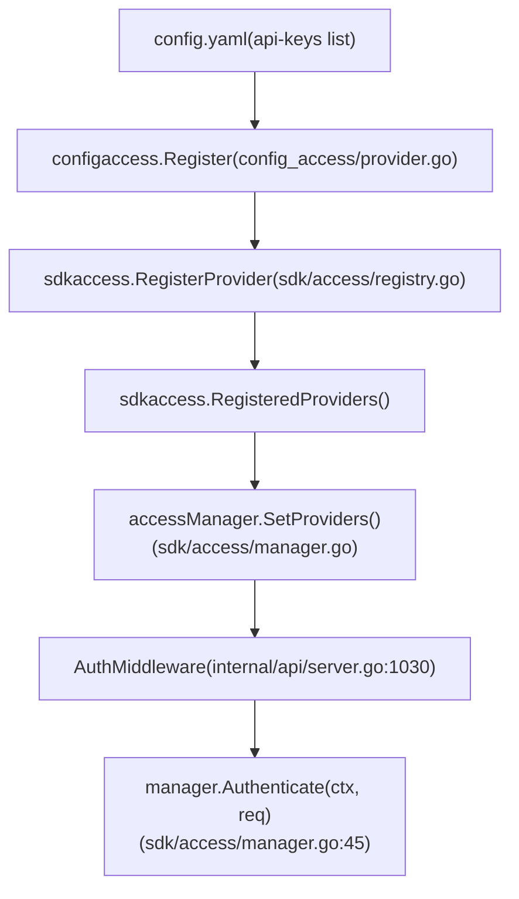
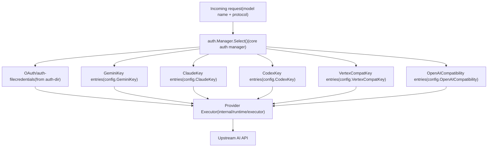
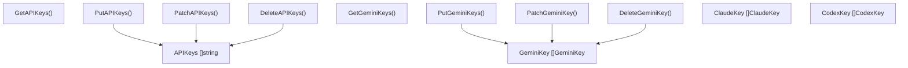

# API Key and Service Account Management

Relevant source files

-   [config.example.yaml](https://github.com/router-for-me/CLIProxyAPI/blob/c66cb0af/config.example.yaml)
-   [docs/sdk-access.md](https://github.com/router-for-me/CLIProxyAPI/blob/c66cb0af/docs/sdk-access.md)
-   [docs/sdk-access\_CN.md](https://github.com/router-for-me/CLIProxyAPI/blob/c66cb0af/docs/sdk-access_CN.md)
-   [internal/access/config\_access/provider.go](https://github.com/router-for-me/CLIProxyAPI/blob/c66cb0af/internal/access/config_access/provider.go)
-   [internal/access/reconcile.go](https://github.com/router-for-me/CLIProxyAPI/blob/c66cb0af/internal/access/reconcile.go)
-   [internal/api/handlers/management/config\_basic.go](https://github.com/router-for-me/CLIProxyAPI/blob/c66cb0af/internal/api/handlers/management/config_basic.go)
-   [internal/api/handlers/management/config\_lists.go](https://github.com/router-for-me/CLIProxyAPI/blob/c66cb0af/internal/api/handlers/management/config_lists.go)
-   [internal/api/server.go](https://github.com/router-for-me/CLIProxyAPI/blob/c66cb0af/internal/api/server.go)
-   [internal/config/config.go](https://github.com/router-for-me/CLIProxyAPI/blob/c66cb0af/internal/config/config.go)
-   [internal/watcher/watcher.go](https://github.com/router-for-me/CLIProxyAPI/blob/c66cb0af/internal/watcher/watcher.go)
-   [sdk/access/errors.go](https://github.com/router-for-me/CLIProxyAPI/blob/c66cb0af/sdk/access/errors.go)
-   [sdk/access/manager.go](https://github.com/router-for-me/CLIProxyAPI/blob/c66cb0af/sdk/access/manager.go)
-   [sdk/access/registry.go](https://github.com/router-for-me/CLIProxyAPI/blob/c66cb0af/sdk/access/registry.go)
-   [sdk/cliproxy/builder.go](https://github.com/router-for-me/CLIProxyAPI/blob/c66cb0af/sdk/cliproxy/builder.go)
-   [sdk/cliproxy/service.go](https://github.com/router-for-me/CLIProxyAPI/blob/c66cb0af/sdk/cliproxy/service.go)
-   [sdk/config/config.go](https://github.com/router-for-me/CLIProxyAPI/blob/c66cb0af/sdk/config/config.go)
-   [test/amp\_management\_test.go](https://github.com/router-for-me/CLIProxyAPI/blob/c66cb0af/test/amp_management_test.go)

This page covers two distinct concerns that both use the word "key":

1.  **Incoming access control** — the `api-keys` list in `config.yaml` used to authenticate requests arriving at CLIProxyAPI from clients (e.g. an AI CLI tool).
2.  **Provider credentials** — the `gemini-api-key`, `claude-api-key`, `codex-api-key`, `openai-compatibility`, and `vertex-api-key` entries that CLIProxyAPI uses when forwarding requests to upstream AI providers.

For OAuth-based provider credentials and token refresh, see page [7.2](/router-for-me/CLIProxyAPI/7.2-provider-specific-oauth-setup) and [7.4](/router-for-me/CLIProxyAPI/7.4-token-refresh-and-lifecycle). For the broader authentication manager and credential routing/failover, see page [3.3](/router-for-me/CLIProxyAPI/3.3-authentication-and-credential-management) and [8.1](/router-for-me/CLIProxyAPI/8.1-credential-routing-and-failover).

---

## Incoming Request Authentication

CLIProxyAPI can require that every API call it receives includes one of the keys listed under `api-keys` in `config.yaml`. When no keys are configured, the server allows all requests through (open access).

### Configuration

```
api-keys:  - "your-api-key-1"  - "your-api-key-2"
```
These values are defined in `SDKConfig` inside [internal/config/config.go](https://github.com/router-for-me/CLIProxyAPI/blob/c66cb0af/internal/config/config.go) (the `APIKeys []string` field) and are loaded at startup via `LoadConfig`.

### The `config-api-key` Access Provider

The incoming-request authentication system is built around the `sdk/access` package. The concrete implementation for config-file keys lives in [internal/access/config\_access/provider.go](https://github.com/router-for-me/CLIProxyAPI/blob/c66cb0af/internal/access/config_access/provider.go)

**Credential locations inspected (in order):**

| Source | Header / Parameter |
| --- | --- |
| `authorization` | `Authorization: Bearer <key>` |
| `x-goog-api-key` | `X-Goog-Api-Key: <key>` |
| `x-api-key` | `X-Api-Key: <key>` |
| `query-key` | `?key=<key>` |
| `query-auth-token` | `?auth_token=<key>` |

The `provider` struct [internal/access/config\_access/provider.go31-35](https://github.com/router-for-me/CLIProxyAPI/blob/c66cb0af/internal/access/config_access/provider.go#L31-L35) stores the allowed keys in a `map[string]struct{}` for O(1) lookup. The `Authenticate` method [internal/access/config\_access/provider.go55-104](https://github.com/router-for-me/CLIProxyAPI/blob/c66cb0af/internal/access/config_access/provider.go#L55-L104) checks each credential location and returns:

-   `Result` with `Principal` = the matched key string, on success.
-   `NewInvalidCredentialError()` if a credential was supplied but not found in the set.
-   `NewNoCredentialsError()` if no credential was supplied at all.

`Register` in [internal/access/config\_access/provider.go13-29](https://github.com/router-for-me/CLIProxyAPI/blob/c66cb0af/internal/access/config_access/provider.go#L13-L29) is called on startup and on every config reload. If `APIKeys` is empty, the provider is unregistered, making the server unauthenticated.

### The Access Manager and Middleware

**Access manager initialization:**

```
Access Manager Flow
```

Sources: [internal/access/config\_access/provider.go](https://github.com/router-for-me/CLIProxyAPI/blob/c66cb0af/internal/access/config_access/provider.go) [sdk/access/registry.go](https://github.com/router-for-me/CLIProxyAPI/blob/c66cb0af/sdk/access/registry.go) [sdk/access/manager.go](https://github.com/router-for-me/CLIProxyAPI/blob/c66cb0af/sdk/access/manager.go) [internal/api/server.go1030-1050](https://github.com/router-for-me/CLIProxyAPI/blob/c66cb0af/internal/api/server.go#L1030-L1050)

The `AuthMiddleware` function [internal/api/server.go1030-1050](https://github.com/router-for-me/CLIProxyAPI/blob/c66cb0af/internal/api/server.go#L1030-L1050) is applied as Gin middleware to the `/v1` and `/v1beta` route groups. If `manager` is `nil` or has no providers, every request passes through. If `manager.Authenticate` returns an error, the middleware aborts with HTTP 401.

On success, the middleware sets two Gin context values:

-   `"apiKey"` → `result.Principal` (the matched key string)
-   `"accessProvider"` → `result.Provider`

These values are available to handlers downstream for logging and usage attribution.

### Hot Reload Behavior

When `config.yaml` changes, `applyAccessConfig` [internal/api/server.go864-871](https://github.com/router-for-me/CLIProxyAPI/blob/c66cb0af/internal/api/server.go#L864-L871) calls `access.ApplyAccessProviders` [internal/access/reconcile.go82-105](https://github.com/router-for-me/CLIProxyAPI/blob/c66cb0af/internal/access/reconcile.go#L82-L105) which calls `configaccess.Register` with the new config and updates `accessManager.SetProviders`. This happens without restarting the server — see [3.7](/router-for-me/CLIProxyAPI/3.7-hot-reload-and-configuration-updates) for the full hot-reload mechanism.

---

## Provider API Keys

These are credentials CLIProxyAPI uses to authenticate its own requests to upstream AI APIs. Each provider type has its own configuration structure.

### Key Types Summary

| Config Key | Go Type | Provider |
| --- | --- | --- |
| `gemini-api-key` | `config.GeminiKey` | Google Gemini REST API |
| `claude-api-key` | `config.ClaudeKey` | Anthropic Claude API |
| `codex-api-key` | `config.CodexKey` | OpenAI Codex/Responses API |
| `openai-compatibility[].api-key-entries` | `config.OpenAICompatibilityAPIKey` | Any OpenAI-compatible endpoint |
| `vertex-api-key` | `config.VertexCompatKey` | Vertex AI-style API with `x-goog-api-key` |

Sources: [internal/config/config.go85-103](https://github.com/router-for-me/CLIProxyAPI/blob/c66cb0af/internal/config/config.go#L85-L103)

### Common Fields

All key types share a common set of optional routing fields:

| Field | Purpose |
| --- | --- |
| `api-key` | The credential string sent to the upstream provider |
| `base-url` | Override the default API endpoint |
| `proxy-url` | Per-key HTTP/SOCKS5 proxy override |
| `prefix` | Namespace prefix; clients must send `prefix/model-name` to use this key |
| `priority` | Higher value = preferred when multiple credentials match |
| `models` | Optional model-to-alias mappings for this credential |
| `headers` | Extra HTTP headers injected into every request using this key |
| `excluded-models` | Models excluded from this credential (exact, wildcard prefix/suffix/substring) |

### Gemini API Keys

Defined by `config.GeminiKey` [internal/config/config.go408-433](https://github.com/router-for-me/CLIProxyAPI/blob/c66cb0af/internal/config/config.go#L408-L433)

```
gemini-api-key:  - api-key: "AIzaSy..."    base-url: "https://generativelanguage.googleapis.com"    models:      - name: "gemini-2.5-flash"        alias: "gemini-flash"    excluded-models:      - "gemini-2.5-pro"      - "*-preview"
```
`SanitizeGeminiKeys` [internal/config/config.go](https://github.com/router-for-me/CLIProxyAPI/blob/c66cb0af/internal/config/config.go) is called at load time and after management API updates to normalize key entries.

### Claude API Keys

Defined by `config.ClaudeKey` [internal/config/config.go312-341](https://github.com/router-for-me/CLIProxyAPI/blob/c66cb0af/internal/config/config.go#L312-L341)

In addition to the common fields, `ClaudeKey` supports:

-   `cloak` — a `CloakConfig` block to disguise requests as originating from the Claude Code CLI. This can help with some provider restrictions.

```
claude-api-key:  - api-key: "sk-ant-..."    cloak:      mode: "auto"          # auto | always | never      strict-mode: false
```
### Codex API Keys

Defined by `config.CodexKey` [internal/config/config.go360-389](https://github.com/router-for-me/CLIProxyAPI/blob/c66cb0af/internal/config/config.go#L360-L389)

Additional field:

-   `websockets: true` — enables the Responses API WebSocket transport for this credential.

### OpenAI-Compatible Provider Keys

Defined by `config.OpenAICompatibility` [internal/config/config.go452-474](https://github.com/router-for-me/CLIProxyAPI/blob/c66cb0af/internal/config/config.go#L452-L474) and `config.OpenAICompatibilityAPIKey` [internal/config/config.go477-483](https://github.com/router-for-me/CLIProxyAPI/blob/c66cb0af/internal/config/config.go#L477-L483)

Multiple API keys are listed under `api-key-entries` within a single provider block (which has a `name`, `base-url`, and `models`). Each entry can independently override `proxy-url`.

```
openai-compatibility:  - name: "openrouter"    base-url: "https://openrouter.ai/api/v1"    api-key-entries:      - api-key: "sk-or-v1-...a"      - api-key: "sk-or-v1-...b"        proxy-url: "socks5://proxy.example.com:1080"    models:      - name: "moonshotai/kimi-k2:free"        alias: "kimi-k2"
```
### Vertex-Compatible API Keys

Defined by `config.VertexCompatKey` [internal/config/config.go](https://github.com/router-for-me/CLIProxyAPI/blob/c66cb0af/internal/config/config.go) under `vertex-api-key`. These are for third-party services that use a Vertex AI-style request path with simple API key authentication (`x-goog-api-key` header). A `base-url` is required.

---

## Google Vertex AI Service Account Keys

For actual Google Vertex AI, CLIProxyAPI supports service account key files (JSON) imported via the management API endpoint `POST /v0/management/vertex/import`. This is distinct from the `vertex-api-key` config entries, which target third-party Vertex-compatible APIs.

Imported service account credentials are stored as auth files in the `auth-dir` directory and managed the same way as OAuth token files. See page [6.1](/router-for-me/CLIProxyAPI/6.1-google-gemini-and-vertex-ai) for Vertex AI provider details.

---

## Key Lifecycle and Credential Routing

**How CLIProxyAPI maps a request to a provider key:**

```
Request to Key Resolution
```

Sources: [sdk/cliproxy/service.go362-428](https://github.com/router-for-me/CLIProxyAPI/blob/c66cb0af/sdk/cliproxy/service.go#L362-L428) [internal/config/config.go85-103](https://github.com/router-for-me/CLIProxyAPI/blob/c66cb0af/internal/config/config.go#L85-L103)

Multiple keys of the same provider type participate in round-robin or fill-first selection. A key with higher `priority` is preferred. A key on cooldown (after upstream errors) is skipped until its cooldown expires. See page [8.1](/router-for-me/CLIProxyAPI/8.1-credential-routing-and-failover) for full credential routing and failover documentation.

The total count of active credentials is logged on every config update by `UpdateClients` [internal/api/server.go879-1016](https://github.com/router-for-me/CLIProxyAPI/blob/c66cb0af/internal/api/server.go#L879-L1016):

```
server clients and configuration updated: N clients (M auth entries + P Gemini API keys + Q Claude API keys + ...)
```
---

## Managing Keys via the Management API

All provider key lists are readable and writable at runtime through the management API (requires a configured `remote-management.secret-key` or `MANAGEMENT_PASSWORD` environment variable).

**Per-provider management endpoints:**

| Provider | Endpoints |
| --- | --- |
| Incoming `api-keys` | `GET/PUT/PATCH/DELETE /v0/management/api-keys` |
| Gemini | `GET/PUT/PATCH/DELETE /v0/management/gemini-api-key` |
| Claude | `GET/PUT/PATCH/DELETE /v0/management/claude-api-key` |
| Codex | `GET/PUT/PATCH/DELETE /v0/management/codex-api-key` |
| OpenAI-compat | `GET/PUT/PATCH/DELETE /v0/management/openai-compatibility` |
| Vertex-compat | `GET/PUT/PATCH/DELETE /v0/management/vertex-api-key` |

Sources: [internal/api/server.go534-613](https://github.com/router-for-me/CLIProxyAPI/blob/c66cb0af/internal/api/server.go#L534-L613) [internal/api/handlers/management/config\_lists.go](https://github.com/router-for-me/CLIProxyAPI/blob/c66cb0af/internal/api/handlers/management/config_lists.go)

Each endpoint family supports:

-   `GET` — return the current list as JSON.
-   `PUT` — replace the entire list. Body must be a JSON array or `{"items": [...]}`.
-   `PATCH` — update a single entry identified by `index` or `match` (key value or name).
-   `DELETE` — remove an entry by `index` query param or by matching value (`api-key`, `name`, etc.).

**PATCH body format (example for Gemini):**

```
{  "index": 0,  "value": {    "api-key": "AIzaSy...",    "base-url": "https://generativelanguage.googleapis.com",    "excluded-models": ["gemini-2.5-pro"]  }}
```
After each write, the handler calls `h.persist(c)` which writes the updated config back to `config.yaml` on disk, preserving comments. The running server picks up the change immediately via the in-memory config object; the file watcher ([3.7](/router-for-me/CLIProxyAPI/3.7-hot-reload-and-configuration-updates)) picks it up for any other processes watching the same file.

**Handler implementations:**

```
Management API Key CRUD
```

Sources: [internal/api/handlers/management/config\_lists.go107-242](https://github.com/router-for-me/CLIProxyAPI/blob/c66cb0af/internal/api/handlers/management/config_lists.go#L107-L242)

---

## Key Prefix and Model Namespacing

Every provider key type (Gemini, Claude, Codex, OpenAI-compat, Vertex-compat) supports an optional `prefix` field. When set, requests for models under that credential must include `prefix/model-name`. The global `force-model-prefix: true` config option extends this enforcement: when enabled, unprefixed model requests only match credentials that have no prefix.

Example with `prefix: "team-a"`:

```
gemini-api-key:  - api-key: "AIzaSy..."    prefix: "team-a"    models:      - name: "gemini-2.5-pro"        alias: "pro"
```
A client sending `model: "team-a/pro"` would route to this key. A client sending `model: "pro"` would not (when `force-model-prefix` is true).

Sources: [internal/config/config.go416-418](https://github.com/router-for-me/CLIProxyAPI/blob/c66cb0af/internal/config/config.go#L416-L418) [config.example.yaml68-69](https://github.com/router-for-me/CLIProxyAPI/blob/c66cb0af/config.example.yaml#L68-L69)
