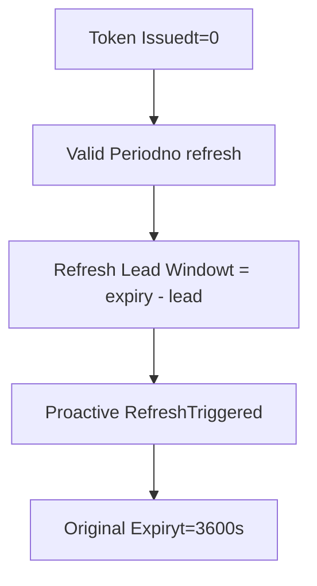
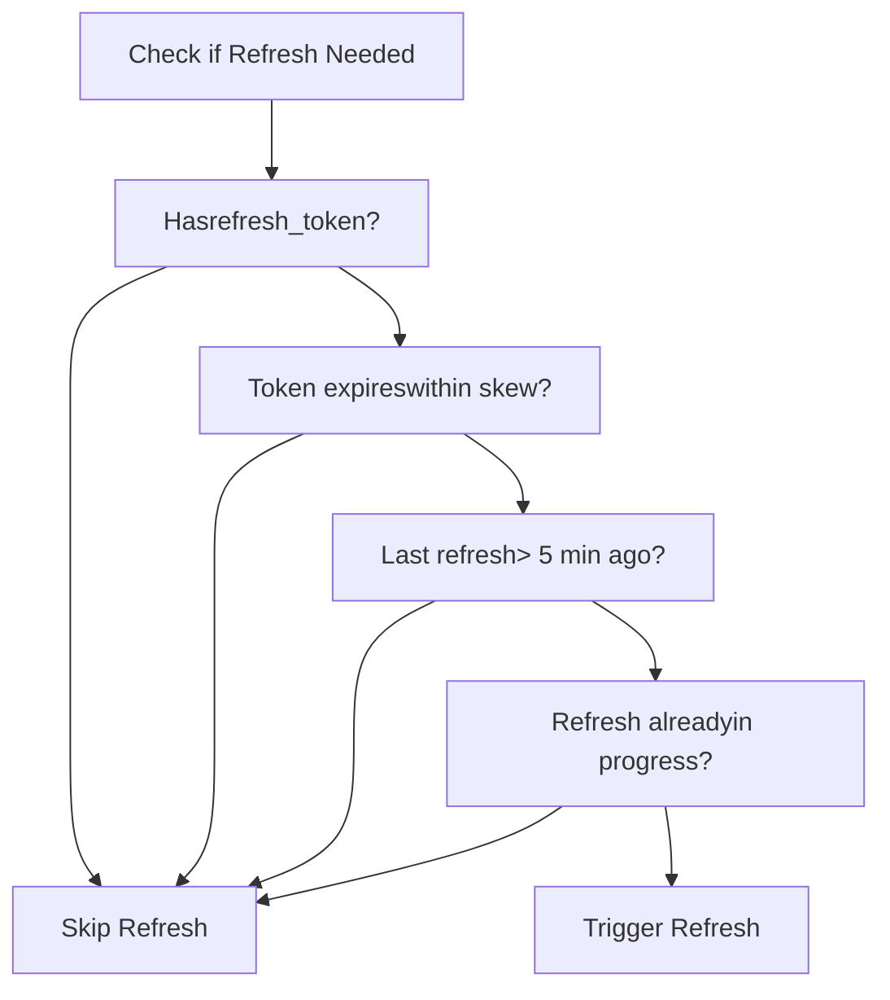
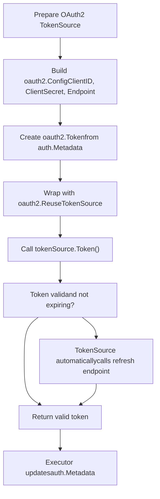
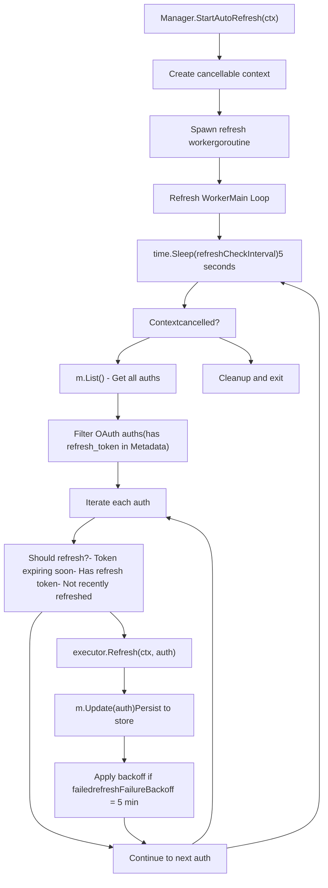
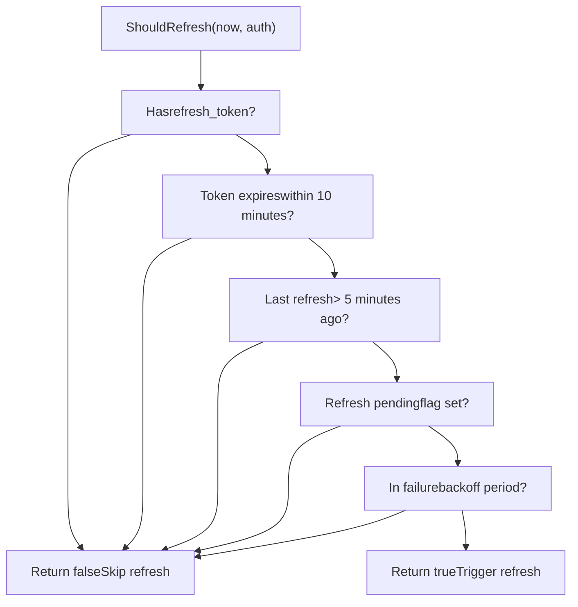
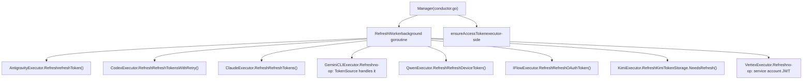
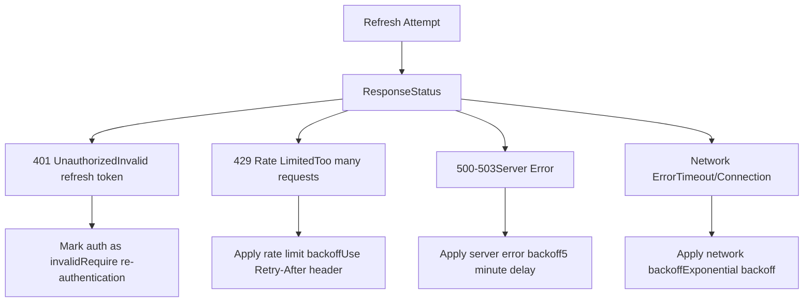
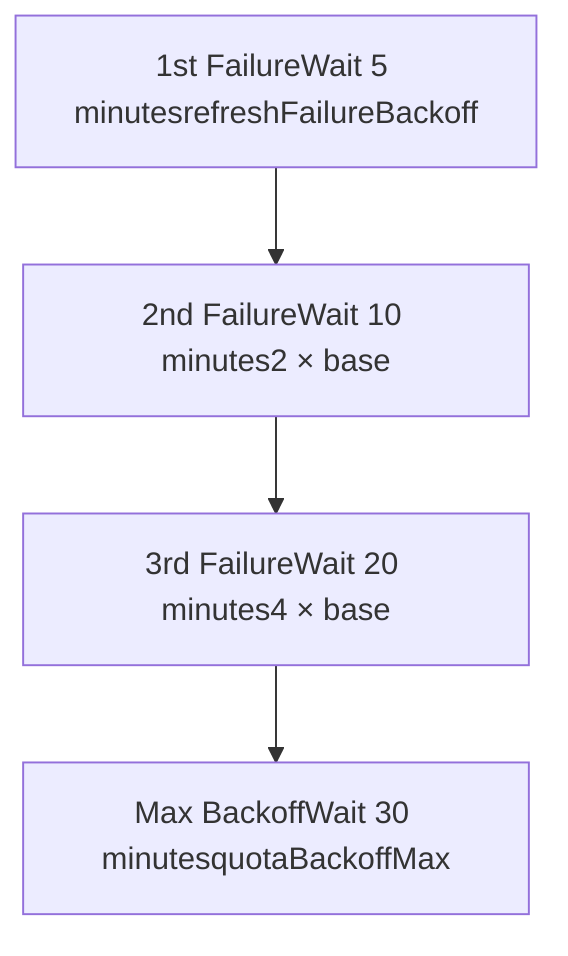
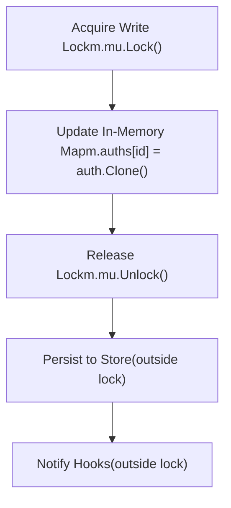

# Token Refresh and Lifecycle

Relevant source files

-   [internal/auth/claude/token.go](https://github.com/router-for-me/CLIProxyAPI/blob/c66cb0af/internal/auth/claude/token.go)
-   [internal/auth/codex/token.go](https://github.com/router-for-me/CLIProxyAPI/blob/c66cb0af/internal/auth/codex/token.go)
-   [internal/auth/gemini/gemini\_token.go](https://github.com/router-for-me/CLIProxyAPI/blob/c66cb0af/internal/auth/gemini/gemini_token.go)
-   [internal/auth/iflow/iflow\_token.go](https://github.com/router-for-me/CLIProxyAPI/blob/c66cb0af/internal/auth/iflow/iflow_token.go)
-   [internal/auth/kimi/token.go](https://github.com/router-for-me/CLIProxyAPI/blob/c66cb0af/internal/auth/kimi/token.go)
-   [internal/auth/qwen/qwen\_token.go](https://github.com/router-for-me/CLIProxyAPI/blob/c66cb0af/internal/auth/qwen/qwen_token.go)
-   [internal/misc/credentials.go](https://github.com/router-for-me/CLIProxyAPI/blob/c66cb0af/internal/misc/credentials.go)
-   [internal/watcher/config\_reload.go](https://github.com/router-for-me/CLIProxyAPI/blob/c66cb0af/internal/watcher/config_reload.go)
-   [sdk/cliproxy/auth/conductor.go](https://github.com/router-for-me/CLIProxyAPI/blob/c66cb0af/sdk/cliproxy/auth/conductor.go)
-   [sdk/cliproxy/auth/selector.go](https://github.com/router-for-me/CLIProxyAPI/blob/c66cb0af/sdk/cliproxy/auth/selector.go)
-   [sdk/cliproxy/auth/selector\_test.go](https://github.com/router-for-me/CLIProxyAPI/blob/c66cb0af/sdk/cliproxy/auth/selector_test.go)
-   [sdk/cliproxy/auth/types.go](https://github.com/router-for-me/CLIProxyAPI/blob/c66cb0af/sdk/cliproxy/auth/types.go)
-   [sdk/cliproxy/auth/types\_test.go](https://github.com/router-for-me/CLIProxyAPI/blob/c66cb0af/sdk/cliproxy/auth/types_test.go)

This document explains how CLIProxyAPI manages OAuth access token lifecycles, including automatic refresh, expiry detection, and provider-specific refresh mechanisms. For information about initial OAuth authentication flows, see [OAuth Flow Architecture](/router-for-me/CLIProxyAPI/7.1-oauth-flow-architecture). For details on credential storage backends, see [API Key and Service Account Management](/router-for-me/CLIProxyAPI/7.3-api-key-and-service-account-management).

## Overview

CLIProxyAPI supports multiple authentication credential types across different AI service providers:

-   **OAuth Access Tokens**: Short-lived tokens (typically 1 hour) that require periodic refresh using refresh tokens
-   **API Keys**: Static credentials that don't expire (e.g., Gemini API keys, Claude API keys)
-   **Service Account Keys**: Long-lived credentials for Google Cloud services that use JWT-based authentication

This page focuses on the OAuth access token lifecycle, covering:

-   Token expiry detection and proactive refresh timing
-   Automatic background refresh worker architecture
-   Provider-specific refresh implementations (Antigravity, Codex, Claude, Gemini CLI, Qwen, iFlow)
-   Failure handling, backoff strategies, and auth state management
-   Token persistence and concurrent access protection

The system implements a dual-refresh strategy: on-demand refresh during request execution and periodic background refresh to minimize request latency.

Sources: [sdk/cliproxy/auth/conductor.go](https://github.com/router-for-me/CLIProxyAPI/blob/c66cb0af/sdk/cliproxy/auth/conductor.go) [internal/runtime/executor/antigravity\_executor.go](https://github.com/router-for-me/CLIProxyAPI/blob/c66cb0af/internal/runtime/executor/antigravity_executor.go)

## Token Storage Structure

Each OAuth credential managed by the Auth Manager stores token metadata in the `Auth.Metadata` field ([sdk/cliproxy/auth/types.go46-96](https://github.com/router-for-me/CLIProxyAPI/blob/c66cb0af/sdk/cliproxy/auth/types.go#L46-L96)). The `Auth` struct itself carries several refresh-relevant timestamp fields persisted to the backing store:

| `Auth` Field | Type | Description |
| --- | --- | --- |
| `Metadata` | `map[string]any` | Runtime token data (access token, refresh token, expiry) |
| `LastRefreshedAt` | `time.Time` | UTC timestamp of the last successful refresh |
| `NextRefreshAfter` | `time.Time` | Earliest time a background refresh should retrigger |
| `NextRetryAfter` | `time.Time` | Earliest time a request retry is allowed |

The provider-specific token storage structs define which fields are written to disk as JSON files. Each struct's `SaveTokenToFile` method uses `misc.MergeMetadata` to flatten provider fields and any hook-injected metadata into a single JSON object.

**Provider Token Storage Types:**

| Provider | Struct | Key JSON Fields | Notes |
| --- | --- | --- | --- |
| Claude | `ClaudeTokenStorage` | `access_token`, `refresh_token`, `expired`, `id_token`, `email` | `expired` is RFC3339 string |
| Codex | `CodexTokenStorage` | `access_token`, `refresh_token`, `expired`, `id_token`, `account_id`, `email` | `expired` is RFC3339 string |
| Qwen | `QwenTokenStorage` | `access_token`, `refresh_token`, `expired`, `resource_url`, `email` | Device flow OAuth |
| iFlow | `IFlowTokenStorage` | `access_token`, `refresh_token`, `expired`, `api_key`, `cookie`, `email` | Dual OAuth/cookie auth |
| Kimi | `KimiTokenStorage` | `access_token`, `refresh_token`, `expired`, `device_id`, `token_type` | Has `IsExpired()` / `NeedsRefresh()` helpers |
| Gemini CLI | `GeminiTokenStorage` | `token` (nested object), `project_id`, `email` | Nested OAuth2 token structure |

**Gemini CLI Nesting:** The `GeminiTokenStorage.Token` field (`any`) holds the raw `oauth2.Token` object which is stored as a nested map. This is why `ExpirationTime()` also inspects nested `"token"` and `"Token"` keys when searching for expiry data.

Sources: [sdk/cliproxy/auth/types.go46-96](https://github.com/router-for-me/CLIProxyAPI/blob/c66cb0af/sdk/cliproxy/auth/types.go#L46-L96) [internal/auth/claude/token.go](https://github.com/router-for-me/CLIProxyAPI/blob/c66cb0af/internal/auth/claude/token.go) [internal/auth/codex/token.go](https://github.com/router-for-me/CLIProxyAPI/blob/c66cb0af/internal/auth/codex/token.go) [internal/auth/qwen/qwen\_token.go](https://github.com/router-for-me/CLIProxyAPI/blob/c66cb0af/internal/auth/qwen/qwen_token.go) [internal/auth/iflow/iflow\_token.go](https://github.com/router-for-me/CLIProxyAPI/blob/c66cb0af/internal/auth/iflow/iflow_token.go) [internal/auth/kimi/token.go](https://github.com/router-for-me/CLIProxyAPI/blob/c66cb0af/internal/auth/kimi/token.go) [internal/auth/gemini/gemini\_token.go](https://github.com/router-for-me/CLIProxyAPI/blob/c66cb0af/internal/auth/gemini/gemini_token.go) [internal/misc/credentials.go](https://github.com/router-for-me/CLIProxyAPI/blob/c66cb0af/internal/misc/credentials.go)

### Expiry Detection

`Auth.ExpirationTime()` ([sdk/cliproxy/auth/types.go400-408](https://github.com/router-for-me/CLIProxyAPI/blob/c66cb0af/sdk/cliproxy/auth/types.go#L400-L408)) extracts the expiry timestamp from `Auth.Metadata` by scanning a fixed ordered list of candidate keys:

[sdk/cliproxy/auth/types.go425](https://github.com/router-for-me/CLIProxyAPI/blob/c66cb0af/sdk/cliproxy/auth/types.go#L425-L425)

```
expireKeys = ["expired", "expire", "expires_at", "expiresAt", "expiry", "expires"]
```
The function `expirationFromMap` ([sdk/cliproxy/auth/types.go427-457](https://github.com/router-for-me/CLIProxyAPI/blob/c66cb0af/sdk/cliproxy/auth/types.go#L427-L457)) also recurses into nested `"token"` or `"Token"` sub-maps, making it compatible with both flat token files (Claude, Codex, Qwen) and nested formats (Gemini CLI).

Timestamps are accepted as RFC3339 strings, ISO-8601 variants, Unix seconds (≤10¹²), and Unix milliseconds (>10¹²), normalised by `normaliseUnix` ([sdk/cliproxy/auth/types.go517-526](https://github.com/router-for-me/CLIProxyAPI/blob/c66cb0af/sdk/cliproxy/auth/types.go#L517-L526)).

Sources: [sdk/cliproxy/auth/types.go400-457](https://github.com/router-for-me/CLIProxyAPI/blob/c66cb0af/sdk/cliproxy/auth/types.go#L400-L457) [sdk/cliproxy/auth/types.go480-526](https://github.com/router-for-me/CLIProxyAPI/blob/c66cb0af/sdk/cliproxy/auth/types.go#L480-L526)

## Refresh Timing Strategy

### Refresh Lead Time

Each provider specifies a "refresh lead" — a duration before actual expiry at which proactive refresh should occur. This prevents requests from arriving at the upstream with a just-expired token.

**Diagram: Refresh Lead Timeline**


**The `RegisterRefreshLeadProvider` Extension Point:**

Executors and host applications register their provider-specific lead times using the global registry in `types.go`:

[sdk/cliproxy/auth/types.go411-423](https://github.com/router-for-me/CLIProxyAPI/blob/c66cb0af/sdk/cliproxy/auth/types.go#L411-L423)

```
func RegisterRefreshLeadProvider(provider string, factory func() *time.Duration) {    // Registers factory keyed by lowercase provider name}
```
At refresh evaluation time, `ProviderRefreshLead` ([sdk/cliproxy/auth/types.go459-478](https://github.com/router-for-me/CLIProxyAPI/blob/c66cb0af/sdk/cliproxy/auth/types.go#L459-L478)) resolves the lead duration for a given provider. It first checks whether the `auth.Runtime` value implements a `RefreshLead() *time.Duration` interface, then falls back to the registered factory. This allows per-auth runtime overrides alongside global provider defaults.

| Provider | Typical Skew | Mechanism |
| --- | --- | --- |
| Antigravity | ~50 min (3000 s) | Custom `ensureAccessToken` constant |
| Codex | ~10 min | `oauth2` library default |
| Claude | ~10 min | `oauth2` library default |
| Gemini CLI | ~10 min | `oauth2.TokenSource` default |
| Qwen | ~10 min | `qwenauth.RefreshDeviceToken` |
| iFlow | ~10 min | `iflowauth.RefreshOAuthToken` |

Sources: [sdk/cliproxy/auth/types.go410-478](https://github.com/router-for-me/CLIProxyAPI/blob/c66cb0af/sdk/cliproxy/auth/types.go#L410-L478)

### Refresh Decision Flow

The system determines when to refresh using a multi-factor evaluation:


This prevents unnecessary refresh operations and refresh storms during high request volumes.

Sources: [sdk/cliproxy/auth/conductor.go746-936](https://github.com/router-for-me/CLIProxyAPI/blob/c66cb0af/sdk/cliproxy/auth/conductor.go#L746-L936)

## On-Demand Refresh (Request-Time)

### Request-Time Token Validation

The primary refresh mechanism occurs during request execution. Before sending each request to the upstream provider, executors validate token freshness and refresh if necessary.

> **[Mermaid sequence]**
> *(图表结构无法解析)*

**Antigravity Example:**

The `AntigravityExecutor.ensureAccessToken` method implements comprehensive token validation and refresh:

[internal/runtime/executor/antigravity\_executor.go1092-1226](https://github.com/router-for-me/CLIProxyAPI/blob/c66cb0af/internal/runtime/executor/antigravity_executor.go#L1092-L1226)

Key implementation steps:

1.  **Extract Current Token State:**

    ```
    expired := auth.Metadata["expired"].(string)expireTime, _ := time.Parse(time.RFC3339, expired)accessToken := auth.Metadata["access_token"].(string)
    ```

2.  **Check Expiry with Skew:**

    ```
    if time.Now().After(expireTime.Add(-refreshSkew)) {    // Token needs refresh}
    ```

3.  **Call Refresh Logic:**

    ```
    updated, err := e.refreshToken(ctx, auth.Clone())
    ```

4.  **Update and Return:**

    ```
    auth.Metadata["access_token"] = newTokenauth.Metadata["expired"] = newExpiry.Format(time.RFC3339)auth.Metadata["last_refresh"] = time.Now().Format(time.RFC3339)return token, auth, nil
    ```


Sources: [internal/runtime/executor/antigravity\_executor.go1092-1226](https://github.com/router-for-me/CLIProxyAPI/blob/c66cb0af/internal/runtime/executor/antigravity_executor.go#L1092-L1226) [internal/runtime/executor/antigravity\_executor.go1228-1348](https://github.com/router-for-me/CLIProxyAPI/blob/c66cb0af/internal/runtime/executor/antigravity_executor.go#L1228-L1348)

### Token Source Pattern (Google APIs)

Providers using Google OAuth (Gemini CLI, Vertex AI, Antigravity) leverage the `golang.org/x/oauth2` package which provides automatic token refresh through the `TokenSource` interface.


**Gemini CLI Implementation:**

[internal/runtime/executor/gemini\_cli\_executor.go569-628](https://github.com/router-for-me/CLIProxyAPI/blob/c66cb0af/internal/runtime/executor/gemini_cli_executor.go#L569-L628)

```
func prepareGeminiCLITokenSource(ctx, cfg, auth) (oauth2.TokenSource, ...) {    // 1. Extract token data from auth.Metadata    metadata := geminiOAuthMetadata(auth)        // 2. Build oauth2.Config    oauthConfig := &oauth2.Config{        ClientID:     geminiOAuthClientID,        ClientSecret: geminiOAuthClientSecret,        Endpoint:     google.Endpoint,        Scopes:       geminiOAuthScopes,    }        // 3. Create token from stored metadata    token := oauth2.Token{        AccessToken:  metadata["access_token"],        RefreshToken: metadata["refresh_token"],        Expiry:       parseExpiry(metadata["expiry"]),    }        // 4. Create reusable token source (handles refresh automatically)    tokenSource := oauthConfig.TokenSource(ctx, &token)        return oauth2.ReuseTokenSource(&token, tokenSource), baseData, nil}
```
**Key Benefits:**

-   Automatic refresh when calling `.Token()`
-   Thread-safe token caching via `ReuseTokenSource`
-   Standard OAuth2 error handling
-   No custom refresh endpoint implementation needed

After obtaining tokens via the token source, the executor updates the auth metadata:

[internal/runtime/executor/gemini\_cli\_executor.go631-646](https://github.com/router-for-me/CLIProxyAPI/blob/c66cb0af/internal/runtime/executor/gemini_cli_executor.go#L631-L646)

```
func updateGeminiCLITokenMetadata(auth, baseTokenData, tok) {    auth.Metadata["token"] = tokenToMap(tok)    auth.Metadata["access_token"] = tok.AccessToken    auth.Metadata["expired"] = tok.Expiry.Format(time.RFC3339)    auth.Metadata["last_refresh"] = time.Now().Format(time.RFC3339)}
```
Sources: [internal/runtime/executor/gemini\_cli\_executor.go569-628](https://github.com/router-for-me/CLIProxyAPI/blob/c66cb0af/internal/runtime/executor/gemini_cli_executor.go#L569-L628) [internal/runtime/executor/gemini\_cli\_executor.go631-646](https://github.com/router-for-me/CLIProxyAPI/blob/c66cb0af/internal/runtime/executor/gemini_cli_executor.go#L631-L646)

## Automatic Refresh Worker

### Background Refresh Architecture

The Auth Manager runs a background goroutine that periodically scans all OAuth credentials and proactively refreshes tokens before they expire. This reduces latency during request execution by ensuring tokens are always fresh.


**Timing Constants:**

[sdk/cliproxy/auth/conductor.go49-55](https://github.com/router-for-me/CLIProxyAPI/blob/c66cb0af/sdk/cliproxy/auth/conductor.go#L49-L55)

```
const (    refreshCheckInterval  = 5 * time.Second    // How often to scan for tokens needing refresh    refreshPendingBackoff = time.Minute        // Delay when refresh already in progress    refreshFailureBackoff = 5 * time.Minute    // Delay after refresh failure    quotaBackoffBase      = time.Second        // Base delay for quota backoff    quotaBackoffMax       = 30 * time.Minute   // Maximum quota backoff delay)
```
**Configuration Field:**

[sdk/cliproxy/auth/conductor.go146-147](https://github.com/router-for-me/CLIProxyAPI/blob/c66cb0af/sdk/cliproxy/auth/conductor.go#L146-L147)

```
type Manager struct {    // ...    refreshCancel context.CancelFunc  // Cancels auto-refresh worker}
```
Sources: [sdk/cliproxy/auth/conductor.go49-55](https://github.com/router-for-me/CLIProxyAPI/blob/c66cb0af/sdk/cliproxy/auth/conductor.go#L49-L55) [sdk/cliproxy/auth/conductor.go746-936](https://github.com/router-for-me/CLIProxyAPI/blob/c66cb0af/sdk/cliproxy/auth/conductor.go#L746-L936)

### Refresh Worker Implementation

The auto-refresh worker is implemented in the `Manager.RefreshWorker` method:

[sdk/cliproxy/auth/conductor.go938-1005](https://github.com/router-for-me/CLIProxyAPI/blob/c66cb0af/sdk/cliproxy/auth/conductor.go#L938-L1005)

**Worker Lifecycle:**

1.  **Initialization:**

    ```
    func (m *Manager) StartAutoRefresh(ctx context.Context) {    refreshCtx, cancel := context.WithCancel(ctx)    m.refreshCancel = cancel    go m.RefreshWorker(refreshCtx)}
    ```

2.  **Main Loop:**

    ```
    func (m *Manager) RefreshWorker(ctx context.Context) {    ticker := time.NewTicker(refreshCheckInterval)    defer ticker.Stop()        for {        select {        case <-ctx.Done():            return  // Shutdown        case <-ticker.C:            m.refreshAllAuthsIfNeeded(ctx)        }    }}
    ```

3.  **Shutdown:**

    ```
    func (m *Manager) StopAutoRefresh() {    if m.refreshCancel != nil {        m.refreshCancel()    }}
    ```


**Auth Scanning Logic:**

The worker evaluates each auth credential:

```
auths := m.List()  // Get all auths for _, auth := range auths {    // Skip if not OAuth    if auth.Metadata == nil || auth.Metadata["refresh_token"] == nil {        continue    }        // Evaluate refresh timing    if !shouldRefresh(time.Now(), auth) {        continue    }        // Get executor for this provider    executor := m.executors[auth.Provider]    if executor == nil {        continue    }        // Call refresh    updated, err := executor.Refresh(ctx, auth)    if err != nil {        log.Errorf("auto-refresh failed for auth %s: %v", auth.ID, err)        continue    }        // Persist updated auth    m.Update(ctx, updated)}
```
Sources: [sdk/cliproxy/auth/conductor.go938-1005](https://github.com/router-for-me/CLIProxyAPI/blob/c66cb0af/sdk/cliproxy/auth/conductor.go#L938-L1005)

### Refresh Decision Logic

The worker uses a `RefreshEvaluator` interface to determine when to refresh:

[sdk/cliproxy/auth/conductor.go56-59](https://github.com/router-for-me/CLIProxyAPI/blob/c66cb0af/sdk/cliproxy/auth/conductor.go#L56-L59)

```
type RefreshEvaluator interface {    ShouldRefresh(now time.Time, auth *Auth) bool}
```
**Default Implementation Criteria:**


**Implementation Pseudo-code:**

```
func shouldRefresh(now time.Time, auth *Auth) bool {    // Must have refresh token    refreshToken := auth.Metadata["refresh_token"]    if refreshToken == "" {        return false    }        // Parse expiry timestamp    expired := auth.Metadata["expired"].(string)    expireTime, _ := time.Parse(time.RFC3339, expired)        // Refresh if expires within 10 minutes    if !now.Add(10 * time.Minute).After(expireTime) {        return false    }        // Don't refresh if done recently (within 5 minutes)    lastRefresh := auth.Metadata["last_refresh"].(string)    if lastRefresh != "" {        lastRefreshTime, _ := time.Parse(time.RFC3339, lastRefresh)        if now.Sub(lastRefreshTime) < 5 * time.Minute {            return false        }    }        return true}
```
This logic prevents:

-   Refreshing tokens that are still valid for > 10 minutes
-   Refresh storms when multiple requests happen simultaneously
-   Unnecessary refreshes after recent successful refreshes

Sources: [sdk/cliproxy/auth/conductor.go746-936](https://github.com/router-for-me/CLIProxyAPI/blob/c66cb0af/sdk/cliproxy/auth/conductor.go#L746-L936)

## Provider-Specific Refresh Implementations

Each provider executor implements `ProviderExecutor.Refresh` ([sdk/cliproxy/auth/conductor.go37](https://github.com/router-for-me/CLIProxyAPI/blob/c66cb0af/sdk/cliproxy/auth/conductor.go#L37-L37)) with provider-specific OAuth logic. The `ProviderExecutor` interface is:

[sdk/cliproxy/auth/conductor.go28-43](https://github.com/router-for-me/CLIProxyAPI/blob/c66cb0af/sdk/cliproxy/auth/conductor.go#L28-L43)

**Diagram: Refresh Call Path per Provider**


Sources: [sdk/cliproxy/auth/conductor.go28-43](https://github.com/router-for-me/CLIProxyAPI/blob/c66cb0af/sdk/cliproxy/auth/conductor.go#L28-L43)

Here's a detailed breakdown of each implementation.

### Antigravity OAuth Refresh

Antigravity uses Google OAuth2 endpoints with custom Antigravity-specific client credentials.

**Refresh Implementation:**

[internal/runtime/executor/antigravity\_executor.go843-853](https://github.com/router-for-me/CLIProxyAPI/blob/c66cb0af/internal/runtime/executor/antigravity_executor.go#L843-L853)

```
func (e *AntigravityExecutor) Refresh(ctx context.Context, auth *Auth) (*Auth, error) {    if auth == nil {        return auth, nil    }    updated, err := e.refreshToken(ctx, auth.Clone())    if err != nil {        return nil, err    }    return updated, nil}
```
**Detailed Refresh Logic:**

[internal/runtime/executor/antigravity\_executor.go1228-1348](https://github.com/router-for-me/CLIProxyAPI/blob/c66cb0af/internal/runtime/executor/antigravity_executor.go#L1228-L1348)

```
func (e *AntigravityExecutor) refreshToken(ctx, auth) (*Auth, error) {    // 1. Extract refresh token    refreshToken := auth.Metadata["refresh_token"].(string)    if refreshToken == "" {        return nil, errors.New("missing refresh token")    }        // 2. Build token refresh request    formData := url.Values{        "client_id":     {antigravityClientID},        "client_secret": {antigravityClientSecret},        "refresh_token": {refreshToken},        "grant_type":    {"refresh_token"},    }        // 3. POST to Google OAuth token endpoint    req, _ := http.NewRequestWithContext(ctx, "POST",         "https://oauth2.googleapis.com/token",        strings.NewReader(formData.Encode()))    req.Header.Set("Content-Type", "application/x-www-form-urlencoded")        resp, err := httpClient.Do(req)    if err != nil {        return nil, err    }    defer resp.Body.Close()        // 4. Parse response    var tokenResp struct {        AccessToken string `json:"access_token"`        ExpiresIn   int    `json:"expires_in"`        TokenType   string `json:"token_type"`    }    json.NewDecoder(resp.Body).Decode(&tokenResp)        // 5. Update auth metadata    expiry := time.Now().Add(time.Duration(tokenResp.ExpiresIn) * time.Second)    auth.Metadata["access_token"] = tokenResp.AccessToken    auth.Metadata["expired"] = expiry.Format(time.RFC3339)    auth.Metadata["token_type"] = tokenResp.TokenType    auth.Metadata["last_refresh"] = time.Now().Format(time.RFC3339)        return auth, nil}
```
**Antigravity Client Credentials:**

[internal/runtime/executor/antigravity\_executor.go46-47](https://github.com/router-for-me/CLIProxyAPI/blob/c66cb0af/internal/runtime/executor/antigravity_executor.go#L46-L47)

```
const (    antigravityClientID     = "<ANTIGRAVITY_CLIENT_ID>"    antigravityClientSecret = "<ANTIGRAVITY_CLIENT_SECRET>")
```
**Error Handling:**

-   Returns 401 errors if refresh token is invalid
-   Network errors propagated to caller
-   Supports retry at Manager level

Sources: [internal/runtime/executor/antigravity\_executor.go843-853](https://github.com/router-for-me/CLIProxyAPI/blob/c66cb0af/internal/runtime/executor/antigravity_executor.go#L843-L853) [internal/runtime/executor/antigravity\_executor.go1228-1348](https://github.com/router-for-me/CLIProxyAPI/blob/c66cb0af/internal/runtime/executor/antigravity_executor.go#L1228-L1348) [internal/runtime/executor/antigravity\_executor.go46-47](https://github.com/router-for-me/CLIProxyAPI/blob/c66cb0af/internal/runtime/executor/antigravity_executor.go#L46-L47)

### Codex OAuth Refresh

Codex executor delegates to a dedicated auth service with built-in retry logic.

**Refresh Implementation:**

[internal/runtime/executor/codex\_executor.go553-590](https://github.com/router-for-me/CLIProxyAPI/blob/c66cb0af/internal/runtime/executor/codex_executor.go#L553-L590)

```
func (e *CodexExecutor) Refresh(ctx context.Context, auth *Auth) (*Auth, error) {    log.Debugf("codex executor: refresh called")        if auth == nil {        return nil, statusErr{code: 500, msg: "codex executor: auth is nil"}    }        // Extract refresh token    var refreshToken string    if auth.Metadata != nil {        if v, ok := auth.Metadata["refresh_token"].(string); ok && v != "" {            refreshToken = v        }    }    if refreshToken == "" {        return auth, nil  // No refresh token, skip    }        // Call auth service with retry    svc := codexauth.NewCodexAuth(e.cfg)    td, err := svc.RefreshTokensWithRetry(ctx, refreshToken, 3)    if err != nil {        return nil, err    }        // Update metadata    if auth.Metadata == nil {        auth.Metadata = make(map[string]any)    }    auth.Metadata["id_token"] = td.IDToken           // OpenID Connect    auth.Metadata["access_token"] = td.AccessToken    if td.RefreshToken != "" {        auth.Metadata["refresh_token"] = td.RefreshToken  // May be rotated    }    if td.AccountID != "" {        auth.Metadata["account_id"] = td.AccountID    }    auth.Metadata["email"] = td.Email    auth.Metadata["expired"] = td.Expire    auth.Metadata["type"] = "codex"    auth.Metadata["last_refresh"] = time.Now().Format(time.RFC3339)        return auth, nil}
```
**Key Features:**

-   **Automatic Retry**: `RefreshTokensWithRetry` retries up to 3 times on transient failures
-   **Token Rotation**: Handles cases where provider issues new refresh token
-   **OpenID Connect**: Includes `id_token` for identity verification
-   **Account Metadata**: Captures ChatGPT account ID and email

Sources: [internal/runtime/executor/codex\_executor.go553-590](https://github.com/router-for-me/CLIProxyAPI/blob/c66cb0af/internal/runtime/executor/codex_executor.go#L553-L590)

### Claude OAuth Refresh

Claude uses Anthropic's OAuth token endpoint for refreshing tokens.

**Refresh Implementation:**

[internal/runtime/executor/claude\_executor.go491-523](https://github.com/router-for-me/CLIProxyAPI/blob/c66cb0af/internal/runtime/executor/claude_executor.go#L491-L523)

```
func (e *ClaudeExecutor) Refresh(ctx context.Context, auth *Auth) (*Auth, error) {    log.Debugf("claude executor: refresh called")        if auth == nil {        return nil, fmt.Errorf("claude executor: auth is nil")    }        // Extract refresh token    var refreshToken string    if auth.Metadata != nil {        if v, ok := auth.Metadata["refresh_token"].(string); ok && v != "" {            refreshToken = v        }    }    if refreshToken == "" {        return auth, nil  // No refresh needed    }        // Call Claude auth service    svc := claudeauth.NewClaudeAuth(e.cfg)    td, err := svc.RefreshTokens(ctx, refreshToken)    if err != nil {        return nil, err    }        // Update metadata    if auth.Metadata == nil {        auth.Metadata = make(map[string]any)    }    auth.Metadata["access_token"] = td.AccessToken    if td.RefreshToken != "" {        auth.Metadata["refresh_token"] = td.RefreshToken    }    auth.Metadata["email"] = td.Email    auth.Metadata["expired"] = td.Expire    auth.Metadata["type"] = "claude"    auth.Metadata["last_refresh"] = time.Now().Format(time.RFC3339)        return auth, nil}
```
**Token Format Detection:**

[internal/runtime/executor/claude\_executor.go745-747](https://github.com/router-for-me/CLIProxyAPI/blob/c66cb0af/internal/runtime/executor/claude_executor.go#L745-L747)

```
func isClaudeOAuthToken(apiKey string) bool {    return strings.Contains(apiKey, "sk-ant-oat")  // OAuth tokens have "oat" prefix}
```
-   **OAuth Tokens**: Prefix `sk-ant-oat` (refreshable)
-   **API Keys**: Prefix `sk-ant-api` (static, no refresh)

Sources: [internal/runtime/executor/claude\_executor.go491-523](https://github.com/router-for-me/CLIProxyAPI/blob/c66cb0af/internal/runtime/executor/claude_executor.go#L491-L523) [internal/runtime/executor/claude\_executor.go745-747](https://github.com/router-for-me/CLIProxyAPI/blob/c66cb0af/internal/runtime/executor/claude_executor.go#L745-L747)

### Gemini CLI OAuth Refresh

Gemini CLI relies on the `oauth2.TokenSource` interface which handles refresh automatically. The `GeminiTokenStorage` struct stores the nested OAuth2 token under the `token` JSON key ([internal/auth/gemini/gemini\_token.go](https://github.com/router-for-me/CLIProxyAPI/blob/c66cb0af/internal/auth/gemini/gemini_token.go)). The executor's role is to update metadata after the token source performs the refresh.

**Refresh Implementation:**

[internal/runtime/executor/gemini\_cli\_executor.go564-567](https://github.com/router-for-me/CLIProxyAPI/blob/c66cb0af/internal/runtime/executor/gemini_cli_executor.go#L564-L567)

```
func (e *GeminiCLIExecutor) Refresh(_ context.Context, auth *Auth) (*Auth, error) {    return auth, nil  // No-op: TokenSource handles refresh transparently}
```
**Token Source Preparation:**

[internal/runtime/executor/gemini\_cli\_executor.go569-628](https://github.com/router-for-me/CLIProxyAPI/blob/c66cb0af/internal/runtime/executor/gemini_cli_executor.go#L569-L628)

The actual refresh happens when calling `tokenSource.Token()`:

```
func prepareGeminiCLITokenSource(ctx, cfg, auth) (oauth2.TokenSource, map[string]any, error) {    metadata := geminiOAuthMetadata(auth)        // Build oauth2.Config    oauthConfig := &oauth2.Config{        ClientID:     geminiOAuthClientID,        ClientSecret: geminiOAuthClientSecret,        Endpoint:     google.Endpoint,        Scopes: []string{            "https://www.googleapis.com/auth/cloud-platform",            "https://www.googleapis.com/auth/userinfo.email",            "https://www.googleapis.com/auth/userinfo.profile",        },    }        // Extract token from metadata    var token oauth2.Token    if tokenMap, ok := metadata["token"].(map[string]any); ok {        if raw, err := json.Marshal(tokenMap); err == nil {            json.Unmarshal(raw, &token)        }    }        // Fallback to top-level fields    if token.AccessToken == "" {        token.AccessToken = metadata["access_token"].(string)    }    if token.RefreshToken == "" {        token.RefreshToken = metadata["refresh_token"].(string)    }    if token.Expiry.IsZero() {        if expiry := metadata["expiry"].(string); expiry != "" {            token.Expiry, _ = time.Parse(time.RFC3339, expiry)        }    }        // Create token source (handles refresh automatically)    tokenSource := oauthConfig.TokenSource(ctx, &token)    return oauth2.ReuseTokenSource(&token, tokenSource), metadata, nil}
```
**Metadata Update After Refresh:**

[internal/runtime/executor/gemini\_cli\_executor.go631-646](https://github.com/router-for-me/CLIProxyAPI/blob/c66cb0af/internal/runtime/executor/gemini_cli_executor.go#L631-L646)

```
func updateGeminiCLITokenMetadata(auth, baseTokenData, tok) {    if auth.Metadata == nil {        auth.Metadata = make(map[string]any)    }        // Store complete token object    auth.Metadata["token"] = map[string]any{        "access_token":  tok.AccessToken,        "token_type":    tok.TokenType,        "refresh_token": tok.RefreshToken,        "expiry":        tok.Expiry.Format(time.RFC3339),    }        // Store top-level fields for compatibility    auth.Metadata["access_token"] = tok.AccessToken    auth.Metadata["expired"] = tok.Expiry.Format(time.RFC3339)    auth.Metadata["last_refresh"] = time.Now().Format(time.RFC3339)}
```
The token source automatically calls Google's OAuth token endpoint when `.Token()` is called and the token has expired, making explicit refresh unnecessary.

Sources: [internal/runtime/executor/gemini\_cli\_executor.go564-567](https://github.com/router-for-me/CLIProxyAPI/blob/c66cb0af/internal/runtime/executor/gemini_cli_executor.go#L564-L567) [internal/runtime/executor/gemini\_cli\_executor.go569-628](https://github.com/router-for-me/CLIProxyAPI/blob/c66cb0af/internal/runtime/executor/gemini_cli_executor.go#L569-L628) [internal/runtime/executor/gemini\_cli\_executor.go631-646](https://github.com/router-for-me/CLIProxyAPI/blob/c66cb0af/internal/runtime/executor/gemini_cli_executor.go#L631-L646)

### Qwen Device Flow Refresh

Qwen uses device flow OAuth which requires periodic token refresh.

**Refresh Implementation:**

[internal/runtime/executor/qwen\_executor.go238-266](https://github.com/router-for-me/CLIProxyAPI/blob/c66cb0af/internal/runtime/executor/qwen_executor.go#L238-L266)

```
func (e *QwenExecutor) Refresh(ctx context.Context, auth *Auth) (*Auth, error) {    log.Debugf("qwen executor: refresh called")        if auth == nil {        return nil, fmt.Errorf("qwen executor: auth is nil")    }        // Extract refresh token    var refreshToken string    if auth.Metadata != nil {        if v, ok := auth.Metadata["refresh_token"].(string); ok && v != "" {            refreshToken = v        }    }    if refreshToken == "" {        return auth, nil    }        // Call Qwen auth service    svc := qwenauth.NewQwenAuth(e.cfg)    td, err := svc.RefreshDeviceToken(ctx, refreshToken)    if err != nil {        return nil, err    }        // Update metadata    if auth.Metadata == nil {        auth.Metadata = make(map[string]any)    }    auth.Metadata["access_token"] = td.AccessToken    auth.Metadata["expired"] = td.Expire    auth.Metadata["type"] = "qwen"    auth.Metadata["last_refresh"] = time.Now().Format(time.RFC3339)        return auth, nil}
```
**Device Flow Characteristics:**

-   Uses device authorization flow (RFC 8628)
-   Refresh tokens typically have longer lifetime
-   Access tokens are short-lived (1 hour)

Sources: [internal/runtime/executor/qwen\_executor.go238-266](https://github.com/router-for-me/CLIProxyAPI/blob/c66cb0af/internal/runtime/executor/qwen_executor.go#L238-L266)

### iFlow OAuth Refresh

iFlow supports both OAuth and cookie-based authentication. The refresh method handles OAuth tokens.

**Refresh Implementation:**

[internal/runtime/executor/iflow\_executor.go273-306](https://github.com/router-for-me/CLIProxyAPI/blob/c66cb0af/internal/runtime/executor/iflow_executor.go#L273-L306)

```
func (e *IFlowExecutor) Refresh(ctx context.Context, auth *Auth) (*Auth, error) {    log.Debugf("iflow executor: refresh called")        if auth == nil {        return nil, fmt.Errorf("iflow executor: auth is nil")    }        // Check for OAuth refresh token    var refreshToken string    if auth.Metadata != nil {        if v, ok := auth.Metadata["refresh_token"].(string); ok && v != "" {            refreshToken = v        }    }        // Skip if using cookie auth instead of OAuth    if refreshToken == "" {        return auth, nil    }        // Call iFlow auth service    svc := iflowauth.NewIFlowAuth(e.cfg)    td, err := svc.RefreshOAuthToken(ctx, refreshToken)    if err != nil {        return nil, err    }        // Update metadata    if auth.Metadata == nil {        auth.Metadata = make(map[string]any)    }    auth.Metadata["access_token"] = td.AccessToken    auth.Metadata["refresh_token"] = td.RefreshToken    auth.Metadata["expired"] = td.Expire    auth.Metadata["type"] = "iflow"    auth.Metadata["last_refresh"] = time.Now().Format(time.RFC3339)        return auth, nil}
```
**Authentication Modes:**

-   **OAuth Mode**: Uses refresh tokens (refreshable via `iflowauth.RefreshOAuthToken`)
-   **Cookie Mode**: The `cookie` field in `IFlowTokenStorage` ([internal/auth/iflow/iflow\_token.go](https://github.com/router-for-me/CLIProxyAPI/blob/c66cb0af/internal/auth/iflow/iflow_token.go)) carries the session; no refresh performed when `refresh_token` is absent

Sources: [internal/runtime/executor/iflow\_executor.go273-306](https://github.com/router-for-me/CLIProxyAPI/blob/c66cb0af/internal/runtime/executor/iflow_executor.go#L273-L306) [internal/auth/iflow/iflow\_token.go](https://github.com/router-for-me/CLIProxyAPI/blob/c66cb0af/internal/auth/iflow/iflow_token.go)

### Kimi Device Flow Refresh

Kimi uses the OAuth2 device flow (RFC 8628). `KimiTokenStorage` provides built-in helpers for checking whether refresh is needed before making an API call.

[internal/auth/kimi/token.go113-131](https://github.com/router-for-me/CLIProxyAPI/blob/c66cb0af/internal/auth/kimi/token.go#L113-L131)

```
func (ts *KimiTokenStorage) IsExpired() bool {    // Parses ts.Expired (RFC3339) and compares to now + refreshThresholdSeconds} func (ts *KimiTokenStorage) NeedsRefresh() bool {    if ts.RefreshToken == "" {        return false // Can't refresh without refresh token    }    return ts.IsExpired()}
```
Key fields in the persisted JSON:

| JSON Key | Description |
| --- | --- |
| `access_token` | Bearer token for API calls |
| `refresh_token` | Long-lived token for renewal |
| `expired` | RFC3339 expiry timestamp |
| `device_id` | Device identifier from the device flow |
| `token_type` | Typically `"Bearer"` |

Sources: [internal/auth/kimi/token.go](https://github.com/router-for-me/CLIProxyAPI/blob/c66cb0af/internal/auth/kimi/token.go)

### Non-Refreshable Credentials

Some credential types don't support or require refresh:

**Vertex Service Accounts:**

[internal/runtime/executor/gemini\_vertex\_executor.go492-495](https://github.com/router-for-me/CLIProxyAPI/blob/c66cb0af/internal/runtime/executor/gemini_vertex_executor.go#L492-L495)

```
func (e *VertexExecutor) Refresh(_ context.Context, auth *Auth) (*Auth, error) {    return auth, nil  // Service accounts use JWT signatures, no refresh needed}
```
Service accounts use JWT-based authentication where signatures are generated on-demand by Google's auth library.

**Gemini API Keys:**

[internal/runtime/executor/gemini\_executor.go420-423](https://github.com/router-for-me/CLIProxyAPI/blob/c66cb0af/internal/runtime/executor/gemini_executor.go#L420-L423)

```
func (e *GeminiExecutor) Refresh(_ context.Context, auth *Auth) (*Auth, error) {    return auth, nil  // API keys don't expire}
```
**OpenAI-Compatible API Keys:**

[internal/runtime/executor/openai\_compat\_executor.go285-288](https://github.com/router-for-me/CLIProxyAPI/blob/c66cb0af/internal/runtime/executor/openai_compat_executor.go#L285-L288)

```
func (e *OpenAICompatExecutor) Refresh(_ context.Context, auth *Auth) (*Auth, error) {    return auth, nil  // Static API keys}
```
**AI Studio Runtime Auth:**

[internal/runtime/executor/aistudio\_executor.go335-338](https://github.com/router-for-me/CLIProxyAPI/blob/c66cb0af/internal/runtime/executor/aistudio_executor.go#L335-L338)

```
func (e *AIStudioExecutor) Refresh(_ context.Context, auth *Auth) (*Auth, error) {    return auth, nil  // Runtime credentials managed via WebSocket}
```
Sources: [internal/runtime/executor/gemini\_vertex\_executor.go492-495](https://github.com/router-for-me/CLIProxyAPI/blob/c66cb0af/internal/runtime/executor/gemini_vertex_executor.go#L492-L495) [internal/runtime/executor/gemini\_executor.go420-423](https://github.com/router-for-me/CLIProxyAPI/blob/c66cb0af/internal/runtime/executor/gemini_executor.go#L420-L423) [internal/runtime/executor/openai\_compat\_executor.go285-288](https://github.com/router-for-me/CLIProxyAPI/blob/c66cb0af/internal/runtime/executor/openai_compat_executor.go#L285-L288) [internal/runtime/executor/aistudio\_executor.go335-338](https://github.com/router-for-me/CLIProxyAPI/blob/c66cb0af/internal/runtime/executor/aistudio_executor.go#L335-L338)

## Failure Handling and Backoff

### Refresh Failure Categories

The system categorizes refresh failures and applies appropriate recovery strategies:


| Error Type | Status Code | Recovery Action | Backoff Duration |
| --- | --- | --- | --- |
| Invalid refresh token | 401 | Mark auth invalid, require re-auth | N/A (permanent failure) |
| Rate limit exceeded | 429 | Retry after provider-specified delay | Per Retry-After header |
| Server error | 500-503 | Retry with exponential backoff | 5 min → 10 min → 20 min |
| Network error | N/A | Retry with exponential backoff | 5 min → 10 min → 20 min |
| Temporary unavailable | 503 | Retry after delay | 5 minutes |

Sources: [sdk/cliproxy/auth/conductor.go49-55](https://github.com/router-for-me/CLIProxyAPI/blob/c66cb0af/sdk/cliproxy/auth/conductor.go#L49-L55)

### Exponential Backoff Strategy

When auto-refresh encounters failures, the Manager applies exponential backoff:


**Backoff Constants:**

[sdk/cliproxy/auth/conductor.go62-67](https://github.com/router-for-me/CLIProxyAPI/blob/c66cb0af/sdk/cliproxy/auth/conductor.go#L62-L67)

```
const (    refreshFailureBackoff = 5 * time.Minute   // Initial backoff after failure    quotaBackoffBase      = time.Second       // Base unit for quota backoff    quotaBackoffMax       = 30 * time.Minute  // Maximum backoff duration)
```
**Backoff Calculation:**

```
func calculateBackoff(failureCount int) time.Duration {    base := refreshFailureBackoff    multiplier := 1 << uint(failureCount)  // 2^failureCount    backoff := base * time.Duration(multiplier)        if backoff > quotaBackoffMax {        backoff = quotaBackoffMax    }        return backoff}
```
This prevents overwhelming providers with refresh requests when experiencing issues while still attempting recovery.

Sources: [sdk/cliproxy/auth/conductor.go52-55](https://github.com/router-for-me/CLIProxyAPI/blob/c66cb0af/sdk/cliproxy/auth/conductor.go#L52-L55)

### Auth State Management

The Manager tracks auth state to coordinate refresh attempts and request routing:

> **[Mermaid stateDiagram]**
> *(图表结构无法解析)*

**State Indicators in Auth Metadata:**

| Field | Meaning | Impact |
| --- | --- | --- |
| `last_refresh` | Recent refresh timestamp | Skip if < 5 minutes ago |
| `refresh_pending` | Refresh currently in progress | Skip in auto-refresh worker |
| `last_failure` | Last refresh failure timestamp | Apply backoff calculation |
| `failure_count` | Consecutive failure count | Increases backoff duration |

**Suspended State (Quota Exceeded):**

When a credential hits quota limits, the Manager suspends it temporarily:

```
func (m *Manager) SuspendAuth(authID string, duration time.Duration) {    m.mu.Lock()    defer m.mu.Unlock()        auth := m.auths[authID]    if auth == nil {        return    }        // Mark as suspended with expiry    if auth.Metadata == nil {        auth.Metadata = make(map[string]any)    }    auth.Metadata["suspended_until"] = time.Now().Add(duration).Format(time.RFC3339)}
```
Suspended auths are excluded from the auth selection pool until the suspension expires.

Sources: [sdk/cliproxy/auth/conductor.go746-936](https://github.com/router-for-me/CLIProxyAPI/blob/c66cb0af/sdk/cliproxy/auth/conductor.go#L746-L936)

### Error Propagation Contexts

Refresh failures are handled differently based on where they occur:

**Auto-Refresh Worker Context:**

```
func (m *Manager) refreshAllAuthsIfNeeded(ctx) {    for _, auth := range m.List() {        updated, err := executor.Refresh(ctx, auth)        if err != nil {            // Log error but continue with other auths            log.Errorf("auto-refresh failed for auth %s: %v", auth.ID, err)                        // Apply backoff for this specific auth            m.applyRefreshBackoff(auth.ID)                        // Don't propagate error - keep trying others            continue        }                // Success - persist updated auth        m.Update(ctx, updated)    }}
```
**On-Demand Refresh Context (During Request):**

```
func (executor *AntigravityExecutor) Execute(ctx, auth, req) (Response, error) {    token, updatedAuth, err := executor.ensureAccessToken(ctx, auth)    if err != nil {        // Propagate error to caller - request fails        return Response{}, err    }        // Use refreshed token for request    // ...}
```
**Key Differences:**

-   **Auto-refresh**: Logs and continues, applies backoff, doesn't block other operations
-   **On-demand**: Fails fast, returns error to client, marks auth as potentially invalid

Sources: [sdk/cliproxy/auth/conductor.go746-936](https://github.com/router-for-me/CLIProxyAPI/blob/c66cb0af/sdk/cliproxy/auth/conductor.go#L746-L936)

## Token Persistence

### Immediate Persistence After Refresh

When tokens are refreshed (either via auto-refresh or on-demand), the Manager immediately persists the updated auth record to the configured storage backend.

> **[Mermaid sequence]**
> *(图表结构无法解析)*

**Manager Update Method:**

[sdk/cliproxy/auth/conductor.go453-469](https://github.com/router-for-me/CLIProxyAPI/blob/c66cb0af/sdk/cliproxy/auth/conductor.go#L453-L469)

```
func (m *Manager) Update(ctx context.Context, auth *Auth) (*Auth, error) {    if auth == nil || auth.ID == "" {        return nil, nil    }        // Lock for in-memory update    m.mu.Lock()        // Preserve index if not set    if existing, ok := m.auths[auth.ID]; ok && existing != nil {        if !auth.indexAssigned && auth.Index == "" {            auth.Index = existing.Index            auth.indexAssigned = existing.indexAssigned        }    }    auth.EnsureIndex()        // Update in-memory map    m.auths[auth.ID] = auth.Clone()    m.mu.Unlock()        // Rebuild model alias cache    m.rebuildAPIKeyModelAliasFromRuntimeConfig()        // Persist to storage backend (outside lock)    _ = m.persist(ctx, auth)        // Notify hooks    m.hook.OnAuthUpdated(ctx, auth.Clone())        return auth.Clone(), nil}
```
**Persistence Helper:**

[sdk/cliproxy/auth/conductor.go1007-1023](https://github.com/router-for-me/CLIProxyAPI/blob/c66cb0af/sdk/cliproxy/auth/conductor.go#L1007-L1023)

```
func (m *Manager) persist(ctx context.Context, auth *Auth) error {    if m.store == nil {        return nil    }        // Call store's Save method    return m.store.Save(ctx, auth)}
```
Sources: [sdk/cliproxy/auth/conductor.go453-469](https://github.com/router-for-me/CLIProxyAPI/blob/c66cb0af/sdk/cliproxy/auth/conductor.go#L453-L469)

### Storage Backend Implementations

Each storage backend implements the `Store` interface:

**Store Interface:**

```
type Store interface {    // Load reads all auth records from storage    Load(ctx context.Context) ([]*Auth, error)        // Save persists a single auth record    Save(ctx context.Context, auth *Auth) error        // Delete removes an auth record    Delete(ctx context.Context, authID string) error}
```
**Storage Options:**

| Backend | Persistence Mechanism | Atomic | Concurrent-Safe | Use Case |
| --- | --- | --- | --- | --- |
| FileTokenStore | Individual JSON files | No | File locking | Single instance, development |
| PostgresStore | Database rows + cache | Yes | Yes | Multi-instance, shared state |
| GitTokenStore | Git commits + push | Yes | Git locking | Audit trail, version control |
| ObjectTokenStore | S3 objects + cache | Yes | Eventually consistent | Cloud deployments |

**FileTokenStore Example:**

```
func (s *FileTokenStore) Save(ctx, auth) error {    // Construct file path: authDir/{auth.Provider}/{auth.ID}.json    filePath := filepath.Join(s.authDir, auth.Provider, auth.ID + ".json")        // Ensure directory exists    os.MkdirAll(filepath.Dir(filePath), 0755)        // Marshal auth to JSON    data, err := json.MarshalIndent(auth, "", "  ")    if err != nil {        return err    }        // Write to file atomically (write temp + rename)    return atomicWriteFile(filePath, data, 0600)}
```
**PostgresStore Example:**

```
func (s *PostgresStore) Save(ctx, auth) error {    // Serialize auth    data, _ := json.Marshal(auth)        // Upsert to database    _, err := s.db.ExecContext(ctx, `        INSERT INTO auth_credentials (id, provider, data, updated_at)        VALUES ($1, $2, $3, NOW())        ON CONFLICT (id) DO UPDATE        SET data = EXCLUDED.data,            updated_at = EXCLUDED.updated_at    `, auth.ID, auth.Provider, data)        if err == nil {        // Update local cache        s.cache.Store(auth.ID, auth)    }        return err}
```
Sources: [sdk/cliproxy/auth/conductor.go1007-1023](https://github.com/router-for-me/CLIProxyAPI/blob/c66cb0af/sdk/cliproxy/auth/conductor.go#L1007-L1023)

### Concurrent Access Protection

The Manager uses read-write locks to ensure thread-safe access to auth state during refresh operations:

**Lock Strategy:**


**Key Principles:**

1.  **Short Lock Duration**: Lock held only during in-memory map update
2.  **Clone on Access**: Auth records are cloned to prevent concurrent modification
3.  **Persist Outside Lock**: Storage I/O happens after lock release
4.  **Hook Notification Outside Lock**: Prevents deadlocks in hook implementations

**Read Operations:**

```
func (m *Manager) Get(authID string) *Auth {    m.mu.RLock()    defer m.mu.RUnlock()        auth := m.auths[authID]    if auth == nil {        return nil    }    return auth.Clone()  // Clone to prevent modification}
```
**List Operations:**

```
func (m *Manager) List() []*Auth {    m.mu.RLock()    defer m.mu.RUnlock()        result := make([]*Auth, 0, len(m.auths))    for _, auth := range m.auths {        result = append(result, auth.Clone())    }    return result}
```
This design ensures:

-   No race conditions when reading/writing auth state
-   Minimal lock contention (lock released before I/O)
-   Safe concurrent access from multiple goroutines
-   Hook callbacks can't deadlock the Manager

Sources: [sdk/cliproxy/auth/conductor.go427-443](https://github.com/router-for-me/CLIProxyAPI/blob/c66cb0af/sdk/cliproxy/auth/conductor.go#L427-L443) [sdk/cliproxy/auth/conductor.go646-667](https://github.com/router-for-me/CLIProxyAPI/blob/c66cb0af/sdk/cliproxy/auth/conductor.go#L646-L667)

## Configuration and Control

### Disabling Auto-Refresh

Auto-refresh can be disabled globally via configuration or per-credential via metadata:

**Global Configuration:**

```
# config.yamldisable_auto_refresh: true  # Disables background refresh worker
```
**Per-Credential Control:**

Auth records can override global settings using metadata:

```
{  "id": "auth-123",  "provider": "antigravity",  "metadata": {    "access_token": "...",    "refresh_token": "...",    "disable_auto_refresh": "true"  }}
```
Or via attributes:

```
{  "id": "auth-456",  "provider": "claude",  "attributes": {    "disable_auto_refresh": "true"  }}
```
**Implementation:**

The auto-refresh worker checks this flag before attempting refresh:

```
func shouldAutoRefresh(auth *Auth) bool {    // Check global setting    if globalDisableAutoRefresh {        return false    }        // Check auth-specific override    if auth.Attributes != nil {        if v, ok := auth.Attributes["disable_auto_refresh"]; ok {            if strings.EqualFold(strings.TrimSpace(v), "true") {                return false            }        }    }        if auth.Metadata != nil {        if v, ok := auth.Metadata["disable_auto_refresh"]; ok {            if vBool, isBool := v.(bool); isBool && vBool {                return false            }            if vStr, isStr := v.(string); isStr {                if strings.EqualFold(strings.TrimSpace(vStr), "true") {                    return false                }            }        }    }        return true}
```
Sources: [sdk/cliproxy/auth/conductor.go746-936](https://github.com/router-for-me/CLIProxyAPI/blob/c66cb0af/sdk/cliproxy/auth/conductor.go#L746-L936)

### Refresh Interval Tuning

The refresh check interval controls how frequently the auto-refresh worker scans for tokens needing refresh:

[sdk/cliproxy/auth/conductor.go62](https://github.com/router-for-me/CLIProxyAPI/blob/c66cb0af/sdk/cliproxy/auth/conductor.go#L62-L62)

```
const refreshCheckInterval = 5 * time.Second
```
**Trade-offs:**

| Interval | Pros | Cons |
| --- | --- | --- |
| 5 seconds (default) | Fast expiry detection, minimal request latency | Higher CPU usage, more frequent scans |
| 30 seconds | Reduced overhead | Tokens may expire during request |
| 60 seconds | Minimal overhead | Higher chance of request-time refresh |

**Customization:**

To adjust the interval:

1.  Fork the repository
2.  Modify `refreshCheckInterval` constant
3.  Rebuild the binary

For dynamic configuration, implement custom `RefreshEvaluator`:

```
type CustomRefreshEvaluator struct {    interval time.Duration} func (e *CustomRefreshEvaluator) ShouldRefresh(now time.Time, auth *Auth) bool {    // Custom logic based on interval    lastRefresh := parseLastRefresh(auth)    return now.Sub(lastRefresh) >= e.interval} // Register with Managermanager.SetRefreshEvaluator(&CustomRefreshEvaluator{interval: 30 * time.Second})
```
Sources: [sdk/cliproxy/auth/conductor.go50](https://github.com/router-for-me/CLIProxyAPI/blob/c66cb0af/sdk/cliproxy/auth/conductor.go#L50-L50)

### Monitoring and Observability

The Manager emits lifecycle hooks for monitoring refresh activity:

**Hook Interface:**

[sdk/cliproxy/auth/conductor.go106-114](https://github.com/router-for-me/CLIProxyAPI/blob/c66cb0af/sdk/cliproxy/auth/conductor.go#L106-L114)

```
type Hook interface {    // OnAuthRegistered fires when a new auth is registered    OnAuthRegistered(ctx context.Context, auth *Auth)        // OnAuthUpdated fires when an existing auth changes state    OnAuthUpdated(ctx context.Context, auth *Auth)        // OnResult fires when execution result is recorded    OnResult(ctx context.Context, result Result)}
```
**Implementation Example:**

```
type MetricsHook struct {    refreshCounter    prometheus.Counter    refreshFailures   prometheus.Counter    refreshDuration   prometheus.Histogram} func (h *MetricsHook) OnAuthUpdated(ctx context.Context, auth *Auth) {    // Check if this was a refresh    if lastRefresh, ok := auth.Metadata["last_refresh"].(string); ok {        t, _ := time.Parse(time.RFC3339, lastRefresh)        if time.Since(t) < time.Minute {            // Recent refresh            h.refreshCounter.Inc()                        // Track which provider            labels := prometheus.Labels{                "provider": auth.Provider,                "auth_id":  auth.ID,            }            h.refreshCounter.With(labels).Inc()        }    }} func (h *MetricsHook) OnResult(ctx context.Context, result Result) {    if !result.Success && result.Error != nil {        // Check if refresh error        if strings.Contains(result.Error.Message, "refresh") {            h.refreshFailures.Inc()        }    }}
```
**Metrics to Track:**

-   `refresh_total`: Total refresh attempts
-   `refresh_success`: Successful refreshes
-   `refresh_failures`: Failed refreshes
-   `refresh_duration`: Time taken for refresh operations
-   `token_age`: Time since last refresh by auth ID
-   `refresh_backoff_duration`: Current backoff duration by auth ID

Sources: [sdk/cliproxy/auth/conductor.go106-114](https://github.com/router-for-me/CLIProxyAPI/blob/c66cb0af/sdk/cliproxy/auth/conductor.go#L106-L114)

## Summary

CLIProxyAPI's token refresh and lifecycle management system provides comprehensive OAuth credential handling through:

**Dual Refresh Strategy:**

-   **On-demand refresh**: Executed during request time via `ensureAccessToken` checks
-   **Background refresh**: Periodic worker scans tokens every 5 seconds

**Provider-Specific Implementations:**

-   Antigravity: Custom Google OAuth with 50-minute refresh skew
-   Codex: Dedicated auth service with 3 retry attempts
-   Claude: Anthropic OAuth with token rotation support
-   Gemini CLI: Transparent refresh via `oauth2.TokenSource`
-   Qwen: Device flow OAuth refresh
-   iFlow: Dual-mode OAuth and cookie authentication
-   Vertex: Service account JWT signatures (no refresh needed)

**Robust Failure Handling:**

-   Exponential backoff: 5 min → 10 min → 20 min → 30 min max
-   Permanent failure detection: 401 errors mark auth as invalid
-   Rate limit respect: Uses Retry-After headers from providers
-   Concurrent safety: Read-write locks with cloning prevent race conditions

**Immediate Persistence:**

-   Tokens written to storage immediately after refresh
-   Multiple backend support: File, Postgres, Git, S3
-   Atomic operations where supported
-   Lifecycle hooks for observability

This architecture ensures minimal token expiry during requests while maintaining credential security across single-instance and distributed deployments.

Sources: [sdk/cliproxy/auth/conductor.go](https://github.com/router-for-me/CLIProxyAPI/blob/c66cb0af/sdk/cliproxy/auth/conductor.go) [internal/runtime/executor/antigravity\_executor.go](https://github.com/router-for-me/CLIProxyAPI/blob/c66cb0af/internal/runtime/executor/antigravity_executor.go) [internal/runtime/executor/codex\_executor.go](https://github.com/router-for-me/CLIProxyAPI/blob/c66cb0af/internal/runtime/executor/codex_executor.go) [internal/runtime/executor/claude\_executor.go](https://github.com/router-for-me/CLIProxyAPI/blob/c66cb0af/internal/runtime/executor/claude_executor.go) [internal/runtime/executor/gemini\_cli\_executor.go](https://github.com/router-for-me/CLIProxyAPI/blob/c66cb0af/internal/runtime/executor/gemini_cli_executor.go)
