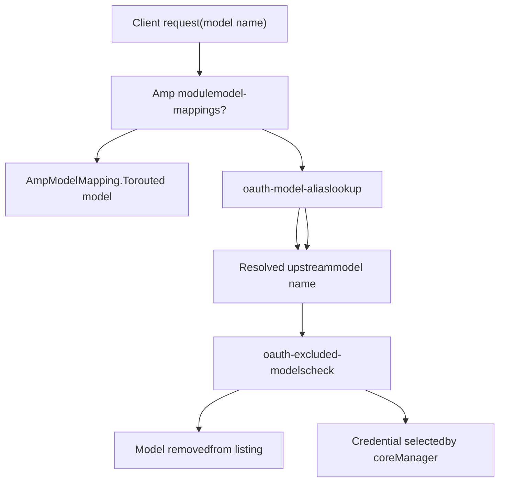
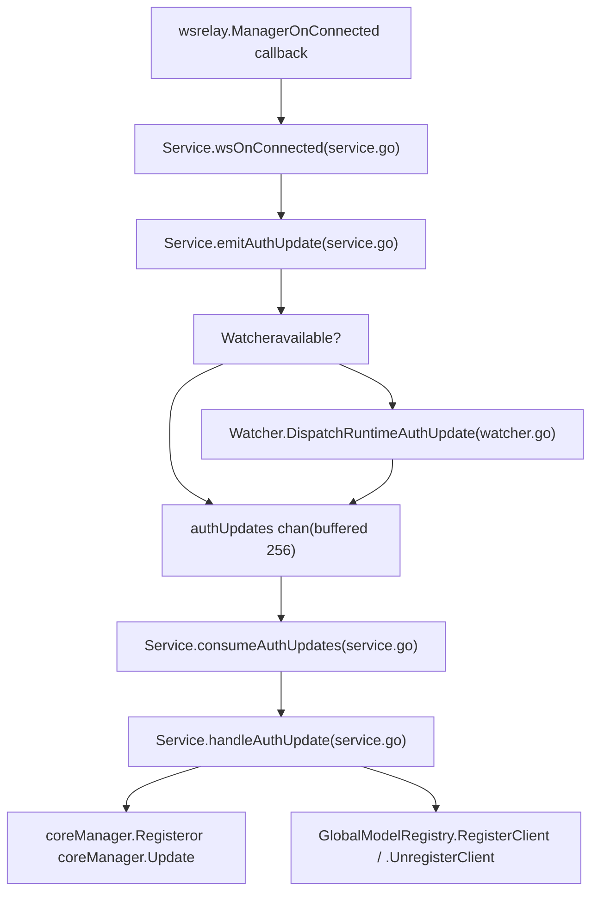

# Advanced Features

Relevant source files

-   [config.example.yaml](https://github.com/router-for-me/CLIProxyAPI/blob/c66cb0af/config.example.yaml)
-   [internal/api/handlers/management/config\_basic.go](https://github.com/router-for-me/CLIProxyAPI/blob/c66cb0af/internal/api/handlers/management/config_basic.go)
-   [internal/api/handlers/management/config\_lists.go](https://github.com/router-for-me/CLIProxyAPI/blob/c66cb0af/internal/api/handlers/management/config_lists.go)
-   [internal/api/server.go](https://github.com/router-for-me/CLIProxyAPI/blob/c66cb0af/internal/api/server.go)
-   [internal/config/config.go](https://github.com/router-for-me/CLIProxyAPI/blob/c66cb0af/internal/config/config.go)
-   [internal/watcher/watcher.go](https://github.com/router-for-me/CLIProxyAPI/blob/c66cb0af/internal/watcher/watcher.go)
-   [sdk/cliproxy/service.go](https://github.com/router-for-me/CLIProxyAPI/blob/c66cb0af/sdk/cliproxy/service.go)
-   [test/amp\_management\_test.go](https://github.com/router-for-me/CLIProxyAPI/blob/c66cb0af/test/amp_management_test.go)

This page covers CLIProxyAPI capabilities beyond basic request proxying. It provides a structured overview of each advanced feature area and points to the detailed sub-pages where each is fully documented. For initial setup and basic configuration, see [Getting Started](/router-for-me/CLIProxyAPI/2-getting-started) and the [Configuration Guide](/router-for-me/CLIProxyAPI/5-configuration-guide). For core architectural details, see [Core Architecture](/router-for-me/CLIProxyAPI/3-core-architecture).

---

## Overview

The advanced features in CLIProxyAPI fall into eight areas:

| Feature Area | Summary | Detail Page |
| --- | --- | --- |
| Credential Routing and Failover | Load-balancing, cooldowns, retry logic across multiple credentials | [8.1](/router-for-me/CLIProxyAPI/8.1-credential-routing-and-failover) |
| Model Mapping and Exclusion | Alias models, exclude models, Amp fallback routing | [8.2](/router-for-me/CLIProxyAPI/8.2-model-mapping-and-exclusion) |
| Thinking and Reasoning Configuration | Budget suffixes, clamping, per-provider application | [8.3](/router-for-me/CLIProxyAPI/8.3-thinking-and-reasoning-configuration) |
| Request and Response Logging | Per-request log files, rotation, error-only mode | [8.4](/router-for-me/CLIProxyAPI/8.4-request-and-response-logging) |
| Usage Statistics and Monitoring | Per-model and per-key metrics, export/import | [8.5](/router-for-me/CLIProxyAPI/8.5-usage-statistics-and-monitoring) |
| Streaming and Keep-Alive | SSE keep-alives, bootstrap retries, non-streaming keep-alive | [8.6](/router-for-me/CLIProxyAPI/8.6-streaming-and-keep-alive) |
| WebSocket and Runtime Auth | WebSocket Responses API, Codex sessions, live auth injection | [8.7](/router-for-me/CLIProxyAPI/8.7-websocket-and-runtime-authentication) |
| Signature Cache and Thinking Validation | Multi-turn Claude thinking signature validation | [8.8](/router-for-me/CLIProxyAPI/8.8-signature-cache-and-thinking-validation) |

The diagram below maps each feature area to the primary code entities that implement it.

**Diagram: Advanced Feature Areas and Primary Code Entities**

```mermaid
flowchart TD
    U["WebsocketAuth(config.go)"]
    V["Server.AttachWebsocketRoute(server.go)"]
    W["keepAliveEnabled(server.go)"]
    X["Server.watchKeepAlive(server.go)"]
    Y["Watcher.DispatchRuntimeAuthUpdate(watcher.go)"]
    Z["Service.handleAuthUpdate(service.go)"]
    Q["RequestLog(config.go)"]
    R["FileRequestLogger(logging)"]
    S["UsageStatisticsEnabled(config.go)"]
    T["usage.SetStatisticsEnabled(server.go)"]
    N["PayloadConfig(config.go)"]
    O["PayloadRule / PayloadFilterRule"]
    P["applyPayloadConfigWithRoot"]
    H["OAuthModelAlias(config.go)"]
    I["coreManager.SetOAuthModelAlias(service.go)"]
    J["OAuthExcludedModels(config.go)"]
    K["applyExcludedModels(service.go)"]
    L["AmpModelMapping(config.go)"]
    M["AmpModule(ampmodule)"]
    A["RoutingConfig(config.go)"]
    B["RoundRobinSelector(coreauth)"]
    C["FillFirstSelector(coreauth)"]
    D["QuotaExceeded(config.go)"]
    E["auth.SetQuotaCooldownDisabled(server.go)"]
    F["RequestRetry / MaxRetryInterval(config.go)"]
    G["coreManager.SetRetryConfig(service.go)"]

    U --> V
    W --> X
    Y --> Z
    Q --> R
    S --> T
    N --> O
    O --> P
    H --> I
    J --> K
    L --> M
    A --> B
    A --> C
    D --> E
    F --> G
```


Sources: [internal/config/config.go164-179](https://github.com/router-for-me/CLIProxyAPI/blob/c66cb0af/internal/config/config.go#L164-L179) [internal/api/server.go688-764](https://github.com/router-for-me/CLIProxyAPI/blob/c66cb0af/internal/api/server.go#L688-L764) [sdk/cliproxy/service.go334-340](https://github.com/router-for-me/CLIProxyAPI/blob/c66cb0af/sdk/cliproxy/service.go#L334-L340) [sdk/cliproxy/service.go556-608](https://github.com/router-for-me/CLIProxyAPI/blob/c66cb0af/sdk/cliproxy/service.go#L556-L608)

---

## Credential Routing and Failover

When multiple credentials are configured for the same provider, CLIProxyAPI selects among them using a configurable strategy. The `RoutingConfig.Strategy` field in `Config` accepts `"round-robin"` (default) or `"fill-first"`. This maps directly to `coreauth.RoundRobinSelector` or `coreauth.FillFirstSelector` at runtime.

On quota exhaustion, the `QuotaExceeded` struct controls whether to automatically switch projects or fall back to preview models. Credential cooldowns can be globally disabled via `DisableCooling`. Retry behavior is controlled by `RequestRetry` and `MaxRetryInterval`.

See [Credential Routing and Failover](/router-for-me/CLIProxyAPI/8.1-credential-routing-and-failover) for full details.

**Relevant config fields:**

```
routing:  strategy: "round-robin"  # or "fill-first"quota-exceeded:  switch-project: true  switch-preview-model: truedisable-cooling: falserequest-retry: 3max-retry-interval: 30
```
Sources: [internal/config/config.go164-179](https://github.com/router-for-me/CLIProxyAPI/blob/c66cb0af/internal/config/config.go#L164-L179) [sdk/cliproxy/service.go556-608](https://github.com/router-for-me/CLIProxyAPI/blob/c66cb0af/sdk/cliproxy/service.go#L556-L608) [internal/api/server.go919-921](https://github.com/router-for-me/CLIProxyAPI/blob/c66cb0af/internal/api/server.go#L919-L921)

---

## Model Mapping and Exclusion

Three distinct mechanisms control which models are visible and how model names are resolved:

| Mechanism | Config Field | Scope |
| --- | --- | --- |
| OAuth model aliases | `oauth-model-alias` | Rename upstream model IDs for OAuth/file-backed channels |
| OAuth model exclusions | `oauth-excluded-models` | Remove specific models from OAuth/file-backed channels |
| Amp model mappings | `ampcode.model-mappings` | Reroute Amp CLI model requests to locally available models |

The `OAuthModelAlias` struct supports an optional `fork: true` flag that adds the alias as an additional model entry while keeping the original. Supported channels include `gemini-cli`, `vertex`, `aistudio`, `antigravity`, `claude`, `codex`, `qwen`, `iflow`, and `kimi`.

Per-provider exclusions (e.g., under `gemini-api-key`) are separate from the global `oauth-excluded-models` map.

See [Model Mapping and Exclusion](/router-for-me/CLIProxyAPI/8.2-model-mapping-and-exclusion) for full details.

**Diagram: Model Alias and Exclusion Flow**


Sources: [internal/config/config.go108-116](https://github.com/router-for-me/CLIProxyAPI/blob/c66cb0af/internal/config/config.go#L108-L116) [internal/config/config.go181-206](https://github.com/router-for-me/CLIProxyAPI/blob/c66cb0af/internal/config/config.go#L181-L206) [sdk/cliproxy/service.go762-808](https://github.com/router-for-me/CLIProxyAPI/blob/c66cb0af/sdk/cliproxy/service.go#L762-L808)

---

## Thinking and Reasoning Configuration

Several providers (Claude, Gemini, Codex/Qwen) support extended reasoning or "thinking" modes. CLIProxyAPI allows budget specification through model name suffixes and validates parameters against per-model capability limits.

See [Thinking and Reasoning Configuration](/router-for-me/CLIProxyAPI/8.3-thinking-and-reasoning-configuration) for the full suffix format, validation logic, and provider-specific application rules.

---

## Request and Response Logging

When `request-log: true` is set in the config, CLIProxyAPI captures full request and response bodies to rotating log files. The `FileRequestLogger` writes to a `logs/` subdirectory. An error-only mode retains logs only for failed requests.

Log files are accessible via the Management API (`GET /v0/management/logs`). The `error-logs-max-files` config field caps the number of retained error log files (default: 10).

See [Request and Response Logging](/router-for-me/CLIProxyAPI/8.4-request-and-response-logging) for log format, rotation policy, and retrieval API details.

**Relevant config fields:**

```
request-log: falselogging-to-file: falselogs-max-total-size-mb: 0error-logs-max-files: 10
```
Sources: [internal/api/server.go60-66](https://github.com/router-for-me/CLIProxyAPI/blob/c66cb0af/internal/api/server.go#L60-L66) [internal/api/server.go220-232](https://github.com/router-for-me/CLIProxyAPI/blob/c66cb0af/internal/api/server.go#L220-L232) [internal/config/config.go53-62](https://github.com/router-for-me/CLIProxyAPI/blob/c66cb0af/internal/config/config.go#L53-L62)

---

## Usage Statistics and Monitoring

When `usage-statistics-enabled: true`, CLIProxyAPI accumulates per-model and per-API-key token and request counts in memory. Statistics are accessible via `GET /v0/management/usage` and can be exported/imported for persistence across restarts.

The `usage.SetStatisticsEnabled` function is called on config load and on hot-reload when the setting changes. See [Usage Statistics and Monitoring](/router-for-me/CLIProxyAPI/8.5-usage-statistics-and-monitoring) for the full metrics schema and export format.

Sources: [internal/api/server.go905-907](https://github.com/router-for-me/CLIProxyAPI/blob/c66cb0af/internal/api/server.go#L905-L907) [internal/config/config.go65](https://github.com/router-for-me/CLIProxyAPI/blob/c66cb0af/internal/config/config.go#L65-L65)

---

## Streaming and Keep-Alive

**SSE streaming** responses support two configurable behaviors:

-   `streaming.keepalive-seconds`: Emit blank SSE lines at this interval to prevent idle connection drops.
-   `streaming.bootstrap-retries`: Retry a request (before the first response byte) on transient upstream errors.

**Non-streaming keep-alive**: `nonstream-keepalive-interval` emits blank lines periodically for non-streaming responses.

**Process keep-alive endpoint**: When `WithKeepAliveEndpoint` is used (e.g., in TUI/embedded mode), the server registers `GET /keep-alive`. If no heartbeat arrives within the configured timeout, the `onTimeout` callback is invoked. The implementation uses `Server.watchKeepAlive` running in a goroutine.

See [Streaming and Keep-Alive](/router-for-me/CLIProxyAPI/8.6-streaming-and-keep-alive) for complete behavior details.

**Diagram: Keep-Alive Goroutine State**

Sources: [internal/api/server.go688-764](https://github.com/router-for-me/CLIProxyAPI/blob/c66cb0af/internal/api/server.go#L688-L764) [config.example.yaml96-99](https://github.com/router-for-me/CLIProxyAPI/blob/c66cb0af/config.example.yaml#L96-L99)

---

## WebSocket and Runtime Authentication

**WebSocket endpoint (`/v1/ws`)**: Managed by `wsrelay.Manager`. When a WebSocket client connects, `Service.wsOnConnected` creates a transient `coreauth.Auth` entry for the session and emits it through `Service.emitAuthUpdate`. On disconnect, `Service.wsOnDisconnected` removes it. Authentication for this endpoint is toggled via the `ws-auth` config field and `Server.wsAuthEnabled`.

**Codex WebSocket executor**: The `CodexAutoExecutor` supports persistent WebSocket sessions for the OpenAI Responses API. `Server.AttachWebsocketRoute` registers the handler on the Gin engine.

**Runtime auth injection**: `Watcher.DispatchRuntimeAuthUpdate` allows external code to push `AuthUpdate` events (add/modify/delete) into the same pipeline used by file-based watchers. This is the mechanism by which WebSocket provider connections register themselves as live credentials.

See [WebSocket and Runtime Authentication](/router-for-me/CLIProxyAPI/8.7-websocket-and-runtime-authentication) for full session and executor details.

**Diagram: Runtime Auth Update Pipeline**


Sources: [sdk/cliproxy/service.go204-273](https://github.com/router-for-me/CLIProxyAPI/blob/c66cb0af/sdk/cliproxy/service.go#L204-L273) [internal/watcher/watcher.go135-141](https://github.com/router-for-me/CLIProxyAPI/blob/c66cb0af/internal/watcher/watcher.go#L135-L141) [internal/api/server.go441-476](https://github.com/router-for-me/CLIProxyAPI/blob/c66cb0af/internal/api/server.go#L441-L476)

---

## Signature Cache and Thinking Validation

When Claude returns thinking blocks in a multi-turn conversation, subsequent requests must include the original signature to validate the thinking content. CLIProxyAPI maintains a `SignatureCache` that persists these signatures across conversation turns.

A special sentinel value `skip_thought_signature_validator` is used for Gemini models that expose Claude-compatible thinking but do not use Anthropic's signature scheme.

See [Signature Cache and Thinking Validation](/router-for-me/CLIProxyAPI/8.8-signature-cache-and-thinking-validation) for the cache structure and validation flow.

---

## Payload Configuration

The `PayloadConfig` system (configured under the `payload:` key) allows applying default, override, and filter rules to provider request bodies before they are forwarded upstream. Rules are matched by model name pattern and optional protocol specifier.

| Rule Type | Behavior |
| --- | --- |
| `default` | Set a JSON field only if absent |
| `default-raw` | Set a raw JSON fragment only if absent |
| `override` | Always overwrite a JSON field |
| `override-raw` | Always overwrite with a raw JSON fragment |
| `filter` | Remove specified JSON paths |

Patterns in `PayloadModelRule.Name` support wildcards (`*`). The `Protocol` field restricts a rule to a specific translator format (`openai`, `gemini`, `claude`, `codex`, `antigravity`).

See [Payload Configuration Rules](/router-for-me/CLIProxyAPI/5.4-payload-configuration-rules) for implementation details on `applyPayloadConfigWithRoot`.

```
payload:  default:    - models:        - name: "gemini-2.5-pro"          protocol: "gemini"      params:        "generationConfig.thinkingConfig.thinkingBudget": 32768  filter:    - models:        - name: "gemini-*"          protocol: "gemini"      params:        - "generationConfig.responseJsonSchema"
```
Sources: [internal/config/config.go248-285](https://github.com/router-for-me/CLIProxyAPI/blob/c66cb0af/internal/config/config.go#L248-L285) [config.example.yaml294-326](https://github.com/router-for-me/CLIProxyAPI/blob/c66cb0af/config.example.yaml#L294-L326)

---

## Hot Reload Interaction

All advanced features respond to configuration hot-reload triggered by the file watcher (see [Hot Reload and Configuration Updates](/router-for-me/CLIProxyAPI/3.7-hot-reload-and-configuration-updates)). The `Server.UpdateClients` method propagates config diffs to each subsystem:

| Config change | Effect |
| --- | --- |
| `routing.strategy` | Swap `coreManager` selector |
| `disable-cooling` | Call `auth.SetQuotaCooldownDisabled` |
| `request-retry` / `max-retry-interval` | Update `coreManager.SetRetryConfig` |
| `usage-statistics-enabled` | Toggle `usage.SetStatisticsEnabled` |
| `request-log` | Toggle `FileRequestLogger.SetEnabled` |
| `ws-auth` | Update `Server.wsAuthEnabled`, reset active WebSocket sessions if newly enabled |
| `ampcode.*` | Notify `AmpModule.OnConfigUpdated` |
| `oauth-model-alias` | Update `coreManager.SetOAuthModelAlias` |

Sources: [internal/api/server.go879-1016](https://github.com/router-for-me/CLIProxyAPI/blob/c66cb0af/internal/api/server.go#L879-L1016) [sdk/cliproxy/service.go556-608](https://github.com/router-for-me/CLIProxyAPI/blob/c66cb0af/sdk/cliproxy/service.go#L556-L608)
