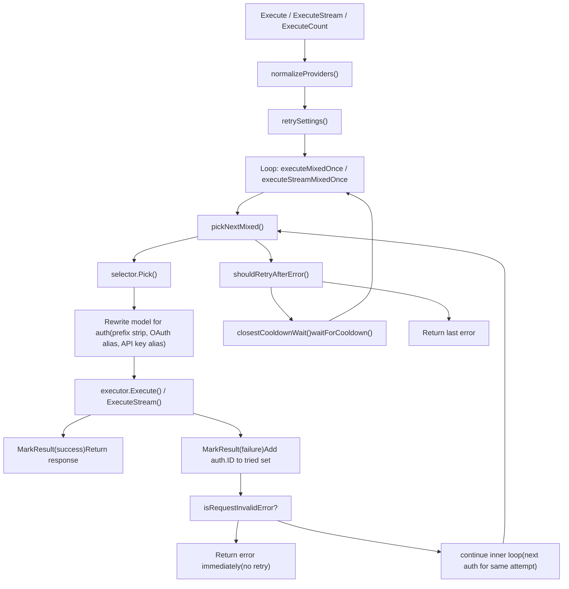
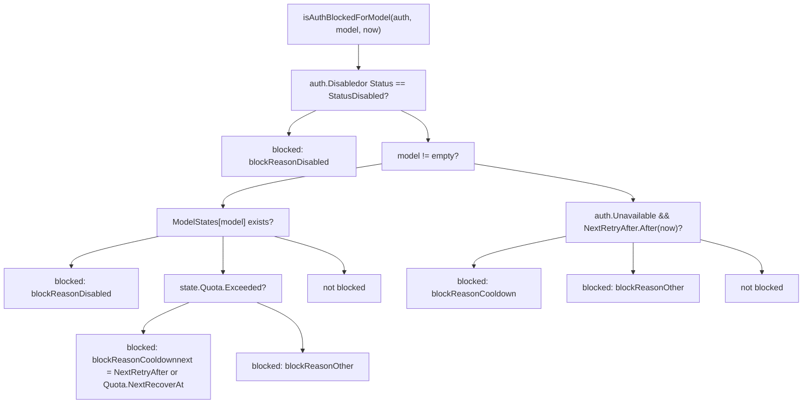
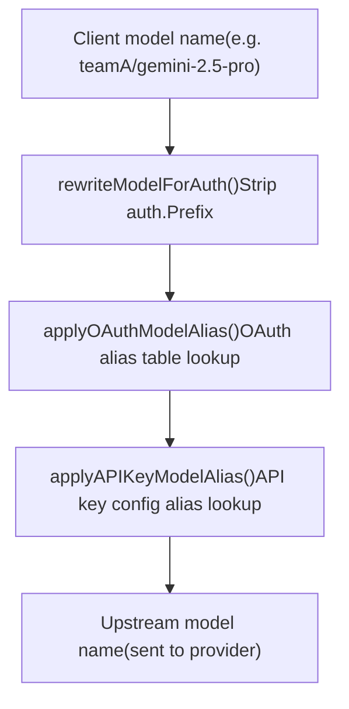

# Credential Routing and Failover

Relevant source files

-   [internal/watcher/config\_reload.go](https://github.com/router-for-me/CLIProxyAPI/blob/c66cb0af/internal/watcher/config_reload.go)
-   [sdk/cliproxy/auth/conductor.go](https://github.com/router-for-me/CLIProxyAPI/blob/c66cb0af/sdk/cliproxy/auth/conductor.go)
-   [sdk/cliproxy/auth/selector.go](https://github.com/router-for-me/CLIProxyAPI/blob/c66cb0af/sdk/cliproxy/auth/selector.go)
-   [sdk/cliproxy/auth/selector\_test.go](https://github.com/router-for-me/CLIProxyAPI/blob/c66cb0af/sdk/cliproxy/auth/selector_test.go)
-   [sdk/cliproxy/auth/types.go](https://github.com/router-for-me/CLIProxyAPI/blob/c66cb0af/sdk/cliproxy/auth/types.go)
-   [sdk/cliproxy/auth/types\_test.go](https://github.com/router-for-me/CLIProxyAPI/blob/c66cb0af/sdk/cliproxy/auth/types_test.go)

## Purpose and Scope

This page documents how CLIProxyAPI selects credentials for outbound AI provider requests, how it distributes load across multiple accounts of the same provider, what happens when a request fails, and how the system tracks quota state to avoid re-routing traffic to cooling-down credentials.

The mechanism is implemented almost entirely inside the `auth` package (`sdk/cliproxy/auth/`). For how the `Manager` is initialized and wired together at startup, see [3.3](/router-for-me/CLIProxyAPI/3.3-authentication-and-credential-management). For how OAuth tokens are refreshed before expiry, see [7.4](/router-for-me/CLIProxyAPI/7.4-token-refresh-and-lifecycle). For how model aliases are configured, see [8.2](/router-for-me/CLIProxyAPI/8.2-model-mapping-and-exclusion).

---

## Core Participants

The three key types that implement credential routing are `Manager`, `Selector`, and `Auth`.

**Key type diagram:**


Sources: [sdk/cliproxy/auth/conductor.go128-160](https://github.com/router-for-me/CLIProxyAPI/blob/c66cb0af/sdk/cliproxy/auth/conductor.go#L128-L160) [sdk/cliproxy/auth/selector.go20-31](https://github.com/router-for-me/CLIProxyAPI/blob/c66cb0af/sdk/cliproxy/auth/selector.go#L20-L31) [sdk/cliproxy/auth/types.go46-126](https://github.com/router-for-me/CLIProxyAPI/blob/c66cb0af/sdk/cliproxy/auth/types.go#L46-L126)

---

## Selectors

The `Selector` interface has one method: `Pick(ctx, provider, model, opts, auths) (*Auth, error)`. It receives the full filtered list of available, non-blocked auths and returns the one to use.

Two built-in implementations are provided:

| Selector | Strategy | Best for |
| --- | --- | --- |
| `RoundRobinSelector` | Cycles through available credentials in sorted ID order | Spreading load evenly across accounts with rolling-window limits |
| `FillFirstSelector` | Always picks the first available (deterministic, lexicographic ID order) | Saturating one account before moving to the next |

`RoundRobinSelector` is the default when `NewManager` is called with a `nil` selector.

Sources: [sdk/cliproxy/auth/conductor.go161-181](https://github.com/router-for-me/CLIProxyAPI/blob/c66cb0af/sdk/cliproxy/auth/conductor.go#L161-L181) [sdk/cliproxy/auth/selector.go20-31](https://github.com/router-for-me/CLIProxyAPI/blob/c66cb0af/sdk/cliproxy/auth/selector.go#L20-L31) [sdk/cliproxy/auth/selector.go353-363](https://github.com/router-for-me/CLIProxyAPI/blob/c66cb0af/sdk/cliproxy/auth/selector.go#L353-L363)

### Priority Buckets

Before the selector runs, `getAvailableAuths` partitions candidates by the integer `priority` attribute read from `Auth.Attributes["priority"]`. Only the highest priority bucket that has at least one non-blocked credential is offered to the selector.

This means:

-   If all priority-10 credentials are cooling down, the system automatically falls back to priority-0 credentials.
-   Within the winning bucket, the selector's algorithm (round-robin or fill-first) applies normally.

Sources: [sdk/cliproxy/auth/selector.go194-249](https://github.com/router-for-me/CLIProxyAPI/blob/c66cb0af/sdk/cliproxy/auth/selector.go#L194-L249) [sdk/cliproxy/auth/selector.go110-123](https://github.com/router-for-me/CLIProxyAPI/blob/c66cb0af/sdk/cliproxy/auth/selector.go#L110-L123)

### Gemini CLI Two-Level Round-Robin

When all candidates carry a `gemini_virtual_parent` attribute, `RoundRobinSelector.Pick` applies a two-level round-robin:

1.  **Outer cursor** cycles through distinct parent credential groups.
2.  **Inner cursor** cycles within the selected parent's project auths.

If any auth in the candidate list lacks `gemini_virtual_parent`, the selector falls back to flat round-robin.

Sources: [sdk/cliproxy/auth/selector.go255-313](https://github.com/router-for-me/CLIProxyAPI/blob/c66cb0af/sdk/cliproxy/auth/selector.go#L255-L313) [sdk/cliproxy/auth/selector.go326-351](https://github.com/router-for-me/CLIProxyAPI/blob/c66cb0af/sdk/cliproxy/auth/selector.go#L326-L351)

---

## Request Execution and Failover

**Execution flow diagram:**


Sources: [sdk/cliproxy/auth/conductor.go498-588](https://github.com/router-for-me/CLIProxyAPI/blob/c66cb0af/sdk/cliproxy/auth/conductor.go#L498-L588) [sdk/cliproxy/auth/conductor.go591-645](https://github.com/router-for-me/CLIProxyAPI/blob/c66cb0af/sdk/cliproxy/auth/conductor.go#L591-L645) [sdk/cliproxy/auth/conductor.go703-788](https://github.com/router-for-me/CLIProxyAPI/blob/c66cb0af/sdk/cliproxy/auth/conductor.go#L703-L788)

### Inner Loop: Trying Each Auth

Each call to `executeMixedOnce` (and its streaming/count counterparts) builds a `tried` map keyed by `Auth.ID`. On each iteration, `pickNextMixed` picks the next candidate not already in `tried`. When the selector returns an error (no more candidates), the inner loop ends.

This means in a single attempt, **every available credential is tried before giving up or waiting**.

Sources: [sdk/cliproxy/auth/conductor.go591-645](https://github.com/router-for-me/CLIProxyAPI/blob/c66cb0af/sdk/cliproxy/auth/conductor.go#L591-L645)

### Outer Loop: Retry with Cooldown Wait

After exhausting all candidates for an attempt, `shouldRetryAfterError` decides whether to retry:

1.  `maxRetryInterval` must be non-zero (set via `SetRetryConfig`).
2.  The error must not be a 200 OK, and must not be a request-invalid error.
3.  `closestCooldownWait` scans all matching-provider auths and returns the minimum wait time until any of them exits cooldown.
4.  If `wait ≤ maxRetryInterval`, the system sleeps for that duration and then retries the full inner loop.

Per-credential retry overrides are respected: each `Auth` can store a `request_retry` integer in `Auth.Metadata` to override the global retry count.

Sources: [sdk/cliproxy/auth/conductor.go1172-1190](https://github.com/router-for-me/CLIProxyAPI/blob/c66cb0af/sdk/cliproxy/auth/conductor.go#L1172-L1190) [sdk/cliproxy/auth/conductor.go1115-1170](https://github.com/router-for-me/CLIProxyAPI/blob/c66cb0af/sdk/cliproxy/auth/conductor.go#L1115-L1170) [sdk/cliproxy/auth/types.go263-286](https://github.com/router-for-me/CLIProxyAPI/blob/c66cb0af/sdk/cliproxy/auth/types.go#L263-L286)

---

## Auth Blocking and Cooldown

The function `isAuthBlockedForModel` decides whether a given auth is eligible for selection. It is called inside `getAvailableAuths` for every candidate.

**Blocking logic decision tree:**


Sources: [sdk/cliproxy/auth/selector.go365-422](https://github.com/router-for-me/CLIProxyAPI/blob/c66cb0af/sdk/cliproxy/auth/selector.go#L365-L422)

### Cooldown Error Response

When **all** candidates for a model are in `blockReasonCooldown` state, `getAvailableAuths` returns a `modelCooldownError` instead of a generic error. This error:

-   Has HTTP status `429 Too Many Requests`.
-   Carries a `Retry-After` header with the seconds until the earliest credential recovers.
-   Embeds a JSON body with `code: "model_cooldown"`, `reset_time`, and `reset_seconds`.

Sources: [sdk/cliproxy/auth/selector.go41-108](https://github.com/router-for-me/CLIProxyAPI/blob/c66cb0af/sdk/cliproxy/auth/selector.go#L41-L108) [sdk/cliproxy/auth/selector.go214-233](https://github.com/router-for-me/CLIProxyAPI/blob/c66cb0af/sdk/cliproxy/auth/selector.go#L214-L233)

### Per-Credential Cooldown Disable

A credential can opt out of quota cooldown entirely by setting `disable_cooling: true` in its auth file metadata. The global flag `SetQuotaCooldownDisabled(true)` disables cooldown for all credentials that do not have a per-credential override.

Sources: [sdk/cliproxy/auth/conductor.go69-83](https://github.com/router-for-me/CLIProxyAPI/blob/c66cb0af/sdk/cliproxy/auth/conductor.go#L69-L83) [sdk/cliproxy/auth/types.go227-244](https://github.com/router-for-me/CLIProxyAPI/blob/c66cb0af/sdk/cliproxy/auth/types.go#L227-L244)

---

## Quota State and Backoff

`QuotaState` tracks progressive backoff for a credential or a per-model `ModelState`.

| Field | Type | Meaning |
| --- | --- | --- |
| `Exceeded` | `bool` | Whether a quota error was recently seen |
| `NextRecoverAt` | `time.Time` | When the credential may be tried again |
| `BackoffLevel` | `int` | Exponent for the next cooldown duration |
| `Reason` | `string` | Human-readable provider description |

Cooldown constants defined in `conductor.go`:

| Constant | Value |
| --- | --- |
| `quotaBackoffBase` | 1 second |
| `quotaBackoffMax` | 30 minutes |
| `refreshPendingBackoff` | 1 minute |
| `refreshFailureBackoff` | 5 minutes |
| `refreshCheckInterval` | 5 seconds |

Sources: [sdk/cliproxy/auth/conductor.go61-67](https://github.com/router-for-me/CLIProxyAPI/blob/c66cb0af/sdk/cliproxy/auth/conductor.go#L61-L67) [sdk/cliproxy/auth/types.go98-126](https://github.com/router-for-me/CLIProxyAPI/blob/c66cb0af/sdk/cliproxy/auth/types.go#L98-L126)

### MarkResult

After each execution attempt, `MarkResult` is called with a `Result` struct containing:

-   `AuthID` — which credential was used.
-   `Success` — whether the call succeeded.
-   `RetryAfter` — a provider-supplied delay hint (from 429 responses).
-   `Error` — the failure details including HTTP status.

`MarkResult` updates the auth's `QuotaState` and `ModelState` accordingly and persists the updated auth. It also fires the `Hook.OnResult` callback.

The `Result` type is:

```
Result {
    AuthID    string
    Provider  string
    Model     string
    Success   bool
    RetryAfter *time.Duration
    Error     *Error
}
```
Sources: [sdk/cliproxy/auth/conductor.go85-99](https://github.com/router-for-me/CLIProxyAPI/blob/c66cb0af/sdk/cliproxy/auth/conductor.go#L85-L99) [sdk/cliproxy/auth/conductor.go623-643](https://github.com/router-for-me/CLIProxyAPI/blob/c66cb0af/sdk/cliproxy/auth/conductor.go#L623-L643)

---

## Model Name Rewriting

Before the request reaches an executor, the model name may be rewritten in three steps applied in sequence:


1.  **`rewriteModelForAuth`**: If `Auth.Prefix` is set (e.g. `"teamA"`), strips `"teamA/"` from the beginning of the model name. This allows namespace-based credential routing.
2.  **`applyOAuthModelAlias`**: Looks up the model in the per-channel OAuth alias table stored in `Manager.oauthModelAlias`. See [8.2](/router-for-me/CLIProxyAPI/8.2-model-mapping-and-exclusion) for alias configuration.
3.  **`applyAPIKeyModelAlias`**: Looks up the model in a per-auth-ID alias table (`Manager.apiKeyModelAlias`) built from `config.yaml` model entries. Alias lookup is case-insensitive on the base model name (thinking suffix is stripped before lookup and re-applied to the result).

Sources: [sdk/cliproxy/auth/conductor.go861-923](https://github.com/router-for-me/CLIProxyAPI/blob/c66cb0af/sdk/cliproxy/auth/conductor.go#L861-L923) [sdk/cliproxy/auth/conductor.go619-621](https://github.com/router-for-me/CLIProxyAPI/blob/c66cb0af/sdk/cliproxy/auth/conductor.go#L619-L621)

---

## Multi-Provider Routing

A single incoming request can be satisfied by credentials from multiple providers (e.g. both `gemini` and `claude` for the same model). The `Execute`/`ExecuteStream`/`ExecuteCount` methods accept a `[]string` of provider keys.

`normalizeProviders` deduplicates and lowercases this list. `pickNextMixed` then iterates the providers (rotating the start index per model via `providerOffsets`) and calls the selector for each provider's credential pool, skipping providers whose auths are all exhausted.

The `tried` set spans across all providers in a single attempt, so once a credential is tried, it will not be tried again within the same attempt regardless of which provider it belongs to.

Sources: [sdk/cliproxy/auth/conductor.go1088-1106](https://github.com/router-for-me/CLIProxyAPI/blob/c66cb0af/sdk/cliproxy/auth/conductor.go#L1088-L1106) [sdk/cliproxy/auth/conductor.go499-527](https://github.com/router-for-me/CLIProxyAPI/blob/c66cb0af/sdk/cliproxy/auth/conductor.go#L499-L527)

---

## Pinning and Metadata

Callers can pin a specific credential for a request by populating `cliproxyexecutor.PinnedAuthMetadataKey` in `Options.Metadata`. The manager reads this via `pinnedAuthIDFromMetadata` and bypasses the selector entirely, using only that credential.

After selection, the manager writes the chosen credential's ID back to `Options.Metadata` under `cliproxyexecutor.SelectedAuthMetadataKey`, and optionally invokes a callback registered under `cliproxyexecutor.SelectedAuthCallbackMetadataKey`.

Sources: [sdk/cliproxy/auth/conductor.go829-858](https://github.com/router-for-me/CLIProxyAPI/blob/c66cb0af/sdk/cliproxy/auth/conductor.go#L829-L858) [sdk/cliproxy/auth/conductor.go847-858](https://github.com/router-for-me/CLIProxyAPI/blob/c66cb0af/sdk/cliproxy/auth/conductor.go#L847-L858)

---

## Hook Interface

`Manager` accepts a `Hook` for observing auth lifecycle events. `NoopHook` is used when no hook is supplied.

| Hook Method | When Called |
| --- | --- |
| `OnAuthRegistered(ctx, auth)` | A new credential is registered via `Manager.Register` |
| `OnAuthUpdated(ctx, auth)` | An existing credential changes state via `Manager.Update` |
| `OnResult(ctx, result)` | After every execution attempt, success or failure |

Sources: [sdk/cliproxy/auth/conductor.go106-126](https://github.com/router-for-me/CLIProxyAPI/blob/c66cb0af/sdk/cliproxy/auth/conductor.go#L106-L126)

---

## Configuration Reference

| Setting | Location | Effect |
| --- | --- | --- |
| Global retry count | `Manager.SetRetryConfig(retry, maxRetryInterval)` | How many outer-loop retries are allowed |
| Max retry wait | `Manager.SetRetryConfig(retry, maxRetryInterval)` | Upper bound on cooldown wait before giving up |
| Per-credential retry | `Auth.Metadata["request_retry"]` | Overrides global retry count for one credential |
| Disable cooldown (global) | `SetQuotaCooldownDisabled(true)` | Skips quota cooldown for all credentials without override |
| Disable cooldown (per credential) | `Auth.Metadata["disable_cooling"]` | Overrides global cooldown flag for one credential |
| Priority | `Auth.Attributes["priority"]` | Integer; higher priority credentials are used first |
| Prefix routing | `Auth.Prefix` | Namespace prefix stripped from model names before routing |

Sources: [sdk/cliproxy/auth/conductor.go384-397](https://github.com/router-for-me/CLIProxyAPI/blob/c66cb0af/sdk/cliproxy/auth/conductor.go#L384-L397) [sdk/cliproxy/auth/types.go227-244](https://github.com/router-for-me/CLIProxyAPI/blob/c66cb0af/sdk/cliproxy/auth/types.go#L227-L244) [sdk/cliproxy/auth/types.go263-286](https://github.com/router-for-me/CLIProxyAPI/blob/c66cb0af/sdk/cliproxy/auth/types.go#L263-L286) [sdk/cliproxy/auth/selector.go110-123](https://github.com/router-for-me/CLIProxyAPI/blob/c66cb0af/sdk/cliproxy/auth/selector.go#L110-L123) [sdk/cliproxy/auth/types.go50-54](https://github.com/router-for-me/CLIProxyAPI/blob/c66cb0af/sdk/cliproxy/auth/types.go#L50-L54)
