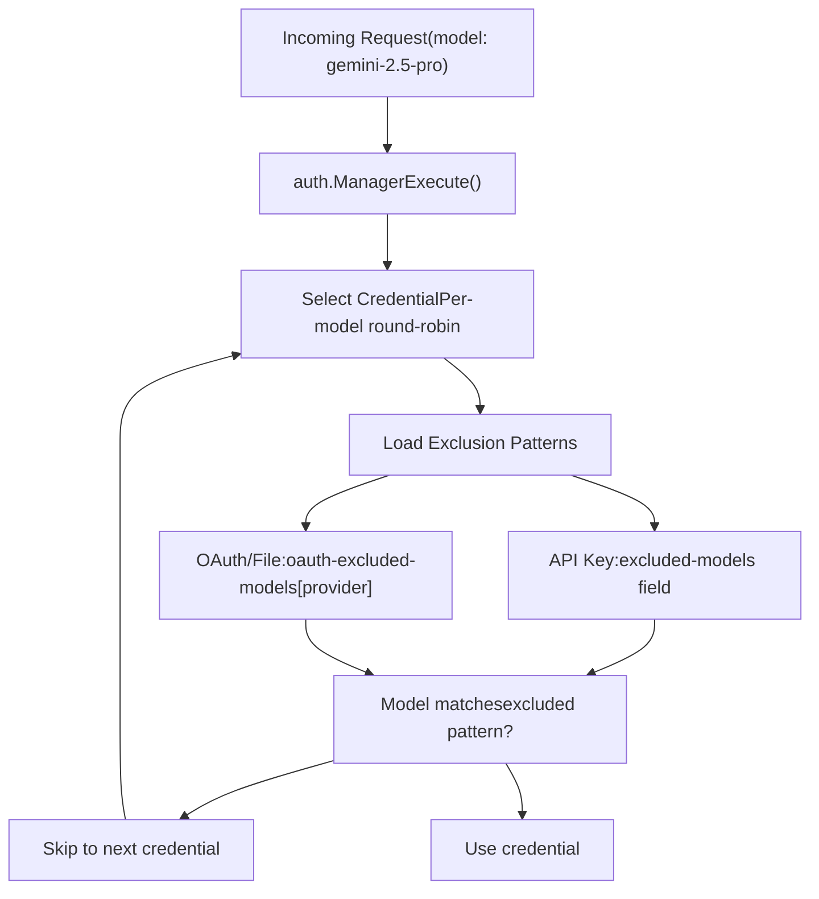
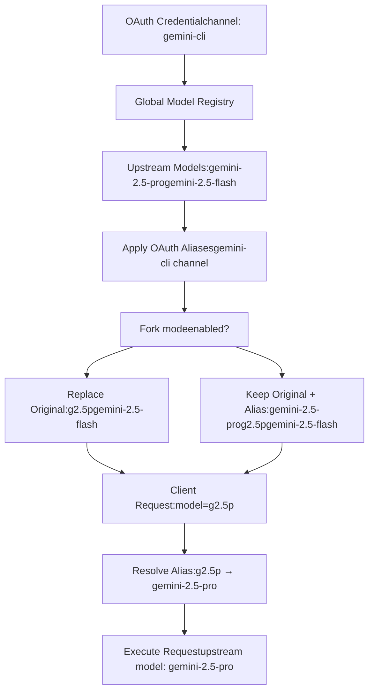
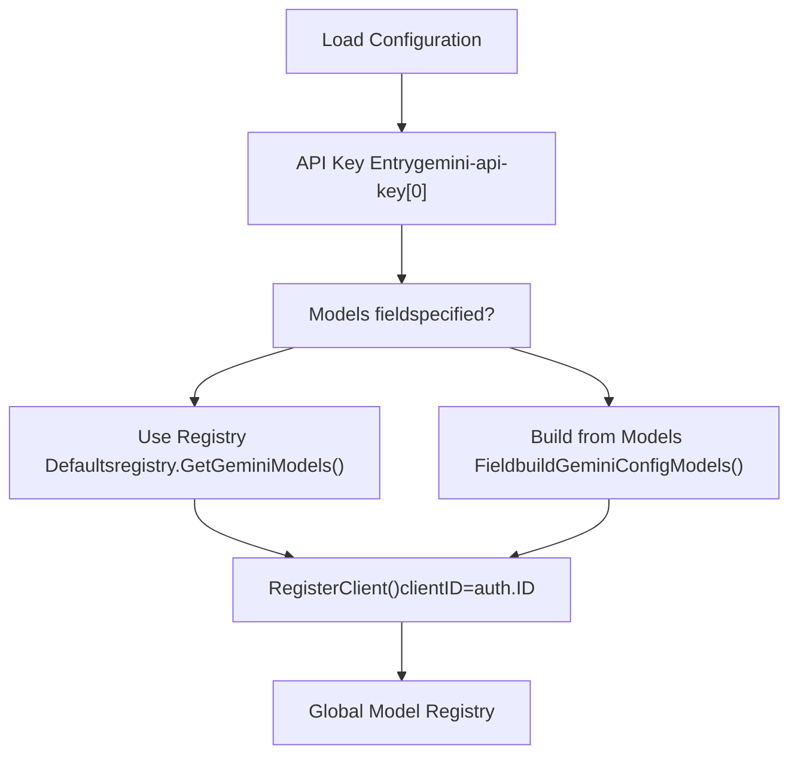
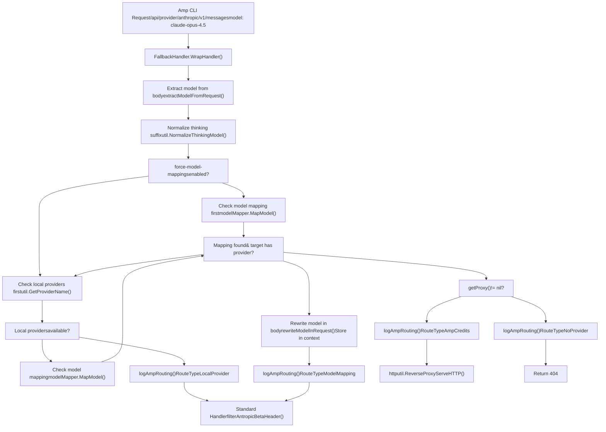
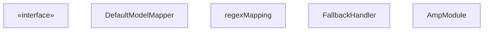

# Model Mapping and Exclusion

Relevant source files

-   [internal/api/handlers/management/model\_definitions.go](https://github.com/router-for-me/CLIProxyAPI/blob/c66cb0af/internal/api/handlers/management/model_definitions.go)
-   [internal/api/modules/amp/amp.go](https://github.com/router-for-me/CLIProxyAPI/blob/c66cb0af/internal/api/modules/amp/amp.go)
-   [internal/api/modules/amp/fallback\_handlers.go](https://github.com/router-for-me/CLIProxyAPI/blob/c66cb0af/internal/api/modules/amp/fallback_handlers.go)
-   [internal/api/modules/amp/fallback\_handlers\_test.go](https://github.com/router-for-me/CLIProxyAPI/blob/c66cb0af/internal/api/modules/amp/fallback_handlers_test.go)
-   [internal/api/modules/amp/gemini\_bridge.go](https://github.com/router-for-me/CLIProxyAPI/blob/c66cb0af/internal/api/modules/amp/gemini_bridge.go)
-   [internal/api/modules/amp/gemini\_bridge\_test.go](https://github.com/router-for-me/CLIProxyAPI/blob/c66cb0af/internal/api/modules/amp/gemini_bridge_test.go)
-   [internal/api/modules/amp/model\_mapping.go](https://github.com/router-for-me/CLIProxyAPI/blob/c66cb0af/internal/api/modules/amp/model_mapping.go)
-   [internal/api/modules/amp/model\_mapping\_test.go](https://github.com/router-for-me/CLIProxyAPI/blob/c66cb0af/internal/api/modules/amp/model_mapping_test.go)
-   [internal/api/modules/amp/response\_rewriter.go](https://github.com/router-for-me/CLIProxyAPI/blob/c66cb0af/internal/api/modules/amp/response_rewriter.go)
-   [internal/api/modules/amp/response\_rewriter\_test.go](https://github.com/router-for-me/CLIProxyAPI/blob/c66cb0af/internal/api/modules/amp/response_rewriter_test.go)
-   [internal/api/modules/amp/routes.go](https://github.com/router-for-me/CLIProxyAPI/blob/c66cb0af/internal/api/modules/amp/routes.go)
-   [internal/api/modules/amp/routes\_test.go](https://github.com/router-for-me/CLIProxyAPI/blob/c66cb0af/internal/api/modules/amp/routes_test.go)
-   [internal/config/oauth\_model\_alias\_migration.go](https://github.com/router-for-me/CLIProxyAPI/blob/c66cb0af/internal/config/oauth_model_alias_migration.go)
-   [internal/config/oauth\_model\_alias\_migration\_test.go](https://github.com/router-for-me/CLIProxyAPI/blob/c66cb0af/internal/config/oauth_model_alias_migration_test.go)
-   [internal/config/oauth\_model\_alias\_test.go](https://github.com/router-for-me/CLIProxyAPI/blob/c66cb0af/internal/config/oauth_model_alias_test.go)
-   [internal/registry/model\_definitions\_static\_data.go](https://github.com/router-for-me/CLIProxyAPI/blob/c66cb0af/internal/registry/model_definitions_static_data.go)
-   [internal/thinking/provider/iflow/apply.go](https://github.com/router-for-me/CLIProxyAPI/blob/c66cb0af/internal/thinking/provider/iflow/apply.go)
-   [internal/util/claude\_model.go](https://github.com/router-for-me/CLIProxyAPI/blob/c66cb0af/internal/util/claude_model.go)
-   [internal/util/claude\_model\_test.go](https://github.com/router-for-me/CLIProxyAPI/blob/c66cb0af/internal/util/claude_model_test.go)
-   [internal/watcher/diff/oauth\_model\_alias.go](https://github.com/router-for-me/CLIProxyAPI/blob/c66cb0af/internal/watcher/diff/oauth_model_alias.go)

This document describes four independent systems for controlling model availability and naming in CLIProxyAPI: **Model Exclusion** (restricting model access per credential), **OAuth Model Mappings** (global model name aliasing per channel), **Per-Credential Model Aliases** (defining model names in API key configs), and **Amp Model Mapping** (routing unavailable Amp CLI models to alternatives). Additionally, **Model Prefix Handling** enables multi-tenant model namespacing. For information about model registration and discovery, see [Model Registry and Selection](/router-for-me/CLIProxyAPI/3.6-model-registry-and-selection). For provider-specific configuration, see [Provider Integration](/router-for-me/CLIProxyAPI/6-provider-integration).

---

## Overview

CLIProxyAPI provides five mechanisms for controlling model routing, naming, and availability:

1.  **Model Exclusion**: Prevents specific credentials (API keys or OAuth accounts) from using certain models, useful for enforcing quota limits, cost controls, or provider-specific restrictions.

2.  **OAuth Model Mappings**: Global model name aliasing for OAuth/file-backed channels (gemini-cli, vertex, aistudio, antigravity, claude, codex, qwen, iflow). Maps upstream model names to client-visible aliases with optional forking.

3.  **Per-Credential Model Aliases**: Defines upstream model names and their aliases directly in API key configurations (gemini-api-key, claude-api-key, codex-api-key, openai-compatibility, vertex-api-key).

4.  **Amp Model Mapping**: Routes Amp CLI requests for unavailable models to alternative models that are configured locally, avoiding consumption of Amp credits.

5.  **Model Prefix Handling**: Enables multi-tenant model namespacing by requiring credentials to specify a prefix that clients must use when requesting models.


These systems operate independently but complement each other in production deployments.

---

## Model Exclusion System

### Purpose and Scope

Model exclusion allows administrators to restrict which models specific authentication credentials can access. This operates at the credential level—each API key or OAuth account can have its own exclusion list that prevents the auth.Manager from selecting that credential when requests target excluded models.

**Sources**: [internal/watcher/watcher.go620-658](https://github.com/router-for-me/CLIProxyAPI/blob/c66cb0af/internal/watcher/watcher.go#L620-L658) [sdk/cliproxy/service.go668-718](https://github.com/router-for-me/CLIProxyAPI/blob/c66cb0af/sdk/cliproxy/service.go#L668-L718) [internal/config/config.go58-78](https://github.com/router-for-me/CLIProxyAPI/blob/c66cb0af/internal/config/config.go#L58-L78)

### Exclusion Patterns

Model exclusion patterns support four matching modes:

| Pattern Type | Syntax | Example | Matches |
| --- | --- | --- | --- |
| Exact | `model-name` | `gemini-2.5-pro` | Only `gemini-2.5-pro` |
| Prefix | `prefix-*` | `gemini-2.5-*` | `gemini-2.5-pro`, `gemini-2.5-flash` |
| Suffix | `*-suffix` | `*-preview` | `gemini-3-pro-preview`, `claude-opus-4-preview` |
| Substring | `*substring*` | `*flash*` | `gemini-2.5-flash`, `gemini-flash-lite` |

Pattern matching is case-insensitive and trims whitespace. The matching logic is implemented in the `matchesPattern` function.

**Sources**: [sdk/cliproxy/service.go847-896](https://github.com/router-for-me/CLIProxyAPI/blob/c66cb0af/sdk/cliproxy/service.go#L847-L896) [config.example.yaml65-100](https://github.com/router-for-me/CLIProxyAPI/blob/c66cb0af/config.example.yaml#L65-L100)

### Configuration Methods

#### Per-API-Key Exclusion

Each API key entry supports an `excluded-models` field that restricts model access for that specific key:

```
gemini-api-key:  - api-key: "AIzaSy...01"    excluded-models:      - "gemini-2.5-pro"      # exact match      - "gemini-2.5-*"         # prefix wildcard      - "*-preview"            # suffix wildcard      - "*flash*"              # substring wildcard claude-api-key:  - api-key: "sk-ant-..."    excluded-models:      - "claude-opus-4-5-20251101"      - "claude-3-*" codex-api-key:  - api-key: "sk-atSM..."    base-url: "https://example.com"    excluded-models:      - "gpt-5.1"      - "*-mini"
```
Supported for: `gemini-api-key`, `claude-api-key`, `codex-api-key`

**Sources**: [internal/config/config.go225-241](https://github.com/router-for-me/CLIProxyAPI/blob/c66cb0af/internal/config/config.go#L225-L241) [internal/config/config.go174-222](https://github.com/router-for-me/CLIProxyAPI/blob/c66cb0af/internal/config/config.go#L174-L222) [config.example.yaml58-100](https://github.com/router-for-me/CLIProxyAPI/blob/c66cb0af/config.example.yaml#L58-L100)

#### OAuth Provider Exclusion

Global exclusions applied to all OAuth/file-backed credentials for a provider:

```
oauth-excluded-models:  gemini-cli:    - "gemini-2.5-pro"    - "*-preview"  vertex:    - "gemini-3-pro-preview"  claude:    - "claude-3-5-haiku-20241022"  codex:    - "gpt-5-codex-mini"  qwen:    - "vision-model"  iflow:    - "tstars2.0"  antigravity:    - "gemini-3-pro-preview"  aistudio:    - "gemini-3-pro-preview"
```
Provider keys are normalized to lowercase. This affects all credentials for the provider, regardless of how they were created (OAuth flow, file upload, or runtime connection).

**Sources**: [internal/config/config.go78](https://github.com/router-for-me/CLIProxyAPI/blob/c66cb0af/internal/config/config.go#L78-L78) [internal/config/config.go540-560](https://github.com/router-for-me/CLIProxyAPI/blob/c66cb0af/internal/config/config.go#L540-L560) [config.example.yaml149-169](https://github.com/router-for-me/CLIProxyAPI/blob/c66cb0af/config.example.yaml#L149-L169)

### Exclusion Application Flow


**Diagram: Model Exclusion Selection Logic**

The auth.Manager filters credentials during selection by checking if the requested model matches any exclusion pattern for that credential. The `excluded_models_hash` attribute stores a normalized hash of exclusion patterns to enable efficient change detection during hot reload.

**Sources**: [sdk/cliproxy/service.go721-789](https://github.com/router-for-me/CLIProxyAPI/blob/c66cb0af/sdk/cliproxy/service.go#L721-L789) [internal/watcher/watcher.go620-658](https://github.com/router-for-me/CLIProxyAPI/blob/c66cb0af/internal/watcher/watcher.go#L620-L658)

### Hot Reload Behavior

Model exclusion changes are detected and applied without service restart:

1.  **API Key Changes**: Detected via `computeExcludedModelsHash` comparing normalized pattern lists
2.  **OAuth Changes**: Detected via `diffOAuthExcludedModelChanges` identifying affected providers
3.  **Hash Storage**: Each `Auth` entry stores `excluded_models_hash` in attributes for change detection
4.  **Incremental Updates**: Only affected credentials are updated during configuration reload

When `oauth-excluded-models` configuration changes, affected OAuth providers trigger credential re-registration with updated exclusion metadata.

**Sources**: [internal/watcher/watcher.go524-618](https://github.com/router-for-me/CLIProxyAPI/blob/c66cb0af/internal/watcher/watcher.go#L524-L618) [internal/watcher/watcher.go845-875](https://github.com/router-for-me/CLIProxyAPI/blob/c66cb0af/internal/watcher/watcher.go#L845-L875) [internal/api/server.go863-877](https://github.com/router-for-me/CLIProxyAPI/blob/c66cb0af/internal/api/server.go#L863-L877)

### Management API Endpoints

Exclusion patterns can be managed programmatically:

| Endpoint | Method | Purpose |
| --- | --- | --- |
| `/v0/management/oauth-excluded-models` | GET | Retrieve current OAuth exclusions |
| `/v0/management/oauth-excluded-models` | PUT | Replace entire OAuth exclusion map |
| `/v0/management/oauth-excluded-models` | PATCH | Update specific provider exclusions |
| `/v0/management/oauth-excluded-models` | DELETE | Remove provider exclusions |
| `/v0/management/gemini-api-key` | PATCH | Update per-key exclusions |
| `/v0/management/claude-api-key` | PATCH | Update per-key exclusions |
| `/v0/management/codex-api-key` | PATCH | Update per-key exclusions |

All mutations trigger configuration persistence and hot reload.

**Sources**: [internal/api/handlers/management/config\_lists.go505-603](https://github.com/router-for-me/CLIProxyAPI/blob/c66cb0af/internal/api/handlers/management/config_lists.go#L505-L603) [internal/api/server.go549-552](https://github.com/router-for-me/CLIProxyAPI/blob/c66cb0af/internal/api/server.go#L549-L552)

---

## OAuth Model Alias

### Purpose and Scope

OAuth Model Alias provides global model name aliasing for OAuth/file-backed authentication channels. Unlike per-credential aliases or Amp model mapping, these aliases affect both model listing and request routing for all credentials within a channel, regardless of how they were created (OAuth flow, file upload, or runtime connection).

Supported channels: `gemini-cli`, `vertex`, `aistudio`, `antigravity`, `claude`, `codex`, `qwen`, `iflow`

**Not applicable to**: `gemini-api-key`, `claude-api-key`, `codex-api-key`, `openai-compatibility`, `vertex-api-key`, `ampcode` (these use per-credential model aliases instead)

**Note**: This system was previously called `oauth-model-mappings` and was migrated to `oauth-model-alias` for clarity. Existing configurations are automatically migrated on startup.

**Sources**: [internal/config/config.go92-100](https://github.com/router-for-me/CLIProxyAPI/blob/c66cb0af/internal/config/config.go#L92-L100) [internal/config/oauth\_model\_alias\_migration.go38-86](https://github.com/router-for-me/CLIProxyAPI/blob/c66cb0af/internal/config/oauth_model_alias_migration.go#L38-L86)

### Configuration Structure

OAuth model aliases are configured under the `oauth-model-alias` key with channel-specific entries:

```
oauth-model-alias:  gemini-cli:    - name: "gemini-2.5-pro"          # original upstream model name      alias: "g2.5p"                  # client-visible alias      fork: true                      # when true, keep original and add alias (default: false)  vertex:    - name: "gemini-2.5-pro"      alias: "g2.5p"  claude:    - name: "claude-sonnet-4-5-20250929"      alias: "cs4.5"  codex:    - name: "gpt-5"      alias: "g5"  antigravity:    - name: "rev19-uic3-1p"      alias: "gemini-2.5-computer-use-preview-10-2025"    - name: "gemini-3-pro-high"      alias: "gemini-3-pro-preview"
```
The `fork` field controls whether the alias is added as an additional model (preserving the original) or replaces the original in listings.

**Sources**: [internal/config/config.go148-156](https://github.com/router-for-me/CLIProxyAPI/blob/c66cb0af/internal/config/config.go#L148-L156) [internal/config/oauth\_model\_alias\_migration.go23-36](https://github.com/router-for-me/CLIProxyAPI/blob/c66cb0af/internal/config/oauth_model_alias_migration.go#L23-L36)

### Alias Behavior


**Diagram: OAuth Model Alias Application Flow**

When fork mode is disabled (default), the alias replaces the original model name in listings. When enabled, both the original name and alias are exposed to clients. During request routing, aliases are resolved to upstream model names before execution.

**Sources**: [internal/config/config.go148-156](https://github.com/router-for-me/CLIProxyAPI/blob/c66cb0af/internal/config/config.go#L148-L156) [sdk/cliproxy/service.go677-810](https://github.com/router-for-me/CLIProxyAPI/blob/c66cb0af/sdk/cliproxy/service.go#L677-L810)

### Normalization and Validation

OAuth model aliases are normalized during configuration load via `SanitizeOAuthModelAlias`:

1.  Channel keys converted to lowercase
2.  Whitespace trimmed from names and aliases
3.  Empty entries dropped
4.  Multiple aliases for the same upstream model are allowed (e.g., for backward compatibility)
5.  Self-referencing aliases (name == alias) dropped

The normalization ensures consistent lookup and prevents configuration errors. Note that unlike the previous system, multiple aliases can now map to the same upstream model name to support compatibility scenarios.

**Sources**: [internal/config/config.go522-558](https://github.com/router-for-me/CLIProxyAPI/blob/c66cb0af/internal/config/config.go#L522-L558) [internal/config/oauth\_model\_alias\_test.go29-56](https://github.com/router-for-me/CLIProxyAPI/blob/c66cb0af/internal/config/oauth_model_alias_test.go#L29-L56)

### Hot Reload Support

OAuth model aliases support hot reload via the configuration watcher:

> **[Mermaid sequence]**
> *(图表结构无法解析)*

**Diagram: OAuth Model Alias Hot Reload Sequence**

Changes to `oauth-model-alias` trigger credential re-registration with updated model aliases. The core manager stores the new aliases and applies them during subsequent model registration calls.

**Sources**: [sdk/cliproxy/service.go556-558](https://github.com/router-for-me/CLIProxyAPI/blob/c66cb0af/sdk/cliproxy/service.go#L556-L558) [sdk/cliproxy/service.go391-400](https://github.com/router-for-me/CLIProxyAPI/blob/c66cb0af/sdk/cliproxy/service.go#L391-L400) [internal/watcher/diff/oauth\_model\_alias.go38-68](https://github.com/router-for-me/CLIProxyAPI/blob/c66cb0af/internal/watcher/diff/oauth_model_alias.go#L38-L68)

### Management API Endpoints

OAuth model aliases can be managed programmatically:

| Endpoint | Method | Purpose |
| --- | --- | --- |
| `/v0/management/oauth-model-alias` | GET | Retrieve current OAuth aliases |
| `/v0/management/oauth-model-alias` | PUT | Replace entire alias configuration |
| `/v0/management/oauth-model-alias` | PATCH | Update specific channel aliases |
| `/v0/management/oauth-model-alias` | DELETE | Remove channel aliases |

All mutations trigger configuration persistence and hot reload.

**Sources**: [internal/api/server.go604-607](https://github.com/router-for-me/CLIProxyAPI/blob/c66cb0af/internal/api/server.go#L604-L607)

### Configuration Migration

The system automatically migrates old `oauth-model-mappings` configurations to `oauth-model-alias` on startup. The migration process:

1.  Checks for existing `oauth-model-alias` configuration (skip migration if present)
2.  Converts `oauth-model-mappings` to new structure with model name conversions for antigravity channel
3.  Adds default antigravity aliases if neither field exists
4.  Preserves all other configuration settings

Antigravity model name conversions during migration:

| Old Name | New Name |
| --- | --- |
| `gemini-2.5-computer-use-preview-10-2025` | `rev19-uic3-1p` |
| `gemini-3-pro-preview` | `gemini-3-pro-high` |
| `gemini-3-flash-preview` | `gemini-3-flash` |
| `gemini-3-pro-image-preview` | `gemini-3-pro-image` |
| `gemini-claude-sonnet-4-5` | `claude-sonnet-4-5` |
| `gemini-claude-sonnet-4-5-thinking` | `claude-sonnet-4-5-thinking` |
| `gemini-claude-opus-4-5-thinking` | `claude-opus-4-5-thinking` |
| `gemini-claude-opus-4-6-thinking` | `claude-opus-4-6-thinking` |

**Sources**: [internal/config/oauth\_model\_alias\_migration.go10-86](https://github.com/router-for-me/CLIProxyAPI/blob/c66cb0af/internal/config/oauth_model_alias_migration.go#L10-L86) [internal/config/oauth\_model\_alias\_migration\_test.go82-137](https://github.com/router-for-me/CLIProxyAPI/blob/c66cb0af/internal/config/oauth_model_alias_migration_test.go#L82-L137)

---

## Per-Credential Model Aliases

### Purpose and Scope

Per-credential model aliases allow API key configurations to define custom model names and map them to upstream model identifiers. This operates at the credential level and is independent of OAuth model mappings and Amp model mapping.

Supported configurations: `gemini-api-key`, `claude-api-key`, `codex-api-key`, `openai-compatibility`, `vertex-api-key`

**Sources**: [internal/config/config.go315-350](https://github.com/router-for-me/CLIProxyAPI/blob/c66cb0af/internal/config/config.go#L315-L350) [config.example.yaml86-168](https://github.com/router-for-me/CLIProxyAPI/blob/c66cb0af/config.example.yaml#L86-L168)

### Configuration Examples

#### Gemini API Key Models

```
gemini-api-key:  - api-key: "AIzaSy...01"    models:      - name: "gemini-2.5-flash"      # upstream model name        alias: "gemini-flash"         # client alias      - name: "gemini-2.5-pro"        alias: "flash-pro"
```
Clients request `gemini-flash`, which routes to upstream `gemini-2.5-flash`.

**Sources**: [internal/config/config.go315-350](https://github.com/router-for-me/CLIProxyAPI/blob/c66cb0af/internal/config/config.go#L315-L350) [config.example.yaml96-98](https://github.com/router-for-me/CLIProxyAPI/blob/c66cb0af/config.example.yaml#L96-L98)

#### Claude API Key Models

```
claude-api-key:  - api-key: "sk-ant-..."    base-url: "https://custom-claude.example.com"    models:      - name: "claude-3-5-sonnet-20241022"        alias: "claude-sonnet-latest"      - name: "claude-opus-4-5-20251101"        alias: "opus-4.5"
```
**Sources**: [internal/config/config.go241-272](https://github.com/router-for-me/CLIProxyAPI/blob/c66cb0af/internal/config/config.go#L241-L272) [config.example.yaml132-134](https://github.com/router-for-me/CLIProxyAPI/blob/c66cb0af/config.example.yaml#L132-L134)

#### OpenAI Compatibility Models

```
openai-compatibility:  - name: "openrouter"    base-url: "https://openrouter.ai/api/v1"    api-key-entries:      - api-key: "sk-or-v1-..."    models:      - name: "moonshotai/kimi-k2:free"        alias: "kimi-k2"
```
**Sources**: [internal/config/config.go352-391](https://github.com/router-for-me/CLIProxyAPI/blob/c66cb0af/internal/config/config.go#L352-L391) [config.example.yaml142-154](https://github.com/router-for-me/CLIProxyAPI/blob/c66cb0af/config.example.yaml#L142-L154)

### Model Registration Flow


**Diagram: Per-Credential Model Alias Registration**

When the `models` field is present in an API key configuration, it replaces the default model list from the registry. Otherwise, provider defaults are used.

**Sources**: [sdk/cliproxy/service.go709-721](https://github.com/router-for-me/CLIProxyAPI/blob/c66cb0af/sdk/cliproxy/service.go#L709-L721) [sdk/cliproxy/service.go742-751](https://github.com/router-for-me/CLIProxyAPI/blob/c66cb0af/sdk/cliproxy/service.go#L742-L751)

### Model Building Functions

Per-provider model building functions construct `ModelInfo` entries from configuration:

| Provider | Function | Input Type |
| --- | --- | --- |
| Gemini | `buildGeminiConfigModels` | `config.GeminiKey` |
| Claude | `buildClaudeConfigModels` | `config.ClaudeKey` |
| Codex | `buildCodexConfigModels` | `config.CodexKey` |
| OpenAI-compat | `buildOpenAICompatConfigModels` | `config.OpenAICompatibility` |
| Vertex-compat | `buildVertexCompatConfigModels` | `config.VertexCompatKey` |

These functions iterate over the `Models` slice and create `ModelInfo` entries with the alias as the ID and the name as metadata for upstream routing.

**Sources**: [sdk/cliproxy/service.go898-1010](https://github.com/router-for-me/CLIProxyAPI/blob/c66cb0af/sdk/cliproxy/service.go#L898-L1010) (inferred from usage patterns)

---

## Amp Model Mapping System

### Purpose and Architecture

Amp Model Mapping enables Amp CLI integration to route requests for unavailable models to alternative models that are configured locally. This prevents consumption of Amp credits for models that can be handled by local OAuth providers.

The system operates exclusively within the Amp module and is independent of OAuth model mappings and per-credential aliases. It rewrites model names in request payloads before they reach the standard handler pipeline.

**Sources**: [internal/api/modules/amp/amp.go18-43](https://github.com/router-for-me/CLIProxyAPI/blob/c66cb0af/internal/api/modules/amp/amp.go#L18-L43) [internal/api/modules/amp/fallback\_handlers.go77-104](https://github.com/router-for-me/CLIProxyAPI/blob/c66cb0af/internal/api/modules/amp/fallback_handlers.go#L77-L104) [internal/config/config.go158-202](https://github.com/router-for-me/CLIProxyAPI/blob/c66cb0af/internal/config/config.go#L158-L202)

### Configuration

Model mappings are configured under the `ampcode` section with support for exact and regex patterns:

```
ampcode:  upstream-url: "https://ampcode.com"  force-model-mappings: false        # when true, mappings checked before local API keys  model-mappings:    - from: "claude-opus-4.5"        # Model requested by Amp CLI      to: "claude-sonnet-4"          # Route to available local model      regex: false                   # exact match (default)    - from: "^gpt-5.*$"              # Regex pattern      to: "gemini-2.5-pro"      regex: true
```
Mappings are applied when:

1.  The requested model has no local providers configured (unless `force-model-mappings: true`)
2.  The mapped target model has available providers
3.  The request arrives via Amp provider routes (`/api/provider/:provider/...`)

The `force-model-mappings` flag controls evaluation order: when true, mappings are checked before looking for local API keys, allowing admins to route Amp requests to specific OAuth providers.

**Sources**: [config.example.yaml190-202](https://github.com/router-for-me/CLIProxyAPI/blob/c66cb0af/config.example.yaml#L190-L202) [internal/config/config.go158-202](https://github.com/router-for-me/CLIProxyAPI/blob/c66cb0af/internal/config/config.go#L158-L202) [internal/api/modules/amp/amp.go104-111](https://github.com/router-for-me/CLIProxyAPI/blob/c66cb0af/internal/api/modules/amp/amp.go#L104-L111)

### Routing Decision Flow


**Diagram: Amp Model Mapping and Fallback Decision Tree**

The `FallbackHandler` wraps standard API handlers and intercepts requests before execution. It normalizes thinking suffixes, checks for local providers or mappings based on `force-model-mappings` configuration, rewrites the request body when mapping applies, and decides whether to handle locally or proxy to ampcode.com.

**Sources**: [internal/api/modules/amp/fallback\_handlers.go113-269](https://github.com/router-for-me/CLIProxyAPI/blob/c66cb0af/internal/api/modules/amp/fallback_handlers.go#L113-L269) [internal/api/modules/amp/amp.go104-111](https://github.com/router-for-me/CLIProxyAPI/blob/c66cb0af/internal/api/modules/amp/amp.go#L104-L111)

### Implementation Components

#### DefaultModelMapper

The `DefaultModelMapper` struct manages exact and regex model mapping rules with hot reload support:


**Diagram: Amp Model Mapping Class Structure**

The mapper stores exact matches in a normalized map and regex patterns in an ordered slice. Exact matches are checked first, then regex patterns are evaluated in configuration order. The `forceModelMappings` function closure allows dynamic evaluation of the configuration flag.

**Sources**: [internal/api/modules/amp/model\_mapping.go14-148](https://github.com/router-for-me/CLIProxyAPI/blob/c66cb0af/internal/api/modules/amp/model_mapping.go#L14-L148) [internal/api/modules/amp/fallback\_handlers.go77-104](https://github.com/router-for-me/CLIProxyAPI/blob/c66cb0af/internal/api/modules/amp/fallback_handlers.go#L77-L104) [internal/api/modules/amp/amp.go18-43](https://github.com/router-for-me/CLIProxyAPI/blob/c66cb0af/internal/api/modules/amp/amp.go#L18-L43)

#### Request Body Rewriting

When a mapping is applied, the `rewriteModelInRequest` function uses `gjson`/`sjson` to replace the `model` field value:

```
// Original request{  "model": "claude-opus-4.5",  "messages": [...]} // After rewriting{  "model": "claude-sonnet-4",  "messages": [...]}
```
The rewritten body is restored to `c.Request.Body` as an `io.NopCloser`, and the mapped model name is stored in Gin context under `MappedModelContextKey` for handlers that need it (such as the Gemini bridge).

**Sources**: [internal/api/modules/amp/fallback\_handlers.go284-295](https://github.com/router-for-me/CLIProxyAPI/blob/c66cb0af/internal/api/modules/amp/fallback_handlers.go#L284-L295) [internal/api/modules/amp/fallback\_handlers.go31](https://github.com/router-for-me/CLIProxyAPI/blob/c66cb0af/internal/api/modules/amp/fallback_handlers.go#L31-L31)

#### Response Model Rewriting

The `ResponseRewriter` intercepts response writes and replaces mapped model names back to the original requested names to maintain API contract transparency:

```
type ResponseRewriter struct {    gin.ResponseWriter    body          *bytes.Buffer    originalModel string    isStreaming   bool}
```
For streaming responses (SSE), it parses `data:` lines and rewrites JSON chunks. For non-streaming responses, it buffers the entire body and rewrites before flushing.

**Sources**: [internal/api/modules/amp/response\_rewriter.go14-128](https://github.com/router-for-me/CLIProxyAPI/blob/c66cb0af/internal/api/modules/amp/response_rewriter.go#L14-L128)

### Route Registration

Model mapping is integrated into Amp provider routes via `registerProviderAliases`:

| Route Pattern | Handler | Mapping Support |
| --- | --- | --- |
| `/api/provider/:provider/chat/completions` | `openaiHandlers.ChatCompletions` | ✓ |
| `/api/provider/:provider/v1/chat/completions` | `openaiHandlers.ChatCompletions` | ✓ |
| `/api/provider/:provider/v1/messages` | `claudeCodeHandlers.ClaudeMessages` | ✓ |
| `/api/provider/:provider/v1beta/models/*action` | `geminiHandlers.GeminiHandler` | ✓ |
| `/api/provider/:provider/v1/responses` | `openaiResponsesHandlers.Responses` | ✓ |
| `/api/provider/google/v1beta1/*path` | `createGeminiBridgeHandler` | ✓ |

All routes are wrapped with `FallbackHandler.WrapHandler()` to enable mapping before standard processing. The Gemini bridge handler extracts model names from Amp CLI's non-standard path format (`/publishers/google/models/...`).

**Sources**: [internal/api/modules/amp/routes.go259-334](https://github.com/router-for-me/CLIProxyAPI/blob/c66cb0af/internal/api/modules/amp/routes.go#L259-L334) [internal/api/modules/amp/gemini\_bridge.go9-60](https://github.com/router-for-me/CLIProxyAPI/blob/c66cb0af/internal/api/modules/amp/gemini_bridge.go#L9-L60)

### Logging and Observability

Model mapping decisions are logged with structured fields for cost attribution:

```
// Local provider used (no mapping)log.WithFields(log.Fields{    "component": "amp-routing",    "route_type": "LOCAL_PROVIDER",    "requested_model": "claude-sonnet-4",    "provider": "claude",    "cost": "free",    "source": "local_oauth",}) // Model mapped to alternativelog.WithFields(log.Fields{    "component": "amp-routing",    "route_type": "MODEL_MAPPING",    "requested_model": "claude-opus-4.5",    "resolved_model": "claude-sonnet-4",    "mapping": "claude-opus-4.5 -> claude-sonnet-4",    "cost": "free",    "source": "local_oauth",}) // Forwarded to ampcode.comlog.WithFields(log.Fields{    "component": "amp-routing",    "route_type": "AMP_CREDITS",    "requested_model": "claude-opus-4.5",    "model_id": "claude-opus-4.5",    "cost": "amp_credits",    "source": "ampcode.com",})
```
The `model_id` field in credit-consuming logs provides easy reference for adding to configuration.

**Sources**: [internal/api/modules/amp/fallback\_handlers.go31-71](https://github.com/router-for-me/CLIProxyAPI/blob/c66cb0af/internal/api/modules/amp/fallback_handlers.go#L31-L71)

### Hot Reload Support

Model mappings support hot reload without service restart via partial configuration comparison:

1.  Configuration changes detected by watcher
2.  `AmpModule.OnConfigUpdated()` called with new configuration
3.  `hasModelMappingsChanged()` compares old and new mappings
4.  If changed, `modelMapper.UpdateMappings()` atomically replaces mapping rules
5.  New mappings apply to subsequent requests immediately

The `lastConfig` field stores the previous `AmpCode` configuration for comparison, and `hasModelMappingsChanged` uses a map-based comparison to detect changes in both exact and regex mappings.

**Sources**: [internal/api/modules/amp/amp.go181-259](https://github.com/router-for-me/CLIProxyAPI/blob/c66cb0af/internal/api/modules/amp/amp.go#L181-L259) [internal/api/modules/amp/amp.go293-325](https://github.com/router-for-me/CLIProxyAPI/blob/c66cb0af/internal/api/modules/amp/amp.go#L293-L325)

#### Regex Pattern Support

Regex mappings are compiled during `UpdateMappings` with case-insensitive mode (`(?i)` prefix):

```
// Configuration{From: "^gpt-5.*$", To: "gemini-2.5-pro", Regex: true} // During MapModel()1. Exact match checked first: mappings[normalizedRequest]2. If not found, iterate regexps in order3. Match against requestedModel and base model (thinking suffix stripped)4. Return first match
```
Regex patterns are evaluated after exact matches and in configuration order, allowing fine-grained control over mapping precedence.

**Sources**: [internal/api/modules/amp/model\_mapping.go89-131](https://github.com/router-for-me/CLIProxyAPI/blob/c66cb0af/internal/api/modules/amp/model_mapping.go#L89-L131) [internal/api/modules/amp/model\_mapping\_test.go207-244](https://github.com/router-for-me/CLIProxyAPI/blob/c66cb0af/internal/api/modules/amp/model_mapping_test.go#L207-L244)

---

## Implementation Reference

### Exclusion Pattern Matching

The pattern matching implementation in `matchesPattern` handles all four wildcard modes:

```
Pattern: "gemini-2.5-*"
1. Normalize: lowercase, trim whitespace
2. Check for wildcards
3. If prefix wildcard: strings.HasPrefix(model, prefix)
4. If suffix wildcard: strings.HasSuffix(model, suffix)
5. If substring wildcard: strings.Contains(model, substring)
6. Else: exact match comparison
```
Applied during credential selection in `applyExcludedModels` which filters the model list by checking each pattern.

**Sources**: [sdk/cliproxy/service.go847-896](https://github.com/router-for-me/CLIProxyAPI/blob/c66cb0af/sdk/cliproxy/service.go#L847-L896) [sdk/cliproxy/service.go721-789](https://github.com/router-for-me/CLIProxyAPI/blob/c66cb0af/sdk/cliproxy/service.go#L721-L789)

### Auth Attribute Storage

Exclusion metadata is stored in `Auth.Attributes` for change detection:

| Attribute Key | Value | Purpose |
| --- | --- | --- |
| `excluded_models_hash` | SHA256 hash of normalized patterns | Detect exclusion changes during hot reload |
| `auth_kind` | `"apikey"` or provider name | Determine which exclusion source to use |

The hash is computed by `computeExcludedModelsHash` which normalizes patterns (lowercase, trim, sort) before hashing to ensure consistent comparison.

**Sources**: [internal/watcher/watcher.go524-544](https://github.com/router-for-me/CLIProxyAPI/blob/c66cb0af/internal/watcher/watcher.go#L524-L544) [internal/watcher/watcher.go620-658](https://github.com/router-for-me/CLIProxyAPI/blob/c66cb0af/internal/watcher/watcher.go#L620-L658)

### Amp Proxy Fallback

When no local provider or mapping is available, the `FallbackHandler` checks for an Amp proxy configuration:

```
if proxy := fh.getProxy(); proxy != nil {
    // Restore body for proxy
    c.Request.Body = io.NopCloser(bytes.NewReader(bodyBytes))
    // Forward to ampcode.com
    proxy.ServeHTTP(c.Writer, c.Request)
    return
}
```
The proxy is lazily evaluated via `getProxy()` function closure because routes are registered before the proxy is created during module initialization.

**Sources**: [internal/api/modules/amp/fallback\_handlers.go154-166](https://github.com/router-for-me/CLIProxyAPI/blob/c66cb0af/internal/api/modules/amp/fallback_handlers.go#L154-L166) [internal/api/modules/amp/amp.go123-135](https://github.com/router-for-me/CLIProxyAPI/blob/c66cb0af/internal/api/modules/amp/amp.go#L123-L135)

---

## Integration Examples

### Excluding Expensive Models

Prevent specific API keys from using high-cost models:

```
gemini-api-key:  - api-key: "AIzaSy...free-tier"    excluded-models:      - "gemini-2.5-pro"      # Block premium model      - "*-pro"                # Block all pro variants    - api-key: "AIzaSy...premium"    # No exclusions - can use all models
```
### OAuth Account Restrictions

Apply global restrictions to all Gemini CLI OAuth accounts:

```
oauth-excluded-models:  gemini-cli:    - "gemini-3-pro-high"     # Preview models disabled (use new name)    - "*-thinking-*"           # Thinking mode disabled
```
### Amp Cost Optimization

Route unavailable Amp models to local alternatives:

```
ampcode:  upstream-url: "https://ampcode.com"  model-mappings:    # Route high-cost models to local equivalents    - from: "claude-opus-4.5"      to: "claude-sonnet-4"        # Route unsupported models to similar capabilities    - from: "gpt-5"      to: "gemini-2.5-pro"        # Handle legacy model names    - from: "claude-3-opus-20240229"      to: "claude-3-5-sonnet-20241022"
```
With these mappings, Amp CLI requests for `claude-opus-4.5` will use local Claude OAuth credentials instead of consuming Amp credits, while still functioning transparently for the client.

**Sources**: [config.example.yaml140-147](https://github.com/router-for-me/CLIProxyAPI/blob/c66cb0af/config.example.yaml#L140-L147) [config.example.yaml65-100](https://github.com/router-for-me/CLIProxyAPI/blob/c66cb0af/config.example.yaml#L65-L100) [config.example.yaml149-169](https://github.com/router-for-me/CLIProxyAPI/blob/c66cb0af/config.example.yaml#L149-L169)
