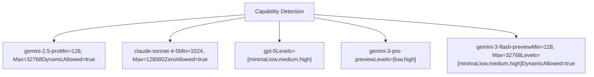
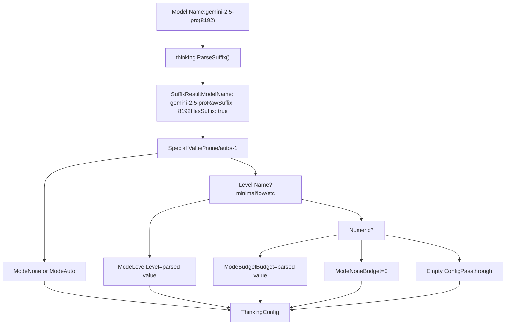
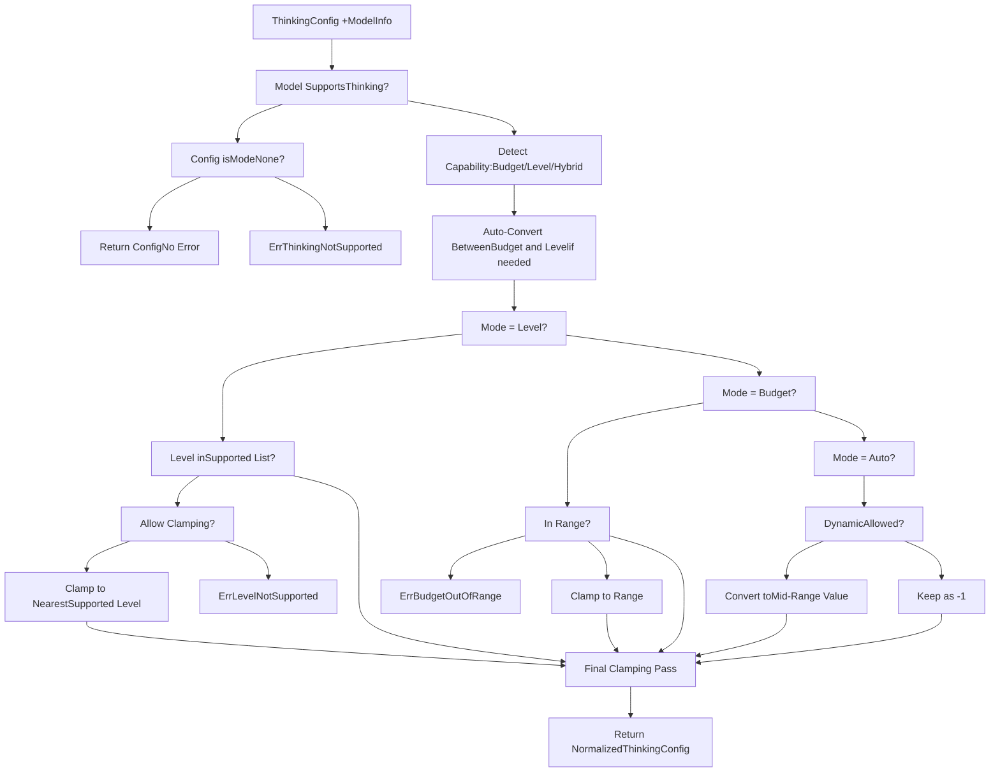
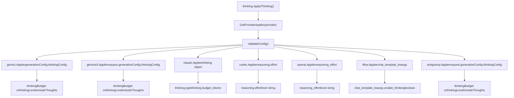

# Thinking and Reasoning Configuration

Relevant source files

-   [internal/api/handlers/management/model\_definitions.go](https://github.com/router-for-me/CLIProxyAPI/blob/c66cb0af/internal/api/handlers/management/model_definitions.go)
-   [internal/config/oauth\_model\_alias\_migration.go](https://github.com/router-for-me/CLIProxyAPI/blob/c66cb0af/internal/config/oauth_model_alias_migration.go)
-   [internal/config/oauth\_model\_alias\_migration\_test.go](https://github.com/router-for-me/CLIProxyAPI/blob/c66cb0af/internal/config/oauth_model_alias_migration_test.go)
-   [internal/config/oauth\_model\_alias\_test.go](https://github.com/router-for-me/CLIProxyAPI/blob/c66cb0af/internal/config/oauth_model_alias_test.go)
-   [internal/logging/global\_logger.go](https://github.com/router-for-me/CLIProxyAPI/blob/c66cb0af/internal/logging/global_logger.go)
-   [internal/registry/model\_definitions\_static\_data.go](https://github.com/router-for-me/CLIProxyAPI/blob/c66cb0af/internal/registry/model_definitions_static_data.go)
-   [internal/runtime/executor/payload\_helpers.go](https://github.com/router-for-me/CLIProxyAPI/blob/c66cb0af/internal/runtime/executor/payload_helpers.go)
-   [internal/thinking/apply.go](https://github.com/router-for-me/CLIProxyAPI/blob/c66cb0af/internal/thinking/apply.go)
-   [internal/thinking/provider/iflow/apply.go](https://github.com/router-for-me/CLIProxyAPI/blob/c66cb0af/internal/thinking/provider/iflow/apply.go)
-   [internal/thinking/types.go](https://github.com/router-for-me/CLIProxyAPI/blob/c66cb0af/internal/thinking/types.go)
-   [internal/thinking/validate.go](https://github.com/router-for-me/CLIProxyAPI/blob/c66cb0af/internal/thinking/validate.go)
-   [internal/util/claude\_model.go](https://github.com/router-for-me/CLIProxyAPI/blob/c66cb0af/internal/util/claude_model.go)
-   [internal/util/claude\_model\_test.go](https://github.com/router-for-me/CLIProxyAPI/blob/c66cb0af/internal/util/claude_model_test.go)
-   [internal/watcher/diff/oauth\_model\_alias.go](https://github.com/router-for-me/CLIProxyAPI/blob/c66cb0af/internal/watcher/diff/oauth_model_alias.go)
-   [sdk/translator/registry.go](https://github.com/router-for-me/CLIProxyAPI/blob/c66cb0af/sdk/translator/registry.go)
-   [test/thinking\_conversion\_test.go](https://github.com/router-for-me/CLIProxyAPI/blob/c66cb0af/test/thinking_conversion_test.go)

This page documents the system's extended thinking and reasoning configuration capabilities, which enable control over AI model reasoning depth and budget allocation. The thinking system provides a unified interface for configuring reasoning parameters across multiple providers (Gemini, Claude, OpenAI/Codex, iFlow, Antigravity) with automatic validation, format conversion, and model capability enforcement.

For general model configuration and selection, see [Model Registry and Selection](/router-for-me/CLIProxyAPI/3.6-model-registry-and-selection). For request payload defaults and overrides, see [Payload Configuration Rules](/router-for-me/CLIProxyAPI/5.4-payload-configuration-rules). For signature caching and Claude thinking block validation across conversation turns, see [Signature Cache and Thinking Validation](/router-for-me/CLIProxyAPI/8.8-signature-cache-and-thinking-validation).

## Overview

The thinking configuration system allows users to control how much computational budget AI models allocate to reasoning before generating responses. Different providers support different thinking mechanisms:

-   **Budget-based**: Gemini, Claude, Antigravity use token budgets (e.g., 8192 tokens)
-   **Level-based**: OpenAI, Codex use discrete effort levels (minimal, low, medium, high, xhigh)
-   **Hybrid**: Some Gemini 3 models support both budgets and levels

The system automatically converts between formats and validates configurations against model capabilities, with intelligent clamping when values are out of range.

**Configuration Methods**:

1.  Model name suffix: `gemini-2.5-pro(8192)` or `gpt-5.2(medium)`
2.  Request body JSON: Provider-specific thinking parameters
3.  Default payload rules: Configuration file defaults

Sources: [internal/thinking/apply.go1-307](https://github.com/router-for-me/CLIProxyAPI/blob/c66cb0af/internal/thinking/apply.go#L1-L307) [internal/registry/model\_definitions\_static\_data.go1-122](https://github.com/router-for-me/CLIProxyAPI/blob/c66cb0af/internal/registry/model_definitions_static_data.go#L1-L122)

## Model Thinking Capabilities

### ThinkingSupport Structure

Each model in the registry declares its thinking capabilities via the `ThinkingSupport` structure:

```
type ThinkingSupport struct {    Min             int      // Minimum token budget (budget-based models)    Max             int      // Maximum token budget (budget-based models)    ZeroAllowed     bool     // Whether budget=0 (disabled) is allowed    DynamicAllowed  bool     // Whether auto/-1 (dynamic) is supported    Levels          []string // Supported effort levels (level-based models)}
```
### Model Capability Classes


**Capability Detection Logic**:

-   **Budget-only**: `Min > 0 || Max > 0`, no `Levels` defined
-   **Level-only**: `Levels` defined, `Min == 0 && Max == 0`
-   **Hybrid**: Both `Levels` and budget range defined

Sources: [internal/registry/model\_definitions\_static\_data.go1-232](https://github.com/router-for-me/CLIProxyAPI/blob/c66cb0af/internal/registry/model_definitions_static_data.go#L1-L232) [internal/thinking/validate.go60-89](https://github.com/router-for-me/CLIProxyAPI/blob/c66cb0af/internal/thinking/validate.go#L60-L89)

### Example Model Configurations

| Model | Type | Configuration |
| --- | --- | --- |
| `gemini-2.5-pro` | Budget | Min=128, Max=32768, DynamicAllowed=true |
| `gemini-2.5-flash` | Budget | Min=0, Max=24576, ZeroAllowed=true, DynamicAllowed=true |
| `gemini-2.5-flash-lite` | Budget | Min=0, Max=24576, ZeroAllowed=true, DynamicAllowed=true |
| `gemini-3-pro-preview` | Hybrid | Min=128, Max=32768, Levels=\[low,high\], DynamicAllowed=true |
| `gemini-3-flash-preview` | Hybrid | Min=128, Max=32768, Levels=\[minimal,low,medium,high\], DynamicAllowed=true |
| `claude-sonnet-4-5-20250929` | Budget | Min=1024, Max=128000, ZeroAllowed=true, DynamicAllowed=false |
| `claude-haiku-4-5-20251001` | Budget | Min=1024, Max=128000, ZeroAllowed=true, DynamicAllowed=false |
| `claude-3-5-haiku-20241022` | None | No thinking support |
| `gpt-5` | Level | Levels=\[minimal,low,medium,high\] |
| `gpt-5.2` | Level | Levels=\[none,low,medium,high,xhigh\] |

Sources: [internal/registry/model\_definitions\_static\_data.go6-122](https://github.com/router-for-me/CLIProxyAPI/blob/c66cb0af/internal/registry/model_definitions_static_data.go#L6-L122) [internal/registry/model\_definitions\_static\_data.go126-232](https://github.com/router-for-me/CLIProxyAPI/blob/c66cb0af/internal/registry/model_definitions_static_data.go#L126-L232) [internal/registry/model\_definitions\_static\_data.go674-788](https://github.com/router-for-me/CLIProxyAPI/blob/c66cb0af/internal/registry/model_definitions_static_data.go#L674-L788)

## Configuration Modes and Syntax

### ThinkingConfig Structure

```
type ThinkingConfig struct {    Mode   ThinkingMode   // none, budget, level, auto    Budget int            // Token budget (0, -1, or positive integer)    Level  ThinkingLevel  // Effort level (minimal, low, medium, high, xhigh)}
```
### Mode Types

| Mode | Description | Budget Value | Level Value |
| --- | --- | --- | --- |
| `ModeNone` | Thinking disabled | 0 | empty |
| `ModeBudget` | Token budget specified | \> 0 | empty |
| `ModeLevel` | Effort level specified | 0 | valid level |
| `ModeAuto` | Dynamic/auto allocation | \-1 | empty |

Sources: [internal/thinking/types.go1-50](https://github.com/router-for-me/CLIProxyAPI/blob/c66cb0af/internal/thinking/types.go#L1-L50)

### Model Name Suffix Syntax

The system supports thinking configuration via model name suffixes using parentheses notation:

```
model-name(thinking-value)
```
**Suffix Value Types**:

| Syntax | Mode | Example | Description |
| --- | --- | --- | --- |
| `(none)` | None | `gemini-2.5-pro(none)` | Disable thinking |
| `(auto)` or `(-1)` | Auto | `gemini-2.5-pro(auto)` | Dynamic allocation |
| `(minimal)`, `(low)`, `(medium)`, `(high)`, `(xhigh)` | Level | `gpt-5.2(high)` | Effort level |
| `(1234)` | Budget | `gemini-2.5-pro(8192)` | Token budget |
| `(0)` | None | `claude-sonnet-4-5(0)` | Explicitly disabled |

**Parsing Priority** (in `parseSuffixToConfig`):

1.  Special values: `none`, `auto`, `-1`
2.  Level names: `minimal`, `low`, `medium`, `high`, `xhigh`
3.  Numeric values: positive integers or 0

Sources: [internal/thinking/parse.go1-150](https://github.com/router-for-me/CLIProxyAPI/blob/c66cb0af/internal/thinking/parse.go#L1-L150) [internal/thinking/apply.go202-241](https://github.com/router-for-me/CLIProxyAPI/blob/c66cb0af/internal/thinking/apply.go#L202-L241)

### Suffix Parsing Flow


Sources: [internal/thinking/parse.go1-150](https://github.com/router-for-me/CLIProxyAPI/blob/c66cb0af/internal/thinking/parse.go#L1-L150) [internal/thinking/apply.go202-241](https://github.com/router-for-me/CLIProxyAPI/blob/c66cb0af/internal/thinking/apply.go#L202-L241)

## Validation and Normalization

### Validation Pipeline


Sources: [internal/thinking/validate.go38-155](https://github.com/router-for-me/CLIProxyAPI/blob/c66cb0af/internal/thinking/validate.go#L38-L155)

### Clamping Logic

**Budget Clamping** (`clampBudget` function):

-   Values below `Min` → clamped to `Min`
-   Values above `Max` → clamped to `Max`
-   `0` when `ZeroAllowed=false` → clamped to `Min`
-   `-1` (auto) → passes through without clamping

**Level Clamping** (`clampLevel` function):

-   Uses standard level ordering: `minimal` < `low` < `medium` < `high` < `xhigh`
-   Finds nearest supported level by distance
-   On tie, prefers lower level
-   Example: Model supports `[low, high]`, requesting `medium` → clamped to `low`

**Mid-Range Conversion** (for `auto` when `DynamicAllowed=false`):

-   Level-only models: convert to `LevelMedium`
-   Budget models: convert to `(Min + Max) / 2`

Sources: [internal/thinking/validate.go167-378](https://github.com/router-for-me/CLIProxyAPI/blob/c66cb0af/internal/thinking/validate.go#L167-L378)

## Provider-Specific Application

### Provider Applier Architecture


Sources: [internal/thinking/apply.go1-307](https://github.com/router-for-me/CLIProxyAPI/blob/c66cb0af/internal/thinking/apply.go#L1-L307) [internal/thinking/provider/](https://github.com/router-for-me/CLIProxyAPI/blob/c66cb0af/internal/thinking/provider/)

### Provider Application Details

| Provider | Path | Budget Format | Level Format | includeThoughts |
| --- | --- | --- | --- | --- |
| `gemini` | `generationConfig.thinkingConfig` | `thinkingBudget: int` | `thinkingLevel: string` | `includeThoughts: bool` |
| `gemini-cli` | `request.generationConfig.thinkingConfig` | `thinkingBudget: int` | `thinkingLevel: string` | `includeThoughts: bool` |
| `antigravity` | `request.generationConfig.thinkingConfig` | `thinkingBudget: int` | `thinkingLevel: string` | `includeThoughts: bool` |
| `claude` | `thinking` | `budget_tokens: int` | N/A | N/A |
| `codex` | `reasoning` | N/A | `effort: string` | N/A |
| `openai` | root | N/A | `reasoning_effort: string` | N/A |
| `iflow` | `chat_template_kwargs` | N/A | `enable_thinking: bool` | N/A |

**Special Handling**:

-   **Gemini family** (`gemini`, `gemini-cli`, `antigravity`):

    -   Budget: Sets `thinkingBudget` to value, `includeThoughts=true`
    -   Level: Sets `thinkingLevel` to level string, `includeThoughts=true`
    -   Auto (-1): Sets `thinkingBudget=-1`, `includeThoughts=true`
    -   None with budget > 0: Sets budget, `includeThoughts=false`
-   **Claude**:

    -   Budget: Sets `thinking.type="enabled"`, `thinking.budget_tokens=value`
    -   None: Sets `thinking.type="disabled"`, omits `budget_tokens`
    -   Auto: Sets `thinking.type="enabled"`, `thinking.budget_tokens=-1`
-   **OpenAI/Codex**:

    -   Level: Sets `reasoning_effort` or `reasoning.effort` to level string
    -   None: Omits reasoning configuration entirely
-   **iFlow**:

    -   Converts level/budget to boolean: `chat_template_kwargs.enable_thinking=true/false`
    -   Only supports enable/disable, no granular control

Sources: [internal/thinking/provider/gemini/applier.go](https://github.com/router-for-me/CLIProxyAPI/blob/c66cb0af/internal/thinking/provider/gemini/applier.go) [internal/thinking/provider/claude/applier.go](https://github.com/router-for-me/CLIProxyAPI/blob/c66cb0af/internal/thinking/provider/claude/applier.go) [internal/thinking/provider/codex/applier.go](https://github.com/router-for-me/CLIProxyAPI/blob/c66cb0af/internal/thinking/provider/codex/applier.go) [internal/thinking/provider/openai/applier.go](https://github.com/router-for-me/CLIProxyAPI/blob/c66cb0af/internal/thinking/provider/openai/applier.go) [internal/thinking/provider/iflow/applier.go](https://github.com/router-for-me/CLIProxyAPI/blob/c66cb0af/internal/thinking/provider/iflow/applier.go)

> **Note**: Signature caching for Claude multi-turn thinking conversations—including `SignatureCache`, `CacheSignature`, `GetCachedSignature`, and the `skip_thought_signature_validator` sentinel—is covered in [Signature Cache and Thinking Validation](/router-for-me/CLIProxyAPI/8.8-signature-cache-and-thinking-validation).

## Configuration Priority and Suffix Behavior

### Priority Order

When multiple configuration sources exist, the system follows this priority (highest to lowest):

1.  **Model name suffix**: `gemini-2.5-pro(8192)`
2.  **Request body JSON**: Provider-specific thinking parameters
3.  **Payload default rules**: Configuration file defaults (see [Payload Configuration Rules](/router-for-me/CLIProxyAPI/8.8-signature-cache-and-thinking-validation))

**Suffix Priority Implementation** (in `ApplyThinking`):

```
if suffixResult.HasSuffix {    config = parseSuffixToConfig(suffixResult.RawSuffix, providerFormat, model)    // Suffix config overrides request body} else {    config = extractThinkingConfig(body, providerFormat)}
```
Sources: [internal/thinking/apply.go136-165](https://github.com/router-for-me/CLIProxyAPI/blob/c66cb0af/internal/thinking/apply.go#L136-L165)

### Strict vs Lenient Validation

The validation strictness depends on the configuration source:

**Strict Mode** (enabled when):

-   Configuration comes from request body (`fromSuffix=false`)
-   Same provider family (`fromFormat == toFormat` or both in Gemini family)

**Lenient Mode** (enabled when):

-   Configuration comes from model suffix (`fromSuffix=true`)
-   Cross-provider translation (e.g., OpenAI → Gemini)

**Difference**:

-   **Strict**: Out-of-range budgets return `ErrBudgetOutOfRange`
-   **Lenient**: Out-of-range budgets are silently clamped

Sources: [internal/thinking/validate.go56-129](https://github.com/router-for-me/CLIProxyAPI/blob/c66cb0af/internal/thinking/validate.go#L56-L129)

## Example Configurations

### Example 1: Gemini Budget-Based Thinking

**Via Model Suffix**:

```
gemini-2.5-pro(8192)
```
**Via Request Body**:

```
{  "model": "gemini-2.5-pro",  "contents": [...],  "generationConfig": {    "thinkingConfig": {      "thinkingBudget": 8192,      "includeThoughts": true    }  }}
```
**Validation**:

-   Model supports: Min=128, Max=32768, DynamicAllowed=true
-   Budget 8192 is within range → accepted as-is

### Example 2: Claude Thinking with Disabled Mode

**Via Model Suffix**:

```
claude-sonnet-4-5(none)
```
**Via Request Body**:

```
{  "model": "claude-sonnet-4-5",  "messages": [...],  "thinking": {    "type": "disabled"  }}
```
**Validation**:

-   Mode becomes `ModeNone`
-   Output: `thinking.type="disabled"`, no `budget_tokens` field

### Example 3: OpenAI Level-Based Thinking

**Via Model Suffix**:

```
gpt-5.2(high)
```
**Via Request Body**:

```
{  "model": "gpt-5.2",  "messages": [...],  "reasoning_effort": "high"}
```
**Validation**:

-   Model supports: Levels=\[none,low,medium,high,xhigh\]
-   Level "high" is in supported list → accepted

### Example 4: Cross-Provider Budget to Level Conversion

**Request**: OpenAI format to Codex provider

```
gpt-5(8192)
```
**Processing**:

1.  Parse suffix: `ModeBudget`, `Budget=8192`
2.  Detect target model capability: Level-only, Levels=\[minimal,low,medium,high\]
3.  Convert budget to level: `8192` → `LevelMedium` (standard conversion)
4.  Clamp level: `medium` is in supported list → no clamping needed
5.  Apply: `reasoning.effort="medium"`

### Example 5: Auto Mode with DynamicAllowed=false

**Request**: Gemini 3 Pro Preview (supports both)

```
gemini-3-pro-preview(auto)
```
**Processing**:

1.  Parse suffix: `ModeAuto`
2.  Model supports: Levels=\[low,high\], Min=128, Max=32768, DynamicAllowed=true
3.  Auto is allowed: Keep as `Budget=-1`
4.  Apply: `thinkingBudget=-1`, `includeThoughts=true`

**Counter-example**: Level-only model with DynamicAllowed=false

```
gpt-5(auto)
```
**Processing**:

1.  Parse suffix: `ModeAuto`
2.  Model supports: Levels=\[minimal,low,medium,high\], no budget range, DynamicAllowed=false
3.  Convert to mid-range: `ModeLevel`, `Level=LevelMedium`
4.  Apply: `reasoning_effort="medium"`

Sources: [test/thinking\_conversion\_test.go42-717](https://github.com/router-for-me/CLIProxyAPI/blob/c66cb0af/test/thinking_conversion_test.go#L42-L717)

## User-Defined Models

For models configured via `config.yaml` (OpenAI-compatible endpoints, custom providers), thinking configuration **skips validation** and is applied directly to allow the upstream service to validate.

**Detection**: Models with `UserDefined=true` in `ModelInfo` or unknown models (nil `ModelInfo`)

**Behavior**:

-   No capability checking
-   No clamping or conversion
-   Direct application of configuration to request body
-   Level-to-budget conversion still occurs for format compatibility

Sources: [internal/thinking/apply.go43-48](https://github.com/router-for-me/CLIProxyAPI/blob/c66cb0af/internal/thinking/apply.go#L43-L48) [internal/thinking/apply.go243-306](https://github.com/router-for-me/CLIProxyAPI/blob/c66cb0af/internal/thinking/apply.go#L243-L306)

## Error Handling

### Error Types

| Error Code | Condition | Example |
| --- | --- | --- |
| `ErrThinkingNotSupported` | Model doesn't support thinking | Requesting thinking for `claude-haiku-4-5` |
| `ErrLevelNotSupported` | Level not in model's supported list | Requesting `xhigh` for model with `[low,high]` |
| `ErrBudgetOutOfRange` | Budget outside min/max (strict mode only) | Requesting 200000 for model with Max=32768 |
| `ErrUnknownLevel` | Invalid level string | Level string doesn't match standard levels |

**Error Response**: Original request body is returned unchanged, allowing the upstream service to handle or reject the request.

Sources: [internal/thinking/errors.go1-50](https://github.com/router-for-me/CLIProxyAPI/blob/c66cb0af/internal/thinking/errors.go#L1-L50) [internal/thinking/apply.go168-179](https://github.com/router-for-me/CLIProxyAPI/blob/c66cb0af/internal/thinking/apply.go#L168-L179)

## Diagnostic Logging

The thinking system emits structured debug logs at key decision points:

**Log Fields**:

-   `provider`: Target provider format
-   `model`: Model name
-   `mode`: Current thinking mode (budget/level/auto/none)
-   `budget`: Budget value
-   `level`: Level value
-   `original_mode`: Mode before conversion
-   `original_value`: Value before clamping
-   `clamped_to`: Value after clamping
-   `min`, `max`: Model capability bounds

**Example Log Entries**:

```
[DEBUG] thinking: config from model suffix | provider=gemini model=gemini-2.5-pro(8192) mode=budget budget=8192
[DEBUG] thinking: budget clamped | provider=gemini model=gemini-2.5-pro original_value=64000 clamped_to=32768 min=128 max=32768
[DEBUG] thinking: mode converted, dynamic not allowed | provider=codex model=gpt-5 original_mode=auto clamped_to=medium
[WARN] thinking: validation failed | provider=openai model=gpt-5 error="level \"xhigh\" not supported, valid levels: minimal, low, medium, high"
```
Sources: [internal/thinking/validate.go173-378](https://github.com/router-for-me/CLIProxyAPI/blob/c66cb0af/internal/thinking/validate.go#L173-L378) [internal/thinking/apply.go122-196](https://github.com/router-for-me/CLIProxyAPI/blob/c66cb0af/internal/thinking/apply.go#L122-L196)

---

**Key Files Referenced**:

-   [internal/thinking/apply.go1-307](https://github.com/router-for-me/CLIProxyAPI/blob/c66cb0af/internal/thinking/apply.go#L1-L307) - Main application logic and provider routing
-   [internal/thinking/validate.go1-379](https://github.com/router-for-me/CLIProxyAPI/blob/c66cb0af/internal/thinking/validate.go#L1-L379) - Validation, clamping, and conversion logic
-   [internal/thinking/parse.go1-150](https://github.com/router-for-me/CLIProxyAPI/blob/c66cb0af/internal/thinking/parse.go#L1-L150) - Suffix parsing and extraction
-   [internal/thinking/types.go1-100](https://github.com/router-for-me/CLIProxyAPI/blob/c66cb0af/internal/thinking/types.go#L1-L100) - Core type definitions
-   [internal/registry/model\_definitions.go1-1200](https://github.com/router-for-me/CLIProxyAPI/blob/c66cb0af/internal/registry/model_definitions.go#L1-L1200) - Model capability declarations
-   [internal/cache/signature\_cache.go1-196](https://github.com/router-for-me/CLIProxyAPI/blob/c66cb0af/internal/cache/signature_cache.go#L1-L196) - Signature caching for Claude
-   [internal/translator/antigravity/claude/antigravity\_claude\_request.go1-397](https://github.com/router-for-me/CLIProxyAPI/blob/c66cb0af/internal/translator/antigravity/claude/antigravity_claude_request.go#L1-L397) - Claude request translation with signatures
-   [internal/translator/antigravity/claude/antigravity\_claude\_response.go1-524](https://github.com/router-for-me/CLIProxyAPI/blob/c66cb0af/internal/translator/antigravity/claude/antigravity_claude_response.go#L1-L524) - Claude response translation with signature accumulation
-   [test/thinking\_conversion\_test.go1-1500](https://github.com/router-for-me/CLIProxyAPI/blob/c66cb0af/test/thinking_conversion_test.go#L1-L1500) - Comprehensive test cases demonstrating all conversion scenarios
