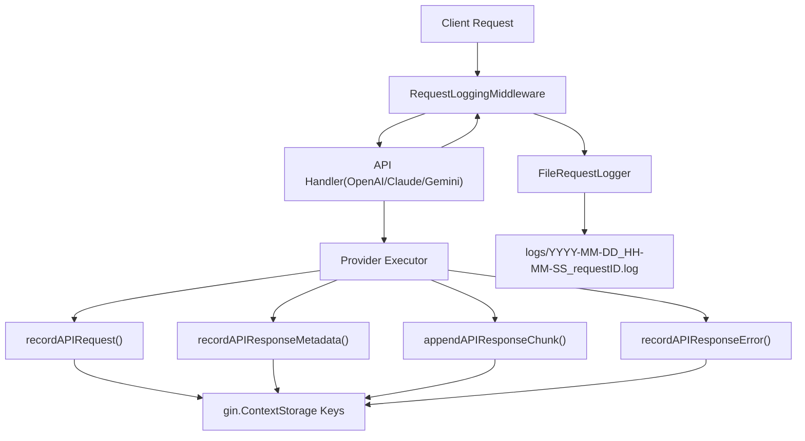
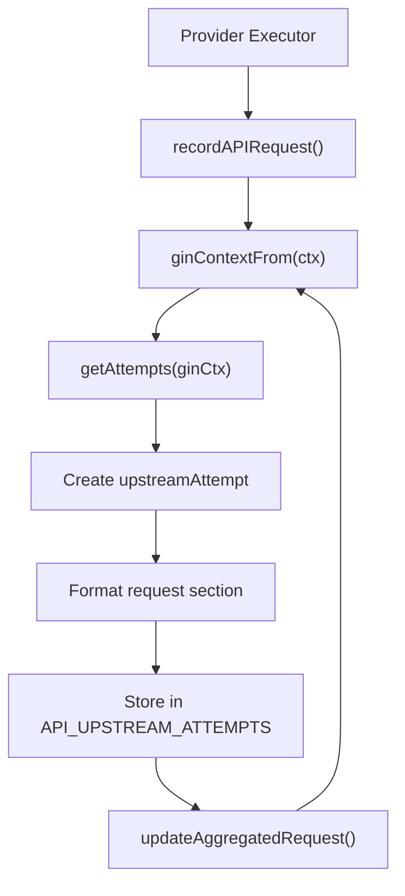
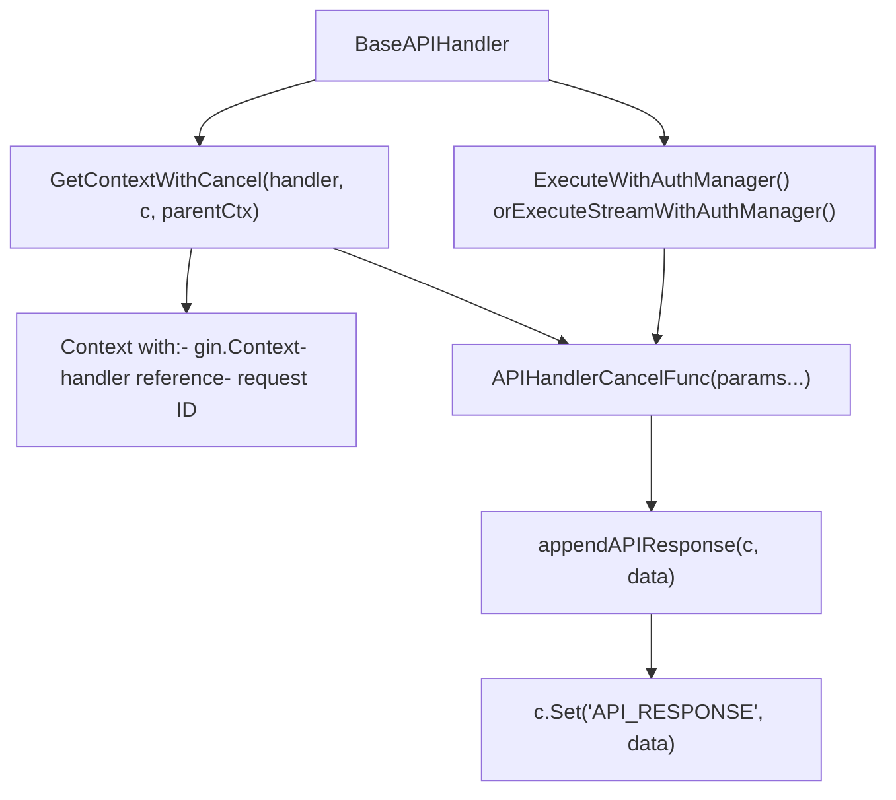

# Request and Response Logging

Relevant source files

-   [internal/api/middleware/request\_logging.go](https://github.com/router-for-me/CLIProxyAPI/blob/c66cb0af/internal/api/middleware/request_logging.go)
-   [internal/api/middleware/response\_writer.go](https://github.com/router-for-me/CLIProxyAPI/blob/c66cb0af/internal/api/middleware/response_writer.go)
-   [internal/logging/gin\_logger.go](https://github.com/router-for-me/CLIProxyAPI/blob/c66cb0af/internal/logging/gin_logger.go)
-   [internal/logging/gin\_logger\_test.go](https://github.com/router-for-me/CLIProxyAPI/blob/c66cb0af/internal/logging/gin_logger_test.go)
-   [internal/logging/request\_logger.go](https://github.com/router-for-me/CLIProxyAPI/blob/c66cb0af/internal/logging/request_logger.go)
-   [internal/runtime/executor/logging\_helpers.go](https://github.com/router-for-me/CLIProxyAPI/blob/c66cb0af/internal/runtime/executor/logging_helpers.go)
-   [sdk/api/handlers/gemini/gemini-cli\_handlers.go](https://github.com/router-for-me/CLIProxyAPI/blob/c66cb0af/sdk/api/handlers/gemini/gemini-cli_handlers.go)

CLIProxyAPI implements a detailed request and response logging system that captures both client-facing HTTP transactions and upstream provider API interactions. Request logging is controlled by the `request-log` configuration field and is disabled by default to minimize performance overhead.

## Overview

The logging system captures three categories of data:

1.  **Client Request** - Incoming HTTP request from the client (headers, body, method, path)
2.  **Upstream Attempts** - Each provider API call including authentication details, retry attempts, and responses
3.  **Final Response** - The response sent back to the client

All logged data is written to timestamped files in the `logs/` directory. Each request receives a unique request ID for correlation across log entries.

Usage statistics and token consumption tracking are handled separately by the usage subsystem (see page 8.5).

**Sources:** [internal/api/server.go59-65](https://github.com/router-for-me/CLIProxyAPI/blob/c66cb0af/internal/api/server.go#L59-L65) [internal/api/server.go210-224](https://github.com/router-for-me/CLIProxyAPI/blob/c66cb0af/internal/api/server.go#L210-L224)

---

## Configuration

### Enabling Request Logging

Request logging is controlled by the `request-log` field in `config.yaml`:

```
# Enable detailed request/response logging to filesrequest-log: true # Limit number of error log files retained (when request-log is false)error-logs-max-files: 10
```
When `request-log` is `true`, all requests are logged to timestamped files in the `logs/` directory. When `false`, only error responses (4xx/5xx status codes) are logged to separate error log files.

The `error-logs-max-files` setting controls how many error log files to retain when full request logging is disabled. Older files are automatically deleted when the limit is exceeded.

**Sources:** [internal/config/config.go62](https://github.com/router-for-me/CLIProxyAPI/blob/c66cb0af/internal/config/config.go#L62-L62) [config.example.yaml246-250](https://github.com/router-for-me/CLIProxyAPI/blob/c66cb0af/config.example.yaml#L246-L250)

### Debug Mode

The `debug` configuration option affects log verbosity but not request logging:

```
# Enable debug-level logging for application logs (separate from request-log)debug: true
```
Debug mode increases the verbosity of application logs (written to stdout or log files via `logging-to-file`), but does not affect request/response capture which is controlled solely by `request-log`.

**Sources:** [internal/config/config.go45](https://github.com/router-for-me/CLIProxyAPI/blob/c66cb0af/internal/config/config.go#L45-L45) [config.example.yaml40-41](https://github.com/router-for-me/CLIProxyAPI/blob/c66cb0af/config.example.yaml#L40-L41)

### Log File Location

Log files are written to the `logs/` directory relative to the configuration file location. The directory is resolved using the following logic:

1.  If a writable base path is available via `util.WritablePath()`, logs are written to `<base>/logs/`
2.  Otherwise, logs are written to `logs/` relative to the configuration file directory

**Sources:** [internal/api/server.go59-65](https://github.com/router-for-me/CLIProxyAPI/blob/c66cb0af/internal/api/server.go#L59-L65)

---

## Request Logging Architecture

The logging system integrates with the HTTP request pipeline through Gin context storage and middleware:

**Title:** Request Logging Data Flow


**Sources:** [internal/api/server.go210-224](https://github.com/router-for-me/CLIProxyAPI/blob/c66cb0af/internal/api/server.go#L210-L224) [internal/runtime/executor/logging\_helpers.go49-180](https://github.com/router-for-me/CLIProxyAPI/blob/c66cb0af/internal/runtime/executor/logging_helpers.go#L49-L180)

## Context Storage Keys

Request and response data is stored in the Gin context using standardized keys:

| Context Key | Type | Purpose |
| --- | --- | --- |
| `API_UPSTREAM_ATTEMPTS` | `[]*upstreamAttempt` | Array of all upstream provider attempts |
| `API_REQUEST` | `[]byte` | Aggregated upstream request sections |
| `API_RESPONSE` | `[]byte` | Aggregated upstream response sections |
| `API_RESPONSE_ERROR` | `[]*interfaces.ErrorMessage` | Error messages from handler execution |

These keys are defined as constants in the executor logging helpers:

```
const (    apiAttemptsKey = "API_UPSTREAM_ATTEMPTS"    apiRequestKey  = "API_REQUEST"    apiResponseKey = "API_RESPONSE")
```
**Sources:** [internal/runtime/executor/logging\_helpers.go18-22](https://github.com/router-for-me/CLIProxyAPI/blob/c66cb0af/internal/runtime/executor/logging_helpers.go#L18-L22)

---

## Response Capture in Handler Context

### GetContextWithCancel Pattern

The `BaseAPIHandler.GetContextWithCancel()` function creates a context with cancellation that integrates response logging:

> **[Mermaid sequence]**
> *(图表结构无法解析)*

The cancel function signature is `APIHandlerCancelFunc func(params ...interface{})`, which accepts optional response data for logging.

**Sources:** [sdk/api/handlers/handlers.go239-308](https://github.com/router-for-me/CLIProxyAPI/blob/c66cb0af/sdk/api/handlers/handlers.go#L239-L308)

### appendAPIResponse Function

The `appendAPIResponse()` function stores or appends response data in the Gin context:

```
func appendAPIResponse(c *gin.Context, data []byte) {    if c == nil || len(data) == 0 {        return    }        if existing, exists := c.Get("API_RESPONSE"); exists {        if existingBytes, ok := existing.([]byte); ok && len(existingBytes) > 0 {            // Append with newline separator            combined := make([]byte, 0, len(existingBytes)+len(data)+1)            combined = append(combined, existingBytes...)            if existingBytes[len(existingBytes)-1] != '\n' {                combined = append(combined, '\n')            }            combined = append(combined, data...)            c.Set("API_RESPONSE", combined)            return        }    }        c.Set("API_RESPONSE", bytes.Clone(data))}
```
This function handles incremental response accumulation for streaming scenarios where multiple chunks are captured.

**Sources:** [sdk/api/handlers/handlers.go358-377](https://github.com/router-for-me/CLIProxyAPI/blob/c66cb0af/sdk/api/handlers/handlers.go#L358-L377)

---

## Upstream Attempt Tracking

### Recording Upstream Requests

The `recordAPIRequest()` function captures outbound provider API calls:


Each attempt is assigned a sequential index and formatted with:

-   Timestamp
-   Upstream URL
-   HTTP method
-   Auth details (provider, auth\_id, label, type)
-   Request headers
-   Request body

**Sources:** [internal/runtime/executor/logging\_helpers.go50-94](https://github.com/router-for-me/CLIProxyAPI/blob/c66cb0af/internal/runtime/executor/logging_helpers.go#L50-L94)

### Recording Response Metadata

The `recordAPIResponseMetadata()` function captures HTTP status and headers:

```
func recordAPIResponseMetadata(ctx context.Context, cfg *config.Config, status int, headers http.Header) {    if cfg == nil || !cfg.RequestLog {        return    }    ginCtx := ginContextFrom(ctx)    if ginCtx == nil {        return    }    attempts, attempt := ensureAttempt(ginCtx)    ensureResponseIntro(attempt)        if status > 0 && !attempt.statusWritten {        attempt.response.WriteString(fmt.Sprintf("Status: %d\n", status))        attempt.statusWritten = true    }    if !attempt.headersWritten {        attempt.response.WriteString("Headers:\n")        writeHeaders(attempt.response, headers)        attempt.headersWritten = true        attempt.response.WriteString("\n")    }        updateAggregatedResponse(ginCtx, attempts)}
```
**Sources:** [internal/runtime/executor/logging\_helpers.go97-120](https://github.com/router-for-me/CLIProxyAPI/blob/c66cb0af/internal/runtime/executor/logging_helpers.go#L97-L120)

### Appending Response Chunks

The `appendAPIResponseChunk()` function accumulates streaming response data:

```
func appendAPIResponseChunk(ctx context.Context, cfg *config.Config, chunk []byte) {    if cfg == nil || !cfg.RequestLog {        return    }    data := bytes.TrimSpace(bytes.Clone(chunk))    if len(data) == 0 {        return    }    ginCtx := ginContextFrom(ctx)    if ginCtx == nil {        return    }    attempts, attempt := ensureAttempt(ginCtx)    ensureResponseIntro(attempt)        // Write body header if first chunk    if !attempt.bodyStarted {        attempt.response.WriteString("Body:\n")        attempt.bodyStarted = true    }    // Separate chunks with double newline    if attempt.bodyHasContent {        attempt.response.WriteString("\n\n")    }    attempt.response.WriteString(string(data))    attempt.bodyHasContent = true        updateAggregatedResponse(ginCtx, attempts)}
```
**Sources:** [internal/runtime/executor/logging\_helpers.go148-180](https://github.com/router-for-me/CLIProxyAPI/blob/c66cb0af/internal/runtime/executor/logging_helpers.go#L148-L180)

### upstreamAttempt Data Structure

Each upstream attempt maintains state for incremental response building:

```
type upstreamAttempt struct {    index                int              // Sequential attempt number    request              string           // Formatted request section    response             *strings.Builder // Accumulated response content    responseIntroWritten bool             // Header written once    statusWritten        bool             // Status line written    headersWritten       bool             // Headers written    bodyStarted          bool             // Body section started    bodyHasContent       bool             // Body has actual content    errorWritten         bool             // Error message written}
```
**Sources:** [internal/runtime/executor/logging\_helpers.go37-47](https://github.com/router-for-me/CLIProxyAPI/blob/c66cb0af/internal/runtime/executor/logging_helpers.go#L37-L47)

### Multi-Attempt Tracking

The system maintains separate log sections for each retry attempt:

> **[Mermaid sequence]**
> *(图表结构无法解析)*

**Sources:** [internal/runtime/executor/logging\_helpers.go49-145](https://github.com/router-for-me/CLIProxyAPI/blob/c66cb0af/internal/runtime/executor/logging_helpers.go#L49-L145) [internal/runtime/executor/logging\_helpers.go224-257](https://github.com/router-for-me/CLIProxyAPI/blob/c66cb0af/internal/runtime/executor/logging_helpers.go#L224-L257)

### Authentication Information Formatting

The `formatAuthInfo()` function formats authentication details for upstream request logs with sensitive data masking:

| Field | Source | Masking |
| --- | --- | --- |
| `provider` | `upstreamRequestLog.Provider` | None |
| `auth_id` | `upstreamRequestLog.AuthID` | None |
| `label` | `upstreamRequestLog.AuthLabel` | None |
| `type` | `upstreamRequestLog.AuthType` | None |
| `value` | `upstreamRequestLog.AuthValue` | API keys masked with `util.HideAPIKey()` |

Output examples:

```
Auth: provider=gemini, auth_id=abc123, label=prod-key, type=api_key, value=AIza...xyz
Auth: provider=claude, auth_id=def456, label=oauth-account, type=oauth
```
API keys are masked to show only the first 4 and last 4 characters, preventing credential leakage in log files.

**Sources:** [internal/runtime/executor/logging\_helpers.go285-319](https://github.com/router-for-me/CLIProxyAPI/blob/c66cb0af/internal/runtime/executor/logging_helpers.go#L285-L319)

---

## FileRequestLogger Implementation

### Logger Initialization

The `FileRequestLogger` is created by the default request logger factory:

```
func defaultRequestLoggerFactory(cfg *config.Config, configPath string) logging.RequestLogger {    configDir := filepath.Dir(configPath)    if base := util.WritablePath(); base != "" {        return logging.NewFileRequestLogger(cfg.RequestLog, filepath.Join(base, "logs"), configDir, cfg.ErrorLogsMaxFiles)    }    return logging.NewFileRequestLogger(cfg.RequestLog, "logs", configDir, cfg.ErrorLogsMaxFiles)}
```
The logger is registered with the Gin engine via `RequestLoggingMiddleware`:

```
engine.Use(middleware.RequestLoggingMiddleware(requestLogger))
```
**Sources:** [internal/api/server.go59-65](https://github.com/router-for-me/CLIProxyAPI/blob/c66cb0af/internal/api/server.go#L59-L65) [internal/api/server.go210-224](https://github.com/router-for-me/CLIProxyAPI/blob/c66cb0af/internal/api/server.go#L210-L224)

### Dynamic Enable/Disable

The `FileRequestLogger` supports dynamic enable/disable via the `SetEnabled(bool)` method. This allows hot-reload configuration changes to take effect without restarting the server:

```
if setter, ok := requestLogger.(interface{ SetEnabled(bool) }); ok {    toggle = setter.SetEnabled}
```
When `request-log` is updated via configuration hot-reload, the middleware calls this setter to enable or disable logging immediately.

**Sources:** [internal/api/server.go220-223](https://github.com/router-for-me/CLIProxyAPI/blob/c66cb0af/internal/api/server.go#L220-L223) [internal/api/server.go877-882](https://github.com/router-for-me/CLIProxyAPI/blob/c66cb0af/internal/api/server.go#L877-L882)

---

## Log File Format

### File Naming Convention

Log files follow the naming pattern:

```
YYYY-MM-DD_HH-MM-SS_<requestID>.log
```
Examples:

-   `2025-06-15_14-30-22_abc123.log`
-   `2025-06-15_14-30-23_def456.log`

Each file contains the complete transaction log for a single request, including all upstream retry attempts.

### Log File Structure

A typical log file contains the following sections:

```
============================================================
Request ID: abc123def456
Time: 2025-06-15 14:30:22
Method: POST
Path: /v1/chat/completions
Headers:
  Content-Type: application/json
  Authorization: Bearer sk-...
Body:
{"model":"claude-sonnet-4","messages":[...]}

============================================================
Upstream Request (Attempt 1)
Timestamp: 2025-06-15 14:30:22.123
URL: https://api.anthropic.com/v1/messages
Method: POST
Auth: provider=claude, auth_id=abc123, label=prod-key, type=api_key, value=sk-ant-...xyz
Headers:
  anthropic-version: 2023-06-01
  x-api-key: sk-ant-...xyz
Body:
{"model":"claude-sonnet-4-20241022","messages":[...]}

Response:
Status: 200
Headers:
  content-type: text/event-stream
Body:
data: {"type":"message_start",...}

data: {"type":"content_block_delta",...}

============================================================
Final Response
Status: 200
Headers:
  content-type: text/event-stream
Body:
data: {"id":"msg_...","type":"message_start",...}
```
**Sources:** [internal/logging/request\_logger.go1-594](https://github.com/router-for-me/CLIProxyAPI/blob/c66cb0af/internal/logging/request_logger.go#L1-L594)

---

## Handler Integration

### Handler Context Pattern

Handlers use `GetContextWithCancel()` to create contexts that integrate with logging:


The cancel function signature `func(params ...interface{})` accepts optional response data (byte slice, error, or string) that is stored in the `API_RESPONSE` context key.

**Sources:** [sdk/api/handlers/handlers.go239-308](https://github.com/router-for-me/CLIProxyAPI/blob/c66cb0af/sdk/api/handlers/handlers.go#L239-L308) [sdk/api/handlers/handlers.go358-377](https://github.com/router-for-me/CLIProxyAPI/blob/c66cb0af/sdk/api/handlers/handlers.go#L358-L377)

### Error Response Tracking

The `LoggingAPIResponseError()` method accumulates error responses:

```
func (h *BaseAPIHandler) LoggingAPIResponseError(ctx context.Context, err *interfaces.ErrorMessage) {    if h.Cfg.RequestLog {        if ginContext, ok := ctx.Value("gin").(*gin.Context); ok {            if apiResponseErrors, isExist := ginContext.Get("API_RESPONSE_ERROR"); isExist {                // Append to existing error list                slicesAPIResponseError := apiResponseErrors.([]*interfaces.ErrorMessage)                slicesAPIResponseError = append(slicesAPIResponseError, err)                ginContext.Set("API_RESPONSE_ERROR", slicesAPIResponseError)            } else {                // Create new error list                ginContext.Set("API_RESPONSE_ERROR", []*interfaces.ErrorMessage{err})            }        }    }}
```
Errors are stored in the `API_RESPONSE_ERROR` context key as `[]*interfaces.ErrorMessage`.

**Sources:** [sdk/api/handlers/handlers.go706-720](https://github.com/router-for-me/CLIProxyAPI/blob/c66cb0af/sdk/api/handlers/handlers.go#L706-L720)

---

## Implementation Details

### Thread Safety

All logging components use appropriate synchronization:

| Component | Mechanism | Purpose |
| --- | --- | --- |
| `FileStreamingLogWriter` | Channel + goroutine | Non-blocking async writes |
| `RequestStatistics` | `sync.RWMutex` | Concurrent read/write access |
| `usage.Manager` | `sync.Mutex` + condition | Queue coordination |
| `usageReporter` | `sync.Once` | Exactly-once publishing |

**Sources:** [internal/logging/request\_logger.go558-573](https://github.com/router-for-me/CLIProxyAPI/blob/c66cb0af/internal/logging/request_logger.go#L558-L573) [internal/usage/logger\_plugin.go59-73](https://github.com/router-for-me/CLIProxyAPI/blob/c66cb0af/internal/usage/logger_plugin.go#L59-L73) [sdk/cliproxy/usage/manager.go43-56](https://github.com/router-for-me/CLIProxyAPI/blob/c66cb0af/sdk/cliproxy/usage/manager.go#L43-L56) [internal/runtime/executor/usage\_helpers.go18-27](https://github.com/router-for-me/CLIProxyAPI/blob/c66cb0af/internal/runtime/executor/usage_helpers.go#L18-L27)

### Error Handling

Logging errors are handled gracefully without disrupting request processing:

-   **Decompression failures** - Append error message but preserve original response
-   **File write failures** - Return error but don't crash
-   **Channel overflow** - Drop chunks silently in non-blocking mode
-   **Plugin panics** - Recovered in `safeInvoke()` with error logging

**Sources:** [internal/logging/request\_logger.go173-177](https://github.com/router-for-me/CLIProxyAPI/blob/c66cb0af/internal/logging/request_logger.go#L173-L177) [internal/logging/request\_logger.go589-593](https://github.com/router-for-me/CLIProxyAPI/blob/c66cb0af/internal/logging/request_logger.go#L589-L593) [sdk/cliproxy/usage/manager.go157-164](https://github.com/router-for-me/CLIProxyAPI/blob/c66cb0af/sdk/cliproxy/usage/manager.go#L157-L164)

### Performance Considerations

The logging system is designed to minimize impact on request latency:

1.  **Asynchronous writes** - Streaming chunks written by background goroutine
2.  **Non-blocking channels** - Drops chunks if buffer full rather than blocking
3.  **Lazy initialization** - Log files created only when needed
4.  **Conditional execution** - Early return when logging disabled
5.  **Clone on write** - Copies data before async processing to prevent races

**Sources:** [internal/logging/request\_logger.go575-594](https://github.com/router-for-me/CLIProxyAPI/blob/c66cb0af/internal/logging/request_logger.go#L575-L594) [internal/runtime/executor/logging\_helpers.go152-155](https://github.com/router-for-me/CLIProxyAPI/blob/c66cb0af/internal/runtime/executor/logging_helpers.go#L152-L155)
