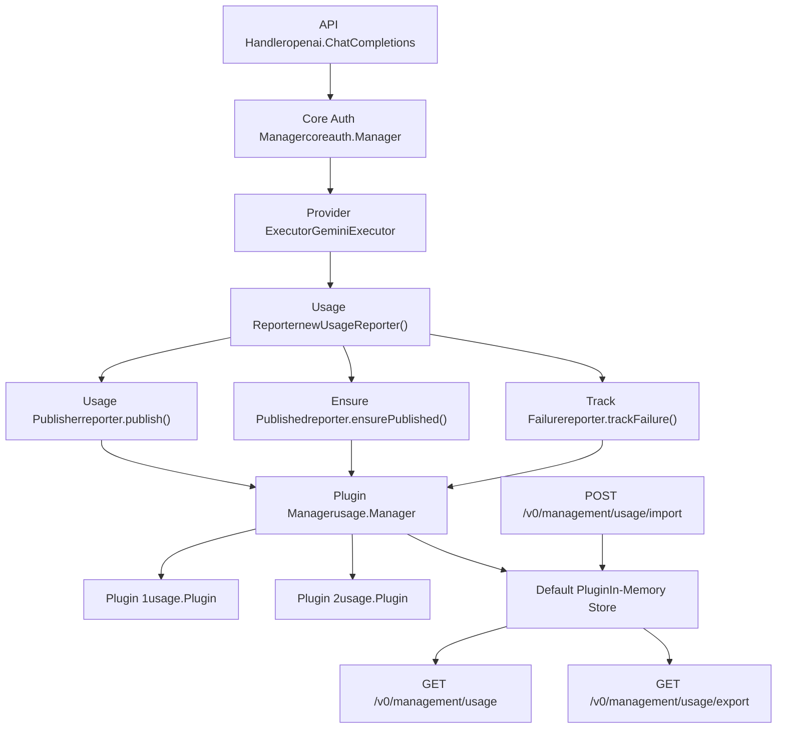
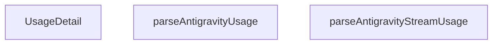
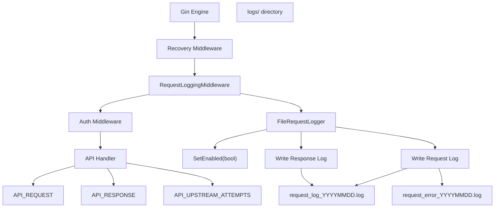
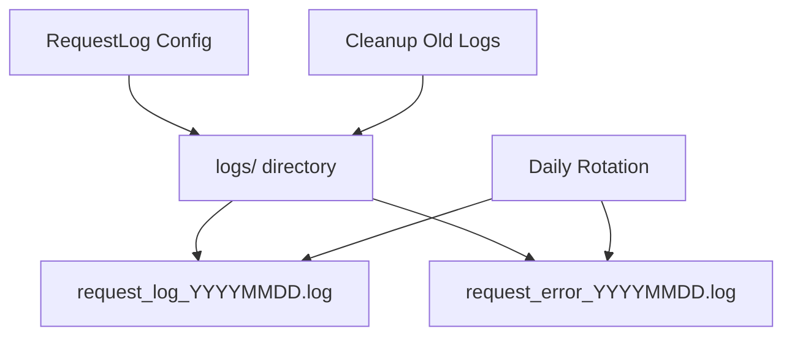
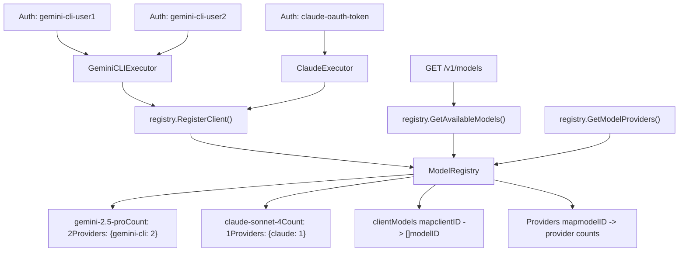

# Usage Statistics and Monitoring

Relevant source files

-   [internal/api/handlers/management/usage.go](https://github.com/router-for-me/CLIProxyAPI/blob/c66cb0af/internal/api/handlers/management/usage.go)
-   [internal/runtime/executor/usage\_helpers.go](https://github.com/router-for-me/CLIProxyAPI/blob/c66cb0af/internal/runtime/executor/usage_helpers.go)
-   [internal/usage/logger\_plugin.go](https://github.com/router-for-me/CLIProxyAPI/blob/c66cb0af/internal/usage/logger_plugin.go)
-   [sdk/cliproxy/usage/manager.go](https://github.com/router-for-me/CLIProxyAPI/blob/c66cb0af/sdk/cliproxy/usage/manager.go)

This document describes the usage statistics and monitoring features in the CLI Proxy API system, including usage tracking, request/response logging, and observability endpoints.

**Scope**: This page covers the internal usage statistics aggregation system, request/response logging for debugging, and the management API endpoints for accessing runtime metrics. For configuration file structure and hot-reload behavior, see [Configuration File Structure](/router-for-me/CLIProxyAPI/5.1-configuration-file-structure). For management API authentication and access control, see [Management API](/router-for-me/CLIProxyAPI/4.4-management-api).

---

## Overview

The CLI Proxy API provides two primary observability mechanisms:

1.  **Usage Statistics**: In-memory aggregation of API request counts, token consumption, and provider-level metrics exposed via the management API
2.  **Request/Response Logging**: Detailed capture of HTTP requests and responses for debugging and audit purposes

Both systems are independently configurable and designed to minimize overhead when disabled.

**Sources**: [internal/api/server.go29](https://github.com/router-for-me/CLIProxyAPI/blob/c66cb0af/internal/api/server.go#L29-L29) [internal/config/config.go52-53](https://github.com/router-for-me/CLIProxyAPI/blob/c66cb0af/internal/config/config.go#L52-L53) [sdk/cliproxy/service.go18](https://github.com/router-for-me/CLIProxyAPI/blob/c66cb0af/sdk/cliproxy/service.go#L18-L18)

---

## Usage Statistics System

### Architecture

The usage statistics system implements a plugin-based architecture where usage data flows from executors through reporters to registered plugins:


**Sources**: [internal/runtime/executor/antigravity\_executor.go91-92](https://github.com/router-for-me/CLIProxyAPI/blob/c66cb0af/internal/runtime/executor/antigravity_executor.go#L91-L92) [sdk/cliproxy/service.go96-98](https://github.com/router-for-me/CLIProxyAPI/blob/c66cb0af/sdk/cliproxy/service.go#L96-L98) [internal/api/server.go478-480](https://github.com/router-for-me/CLIProxyAPI/blob/c66cb0af/internal/api/server.go#L478-L480)

---

### Configuration

Usage statistics are controlled by the `usage-statistics-enabled` configuration flag:

```
# When false, disable in-memory usage statistics aggregationusage-statistics-enabled: false
```
When disabled, usage data is discarded at the publisher layer, preventing memory accumulation.

**Configuration Updates**: The `UpdateClients` method detects changes to `UsageStatisticsEnabled` and propagates them to the global usage manager:

[internal/api/server.go875-882](https://github.com/router-for-me/CLIProxyAPI/blob/c66cb0af/internal/api/server.go#L875-L882)

**Sources**: [internal/config/config.go52-53](https://github.com/router-for-me/CLIProxyAPI/blob/c66cb0af/internal/config/config.go#L52-L53) [internal/api/server.go875-882](https://github.com/router-for-me/CLIProxyAPI/blob/c66cb0af/internal/api/server.go#L875-L882)

---

### Usage Reporter Pattern

Each executor creates a usage reporter at the start of request processing:

> **[Mermaid sequence]**
> *(图表结构无法解析)*

The reporter pattern ensures usage data is captured even when execution fails:

| Method | Purpose | When Called |
| --- | --- | --- |
| `newUsageReporter()` | Creates reporter with context | Start of execution |
| `reporter.publish()` | Publishes parsed usage detail | After successful response |
| `reporter.ensurePublished()` | Guarantees data was sent | Before returning success |
| `reporter.trackFailure()` | Publishes failure event | Deferred, triggers on error |
| `reporter.publishFailure()` | Explicit failure publication | Manual error handling |

**Sources**: [internal/runtime/executor/antigravity\_executor.go91-92](https://github.com/router-for-me/CLIProxyAPI/blob/c66cb0af/internal/runtime/executor/antigravity_executor.go#L91-L92) [internal/runtime/executor/antigravity\_executor.go157-161](https://github.com/router-for-me/CLIProxyAPI/blob/c66cb0af/internal/runtime/executor/antigravity_executor.go#L157-L161)

---

### Usage Detail Structure

The `UsageDetail` structure captures per-request metrics parsed from provider responses:


Provider-specific parsers extract usage data from responses:

-   **Gemini/Antigravity**: Extracts `usageMetadata.promptTokenCount`, `candidatesTokenCount`, `totalTokenCount`
-   **Claude**: Parses `usage.input_tokens`, `output_tokens`, `thinking_tokens`
-   **Codex**: Extracts `usage.prompt_tokens`, `completion_tokens`, `total_tokens`

**Sources**: [internal/runtime/executor/antigravity\_executor.go157](https://github.com/router-for-me/CLIProxyAPI/blob/c66cb0af/internal/runtime/executor/antigravity_executor.go#L157-L157)

---

### Plugin System

External code can register usage plugins to consume real-time usage data:

```
// Plugin interface from sdk/cliproxy/usagetype Plugin interface {    OnUsage(detail UsageDetail)} // Registration via Serviceservice.RegisterUsagePlugin(myPlugin)
```
The default plugin aggregates statistics in memory for the management API. Custom plugins enable:

-   Real-time billing systems
-   External metrics export (Prometheus, StatsD)
-   Quota enforcement
-   Usage alerts

**Plugin Registration Flow**:

[sdk/cliproxy/service.go96-98](https://github.com/router-for-me/CLIProxyAPI/blob/c66cb0af/sdk/cliproxy/service.go#L96-L98)

The global usage manager dispatches events to all registered plugins concurrently.

**Sources**: [sdk/cliproxy/service.go96-98](https://github.com/router-for-me/CLIProxyAPI/blob/c66cb0af/sdk/cliproxy/service.go#L96-L98)

---

## Request and Response Logging

### Request Logging Middleware

The `RequestLoggingMiddleware` captures complete HTTP transactions for debugging:


**Middleware Registration**:

[internal/api/server.go208-222](https://github.com/router-for-me/CLIProxyAPI/blob/c66cb0af/internal/api/server.go#L208-L222)

The request logger is conditionally created based on the `request-log` configuration flag and positioned after recovery but before authentication.

**Sources**: [internal/api/server.go208-222](https://github.com/router-for-me/CLIProxyAPI/blob/c66cb0af/internal/api/server.go#L208-L222)

---

### API Request Capture

Executors record upstream API requests using helper functions that store data in the Gin context:

| Function | Purpose | Context Key | Data Stored |
| --- | --- | --- | --- |
| `recordAPIRequest()` | Stores outbound request details | `API_REQUEST` | URL, method, headers, body, auth metadata |
| `recordAPIResponseMetadata()` | Captures response status/headers | `API_RESPONSE` | Status code, response headers |
| `recordAPIResponseError()` | Logs errors when no HTTP response | `API_RESPONSE` | Error message, timestamp |
| `appendAPIResponseChunk()` | Streams response body chunks | `API_RESPONSE` | Accumulated response body |

**Multi-Attempt Tracking**: When executors retry requests (e.g., fallback URLs), each attempt is tracked separately using `API_UPSTREAM_ATTEMPTS`:

> **[Mermaid sequence]**
> *(图表结构无法解析)*

**Sources**: [internal/runtime/executor/logging\_helpers.go49-94](https://github.com/router-for-me/CLIProxyAPI/blob/c66cb0af/internal/runtime/executor/logging_helpers.go#L49-L94) [internal/runtime/executor/logging\_helpers.go96-120](https://github.com/router-for-me/CLIProxyAPI/blob/c66cb0af/internal/runtime/executor/logging_helpers.go#L96-L120) [internal/runtime/executor/logging\_helpers.go122-145](https://github.com/router-for-me/CLIProxyAPI/blob/c66cb0af/internal/runtime/executor/logging_helpers.go#L122-L145)

---

### Upstream Request Log Structure

The `upstreamRequestLog` structure captures all details needed for debugging:

```
type upstreamRequestLog struct {    URL       string        // Full upstream URL    Method    string        // HTTP method    Headers   http.Header   // Request headers (sensitive values masked)    Body      []byte        // Request body    Provider  string        // Provider identifier (gemini, claude, etc)    AuthID    string        // Auth credential ID    AuthLabel string        // Human-readable auth label    AuthType  string        // Auth type (oauth, api-key, etc)    AuthValue string        // Masked auth value}
```
**Header Masking**: Sensitive headers like `Authorization` and `x-goog-api-key` are automatically masked using `MaskSensitiveHeaderValue()`:

[internal/util/provider.go203-216](https://github.com/router-for-me/CLIProxyAPI/blob/c66cb0af/internal/util/provider.go#L203-L216)

**Sources**: [internal/runtime/executor/logging\_helpers.go24-35](https://github.com/router-for-me/CLIProxyAPI/blob/c66cb0af/internal/runtime/executor/logging_helpers.go#L24-L35)

---

### Log File Management

Request logs are written to rotating files in the `logs/` directory:


**Log Rotation**: Files are rotated daily using date-based naming. When `logs-max-total-size-mb` is configured, the oldest files are deleted when the total size exceeds the limit:

[internal/config/config.go48-50](https://github.com/router-for-me/CLIProxyAPI/blob/c66cb0af/internal/config/config.go#L48-L50)

[internal/api/server.go858-873](https://github.com/router-for-me/CLIProxyAPI/blob/c66cb0af/internal/api/server.go#L858-L873)

**Sources**: [internal/config/config.go48-50](https://github.com/router-for-me/CLIProxyAPI/blob/c66cb0af/internal/config/config.go#L48-L50) [internal/api/server.go858-873](https://github.com/router-for-me/CLIProxyAPI/blob/c66cb0af/internal/api/server.go#L858-L873)

---

## Management API Endpoints

### Usage Statistics Endpoints

The management API exposes three endpoints for usage statistics:

| Endpoint | Method | Purpose | Response Format |
| --- | --- | --- | --- |
| `/v0/management/usage` | GET | Retrieve aggregated statistics | JSON with per-model/provider metrics |
| `/v0/management/usage/export` | GET | Export full usage data | JSON array of usage events |
| `/v0/management/usage/import` | POST | Import usage data | JSON with import count |

**Route Registration**:

[internal/api/server.go478-480](https://github.com/router-for-me/CLIProxyAPI/blob/c66cb0af/internal/api/server.go#L478-L480)

**Sources**: [internal/api/server.go478-480](https://github.com/router-for-me/CLIProxyAPI/blob/c66cb0af/internal/api/server.go#L478-L480)

---

### Usage Endpoint Response Structure

The `GET /v0/management/usage` endpoint returns aggregated statistics grouped by model and provider:

```
{  "statistics": {    "gemini-2.5-pro": {      "total_requests": 150,      "successful_requests": 148,      "failed_requests": 2,      "total_prompt_tokens": 45000,      "total_completion_tokens": 67000,      "total_tokens": 112000,      "providers": {        "gemini-cli": {          "requests": 100,          "tokens": 75000        },        "aistudio": {          "requests": 50,          "tokens": 37000        }      }    }  }}
```
---

### Export/Import Format

The export endpoint returns individual usage events for external processing:

```
[  {    "timestamp": "2025-01-15T10:30:45Z",    "provider": "gemini-cli",    "model": "gemini-2.5-pro",    "auth_id": "gemini-cli-user@example.com",    "auth_label": "user@example.com",    "prompt_tokens": 150,    "completion_tokens": 300,    "total_tokens": 450,    "thinking_tokens": 0,    "success": true  }]
```
The import endpoint accepts the same format to restore usage history after restart or migrate from another instance.

**Sources**: [internal/api/server.go478-480](https://github.com/router-for-me/CLIProxyAPI/blob/c66cb0af/internal/api/server.go#L478-L480)

---

### Request Log Endpoints

The management API provides endpoints to access request logs:

| Endpoint | Method | Purpose |
| --- | --- | --- |
| `/v0/management/logs` | GET | List available log files |
| `/v0/management/logs` | DELETE | Delete all log files |
| `/v0/management/request-error-logs` | GET | List error log files |
| `/v0/management/request-error-logs/:name` | GET | Download specific error log |
| `/v0/management/request-log-by-id/:id` | GET | Retrieve request by ID |
| `/v0/management/request-log` | GET | Get request logging status |
| `/v0/management/request-log` | PUT/PATCH | Enable/disable request logging |

**Route Registration**:

[internal/api/server.go523-530](https://github.com/router-for-me/CLIProxyAPI/blob/c66cb0af/internal/api/server.go#L523-L530)

**Sources**: [internal/api/server.go523-530](https://github.com/router-for-me/CLIProxyAPI/blob/c66cb0af/internal/api/server.go#L523-L530)

---

## Monitoring Model Availability

### Model Registry

The global model registry tracks which models are available from which providers in real-time:


**Registration Flow**: When credentials are added via OAuth or configuration reload, the service registers models with the global registry:

[sdk/cliproxy/service.go271-293](https://github.com/router-for-me/CLIProxyAPI/blob/c66cb0af/sdk/cliproxy/service.go#L271-L293)

**Sources**: [internal/registry/model\_registry.go120-193](https://github.com/router-for-me/CLIProxyAPI/blob/c66cb0af/internal/registry/model_registry.go#L120-L193) [sdk/cliproxy/service.go271-293](https://github.com/router-for-me/CLIProxyAPI/blob/c66cb0af/sdk/cliproxy/service.go#L271-L293)

---

### Quota and Cooldown Tracking

The registry tracks quota-exceeded states per client and model:

> **[Mermaid stateDiagram]**
> *(图表结构无法解析)*

**Quota Tracking Methods**:

| Method | Purpose | Effect |
| --- | --- | --- |
| `SetModelQuotaExceeded()` | Mark client quota exhausted for model | Model hidden if all clients exhausted |
| `ClearModelQuotaExceeded()` | Clear quota flag after cooldown | Model becomes available again |
| `GetAvailableModels()` | Retrieve non-exhausted models | Filters out fully-quota-exceeded models |

**Sources**: [internal/registry/model\_registry.go1-100](https://github.com/router-for-me/CLIProxyAPI/blob/c66cb0af/internal/registry/model_registry.go#L1-L100)

---

## Configuration Reference

### Usage Statistics Settings

```
# Enable in-memory usage aggregationusage-statistics-enabled: true # Enable request/response logging to filesrequest-log: true # Write application logs to rotating fileslogging-to-file: true # Maximum total size (MB) of log fileslogs-max-total-size-mb: 1000
```
### Dynamic Configuration Updates

All logging and statistics settings support hot-reload via configuration file changes or management API:

> **[Mermaid sequence]**
> *(图表结构无法解析)*

**Configuration Update Handler**:

[internal/api/server.go833-991](https://github.com/router-for-me/CLIProxyAPI/blob/c66cb0af/internal/api/server.go#L833-L991)

**Sources**: [internal/config/config.go52-54](https://github.com/router-for-me/CLIProxyAPI/blob/c66cb0af/internal/config/config.go#L52-L54) [internal/api/server.go875-882](https://github.com/router-for-me/CLIProxyAPI/blob/c66cb0af/internal/api/server.go#L875-L882)

---

## Performance Considerations

### Memory Usage

| Component | Memory Impact | Mitigation |
| --- | --- | --- |
| Usage Statistics | O(models × providers) | Disable via `usage-statistics-enabled: false` |
| Request Logging | O(request size) per active request | Disable via `request-log: false` |
| Request Logger Buffer | Fixed per-request overhead | Cleared after response sent |
| Log Files | Disk space only | Auto-cleanup via `logs-max-total-size-mb` |

### Commercial Mode

When `commercial-mode: true`, request logging middleware is not registered, eliminating per-request memory overhead:

[internal/api/server.go212-222](https://github.com/router-for-me/CLIProxyAPI/blob/c66cb0af/internal/api/server.go#L212-L222)

**Sources**: [internal/api/server.go212-222](https://github.com/router-for-me/CLIProxyAPI/blob/c66cb0af/internal/api/server.go#L212-L222) [internal/config/config.go42-44](https://github.com/router-for-me/CLIProxyAPI/blob/c66cb0af/internal/config/config.go#L42-L44)

---

## Summary

The CLI Proxy API provides comprehensive observability through:

1.  **Usage Statistics**: Plugin-based system for real-time usage aggregation with management API access
2.  **Request Logging**: Detailed HTTP transaction capture for debugging, including multi-attempt fallback tracking
3.  **Model Registry**: Real-time monitoring of model availability and provider health
4.  **Dynamic Configuration**: Hot-reload support for all logging and statistics flags

All features are designed for minimal overhead when disabled and support production deployment through the management API.
