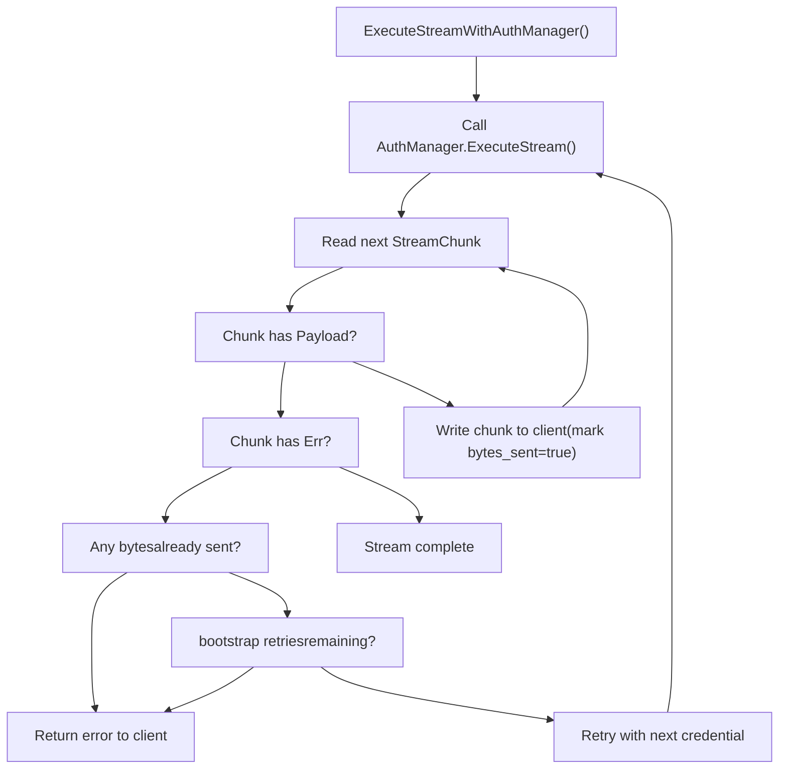

# Streaming and Keep-Alive

Relevant source files

-   [config.example.yaml](https://github.com/router-for-me/CLIProxyAPI/blob/c66cb0af/config.example.yaml)
-   [internal/api/handlers/management/config\_basic.go](https://github.com/router-for-me/CLIProxyAPI/blob/c66cb0af/internal/api/handlers/management/config_basic.go)
-   [internal/api/handlers/management/config\_lists.go](https://github.com/router-for-me/CLIProxyAPI/blob/c66cb0af/internal/api/handlers/management/config_lists.go)
-   [internal/api/middleware/request\_logging\_test.go](https://github.com/router-for-me/CLIProxyAPI/blob/c66cb0af/internal/api/middleware/request_logging_test.go)
-   [internal/api/middleware/response\_writer\_test.go](https://github.com/router-for-me/CLIProxyAPI/blob/c66cb0af/internal/api/middleware/response_writer_test.go)
-   [internal/api/server.go](https://github.com/router-for-me/CLIProxyAPI/blob/c66cb0af/internal/api/server.go)
-   [internal/config/config.go](https://github.com/router-for-me/CLIProxyAPI/blob/c66cb0af/internal/config/config.go)
-   [internal/config/sdk\_config.go](https://github.com/router-for-me/CLIProxyAPI/blob/c66cb0af/internal/config/sdk_config.go)
-   [internal/runtime/executor/codex\_websockets\_executor.go](https://github.com/router-for-me/CLIProxyAPI/blob/c66cb0af/internal/runtime/executor/codex_websockets_executor.go)
-   [internal/watcher/watcher.go](https://github.com/router-for-me/CLIProxyAPI/blob/c66cb0af/internal/watcher/watcher.go)
-   [sdk/api/handlers/handlers.go](https://github.com/router-for-me/CLIProxyAPI/blob/c66cb0af/sdk/api/handlers/handlers.go)
-   [sdk/api/handlers/handlers\_stream\_bootstrap\_test.go](https://github.com/router-for-me/CLIProxyAPI/blob/c66cb0af/sdk/api/handlers/handlers_stream_bootstrap_test.go)
-   [sdk/api/handlers/header\_filter.go](https://github.com/router-for-me/CLIProxyAPI/blob/c66cb0af/sdk/api/handlers/header_filter.go)
-   [sdk/api/handlers/header\_filter\_test.go](https://github.com/router-for-me/CLIProxyAPI/blob/c66cb0af/sdk/api/handlers/header_filter_test.go)
-   [sdk/api/handlers/openai/openai\_responses\_websocket.go](https://github.com/router-for-me/CLIProxyAPI/blob/c66cb0af/sdk/api/handlers/openai/openai_responses_websocket.go)
-   [sdk/cliproxy/auth/conductor\_executor\_replace\_test.go](https://github.com/router-for-me/CLIProxyAPI/blob/c66cb0af/sdk/cliproxy/auth/conductor_executor_replace_test.go)
-   [sdk/cliproxy/service.go](https://github.com/router-for-me/CLIProxyAPI/blob/c66cb0af/sdk/cliproxy/service.go)
-   [test/amp\_management\_test.go](https://github.com/router-for-me/CLIProxyAPI/blob/c66cb0af/test/amp_management_test.go)

This page covers the mechanisms CLIProxyAPI uses to maintain live connections and prevent premature timeouts during both streaming (SSE) and non-streaming AI API requests. It also documents the server-level process keep-alive endpoint used in embedded deployments.

For general HTTP request pipeline behavior, see [3.2](/router-for-me/CLIProxyAPI/3.2-http-server-and-request-pipeline). For WebSocket-specific transport (Codex Responses API), see [8.7](/router-for-me/CLIProxyAPI/8.7-websocket-and-runtime-authentication).

---

## Overview

CLIProxyAPI manages three distinct keep-alive concerns:

| Concern | Trigger | Config key |
| --- | --- | --- |
| SSE streaming heartbeats | Long-running streaming responses | `streaming.keepalive-seconds` |
| Streaming bootstrap retries | Transient upstream error before first byte | `streaming.bootstrap-retries` |
| Non-streaming blank-line keep-alives | Long-running non-streaming responses | `nonstream-keepalive-interval` |
| Process keep-alive endpoint | Embedded/TUI deployments | `WithKeepAliveEndpoint` server option |

**Configuration locations:**

-   `streaming.keepalive-seconds` and `streaming.bootstrap-retries` map to `StreamingConfig` in [internal/config/sdk\_config.go36-45](https://github.com/router-for-me/CLIProxyAPI/blob/c66cb0af/internal/config/sdk_config.go#L36-L45)
-   `nonstream-keepalive-interval` maps to `NonStreamKeepAliveInterval` in [internal/config/sdk\_config.go32-33](https://github.com/router-for-me/CLIProxyAPI/blob/c66cb0af/internal/config/sdk_config.go#L32-L33)
-   The process keep-alive endpoint is registered programmatically via `WithKeepAliveEndpoint` in [internal/api/server.go97-106](https://github.com/router-for-me/CLIProxyAPI/blob/c66cb0af/internal/api/server.go#L97-L106)

**Relevant `config.yaml` stanzas** (from [config.example.yaml93-99](https://github.com/router-for-me/CLIProxyAPI/blob/c66cb0af/config.example.yaml#L93-L99)):

```
# When > 0, emit blank lines every N seconds for non-streaming responses to prevent idle timeouts.nonstream-keepalive-interval: 0 # Streaming behavior (SSE keep-alives + safe bootstrap retries).# streaming:#   keepalive-seconds: 15   # Default: 0 (disabled). <= 0 disables keep-alives.#   bootstrap-retries: 1    # Default: 0 (disabled). Retries before first byte is sent.
```
Sources: [internal/config/sdk\_config.go1-45](https://github.com/router-for-me/CLIProxyAPI/blob/c66cb0af/internal/config/sdk_config.go#L1-L45) [config.example.yaml93-99](https://github.com/router-for-me/CLIProxyAPI/blob/c66cb0af/config.example.yaml#L93-L99)

---

## SSE Streaming Keep-Alives

When a client requests a streaming response, the upstream AI provider may take many seconds to emit the first token. Reverse proxies and load balancers may close idle connections in this window. CLIProxyAPI can emit periodic SSE comment lines to keep the connection alive.

### How it works

`StreamingKeepAliveInterval` in [sdk/api/handlers/handlers.go144-155](https://github.com/router-for-me/CLIProxyAPI/blob/c66cb0af/sdk/api/handlers/handlers.go#L144-L155) reads `cfg.Streaming.KeepAliveSeconds` and returns it as a `time.Duration`. A return value of `0` disables keep-alives.

```
// sdk/api/handlers/handlers.go
func StreamingKeepAliveInterval(cfg *config.SDKConfig) time.Duration {
    seconds := defaultStreamingKeepAliveSeconds  // 0
    if cfg != nil {
        seconds = cfg.Streaming.KeepAliveSeconds
    }
    if seconds <= 0 {
        return 0
    }
    return time.Duration(seconds) * time.Second
}
```
The `KeepAliveSeconds` field is defined in `StreamingConfig` ([internal/config/sdk\_config.go36-45](https://github.com/router-for-me/CLIProxyAPI/blob/c66cb0af/internal/config/sdk_config.go#L36-L45)):

```
type StreamingConfig struct {    KeepAliveSeconds int `yaml:"keepalive-seconds,omitempty"`    BootstrapRetries int `yaml:"bootstrap-retries,omitempty"`}
```
The streaming handler retrieves this interval and starts a ticker that emits SSE comment lines (`: keep-alive\n\n`) at each tick while waiting for upstream chunks. When the upstream sends actual data, the keep-alive ticker is stopped.

**Title: SSE Streaming Keep-Alive Data Flow**

> **[Mermaid sequence]**
> *(图表结构无法解析)*

Sources: [sdk/api/handlers/handlers.go50-55](https://github.com/router-for-me/CLIProxyAPI/blob/c66cb0af/sdk/api/handlers/handlers.go#L50-L55) [sdk/api/handlers/handlers.go144-155](https://github.com/router-for-me/CLIProxyAPI/blob/c66cb0af/sdk/api/handlers/handlers.go#L144-L155) [internal/config/sdk\_config.go36-45](https://github.com/router-for-me/CLIProxyAPI/blob/c66cb0af/internal/config/sdk_config.go#L36-L45)

---

## Streaming Bootstrap Retry Logic

Some upstream auth failures manifest only after opening a streaming connection — the upstream sends an error chunk instead of data. When `streaming.bootstrap-retries` is greater than 0, CLIProxyAPI is allowed to retry the entire streaming request with a different credential, **as long as no payload bytes have been forwarded to the client yet**.

Once a single non-error chunk is written to the client, retry is no longer safe (it would produce duplicate or corrupted output).

### Configuration

`StreamingBootstrapRetries` in [sdk/api/handlers/handlers.go170-180](https://github.com/router-for-me/CLIProxyAPI/blob/c66cb0af/sdk/api/handlers/handlers.go#L170-L180) reads `cfg.Streaming.BootstrapRetries`:

```
func StreamingBootstrapRetries(cfg *config.SDKConfig) int {    retries := defaultStreamingBootstrapRetries  // 0    if cfg != nil {        retries = cfg.Streaming.BootstrapRetries    }    if retries < 0 {        retries = 0    }    return retries}
```
### Bootstrap Retry Boundary Rule

| Scenario | Retry allowed? |
| --- | --- |
| First chunk is an error (`StreamChunk.Err` set, no payload written) | Yes, up to `BootstrapRetries` times |
| First chunk has payload data, subsequent chunk is an error | **No** — client already received bytes |
| Error occurs on very first request (before `ExecuteStream` returns) | Yes |

This is validated by the test executors in [sdk/api/handlers/handlers\_stream\_bootstrap\_test.go](https://github.com/router-for-me/CLIProxyAPI/blob/c66cb0af/sdk/api/handlers/handlers_stream_bootstrap_test.go):

-   `failOnceStreamExecutor`: returns an error chunk on first call, success on second. With `BootstrapRetries: 1`, the handler retries and delivers the payload.
-   `payloadThenErrorStreamExecutor`: sends a `partial` payload chunk, then an error chunk. Because a payload byte was already sent, **no retry occurs** — the error propagates as-is.

**Title: Bootstrap Retry Decision Logic in `ExecuteStreamWithAuthManager`**


Sources: [sdk/api/handlers/handlers.go170-180](https://github.com/router-for-me/CLIProxyAPI/blob/c66cb0af/sdk/api/handlers/handlers.go#L170-L180) [sdk/api/handlers/handlers\_stream\_bootstrap\_test.go15-237](https://github.com/router-for-me/CLIProxyAPI/blob/c66cb0af/sdk/api/handlers/handlers_stream_bootstrap_test.go#L15-L237) [internal/config/sdk\_config.go41-44](https://github.com/router-for-me/CLIProxyAPI/blob/c66cb0af/internal/config/sdk_config.go#L41-L44)

---

## Non-Streaming Keep-Alive

Non-streaming requests wait for the entire upstream response before writing to the client. For very large context or complex reasoning requests this can take tens of seconds, causing proxy timeouts. When `nonstream-keepalive-interval` is set, CLIProxyAPI emits blank newlines periodically while waiting.

### Implementation: `StartNonStreamingKeepAlive`

[sdk/api/handlers/handlers.go394-438](https://github.com/router-for-me/CLIProxyAPI/blob/c66cb0af/sdk/api/handlers/handlers.go#L394-L438) defines `StartNonStreamingKeepAlive`:

-   Reads `NonStreamingKeepAliveInterval(h.Cfg)` ([sdk/api/handlers/handlers.go157-168](https://github.com/router-for-me/CLIProxyAPI/blob/c66cb0af/sdk/api/handlers/handlers.go#L157-L168))
-   Returns a no-op if interval is `<= 0` or if the response writer does not implement `http.Flusher`
-   Starts a background goroutine with a `time.Ticker` that writes `"\n"` and calls `flusher.Flush()` on each tick
-   Returns a **stop function** that the caller **must invoke** before writing the final response body

Usage pattern in request handlers:

```
stopKeepAlive := h.StartNonStreamingKeepAlive(c, ctx)
// ... wait for upstream response ...
stopKeepAlive()   // must be called before writing JSON body
c.JSON(200, response)
```
The stop function closes a channel and waits (`sync.WaitGroup`) for the goroutine to exit before returning, ensuring no concurrent writes to the response writer.

**Title: `StartNonStreamingKeepAlive` Goroutine Lifecycle**

> **[Mermaid sequence]**
> *(图表结构无法解析)*

Sources: [sdk/api/handlers/handlers.go394-438](https://github.com/router-for-me/CLIProxyAPI/blob/c66cb0af/sdk/api/handlers/handlers.go#L394-L438) [sdk/api/handlers/handlers.go157-168](https://github.com/router-for-me/CLIProxyAPI/blob/c66cb0af/sdk/api/handlers/handlers.go#L157-L168) [internal/config/sdk\_config.go29-33](https://github.com/router-for-me/CLIProxyAPI/blob/c66cb0af/internal/config/sdk_config.go#L29-L33)

---

## Process Keep-Alive Endpoint (`/keep-alive`)

This mechanism is unrelated to SSE keep-alives. It is a server-level heartbeat endpoint used when CLIProxyAPI is embedded in a parent process (e.g., a TUI application). The parent periodically pings `/keep-alive`; if pings stop arriving, the server calls a registered timeout callback (typically to trigger a graceful shutdown).

### Registration

The feature is opt-in. It is enabled by passing `WithKeepAliveEndpoint` to `NewServer`:

[internal/api/server.go97-106](https://github.com/router-for-me/CLIProxyAPI/blob/c66cb0af/internal/api/server.go#L97-L106):

```
func WithKeepAliveEndpoint(timeout time.Duration, onTimeout func()) ServerOption {    return func(cfg *serverOptionConfig) {        if timeout <= 0 || onTimeout == nil {            return        }        cfg.keepAliveEnabled = true        cfg.keepAliveTimeout = timeout        cfg.keepAliveOnTimeout = onTimeout    }}
```
`NewServer` calls `enableKeepAlive` ([internal/api/server.go688-702](https://github.com/router-for-me/CLIProxyAPI/blob/c66cb0af/internal/api/server.go#L688-L702)) which:

1.  Stores the timeout and callback on the `Server` struct
2.  Creates `keepAliveHeartbeat chan struct{}` and `keepAliveStop chan struct{}`
3.  Registers `GET /keep-alive` → `handleKeepAlive`
4.  Starts `watchKeepAlive` as a goroutine

### Authentication

If `localPassword` is set on the server, `handleKeepAlive` ([internal/api/server.go704-724](https://github.com/router-for-me/CLIProxyAPI/blob/c66cb0af/internal/api/server.go#L704-L724)) validates the request using constant-time comparison against the `Authorization: Bearer <token>` header, falling back to the `X-Local-Password` header. Requests with an invalid or missing password receive `401 Unauthorized`.

### Timer Logic

`watchKeepAlive` ([internal/api/server.go736-764](https://github.com/router-for-me/CLIProxyAPI/blob/c66cb0af/internal/api/server.go#L736-L764)) runs a `time.Timer` initialized to `keepAliveTimeout`. On each loop iteration:

| Event | Action |
| --- | --- |
| `timer.C` fires (timeout) | Logs warning, calls `keepAliveOnTimeout()`, returns |
| `keepAliveHeartbeat` received | Stops and resets the timer |
| `keepAliveStop` received | Returns cleanly (called by `Server.Stop`) |

`signalKeepAlive` ([internal/api/server.go726-734](https://github.com/router-for-me/CLIProxyAPI/blob/c66cb0af/internal/api/server.go#L726-L734)) does a non-blocking send on `keepAliveHeartbeat`, so rapid pings do not queue up.

**Title: `watchKeepAlive` Goroutine and `/keep-alive` Endpoint**

> **[Mermaid sequence]**
> *(图表结构无法解析)*

### Shutdown

`Server.Stop` ([internal/api/server.go825-842](https://github.com/router-for-me/CLIProxyAPI/blob/c66cb0af/internal/api/server.go#L825-L842)) sends on `keepAliveStop` before calling `server.Shutdown`, which causes `watchKeepAlive` to exit cleanly without firing the timeout callback.

Sources: [internal/api/server.go97-106](https://github.com/router-for-me/CLIProxyAPI/blob/c66cb0af/internal/api/server.go#L97-L106) [internal/api/server.go688-764](https://github.com/router-for-me/CLIProxyAPI/blob/c66cb0af/internal/api/server.go#L688-L764) [internal/api/server.go825-842](https://github.com/router-for-me/CLIProxyAPI/blob/c66cb0af/internal/api/server.go#L825-L842)

---

## Configuration Reference

| `config.yaml` key | Go field | Default | Effect |
| --- | --- | --- | --- |
| `streaming.keepalive-seconds` | `SDKConfig.Streaming.KeepAliveSeconds` | `0` (disabled) | SSE comment lines emitted every N seconds during streaming |
| `streaming.bootstrap-retries` | `SDKConfig.Streaming.BootstrapRetries` | `0` (disabled) | Max retries before first byte for transient upstream errors |
| `nonstream-keepalive-interval` | `SDKConfig.NonStreamKeepAliveInterval` | `0` (disabled) | Blank newlines emitted every N seconds during non-streaming waits |
| *(server option)* | `serverOptionConfig.keepAliveTimeout` | N/A | Timeout for `GET /keep-alive` heartbeat endpoint |

`StreamingConfig` is defined in [internal/config/sdk\_config.go36-45](https://github.com/router-for-me/CLIProxyAPI/blob/c66cb0af/internal/config/sdk_config.go#L36-L45) and embedded in `SDKConfig`. The accessor functions — `StreamingKeepAliveInterval`, `StreamingBootstrapRetries`, `NonStreamingKeepAliveInterval` — are all in [sdk/api/handlers/handlers.go144-180](https://github.com/router-for-me/CLIProxyAPI/blob/c66cb0af/sdk/api/handlers/handlers.go#L144-L180) and are called by individual protocol handlers (`openai`, `claude`, `gemini`) when setting up streaming or non-streaming responses.

Sources: [internal/config/sdk\_config.go1-45](https://github.com/router-for-me/CLIProxyAPI/blob/c66cb0af/internal/config/sdk_config.go#L1-L45) [sdk/api/handlers/handlers.go50-55](https://github.com/router-for-me/CLIProxyAPI/blob/c66cb0af/sdk/api/handlers/handlers.go#L50-L55) [sdk/api/handlers/handlers.go144-180](https://github.com/router-for-me/CLIProxyAPI/blob/c66cb0af/sdk/api/handlers/handlers.go#L144-L180) [config.example.yaml93-99](https://github.com/router-for-me/CLIProxyAPI/blob/c66cb0af/config.example.yaml#L93-L99)
