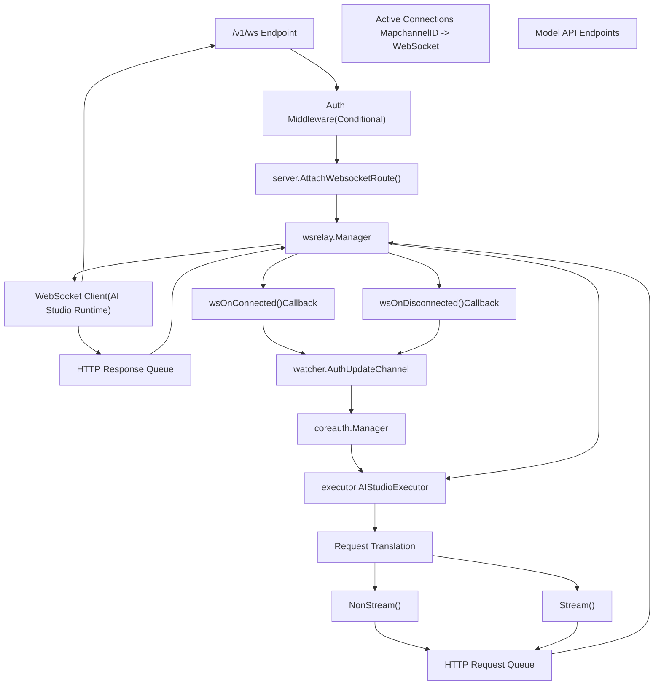
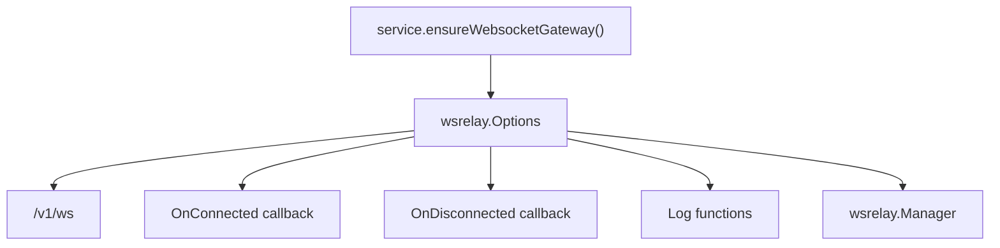
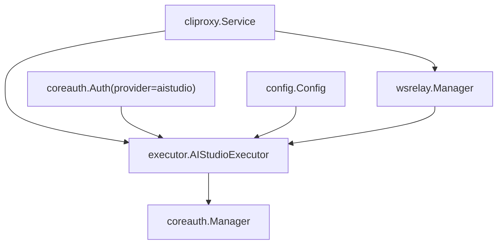
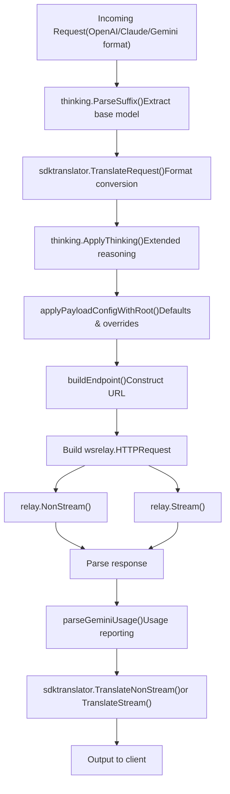
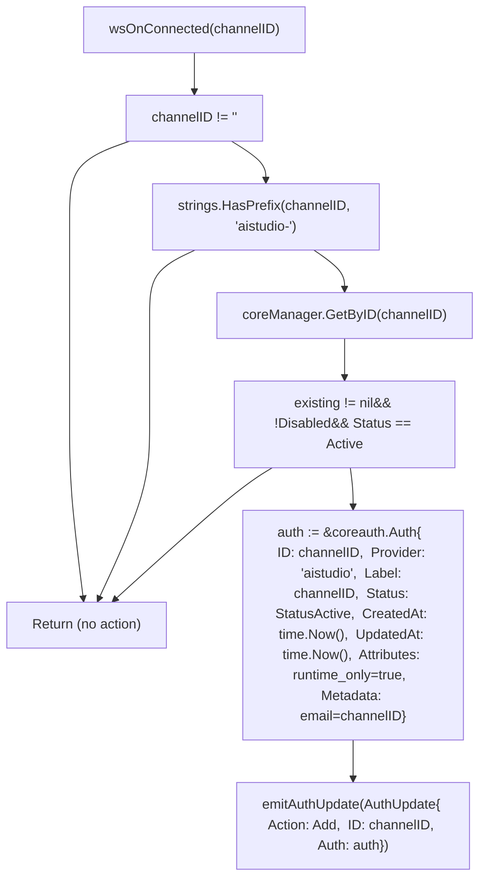
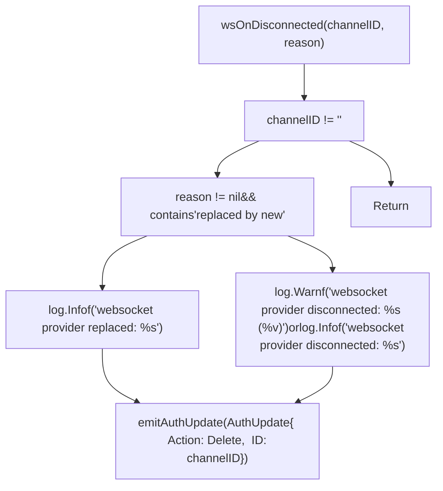
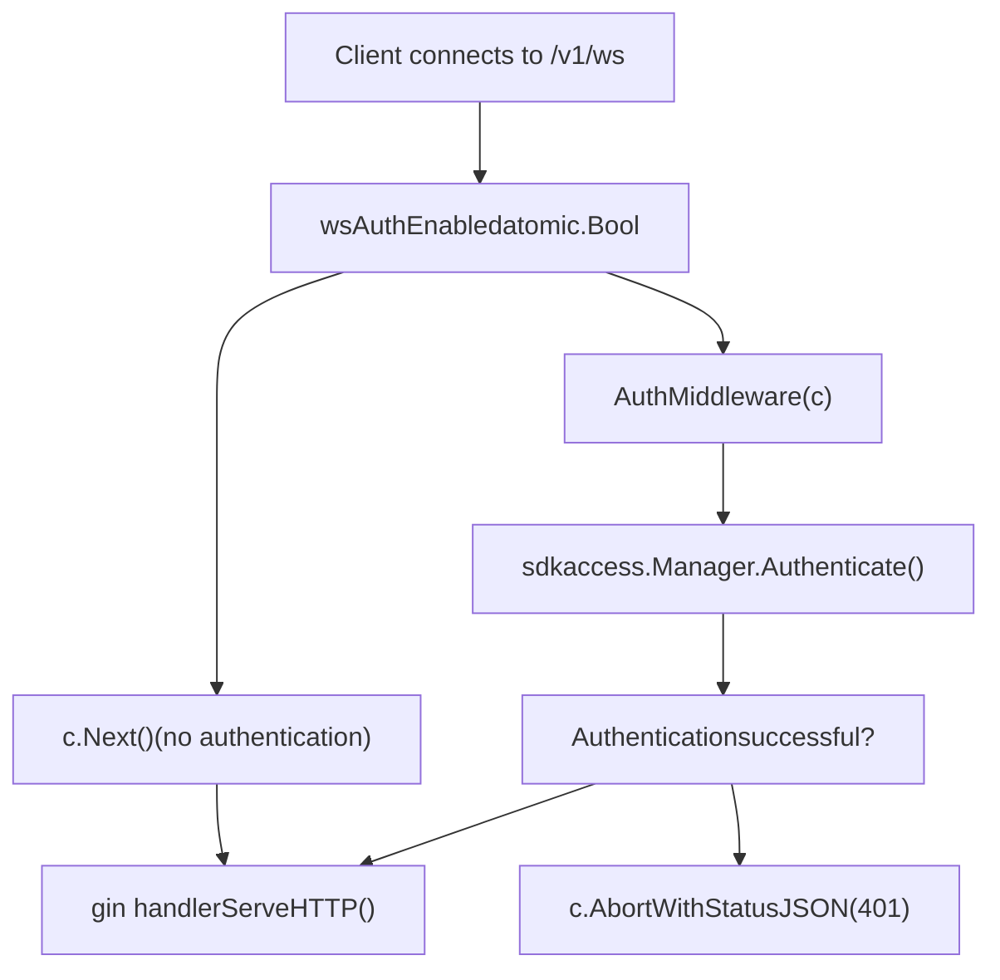
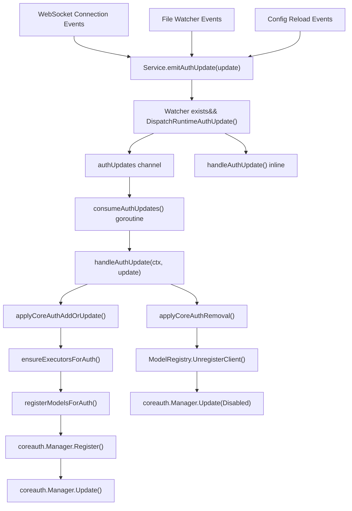
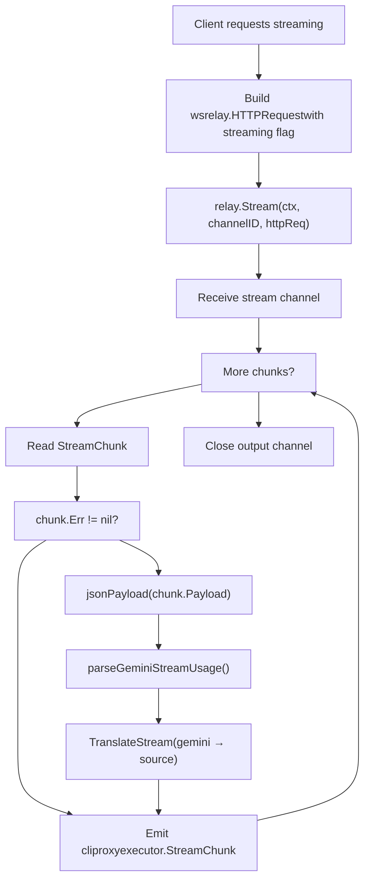
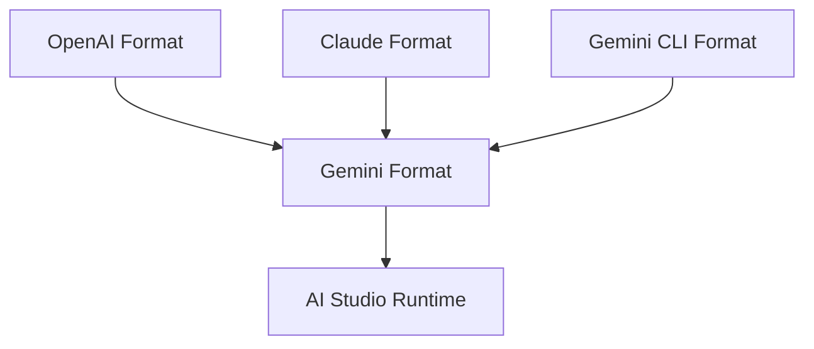

# WebSocket and Runtime Authentication

Relevant source files

-   [config.example.yaml](https://github.com/router-for-me/CLIProxyAPI/blob/c66cb0af/config.example.yaml)
-   [internal/api/handlers/management/config\_basic.go](https://github.com/router-for-me/CLIProxyAPI/blob/c66cb0af/internal/api/handlers/management/config_basic.go)
-   [internal/api/handlers/management/config\_lists.go](https://github.com/router-for-me/CLIProxyAPI/blob/c66cb0af/internal/api/handlers/management/config_lists.go)
-   [internal/api/middleware/request\_logging\_test.go](https://github.com/router-for-me/CLIProxyAPI/blob/c66cb0af/internal/api/middleware/request_logging_test.go)
-   [internal/api/middleware/response\_writer\_test.go](https://github.com/router-for-me/CLIProxyAPI/blob/c66cb0af/internal/api/middleware/response_writer_test.go)
-   [internal/api/server.go](https://github.com/router-for-me/CLIProxyAPI/blob/c66cb0af/internal/api/server.go)
-   [internal/config/config.go](https://github.com/router-for-me/CLIProxyAPI/blob/c66cb0af/internal/config/config.go)
-   [internal/config/sdk\_config.go](https://github.com/router-for-me/CLIProxyAPI/blob/c66cb0af/internal/config/sdk_config.go)
-   [internal/runtime/executor/codex\_websockets\_executor.go](https://github.com/router-for-me/CLIProxyAPI/blob/c66cb0af/internal/runtime/executor/codex_websockets_executor.go)
-   [internal/watcher/watcher.go](https://github.com/router-for-me/CLIProxyAPI/blob/c66cb0af/internal/watcher/watcher.go)
-   [sdk/api/handlers/handlers.go](https://github.com/router-for-me/CLIProxyAPI/blob/c66cb0af/sdk/api/handlers/handlers.go)
-   [sdk/api/handlers/handlers\_stream\_bootstrap\_test.go](https://github.com/router-for-me/CLIProxyAPI/blob/c66cb0af/sdk/api/handlers/handlers_stream_bootstrap_test.go)
-   [sdk/api/handlers/header\_filter.go](https://github.com/router-for-me/CLIProxyAPI/blob/c66cb0af/sdk/api/handlers/header_filter.go)
-   [sdk/api/handlers/header\_filter\_test.go](https://github.com/router-for-me/CLIProxyAPI/blob/c66cb0af/sdk/api/handlers/header_filter_test.go)
-   [sdk/api/handlers/openai/openai\_responses\_websocket.go](https://github.com/router-for-me/CLIProxyAPI/blob/c66cb0af/sdk/api/handlers/openai/openai_responses_websocket.go)
-   [sdk/cliproxy/auth/conductor\_executor\_replace\_test.go](https://github.com/router-for-me/CLIProxyAPI/blob/c66cb0af/sdk/cliproxy/auth/conductor_executor_replace_test.go)
-   [sdk/cliproxy/service.go](https://github.com/router-for-me/CLIProxyAPI/blob/c66cb0af/sdk/cliproxy/service.go)
-   [test/amp\_management\_test.go](https://github.com/router-for-me/CLIProxyAPI/blob/c66cb0af/test/amp_management_test.go)

## Overview

The WebSocket gateway enables external clients to provide AI models dynamically at runtime without persisting credentials to disk. When a client establishes a WebSocket connection, the system automatically creates a runtime-only authentication entry that behaves identically to file-based or OAuth credentials for routing and execution purposes. This mechanism powers the AI Studio integration, where external processes expose model endpoints through a bidirectional tunnel.

**Key Concepts:**

-   **Runtime-only credentials**: Authentication entries created on connection, removed on disconnection, never persisted
-   **Channel-based authentication**: Each WebSocket connection has a unique channel ID used for routing
-   **Bidirectional tunneling**: HTTP requests are serialized over WebSocket, responses are returned the same way
-   **Dynamic provider lifecycle**: Providers appear/disappear based on connection state

**Related Documentation:**

-   For static OAuth providers, see [Authentication Setup](/router-for-me/CLIProxyAPI/2.3-authentication-setup)
-   For OAuth flow implementation, see [OAuth Flow Architecture](/router-for-me/CLIProxyAPI/7.1-oauth-flow-architecture)
-   For general provider integration, see [Provider Integration](/router-for-me/CLIProxyAPI/6-provider-integration)
-   For credential routing and selection, see [Credential Routing and Failover](/router-for-me/CLIProxyAPI/8.1-credential-routing-and-failover)

---

## System Architecture

The WebSocket integration consists of three primary components: the WebSocket relay manager that handles bidirectional communication, the AI Studio executor that routes API requests through the relay, and the runtime provider registration system that dynamically creates authentication entries as connections are established.

### Component Overview


**Sources:**

-   [sdk/cliproxy/service.go200-269](https://github.com/router-for-me/CLIProxyAPI/blob/c66cb0af/sdk/cliproxy/service.go#L200-L269)
-   [internal/api/server.go428-463](https://github.com/router-for-me/CLIProxyAPI/blob/c66cb0af/internal/api/server.go#L428-L463)
-   [internal/runtime/executor/aistudio\_executor.go27-44](https://github.com/router-for-me/CLIProxyAPI/blob/c66cb0af/internal/runtime/executor/aistudio_executor.go#L27-L44)

---

## WebSocket Relay Manager

The `wsrelay.Manager` component maintains active websocket connections and tunnels HTTP requests/responses through them. Each connection is identified by a channel ID, enabling multiple runtime providers to coexist.

### Manager Configuration

The manager is initialized with callbacks and logging functions:


| Field | Type | Description |
| --- | --- | --- |
| `Path` | `string` | WebSocket endpoint path (default: `/v1/ws`) |
| `OnConnected` | `func(string)` | Callback invoked when channel connects |
| `OnDisconnected` | `func(string, error)` | Callback invoked when channel disconnects |
| `LogDebugf` | `func(string, ...any)` | Debug logging function |
| `LogInfof` | `func(string, ...any)` | Info logging function |
| `LogWarnf` | `func(string, ...any)` | Warning logging function |

**Sources:**

-   [sdk/cliproxy/service.go200-216](https://github.com/router-for-me/CLIProxyAPI/blob/c66cb0af/sdk/cliproxy/service.go#L200-L216)

### HTTP Request Tunneling

The relay supports both non-streaming and streaming HTTP requests. Each request is serialized and sent over the websocket, with responses deserialized back into standard HTTP response objects.

> **[Mermaid sequence]**
> *(图表结构无法解析)*

**Sources:**

-   [internal/runtime/executor/aistudio\_executor.go55-110](https://github.com/router-for-me/CLIProxyAPI/blob/c66cb0af/internal/runtime/executor/aistudio_executor.go#L55-L110)
-   [internal/runtime/executor/aistudio\_executor.go113-166](https://github.com/router-for-me/CLIProxyAPI/blob/c66cb0af/internal/runtime/executor/aistudio_executor.go#L113-L166)
-   [internal/runtime/executor/aistudio\_executor.go169-247](https://github.com/router-for-me/CLIProxyAPI/blob/c66cb0af/internal/runtime/executor/aistudio_executor.go#L169-L247)

### HTTPRequest Structure

The websocket relay uses a custom HTTP request structure for serialization:

| Field | Type | Description |
| --- | --- | --- |
| `Method` | `string` | HTTP method (GET, POST, etc.) |
| `URL` | `string` | Full URL including query parameters |
| `Headers` | `http.Header` | HTTP headers map |
| `Body` | `[]byte` | Request body payload |

**Sources:**

-   [internal/runtime/executor/aistudio\_executor.go83-88](https://github.com/router-for-me/CLIProxyAPI/blob/c66cb0af/internal/runtime/executor/aistudio_executor.go#L83-L88)

---

## AI Studio Executor

The `AIStudioExecutor` implements the standard executor interface but routes all requests through the websocket relay instead of making direct HTTP calls. It translates requests to Gemini format before tunneling, enabling AI Studio clients to use the same translation infrastructure as other Gemini providers.

### Executor Initialization


**Key Properties:**

| Property | Description |
| --- | --- |
| `provider` | Channel ID (e.g., `"aistudio-xxx"`) stored in lowercase |
| `relay` | Reference to `wsrelay.Manager` for tunneling |
| `cfg` | Application configuration for request logging |

**Sources:**

-   [internal/runtime/executor/aistudio\_executor.go27-44](https://github.com/router-for-me/CLIProxyAPI/blob/c66cb0af/internal/runtime/executor/aistudio_executor.go#L27-L44)
-   [sdk/cliproxy/service.go368-370](https://github.com/router-for-me/CLIProxyAPI/blob/c66cb0af/sdk/cliproxy/service.go#L368-L370)

### Request Translation and Execution

The executor translates incoming requests to Gemini format before tunneling. This ensures that AI Studio clients benefit from the same thinking configuration, payload rules, and format conversion as standard Gemini executors.


**Sources:**

-   [internal/runtime/executor/aistudio\_executor.go113-166](https://github.com/router-for-me/CLIProxyAPI/blob/c66cb0af/internal/runtime/executor/aistudio_executor.go#L113-L166)
-   [internal/runtime/executor/aistudio\_executor.go169-247](https://github.com/router-for-me/CLIProxyAPI/blob/c66cb0af/internal/runtime/executor/aistudio_executor.go#L169-L247)
-   [internal/runtime/executor/aistudio\_executor.go249-279](https://github.com/router-for-me/CLIProxyAPI/blob/c66cb0af/internal/runtime/executor/aistudio_executor.go#L249-L279)

### Endpoint Construction

The executor builds Gemini API-compatible endpoints for forwarding through the websocket:

| Action | URL Template | Query Parameters |
| --- | --- | --- |
| `generateContent` | `/v1beta/models/{model}:generateContent` | `$alt={format}` (if specified) |
| `streamGenerateContent` | `/v1beta/models/{model}:streamGenerateContent` | `$alt={format}` (if specified) |
| `countTokens` | `/v1beta/models/{model}:countTokens` | None |

**Sources:**

-   [internal/runtime/executor/aistudio\_executor.go281-295](https://github.com/router-for-me/CLIProxyAPI/blob/c66cb0af/internal/runtime/executor/aistudio_executor.go#L281-L295)

---

## Runtime Provider Registration

When a websocket client connects, the system automatically creates a runtime authentication entry. This entry is managed through the same `coreauth.Manager` as file-based and config-based credentials, enabling seamless integration with the credential selection and routing system.

### Runtime Credential Lifecycle

**Title:** Runtime Authentication State Machine

> **[Mermaid stateDiagram]**
> *(图表结构无法解析)*

**Sources:**

-   [sdk/cliproxy/service.go218-269](https://github.com/router-for-me/CLIProxyAPI/blob/c66cb0af/sdk/cliproxy/service.go#L218-L269)
-   [sdk/cliproxy/service.go272-310](https://github.com/router-for-me/CLIProxyAPI/blob/c66cb0af/sdk/cliproxy/service.go#L272-L310)
-   [internal/watcher/watcher.go126-139](https://github.com/router-for-me/CLIProxyAPI/blob/c66cb0af/internal/watcher/watcher.go#L126-L139)

### Runtime Auth Entry Structure

When a WebSocket client connects with a channel ID starting with `"aistudio-"`, the system synthesizes a `coreauth.Auth` entry:

**Title:** Runtime Auth Field Mapping

| Field | Value | Purpose |
| --- | --- | --- |
| `ID` | Channel ID | Unique identifier for routing (e.g., `"aistudio-abc123"`) |
| `Provider` | `"aistudio"` | Provider key for executor lookup |
| `Label` | Channel ID | Display name in logs and usage reports |
| `Status` | `StatusActive` | Marks credential as available for selection |
| `CreatedAt` | `time.Now().UTC()` | Connection timestamp |
| `UpdatedAt` | `time.Now().UTC()` | Last state change |
| `Attributes["runtime_only"]` | `"true"` | Prevents persistence to disk |
| `Metadata["email"]` | Channel ID | Usage tracking identifier |
| `Disabled` | `false` | Credential is selectable |

**Lifecycle Invariants:**

-   **Not persisted**: The `runtime_only` attribute prevents `Store.Save()` calls
-   **Ephemeral**: Entry exists only while WebSocket connection is active
-   **Unique per channel**: Multiple connections with different channel IDs create separate auth entries
-   **Replaced on reconnect**: If same channel ID connects while active, old entry is updated

**Sources:**

-   [sdk/cliproxy/service.go233-242](https://github.com/router-for-me/CLIProxyAPI/blob/c66cb0af/sdk/cliproxy/service.go#L233-L242)
-   [sdk/cliproxy/service.go272-293](https://github.com/router-for-me/CLIProxyAPI/blob/c66cb0af/sdk/cliproxy/service.go#L272-L293)

### Connection Event Handlers

The `Service` registers connection callbacks with `wsrelay.Manager` during initialization:

#### Service.wsOnConnected

Invoked when a WebSocket client successfully establishes a connection. If the channel ID matches the AI Studio pattern (`aistudio-*`), a runtime auth entry is created:

**Title:** Connection Handler Logic


**Channel ID Filtering:**

Only channel IDs with the `aistudio-` prefix trigger runtime auth creation. This prefix is reserved for AI Studio runtime providers and distinguishes them from other potential WebSocket use cases.

**Duplicate Connection Handling:**

If an auth entry already exists and is active, no update is emitted. This prevents redundant model registration when a client reconnects with the same channel ID.

**Sources:**

-   [sdk/cliproxy/service.go219-249](https://github.com/router-for-me/CLIProxyAPI/blob/c66cb0af/sdk/cliproxy/service.go#L219-L249)

#### Service.wsOnDisconnected

Invoked when a WebSocket connection closes or encounters an error. Emits a delete auth update to remove the runtime provider:

**Title:** Disconnection Handler Logic


**Replacement Detection:**

When a new connection is established with an existing channel ID, the old connection is closed with a "replaced by new connection" error. This is logged at info level instead of warn level to avoid alarm.

**Cleanup Behavior:**

The delete auth update triggers:

1.  `ModelRegistry.UnregisterClient(channelID)` - removes model availability
2.  `coreauth.Manager.Update(auth{Disabled: true})` - marks credential as disabled
3.  Credential no longer selectable for new requests

**Sources:**

-   [sdk/cliproxy/service.go252-269](https://github.com/router-for-me/CLIProxyAPI/blob/c66cb0af/sdk/cliproxy/service.go#L252-L269)

---

## WebSocket Authentication

### Configuration

The WebSocket endpoint (`/v1/ws`) supports optional authentication via the `ws-auth` configuration setting:

| Setting | Type | Default | Description |
| --- | --- | --- | --- |
| `ws-auth` | `boolean` | `false` | Require API key authentication for WebSocket connections |

**Configuration Example:**

```
# Enable authentication for the WebSocket API (/v1/ws)# When false (default): any client can establish WebSocket connections# When true: clients must provide valid API key via Authorization headerws-auth: false
```
**Security Considerations:**

| Mode | Security | Use Case |
| --- | --- | --- |
| `ws-auth: false` | None | Trusted network, localhost-only deployment |
| `ws-auth: true` | API key validation | Multi-tenant, internet-facing deployment |

**Sources:**

-   [internal/config/config.go75-76](https://github.com/router-for-me/CLIProxyAPI/blob/c66cb0af/internal/config/config.go#L75-L76)
-   [config.example.yaml82](https://github.com/router-for-me/CLIProxyAPI/blob/c66cb0af/config.example.yaml#L82-L82)

### Conditional Authentication Middleware

**Title:** WebSocket Authentication Flow

The server applies authentication conditionally based on the `wsAuthEnabled` flag stored in `api.Server`:


**Implementation Details:**

The conditional authentication handler is registered in `Server.AttachWebsocketRoute()`:

```
// Conditional authentication wrapper
conditionalAuth := func(c *gin.Context) {
    if !s.wsAuthEnabled.Load() {
        c.Next()
        return
    }
    authMiddleware(c)
}
```
**Sources:**

-   [internal/api/server.go449-462](https://github.com/router-for-me/CLIProxyAPI/blob/c66cb0af/internal/api/server.go#L449-L462)
-   [internal/api/server.go1016-1043](https://github.com/router-for-me/CLIProxyAPI/blob/c66cb0af/internal/api/server.go#L1016-L1043)

### Dynamic Authentication Toggle

The system supports hot-reload of the `ws-auth` setting. When authentication transitions from disabled to enabled, all active WebSocket connections are forcibly closed to enforce the new policy:

**Title:** Hot-Reload Authentication Toggle

> **[Mermaid sequence]**
> *(图表结构无法解析)*

**Behavior Matrix:**

| Old State | New State | Action |
| --- | --- | --- |
| `false` | `false` | No action |
| `false` | `true` | Stop gateway, close all connections, log "ws-auth enabled; sessions terminated" |
| `true` | `false` | No action, log "ws-auth disabled; sessions remain connected" |
| `true` | `true` | No action |

**Sources:**

-   [internal/api/server.go944-947](https://github.com/router-for-me/CLIProxyAPI/blob/c66cb0af/internal/api/server.go#L944-L947)
-   [sdk/cliproxy/service.go470-485](https://github.com/router-for-me/CLIProxyAPI/blob/c66cb0af/sdk/cliproxy/service.go#L470-L485)

---

## Auth Update Queue

Runtime auth changes are processed asynchronously through a dedicated queue to avoid blocking WebSocket event handlers:

**Title:** Auth Update Processing


**Queue Characteristics:**

| Property | Value | Purpose |
| --- | --- | --- |
| Buffer size | 256 | Prevent blocking during connection bursts |
| Context | `WithSkipPersist()` | Prevent runtime auth from being saved to disk |
| Drain behavior | Process all pending updates before waiting | Batch processing for efficiency |

**Processing Logic:**

The `consumeAuthUpdates()` goroutine processes auth updates sequentially:

1.  Read update from channel
2.  Apply update to `coreauth.Manager`
3.  Drain any additional pending updates (batch processing)
4.  Repeat until context cancelled

**Dispatch Fallback:**

If the watcher is not available or queue is saturated, `emitAuthUpdate()` falls back to inline processing:

```
if watcher.DispatchRuntimeAuthUpdate(update) {
    return // Queued successfully
}
// Queue full or watcher unavailable
handleAuthUpdate(ctx, update) // Apply immediately
```
**Sources:**

-   [sdk/cliproxy/service.go111-148](https://github.com/router-for-me/CLIProxyAPI/blob/c66cb0af/sdk/cliproxy/service.go#L111-L148)
-   [sdk/cliproxy/service.go150-198](https://github.com/router-for-me/CLIProxyAPI/blob/c66cb0af/sdk/cliproxy/service.go#L150-L198)
-   [internal/watcher/watcher.go130-139](https://github.com/router-for-me/CLIProxyAPI/blob/c66cb0af/internal/watcher/watcher.go#L130-L139)

## Request Processing Flow

API requests targeting AI Studio models follow the standard cliproxy pipeline but route through the websocket relay instead of making direct HTTP calls.

### Full Request Flow

> **[Mermaid sequence]**
> *(图表结构无法解析)*

**Sources:**

-   [internal/runtime/executor/aistudio\_executor.go113-166](https://github.com/router-for-me/CLIProxyAPI/blob/c66cb0af/internal/runtime/executor/aistudio_executor.go#L113-L166)
-   [sdk/cliproxy/service.go340-389](https://github.com/router-for-me/CLIProxyAPI/blob/c66cb0af/sdk/cliproxy/service.go#L340-L389)

### Streaming Response Handling

For streaming requests, the executor consumes chunks from the relay and translates them incrementally:


**Sources:**

-   [internal/runtime/executor/aistudio\_executor.go169-247](https://github.com/router-for-me/CLIProxyAPI/blob/c66cb0af/internal/runtime/executor/aistudio_executor.go#L169-L247)

---

## Usage Tracking and Logging

The AI Studio executor integrates with the standard usage tracking system. Token counts are extracted from Gemini-format responses and reported to the usage manager.

### Usage Extraction

| Field Path | Description |
| --- | --- |
| `usageMetadata.promptTokenCount` | Input tokens consumed |
| `usageMetadata.candidatesTokenCount` | Output tokens generated |
| `usageMetadata.totalTokenCount` | Total tokens (input + output) |

**Streaming Usage:**

For streaming responses, usage metadata may appear in multiple chunks. The executor uses `parseGeminiStreamUsage()` to extract usage from each chunk, with the final chunk typically containing complete statistics.

**Sources:**

-   [internal/runtime/executor/aistudio\_executor.go161](https://github.com/router-for-me/CLIProxyAPI/blob/c66cb0af/internal/runtime/executor/aistudio_executor.go#L161-L161)
-   [internal/runtime/executor/aistudio\_executor.go223-228](https://github.com/router-for-me/CLIProxyAPI/blob/c66cb0af/internal/runtime/executor/aistudio_executor.go#L223-L228)

### Request Logging

All requests tunneled through the websocket are logged using the standard `recordAPIRequest()` infrastructure:

| Log Field | Value |
| --- | --- |
| `URL` | Full Gemini API endpoint URL |
| `Method` | `POST` |
| `Headers` | HTTP headers including `Content-Type` |
| `Body` | Translated Gemini-format request payload |
| `Provider` | `"aistudio"` |
| `AuthID` | Channel ID |
| `AuthLabel` | Channel ID |
| `AuthType` | `"runtime"` |
| `AuthValue` | Channel ID |

**Sources:**

-   [internal/runtime/executor/aistudio\_executor.go137-148](https://github.com/router-for-me/CLIProxyAPI/blob/c66cb0af/internal/runtime/executor/aistudio_executor.go#L137-L148)

---

## AI Studio Executor Integration

### Executor Interface

The `AIStudioExecutor` implements `cliproxyexecutor.Executor` but routes all requests through the WebSocket relay instead of making direct HTTP calls:

**Title:** Executor Method Overview

| Method | Implementation | Description |
| --- | --- | --- |
| `Identifier()` | Returns `strings.ToLower(channelID)` | Provider key for registration |
| `PrepareRequest()` | No-op (not used) | Authentication via channel ID routing |
| `HttpRequest()` | `relay.NonStream()` | Arbitrary HTTP request tunneling |
| `Execute()` | Gemini translation + `relay.NonStream()` | Non-streaming request execution |
| `ExecuteStream()` | Gemini translation + `relay.Stream()` | Streaming request execution |
| `CountTokens()` | Gemini translation + `relay.NonStream()` | Token counting via `:countTokens` endpoint |

**Key Differences from Standard Executors:**

-   **No direct HTTP client**: All requests go through `wsrelay.Manager`
-   **Channel-based routing**: Auth ID determines target WebSocket connection
-   **No credential injection**: Channel ID is the authentication mechanism
-   **Request serialization**: HTTP requests converted to relay-specific format

**Sources:**

-   [internal/runtime/executor/aistudio\_executor.go27-44](https://github.com/router-for-me/CLIProxyAPI/blob/c66cb0af/internal/runtime/executor/aistudio_executor.go#L27-L44)
-   [internal/runtime/executor/aistudio\_executor.go46-110](https://github.com/router-for-me/CLIProxyAPI/blob/c66cb0af/internal/runtime/executor/aistudio_executor.go#L46-L110)

### Model Translation

The executor uses the Gemini translation path for all requests:


This ensures consistent behavior with standard Gemini executors, including:

-   Thinking configuration support
-   Payload config rules
-   Usage tracking
-   Error handling

**Sources:**

-   [internal/runtime/executor/aistudio\_executor.go249-279](https://github.com/router-for-me/CLIProxyAPI/blob/c66cb0af/internal/runtime/executor/aistudio_executor.go#L249-L279)

### Error Handling

The executor converts websocket relay errors into standard `statusErr` responses:

| Error Source | Status Code | Behavior |
| --- | --- | --- |
| Relay communication failure | 500 | Internal server error |
| HTTP status < 200 or ≥ 300 | Upstream status | Forward upstream error |
| Nil relay or auth | 400 | Bad request |

**Sources:**

-   [internal/runtime/executor/aistudio\_executor.go158-160](https://github.com/router-for-me/CLIProxyAPI/blob/c66cb0af/internal/runtime/executor/aistudio_executor.go#L158-L160)
