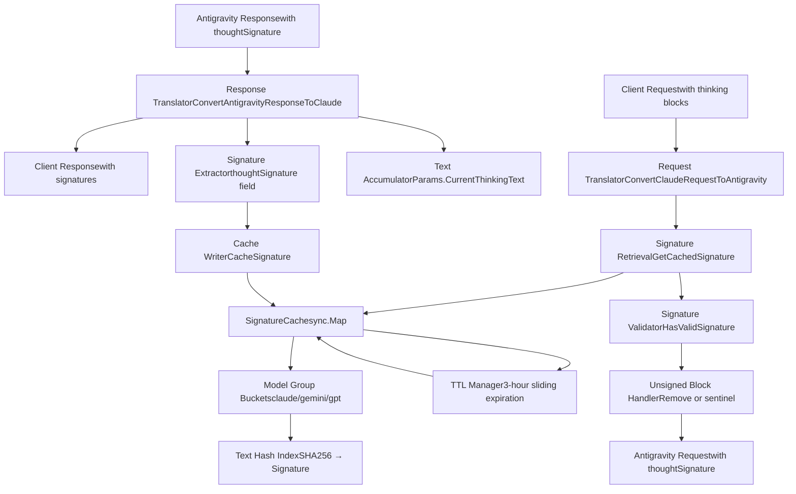
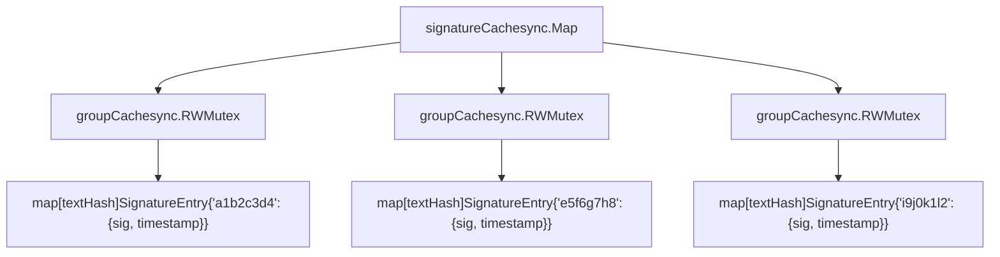
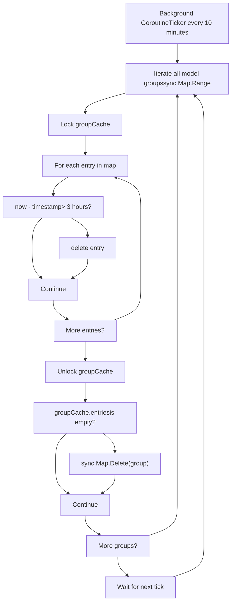

# Signature Cache and Thinking Validation

Relevant source files

-   [internal/cache/signature\_cache.go](https://github.com/router-for-me/CLIProxyAPI/blob/c66cb0af/internal/cache/signature_cache.go)
-   [internal/cache/signature\_cache\_test.go](https://github.com/router-for-me/CLIProxyAPI/blob/c66cb0af/internal/cache/signature_cache_test.go)
-   [internal/logging/global\_logger.go](https://github.com/router-for-me/CLIProxyAPI/blob/c66cb0af/internal/logging/global_logger.go)
-   [internal/thinking/apply.go](https://github.com/router-for-me/CLIProxyAPI/blob/c66cb0af/internal/thinking/apply.go)
-   [internal/thinking/types.go](https://github.com/router-for-me/CLIProxyAPI/blob/c66cb0af/internal/thinking/types.go)
-   [internal/thinking/validate.go](https://github.com/router-for-me/CLIProxyAPI/blob/c66cb0af/internal/thinking/validate.go)
-   [internal/translator/antigravity/claude/antigravity\_claude\_request.go](https://github.com/router-for-me/CLIProxyAPI/blob/c66cb0af/internal/translator/antigravity/claude/antigravity_claude_request.go)
-   [internal/translator/antigravity/claude/antigravity\_claude\_request\_test.go](https://github.com/router-for-me/CLIProxyAPI/blob/c66cb0af/internal/translator/antigravity/claude/antigravity_claude_request_test.go)
-   [internal/translator/antigravity/claude/antigravity\_claude\_response.go](https://github.com/router-for-me/CLIProxyAPI/blob/c66cb0af/internal/translator/antigravity/claude/antigravity_claude_response.go)
-   [internal/translator/antigravity/claude/antigravity\_claude\_response\_test.go](https://github.com/router-for-me/CLIProxyAPI/blob/c66cb0af/internal/translator/antigravity/claude/antigravity_claude_response_test.go)
-   [internal/translator/antigravity/gemini/antigravity\_gemini\_request.go](https://github.com/router-for-me/CLIProxyAPI/blob/c66cb0af/internal/translator/antigravity/gemini/antigravity_gemini_request.go)
-   [internal/translator/antigravity/gemini/antigravity\_gemini\_request\_test.go](https://github.com/router-for-me/CLIProxyAPI/blob/c66cb0af/internal/translator/antigravity/gemini/antigravity_gemini_request_test.go)
-   [sdk/translator/registry.go](https://github.com/router-for-me/CLIProxyAPI/blob/c66cb0af/sdk/translator/registry.go)
-   [test/thinking\_conversion\_test.go](https://github.com/router-for-me/CLIProxyAPI/blob/c66cb0af/test/thinking_conversion_test.go)

## Purpose and Scope

This page documents the signature cache system and thinking validation logic used to handle Claude thinking blocks in multi-turn conversations. The signature cache enables CLIProxyAPI to preserve and validate cryptographic signatures that Claude models attach to thinking blocks, ensuring that reasoning content can be safely reused across conversation turns.

For general information about thinking and reasoning configuration, see [Thinking and Reasoning Configuration](/router-for-me/CLIProxyAPI/8.3-thinking-and-reasoning-configuration). For details on the Antigravity provider integration, see [Antigravity and AI Studio](/router-for-me/CLIProxyAPI/6.5-antigravity-and-ai-studio).

---

## System Overview

The signature cache system solves a specific problem with Claude's extended thinking feature: when Claude generates thinking blocks (internal reasoning), it attaches cryptographic signatures to validate their authenticity. In multi-turn conversations, these signatures must be preserved and replayed when the client sends previous thinking blocks back to the API. Without valid signatures, the Antigravity API rejects thinking blocks as potentially tampered.

The system consists of three major components:

1.  **Signature Cache**: Thread-safe, TTL-based storage mapping thinking text to signatures
2.  **Request Translation**: Signature injection and validation during Claude/Gemini → Antigravity conversion
3.  **Response Capture**: Signature extraction and caching during streaming response processing

**Key Design Decisions:**

-   Hash-based indexing avoids storing large text blocks as keys
-   Model group isolation (claude/gemini/gpt) prevents signature cross-contamination
-   Sliding TTL (3 hours) balances conversation continuity with memory usage
-   Background cleanup prevents unbounded cache growth


Sources: [internal/cache/signature\_cache.go1-196](https://github.com/router-for-me/CLIProxyAPI/blob/c66cb0af/internal/cache/signature_cache.go#L1-L196) [internal/translator/antigravity/claude/antigravity\_claude\_request.go1-407](https://github.com/router-for-me/CLIProxyAPI/blob/c66cb0af/internal/translator/antigravity/claude/antigravity_claude_request.go#L1-L407) [internal/translator/antigravity/claude/antigravity\_claude\_response.go1-524](https://github.com/router-for-me/CLIProxyAPI/blob/c66cb0af/internal/translator/antigravity/claude/antigravity_claude_response.go#L1-L524)

---

## Signature Cache Data Structures

### Cache Architecture

The signature cache uses a two-level map structure for efficient, thread-safe access with model isolation:

**Level 1**: `sync.Map` keyed by model group (`claude`, `gemini`, `gpt`)
**Level 2**: `groupCache` with read-write mutex protecting a hash map of text → signature entries


### Core Data Types

| Type | Definition | Purpose |
| --- | --- | --- |
| `SignatureEntry` | `{Signature string, Timestamp time.Time}` | Stores signature with last-access time for TTL |
| `groupCache` | `{mu sync.RWMutex, entries map[string]SignatureEntry}` | Thread-safe bucket for one model group |
| `signatureCache` | `sync.Map` (global variable) | Top-level cache mapping model groups to `groupCache` |

### Key Constants

| Constant | Value | Description |
| --- | --- | --- |
| `SignatureCacheTTL` | `3 * time.Hour` | How long signatures remain valid (sliding expiration) |
| `SignatureTextHashLen` | `16` | Length of text hash key (64-bit key space) |
| `MinValidSignatureLen` | `50` | Minimum signature length to be considered valid |
| `CacheCleanupInterval` | `10 * time.Minute` | How often the background cleanup goroutine runs |

### Text Hashing

The cache uses SHA256 hashing to create compact, collision-resistant keys:

```
hashText(text string) string:
  1. Compute SHA256 hash of text bytes
  2. Encode hash as hex string
  3. Take first 16 characters (64-bit key space)
  4. Return as cache key
```
This approach:

-   Avoids storing large text blocks as map keys
-   Provides Unicode-safe, stable keys
-   Reduces memory footprint (16 bytes vs potentially kilobytes)
-   Offers acceptable collision resistance (2^64 key space)

Sources: [internal/cache/signature\_cache.go10-60](https://github.com/router-for-me/CLIProxyAPI/blob/c66cb0af/internal/cache/signature_cache.go#L10-L60) [internal/cache/signature\_cache.go186-195](https://github.com/router-for-me/CLIProxyAPI/blob/c66cb0af/internal/cache/signature_cache.go#L186-L195)

---

## Request Translation: Signature Injection and Validation

When translating Claude requests to Antigravity format, the system must:

1.  Extract thinking blocks from the request
2.  Validate existing signatures (from client or cache)
3.  Inject signatures into thinking blocks and tool calls
4.  Handle unsigned thinking blocks appropriately

### Thinking Block Processing Flow

> **[Mermaid stateDiagram]**
> *(图表结构无法解析)*

### Signature Retrieval Logic

The request translator implements a two-stage retrieval strategy with cache priority:

**Stage 1: Cache Lookup** (lines 101-109)

```
1. Extract thinking text from content block
2. Call GetCachedSignature(modelName, thinkingText)
3. If found: Use cached signature (most reliable)
4. If not found: Proceed to Stage 2
```
**Stage 2: Client Signature Fallback** (lines 112-127)

```
1. Extract signature field from thinking block
2. Parse format: "modelName#signature"
3. Verify modelName matches current model
4. Validate signature using HasValidSignature
5. If valid: Use client-provided signature
6. If invalid: Signature remains empty
```
**Rationale for Cache Priority:**
Client-provided signatures may be stale from different sessions or tampered. The cache always contains signatures from the current session's actual API responses, making them more reliable.

### Tool Use Signature Injection

When a message contains both thinking blocks and tool calls, the signature from the thinking block must be attached to subsequent tool\_use blocks:

**Algorithm** (lines 166-206):

```
currentMessageThinkingSignature = "" // Reset per message

For each content block in message:
  If block.type == "thinking":
    signature = GetCachedOrClientSignature(block)
    If HasValidSignature(signature):
      currentMessageThinkingSignature = signature

  If block.type == "tool_use":
    If HasValidSignature(currentMessageThinkingSignature):
      part.thoughtSignature = currentMessageThinkingSignature
    Else:
      part.thoughtSignature = "skip_thought_signature_validator"
```
The special sentinel `"skip_thought_signature_validator"` bypasses validation for tool calls without preceding thinking. This approach mirrors the implementation in `opencode-google-antigravity-auth` for Gemini.

### Unsigned Thinking Block Handling

Unsigned thinking blocks are **removed entirely** (not converted to text) because:

1.  Claude requires assistant messages to start with thinking blocks when thinking is enabled
2.  Converting unsigned thinking to text would violate this constraint
3.  The Antigravity API rejects unsigned thinking blocks

**Implementation** (lines 135-144):

```
isUnsigned = !HasValidSignature(modelName, signature)

If isUnsigned:
  enableThoughtTranslate = false
  continue  // Skip this block entirely
```
Sources: [internal/translator/antigravity/claude/antigravity\_claude\_request.go93-206](https://github.com/router-for-me/CLIProxyAPI/blob/c66cb0af/internal/translator/antigravity/claude/antigravity_claude_request.go#L93-L206) [internal/translator/antigravity/claude/antigravity\_claude\_request\_test.go76-152](https://github.com/router-for-me/CLIProxyAPI/blob/c66cb0af/internal/translator/antigravity/claude/antigravity_claude_request_test.go#L76-L152)

---

## Response Signature Capture

During streaming response processing, the system captures signatures as they arrive and caches them for future use.

### Streaming State Machine

The response translator maintains state across chunks using the `Params` struct:

| Field | Type | Purpose |
| --- | --- | --- |
| `CurrentThinkingText` | `strings.Builder` | Accumulates thinking text until signature arrives |
| `ResponseType` | `int` | Current state: 0=none, 1=text, 2=thinking, 3=function |
| `ResponseIndex` | `int` | Current content block index |

### Signature Capture Flow

> **[Mermaid sequence]**
> *(图表结构无法解析)*

### Signature Caching Implementation

**Key code path** (lines 136-149 of antigravity\_claude\_response.go):

```
If part.thought == true AND part.thoughtSignature exists:
  If params.CurrentThinkingText.Len() > 0:
    thinkingText = params.CurrentThinkingText.String()
    cache.CacheSignature(modelName, thinkingText, signature)
    params.CurrentThinkingText.Reset()
```
**Important behaviors:**

-   Text accumulation starts when entering thinking state (ResponseType = 2)
-   Accumulation continues across multiple chunks until signature arrives
-   Signature arrival triggers immediate caching and accumulator reset
-   If no signature arrives, accumulated text is discarded at state transition

### Non-Streaming Signature Handling

For non-streaming responses, the system processes all parts in a single pass:

**Algorithm** (lines 413-444 of antigravity\_claude\_response.go):

```
thinkingBuilder = strings.Builder{}
thinkingSignature = ""

For each part in response.candidates[0].content.parts:
  If part.thought == true:
    If part.thoughtSignature exists:
      thinkingSignature = part.thoughtSignature
    thinkingBuilder.WriteString(part.text)
  Else:
    If thinkingBuilder has content:
      FlushThinking(thinkingBuilder, thinkingSignature)
      // This creates thinking block with signature in client response
```
The system does **not** automatically cache signatures from non-streaming responses, as caching occurs during the streaming capture flow.

Sources: [internal/translator/antigravity/claude/antigravity\_claude\_response.go24-298](https://github.com/router-for-me/CLIProxyAPI/blob/c66cb0af/internal/translator/antigravity/claude/antigravity_claude_response.go#L24-L298) [internal/translator/antigravity/claude/antigravity\_claude\_response\_test.go15-246](https://github.com/router-for-me/CLIProxyAPI/blob/c66cb0af/internal/translator/antigravity/claude/antigravity_claude_response_test.go#L15-L246)

---

## Signature Validation and Special Cases

### Validation Function

`HasValidSignature(modelName, signature string) bool` determines if a signature is acceptable:

| Condition | Result | Notes |
| --- | --- | --- |
| `signature == ""` | `false` | Empty signatures invalid |
| `len(signature) < 50` | `false` | Too short to be valid signature |
| `len(signature) >= 50` | `true` | Standard valid signature |
| `signature == "skip_thought_signature_validator"` AND `GetModelGroup(modelName) == "gemini"` | `true` | Special sentinel for Gemini |

### Gemini Skip Sentinel

For Gemini models (non-Claude), the request translator injects `"skip_thought_signature_validator"` as a sentinel value to bypass signature validation:

**Purpose:**
Gemini models through Antigravity don't use Claude's signature scheme but still need the `thoughtSignature` field populated to satisfy API validation.

**Implementation** (lines 104-134 of antigravity\_gemini\_request.go):

```
If modelName does not contain "claude":
  For each model role content in request.contents:
    For each part:
      If part.thought == true:
        part.thoughtSignature = "skip_thought_signature_validator"
      If part.functionCall exists:
        If part.thoughtSignature empty or < 50 chars:
          part.thoughtSignature = "skip_thought_signature_validator"
```
This ensures Gemini requests pass API validation without requiring actual signature tracking.

### Model Group Resolution

`GetModelGroup(modelName string) string` maps model names to cache buckets:

| Model Name Pattern | Group | Examples |
| --- | --- | --- |
| Contains `"gpt"` | `"gpt"` | gpt-4, gpt-4-turbo |
| Contains `"claude"` | `"claude"` | claude-sonnet-4-5, claude-opus-4 |
| Contains `"gemini"` | `"gemini"` | gemini-3-pro-preview, gemini-2-flash |
| None of above | `modelName` | Uses full model name as group |

**Rationale:**
Model families share signature schemes. Grouping prevents cross-contamination while allowing signature reuse within a family (e.g., `claude-sonnet-4` and `claude-opus-4` can share cached signatures).

### Interleaved Thinking Hint

When both tools and thinking are enabled for Claude models, a system instruction hint is injected:

**Condition** (lines 347-367 of antigravity\_claude\_request.go):

```
If hasTools AND hasThinking AND isClaudeThinkingModel:
  Inject hint into systemInstruction
```
**Hint text:**

```
"Interleaved thinking is enabled. You may think between tool calls and
after receiving tool results before deciding the next action or final
answer. Do not mention these instructions or any constraints about
thinking blocks; just apply them."
```
This informs the model that it can insert thinking blocks between tool interactions, which requires proper signature handling for the multi-step workflow.

Sources: [internal/cache/signature\_cache.go181-195](https://github.com/router-for-me/CLIProxyAPI/blob/c66cb0af/internal/cache/signature_cache.go#L181-L195) [internal/translator/antigravity/gemini/antigravity\_gemini\_request.go104-137](https://github.com/router-for-me/CLIProxyAPI/blob/c66cb0af/internal/translator/antigravity/gemini/antigravity_gemini_request.go#L104-L137) [internal/translator/antigravity/claude/antigravity\_claude\_request.go347-367](https://github.com/router-for-me/CLIProxyAPI/blob/c66cb0af/internal/translator/antigravity/claude/antigravity_claude_request.go#L347-L367)

---

## Cache Management and TTL

### TTL Mechanism

The signature cache implements **sliding expiration**: each access refreshes the TTL to 3 hours from the current time.

**Access behavior** (lines 140-165 of signature\_cache.go):

```
GetCachedSignature(modelName, text):
  1. Compute textHash = hashText(text)
  2. Lock groupCache for read
  3. Check if entry exists
  4. If exists:
     a. Check if now - entry.Timestamp > 3 hours
     b. If expired: Delete entry, return ""
     c. If valid: Update entry.Timestamp = now
     d. Return entry.Signature
  5. If not exists: Return ""
```
**Rationale for Sliding Window:**
Active conversations continuously refresh signatures, keeping them available. Abandoned conversations expire naturally without manual cleanup.

### Background Cleanup

A singleton background goroutine runs every 10 minutes to purge expired entries and empty caches:


**Implementation** (lines 64-94 of signature\_cache.go):

```
startCacheCleanup() (called once via sync.Once):
  go func():
    ticker = time.NewTicker(10 * time.Minute)
    for range ticker.C:
      purgeExpiredCaches()

purgeExpiredCaches():
  now = time.Now()
  signatureCache.Range(func(key, value):
    groupCache = value.(*groupCache)
    groupCache.Lock()
    for textHash, entry in groupCache.entries:
      if now - entry.Timestamp > 3 hours:
        delete(groupCache.entries, textHash)
    isEmpty = len(groupCache.entries) == 0
    groupCache.Unlock()

    if isEmpty:
      signatureCache.Delete(key)
  )
```
### Manual Cache Control

The system provides `ClearSignatureCache(modelName string)` for explicit cache management:

| Parameter | Behavior |
| --- | --- |
| `""` (empty string) | Clears all model groups (entire cache) |
| Model name | Clears only the group for that model |

**Use cases:**

-   Testing: Reset cache between test runs
-   Session management: Clear cache when user logs out
-   Debugging: Force signature regeneration

**Implementation** (lines 168-179 of signature\_cache.go):

```
ClearSignatureCache(modelName):
  if modelName == "":
    signatureCache.Range(func(key, _):
      signatureCache.Delete(key)
    )
    return

  groupKey = GetModelGroup(modelName)
  signatureCache.Delete(groupKey)
```
Sources: [internal/cache/signature\_cache.go64-94](https://github.com/router-for-me/CLIProxyAPI/blob/c66cb0af/internal/cache/signature_cache.go#L64-L94) [internal/cache/signature\_cache.go117-179](https://github.com/router-for-me/CLIProxyAPI/blob/c66cb0af/internal/cache/signature_cache.go#L117-L179)

---

## Code Entity Reference

### Primary Functions

| Function | File | Lines | Purpose |
| --- | --- | --- | --- |
| `CacheSignature` | internal/cache/signature\_cache.go | 96-116 | Stores signature with TTL |
| `GetCachedSignature` | internal/cache/signature\_cache.go | 118-166 | Retrieves signature with TTL refresh |
| `HasValidSignature` | internal/cache/signature\_cache.go | 181-184 | Validates signature format |
| `GetModelGroup` | internal/cache/signature\_cache.go | 186-195 | Maps model to cache bucket |
| `ClearSignatureCache` | internal/cache/signature\_cache.go | 168-179 | Manual cache clearing |
| `ConvertClaudeRequestToAntigravity` | internal/translator/antigravity/claude/antigravity\_claude\_request.go | 38-406 | Request translation with signature injection |
| `ConvertAntigravityResponseToClaude` | internal/translator/antigravity/claude/antigravity\_claude\_response.go | 66-299 | Streaming response with signature capture |
| `ConvertAntigravityResponseToClaudeNonStream` | internal/translator/antigravity/claude/antigravity\_claude\_response.go | 372-519 | Non-streaming response processing |
| `ConvertGeminiRequestToAntigravity` | internal/translator/antigravity/gemini/antigravity\_gemini\_request.go | 36-137 | Gemini request with skip sentinel |

### Key Data Structures

| Type | File | Lines | Description |
| --- | --- | --- | --- |
| `SignatureEntry` | internal/cache/signature\_cache.go | 12-15 | Cache entry with signature and timestamp |
| `groupCache` | internal/cache/signature\_cache.go | 38-41 | Thread-safe bucket for model group |
| `Params` | internal/translator/antigravity/claude/antigravity\_claude\_response.go | 27-45 | Response streaming state |

### Important Constants

| Constant | File | Line | Value |
| --- | --- | --- | --- |
| `SignatureCacheTTL` | internal/cache/signature\_cache.go | 19 | `3 * time.Hour` |
| `SignatureTextHashLen` | internal/cache/signature\_cache.go | 22 | `16` |
| `MinValidSignatureLen` | internal/cache/signature\_cache.go | 25 | `50` |
| `CacheCleanupInterval` | internal/cache/signature\_cache.go | 28 | `10 * time.Minute` |

Sources: [internal/cache/signature\_cache.go1-196](https://github.com/router-for-me/CLIProxyAPI/blob/c66cb0af/internal/cache/signature_cache.go#L1-L196) [internal/translator/antigravity/claude/antigravity\_claude\_request.go1-407](https://github.com/router-for-me/CLIProxyAPI/blob/c66cb0af/internal/translator/antigravity/claude/antigravity_claude_request.go#L1-L407) [internal/translator/antigravity/claude/antigravity\_claude\_response.go1-524](https://github.com/router-for-me/CLIProxyAPI/blob/c66cb0af/internal/translator/antigravity/claude/antigravity_claude_response.go#L1-L524) [internal/translator/antigravity/gemini/antigravity\_gemini\_request.go1-314](https://github.com/router-for-me/CLIProxyAPI/blob/c66cb0af/internal/translator/antigravity/gemini/antigravity_gemini_request.go#L1-L314)
