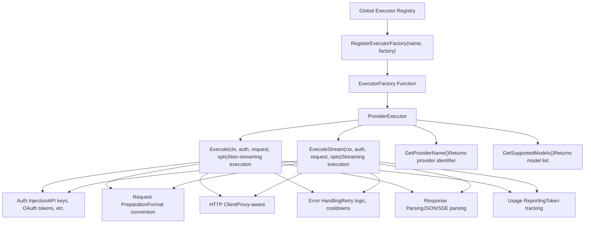
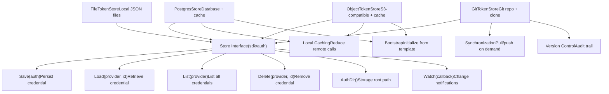
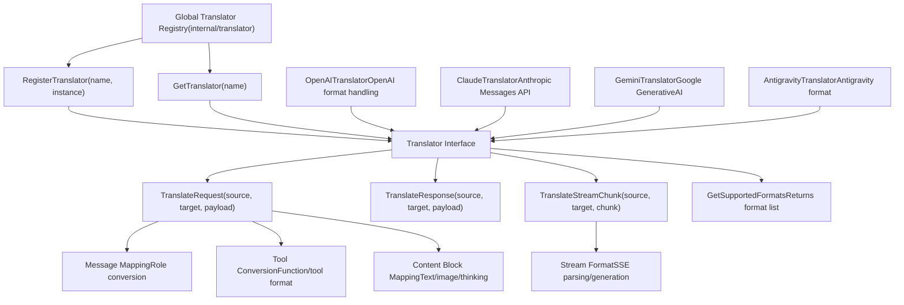
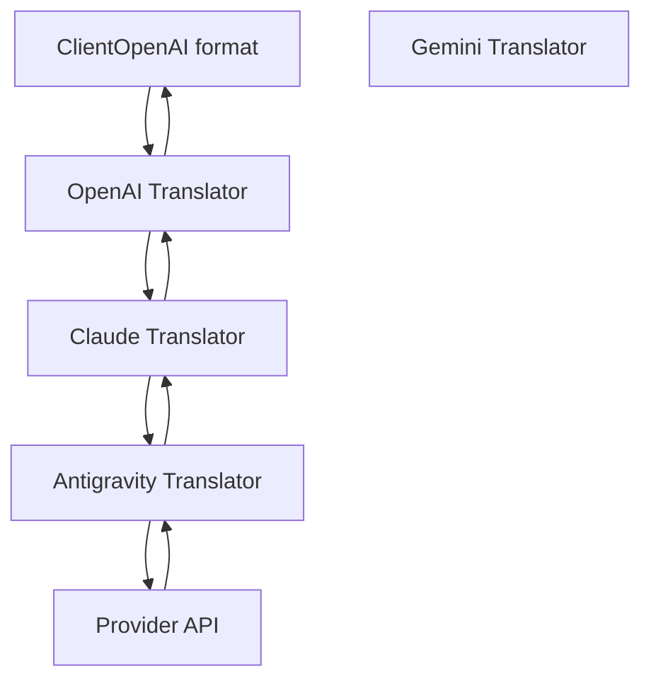
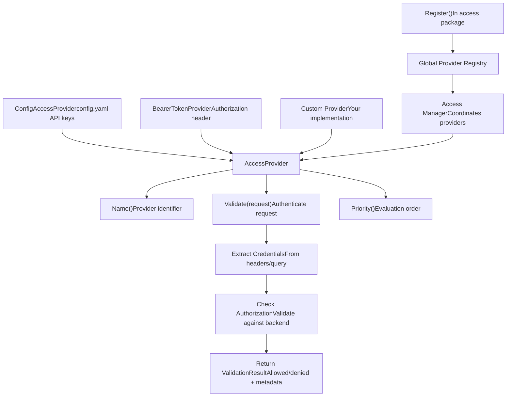
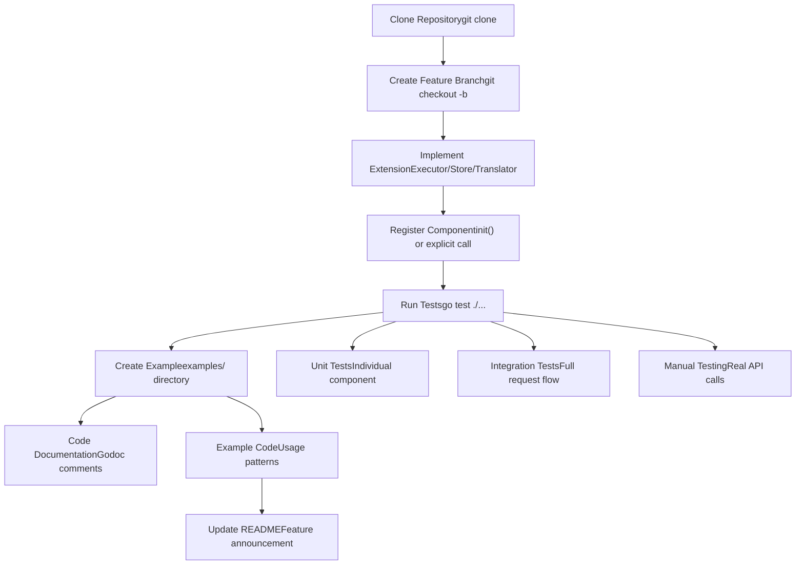
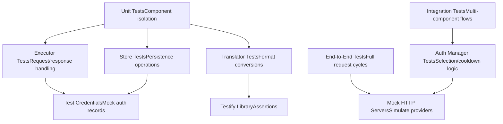

# Development and Extension

Relevant source files

-   [docs/sdk-access.md](https://github.com/router-for-me/CLIProxyAPI/blob/c66cb0af/docs/sdk-access.md)
-   [docs/sdk-access\_CN.md](https://github.com/router-for-me/CLIProxyAPI/blob/c66cb0af/docs/sdk-access_CN.md)
-   [internal/access/config\_access/provider.go](https://github.com/router-for-me/CLIProxyAPI/blob/c66cb0af/internal/access/config_access/provider.go)
-   [internal/access/reconcile.go](https://github.com/router-for-me/CLIProxyAPI/blob/c66cb0af/internal/access/reconcile.go)
-   [sdk/access/errors.go](https://github.com/router-for-me/CLIProxyAPI/blob/c66cb0af/sdk/access/errors.go)
-   [sdk/access/manager.go](https://github.com/router-for-me/CLIProxyAPI/blob/c66cb0af/sdk/access/manager.go)
-   [sdk/access/registry.go](https://github.com/router-for-me/CLIProxyAPI/blob/c66cb0af/sdk/access/registry.go)
-   [sdk/cliproxy/builder.go](https://github.com/router-for-me/CLIProxyAPI/blob/c66cb0af/sdk/cliproxy/builder.go)
-   [sdk/config/config.go](https://github.com/router-for-me/CLIProxyAPI/blob/c66cb0af/sdk/config/config.go)

This document provides technical guidance for developers extending CLIProxyAPI functionality. It covers the SDK architecture, extension points, and development patterns for creating custom executors, storage backends, and translations.

For operational deployment configurations, see [Deployment Scenarios](/router-for-me/CLIProxyAPI/10-deployment-scenarios). For configuration file structure and options, see [Configuration Guide](/router-for-me/CLIProxyAPI/5-configuration-guide). For authentication implementation details, see [Authentication Flows](/router-for-me/CLIProxyAPI/7-authentication-flows).

---

## Extension Architecture Overview

CLIProxyAPI is designed with multiple extension points that allow developers to add new providers, storage backends, access control mechanisms, and protocol translations without modifying core code.

### Extension Points Map

*SDK types and their relationships to CLIProxyAPI extension points. Node labels use package-qualified names from the codebase.*

```mermaid
flowchart TD
    Builder["Builder(sdk/cliproxy/builder.go)"]
    Hooks["Hooks struct(OnBeforeStart / OnAfterStart)"]
    ProviderExecutor["ProviderExecutor Interface"]
    CustomExec["Custom Executor"]
    Store["Store Interface(sdk/auth)"]
    FileStore["FileTokenStore"]
    PostgresStore["PostgresStore"]
    GitStore["GitTokenStore"]
    ObjectStore["ObjectTokenStore"]
    CustomStore["Custom Store"]
    Translator["Translator Interface(internal/translator)"]
    CustomTrans["Custom Translator"]
    AccessProvider["Provider Interface(sdk/access/registry.go)"]
    RegisterProviderFn["RegisterProvider(typ, provider)(sdk/access)"]
    ConfigAccess["config-api-key provider(internal/access/config_access)"]
    CustomAccess["Custom Provider"]
    CoreAuthMgr["coreauth.Manager(sdk/cliproxy/auth)"]
    APIServer["API Server(internal/api)"]
    ModelRegistry["Model Registry"]

    Builder --> Hooks
    Builder --> APIServer
    Builder --> CoreAuthMgr
    Builder --> ModelRegistry
    CustomExec --> ProviderExecutor
    APIServer --> ProviderExecutor
    CustomStore --> Store
    FileStore --> Store
    PostgresStore --> Store
    GitStore --> Store
    ObjectStore --> Store
    CoreAuthMgr --> Store
    CustomTrans --> Translator
    APIServer --> Translator
    CustomAccess --> AccessProvider
    ConfigAccess --> AccessProvider
    RegisterProviderFn --> AccessProvider
    APIServer --> AccessProvider
```


Sources: [sdk/cliproxy/builder.go1-242](https://github.com/router-for-me/CLIProxyAPI/blob/c66cb0af/sdk/cliproxy/builder.go#L1-L242) [sdk/access/registry.go1-83](https://github.com/router-for-me/CLIProxyAPI/blob/c66cb0af/sdk/access/registry.go#L1-L83)

---

## SDK Package Structure

The CLIProxyAPI SDK is organized into reusable packages under `sdk/` that enable embedding the proxy service in applications.

### Core SDK Packages

| Package | Purpose | Key Types |
| --- | --- | --- |
| `sdk/cliproxy` | Service builder and lifecycle management | `Builder`, `ServiceOptions` |
| `sdk/cliproxy/auth` | Credential and authentication management | `Manager`, `AuthRecord`, `Selector` |
| `sdk/executor` | Provider executor interface and registry | `ProviderExecutor`, `ExecutionOptions` |
| `sdk/auth` | Storage abstraction for credentials | `Store`, `FileTokenStore` |
| `sdk/model` | Model registry and availability tracking | `Registry`, `ModelRegistration` |
| `sdk/access` | Request authentication interface | `AccessProvider` |

### Builder Pattern Usage

The `Builder` pattern in `sdk/cliproxy` is the primary entry point for embedding CLIProxyAPI:

> **[Mermaid sequence]**
> *(图表结构无法解析)*

**Sources:** [cmd/server/main.go446-481](https://github.com/router-for-me/CLIProxyAPI/blob/c66cb0af/cmd/server/main.go#L446-L481) [README.md57](https://github.com/router-for-me/CLIProxyAPI/blob/c66cb0af/README.md#L57-L57) [README.md79-85](https://github.com/router-for-me/CLIProxyAPI/blob/c66cb0af/README.md#L79-L85)

---

## Creating Custom Executors

Custom executors implement the `ProviderExecutor` interface to add support for new AI service providers.

### ProviderExecutor Interface

The executor interface defines methods for request handling and streaming:


### Executor Implementation Pattern

Custom executors typically follow this structure:

1.  **Define executor struct** with provider-specific configuration
2.  **Implement interface methods** for execution and metadata
3.  **Create factory function** that returns executor instances
4.  **Register factory** with the executor registry

The executor must handle:

-   **Authentication injection**: API keys, OAuth tokens, or service accounts into requests
-   **Request preparation**: Construct provider-specific HTTP requests
-   **Error handling**: Parse provider errors, apply retry logic, trigger cooldowns
-   **Response parsing**: Extract completion, usage, and metadata
-   **Model registration**: Report supported models to the registry

**Reference implementations:**

-   Gemini executor for API key and OAuth patterns
-   Claude executor for tool handling and thinking blocks
-   OpenAI-compatible executor for generic provider support

**Sources:** [README.md85](https://github.com/router-for-me/CLIProxyAPI/blob/c66cb0af/README.md#L85-L85) Diagram 1 (Executors section)

---

## Custom Storage Backends

Storage backends implement the `Store` interface to persist authentication credentials and configuration.

### Store Interface


### Storage Backend Selection

The storage backend is configured via environment variables and registered globally:

| Backend | Environment Variables | Use Case |
| --- | --- | --- |
| **FileTokenStore** | (default) | Single instance, local development |
| **PostgresStore** | `PGSTORE_DSN`, `PGSTORE_SCHEMA`, `PGSTORE_LOCAL_PATH` | Multi-instance, shared state |
| **GitTokenStore** | `GITSTORE_GIT_URL`, `GITSTORE_GIT_USERNAME`, `GITSTORE_GIT_TOKEN`, `GITSTORE_LOCAL_PATH` | Version control, audit trail |
| **ObjectTokenStore** | `OBJECTSTORE_ENDPOINT`, `OBJECTSTORE_ACCESS_KEY`, `OBJECTSTORE_SECRET_KEY`, `OBJECTSTORE_BUCKET`, `OBJECTSTORE_LOCAL_PATH` | Containerized, cloud deployment |

### Registration Flow

Storage backends are registered once during initialization and used by all components:

1.  **Environment detection**: [cmd/server/main.go166-214](https://github.com/router-for-me/CLIProxyAPI/blob/c66cb0af/cmd/server/main.go#L166-L214) checks environment variables
2.  **Store instantiation**: [cmd/server/main.go226-322](https://github.com/router-for-me/CLIProxyAPI/blob/c66cb0af/cmd/server/main.go#L226-L322) creates store based on config
3.  **Global registration**: [cmd/server/main.go435-443](https://github.com/router-for-me/CLIProxyAPI/blob/c66cb0af/cmd/server/main.go#L435-L443) via `RegisterTokenStore()`
4.  **Component usage**: Auth Manager and other components access via registered store

**Sources:** [cmd/server/main.go166-443](https://github.com/router-for-me/CLIProxyAPI/blob/c66cb0af/cmd/server/main.go#L166-L443) Diagram 3 (Token Storage Backends section)

---

## Translation System Architecture

The translation system converts requests and responses between different AI provider formats (OpenAI, Claude, Gemini, etc.).

### Translator Interface and Registry


### Bidirectional Translation Chains

The system supports multi-hop translations for protocol bridging:


### Translation Considerations

Custom translators must handle:

1.  **Message role mapping**: Convert between `user`/`assistant`/`system` and provider-specific roles
2.  **Content blocks**: Map text, images, tool calls, and thinking blocks
3.  **Tool definitions**: Convert function calling schemas between formats
4.  **Streaming chunks**: Parse and generate SSE (Server-Sent Events) format
5.  **Usage statistics**: Extract and normalize token counts
6.  **Error handling**: Translate provider error codes to standard format

**Sources:** [README.md82](https://github.com/router-for-me/CLIProxyAPI/blob/c66cb0af/README.md#L82-L82) Diagram 6 (Translation Stage section)

---

## Access Control Extension

Access providers implement the `AccessProvider` interface to customize request authentication.

### AccessProvider Interface


### Custom Access Provider Pattern

To add custom authentication:

1.  **Implement interface**: Create struct with `Name()`, `Validate()`, `Priority()` methods
2.  **Extract credentials**: Parse authentication data from HTTP request
3.  **Validate**: Check credentials against your authentication backend
4.  **Return result**: Provide `ValidationResult` with allow/deny decision
5.  **Register**: Call package-level `Register()` function in `init()`

Higher priority providers are evaluated first. First successful validation wins.

**Sources:** [cmd/server/main.go446](https://github.com/router-for-me/CLIProxyAPI/blob/c66cb0af/cmd/server/main.go#L446-L446) [README.md83](https://github.com/router-for-me/CLIProxyAPI/blob/c66cb0af/README.md#L83-L83) Diagram 1 (Access Manager section)

---

## Development Workflow

### Building Extensions


### Debug Mode Configuration

Enable detailed logging for development:

```
# config.yamldebug: truelog_level: "debug"log_api_requests: truelog_api_responses: truelog_request_body: truelog_response_body: true
```
This configuration logs:

-   All HTTP requests with headers and bodies
-   All HTTP responses with headers and bodies
-   Auth selection decisions
-   Model registry state changes
-   Translation operations

### Example: Custom Provider

The `examples/custom-provider` directory demonstrates implementing a custom executor:

**Structure:**

-   Custom executor implementation
-   Factory function and registration
-   Example configuration
-   Integration test

**Key patterns demonstrated:**

-   Implementing `ProviderExecutor` interface methods
-   Handling authentication injection
-   Parsing provider responses
-   Registering with executor registry
-   Model registration and availability

**Sources:** [README.md85](https://github.com/router-for-me/CLIProxyAPI/blob/c66cb0af/README.md#L85-L85) [README.md87-95](https://github.com/router-for-me/CLIProxyAPI/blob/c66cb0af/README.md#L87-L95)

---

## SDK Embedding Example

### Minimal Embedding Pattern

> **[Mermaid sequence]**
> *(图表结构无法解析)*

### Programmatic Configuration

Instead of `config.yaml`, configurations can be provided programmatically:

| Configuration Aspect | SDK Method | Example |
| --- | --- | --- |
| Server port | `cfg.Port = 8080` | Set before `Build()` |
| Auth directory | `cfg.AuthDir = "/path/to/auths"` | Set before `Build()` |
| Storage backend | `RegisterTokenStore(store)` | Before `Build()` |
| Access providers | `access.Register()` | In `init()` or before `Build()` |
| Custom executors | `executor.RegisterExecutorFactory()` | In `init()` or before `Build()` |
| Log level | `cfg.LogLevel = "debug"` | Set before `Build()` |

**Sources:** [cmd/server/main.go428-481](https://github.com/router-for-me/CLIProxyAPI/blob/c66cb0af/cmd/server/main.go#L428-L481) [README.md79-85](https://github.com/router-for-me/CLIProxyAPI/blob/c66cb0af/README.md#L79-L85)

---

## Testing and Debugging

### Testing Strategy


### Debugging Techniques

| Issue Type | Debug Approach | Configuration |
| --- | --- | --- |
| Request routing | Enable `log_api_requests: true` | Logs incoming request details |
| Response format | Enable `log_api_responses: true` | Logs outgoing response details |
| Auth selection | Enable `log_level: "debug"` | Logs selector decisions |
| Translation errors | Enable `log_request_body: true` | Logs payload transformations |
| Provider errors | Check executor error handling | Review retry logic and cooldowns |
| Model availability | Query `/v1/models` endpoint | Check registry state |
| Config hot-reload | Watch file watcher logs | Verify debounce and hash checks |

### Common Extension Issues

**Executor not invoked:**

-   Verify factory registration via `RegisterExecutorFactory()`
-   Check provider name matches configuration
-   Ensure models are registered with model registry

**Storage not persisting:**

-   Verify `Save()` implementation writes to backend
-   Check `AuthDir()` returns correct path
-   Ensure file permissions for write access

**Translation not applied:**

-   Verify translator registration via `RegisterTranslator()`
-   Check format names match expected values
-   Ensure bidirectional support for request and response

**Access denied:**

-   Verify access provider registration
-   Check `Priority()` evaluation order
-   Ensure `Validate()` returns proper result

**Sources:** [README.md85](https://github.com/router-for-me/CLIProxyAPI/blob/c66cb0af/README.md#L85-L85) Diagram 5 (Model Registry section)

---

## Key Interfaces Summary

| Interface | Package | Purpose | Registration Method |
| --- | --- | --- | --- |
| `ProviderExecutor` | `sdk/executor` | Execute provider requests | `RegisterExecutorFactory(name, factory)` |
| `Store` | `sdk/auth` | Persist credentials | `RegisterTokenStore(store)` |
| `Translator` | `internal/translator` | Convert request/response formats | `RegisterTranslator(name, instance)` |
| `AccessProvider` | `internal/access` | Authenticate requests | `Register()` in package init |
| `Selector` | `sdk/cliproxy/auth` | Choose auth for request | Set in config: `round_robin` or `fill_first` |

**Sources:** [README.md79-85](https://github.com/router-for-me/CLIProxyAPI/blob/c66cb0af/README.md#L79-L85) All architecture diagrams
