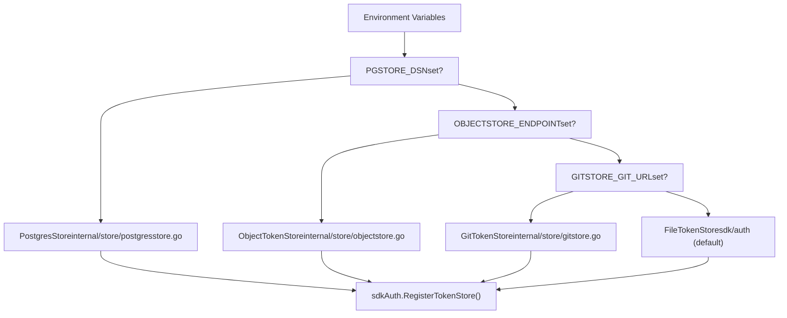
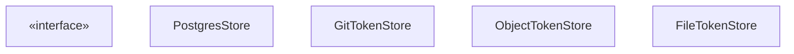
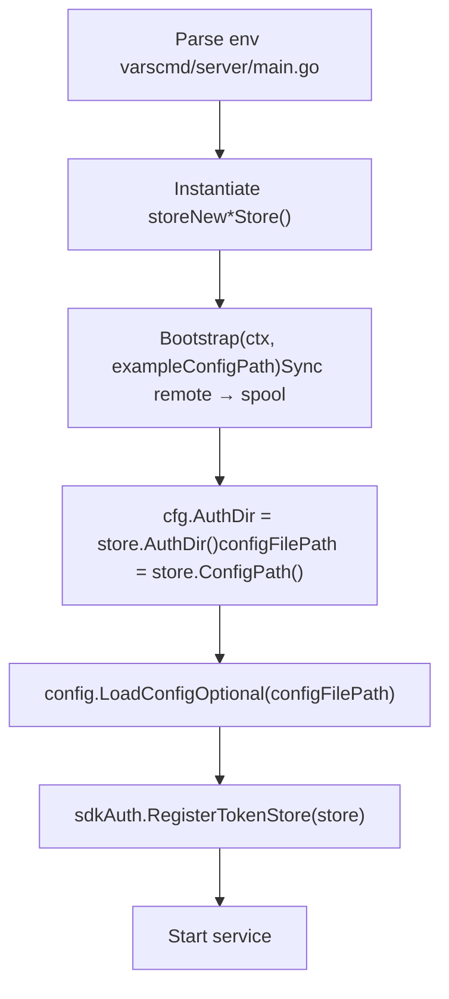

# Custom Storage Backends

Relevant source files

-   [.env.example](https://github.com/router-for-me/CLIProxyAPI/blob/c66cb0af/.env.example)
-   [cmd/server/main.go](https://github.com/router-for-me/CLIProxyAPI/blob/c66cb0af/cmd/server/main.go)
-   [go.mod](https://github.com/router-for-me/CLIProxyAPI/blob/c66cb0af/go.mod)
-   [go.sum](https://github.com/router-for-me/CLIProxyAPI/blob/c66cb0af/go.sum)
-   [internal/api/handlers/management/logs.go](https://github.com/router-for-me/CLIProxyAPI/blob/c66cb0af/internal/api/handlers/management/logs.go)
-   [internal/managementasset/updater.go](https://github.com/router-for-me/CLIProxyAPI/blob/c66cb0af/internal/managementasset/updater.go)
-   [internal/store/gitstore.go](https://github.com/router-for-me/CLIProxyAPI/blob/c66cb0af/internal/store/gitstore.go)
-   [internal/store/objectstore.go](https://github.com/router-for-me/CLIProxyAPI/blob/c66cb0af/internal/store/objectstore.go)
-   [internal/store/postgresstore.go](https://github.com/router-for-me/CLIProxyAPI/blob/c66cb0af/internal/store/postgresstore.go)

This page explains the storage backend system used by CLIProxyAPI to persist OAuth tokens and configuration files. It covers the `Store` interface contract, the three built-in remote backends (`PostgresStore`, `GitTokenStore`, `ObjectTokenStore`), the local spool pattern they share, and how to plug in a custom implementation.

For information on configuring which backend to use, see [Storage Backend Options](/router-for-me/CLIProxyAPI/5.2-storage-backend-options). For how credentials are loaded and selected at request time, see [Authentication and Credential Management](/router-for-me/CLIProxyAPI/3.3-authentication-and-credential-management).

---

## Overview

All storage activity in CLIProxyAPI is routed through a single registered `TokenStore`. At startup, `main.go` inspects environment variables to decide which concrete store to instantiate, then calls `sdkAuth.RegisterTokenStore()` to make it available to the rest of the system.

**Store selection logic** ([cmd/server/main.go236-453](https://github.com/router-for-me/CLIProxyAPI/blob/c66cb0af/cmd/server/main.go#L236-L453)):

| Environment Variable | Backend Selected |
| --- | --- |
| `PGSTORE_DSN` | `PostgresStore` |
| `OBJECTSTORE_ENDPOINT` | `ObjectTokenStore` |
| `GITSTORE_GIT_URL` | `GitTokenStore` |
| *(none)* | `FileTokenStore` (default) |

> Only one backend is active at a time. PostgreSQL takes priority if both `PGSTORE_DSN` and `GITSTORE_GIT_URL` are set.

**Store selection diagram:**


Sources: [cmd/server/main.go130-453](https://github.com/router-for-me/CLIProxyAPI/blob/c66cb0af/cmd/server/main.go#L130-L453)

---

## The Store Interface

All backends satisfy the interface consumed by `sdkAuth.RegisterTokenStore()` in the `sdk/auth` package. Based on the shared method surface across all implementations, the interface requires:

| Method | Description |
| --- | --- |
| `Save(ctx, *Auth) (string, error)` | Persists a single auth credential; returns the resolved local file path |
| `List(ctx) ([]*Auth, error)` | Enumerates all stored credentials |
| `Delete(ctx, id string) error` | Removes a credential by ID |
| `PersistAuthFiles(ctx, message string, paths ...string) error` | Pushes specific local auth files to the remote backend |
| `PersistConfig(ctx) error` | Pushes the local `config.yaml` to the remote backend |
| `Bootstrap(ctx, exampleConfigPath string) error` | Runs once at startup: creates remote tables/buckets, syncs remote→local |
| `ConfigPath() string` | Returns the local spool path to `config.yaml` |
| `AuthDir() string` | Returns the local spool path to the auth file directory |
| `SetBaseDir(string)` | Optional hook used by some auth flows to update the working directory |

The `*Auth` type is `cliproxyauth.Auth` from `sdk/cliproxy/auth`.

**Interface-to-implementation mapping:**


Sources: [internal/store/postgresstore.go39-100](https://github.com/router-for-me/CLIProxyAPI/blob/c66cb0af/internal/store/postgresstore.go#L39-L100) [internal/store/gitstore.go28-48](https://github.com/router-for-me/CLIProxyAPI/blob/c66cb0af/internal/store/gitstore.go#L28-L48) [internal/store/objectstore.go44-119](https://github.com/router-for-me/CLIProxyAPI/blob/c66cb0af/internal/store/objectstore.go#L44-L119) [cmd/server/main.go445-453](https://github.com/router-for-me/CLIProxyAPI/blob/c66cb0af/cmd/server/main.go#L445-L453)

---

## The Local Spool Pattern

All remote backends (PostgreSQL, Git, Object Storage) follow the same pattern: they maintain a **local spool directory** on disk that mirrors the remote state. The rest of the server reads and writes only to this local directory. The store is responsible for keeping the local copy in sync with the remote.

**Bootstrap (remote → local sync):**

> **[Mermaid sequence]**
> *(图表结构无法解析)*

Sources: [internal/store/postgresstore.go147-158](https://github.com/router-for-me/CLIProxyAPI/blob/c66cb0af/internal/store/postgresstore.go#L147-L158) [internal/store/objectstore.go142-156](https://github.com/router-for-me/CLIProxyAPI/blob/c66cb0af/internal/store/objectstore.go#L142-L156) [internal/store/gitstore.go92-213](https://github.com/router-for-me/CLIProxyAPI/blob/c66cb0af/internal/store/gitstore.go#L92-L213)

**Runtime (local → remote sync):**

When auth tokens are saved or configuration is updated, the store writes the local file first, then pushes the change to the remote backend.

> **[Mermaid sequence]**
> *(图表结构无法解析)*

Sources: [internal/store/postgresstore.go189-260](https://github.com/router-for-me/CLIProxyAPI/blob/c66cb0af/internal/store/postgresstore.go#L189-L260) [internal/store/gitstore.go215-296](https://github.com/router-for-me/CLIProxyAPI/blob/c66cb0af/internal/store/gitstore.go#L215-L296) [internal/store/objectstore.go158-226](https://github.com/router-for-me/CLIProxyAPI/blob/c66cb0af/internal/store/objectstore.go#L158-L226)

The `ConfigPath()` and `AuthDir()` return paths inside the spool so the rest of the application is unaware of the backing store:

```
// In main.go, after bootstrap:cfg.AuthDir = pgStoreInst.AuthDir()         // e.g. /data/pgstore/authsconfigFilePath = pgStoreInst.ConfigPath()   // e.g. /data/pgstore/config/config.yaml
```
Sources: [cmd/server/main.go262-265](https://github.com/router-for-me/CLIProxyAPI/blob/c66cb0af/cmd/server/main.go#L262-L265) [internal/store/postgresstore.go160-182](https://github.com/router-for-me/CLIProxyAPI/blob/c66cb0af/internal/store/postgresstore.go#L160-L182)

---

## Built-in Backends

### File Store (Default)

The `FileTokenStore` (instantiated via `sdkAuth.NewFileTokenStore()`) reads and writes auth JSON files directly to the directory specified in `config.yaml`'s `auth_dir` field. No spool directory, no remote sync. This is the default when no environment variables are set.

Sources: [cmd/server/main.go451-453](https://github.com/router-for-me/CLIProxyAPI/blob/c66cb0af/cmd/server/main.go#L451-L453)

---

### PostgreSQL Store

**Type:** `PostgresStore` in [internal/store/postgresstore.go](https://github.com/router-for-me/CLIProxyAPI/blob/c66cb0af/internal/store/postgresstore.go)

**Configuration type:** `PostgresStoreConfig`

| Field | Env Variable | Description |
| --- | --- | --- |
| `DSN` | `PGSTORE_DSN` | PostgreSQL connection string |
| `Schema` | `PGSTORE_SCHEMA` | Optional schema name (e.g. `public`) |
| `SpoolDir` | `PGSTORE_LOCAL_PATH` | Local spool root directory |

**Database schema** (created by `EnsureSchema`):

| Table (default name) | Columns | Purpose |
| --- | --- | --- |
| `config_store` | `id TEXT PK`, `content TEXT`, `created_at`, `updated_at` | Stores `config.yaml` as text |
| `auth_store` | `id TEXT PK`, `content JSONB`, `created_at`, `updated_at` | Stores auth JSON blobs |

The config table stores a single row with `id = "config"`. Auth records use a relative path from `authDir` as the row ID (e.g. `gemini/account1.json`).

Table names can be overridden via `PostgresStoreConfig.ConfigTable` and `PostgresStoreConfig.AuthTable`. Schema-qualified names are generated by `fullTableName()` which produces `"schema"."table"` identifiers using `quoteIdentifier()`.

Sources: [internal/store/postgresstore.go22-144](https://github.com/router-for-me/CLIProxyAPI/blob/c66cb0af/internal/store/postgresstore.go#L22-L144)

---

### Git Store

**Type:** `GitTokenStore` in [internal/store/gitstore.go](https://github.com/router-for-me/CLIProxyAPI/blob/c66cb0af/internal/store/gitstore.go)

**Configuration:**

| Env Variable | Description |
| --- | --- |
| `GITSTORE_GIT_URL` | Remote repository URL (HTTPS) |
| `GITSTORE_GIT_USERNAME` | Git username |
| `GITSTORE_GIT_TOKEN` | Git token / password |
| `GITSTORE_LOCAL_PATH` | Local directory for the cloned repository |

**Repository layout:**

```
gitstore/
  .git/
  auths/           ← auth JSON files (cfg.AuthDir)
    gemini/
      account1.json
  config/          ← configuration
    config.yaml
```
**Initialization** (`EnsureRepository`): Clones the remote if `.git` is absent, or runs `git pull` if a local clone already exists. An empty remote triggers `git init` plus an initial commit containing `.gitkeep` placeholder files.

Each `Save()` call results in a commit and force push. The store maintains history as a **single squashed commit** via `rewriteHeadAsSingleCommit()` — the tree is preserved but parent history is erased to prevent unbounded repository growth. Periodic garbage collection is triggered by `maybeRunGC()` (every 5 minutes).

Sources: [internal/store/gitstore.go92-213](https://github.com/router-for-me/CLIProxyAPI/blob/c66cb0af/internal/store/gitstore.go#L92-L213) [internal/store/gitstore.go556-675](https://github.com/router-for-me/CLIProxyAPI/blob/c66cb0af/internal/store/gitstore.go#L556-L675)

---

### Object Store

**Type:** `ObjectTokenStore` in [internal/store/objectstore.go](https://github.com/router-for-me/CLIProxyAPI/blob/c66cb0af/internal/store/objectstore.go)

**Configuration type:** `ObjectStoreConfig`

| Env Variable | Description |
| --- | --- |
| `OBJECTSTORE_ENDPOINT` | S3-compatible endpoint URL (`http://` or `https://`) |
| `OBJECTSTORE_ACCESS_KEY` | Access key ID |
| `OBJECTSTORE_SECRET_KEY` | Secret access key |
| `OBJECTSTORE_BUCKET` | Bucket name |
| `OBJECTSTORE_LOCAL_PATH` | Local spool root directory |

Uses the `minio-go` client library. `PathStyle: true` is always set (path-based bucket addressing). SSL is inferred from the endpoint scheme.

**Bucket layout:**

```
<bucket>/
  config/
    config.yaml       ← objectStoreConfigKey = "config/config.yaml"
  auths/              ← objectStoreAuthPrefix = "auths"
    gemini/
      account1.json
```
An optional `Prefix` field in `ObjectStoreConfig` namespaces all keys (e.g. `team-a/config/config.yaml`).

> **Important:** `syncAuthFromBucket` does **not** call `os.RemoveAll` before downloading. This avoids triggering file watcher delete events that would propagate deletions back to the remote (a race condition).

Sources: [internal/store/objectstore.go26-119](https://github.com/router-for-me/CLIProxyAPI/blob/c66cb0af/internal/store/objectstore.go#L26-L119) [internal/store/objectstore.go388-438](https://github.com/router-for-me/CLIProxyAPI/blob/c66cb0af/internal/store/objectstore.go#L388-L438)

---

## Lifecycle During Startup


Sources: [cmd/server/main.go236-453](https://github.com/router-for-me/CLIProxyAPI/blob/c66cb0af/cmd/server/main.go#L236-L453)

---

## Implementing a Custom Backend

To implement a custom store, define a type that satisfies all methods listed in [The Store Interface](https://github.com/router-for-me/CLIProxyAPI/blob/c66cb0af/The Store Interface) section above, then pass it to `sdkAuth.RegisterTokenStore()` before starting the service.

The key design constraints observed in all built-in implementations:

1.  **Maintain a local spool.** `ConfigPath()` and `AuthDir()` must return stable, accessible local filesystem paths. The rest of the system treats these as ordinary local files.

2.  **`Bootstrap` is called once before the service starts.** Use it to create remote structures and do an initial remote→local sync.

3.  **`Save` writes locally first, then syncs remotely.** Return the local file path on success.

4.  **`PersistAuthFiles` and `PersistConfig` are called by the watcher subsystem** after the local file has already been updated. They push the local state to the remote.

5.  **`SetBaseDir` may be a no-op** for backends that control their own workspace (e.g. both `PostgresStore` and `ObjectTokenStore` implement it as `func (s *T) SetBaseDir(string) {}`).

6.  **Thread safety.** All built-in implementations use `sync.Mutex` to guard concurrent write operations. Use the same pattern.


Using the SDK builder (see [Using the Go SDK](/router-for-me/CLIProxyAPI/9.1-using-the-go-sdk)), pass a custom store via `sdkAuth.RegisterTokenStore()` before calling `Builder.Build()`.

Sources: [internal/store/postgresstore.go186](https://github.com/router-for-me/CLIProxyAPI/blob/c66cb0af/internal/store/postgresstore.go#L186-L186) [internal/store/objectstore.go122-123](https://github.com/router-for-me/CLIProxyAPI/blob/c66cb0af/internal/store/objectstore.go#L122-L123) [internal/store/gitstore.go50-74](https://github.com/router-for-me/CLIProxyAPI/blob/c66cb0af/internal/store/gitstore.go#L50-L74) [cmd/server/main.go444-453](https://github.com/router-for-me/CLIProxyAPI/blob/c66cb0af/cmd/server/main.go#L444-L453)
