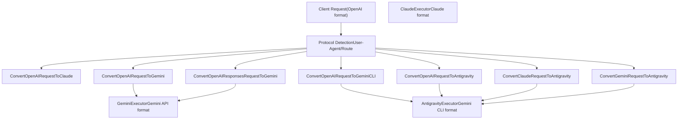
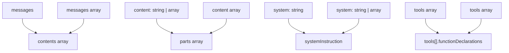
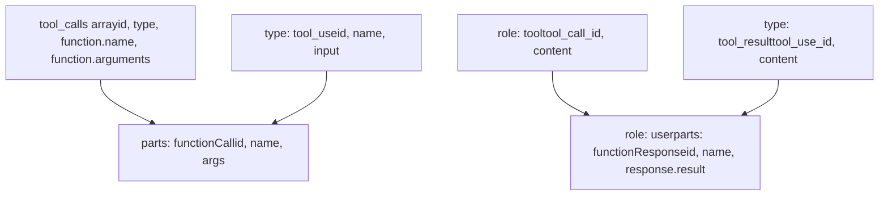
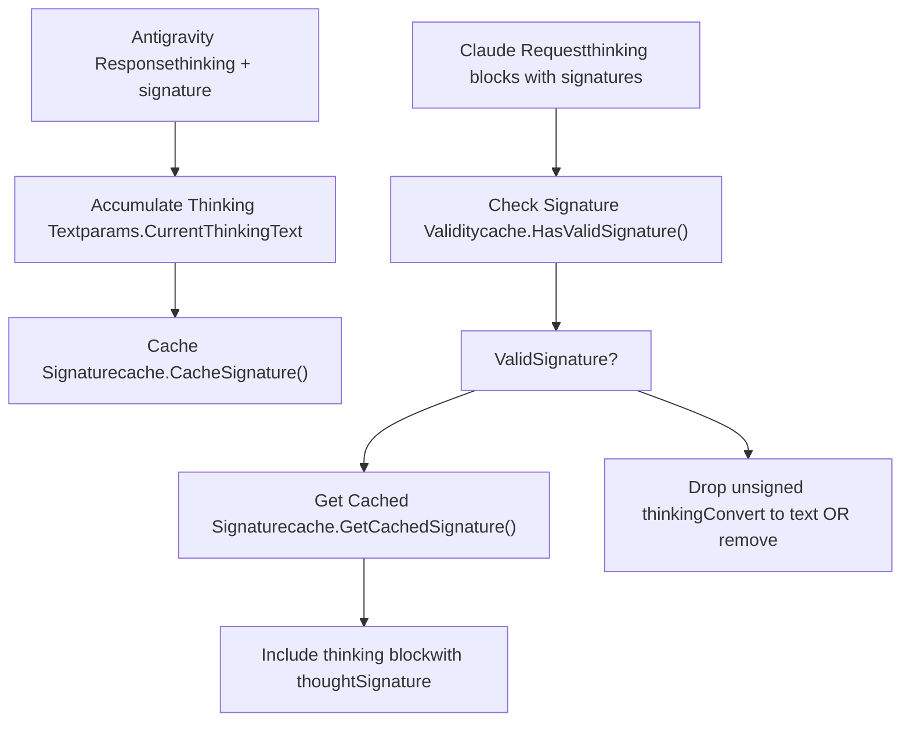
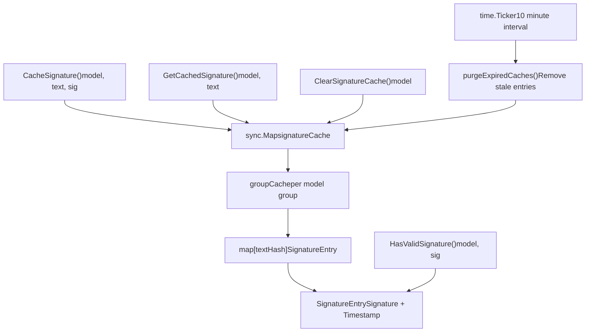
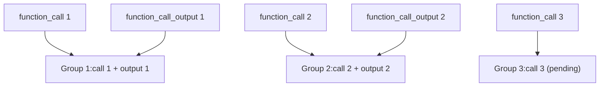

# Translation System Deep Dive

Relevant source files

-   [internal/runtime/executor/antigravity\_executor\_buildrequest\_test.go](https://github.com/router-for-me/CLIProxyAPI/blob/c66cb0af/internal/runtime/executor/antigravity_executor_buildrequest_test.go)
-   [internal/translator/antigravity/openai/chat-completions/antigravity\_openai\_request.go](https://github.com/router-for-me/CLIProxyAPI/blob/c66cb0af/internal/translator/antigravity/openai/chat-completions/antigravity_openai_request.go)
-   [internal/translator/antigravity/openai/chat-completions/antigravity\_openai\_response.go](https://github.com/router-for-me/CLIProxyAPI/blob/c66cb0af/internal/translator/antigravity/openai/chat-completions/antigravity_openai_response.go)
-   [internal/translator/antigravity/openai/chat-completions/antigravity\_openai\_response\_test.go](https://github.com/router-for-me/CLIProxyAPI/blob/c66cb0af/internal/translator/antigravity/openai/chat-completions/antigravity_openai_response_test.go)
-   [internal/translator/claude/gemini/claude\_gemini\_request.go](https://github.com/router-for-me/CLIProxyAPI/blob/c66cb0af/internal/translator/claude/gemini/claude_gemini_request.go)
-   [internal/translator/claude/openai/chat-completions/claude\_openai\_request.go](https://github.com/router-for-me/CLIProxyAPI/blob/c66cb0af/internal/translator/claude/openai/chat-completions/claude_openai_request.go)
-   [internal/translator/claude/openai/responses/claude\_openai-responses\_request.go](https://github.com/router-for-me/CLIProxyAPI/blob/c66cb0af/internal/translator/claude/openai/responses/claude_openai-responses_request.go)
-   [internal/translator/claude/openai/responses/claude\_openai-responses\_response.go](https://github.com/router-for-me/CLIProxyAPI/blob/c66cb0af/internal/translator/claude/openai/responses/claude_openai-responses_response.go)
-   [internal/translator/codex/claude/codex\_claude\_request.go](https://github.com/router-for-me/CLIProxyAPI/blob/c66cb0af/internal/translator/codex/claude/codex_claude_request.go)
-   [internal/translator/codex/claude/codex\_claude\_response.go](https://github.com/router-for-me/CLIProxyAPI/blob/c66cb0af/internal/translator/codex/claude/codex_claude_response.go)
-   [internal/translator/codex/gemini/codex\_gemini\_request.go](https://github.com/router-for-me/CLIProxyAPI/blob/c66cb0af/internal/translator/codex/gemini/codex_gemini_request.go)
-   [internal/translator/codex/openai/chat-completions/codex\_openai\_request.go](https://github.com/router-for-me/CLIProxyAPI/blob/c66cb0af/internal/translator/codex/openai/chat-completions/codex_openai_request.go)
-   [internal/translator/codex/openai/responses/codex\_openai-responses\_request.go](https://github.com/router-for-me/CLIProxyAPI/blob/c66cb0af/internal/translator/codex/openai/responses/codex_openai-responses_request.go)
-   [internal/translator/codex/openai/responses/codex\_openai-responses\_request\_test.go](https://github.com/router-for-me/CLIProxyAPI/blob/c66cb0af/internal/translator/codex/openai/responses/codex_openai-responses_request_test.go)
-   [internal/translator/codex/openai/responses/codex\_openai-responses\_response.go](https://github.com/router-for-me/CLIProxyAPI/blob/c66cb0af/internal/translator/codex/openai/responses/codex_openai-responses_response.go)
-   [internal/translator/gemini-cli/claude/gemini-cli\_claude\_request.go](https://github.com/router-for-me/CLIProxyAPI/blob/c66cb0af/internal/translator/gemini-cli/claude/gemini-cli_claude_request.go)
-   [internal/translator/gemini-cli/claude/gemini-cli\_claude\_response.go](https://github.com/router-for-me/CLIProxyAPI/blob/c66cb0af/internal/translator/gemini-cli/claude/gemini-cli_claude_response.go)
-   [internal/translator/gemini-cli/openai/chat-completions/gemini-cli\_openai\_request.go](https://github.com/router-for-me/CLIProxyAPI/blob/c66cb0af/internal/translator/gemini-cli/openai/chat-completions/gemini-cli_openai_request.go)
-   [internal/translator/gemini-cli/openai/chat-completions/gemini-cli\_openai\_response.go](https://github.com/router-for-me/CLIProxyAPI/blob/c66cb0af/internal/translator/gemini-cli/openai/chat-completions/gemini-cli_openai_response.go)
-   [internal/translator/gemini/claude/gemini\_claude\_request.go](https://github.com/router-for-me/CLIProxyAPI/blob/c66cb0af/internal/translator/gemini/claude/gemini_claude_request.go)
-   [internal/translator/gemini/claude/gemini\_claude\_response.go](https://github.com/router-for-me/CLIProxyAPI/blob/c66cb0af/internal/translator/gemini/claude/gemini_claude_response.go)
-   [internal/translator/gemini/openai/chat-completions/gemini\_openai\_request.go](https://github.com/router-for-me/CLIProxyAPI/blob/c66cb0af/internal/translator/gemini/openai/chat-completions/gemini_openai_request.go)
-   [internal/translator/gemini/openai/chat-completions/gemini\_openai\_response.go](https://github.com/router-for-me/CLIProxyAPI/blob/c66cb0af/internal/translator/gemini/openai/chat-completions/gemini_openai_response.go)
-   [internal/translator/gemini/openai/responses/gemini\_openai-responses\_request.go](https://github.com/router-for-me/CLIProxyAPI/blob/c66cb0af/internal/translator/gemini/openai/responses/gemini_openai-responses_request.go)
-   [internal/translator/gemini/openai/responses/gemini\_openai-responses\_response.go](https://github.com/router-for-me/CLIProxyAPI/blob/c66cb0af/internal/translator/gemini/openai/responses/gemini_openai-responses_response.go)
-   [internal/translator/gemini/openai/responses/gemini\_openai-responses\_response\_test.go](https://github.com/router-for-me/CLIProxyAPI/blob/c66cb0af/internal/translator/gemini/openai/responses/gemini_openai-responses_response_test.go)
-   [internal/translator/openai/claude/openai\_claude\_request.go](https://github.com/router-for-me/CLIProxyAPI/blob/c66cb0af/internal/translator/openai/claude/openai_claude_request.go)
-   [internal/translator/openai/claude/openai\_claude\_request\_test.go](https://github.com/router-for-me/CLIProxyAPI/blob/c66cb0af/internal/translator/openai/claude/openai_claude_request_test.go)
-   [internal/translator/openai/claude/openai\_claude\_response.go](https://github.com/router-for-me/CLIProxyAPI/blob/c66cb0af/internal/translator/openai/claude/openai_claude_response.go)
-   [internal/translator/openai/gemini/openai\_gemini\_request.go](https://github.com/router-for-me/CLIProxyAPI/blob/c66cb0af/internal/translator/openai/gemini/openai_gemini_request.go)
-   [internal/translator/openai/gemini/openai\_gemini\_response.go](https://github.com/router-for-me/CLIProxyAPI/blob/c66cb0af/internal/translator/openai/gemini/openai_gemini_response.go)
-   [internal/translator/openai/openai/responses/openai\_openai-responses\_response.go](https://github.com/router-for-me/CLIProxyAPI/blob/c66cb0af/internal/translator/openai/openai/responses/openai_openai-responses_response.go)
-   [internal/util/gemini\_schema.go](https://github.com/router-for-me/CLIProxyAPI/blob/c66cb0af/internal/util/gemini_schema.go)
-   [internal/util/gemini\_schema\_test.go](https://github.com/router-for-me/CLIProxyAPI/blob/c66cb0af/internal/util/gemini_schema_test.go)
-   [internal/util/sanitize\_test.go](https://github.com/router-for-me/CLIProxyAPI/blob/c66cb0af/internal/util/sanitize_test.go)
-   [internal/util/translator.go](https://github.com/router-for-me/CLIProxyAPI/blob/c66cb0af/internal/util/translator.go)
-   [internal/util/util.go](https://github.com/router-for-me/CLIProxyAPI/blob/c66cb0af/internal/util/util.go)

## Purpose and Scope

This document explains the translation system architecture that enables CLIProxyAPI to convert between different AI provider API formats. The translation system allows clients using one API format (e.g., OpenAI) to communicate with providers using different formats (e.g., Claude, Gemini), with full support for streaming, tool calls, and thinking blocks.

For information about how translations are applied during request execution, see [Provider Executor System](/router-for-me/CLIProxyAPI/3.4-provider-executor-system). For configuration of provider-specific settings, see [Provider Integration](/router-for-me/CLIProxyAPI/6-provider-integration).

---

## Translation Architecture

CLIProxyAPI's translation system is built on a pure functional design using `gjson` for JSON parsing and `sjson` for JSON construction. This approach enables zero-allocation transformations of large request/response payloads without defining Go structs for every API format.

### Design Principles

1.  **Pure Functions**: Translation functions are stateless and side-effect-free (except for streaming responses)
2.  **Zero-Copy JSON**: Uses `gjson`/`sjson` to manipulate JSON without marshaling to Go structs
3.  **Bidirectional**: Supports translation in both request and response directions
4.  **Format Agnostic**: Provider executors are decoupled from translation logic

### Translation Function Signatures

All request translators follow this signature pattern:

```
func ConvertXRequestToY(modelName string, rawJSON []byte, stream bool) []byte
```
Response translators for streaming use a stateful approach:

```
func ConvertXResponseToY(ctx context.Context, modelName string, originalRequestRawJSON, requestRawJSON, rawJSON []byte, param *any) []string
```
Sources: [internal/translator/gemini/openai/chat-completions/gemini\_openai\_request.go20-30](https://github.com/router-for-me/CLIProxyAPI/blob/c66cb0af/internal/translator/gemini/openai/chat-completions/gemini_openai_request.go#L20-L30) [internal/translator/antigravity/claude/antigravity\_claude\_response.go50-66](https://github.com/router-for-me/CLIProxyAPI/blob/c66cb0af/internal/translator/antigravity/claude/antigravity_claude_response.go#L50-L66)

---

## Request Translation Flow


**Translation Selection Matrix**

| Source Format | Target Provider | Translator Function |
| --- | --- | --- |
| OpenAI Chat Completions | Gemini | `ConvertOpenAIRequestToGemini` |
| OpenAI Chat Completions | Gemini CLI | `ConvertOpenAIRequestToGeminiCLI` |
| OpenAI Chat Completions | Antigravity | `ConvertOpenAIRequestToAntigravity` |
| Claude Messages | Antigravity | `ConvertClaudeRequestToAntigravity` |
| Gemini | Antigravity | `ConvertGeminiRequestToAntigravity` |
| OpenAI Responses | Gemini | `ConvertOpenAIResponsesRequestToGemini` |

Sources: [internal/translator/gemini/openai/chat-completions/gemini\_openai\_request.go1-10](https://github.com/router-for-me/CLIProxyAPI/blob/c66cb0af/internal/translator/gemini/openai/chat-completions/gemini_openai_request.go#L1-L10) [internal/translator/antigravity/claude/antigravity\_claude\_request.go1-18](https://github.com/router-for-me/CLIProxyAPI/blob/c66cb0af/internal/translator/antigravity/claude/antigravity_claude_request.go#L1-L18)

---

## Message Structure Transformations

### Role Mapping

Different API formats use different role names for the same concepts:

| OpenAI | Claude | Gemini/CLI | Description |
| --- | --- | --- | --- |
| `system` | `system` (top-level) | `system_instruction` | System instructions |
| `user` | `user` | `user` | User messages |
| `assistant` | `assistant` | `model` | AI responses |
| `tool` | `tool_result` | `function` (role) | Tool/function outputs |

The translation system handles role mapping during message conversion:

**OpenAI → Gemini CLI Example:**

```
OpenAI:     {"role": "assistant", "content": "Hello"}
Gemini CLI: {"role": "model", "parts": [{"text": "Hello"}]}
```
Sources: [internal/translator/gemini-cli/openai/chat-completions/gemini-cli\_openai\_request.go209-215](https://github.com/router-for-me/CLIProxyAPI/blob/c66cb0af/internal/translator/gemini-cli/openai/chat-completions/gemini-cli_openai_request.go#L209-L215) [internal/translator/antigravity/claude/antigravity\_claude\_request.go78-86](https://github.com/router-for-me/CLIProxyAPI/blob/c66cb0af/internal/translator/antigravity/claude/antigravity_claude_request.go#L78-L86)

### Content Structure Conversion


Sources: [internal/translator/gemini-cli/openai/chat-completions/gemini-cli\_openai\_request.go101-164](https://github.com/router-for-me/CLIProxyAPI/blob/c66cb0af/internal/translator/gemini-cli/openai/chat-completions/gemini-cli_openai_request.go#L101-L164) [internal/translator/antigravity/claude/antigravity\_claude\_request.go42-66](https://github.com/router-for-me/CLIProxyAPI/blob/c66cb0af/internal/translator/antigravity/claude/antigravity_claude_request.go#L42-L66)

---

## Tool/Function Call Translation

### Tool Declaration Conversion

Tool definitions require field name transformations between formats:

**OpenAI → Gemini:**

-   `parameters` → `parametersJsonSchema`
-   `strict` field removed
-   Default schema added if missing

**Claude → Antigravity:**

-   `input_schema` → `parametersJsonSchema`
-   Schema sanitization for Antigravity compatibility
-   Restricted field whitelist: `name`, `description`, `behavior`, `parameters`, `parametersJsonSchema`, `response`, `responseJsonSchema`

Sources: [internal/translator/gemini/openai/chat-completions/gemini\_openai\_request.go292-396](https://github.com/router-for-me/CLIProxyAPI/blob/c66cb0af/internal/translator/gemini/openai/chat-completions/gemini_openai_request.go#L292-L396) [internal/translator/antigravity/claude/antigravity\_claude\_request.go313-339](https://github.com/router-for-me/CLIProxyAPI/blob/c66cb0af/internal/translator/antigravity/claude/antigravity_claude_request.go#L313-L339)

### Tool Call and Response Mapping


**Tool Response Grouping**

Gemini CLI requires tool responses to be grouped with their corresponding function calls. The `fixCLIToolResponse` function performs sophisticated grouping:

1.  Tracks pending function call groups awaiting responses
2.  Collects function responses from user messages
3.  Matches responses to calls by count
4.  Creates merged `functionResponse` content blocks

Sources: [internal/translator/antigravity/gemini/antigravity\_gemini\_request.go168-313](https://github.com/router-for-me/CLIProxyAPI/blob/c66cb0af/internal/translator/antigravity/gemini/antigravity_gemini_request.go#L168-L313) [internal/translator/gemini-cli/openai/chat-completions/gemini-cli\_openai\_request.go241-283](https://github.com/router-for-me/CLIProxyAPI/blob/c66cb0af/internal/translator/gemini-cli/openai/chat-completions/gemini-cli_openai_request.go#L241-L283)

---

## Thinking Block Translation

### Thinking Format Mapping

| Format | Thinking Representation | Signature Field |
| --- | --- | --- |
| OpenAI | `reasoning_effort` parameter | N/A |
| Claude | `type: "thinking"` content block | `signature` (for validation) |
| Gemini | `thought: true` part | `thoughtSignature` |

### Reasoning Effort Translation

OpenAI's `reasoning_effort` parameter maps to provider-specific thinking configurations:

**OpenAI → Gemini:**

```
reasoning_effort: "low"    → thinkingLevel: "low", includeThoughts: true
reasoning_effort: "medium" → thinkingLevel: "medium", includeThoughts: true
reasoning_effort: "high"   → thinkingLevel: "high", includeThoughts: true
reasoning_effort: "auto"   → thinkingBudget: -1, includeThoughts: true
```
**Claude → Antigravity:**

```
thinking.type: "enabled", budget_tokens: 8000 → thinkingBudget: 8000, includeThoughts: true
```
Sources: [internal/translator/gemini/openai/chat-completions/gemini\_openai\_request.go38-53](https://github.com/router-for-me/CLIProxyAPI/blob/c66cb0af/internal/translator/gemini/openai/chat-completions/gemini_openai_request.go#L38-L53) [internal/translator/antigravity/claude/antigravity\_claude\_request.go380-388](https://github.com/router-for-me/CLIProxyAPI/blob/c66cb0af/internal/translator/antigravity/claude/antigravity_claude_request.go#L380-L388)

### Thinking Block Signature Validation

Claude thinking models require signature validation for thinking blocks in conversation history. The translation system uses the signature cache to handle this:


**Signature Sentinel Value**

For Gemini models (non-Claude), the special sentinel `"skip_thought_signature_validator"` bypasses signature validation:

```
const geminiFunctionThoughtSignature = "skip_thought_signature_validator"
```
This is applied to:

-   Function calls without valid signatures
-   Thinking blocks in Gemini requests
-   Image content blocks

Sources: [internal/translator/antigravity/claude/antigravity\_claude\_request.go94-157](https://github.com/router-for-me/CLIProxyAPI/blob/c66cb0af/internal/translator/antigravity/claude/antigravity_claude_request.go#L94-L157) [internal/translator/antigravity/gemini/antigravity\_gemini\_request.go104-134](https://github.com/router-for-me/CLIProxyAPI/blob/c66cb0af/internal/translator/antigravity/gemini/antigravity_gemini_request.go#L104-L134) [internal/translator/gemini/openai/chat-completions/gemini\_openai\_request.go18](https://github.com/router-for-me/CLIProxyAPI/blob/c66cb0af/internal/translator/gemini/openai/chat-completions/gemini_openai_request.go#L18-L18)

---

## Signature Cache System

The signature cache enables Claude thinking models to use thinking blocks in multi-turn conversations by caching and retrieving thinking signatures.

### Cache Architecture


### Cache Key Generation

Thinking text is hashed to create stable cache keys:

```
func hashText(text string) string {    h := sha256.Sum256([]byte(text))    return hex.EncodeToString(h[:])[:SignatureTextHashLen]  // 16 hex chars}
```
**Model Grouping:**

-   `claude` models → `"claude"` group
-   `gemini` models → `"gemini"` group
-   `gpt` models → `"gpt"` group
-   Others → model name as group

Sources: [internal/cache/signature\_cache.go1-196](https://github.com/router-for-me/CLIProxyAPI/blob/c66cb0af/internal/cache/signature_cache.go#L1-L196)

### Cache Usage Pattern

**During Request Translation (Claude → Antigravity):**

1.  Extract thinking block from Claude request
2.  Check if signature exists and is valid (`HasValidSignature`)
3.  If valid, attempt cache lookup (`GetCachedSignature`)
4.  If cache hit, use cached signature; else use client-provided signature
5.  If no valid signature, drop the thinking block entirely

**During Response Translation (Antigravity → Claude):**

1.  Accumulate thinking text in `params.CurrentThinkingText`
2.  When signature arrives, cache it (`CacheSignature`)
3.  Reset accumulator for next thinking block
4.  Include signature in SSE output with model group prefix

Sources: [internal/translator/antigravity/claude/antigravity\_claude\_request.go99-145](https://github.com/router-for-me/CLIProxyAPI/blob/c66cb0af/internal/translator/antigravity/claude/antigravity_claude_request.go#L99-L145) [internal/translator/antigravity/claude/antigravity\_claude\_response.go136-154](https://github.com/router-for-me/CLIProxyAPI/blob/c66cb0af/internal/translator/antigravity/claude/antigravity_claude_response.go#L136-L154)

### Cache Configuration

| Parameter | Value | Description |
| --- | --- | --- |
| `SignatureCacheTTL` | 3 hours | Signature validity duration |
| `SignatureTextHashLen` | 16 chars | Hash key length (64-bit key space) |
| `MinValidSignatureLen` | 50 chars | Minimum signature length |
| `CacheCleanupInterval` | 10 minutes | Background cleanup frequency |

Sources: [internal/cache/signature\_cache.go17-29](https://github.com/router-for-me/CLIProxyAPI/blob/c66cb0af/internal/cache/signature_cache.go#L17-L29)

---

## Response Translation and Streaming

### Streaming State Machine

Response translators maintain state across multiple chunks to produce valid SSE streams. The `Params` struct tracks conversion state:

```
type Params struct {    HasFirstResponse     bool   // message_start sent    ResponseType         int    // 0=none, 1=text, 2=thinking, 3=function    ResponseIndex        int    // content block index    HasFinishReason      bool    FinishReason         string    HasUsageMetadata     bool    PromptTokenCount     int64    CandidatesTokenCount int64    ThoughtsTokenCount   int64    TotalTokenCount      int64    CachedTokenCount     int64    HasSentFinalEvents   bool    HasToolUse           bool    HasContent           bool    CurrentThinkingText  strings.Builder // Accumulator for signature caching}
```
Sources: [internal/translator/antigravity/claude/antigravity\_claude\_response.go24-45](https://github.com/router-for-me/CLIProxyAPI/blob/c66cb0af/internal/translator/antigravity/claude/antigravity_claude_response.go#L24-L45)

### SSE Event Sequence

> **[Mermaid stateDiagram]**
> *(图表结构无法解析)*

**Event Types:**

| Event | Data Type | Description |
| --- | --- | --- |
| `message_start` | `message_start` | Session initialization with metadata |
| `content_block_start` | `content_block_start` | Begin new content block (text/thinking/tool\_use) |
| `content_block_delta` | `content_block_delta` | Incremental content chunk |
| `content_block_stop` | `content_block_stop` | End current content block |
| `message_delta` | `message_delta` | Final metadata (stop\_reason, usage) |
| `message_stop` | `message_stop` | End of stream |

Sources: [internal/translator/antigravity/claude/antigravity\_claude\_response.go93-119](https://github.com/router-for-me/CLIProxyAPI/blob/c66cb0af/internal/translator/antigravity/claude/antigravity_claude_response.go#L93-L119)

### State Transition Logic

**Thinking Block State (ResponseType=2):**

1.  Enter: Close previous block, send `content_block_start` with `type: "thinking"`
2.  Continue: Accumulate text, send `thinking_delta` events
3.  Signature arrives: Send `signature_delta`, cache signature, reset accumulator
4.  Exit: Send `content_block_stop`

**Text Block State (ResponseType=1):**

1.  Enter: Close previous block, send `content_block_start` with `type: "text"`
2.  Continue: Send `text_delta` events
3.  Exit: Send `content_block_stop`

**Function Call State (ResponseType=3):**

1.  Enter: Close previous block, send `content_block_start` with `type: "tool_use"`
2.  Send: `input_json_delta` with function arguments
3.  Exit: Send `content_block_stop`

Sources: [internal/translator/antigravity/claude/antigravity\_claude\_response.go134-270](https://github.com/router-for-me/CLIProxyAPI/blob/c66cb0af/internal/translator/antigravity/claude/antigravity_claude_response.go#L134-L270)

### Finish Reason Mapping

```
Gemini "MAX_TOKENS"                → Claude "max_tokens"
Gemini "STOP"                      → Claude "end_turn"
Gemini "FINISH_REASON_UNSPECIFIED" → Claude "end_turn"
Has tool use                       → Claude "tool_use"
```
Sources: [internal/translator/antigravity/claude/antigravity\_claude\_response.go347-360](https://github.com/router-for-me/CLIProxyAPI/blob/c66cb0af/internal/translator/antigravity/claude/antigravity_claude_response.go#L347-L360)

---

## Special Format Handling

### OpenAI Responses API

The Responses API format differs significantly from Chat Completions:

**Key Differences:**

-   `instructions` instead of system messages
-   `input` array with type-annotated items
-   `function_call` and `function_call_output` as separate item types
-   `reasoning` content type for thinking

**Normalization Logic:**

The translator performs call-response pairing:


The normalization ensures each function call is immediately followed by its output, creating proper request/response pairs for Gemini's format.

Sources: [internal/translator/gemini/openai/responses/gemini\_openai-responses\_request.go34-110](https://github.com/router-for-me/CLIProxyAPI/blob/c66cb0af/internal/translator/gemini/openai/responses/gemini_openai-responses_request.go#L34-L110)

### Multimodal Content

**Image Data Translation:**

OpenAI data URLs are converted to Gemini inline data format:

```
OpenAI:  "image_url": {"url": "data:image/png;base64,iVBORw0KGgo..."}
Gemini:  "inlineData": {"mime_type": "image/png", "data": "iVBORw0KGgo..."}
```
**File Attachments:**

File content with MIME type detection:

```
// Extract extensionext := strings.Split(filename, ".")[len(sp)-1] // Map to MIME typemimeType := misc.MimeTypes[ext]  // Lookup table // Create inline data{"inlineData": {"mime_type": mimeType, "data": base64Data}}
```
Sources: [internal/translator/gemini/openai/chat-completions/gemini\_openai\_request.go181-208](https://github.com/router-for-me/CLIProxyAPI/blob/c66cb0af/internal/translator/gemini/openai/chat-completions/gemini_openai_request.go#L181-L208)

### Generation Configuration

Parameter name translations:

| OpenAI | Claude | Gemini |
| --- | --- | --- |
| `temperature` | `temperature` | `temperature` |
| `top_p` | `top_p` | `topP` |
| `top_k` | `top_k` | `topK` |
| `max_tokens` | `max_tokens` | `maxOutputTokens` |
| `n` | N/A | `candidateCount` |
| `stop` | `stop_sequences` | `stopSequences` |
| `modalities` | N/A | `responseModalities` |

Sources: [internal/translator/antigravity/claude/antigravity\_claude\_request.go389-400](https://github.com/router-for-me/CLIProxyAPI/blob/c66cb0af/internal/translator/antigravity/claude/antigravity_claude_request.go#L389-L400) [internal/translator/gemini/openai/chat-completions/gemini\_openai\_request.go55-71](https://github.com/router-for-me/CLIProxyAPI/blob/c66cb0af/internal/translator/gemini/openai/chat-completions/gemini_openai_request.go#L55-L71)

---

## Adding New Format Support

To add support for a new API format, implement translation functions following the established patterns:

### Step 1: Create Request Translator

Create a file at `internal/translator/{provider}/{source}/request.go`:

```
func ConvertSourceRequestToProvider(modelName string, rawJSON []byte, stream bool) []byte {    rawJSON = bytes.Clone(rawJSON)  // Prevent mutation        // Initialize output structure    out := []byte(`{"target_format": {}}`)        // Extract source fields with gjson    messages := gjson.GetBytes(rawJSON, "messages")        // Transform and set target fields with sjson    out, _ = sjson.SetBytes(out, "target_path", transformedValue)        return out}
```
### Step 2: Create Response Translator (Streaming)

```
type Params struct {    HasFirstResponse bool    ResponseType     int    // Add state tracking fields} func ConvertProviderResponseToSource(    ctx context.Context,     modelName string,     originalRequestRawJSON, requestRawJSON, rawJSON []byte,     param *any,) []string {    // Initialize params on first call    if *param == nil {        *param = &Params{}    }    params := (*param).(*Params)        // Handle [DONE] marker    if bytes.Equal(rawJSON, []byte("[DONE]")) {        // Return final events    }        // Build SSE output    output := ""        // Process response chunks with state transitions    // ...        return []string{output}}
```
### Step 3: Register in Provider Executor

In the provider executor, call the translator before making the HTTP request:

```
translated := ConvertSourceRequestToProvider(modelName, requestBody, stream)
```
### Step 4: Add Tests

Create test file with coverage for:

-   Basic structure conversion
-   Role mapping
-   Tool calls and responses
-   Thinking blocks (if applicable)
-   Edge cases (empty messages, malformed content)

Sources: [internal/translator/antigravity/claude/antigravity\_claude\_request\_test.go1-650](https://github.com/router-for-me/CLIProxyAPI/blob/c66cb0af/internal/translator/antigravity/claude/antigravity_claude_request_test.go#L1-L650)

---

## Key Implementation Details

### Zero-Allocation JSON Manipulation

The translation system uses `gjson` and `sjson` for efficient JSON operations:

```
// Reading (gjson)temperature := gjson.GetBytes(rawJSON, "temperature")if temperature.Exists() && temperature.Type == gjson.Number {    value := temperature.Num} // Writing (sjson)out, _ = sjson.SetBytes(out, "path.to.field", value)out, _ = sjson.SetRawBytes(out, "path.to.object", rawJSONObject)
```
**Benefits:**

-   No struct definitions required
-   No marshaling/unmarshaling overhead
-   Minimal memory allocations
-   Easy to handle dynamic/optional fields

Sources: [internal/translator/gemini/openai/chat-completions/gemini\_openai\_request.go30-36](https://github.com/router-for-me/CLIProxyAPI/blob/c66cb0af/internal/translator/gemini/openai/chat-completions/gemini_openai_request.go#L30-L36)

### Message Consolidation

Multiple tool responses are grouped into single content blocks to match provider requirements:

```
// Collect tool call IDsfIDs := make([]string, 0)// ... collect from tool_calls // Create single user content with all function responsestoolNode := []byte(`{"role":"user","parts":[]}`)pp := 0for _, fid := range fIDs {    if name, ok := tcID2Name[fid]; ok {        toolNode, _ = sjson.SetBytes(toolNode, "parts."+itoa(pp)+".functionResponse.name", name)        toolNode, _ = sjson.SetBytes(toolNode, "parts."+itoa(pp)+".functionResponse.response.result", response)        pp++    }}
```
This prevents creating separate messages for each tool response, which some providers reject.

Sources: [internal/translator/gemini-cli/openai/chat-completions/gemini-cli\_openai\_request.go261-278](https://github.com/router-for-me/CLIProxyAPI/blob/c66cb0af/internal/translator/gemini-cli/openai/chat-completions/gemini-cli_openai_request.go#L261-L278)

### Thinking Block Reordering

Claude requires thinking blocks to appear first in model messages. The translator reorders parts:

```
if role == "model" {    var thinkingParts []gjson.Result    var otherParts []gjson.Result    for _, part := range parts {        if part.Get("thought").Bool() {            thinkingParts = append(thinkingParts, part)        } else {            otherParts = append(otherParts, part)        }    }    // Rebuild with thinking first    newParts := append(thinkingParts, otherParts...)}
```
Sources: [internal/translator/antigravity/claude/antigravity\_claude\_request.go262-289](https://github.com/router-for-me/CLIProxyAPI/blob/c66cb0af/internal/translator/antigravity/claude/antigravity_claude_request.go#L262-L289)

### Interleaved Thinking Hint

When both tools and thinking are enabled for Claude models, a special system instruction is injected:

```
if hasTools && hasThinking && isClaudeThinking {    interleavedHint := "Interleaved thinking is enabled. You may think between tool calls..."    systemInstructionJSON, _ = sjson.SetRaw(systemInstructionJSON, "parts.-1", hintPart)}
```
This tells the model it can insert thinking blocks between tool calls and after receiving tool results.

Sources: [internal/translator/antigravity/claude/antigravity\_claude\_request.go351-367](https://github.com/router-for-me/CLIProxyAPI/blob/c66cb0af/internal/translator/antigravity/claude/antigravity_claude_request.go#L351-L367)

---

## Performance Considerations

### Translation Overhead

Translation operations are typically sub-millisecond for most requests:

-   Small requests (~1KB): <0.1ms
-   Medium requests (~10KB): <1ms
-   Large requests (~100KB): <5ms

The overhead is negligible compared to network latency and model inference time.

### Memory Usage

The translation system uses minimal heap allocations:

-   `bytes.Clone()` creates one copy of input
-   `sjson` operations reuse byte slices when possible
-   No intermediate struct allocations
-   Streaming responses allocate `Params` struct once per request

### Caching Strategy

The signature cache uses bounded memory:

-   16-character hash keys (16 bytes per entry)
-   Signature strings (typically 50-200 bytes)
-   Timestamp (8 bytes)
-   Automatic cleanup every 10 minutes removes expired entries
-   TTL of 3 hours limits total cache size

Sources: [internal/cache/signature\_cache.go17-29](https://github.com/router-for-me/CLIProxyAPI/blob/c66cb0af/internal/cache/signature_cache.go#L17-L29) [internal/cache/signature\_cache.go62-94](https://github.com/router-for-me/CLIProxyAPI/blob/c66cb0af/internal/cache/signature_cache.go#L62-L94)
