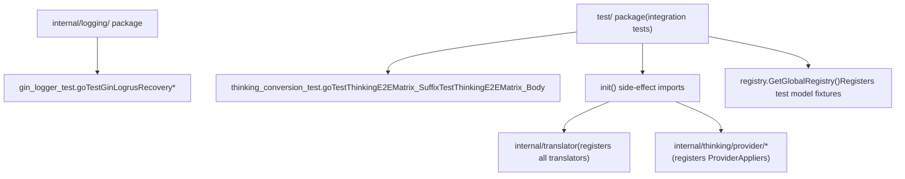
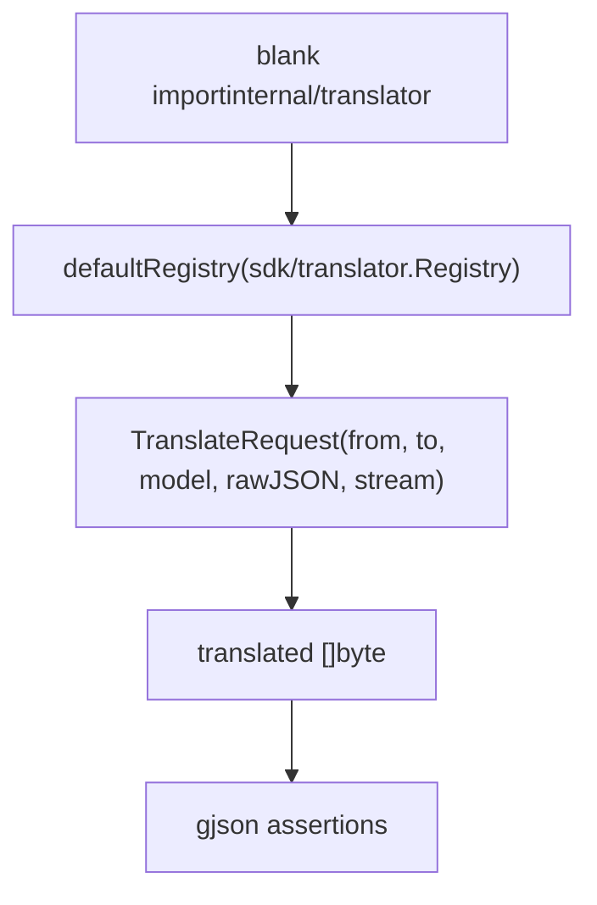
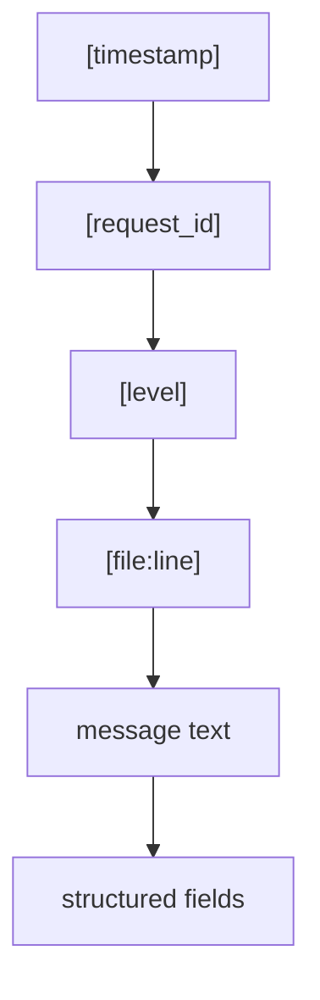
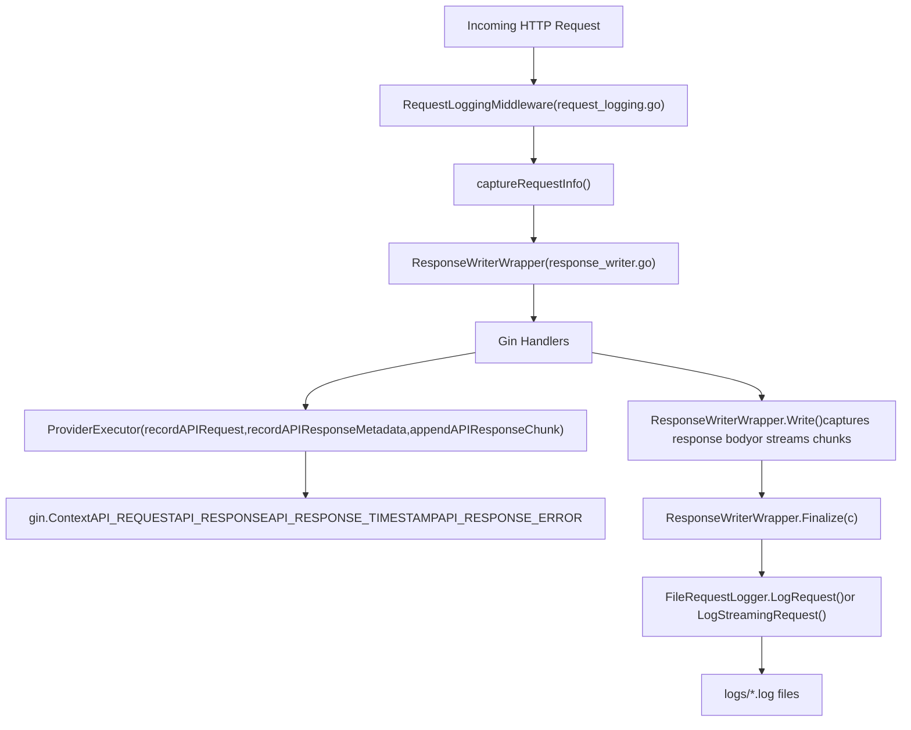
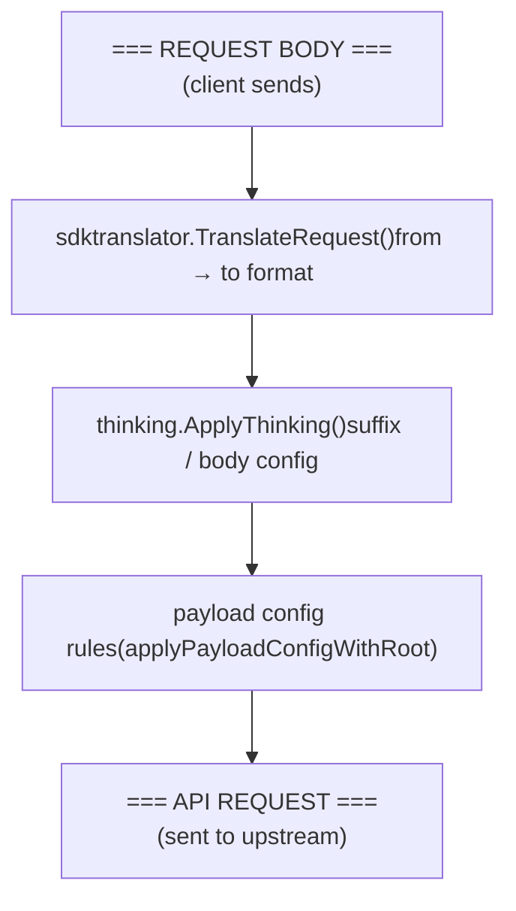

# Testing and Debugging

Relevant source files

-   [internal/api/middleware/request\_logging.go](https://github.com/router-for-me/CLIProxyAPI/blob/c66cb0af/internal/api/middleware/request_logging.go)
-   [internal/api/middleware/response\_writer.go](https://github.com/router-for-me/CLIProxyAPI/blob/c66cb0af/internal/api/middleware/response_writer.go)
-   [internal/logging/gin\_logger.go](https://github.com/router-for-me/CLIProxyAPI/blob/c66cb0af/internal/logging/gin_logger.go)
-   [internal/logging/gin\_logger\_test.go](https://github.com/router-for-me/CLIProxyAPI/blob/c66cb0af/internal/logging/gin_logger_test.go)
-   [internal/logging/global\_logger.go](https://github.com/router-for-me/CLIProxyAPI/blob/c66cb0af/internal/logging/global_logger.go)
-   [internal/logging/request\_logger.go](https://github.com/router-for-me/CLIProxyAPI/blob/c66cb0af/internal/logging/request_logger.go)
-   [internal/runtime/executor/logging\_helpers.go](https://github.com/router-for-me/CLIProxyAPI/blob/c66cb0af/internal/runtime/executor/logging_helpers.go)
-   [internal/thinking/apply.go](https://github.com/router-for-me/CLIProxyAPI/blob/c66cb0af/internal/thinking/apply.go)
-   [internal/thinking/types.go](https://github.com/router-for-me/CLIProxyAPI/blob/c66cb0af/internal/thinking/types.go)
-   [internal/thinking/validate.go](https://github.com/router-for-me/CLIProxyAPI/blob/c66cb0af/internal/thinking/validate.go)
-   [sdk/api/handlers/gemini/gemini-cli\_handlers.go](https://github.com/router-for-me/CLIProxyAPI/blob/c66cb0af/sdk/api/handlers/gemini/gemini-cli_handlers.go)
-   [sdk/translator/registry.go](https://github.com/router-for-me/CLIProxyAPI/blob/c66cb0af/sdk/translator/registry.go)
-   [test/thinking\_conversion\_test.go](https://github.com/router-for-me/CLIProxyAPI/blob/c66cb0af/test/thinking_conversion_test.go)

This page covers how to run the existing test suite, how to write tests for the translation and thinking subsystems, how to interpret application logs, and step-by-step workflows for diagnosing common problems.

For background on the thinking configuration system being tested, see [8.3](/router-for-me/CLIProxyAPI/8.3-thinking-and-reasoning-configuration). For how request/response logs are surfaced through the management API, see [8.4](/router-for-me/CLIProxyAPI/8.4-request-and-response-logging). For the translator architecture itself, see [9.4](/router-for-me/CLIProxyAPI/9.4-translation-system-deep-dive).

---

## Running the Test Suite

Tests are standard Go tests. From the repository root:

```
# Run all testsgo test ./... # Run only the thinking end-to-end matrixgo test ./test/ -run TestThinkingE2EMatrix_Suffix -v # Run only the gin logger testsgo test ./internal/logging/ -run TestGinLogrus -v # Run with race detector (recommended for auth/credential tests)go test -race ./...
```
The `test/` package contains integration-style tests that exercise the full translation + thinking pipeline without starting an HTTP server. Tests in `internal/` packages are unit tests that exercise individual components.

Sources: [test/thinking\_conversion\_test.go1-50](https://github.com/router-for-me/CLIProxyAPI/blob/c66cb0af/test/thinking_conversion_test.go#L1-L50) [internal/logging/gin\_logger\_test.go1-61](https://github.com/router-for-me/CLIProxyAPI/blob/c66cb0af/internal/logging/gin_logger_test.go#L1-L61)

---

## Test Suite Structure


Sources: [test/thinking\_conversion\_test.go1-26](https://github.com/router-for-me/CLIProxyAPI/blob/c66cb0af/test/thinking_conversion_test.go#L1-L26) [internal/logging/gin\_logger\_test.go1-10](https://github.com/router-for-me/CLIProxyAPI/blob/c66cb0af/internal/logging/gin_logger_test.go#L1-L10)

The `test/` package uses blank imports to trigger `init()` registration in two subsystems:

| Blank Import | Effect |
| --- | --- |
| `_ "github.com/router-for-me/CLIProxyAPI/v6/internal/translator"` | Registers all built-in request/response translators in the default `sdk/translator.Registry` |
| `_ ".../thinking/provider/gemini"` (and others) | Registers each provider's `ProviderApplier` in `thinking.providerAppliers` |

Without these imports, `TranslateRequest` and `ApplyThinking` silently pass through the original body.

Sources: [test/thinking\_conversion\_test.go9-26](https://github.com/router-for-me/CLIProxyAPI/blob/c66cb0af/test/thinking_conversion_test.go#L9-L26)

---

## Writing Tests for the Thinking System

### Test Case Structure

The `thinkingTestCase` struct in [test/thinking\_conversion\_test.go29-39](https://github.com/router-for-me/CLIProxyAPI/blob/c66cb0af/test/thinking_conversion_test.go#L29-L39) encodes a single translation + thinking scenario:

| Field | Meaning |
| --- | --- |
| `name` | Test identifier (shown in failure output) |
| `from` | Source API format (`openai`, `gemini`, `claude`, `openai-response`) |
| `to` | Target provider format (`gemini`, `claude`, `codex`, `openai`, `antigravity`) |
| `model` | Model name, may include thinking suffix e.g. `gemini-2.5-pro(8192)` |
| `inputJSON` | Raw request body in the `from` format |
| `expectField` | `gjson` path into the translated output to assert (empty = no-op pass) |
| `expectValue` | String form of the expected value at `expectField` |
| `includeThoughts` | Expected value of `includeThoughts`/`includeThoughtsInResponse` field |
| `expectErr` | Whether `ApplyThinking` should return a non-nil error |

### Data Flow in a Test Case

**Title: Thinking Test Data Flow**

> **[Mermaid sequence]**
> *(图表结构无法解析)*

Sources: [test/thinking\_conversion\_test.go44-50](https://github.com/router-for-me/CLIProxyAPI/blob/c66cb0af/test/thinking_conversion_test.go#L44-L50)

### Registering Test Models

Tests register synthetic model fixtures via `registry.GetGlobalRegistry().RegisterClient(uid, "test", getTestModels())`. The fixture models used in `TestThinkingE2EMatrix_Suffix` are:

| Fixture Model Name | Capability | Notes |
| --- | --- | --- |
| `level-model` | Levels: minimal/low/medium/high | ZeroAllowed=false, DynamicAllowed=false |
| `level-subset-model` | Levels: low/high only | ZeroAllowed=false |
| `gemini-budget-model` | Budget: Min=128, Max=20000 | DynamicAllowed=true |
| `gemini-mixed-model` | Budget + Levels: low/high | Min=128, Max=32768, DynamicAllowed=true |
| `claude-budget-model` | Budget: Min=1024, Max=128000 | ZeroAllowed=true |
| `antigravity-budget-model` | Budget: Min=128, Max=20000 | ZeroAllowed=true, DynamicAllowed=true |
| `no-thinking-model` | `Thinking=nil` | No thinking support |
| `user-defined-model` | `UserDefined=true`, `Thinking=nil` | Passthrough validation |

Use `defer reg.UnregisterClient(uid)` to clean up test registrations and avoid polluting the global registry across test runs.

Sources: [test/thinking\_conversion\_test.go44-49](https://github.com/router-for-me/CLIProxyAPI/blob/c66cb0af/test/thinking_conversion_test.go#L44-L49)

### Example: Adding a New Thinking Test Case

To add a test for a new provider or model capability, append a `thinkingTestCase` to the `cases` slice in the relevant test function:

```
{    name:        "my-case",    from:        "openai",    to:          "gemini",    model:       "gemini-budget-model(4096)",    inputJSON:   `{"model":"gemini-budget-model(4096)","messages":[{"role":"user","content":"hi"}]}`,    expectField: "generationConfig.thinkingConfig.thinkingBudget",    expectValue: "4096",    includeThoughts: "true",    expectErr:   false,},
```
The `expectField` value is a `gjson` path into the translated JSON body. The `expectValue` is compared as a string (e.g. integer `8192` should be `"8192"`).

Sources: [test/thinking\_conversion\_test.go51-120](https://github.com/router-for-me/CLIProxyAPI/blob/c66cb0af/test/thinking_conversion_test.go#L51-L120)

---

## Writing Tests for Translators

The translator registry (`sdk/translator.Registry`) can be exercised directly in unit tests without the HTTP stack.

**Title: Translator Registry Test Pattern**


Sources: [sdk/translator/registry.go43-53](https://github.com/router-for-me/CLIProxyAPI/blob/c66cb0af/sdk/translator/registry.go#L43-L53) [test/thinking\_conversion\_test.go9-10](https://github.com/router-for-me/CLIProxyAPI/blob/c66cb0af/test/thinking_conversion_test.go#L9-L10)

Key registry functions for tests:

| Function | Signature | Notes |
| --- | --- | --- |
| `TranslateRequest` | `(from, to Format, model string, rawJSON []byte, stream bool) []byte` | Returns original body if no translator registered |
| `TranslateNonStream` | `(ctx, from, to, model, origReq, req, rawJSON, param) string` | Response translation |
| `HasResponseTransformer` | `(from, to Format) bool` | Check before calling TranslateStream |

Sources: [sdk/translator/registry.go43-92](https://github.com/router-for-me/CLIProxyAPI/blob/c66cb0af/sdk/translator/registry.go#L43-L92)

---

## Debug Logging

### Log Format

All application logs use `logrus` with the custom `LogFormatter` defined in [internal/logging/global\_logger.go30-81](https://github.com/router-for-me/CLIProxyAPI/blob/c66cb0af/internal/logging/global_logger.go#L30-L81):

```
[2025-12-23 20:14:04] [a1b2c3d4] [debug] [apply.go:104] thinking: config from model suffix provider=gemini model=gemini-2.5-pro(8192) mode=budget budget=8192 level=
```
**Title: LogFormatter Fields Layout**


The structured fields appended to each log line are drawn from `logFieldOrder` [internal/logging/global\_logger.go33](https://github.com/router-for-me/CLIProxyAPI/blob/c66cb0af/internal/logging/global_logger.go#L33-L33):

| Field | Meaning |
| --- | --- |
| `provider` | Target provider name (gemini, claude, codex, etc.) |
| `model` | Model ID after suffix stripping |
| `mode` | `ThinkingMode` string (budget/level/none/auto) |
| `budget` | Numeric budget value |
| `level` | Level name (low/medium/high/etc.) |
| `original_mode` | Mode before auto-conversion |
| `original_value` | Value before clamping |
| `min` / `max` | Model's allowed range |
| `clamped_to` | Value after clamping |
| `error` | Error message if applicable |

Sources: [internal/logging/global\_logger.go33-81](https://github.com/router-for-me/CLIProxyAPI/blob/c66cb0af/internal/logging/global_logger.go#L33-L81)

### Enabling Debug Logs

The application uses `logrus` levels. To enable `DEBUG` output, set the log level before starting the server. In `config.yaml`, set `log_level: debug` (exact field name depends on config schema—see [5.1](/router-for-me/CLIProxyAPI/5.1-configuration-file-structure)).

At debug level, the thinking pipeline emits a trace log at each decision point:

| Log Message | Source | Trigger |
| --- | --- | --- |
| `thinking: unknown provider, passthrough` | `apply.go` | Provider not in `providerAppliers` map |
| `thinking: config from model suffix` | `apply.go` | Model name has `(suffix)` |
| `thinking: original config from request` | `apply.go` | Thinking config extracted from body |
| `thinking: no config found, passthrough` | `apply.go` | No suffix, no config in body |
| `thinking: validation failed` | `apply.go` | `ValidateConfig` returns error |
| `thinking: processed config to apply` | `apply.go` | Final config before calling `Apply` |
| `thinking: budget clamped` | `validate.go` | Budget out of model range |
| `thinking: level clamped` | `validate.go` | Level not in model's supported set |
| `thinking: mode converted, dynamic not allowed` | `validate.go` | `auto` converted to mid-range |
| `thinking: user-defined model, passthrough` | `apply.go` | `UserDefined=true` model |

Sources: [internal/thinking/apply.go88-201](https://github.com/router-for-me/CLIProxyAPI/blob/c66cb0af/internal/thinking/apply.go#L88-L201) [internal/thinking/validate.go168-248](https://github.com/router-for-me/CLIProxyAPI/blob/c66cb0af/internal/thinking/validate.go#L168-L248)

### Request ID Correlation

Gin middleware assigns a request ID to AI API paths. The `GinLogrusLogger` middleware [internal/logging/gin\_logger.go40-96](https://github.com/router-for-me/CLIProxyAPI/blob/c66cb0af/internal/logging/gin_logger.go#L40-L96) sets a `request_id` field on each request entering these path prefixes:

```
/v1/chat/completions
/v1/completions
/v1/messages
/v1/responses
/v1beta/models/
/api/provider/
```
The same `request_id` is propagated to `context.Context` via `logging.WithRequestID` and can be retrieved with `logging.GetRequestID(ctx)` in executor code [internal/runtime/executor/logging\_helpers.go382-391](https://github.com/router-for-me/CLIProxyAPI/blob/c66cb0af/internal/runtime/executor/logging_helpers.go#L382-L391)

Sources: [internal/logging/gin\_logger.go20-55](https://github.com/router-for-me/CLIProxyAPI/blob/c66cb0af/internal/logging/gin_logger.go#L20-L55) [internal/runtime/executor/logging\_helpers.go382-391](https://github.com/router-for-me/CLIProxyAPI/blob/c66cb0af/internal/runtime/executor/logging_helpers.go#L382-L391)

---

## Request/Response Logging

When `request_log: true` is set in `config.yaml`, full request/response details (including upstream API calls) are captured to files.

### Logging Pipeline

**Title: Request Logging Component Flow**


Sources: [internal/api/middleware/request\_logging.go24-68](https://github.com/router-for-me/CLIProxyAPI/blob/c66cb0af/internal/api/middleware/request_logging.go#L24-L68) [internal/api/middleware/response\_writer.go56-316](https://github.com/router-for-me/CLIProxyAPI/blob/c66cb0af/internal/api/middleware/response_writer.go#L56-L316) [internal/runtime/executor/logging\_helpers.go53-97](https://github.com/router-for-me/CLIProxyAPI/blob/c66cb0af/internal/runtime/executor/logging_helpers.go#L53-L97)

### Log File Format

Each log file produced by `FileRequestLogger` [internal/logging/request\_logger.go129-164](https://github.com/router-for-me/CLIProxyAPI/blob/c66cb0af/internal/logging/request_logger.go#L129-L164) contains sections in this order:

```
=== REQUEST INFO ===
Version: <build version>
URL: /v1/chat/completions
Method: POST
Timestamp: 2025-01-15T10:00:00Z

=== HEADERS ===
Authorization: Bearer sk-***REDACTED***
Content-Type: application/json

=== REQUEST BODY ===
{"model":"gpt-4o","messages":[...]}

=== API REQUEST 1 ===
Timestamp: ...
Upstream URL: https://api.openai.com/v1/chat/completions
HTTP Method: POST
Auth: provider=openai, auth_id=abc123, type=api_key value=sk-***
...

=== API RESPONSE 1 ===
Status: 200
...

=== RESPONSE ===
Status: 200
Content-Type: application/json
...
```
File names follow the pattern `<sanitized-path>-<timestamp>-<request-id>.log`, e.g. `v1-chat-completions-2025-01-15T100000-a1b2c3d4.log`.

Error-only logs (written when `request_log: false` but a request fails) are prefixed with `error-` and capped at `error_logs_max_files`.

Sources: [internal/logging/request\_logger.go358-411](https://github.com/router-for-me/CLIProxyAPI/blob/c66cb0af/internal/logging/request_logger.go#L358-L411) [internal/runtime/executor/logging\_helpers.go53-97](https://github.com/router-for-me/CLIProxyAPI/blob/c66cb0af/internal/runtime/executor/logging_helpers.go#L53-L97)

### Sensitive Value Masking

Headers and query parameters with sensitive names are masked via `util.MaskSensitiveHeaderValue` and `util.MaskSensitiveQuery`. API key values in upstream auth info are masked via `util.HideAPIKey`. These masks apply both in log files and in the structured `logrus` output.

Sources: [internal/logging/request\_logger.go580-586](https://github.com/router-for-me/CLIProxyAPI/blob/c66cb0af/internal/logging/request_logger.go#L580-L586) [internal/runtime/executor/logging\_helpers.go288-321](https://github.com/router-for-me/CLIProxyAPI/blob/c66cb0af/internal/runtime/executor/logging_helpers.go#L288-L321)

### Skipped Paths

`RequestLoggingMiddleware` does not log management API traffic. `shouldLogRequest()` [internal/api/middleware/request\_logging.go153-165](https://github.com/router-for-me/CLIProxyAPI/blob/c66cb0af/internal/api/middleware/request_logging.go#L153-L165) returns `false` for:

-   `/v0/management/**`
-   `/management/**`
-   `/api/**` (except `/api/provider/**`)

This prevents management payloads (which may contain raw auth tokens) from appearing in log files.

Sources: [internal/api/middleware/request\_logging.go153-165](https://github.com/router-for-me/CLIProxyAPI/blob/c66cb0af/internal/api/middleware/request_logging.go#L153-L165)

---

## Common Debugging Workflows

### Tracing Request Translation

To trace why a request body was or was not translated correctly:

1.  **Enable debug logging** to see the full translation and thinking pipeline.
2.  **Enable request logging** (`request_log: true`) to capture `=== API REQUEST ===` and `=== REQUEST BODY ===` sections in the log file.
3.  Check the `=== API REQUEST ===` section: the body shown there is the body sent to the upstream provider after translation and thinking application.
4.  Check `=== REQUEST BODY ===`: the raw body as received from the client.

**Title: Translation Debugging — Data Path and Checkpoints**


To reproduce a translation in isolation, write a test that calls `sdktranslator.TranslateRequest` followed by `thinking.ApplyThinking` with the same `from`, `to`, `model`, and input body, and inspect the output with `gjson`.

Sources: [test/thinking\_conversion\_test.go44-50](https://github.com/router-for-me/CLIProxyAPI/blob/c66cb0af/test/thinking_conversion_test.go#L44-L50) [internal/runtime/executor/logging\_helpers.go53-97](https://github.com/router-for-me/CLIProxyAPI/blob/c66cb0af/internal/runtime/executor/logging_helpers.go#L53-L97)

### Tracing Thinking Configuration

When a thinking configuration is not applied as expected:

1.  Set log level to `debug`.
2.  Observe the `thinking:` log lines in order. The sequence is:
    -   `thinking: config from model suffix` (if suffix present) — confirms suffix was parsed
    -   `thinking: original config from request` (if no suffix) — shows what was in the request body
    -   `thinking: validation failed` — includes model ID and error message
    -   `thinking: processed config to apply` — shows the final `mode`, `budget`, `level` before `Apply`
3.  If a budget is being clamped unexpectedly, look for `thinking: budget clamped` which reports `original_value`, `clamped_to`, `min`, `max`.
4.  If a level is being clamped, look for `thinking: level clamped` which reports `original_value` and `clamped_to`.

The `providerKey` parameter to `ApplyThinking` controls which model registry entry is used for capability lookup. If `providerKey` does not match the registered provider for a model, the model will be treated as user-defined.

Sources: [internal/thinking/apply.go88-201](https://github.com/router-for-me/CLIProxyAPI/blob/c66cb0af/internal/thinking/apply.go#L88-L201) [internal/thinking/validate.go208-248](https://github.com/router-for-me/CLIProxyAPI/blob/c66cb0af/internal/thinking/validate.go#L208-L248)

### Debugging Auth Issues

Auth selection and retry events are logged at `debug`/`info` level from the `auth.Manager`. Common log patterns to look for:

-   **Credential selection**: `Use API key sk-9...0RHO for model gpt-5.2` — shows which credential was selected and which model
-   **Cooldown applied**: logged when a credential is placed on cooldown after an error
-   **Quota exhausted**: logged when a credential is skipped due to quota state

With `request_log: true`, the `=== API REQUEST ===` section includes `Auth:` metadata showing `provider`, `auth_id`, `label`, `type`, and a masked `value`. This allows you to correlate which credential was used for each upstream attempt.

If retries occur, multiple `=== API REQUEST N ===` / `=== API RESPONSE N ===` pairs appear in the same log file, numbered sequentially. The `recordAPIRequest` helper [internal/runtime/executor/logging\_helpers.go53-97](https://github.com/router-for-me/CLIProxyAPI/blob/c66cb0af/internal/runtime/executor/logging_helpers.go#L53-L97) increments the attempt index each time a credential is selected.

Sources: [internal/runtime/executor/logging\_helpers.go53-97](https://github.com/router-for-me/CLIProxyAPI/blob/c66cb0af/internal/runtime/executor/logging_helpers.go#L53-L97) [internal/runtime/executor/logging\_helpers.go262-286](https://github.com/router-for-me/CLIProxyAPI/blob/c66cb0af/internal/runtime/executor/logging_helpers.go#L262-L286)

### Debugging Gin Panic Recovery

The `GinLogrusRecovery()` middleware [internal/logging/gin\_logger.go114-129](https://github.com/router-for-me/CLIProxyAPI/blob/c66cb0af/internal/logging/gin_logger.go#L114-L129) catches all panics except `http.ErrAbortHandler` (which is re-panicked to let `net/http` abort the connection cleanly). Panics produce an `error`\-level log containing:

```
recovered from panic  panic=<value>  stack=<goroutine stack trace>  path=/v1/chat/completions
```
The test `TestGinLogrusRecoveryRepanicsErrAbortHandler` [internal/logging/gin\_logger\_test.go12-42](https://github.com/router-for-me/CLIProxyAPI/blob/c66cb0af/internal/logging/gin_logger_test.go#L12-L42) verifies this re-panic behavior. `TestGinLogrusRecoveryHandlesRegularPanic` [internal/logging/gin\_logger\_test.go44-60](https://github.com/router-for-me/CLIProxyAPI/blob/c66cb0af/internal/logging/gin_logger_test.go#L44-L60) verifies that regular panics return HTTP 500 without propagating.

Sources: [internal/logging/gin\_logger.go114-129](https://github.com/router-for-me/CLIProxyAPI/blob/c66cb0af/internal/logging/gin_logger.go#L114-L129) [internal/logging/gin\_logger\_test.go12-60](https://github.com/router-for-me/CLIProxyAPI/blob/c66cb0af/internal/logging/gin_logger_test.go#L12-L60)

---

## Logging Configuration Reference

| Config Field | Type | Effect |
| --- | --- | --- |
| `logging_to_file` | bool | Redirect all `logrus` output from stdout to `logs/main.log` with lumberjack rotation |
| `logs_max_total_size_mb` | int | Background log directory cleaner removes oldest files beyond this total size |
| `request_log` | bool | Enable full request/response capture to per-request log files |
| `error_logs_max_files` | int | Maximum number of `error-*.log` files retained when `request_log: false` |
| `log_level` | string | `logrus` level: `debug`, `info`, `warn`, `error` |

`ConfigureLogOutput` [internal/logging/global\_logger.go148-183](https://github.com/router-for-me/CLIProxyAPI/blob/c66cb0af/internal/logging/global_logger.go#L148-L183) applies these settings. It is called during service startup and can be re-applied on hot reload.

Sources: [internal/logging/global\_logger.go148-183](https://github.com/router-for-me/CLIProxyAPI/blob/c66cb0af/internal/logging/global_logger.go#L148-L183)
