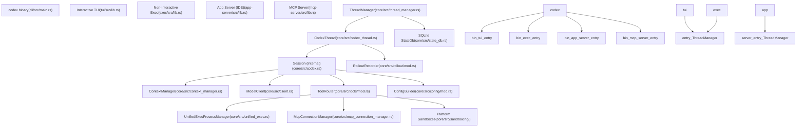
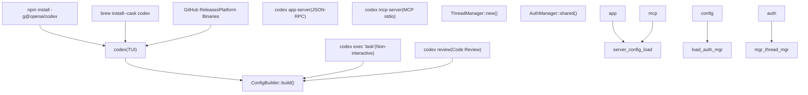
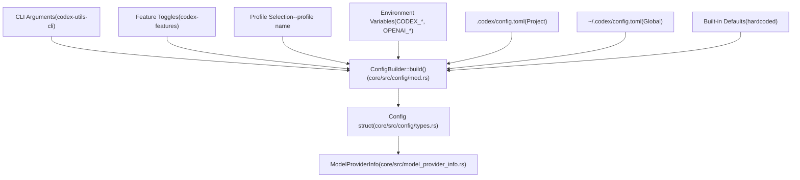

# Overview

Relevant source files

-   [AGENTS.md](https://github.com/openai/codex/blob/d807d44a/AGENTS.md?plain=1)
-   [README.md](https://github.com/openai/codex/blob/d807d44a/README.md?plain=1)
-   [codex-rs/Cargo.lock](https://github.com/openai/codex/blob/d807d44a/codex-rs/Cargo.lock)
-   [codex-rs/Cargo.toml](https://github.com/openai/codex/blob/d807d44a/codex-rs/Cargo.toml)
-   [codex-rs/README.md](https://github.com/openai/codex/blob/d807d44a/codex-rs/README.md?plain=1)
-   [codex-rs/cli/Cargo.toml](https://github.com/openai/codex/blob/d807d44a/codex-rs/cli/Cargo.toml)
-   [codex-rs/cli/src/lib.rs](https://github.com/openai/codex/blob/d807d44a/codex-rs/cli/src/lib.rs)
-   [codex-rs/cli/src/main.rs](https://github.com/openai/codex/blob/d807d44a/codex-rs/cli/src/main.rs)
-   [codex-rs/config.md](https://github.com/openai/codex/blob/d807d44a/codex-rs/config.md?plain=1)
-   [codex-rs/core/Cargo.toml](https://github.com/openai/codex/blob/d807d44a/codex-rs/core/Cargo.toml)
-   [codex-rs/core/src/flags.rs](https://github.com/openai/codex/blob/d807d44a/codex-rs/core/src/flags.rs)
-   [codex-rs/core/src/lib.rs](https://github.com/openai/codex/blob/d807d44a/codex-rs/core/src/lib.rs)
-   [codex-rs/core/src/model\_provider\_info.rs](https://github.com/openai/codex/blob/d807d44a/codex-rs/core/src/model_provider_info.rs)
-   [codex-rs/exec/Cargo.toml](https://github.com/openai/codex/blob/d807d44a/codex-rs/exec/Cargo.toml)
-   [codex-rs/exec/src/cli.rs](https://github.com/openai/codex/blob/d807d44a/codex-rs/exec/src/cli.rs)
-   [codex-rs/exec/src/lib.rs](https://github.com/openai/codex/blob/d807d44a/codex-rs/exec/src/lib.rs)
-   [codex-rs/tui/Cargo.toml](https://github.com/openai/codex/blob/d807d44a/codex-rs/tui/Cargo.toml)
-   [codex-rs/tui/src/cli.rs](https://github.com/openai/codex/blob/d807d44a/codex-rs/tui/src/cli.rs)
-   [codex-rs/tui/src/lib.rs](https://github.com/openai/codex/blob/d807d44a/codex-rs/tui/src/lib.rs)
-   [docs/authentication.md](https://github.com/openai/codex/blob/d807d44a/docs/authentication.md?plain=1)
-   [docs/contributing.md](https://github.com/openai/codex/blob/d807d44a/docs/contributing.md?plain=1)
-   [docs/exec.md](https://github.com/openai/codex/blob/d807d44a/docs/exec.md?plain=1)
-   [docs/getting-started.md](https://github.com/openai/codex/blob/d807d44a/docs/getting-started.md?plain=1)
-   [docs/install.md](https://github.com/openai/codex/blob/d807d44a/docs/install.md?plain=1)
-   [docs/license.md](https://github.com/openai/codex/blob/d807d44a/docs/license.md?plain=1)
-   [docs/open-source-fund.md](https://github.com/openai/codex/blob/d807d44a/docs/open-source-fund.md?plain=1)
-   [docs/sandbox.md](https://github.com/openai/codex/blob/d807d44a/docs/sandbox.md?plain=1)
-   [justfile](https://github.com/openai/codex/blob/d807d44a/justfile)

Codex CLI is an AI coding agent from OpenAI that runs locally on your computer. It provides an interactive terminal interface, non-interactive automation modes, and IDE integration capabilities for executing coding tasks with AI assistance. The system is implemented in Rust as a Cargo workspace and supports multiple execution modes, configurable sandboxing, tool extensibility via the Model Context Protocol (MCP), and multi-agent workflows.

For detailed information about installation procedures, see [Installation and Setup](/openai/codex/1.1-installation-and-setup). For configuration options, see [Configuration System](/openai/codex/2.2-configuration-system). For IDE integration details, see [App Server and IDE Integration](/openai/codex/4.5-app-server-and-ide-integration).

## Project Purpose and Architecture

Codex is designed as a zero-dependency native executable that coordinates AI model interactions, executes tools in sandboxed environments, and manages conversation state across multiple sessions. The codebase is organized as a Rust workspace with clear separation between core business logic, user interfaces, and integration points.

### High-Level System Architecture

**Sources:** [codex-rs/cli/src/main.rs56-153](https://github.com/openai/codex/blob/d807d44a/codex-rs/cli/src/main.rs#L56-L153) [codex-rs/core/src/lib.rs1-189](https://github.com/openai/codex/blob/d807d44a/codex-rs/core/src/lib.rs#L1-L189) [README.md1-60](https://github.com/openai/codex/blob/d807d44a/README.md?plain=1#L1-L60)

## Execution Modes

Codex supports four primary execution modes, each serving different use cases. All modes converge on the same core `ThreadManager` infrastructure but differ in how they present events and handle user interaction.

### Execution Mode Comparison

| Mode | Entry Point | Use Case | Session Persistence | User Interaction |
| --- | --- | --- | --- | --- |
| **TUI** | `codex` (default) | Interactive development | Yes (rollout files) | Full interactive UI |
| **Exec** | `codex exec` | Automation/CI | Yes (unless `--ephemeral`) | None (non-interactive) |
| **App Server** | `codex app-server` | IDE integration | Yes | JSON-RPC protocol |
| **MCP Server** | `codex mcp-server` | Tool delegation | Yes | MCP protocol (stdio) |

### Command Dispatch and Runtime Initialization

**Sources:** [codex-rs/cli/src/main.rs88-153](https://github.com/openai/codex/blob/d807d44a/codex-rs/cli/src/main.rs#L88-L153) [codex-rs/exec/src/lib.rs162-220](https://github.com/openai/codex/blob/d807d44a/codex-rs/exec/src/lib.rs#L162-L220) [codex-rs/tui/src/lib.rs7-61](https://github.com/openai/codex/blob/d807d44a/codex-rs/tui/src/lib.rs#L7-L61) [README.md13-46](https://github.com/openai/codex/blob/d807d44a/README.md?plain=1#L13-L46)

## Core Crate Organization

The Codex workspace is organized into focused crates with clear responsibilities. The core business logic resides in `codex-core`, while UI implementations and integration points are separate crates.

### Primary Crates

| Crate | Path | Purpose |
| --- | --- | --- |
| `codex-core` | `core/` | Core agent logic, session management, model client, tool orchestration |
| `codex-tui` | `tui/` | Interactive terminal UI built with Ratatui |
| `codex-exec` | `exec/` | Non-interactive headless CLI with JSONL output mode |
| `codex-cli` | `cli/` | Multitool dispatcher, subcommand routing, feature toggles |
| `codex-app-server` | `app-server/` | JSON-RPC server for VS Code, Cursor, and other IDE clients |
| `codex-app-server-protocol` | `app-server-protocol/` | Protocol definitions for app server communication |
| `codex-mcp-server` | `mcp-server/` | MCP server implementation exposing Codex as tools |
| `codex-protocol` | `protocol/` | Shared protocol types for events, config, tool specs |
| `codex-config` | `config/` | Configuration parsing, validation, layer merging |

**Sources:** [codex-rs/Cargo.toml1-77](https://github.com/openai/codex/blob/d807d44a/codex-rs/Cargo.toml#L1-L77) [codex-rs/core/Cargo.toml1-62](https://github.com/openai/codex/blob/d807d44a/codex-rs/core/Cargo.toml#L1-L62) [codex-rs/tui/Cargo.toml1-58](https://github.com/openai/codex/blob/d807d44a/codex-rs/tui/Cargo.toml#L1-L58)

## Core Architecture Components

The core engine implements a layered architecture where the `ThreadManager` manages thread lifecycles, `CodexThread` coordinates session execution, and internal `Session` structs handle turn-by-turn model interactions.

### Thread and Session Lifecycle

> **[Mermaid sequence]**
> *(图表结构无法解析)*

**Sources:** [codex-rs/core/src/lib.rs17-101](https://github.com/openai/codex/blob/d807d44a/codex-rs/core/src/lib.rs#L17-L101) [codex-rs/core/src/codex.rs1-50](https://github.com/openai/codex/blob/d807d44a/codex-rs/core/src/codex.rs#L1-L50) [codex-rs/core/src/client.rs169-176](https://github.com/openai/codex/blob/d807d44a/codex-rs/core/src/client.rs#L169-L176)

### Key Component Responsibilities

| Component | File | Primary Responsibilities |
| --- | --- | --- |
| `ThreadManager` | `core/src/thread_manager.rs` | Thread spawning/resuming, state database interaction, thread switching |
| `CodexThread` | `core/src/codex_thread.rs` | Submission queue, event emission, task management, rollout recording |
| `Session` (internal) | `core/src/codex.rs` | Turn orchestration, prompt building, model streaming, tool routing |
| `ContextManager` | `core/src/context_manager.rs` | Message history, token tracking, compaction triggers, cached prefixes |
| `ModelClient` | `core/src/client.rs` | HTTP/WebSocket transport, SSE parsing, retry logic, auth headers |
| `ToolRouter` | `core/src/tools/mod.rs` | Tool registration, approval checks, sandbox selection, execution |
| `RolloutRecorder` | `core/src/rollout/mod.rs` | Session persistence, event filtering, thread indexing |

**Sources:** [codex-rs/core/src/lib.rs1-189](https://github.com/openai/codex/blob/d807d44a/codex-rs/core/src/lib.rs#L1-L189) [codex-rs/core/src/model\_provider\_info.rs72-130](https://github.com/openai/codex/blob/d807d44a/codex-rs/core/src/model_provider_info.rs#L72-L130)

## Configuration System

Configuration is assembled from multiple layers with CLI arguments taking highest priority, followed by environment variables, project config, global config, and defaults.

**Sources:** [codex-rs/core/src/config/mod.rs](https://github.com/openai/codex/blob/d807d44a/codex-rs/core/src/config/mod.rs) [codex-rs/cli/src/main.rs72-83](https://github.com/openai/codex/blob/d807d44a/codex-rs/cli/src/main.rs#L72-L83) [codex-rs/exec/src/cli.rs10-115](https://github.com/openai/codex/blob/d807d44a/codex-rs/exec/src/cli.rs#L10-L115)

## Model Provider System

Codex supports multiple model providers through a unified `ModelProviderInfo` registry. Providers can be OpenAI (default), ChatGPT-authenticated, or custom OSS providers (LM Studio, Ollama) with OpenAI-compatible APIs.

### Provider Configuration

| Provider Type | Authentication | Base URL | Wire Protocol |
| --- | --- | --- | --- |
| OpenAI | API Key (`OPENAI_API_KEY`) | `https://api.openai.com/v1` | `responses` |
| ChatGPT | OAuth token (stored in auth.json) | `https://chatgpt.com/backend-api/codex` | `responses` |
| LM Studio | None (local) | `http://localhost:1234/v1` | `responses` |
| Ollama | None (local) | `http://localhost:11434/v1` | `responses` |

**Sources:** [codex-rs/core/src/model\_provider\_info.rs31-130](https://github.com/openai/codex/blob/d807d44a/codex-rs/core/src/model_provider_info.rs#L31-L130) [codex-rs/exec/src/lib.rs46-47](https://github.com/openai/codex/blob/d807d44a/codex-rs/exec/src/lib.rs#L46-L47)

## Session Persistence and Replay

Sessions are persisted as rollout files containing event streams that can be replayed to resume or fork conversations. The `RolloutRecorder` filters events based on persistence mode and writes them to timestamped files.

### Rollout File Structure

Rollout files are stored in `~/.codex/sessions/` organized by date. Each file is a `.jsonl.zst` archive containing session metadata and event items.

**Sources:** [codex-rs/core/src/lib.rs134-156](https://github.com/openai/codex/blob/d807d44a/codex-rs/core/src/lib.rs#L134-L156) [codex-rs/core/src/state\_db.rs129](https://github.com/openai/codex/blob/d807d44a/codex-rs/core/src/state_db.rs#L129-L129)
