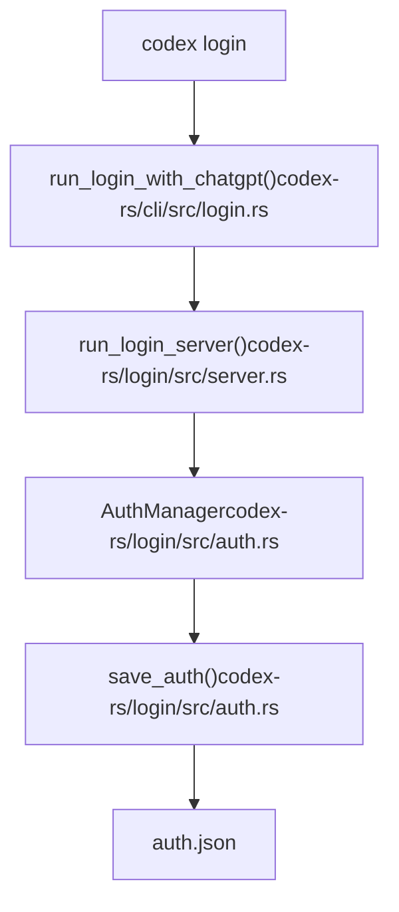
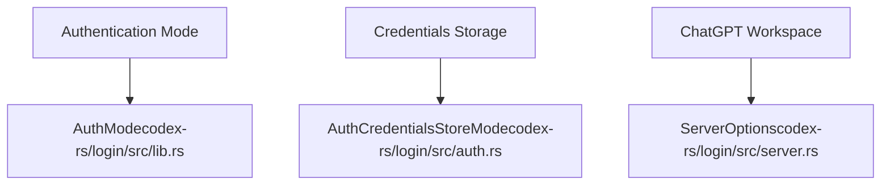

# Installation and Setup

Relevant source files

-   [AGENTS.md](https://github.com/openai/codex/blob/d807d44a/AGENTS.md?plain=1)
-   [README.md](https://github.com/openai/codex/blob/d807d44a/README.md?plain=1)
-   [codex-rs/cli/src/login.rs](https://github.com/openai/codex/blob/d807d44a/codex-rs/cli/src/login.rs)
-   [codex-rs/core/tests/suite/auth\_refresh.rs](https://github.com/openai/codex/blob/d807d44a/codex-rs/core/tests/suite/auth_refresh.rs)
-   [codex-rs/login/Cargo.toml](https://github.com/openai/codex/blob/d807d44a/codex-rs/login/Cargo.toml)
-   [codex-rs/login/src/lib.rs](https://github.com/openai/codex/blob/d807d44a/codex-rs/login/src/lib.rs)
-   [codex-rs/login/src/server.rs](https://github.com/openai/codex/blob/d807d44a/codex-rs/login/src/server.rs)
-   [codex-rs/login/src/token\_data.rs](https://github.com/openai/codex/blob/d807d44a/codex-rs/login/src/token_data.rs)
-   [codex-rs/login/tests/suite/login\_server\_e2e.rs](https://github.com/openai/codex/blob/d807d44a/codex-rs/login/tests/suite/login_server_e2e.rs)
-   [codex-rs/tui/src/ascii\_animation.rs](https://github.com/openai/codex/blob/d807d44a/codex-rs/tui/src/ascii_animation.rs)
-   [codex-rs/tui/src/chatwidget/snapshots/codex\_tui\_\_chatwidget\_\_tests\_\_rate\_limit\_switch\_prompt\_popup.snap](https://github.com/openai/codex/blob/d807d44a/codex-rs/tui/src/chatwidget/snapshots/codex_tui__chatwidget__tests__rate_limit_switch_prompt_popup.snap)
-   [codex-rs/tui/src/onboarding/auth.rs](https://github.com/openai/codex/blob/d807d44a/codex-rs/tui/src/onboarding/auth.rs)
-   [codex-rs/tui/src/onboarding/mod.rs](https://github.com/openai/codex/blob/d807d44a/codex-rs/tui/src/onboarding/mod.rs)
-   [codex-rs/tui/src/onboarding/onboarding\_screen.rs](https://github.com/openai/codex/blob/d807d44a/codex-rs/tui/src/onboarding/onboarding_screen.rs)
-   [codex-rs/tui/src/onboarding/trust\_directory.rs](https://github.com/openai/codex/blob/d807d44a/codex-rs/tui/src/onboarding/trust_directory.rs)
-   [codex-rs/tui/src/onboarding/welcome.rs](https://github.com/openai/codex/blob/d807d44a/codex-rs/tui/src/onboarding/welcome.rs)
-   [docs/authentication.md](https://github.com/openai/codex/blob/d807d44a/docs/authentication.md?plain=1)
-   [docs/contributing.md](https://github.com/openai/codex/blob/d807d44a/docs/contributing.md?plain=1)
-   [docs/exec.md](https://github.com/openai/codex/blob/d807d44a/docs/exec.md?plain=1)
-   [docs/getting-started.md](https://github.com/openai/codex/blob/d807d44a/docs/getting-started.md?plain=1)
-   [docs/install.md](https://github.com/openai/codex/blob/d807d44a/docs/install.md?plain=1)
-   [docs/license.md](https://github.com/openai/codex/blob/d807d44a/docs/license.md?plain=1)
-   [docs/open-source-fund.md](https://github.com/openai/codex/blob/d807d44a/docs/open-source-fund.md?plain=1)
-   [docs/sandbox.md](https://github.com/openai/codex/blob/d807d44a/docs/sandbox.md?plain=1)
-   [justfile](https://github.com/openai/codex/blob/d807d44a/justfile)

This page covers installing Codex CLI, authenticating, and performing initial configuration. Codex is distributed as a native binary through npm, Homebrew, or direct download. After installation, you must authenticate using either ChatGPT OAuth or an API key.

For building from source or development setup, see [Development Setup](/openai/codex/9.1-development-setup).

## System Requirements

**Supported Platforms:**

| Operating System | Architecture | Notes |
| --- | --- | --- |
| macOS 11+ | ARM64 (Apple Silicon), x86\_64 (Intel) | Code-signed and notarized |
| Linux | x86\_64, ARM64 | Statically-linked musl binaries [README.md39-41](https://github.com/openai/codex/blob/d807d44a/README.md?plain=1#L39-L41) |
| Windows 10+ | x86\_64, ARM64 | Signed with Azure Trusted Signing |

Codex binaries are self-contained native executables. The Linux builds use `musl` libc for maximum compatibility across distributions [README.md39-41](https://github.com/openai/codex/blob/d807d44a/README.md?plain=1#L39-L41)

Sources: [README.md32-44](https://github.com/openai/codex/blob/d807d44a/README.md?plain=1#L32-L44)

## Installation Methods

### npm (Recommended)

Install globally using npm (requires Node.js):

```
npm install -g @openai/codex
```
The `@openai/codex` package automatically selects the correct binary for your platform. After installation, the `codex` command is available in your PATH [README.md1-21](https://github.com/openai/codex/blob/d807d44a/README.md?plain=1#L1-L21)

Sources: [README.md19-22](https://github.com/openai/codex/blob/d807d44a/README.md?plain=1#L19-L22)

### Homebrew (macOS)

On macOS, install via Homebrew cask:

```
brew install --cask codex
```
The cask downloads the signed DMG and installs the binary [README.md25-27](https://github.com/openai/codex/blob/d807d44a/README.md?plain=1#L25-L27)

Sources: [README.md24-27](https://github.com/openai/codex/blob/d807d44a/README.md?plain=1#L24-L27)

### Direct Download

Download pre-compiled binaries from the [latest GitHub Release](https://github.com/openai/codex/blob/d807d44a/latest GitHub Release) [README.md31-32](https://github.com/openai/codex/blob/d807d44a/README.md?plain=1#L31-L32):

| Platform | Recommended File |
| --- | --- |
| macOS ARM64 | `codex-aarch64-apple-darwin.tar.gz` |
| macOS x86\_64 | `codex-x86_64-apple-darwin.tar.gz` |
| Linux x86\_64 | `codex-x86_64-unknown-linux-musl.tar.gz` |
| Linux ARM64 | `codex-aarch64-unknown-linux-musl.tar.gz` |

After extracting, rename the binary to `codex` and ensure it is in your PATH [README.md43](https://github.com/openai/codex/blob/d807d44a/README.md?plain=1#L43-L43)

Sources: [README.md32-45](https://github.com/openai/codex/blob/d807d44a/README.md?plain=1#L32-L45)

## Verifying Installation

After installation, verify Codex is available:

```
codex --versioncodex --help
```
The `codex` binary is a multitool that dispatches to different modes. The main entry point handles subcommands like `exec`, `mcp`, and `login` [justfile10-15](https://github.com/openai/codex/blob/d807d44a/justfile#L10-L15)

Sources: [justfile8-16](https://github.com/openai/codex/blob/d807d44a/justfile#L8-L16) [README.md29](https://github.com/openai/codex/blob/d807d44a/README.md?plain=1#L29-L29)

## Authentication

On first run, Codex prompts for authentication. Two primary methods are supported:

### Sign in with ChatGPT (Recommended)

Authenticates using your ChatGPT account (Plus, Pro, Team, Edu, or Enterprise) [README.md49](https://github.com/openai/codex/blob/d807d44a/README.md?plain=1#L49-L49):

```
codex login
```
This launches a local callback server to handle the OAuth flow [codex-rs/login/src/server.rs1-13](https://github.com/openai/codex/blob/d807d44a/codex-rs/login/src/server.rs#L1-L13)

**Authentication Flow (Code Entities):**


Sources: [codex-rs/cli/src/login.rs113-129](https://github.com/openai/codex/blob/d807d44a/codex-rs/cli/src/login.rs#L113-L129) [codex-rs/login/src/server.rs127-151](https://github.com/openai/codex/blob/d807d44a/codex-rs/login/src/server.rs#L127-L151) [codex-rs/login/src/auth.rs1-35](https://github.com/openai/codex/blob/d807d44a/codex-rs/login/src/auth.rs#L1-L35)

### Sign in with API Key

For OpenAI API key authentication [README.md51](https://github.com/openai/codex/blob/d807d44a/README.md?plain=1#L51-L51):

```
codex login --with-api-key
```
This method uses the `login_with_api_key` function to validate and store the key [codex-rs/cli/src/login.rs161-188](https://github.com/openai/codex/blob/d807d44a/codex-rs/cli/src/login.rs#L161-L188) It can also read from the `OPENAI_API_KEY` environment variable [codex-rs/login/src/auth.rs25](https://github.com/openai/codex/blob/d807d44a/codex-rs/login/src/auth.rs#L25-L25)

Sources: [codex-rs/cli/src/login.rs161-188](https://github.com/openai/codex/blob/d807d44a/codex-rs/cli/src/login.rs#L161-L188) [codex-rs/login/src/auth.rs23-34](https://github.com/openai/codex/blob/d807d44a/codex-rs/login/src/auth.rs#L23-L34)

## Initial Configuration

Codex configuration is managed via a `config.toml` file. The system uses a layered approach to resolve settings.

### Configuration Resolution

Settings are resolved through the following hierarchy:

1.  CLI overrides (e.g., `codex --model gpt-4`)
2.  Environment variables (e.g., `OPENAI_API_KEY`) [codex-rs/login/src/auth.rs23-26](https://github.com/openai/codex/blob/d807d44a/codex-rs/login/src/auth.rs#L23-L26)
3.  `config.toml` in the current directory or `~/.codex/`
4.  System defaults

### Common Configuration Options

The `AuthManager` and `Config` structs define the core operational parameters [codex-rs/login/src/auth.rs21](https://github.com/openai/codex/blob/d807d44a/codex-rs/login/src/auth.rs#L21-L21)

**Configuration Space to Code Mapping:**


Sources: [codex-rs/login/src/lib.rs18-37](https://github.com/openai/codex/blob/d807d44a/codex-rs/login/src/lib.rs#L18-L37) [codex-rs/login/src/server.rs54-84](https://github.com/openai/codex/blob/d807d44a/codex-rs/login/src/server.rs#L54-L84) [codex-rs/login/src/auth.rs18-21](https://github.com/openai/codex/blob/d807d44a/codex-rs/login/src/auth.rs#L18-L21)

## TUI Onboarding

For interactive users, Codex provides an onboarding screen that guides through authentication and directory trust [codex-rs/tui/src/onboarding/onboarding\_screen.rs56-61](https://github.com/openai/codex/blob/d807d44a/codex-rs/tui/src/onboarding/onboarding_screen.rs#L56-L61)

The `OnboardingScreen` manages several steps:

1.  **Welcome**: Displays an ASCII animation [codex-rs/tui/src/onboarding/welcome.rs26-31](https://github.com/openai/codex/blob/d807d44a/codex-rs/tui/src/onboarding/welcome.rs#L26-L31)
2.  **Auth**: The `AuthModeWidget` allows picking between ChatGPT and API Key login [codex-rs/tui/src/onboarding/auth.rs196-208](https://github.com/openai/codex/blob/d807d44a/codex-rs/tui/src/onboarding/auth.rs#L196-L208)
3.  **Trust**: Users must explicitly trust directories for tool execution [codex-rs/tui/src/onboarding/onboarding\_screen.rs121-131](https://github.com/openai/codex/blob/d807d44a/codex-rs/tui/src/onboarding/onboarding_screen.rs#L121-L131)

Sources: [codex-rs/tui/src/onboarding/onboarding\_screen.rs34-38](https://github.com/openai/codex/blob/d807d44a/codex-rs/tui/src/onboarding/onboarding_screen.rs#L34-L38) [codex-rs/tui/src/onboarding/auth.rs86-94](https://github.com/openai/codex/blob/d807d44a/codex-rs/tui/src/onboarding/auth.rs#L86-L94) [codex-rs/tui/src/onboarding/welcome.rs48-60](https://github.com/openai/codex/blob/d807d44a/codex-rs/tui/src/onboarding/welcome.rs#L48-L60)

---

**Key Installation Takeaways:**

1.  **Global Install**: Use `npm install -g @openai/codex` for the easiest setup [README.md21](https://github.com/openai/codex/blob/d807d44a/README.md?plain=1#L21-L21)
2.  **ChatGPT Login**: Use `codex login` to use your existing subscription [README.md49](https://github.com/openai/codex/blob/d807d44a/README.md?plain=1#L49-L49)
3.  **Remote/Headless**: Use `codex login --device-auth` if a browser is not available [codex-rs/cli/src/login.rs107-111](https://github.com/openai/codex/blob/d807d44a/codex-rs/cli/src/login.rs#L107-L111)
4.  **Development**: Use `just install` to fetch dependencies and verify the Rust toolchain [justfile36-39](https://github.com/openai/codex/blob/d807d44a/justfile#L36-L39)
