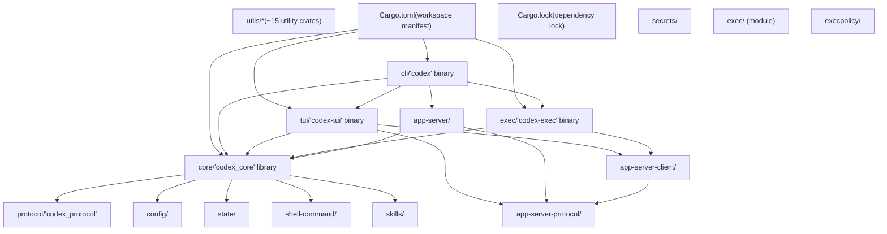
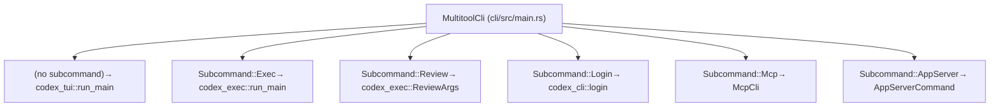
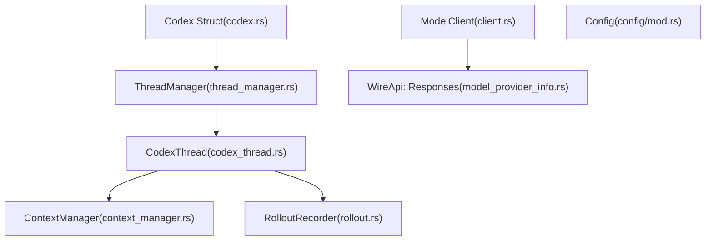

# Repository Structure

Relevant source files

-   [.bazelrc](https://github.com/openai/codex/blob/d807d44a/.bazelrc)
-   [.github/workflows/Dockerfile.bazel](https://github.com/openai/codex/blob/d807d44a/.github/workflows/Dockerfile.bazel)
-   [.github/workflows/ci.bazelrc](https://github.com/openai/codex/blob/d807d44a/.github/workflows/ci.bazelrc)
-   [.gitignore](https://github.com/openai/codex/blob/d807d44a/.gitignore)
-   [BUILD.bazel](https://github.com/openai/codex/blob/d807d44a/BUILD.bazel)
-   [MODULE.bazel](https://github.com/openai/codex/blob/d807d44a/MODULE.bazel)
-   [MODULE.bazel.lock](https://github.com/openai/codex/blob/d807d44a/MODULE.bazel.lock)
-   [codex-rs/Cargo.lock](https://github.com/openai/codex/blob/d807d44a/codex-rs/Cargo.lock)
-   [codex-rs/Cargo.toml](https://github.com/openai/codex/blob/d807d44a/codex-rs/Cargo.toml)
-   [codex-rs/README.md](https://github.com/openai/codex/blob/d807d44a/codex-rs/README.md?plain=1)
-   [codex-rs/ansi-escape/BUILD.bazel](https://github.com/openai/codex/blob/d807d44a/codex-rs/ansi-escape/BUILD.bazel)
-   [codex-rs/app-server-protocol/BUILD.bazel](https://github.com/openai/codex/blob/d807d44a/codex-rs/app-server-protocol/BUILD.bazel)
-   [codex-rs/app-server/BUILD.bazel](https://github.com/openai/codex/blob/d807d44a/codex-rs/app-server/BUILD.bazel)
-   [codex-rs/cli/Cargo.toml](https://github.com/openai/codex/blob/d807d44a/codex-rs/cli/Cargo.toml)
-   [codex-rs/cli/src/lib.rs](https://github.com/openai/codex/blob/d807d44a/codex-rs/cli/src/lib.rs)
-   [codex-rs/cli/src/main.rs](https://github.com/openai/codex/blob/d807d44a/codex-rs/cli/src/main.rs)
-   [codex-rs/config.md](https://github.com/openai/codex/blob/d807d44a/codex-rs/config.md?plain=1)
-   [codex-rs/core/BUILD.bazel](https://github.com/openai/codex/blob/d807d44a/codex-rs/core/BUILD.bazel)
-   [codex-rs/core/Cargo.toml](https://github.com/openai/codex/blob/d807d44a/codex-rs/core/Cargo.toml)
-   [codex-rs/core/src/flags.rs](https://github.com/openai/codex/blob/d807d44a/codex-rs/core/src/flags.rs)
-   [codex-rs/core/src/lib.rs](https://github.com/openai/codex/blob/d807d44a/codex-rs/core/src/lib.rs)
-   [codex-rs/core/src/model\_provider\_info.rs](https://github.com/openai/codex/blob/d807d44a/codex-rs/core/src/model_provider_info.rs)
-   [codex-rs/default.nix](https://github.com/openai/codex/blob/d807d44a/codex-rs/default.nix)
-   [codex-rs/deny.toml](https://github.com/openai/codex/blob/d807d44a/codex-rs/deny.toml)
-   [codex-rs/exec/Cargo.toml](https://github.com/openai/codex/blob/d807d44a/codex-rs/exec/Cargo.toml)
-   [codex-rs/exec/src/cli.rs](https://github.com/openai/codex/blob/d807d44a/codex-rs/exec/src/cli.rs)
-   [codex-rs/exec/src/lib.rs](https://github.com/openai/codex/blob/d807d44a/codex-rs/exec/src/lib.rs)
-   [codex-rs/mcp-server/BUILD.bazel](https://github.com/openai/codex/blob/d807d44a/codex-rs/mcp-server/BUILD.bazel)
-   [codex-rs/tui/Cargo.toml](https://github.com/openai/codex/blob/d807d44a/codex-rs/tui/Cargo.toml)
-   [codex-rs/tui/src/cli.rs](https://github.com/openai/codex/blob/d807d44a/codex-rs/tui/src/cli.rs)
-   [codex-rs/tui/src/lib.rs](https://github.com/openai/codex/blob/d807d44a/codex-rs/tui/src/lib.rs)
-   [codex-rs/utils/cargo-bin/BUILD.bazel](https://github.com/openai/codex/blob/d807d44a/codex-rs/utils/cargo-bin/BUILD.bazel)
-   [defs.bzl](https://github.com/openai/codex/blob/d807d44a/defs.bzl)
-   [flake.lock](https://github.com/openai/codex/blob/d807d44a/flake.lock)
-   [flake.nix](https://github.com/openai/codex/blob/d807d44a/flake.nix)
-   [patches/BUILD.bazel](https://github.com/openai/codex/blob/d807d44a/patches/BUILD.bazel)
-   [patches/v8\_bazel\_rules.patch](https://github.com/openai/codex/blob/d807d44a/patches/v8_bazel_rules.patch)
-   [rbe.bzl](https://github.com/openai/codex/blob/d807d44a/rbe.bzl)
-   [third\_party/v8/BUILD.bazel](https://github.com/openai/codex/blob/d807d44a/third_party/v8/BUILD.bazel)
-   [third\_party/v8/README.md](https://github.com/openai/codex/blob/d807d44a/third_party/v8/README.md?plain=1)

This page documents the Cargo workspace organization, key crates, and dependency relationships in the `codex-rs` repository. For architectural patterns and execution modes, see [1.3 Architecture Overview](https://github.com/openai/codex/blob/d807d44a/1.3 Architecture Overview)

## Scope and Organization

The `codex-rs` repository is organized as a Cargo workspace containing approximately 70 crates. The workspace uses a monorepo structure where all crates share common tooling, dependencies, and build configuration through the root `Cargo.toml` manifest.

**Sources:** [codex-rs/Cargo.toml1-77](https://github.com/openai/codex/blob/d807d44a/codex-rs/Cargo.toml#L1-L77) [codex-rs/README.md93-102](https://github.com/openai/codex/blob/d807d44a/codex-rs/README.md?plain=1#L93-L102)

---

## Workspace Structure

The workspace is defined in [codex-rs/Cargo.toml1-77](https://github.com/openai/codex/blob/d807d44a/codex-rs/Cargo.toml#L1-L77) with a `[workspace]` section listing all member crates. The workspace enforces shared configuration through `[workspace.package]`, `[workspace.dependencies]`, and `[workspace.lints]` sections.

### Workspace Component Map

**Sources:** [codex-rs/Cargo.toml1-164](https://github.com/openai/codex/blob/d807d44a/codex-rs/Cargo.toml#L1-L164) [codex-rs/README.md93-102](https://github.com/openai/codex/blob/d807d44a/codex-rs/README.md?plain=1#L93-L102)

---

## Entry Point Crates

### CLI Multitool (`cli/`)

The `codex` binary serves as the unified entry point, routing to different execution modes via subcommands. The `MultitoolCli` struct in [codex-rs/cli/src/main.rs71-86](https://github.com/openai/codex/blob/d807d44a/codex-rs/cli/src/main.rs#L71-L86) defines the command structure.

| Binary Name | Crate | Primary Function |
| --- | --- | --- |
| `codex` | `codex-cli` | Multitool dispatcher with subcommand routing |
| `codex-tui` | `codex-tui` | Interactive terminal UI (launched via `codex` or `codex-tui`) |
| `codex-exec` | `codex-exec` | Non-interactive/headless execution |

**Subcommand Dispatching:** The CLI dispatches to subcommands defined in [codex-rs/cli/src/main.rs88-153](https://github.com/openai/codex/blob/d807d44a/codex-rs/cli/src/main.rs#L88-L153):

**Sources:** [codex-rs/cli/src/main.rs71-153](https://github.com/openai/codex/blob/d807d44a/codex-rs/cli/src/main.rs#L71-L153) [codex-rs/README.md93-100](https://github.com/openai/codex/blob/d807d44a/codex-rs/README.md?plain=1#L93-L100)

### Interactive TUI (`tui/`)

The `codex-tui` crate provides a fullscreen terminal interface built with [Ratatui](https://ratatui.rs/).

-   **Binary:** `codex-tui` ([codex-rs/tui/Cargo.toml7-9](https://github.com/openai/codex/blob/d807d44a/codex-rs/tui/Cargo.toml#L7-L9))
-   **Main Entry:** `run_main` is the entry point for the TUI application [codex-rs/tui/src/lib.rs230-530](https://github.com/openai/codex/blob/d807d44a/codex-rs/tui/src/lib.rs#L230-L530)
-   **App Lifecycle:** The `App` struct in [codex-rs/tui/src/lib.rs7](https://github.com/openai/codex/blob/d807d44a/codex-rs/tui/src/lib.rs#L7-L7) manages the UI state and event loop.
-   **Client Integration:** It uses `InProcessAppServerClient` [codex-rs/tui/src/lib.rs32](https://github.com/openai/codex/blob/d807d44a/codex-rs/tui/src/lib.rs#L32-L32) to communicate with the core logic.

**Sources:** [codex-rs/tui/src/lib.rs1-64](https://github.com/openai/codex/blob/d807d44a/codex-rs/tui/src/lib.rs#L1-L64) [codex-rs/tui/Cargo.toml1-13](https://github.com/openai/codex/blob/d807d44a/codex-rs/tui/Cargo.toml#L1-L13)

### Headless Execution (`exec/`)

The `codex-exec` binary enables non-interactive operation with output to stdout/stderr or JSONL.

-   **Binary:** `codex-exec` ([codex-rs/exec/Cargo.toml7-9](https://github.com/openai/codex/blob/d807d44a/codex-rs/exec/Cargo.toml#L7-L9))
-   **Core Entry:** `run_main` in [codex-rs/exec/src/lib.rs162-205](https://github.com/openai/codex/blob/d807d44a/codex-rs/exec/src/lib.rs#L162-L205) initializes the execution environment.
-   **Output Modes:**
    -   `EventProcessorWithHumanOutput` for terminal display [codex-rs/exec/src/lib.rs78](https://github.com/openai/codex/blob/d807d44a/codex-rs/exec/src/lib.rs#L78-L78)
    -   `EventProcessorWithJsonOutput` for JSONL output [codex-rs/exec/src/lib.rs79](https://github.com/openai/codex/blob/d807d44a/codex-rs/exec/src/lib.rs#L79-L79)

**Sources:** [codex-rs/exec/src/lib.rs1-118](https://github.com/openai/codex/blob/d807d44a/codex-rs/exec/src/lib.rs#L1-L118) [codex-rs/exec/src/cli.rs10-115](https://github.com/openai/codex/blob/d807d44a/codex-rs/exec/src/cli.rs#L10-L115)

---

## Core Engine (`core/`)

The `codex-core` crate contains the business logic for sessions, model interactions, and tool orchestration.

### Key Modules and Exports

The root module [codex-rs/core/src/lib.rs1-189](https://github.com/openai/codex/blob/d807d44a/codex-rs/core/src/lib.rs#L1-L189) re-exports primary types:

| Export | Source Module | Purpose |
| --- | --- | --- |
| `Codex` | [core/src/lib.rs17](https://github.com/openai/codex/blob/d807d44a/core/src/lib.rs#L17-L17) | Main session controller |
| `CodexThread` | [core/src/lib.rs23](https://github.com/openai/codex/blob/d807d44a/core/src/lib.rs#L23-L23) | Manages a single conversation thread |
| `ThreadManager` | [core/src/lib.rs101](https://github.com/openai/codex/blob/d807d44a/core/src/lib.rs#L101-L101) | Orchestrates multiple threads/agents |
| `ModelClient` | [core/src/lib.rs169](https://github.com/openai/codex/blob/d807d44a/core/src/lib.rs#L169-L169) | Handles LLM API communication |
| `RolloutRecorder` | [core/src/lib.rs136](https://github.com/openai/codex/blob/d807d44a/core/src/lib.rs#L136-L136) | Handles session persistence to disk |
| `ModelProviderInfo` | [core/src/lib.rs86](https://github.com/openai/codex/blob/d807d44a/core/src/lib.rs#L86-L86) | Configuration for model endpoints |

**Sources:** [codex-rs/core/src/lib.rs1-189](https://github.com/openai/codex/blob/d807d44a/codex-rs/core/src/lib.rs#L1-L189) [codex-rs/core/src/model\_provider\_info.rs72-130](https://github.com/openai/codex/blob/d807d44a/codex-rs/core/src/model_provider_info.rs#L72-L130)

---

## Utility Crates

The workspace includes approximately 15 utility crates under `utils/*`, providing specialized functionality:

| Crate | Purpose | Key Entity |
| --- | --- | --- |
| `codex-utils-absolute-path` | Safe path handling | `AbsolutePathBuf` [codex-rs/Cargo.toml144](https://github.com/openai/codex/blob/d807d44a/codex-rs/Cargo.toml#L144-L144) |
| `codex-utils-pty` | Pseudo-terminal management | `Pty` [codex-rs/Cargo.toml155](https://github.com/openai/codex/blob/d807d44a/codex-rs/Cargo.toml#L155-L155) |
| `codex-utils-image` | Image processing for vision | `Image` [codex-rs/Cargo.toml152](https://github.com/openai/codex/blob/d807d44a/codex-rs/Cargo.toml#L152-L152) |
| `codex-utils-home-dir` | Cross-platform home detection | `HomeDir` [codex-rs/Cargo.toml156](https://github.com/openai/codex/blob/d807d44a/codex-rs/Cargo.toml#L156-L156) |
| `codex-utils-stream-parser` | SSE and stream processing | `StreamParser` [codex-rs/Cargo.toml160](https://github.com/openai/codex/blob/d807d44a/codex-rs/Cargo.toml#L160-L160) |

**Sources:** [codex-rs/Cargo.toml144-161](https://github.com/openai/codex/blob/d807d44a/codex-rs/Cargo.toml#L144-L161)

---

## Dependency and Build Configuration

### Shared Dependencies

Common dependencies are pinned in the workspace root [codex-rs/Cargo.toml89-314](https://github.com/openai/codex/blob/d807d44a/codex-rs/Cargo.toml#L89-L314) Significant dependencies include:

-   `ratatui`: For TUI rendering [codex-rs/tui/Cargo.toml71](https://github.com/openai/codex/blob/d807d44a/codex-rs/tui/Cargo.toml#L71-L71)
-   `tokio`: Async runtime [codex-rs/core/Cargo.toml102](https://github.com/openai/codex/blob/d807d44a/codex-rs/core/Cargo.toml#L102-L102)
-   `clap`: CLI argument parsing [codex-rs/cli/src/main.rs3](https://github.com/openai/codex/blob/d807d44a/codex-rs/cli/src/main.rs#L3-L3)

### Platform-Specific Targets

The codebase uses conditional compilation for different OS targets:

-   **Linux:** Includes `landlock` for sandboxing [codex-rs/core/Cargo.toml121](https://github.com/openai/codex/blob/d807d44a/codex-rs/core/Cargo.toml#L121-L121)
-   **Windows:** Uses `windows-sys` for console and COM interaction [codex-rs/core/Cargo.toml136-140](https://github.com/openai/codex/blob/d807d44a/codex-rs/core/Cargo.toml#L136-L140)
-   **macOS:** Uses `core-foundation` [codex-rs/core/Cargo.toml125](https://github.com/openai/codex/blob/d807d44a/codex-rs/core/Cargo.toml#L125-L125)

**Sources:** [codex-rs/Cargo.toml89-164](https://github.com/openai/codex/blob/d807d44a/codex-rs/Cargo.toml#L89-L164) [codex-rs/core/Cargo.toml120-144](https://github.com/openai/codex/blob/d807d44a/codex-rs/core/Cargo.toml#L120-L144)
