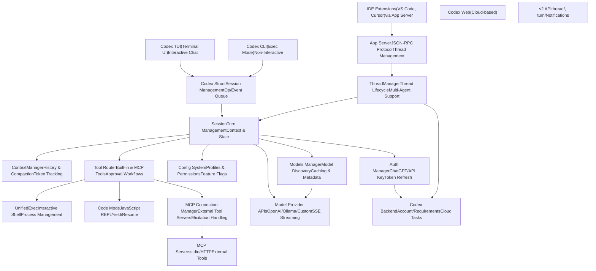
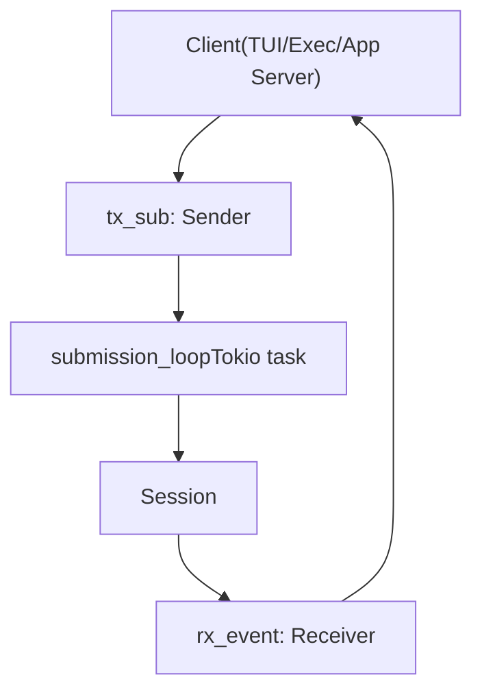
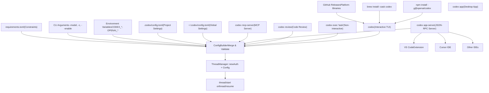
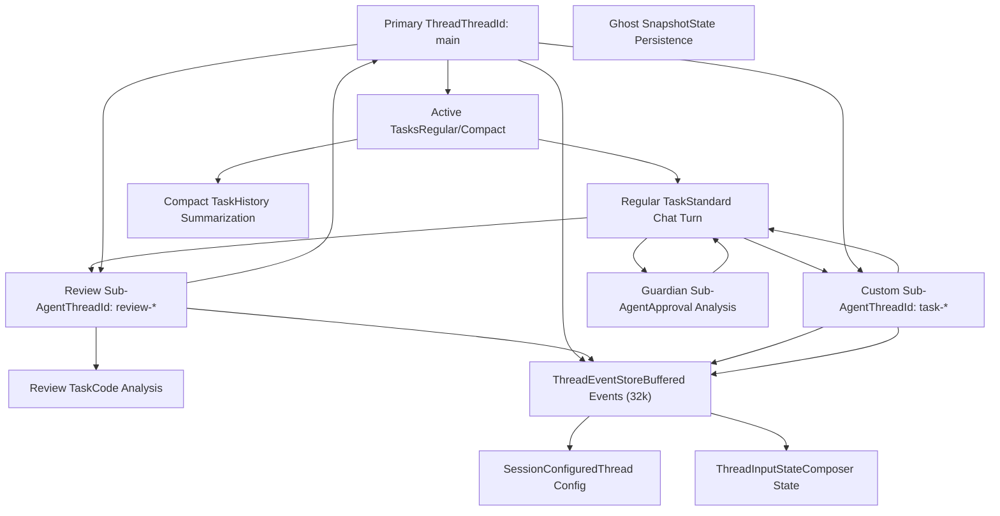
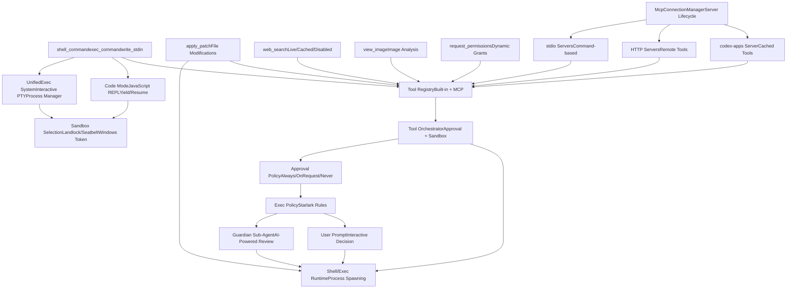
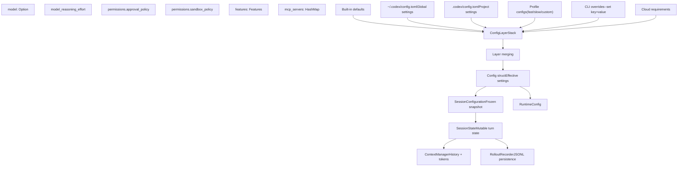
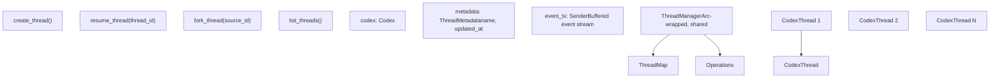

# Architecture Overview

Relevant source files

-   [codex-rs/Cargo.lock](https://github.com/openai/codex/blob/d807d44a/codex-rs/Cargo.lock)
-   [codex-rs/Cargo.toml](https://github.com/openai/codex/blob/d807d44a/codex-rs/Cargo.toml)
-   [codex-rs/README.md](https://github.com/openai/codex/blob/d807d44a/codex-rs/README.md?plain=1)
-   [codex-rs/app-server-protocol/schema/json/ClientRequest.json](https://github.com/openai/codex/blob/d807d44a/codex-rs/app-server-protocol/schema/json/ClientRequest.json)
-   [codex-rs/app-server-protocol/schema/json/ServerNotification.json](https://github.com/openai/codex/blob/d807d44a/codex-rs/app-server-protocol/schema/json/ServerNotification.json)
-   [codex-rs/app-server-protocol/schema/json/codex\_app\_server\_protocol.schemas.json](https://github.com/openai/codex/blob/d807d44a/codex-rs/app-server-protocol/schema/json/codex_app_server_protocol.schemas.json)
-   [codex-rs/app-server-protocol/schema/json/codex\_app\_server\_protocol.v2.schemas.json](https://github.com/openai/codex/blob/d807d44a/codex-rs/app-server-protocol/schema/json/codex_app_server_protocol.v2.schemas.json)
-   [codex-rs/app-server-protocol/schema/typescript/ServerNotification.ts](https://github.com/openai/codex/blob/d807d44a/codex-rs/app-server-protocol/schema/typescript/ServerNotification.ts)
-   [codex-rs/app-server-protocol/schema/typescript/v2/index.ts](https://github.com/openai/codex/blob/d807d44a/codex-rs/app-server-protocol/schema/typescript/v2/index.ts)
-   [codex-rs/app-server-protocol/src/protocol/common.rs](https://github.com/openai/codex/blob/d807d44a/codex-rs/app-server-protocol/src/protocol/common.rs)
-   [codex-rs/app-server-protocol/src/protocol/v2.rs](https://github.com/openai/codex/blob/d807d44a/codex-rs/app-server-protocol/src/protocol/v2.rs)
-   [codex-rs/app-server/README.md](https://github.com/openai/codex/blob/d807d44a/codex-rs/app-server/README.md?plain=1)
-   [codex-rs/app-server/src/bespoke\_event\_handling.rs](https://github.com/openai/codex/blob/d807d44a/codex-rs/app-server/src/bespoke_event_handling.rs)
-   [codex-rs/app-server/src/codex\_message\_processor.rs](https://github.com/openai/codex/blob/d807d44a/codex-rs/app-server/src/codex_message_processor.rs)
-   [codex-rs/app-server/tests/common/mcp\_process.rs](https://github.com/openai/codex/blob/d807d44a/codex-rs/app-server/tests/common/mcp_process.rs)
-   [codex-rs/app-server/tests/suite/v2/mod.rs](https://github.com/openai/codex/blob/d807d44a/codex-rs/app-server/tests/suite/v2/mod.rs)
-   [codex-rs/cli/Cargo.toml](https://github.com/openai/codex/blob/d807d44a/codex-rs/cli/Cargo.toml)
-   [codex-rs/cli/src/lib.rs](https://github.com/openai/codex/blob/d807d44a/codex-rs/cli/src/lib.rs)
-   [codex-rs/cli/src/main.rs](https://github.com/openai/codex/blob/d807d44a/codex-rs/cli/src/main.rs)
-   [codex-rs/config.md](https://github.com/openai/codex/blob/d807d44a/codex-rs/config.md?plain=1)
-   [codex-rs/core/Cargo.toml](https://github.com/openai/codex/blob/d807d44a/codex-rs/core/Cargo.toml)
-   [codex-rs/core/src/codex.rs](https://github.com/openai/codex/blob/d807d44a/codex-rs/core/src/codex.rs)
-   [codex-rs/core/src/flags.rs](https://github.com/openai/codex/blob/d807d44a/codex-rs/core/src/flags.rs)
-   [codex-rs/core/src/lib.rs](https://github.com/openai/codex/blob/d807d44a/codex-rs/core/src/lib.rs)
-   [codex-rs/core/src/model\_provider\_info.rs](https://github.com/openai/codex/blob/d807d44a/codex-rs/core/src/model_provider_info.rs)
-   [codex-rs/core/src/rollout/policy.rs](https://github.com/openai/codex/blob/d807d44a/codex-rs/core/src/rollout/policy.rs)
-   [codex-rs/exec/Cargo.toml](https://github.com/openai/codex/blob/d807d44a/codex-rs/exec/Cargo.toml)
-   [codex-rs/exec/src/cli.rs](https://github.com/openai/codex/blob/d807d44a/codex-rs/exec/src/cli.rs)
-   [codex-rs/exec/src/event\_processor.rs](https://github.com/openai/codex/blob/d807d44a/codex-rs/exec/src/event_processor.rs)
-   [codex-rs/exec/src/event\_processor\_with\_human\_output.rs](https://github.com/openai/codex/blob/d807d44a/codex-rs/exec/src/event_processor_with_human_output.rs)
-   [codex-rs/exec/src/lib.rs](https://github.com/openai/codex/blob/d807d44a/codex-rs/exec/src/lib.rs)
-   [codex-rs/mcp-server/src/codex\_tool\_runner.rs](https://github.com/openai/codex/blob/d807d44a/codex-rs/mcp-server/src/codex_tool_runner.rs)
-   [codex-rs/protocol/src/protocol.rs](https://github.com/openai/codex/blob/d807d44a/codex-rs/protocol/src/protocol.rs)
-   [codex-rs/tui/Cargo.toml](https://github.com/openai/codex/blob/d807d44a/codex-rs/tui/Cargo.toml)
-   [codex-rs/tui/src/app.rs](https://github.com/openai/codex/blob/d807d44a/codex-rs/tui/src/app.rs)
-   [codex-rs/tui/src/app\_event.rs](https://github.com/openai/codex/blob/d807d44a/codex-rs/tui/src/app_event.rs)
-   [codex-rs/tui/src/bottom\_pane/chat\_composer.rs](https://github.com/openai/codex/blob/d807d44a/codex-rs/tui/src/bottom_pane/chat_composer.rs)
-   [codex-rs/tui/src/bottom\_pane/mod.rs](https://github.com/openai/codex/blob/d807d44a/codex-rs/tui/src/bottom_pane/mod.rs)
-   [codex-rs/tui/src/chatwidget.rs](https://github.com/openai/codex/blob/d807d44a/codex-rs/tui/src/chatwidget.rs)
-   [codex-rs/tui/src/chatwidget/tests.rs](https://github.com/openai/codex/blob/d807d44a/codex-rs/tui/src/chatwidget/tests.rs)
-   [codex-rs/tui/src/cli.rs](https://github.com/openai/codex/blob/d807d44a/codex-rs/tui/src/cli.rs)
-   [codex-rs/tui/src/history\_cell.rs](https://github.com/openai/codex/blob/d807d44a/codex-rs/tui/src/history_cell.rs)
-   [codex-rs/tui/src/lib.rs](https://github.com/openai/codex/blob/d807d44a/codex-rs/tui/src/lib.rs)
-   [codex-rs/tui/src/slash\_command.rs](https://github.com/openai/codex/blob/d807d44a/codex-rs/tui/src/slash_command.rs)

Codex is an AI coding agent that supports multiple execution modes (TUI, CLI, IDE integrations, web interface) all powered by a shared core engine. The system uses a queue-based submission/event protocol to enable asynchronous, interruptible workflows.

## System Organization

The architecture is organized into six major subsystems:

1.  **User Interfaces** – TUI, CLI exec mode, IDE app-server, and web interface
2.  **Core Engine** – Session management, turn execution, and event processing (`codex-rs/core`)
3.  **Execution & Tools** – Built-in and MCP tools with approval workflows and sandboxing
4.  **Configuration & Model Management** – Hierarchical config, profiles, model metadata, and authentication
5.  **External Services** – Model provider APIs, MCP servers, and cloud backend
6.  **App Server** – JSON-RPC protocol for IDE integrations

The core design pattern is an **asynchronous submission/event queue**: user operations are submitted as `Op` messages, the agent processes them, and results stream back as `EventMsg` events. This enables cancellation, interruption, and streaming UX across all interfaces.

For installation procedures, see page 1.1. For crate-level organization, see page 1.2. For detailed protocol semantics, see page 2.1.

---

## Complete System Overview

The diagram below shows how all major subsystems connect. User interfaces (TUI, CLI, IDE extensions, web) submit operations to the core engine, which coordinates model API calls, tool execution, and state persistence. Configuration flows through multiple layers, and MCP servers provide external tool integrations.

**Diagram: Complete System Architecture**

**Analysis**: The system supports four execution modes (TUI, CLI, IDE, Web), all converging on the core engine. The `Codex` struct manages session lifecycle through a submission/event queue pattern, delegating to `Session` for turn execution. The `Session` coordinates context management, tool execution, configuration, and model interactions. Tools can be built-in (`UnifiedExec`, `CodeMode`) or external (MCP servers). The App Server provides a separate entry point for IDE integrations via JSON-RPC, wrapping the same core `ThreadManager` infrastructure.

**Sources**: [codex-rs/core/src/codex.rs274-520](https://github.com/openai/codex/blob/d807d44a/codex-rs/core/src/codex.rs#L274-L520) [codex-rs/core/src/thread\_manager.rs50-100](https://github.com/openai/codex/blob/d807d44a/codex-rs/core/src/thread_manager.rs#L50-L100) [codex-rs/app-server/src/codex\_message\_processor.rs1-100](https://github.com/openai/codex/blob/d807d44a/codex-rs/app-server/src/codex_message_processor.rs#L1-L100)

---

## Submission/Event Queue Pattern

The core engine uses an asynchronous queue-based protocol to decouple operation submission from execution. Clients submit `Op` messages and receive `EventMsg` results. This design enables streaming UX, cancellation, and multi-client support.

**Diagram: Submission and Event Flow**

**Key Protocol Types**:

-   **`Submission`**: Wraps `Op` with unique ID and optional trace context [codex-rs/protocol/src/protocol.rs101-111](https://github.com/openai/codex/blob/d807d44a/codex-rs/protocol/src/protocol.rs#L101-L111)
-   **`Op`**: Operation variants include `UserTurn`, `Interrupt`, `Shutdown`, `ExecApproval`, `SteerInput` [codex-rs/protocol/src/protocol.rs664-850](https://github.com/openai/codex/blob/d807d44a/codex-rs/protocol/src/protocol.rs#L664-L850)
-   **`Event`**: Wraps `EventMsg` with submission ID [codex-rs/protocol/src/protocol.rs178-350](https://github.com/openai/codex/blob/d807d44a/codex-rs/protocol/src/protocol.rs#L178-L350)
-   **`EventMsg`**: Event variants include `SessionConfigured`, `TurnStarted`, `AgentMessageDelta`, `ExecCommandBegin`, `ExecCommandEnd`, `TurnComplete` [codex-rs/protocol/src/protocol.rs178-350](https://github.com/openai/codex/blob/d807d44a/codex-rs/protocol/src/protocol.rs#L178-L350)

The `submission_loop` runs as a dedicated Tokio task that dispatches operations sequentially. This ensures linearization of state changes while allowing asynchronous I/O. Clients call `Codex::submit()` to enqueue work and `Codex::next_event()` to receive results.

**Sources**: [codex-rs/core/src/codex.rs330-341](https://github.com/openai/codex/blob/d807d44a/codex-rs/core/src/codex.rs#L330-L341) [codex-rs/protocol/src/protocol.rs101-111](https://github.com/openai/codex/blob/d807d44a/codex-rs/protocol/src/protocol.rs#L101-L111) [codex-rs/protocol/src/protocol.rs178-350](https://github.com/openai/codex/blob/d807d44a/codex-rs/protocol/src/protocol.rs#L178-L350)

---

## Request/Response Flow

The following diagram shows how a user turn flows through the system: from input submission through prompt construction, model streaming, tool execution, and final completion.

**Diagram: User Turn Execution Flow**

> **[Mermaid sequence]**
> *(图表结构无法解析)*

**Analysis**: This sequence shows a complete user turn. The UI submits an `Op::UserInput` to the `Codex` submission queue, which dispatches to `Session`. The session builds a prompt using the `ContextManager` (leveraging cached prefix for performance), then streams responses from the model API. Events flow back through the layers: `ResponseEvent` → `EventMsg` → UI. Tool calls interrupt the stream for execution (with approval checks), then resume. When the turn completes, token usage is updated, and automatic compaction may trigger if context window limits are approached.

**Sources**: [codex-rs/core/src/codex.rs1500-1800](https://github.com/openai/codex/blob/d807d44a/codex-rs/core/src/codex.rs#L1500-L1800) [codex-rs/core/src/client.rs158-161](https://github.com/openai/codex/blob/d807d44a/codex-rs/core/src/client.rs#L158-L161) [codex-rs/core/src/compact.rs22-26](https://github.com/openai/codex/blob/d807d44a/codex-rs/core/src/compact.rs#L22-L26)

---

## Execution Modes and Entry Points

Codex supports multiple execution modes, each with different installation paths and configuration sources. All modes converge on the `ThreadManager` for thread initialization.

**Diagram: Execution Modes and Configuration Assembly**

**Analysis**: Installation happens through npm (cross-platform), Homebrew (macOS), or direct binaries (all platforms). The CLI supports five execution modes: interactive TUI (default), non-interactive exec, code review, app server (for IDE integrations), and MCP server (for tool delegation). Configuration sources are layered with CLI args taking highest priority, followed by environment variables, project config, global config, and requirements (constraints). The `ConfigBuilder` merges these sources and validates the result before initializing the `ThreadManager`.

**Sources**: [codex-rs/cli/src/main.rs1-50](https://github.com/openai/codex/blob/d807d44a/codex-rs/cli/src/main.rs#L1-L50) [codex-rs/core/src/config/mod.rs1-100](https://github.com/openai/codex/blob/d807d44a/codex-rs/core/src/config/mod.rs#L1-L100) [codex-rs/core/src/thread\_manager.rs50-100](https://github.com/openai/codex/blob/d807d44a/codex-rs/core/src/thread_manager.rs#L50-L100)

### Execution Mode Summary

| Mode | Entry Point | Primary Use Case | Event Processing |
| --- | --- | --- | --- |
| **TUI** | `codex` binary, `App` struct | Interactive terminal sessions | `ChatWidget` maintains UI state, renders cells |
| **Exec** | `codex exec` subcommand | CI/CD pipelines, scripts | `EventProcessorWithHumanOutput` or `EventProcessorWithJsonOutput` |
| **App Server** | `codex app-server` binary | IDE extensions (VS Code, Cursor) | `CodexMessageProcessor` translates to JSON-RPC notifications |
| **Review** | `codex review` subcommand | Code review workflows | Spawns review sub-agent with restricted config |
| **MCP Server** | `codex mcp-server` binary | Expose Codex as MCP tool provider | Handles MCP protocol requests |

**Sources**: [codex-rs/tui/src/app.rs7-14](https://github.com/openai/codex/blob/d807d44a/codex-rs/tui/src/app.rs#L7-L14) [codex-rs/exec/src/event\_processor\_with\_human\_output.rs1-20](https://github.com/openai/codex/blob/d807d44a/codex-rs/exec/src/event_processor_with_human_output.rs#L1-L20) [codex-rs/app-server/src/codex\_message\_processor.rs1-100](https://github.com/openai/codex/blob/d807d44a/codex-rs/app-server/src/codex_message_processor.rs#L1-L100)

---

## Multi-Agent and Task System

Codex supports multi-agent workflows through thread management and sub-agent delegation. A primary thread can spawn sub-agents for specialized tasks (review, custom tasks, guardian approval analysis), and the system maintains full state for each thread.

**Diagram: Multi-Agent Thread Architecture**

**Analysis**: This diagram illustrates Codex's multi-agent architecture. A primary thread manages the main user conversation and can spawn sub-agents for specialized tasks. Each thread has its own `ThreadEventStore` that buffers up to 32,768 events (defined as `THREAD_EVENT_CHANNEL_CAPACITY`), enabling thread switching with full state preservation. The review sub-agent uses a restricted configuration to analyze code safely. Custom sub-agents can be spawned for arbitrary tasks. The guardian sub-agent analyzes permission requests to auto-approve low-risk operations. Thread switching is supported through event replay—when switching to a previously-active thread, the system replays buffered events to rebuild `ChatWidget` state.

**Sources**: [codex-rs/tui/src/app.rs138-140](https://github.com/openai/codex/blob/d807d44a/codex-rs/tui/src/app.rs#L138-L140) [codex-rs/core/src/thread\_manager.rs50-100](https://github.com/openai/codex/blob/d807d44a/codex-rs/core/src/thread_manager.rs#L50-L100) [codex-rs/protocol/src/protocol.rs102-105](https://github.com/openai/codex/blob/d807d44a/codex-rs/protocol/src/protocol.rs#L102-L105)

---

## Tool Ecosystem and MCP Integration

Codex provides both built-in tools and external MCP (Model Context Protocol) server integration. All tools flow through a unified approval and sandboxing pipeline.

**Diagram: Tool System Architecture**

**Analysis**: This diagram shows Codex's extensible tool ecosystem. Built-in tools (shell, patch, web search, image viewing, permission requests) are complemented by external MCP servers via stdio or HTTP transport. All tools flow through the `ToolOrchestrator`, which enforces a layered approval system: `AskForApproval` policy determines if approval is needed, `ExecPolicy` provides decisions, Guardian sub-agent can auto-approve low-risk operations, and finally user prompts handle decisions. Sandbox selection happens platform-specifically (Landlock on Linux, Seatbelt on macOS, restricted tokens on Windows).

**Sources**: [codex-rs/core/src/codex.rs75-80](https://github.com/openai/codex/blob/d807d44a/codex-rs/core/src/codex.rs#L75-L80) [codex-rs/core/src/codex.rs110-114](https://github.com/openai/codex/blob/d807d44a/codex-rs/core/src/codex.rs#L110-L114) [codex-rs/core/src/codex.rs128-133](https://github.com/openai/codex/blob/d807d44a/codex-rs/core/src/codex.rs#L128-L133)

---

## Configuration and State Management

Configuration flows through multiple layers (defaults, user config, project config, CLI overrides) and is resolved once per session. Session state is persisted to JSONL rollout files.

**Diagram: Configuration Flow**

**Configuration Resolution**:

1.  Load defaults
2.  Load user config from `~/.codex/config.toml`
3.  Walk directory tree, load `.codex/config.toml` files (project config)
4.  Apply profile (if specified via `--profile`)
5.  Apply CLI overrides (`--set`, `--feature`)
6.  Apply cloud requirements (if enabled)
7.  Merge layers by priority (CLI > cloud > profile > project > user > defaults)

**Rollout Persistence**:

-   JSONL format: one `RolloutLine` per line [codex-rs/lib.rs44](https://github.com/openai/codex/blob/d807d44a/codex-rs/lib.rs#L44-L44)
-   `RolloutItem`: Turn data including events [codex-rs/protocol/src/protocol.rs103](https://github.com/openai/codex/blob/d807d44a/codex-rs/protocol/src/protocol.rs#L103-L103)
-   Resume: read JSONL, reconstruct history
-   Fork: copy JSONL with new thread ID

**Sources**: [codex-rs/core/src/config/mod.rs164-171](https://github.com/openai/codex/blob/d807d44a/codex-rs/core/src/config/mod.rs#L164-L171) [codex-rs/core/src/codex.rs162-171](https://github.com/openai/codex/blob/d807d44a/codex-rs/core/src/codex.rs#L162-L171) [codex-rs/core/src/lib.rs41-44](https://github.com/openai/codex/blob/d807d44a/codex-rs/core/src/lib.rs#L41-L44)

---

## Thread and Session Management

The `ThreadManager` coordinates multiple conversations. Each thread is a `CodexThread` that owns a `Codex` instance and tracks metadata.

**Diagram: ThreadManager Architecture**

**ThreadManager Key Methods**:

-   **`create_thread()`**: Spawns new `Codex` instance.
-   **`resume_thread(thread_id)`**: Loads JSONL rollout, creates `Codex` with resumed history.
-   **`fork_thread(source_id)`**: Copies rollout to new file, creates `Codex` with forked history.
-   **`list_threads()`**: Reads session index, returns paginated list.

**ThreadEventStore** (in TUI `App`): When a thread is inactive, events are buffered in a bounded queue (`THREAD_EVENT_CHANNEL_CAPACITY` = 32768) so switching threads can replay recent events.

**Sources**: [codex-rs/core/src/thread\_manager.rs50-100](https://github.com/openai/codex/blob/d807d44a/codex-rs/core/src/thread_manager.rs#L50-L100) [codex-rs/tui/src/app.rs138-140](https://github.com/openai/codex/blob/d807d44a/codex-rs/tui/src/app.rs#L138-L140) [codex-rs/protocol/src/protocol.rs16](https://github.com/openai/codex/blob/d807d44a/codex-rs/protocol/src/protocol.rs#L16-L16)

---

## Summary: Data Flow Example

The following sequence shows a typical user turn with tool execution and approval.

**Diagram: Typical Turn Data Flow**

**Sources**: [codex-rs/tui/src/chatwidget.rs114-145](https://github.com/openai/codex/blob/d807d44a/codex-rs/tui/src/chatwidget.rs#L114-L145) [codex-rs/core/src/codex.rs274-520](https://github.com/openai/codex/blob/d807d44a/codex-rs/core/src/codex.rs#L274-L520) [codex-rs/protocol/src/protocol.rs664-850](https://github.com/openai/codex/blob/d807d44a/codex-rs/protocol/src/protocol.rs#L664-L850)

---

## Key Architectural Benefits

1.  **Multiple UIs, One Core**: TUI, Exec, and App Server share identical business logic.
2.  **Queue-Based Async**: Submission/event protocol enables interruptible, cancellable operations.
3.  **JSONL Persistence**: Human-readable, diffable session logs.
4.  **Model Provider Agnostic**: Uniform abstraction over OpenAI, OSS, local models.
5.  **Tool Extensibility**: MCP servers and dynamic tools enable third-party integrations.

**Sources**: [codex-rs/core/src/codex.rs1-50](https://github.com/openai/codex/blob/d807d44a/codex-rs/core/src/codex.rs#L1-L50) [codex-rs/tui/src/app.rs1-50](https://github.com/openai/codex/blob/d807d44a/codex-rs/tui/src/app.rs#L1-L50) [codex-rs/app-server/src/codex\_message\_processor.rs1-50](https://github.com/openai/codex/blob/d807d44a/codex-rs/app-server/src/codex_message_processor.rs#L1-L50)
