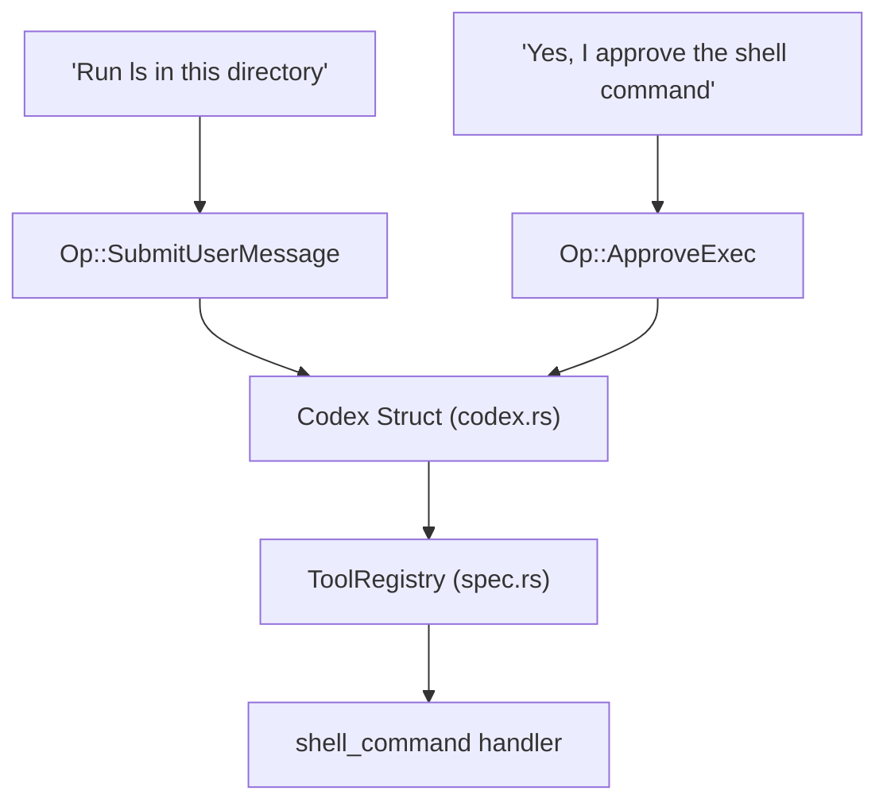

# Glossary

Relevant source files

-   [codex-rs/Cargo.lock](https://github.com/openai/codex/blob/d807d44a/codex-rs/Cargo.lock)
-   [codex-rs/Cargo.toml](https://github.com/openai/codex/blob/d807d44a/codex-rs/Cargo.toml)
-   [codex-rs/README.md](https://github.com/openai/codex/blob/d807d44a/codex-rs/README.md?plain=1)
-   [codex-rs/app-server-protocol/schema/json/ClientRequest.json](https://github.com/openai/codex/blob/d807d44a/codex-rs/app-server-protocol/schema/json/ClientRequest.json)
-   [codex-rs/app-server-protocol/schema/json/ServerNotification.json](https://github.com/openai/codex/blob/d807d44a/codex-rs/app-server-protocol/schema/json/ServerNotification.json)
-   [codex-rs/app-server-protocol/schema/json/codex\_app\_server\_protocol.schemas.json](https://github.com/openai/codex/blob/d807d44a/codex-rs/app-server-protocol/schema/json/codex_app_server_protocol.schemas.json)
-   [codex-rs/app-server-protocol/schema/json/codex\_app\_server\_protocol.v2.schemas.json](https://github.com/openai/codex/blob/d807d44a/codex-rs/app-server-protocol/schema/json/codex_app_server_protocol.v2.schemas.json)
-   [codex-rs/app-server-protocol/schema/typescript/ServerNotification.ts](https://github.com/openai/codex/blob/d807d44a/codex-rs/app-server-protocol/schema/typescript/ServerNotification.ts)
-   [codex-rs/app-server-protocol/schema/typescript/v2/index.ts](https://github.com/openai/codex/blob/d807d44a/codex-rs/app-server-protocol/schema/typescript/v2/index.ts)
-   [codex-rs/app-server-protocol/src/protocol/common.rs](https://github.com/openai/codex/blob/d807d44a/codex-rs/app-server-protocol/src/protocol/common.rs)
-   [codex-rs/app-server-protocol/src/protocol/v2.rs](https://github.com/openai/codex/blob/d807d44a/codex-rs/app-server-protocol/src/protocol/v2.rs)
-   [codex-rs/app-server/README.md](https://github.com/openai/codex/blob/d807d44a/codex-rs/app-server/README.md?plain=1)
-   [codex-rs/app-server/src/bespoke\_event\_handling.rs](https://github.com/openai/codex/blob/d807d44a/codex-rs/app-server/src/bespoke_event_handling.rs)
-   [codex-rs/app-server/src/codex\_message\_processor.rs](https://github.com/openai/codex/blob/d807d44a/codex-rs/app-server/src/codex_message_processor.rs)
-   [codex-rs/app-server/src/command\_exec.rs](https://github.com/openai/codex/blob/d807d44a/codex-rs/app-server/src/command_exec.rs)
-   [codex-rs/app-server/tests/common/mcp\_process.rs](https://github.com/openai/codex/blob/d807d44a/codex-rs/app-server/tests/common/mcp_process.rs)
-   [codex-rs/app-server/tests/suite/v2/mcp\_server\_elicitation.rs](https://github.com/openai/codex/blob/d807d44a/codex-rs/app-server/tests/suite/v2/mcp_server_elicitation.rs)
-   [codex-rs/app-server/tests/suite/v2/mod.rs](https://github.com/openai/codex/blob/d807d44a/codex-rs/app-server/tests/suite/v2/mod.rs)
-   [codex-rs/cli/Cargo.toml](https://github.com/openai/codex/blob/d807d44a/codex-rs/cli/Cargo.toml)
-   [codex-rs/cli/src/lib.rs](https://github.com/openai/codex/blob/d807d44a/codex-rs/cli/src/lib.rs)
-   [codex-rs/cli/src/main.rs](https://github.com/openai/codex/blob/d807d44a/codex-rs/cli/src/main.rs)
-   [codex-rs/cli/src/mcp\_cmd.rs](https://github.com/openai/codex/blob/d807d44a/codex-rs/cli/src/mcp_cmd.rs)
-   [codex-rs/cli/tests/mcp\_add\_remove.rs](https://github.com/openai/codex/blob/d807d44a/codex-rs/cli/tests/mcp_add_remove.rs)
-   [codex-rs/cli/tests/mcp\_list.rs](https://github.com/openai/codex/blob/d807d44a/codex-rs/cli/tests/mcp_list.rs)
-   [codex-rs/config.md](https://github.com/openai/codex/blob/d807d44a/codex-rs/config.md?plain=1)
-   [codex-rs/core/Cargo.toml](https://github.com/openai/codex/blob/d807d44a/codex-rs/core/Cargo.toml)
-   [codex-rs/core/config.schema.json](https://github.com/openai/codex/blob/d807d44a/codex-rs/core/config.schema.json)
-   [codex-rs/core/src/codex.rs](https://github.com/openai/codex/blob/d807d44a/codex-rs/core/src/codex.rs)
-   [codex-rs/core/src/config/agent\_roles.rs](https://github.com/openai/codex/blob/d807d44a/codex-rs/core/src/config/agent_roles.rs)
-   [codex-rs/core/src/config/config\_tests.rs](https://github.com/openai/codex/blob/d807d44a/codex-rs/core/src/config/config_tests.rs)
-   [codex-rs/core/src/config/edit.rs](https://github.com/openai/codex/blob/d807d44a/codex-rs/core/src/config/edit.rs)
-   [codex-rs/core/src/config/mod.rs](https://github.com/openai/codex/blob/d807d44a/codex-rs/core/src/config/mod.rs)
-   [codex-rs/core/src/config/profile.rs](https://github.com/openai/codex/blob/d807d44a/codex-rs/core/src/config/profile.rs)
-   [codex-rs/core/src/config/types.rs](https://github.com/openai/codex/blob/d807d44a/codex-rs/core/src/config/types.rs)
-   [codex-rs/core/src/exec.rs](https://github.com/openai/codex/blob/d807d44a/codex-rs/core/src/exec.rs)
-   [codex-rs/core/src/flags.rs](https://github.com/openai/codex/blob/d807d44a/codex-rs/core/src/flags.rs)
-   [codex-rs/core/src/lib.rs](https://github.com/openai/codex/blob/d807d44a/codex-rs/core/src/lib.rs)
-   [codex-rs/core/src/mcp\_connection\_manager.rs](https://github.com/openai/codex/blob/d807d44a/codex-rs/core/src/mcp_connection_manager.rs)
-   [codex-rs/core/src/mcp\_connection\_manager\_tests.rs](https://github.com/openai/codex/blob/d807d44a/codex-rs/core/src/mcp_connection_manager_tests.rs)
-   [codex-rs/core/src/model\_provider\_info.rs](https://github.com/openai/codex/blob/d807d44a/codex-rs/core/src/model_provider_info.rs)
-   [codex-rs/core/src/rollout/policy.rs](https://github.com/openai/codex/blob/d807d44a/codex-rs/core/src/rollout/policy.rs)
-   [codex-rs/core/src/sandboxing/mod.rs](https://github.com/openai/codex/blob/d807d44a/codex-rs/core/src/sandboxing/mod.rs)
-   [codex-rs/core/src/state/session.rs](https://github.com/openai/codex/blob/d807d44a/codex-rs/core/src/state/session.rs)
-   [codex-rs/core/src/state/turn.rs](https://github.com/openai/codex/blob/d807d44a/codex-rs/core/src/state/turn.rs)
-   [codex-rs/core/src/tasks/mod.rs](https://github.com/openai/codex/blob/d807d44a/codex-rs/core/src/tasks/mod.rs)
-   [codex-rs/core/src/tasks/user\_shell.rs](https://github.com/openai/codex/blob/d807d44a/codex-rs/core/src/tasks/user_shell.rs)
-   [codex-rs/core/src/tools/events.rs](https://github.com/openai/codex/blob/d807d44a/codex-rs/core/src/tools/events.rs)
-   [codex-rs/core/src/tools/handlers/mod.rs](https://github.com/openai/codex/blob/d807d44a/codex-rs/core/src/tools/handlers/mod.rs)
-   [codex-rs/core/src/tools/handlers/shell.rs](https://github.com/openai/codex/blob/d807d44a/codex-rs/core/src/tools/handlers/shell.rs)
-   [codex-rs/core/src/tools/handlers/tool\_search\_tests.rs](https://github.com/openai/codex/blob/d807d44a/codex-rs/core/src/tools/handlers/tool_search_tests.rs)
-   [codex-rs/core/src/tools/handlers/unified\_exec.rs](https://github.com/openai/codex/blob/d807d44a/codex-rs/core/src/tools/handlers/unified_exec.rs)
-   [codex-rs/core/src/tools/orchestrator.rs](https://github.com/openai/codex/blob/d807d44a/codex-rs/core/src/tools/orchestrator.rs)
-   [codex-rs/core/src/tools/runtimes/apply\_patch.rs](https://github.com/openai/codex/blob/d807d44a/codex-rs/core/src/tools/runtimes/apply_patch.rs)
-   [codex-rs/core/src/tools/runtimes/mod.rs](https://github.com/openai/codex/blob/d807d44a/codex-rs/core/src/tools/runtimes/mod.rs)
-   [codex-rs/core/src/tools/runtimes/shell.rs](https://github.com/openai/codex/blob/d807d44a/codex-rs/core/src/tools/runtimes/shell.rs)
-   [codex-rs/core/src/tools/runtimes/unified\_exec.rs](https://github.com/openai/codex/blob/d807d44a/codex-rs/core/src/tools/runtimes/unified_exec.rs)
-   [codex-rs/core/src/tools/sandboxing.rs](https://github.com/openai/codex/blob/d807d44a/codex-rs/core/src/tools/sandboxing.rs)
-   [codex-rs/core/src/tools/spec.rs](https://github.com/openai/codex/blob/d807d44a/codex-rs/core/src/tools/spec.rs)
-   [codex-rs/core/src/tools/spec\_tests.rs](https://github.com/openai/codex/blob/d807d44a/codex-rs/core/src/tools/spec_tests.rs)
-   [codex-rs/core/src/unified\_exec/async\_watcher.rs](https://github.com/openai/codex/blob/d807d44a/codex-rs/core/src/unified_exec/async_watcher.rs)
-   [codex-rs/core/src/unified\_exec/errors.rs](https://github.com/openai/codex/blob/d807d44a/codex-rs/core/src/unified_exec/errors.rs)
-   [codex-rs/core/src/unified\_exec/mod.rs](https://github.com/openai/codex/blob/d807d44a/codex-rs/core/src/unified_exec/mod.rs)
-   [codex-rs/core/src/unified\_exec/process\_manager.rs](https://github.com/openai/codex/blob/d807d44a/codex-rs/core/src/unified_exec/process_manager.rs)
-   [codex-rs/core/tests/suite/exec.rs](https://github.com/openai/codex/blob/d807d44a/codex-rs/core/tests/suite/exec.rs)
-   [codex-rs/core/tests/suite/rmcp\_client.rs](https://github.com/openai/codex/blob/d807d44a/codex-rs/core/tests/suite/rmcp_client.rs)
-   [codex-rs/core/tests/suite/truncation.rs](https://github.com/openai/codex/blob/d807d44a/codex-rs/core/tests/suite/truncation.rs)
-   [codex-rs/core/tests/suite/unified\_exec.rs](https://github.com/openai/codex/blob/d807d44a/codex-rs/core/tests/suite/unified_exec.rs)
-   [codex-rs/core/tests/suite/user\_shell\_cmd.rs](https://github.com/openai/codex/blob/d807d44a/codex-rs/core/tests/suite/user_shell_cmd.rs)
-   [codex-rs/exec/Cargo.toml](https://github.com/openai/codex/blob/d807d44a/codex-rs/exec/Cargo.toml)
-   [codex-rs/exec/src/cli.rs](https://github.com/openai/codex/blob/d807d44a/codex-rs/exec/src/cli.rs)
-   [codex-rs/exec/src/event\_processor.rs](https://github.com/openai/codex/blob/d807d44a/codex-rs/exec/src/event_processor.rs)
-   [codex-rs/exec/src/event\_processor\_with\_human\_output.rs](https://github.com/openai/codex/blob/d807d44a/codex-rs/exec/src/event_processor_with_human_output.rs)
-   [codex-rs/exec/src/lib.rs](https://github.com/openai/codex/blob/d807d44a/codex-rs/exec/src/lib.rs)
-   [codex-rs/linux-sandbox/tests/suite/landlock.rs](https://github.com/openai/codex/blob/d807d44a/codex-rs/linux-sandbox/tests/suite/landlock.rs)
-   [codex-rs/mcp-server/src/codex\_tool\_runner.rs](https://github.com/openai/codex/blob/d807d44a/codex-rs/mcp-server/src/codex_tool_runner.rs)
-   [codex-rs/protocol/src/protocol.rs](https://github.com/openai/codex/blob/d807d44a/codex-rs/protocol/src/protocol.rs)
-   [codex-rs/rmcp-client/src/rmcp\_client.rs](https://github.com/openai/codex/blob/d807d44a/codex-rs/rmcp-client/src/rmcp_client.rs)
-   [codex-rs/rmcp-client/tests/streamable\_http\_recovery.rs](https://github.com/openai/codex/blob/d807d44a/codex-rs/rmcp-client/tests/streamable_http_recovery.rs)
-   [codex-rs/tui/Cargo.toml](https://github.com/openai/codex/blob/d807d44a/codex-rs/tui/Cargo.toml)
-   [codex-rs/tui/src/app.rs](https://github.com/openai/codex/blob/d807d44a/codex-rs/tui/src/app.rs)
-   [codex-rs/tui/src/app\_event.rs](https://github.com/openai/codex/blob/d807d44a/codex-rs/tui/src/app_event.rs)
-   [codex-rs/tui/src/bottom\_pane/chat\_composer.rs](https://github.com/openai/codex/blob/d807d44a/codex-rs/tui/src/bottom_pane/chat_composer.rs)
-   [codex-rs/tui/src/bottom\_pane/mod.rs](https://github.com/openai/codex/blob/d807d44a/codex-rs/tui/src/bottom_pane/mod.rs)
-   [codex-rs/tui/src/chatwidget.rs](https://github.com/openai/codex/blob/d807d44a/codex-rs/tui/src/chatwidget.rs)
-   [codex-rs/tui/src/chatwidget/tests.rs](https://github.com/openai/codex/blob/d807d44a/codex-rs/tui/src/chatwidget/tests.rs)
-   [codex-rs/tui/src/cli.rs](https://github.com/openai/codex/blob/d807d44a/codex-rs/tui/src/cli.rs)
-   [codex-rs/tui/src/history\_cell.rs](https://github.com/openai/codex/blob/d807d44a/codex-rs/tui/src/history_cell.rs)
-   [codex-rs/tui/src/lib.rs](https://github.com/openai/codex/blob/d807d44a/codex-rs/tui/src/lib.rs)
-   [codex-rs/tui/src/slash\_command.rs](https://github.com/openai/codex/blob/d807d44a/codex-rs/tui/src/slash_command.rs)
-   [docs/config.md](https://github.com/openai/codex/blob/d807d44a/docs/config.md?plain=1)
-   [docs/example-config.md](https://github.com/openai/codex/blob/d807d44a/docs/example-config.md?plain=1)
-   [docs/skills.md](https://github.com/openai/codex/blob/d807d44a/docs/skills.md?plain=1)
-   [docs/slash\_commands.md](https://github.com/openai/codex/blob/d807d44a/docs/slash_commands.md?plain=1)

This page defines codebase-specific terms, jargon, and abbreviations used throughout the Codex system. It serves as a technical reference for onboarding engineers to understand the mapping between conceptual system components and their concrete implementations in Rust.

## Core System Entities

### Codex

The top-level agent engine that manages the lifecycle of a session. It coordinates model interactions, tool execution, and state persistence.

-   **Implementation**: Defined as the `Codex` struct in [codex-rs/core/src/codex.rs175-300](https://github.com/openai/codex/blob/d807d44a/codex-rs/core/src/codex.rs#L175-L300)
-   **Data Flow**: It receives `Op` (Operation) submissions via an `async_channel` and emits `EventMsg` updates.

### Thread

A logical conversation container within a session. A single Codex session can manage multiple threads (e.g., a primary chat thread and sub-agent threads for review).

-   **Implementation**: Managed by `ThreadManager` in [codex-rs/core/src/lib.rs](https://github.com/openai/codex/blob/d807d44a/codex-rs/core/src/lib.rs)
-   **Identification**: Referenced by `ThreadId` [codex-rs/protocol/src/protocol.rs](https://github.com/openai/codex/blob/d807d44a/codex-rs/protocol/src/protocol.rs)

### Turn

A single exchange in a conversation, starting from a user message (or agent trigger) and ending when the agent stops generating or requires user input.

-   **State**: Tracked via `TurnState` which holds pending tool calls and intermediate results [codex-rs/core/src/codex.rs250-280](https://github.com/openai/codex/blob/d807d44a/codex-rs/core/src/codex.rs#L250-L280)

### Op (Operation)

The primitive command unit sent to the `Codex` engine. Operations include submitting messages, approving tool calls, or switching threads.

-   **Implementation**: `enum Op` in [codex-rs/protocol/src/protocol.rs](https://github.com/openai/codex/blob/d807d44a/codex-rs/protocol/src/protocol.rs)

### EventMsg

The primary communication mechanism from the core engine to UIs (TUI/App Server). It encapsulates incremental updates like token streaming, tool starts, and errors.

-   **Implementation**: `enum EventMsg` in [codex-rs/protocol/src/protocol.rs](https://github.com/openai/codex/blob/d807d44a/codex-rs/protocol/src/protocol.rs)

---

## Architectural Mapping: Natural Language to Code

The following diagram bridges high-level user actions to the specific code entities that handle them.

**User Interaction to Code Entity Mapping**

Sources: [codex-rs/core/src/codex.rs1-100](https://github.com/openai/codex/blob/d807d44a/codex-rs/core/src/codex.rs#L1-L100) [codex-rs/core/src/tools/spec.rs1-50](https://github.com/openai/codex/blob/d807d44a/codex-rs/core/src/tools/spec.rs#L1-L50) [codex-rs/protocol/src/protocol.rs1-200](https://github.com/openai/codex/blob/d807d44a/codex-rs/protocol/src/protocol.rs#L1-L200)

---

## Technical Terms & Jargon

| Term | Definition | Code Pointer |
| --- | --- | --- |
| **Active Cell** | In the TUI, the currently streaming or mutating transcript unit (e.g., a live tool output). | [codex-rs/tui/src/chatwidget.rs7-10](https://github.com/openai/codex/blob/d807d44a/codex-rs/tui/src/chatwidget.rs#L7-L10) |
| **Bespoke Event** | Custom handling logic in the App Server to translate core events into specific JSON-RPC notifications. | [codex-rs/app-server/src/bespoke\_event\_handling.rs1-50](https://github.com/openai/codex/blob/d807d44a/codex-rs/app-server/src/bespoke_event_handling.rs#L1-L50) |
| **Compaction** | The process of summarizing old conversation history to stay within model context limits. | [codex-rs/core/src/codex.rs22-26](https://github.com/openai/codex/blob/d807d44a/codex-rs/core/src/codex.rs#L22-L26) |
| **Elicitation** | A request for the user to provide specific configuration or credentials (often for MCP servers). | [codex-rs/protocol/src/approvals.rs75-80](https://github.com/openai/codex/blob/d807d44a/codex-rs/protocol/src/approvals.rs#L75-L80) |
| **Guardian** | A specialized sub-agent that reviews proposed tool calls for security risks before execution. | [codex-rs/tui/src/app.rs157-163](https://github.com/openai/codex/blob/d807d44a/codex-rs/tui/src/app.rs#L157-L163) |
| **History Cell** | A trait for renderable units in the TUI transcript. | [codex-rs/tui/src/history\_cell.rs98-150](https://github.com/openai/codex/blob/d807d44a/codex-rs/tui/src/history_cell.rs#L98-L150) |
| **MCP** | Model Context Protocol; allows Codex to connect to external tool servers. | [codex-rs/core/src/mcp\_connection\_manager.rs1-100](https://github.com/openai/codex/blob/d807d44a/codex-rs/core/src/mcp_connection_manager.rs#L1-L100) |
| **Rollout** | A persistent file format (`.codex-rollout`) that records every event in a session for replay. | [codex-rs/core/src/codex.rs41](https://github.com/openai/codex/blob/d807d44a/codex-rs/core/src/codex.rs#L41-L41) |
| **Sandbox** | Platform-specific isolation (Landlock, Seatbelt, Windows Token) for executing untrusted code. | [codex-rs/core/src/exec.rs1-100](https://github.com/openai/codex/blob/d807d44a/codex-rs/core/src/exec.rs#L1-L100) |

---

## Data Flow: Event Processing

The system uses a reactive pattern where the Core engine streams events that are consumed and rendered by various frontends.

**Event Translation Pipeline**

> **[Mermaid sequence]**
> *(图表结构无法解析)*

Sources: [codex-rs/app-server/src/codex\_message\_processor.rs1-20](https://github.com/openai/codex/blob/d807d44a/codex-rs/app-server/src/codex_message_processor.rs#L1-L20) [codex-rs/tui/src/chatwidget.rs114-150](https://github.com/openai/codex/blob/d807d44a/codex-rs/tui/src/chatwidget.rs#L114-L150) [codex-rs/app-server-protocol/src/protocol/v2.rs100-130](https://github.com/openai/codex/blob/d807d44a/codex-rs/app-server-protocol/src/protocol/v2.rs#L100-L130)

---

## Configuration Jargon

-   **Config Layer**: A single source of truth in the hierarchy (e.g., `config.toml`, CLI flags, or environment variables). Managed by `ConfigLayerStack` [codex-rs/core/src/config/mod.rs31-35](https://github.com/openai/codex/blob/d807d44a/codex-rs/core/src/config/mod.rs#L31-L35)
-   **Constrained**: A wrapper type used in configuration to ensure values meet specific validation criteria (e.g., `Constrained<SandboxMode>`) [codex-rs/core/src/config/mod.rs117-120](https://github.com/openai/codex/blob/d807d44a/codex-rs/core/src/config/mod.rs#L117-L120)
-   **Managed Features**: Runtime-toggled capabilities (feature flags) that can be enabled/disabled via the `/features` command [codex-rs/core/src/config/mod.rs122](https://github.com/openai/codex/blob/d807d44a/codex-rs/core/src/config/mod.rs#L122-L122)

Sources: [codex-rs/core/src/config/mod.rs1-150](https://github.com/openai/codex/blob/d807d44a/codex-rs/core/src/config/mod.rs#L1-L150) [codex-rs/core/src/config/types.rs1-100](https://github.com/openai/codex/blob/d807d44a/codex-rs/core/src/config/types.rs#L1-L100)
