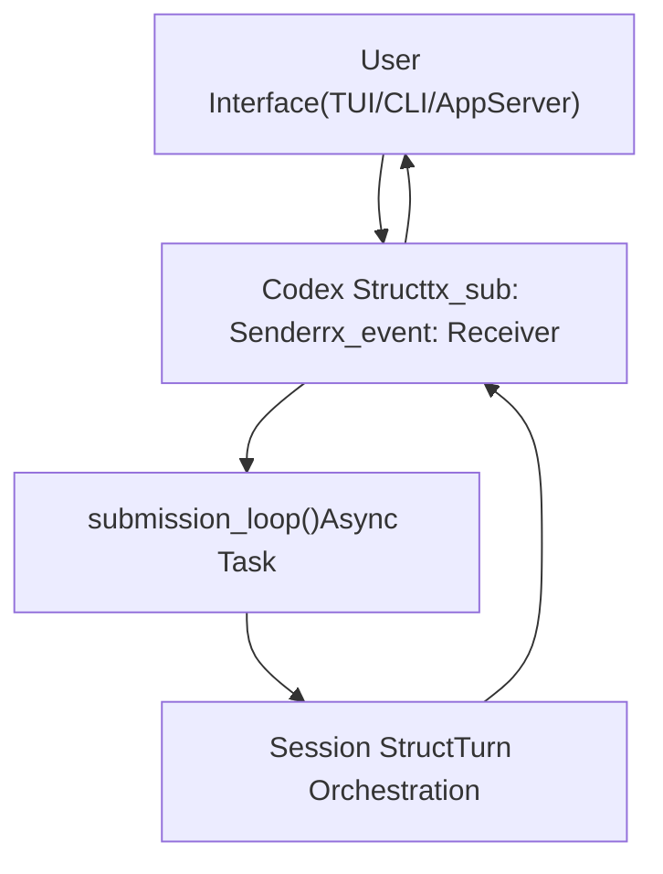
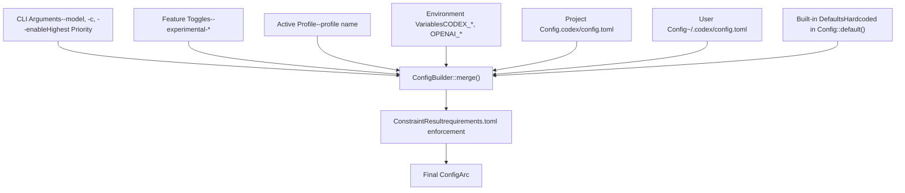

# Core Concepts

Relevant source files

-   [codex-rs/core/config.schema.json](https://github.com/openai/codex/blob/d807d44a/codex-rs/core/config.schema.json)
-   [codex-rs/core/src/codex.rs](https://github.com/openai/codex/blob/d807d44a/codex-rs/core/src/codex.rs)
-   [codex-rs/core/src/config/agent\_roles.rs](https://github.com/openai/codex/blob/d807d44a/codex-rs/core/src/config/agent_roles.rs)
-   [codex-rs/core/src/config/config\_tests.rs](https://github.com/openai/codex/blob/d807d44a/codex-rs/core/src/config/config_tests.rs)
-   [codex-rs/core/src/config/edit.rs](https://github.com/openai/codex/blob/d807d44a/codex-rs/core/src/config/edit.rs)
-   [codex-rs/core/src/config/mod.rs](https://github.com/openai/codex/blob/d807d44a/codex-rs/core/src/config/mod.rs)
-   [codex-rs/core/src/config/profile.rs](https://github.com/openai/codex/blob/d807d44a/codex-rs/core/src/config/profile.rs)
-   [codex-rs/core/src/config/types.rs](https://github.com/openai/codex/blob/d807d44a/codex-rs/core/src/config/types.rs)
-   [codex-rs/core/src/rollout/policy.rs](https://github.com/openai/codex/blob/d807d44a/codex-rs/core/src/rollout/policy.rs)
-   [codex-rs/core/src/tools/handlers/mod.rs](https://github.com/openai/codex/blob/d807d44a/codex-rs/core/src/tools/handlers/mod.rs)
-   [codex-rs/core/src/tools/spec.rs](https://github.com/openai/codex/blob/d807d44a/codex-rs/core/src/tools/spec.rs)
-   [codex-rs/core/src/tools/spec\_tests.rs](https://github.com/openai/codex/blob/d807d44a/codex-rs/core/src/tools/spec_tests.rs)
-   [codex-rs/exec/src/event\_processor.rs](https://github.com/openai/codex/blob/d807d44a/codex-rs/exec/src/event_processor.rs)
-   [codex-rs/exec/src/event\_processor\_with\_human\_output.rs](https://github.com/openai/codex/blob/d807d44a/codex-rs/exec/src/event_processor_with_human_output.rs)
-   [codex-rs/mcp-server/src/codex\_tool\_runner.rs](https://github.com/openai/codex/blob/d807d44a/codex-rs/mcp-server/src/codex_tool_runner.rs)
-   [codex-rs/protocol/src/protocol.rs](https://github.com/openai/codex/blob/d807d44a/codex-rs/protocol/src/protocol.rs)
-   [codex-rs/tui/src/app.rs](https://github.com/openai/codex/blob/d807d44a/codex-rs/tui/src/app.rs)
-   [codex-rs/tui/src/app\_event.rs](https://github.com/openai/codex/blob/d807d44a/codex-rs/tui/src/app_event.rs)
-   [codex-rs/tui/src/bottom\_pane/chat\_composer.rs](https://github.com/openai/codex/blob/d807d44a/codex-rs/tui/src/bottom_pane/chat_composer.rs)
-   [codex-rs/tui/src/bottom\_pane/mod.rs](https://github.com/openai/codex/blob/d807d44a/codex-rs/tui/src/bottom_pane/mod.rs)
-   [codex-rs/tui/src/chatwidget.rs](https://github.com/openai/codex/blob/d807d44a/codex-rs/tui/src/chatwidget.rs)
-   [codex-rs/tui/src/chatwidget/tests.rs](https://github.com/openai/codex/blob/d807d44a/codex-rs/tui/src/chatwidget/tests.rs)
-   [codex-rs/tui/src/history\_cell.rs](https://github.com/openai/codex/blob/d807d44a/codex-rs/tui/src/history_cell.rs)
-   [codex-rs/tui/src/slash\_command.rs](https://github.com/openai/codex/blob/d807d44a/codex-rs/tui/src/slash_command.rs)
-   [docs/config.md](https://github.com/openai/codex/blob/d807d44a/docs/config.md?plain=1)
-   [docs/example-config.md](https://github.com/openai/codex/blob/d807d44a/docs/example-config.md?plain=1)
-   [docs/skills.md](https://github.com/openai/codex/blob/d807d44a/docs/skills.md?plain=1)
-   [docs/slash\_commands.md](https://github.com/openai/codex/blob/d807d44a/docs/slash_commands.md?plain=1)

This page documents the fundamental architectural patterns and systems that form the foundation of the Codex codebase. These concepts are invariant across all execution modes (TUI, CLI, IDE integration) and provide the core abstractions for session management, configuration, and security.

For detailed information about specific subsystems built on these concepts, see:

-   [Protocol Layer (Submission/Event System)](/openai/codex/2.1-protocol-layer-(submissionevent-system)) — Document the Op submission queue and Event stream pattern that coordinates async communication
-   [Configuration System](/openai/codex/2.2-configuration-system) — Explain the layered configuration system (CLI args → env vars → config.toml → defaults) and ConfigBuilder
-   [Feature Flags](/openai/codex/2.3-feature-flags) — Document the feature flag system, lifecycle stages (UnderDevelopment/Experimental/Stable/Deprecated), and runtime toggles
-   [Sandbox and Approval Policies](/openai/codex/2.4-sandbox-and-approval-policies) — Explain sandbox modes (ReadOnly/WorkspaceWrite/DangerFullAccess), approval policies, and permission profiles

---

## The Submission/Event Protocol

Codex uses a **queue-pair pattern** to coordinate asynchronous communication between user interfaces and the agent engine. This pattern decouples request submission from response processing, enabling non-blocking operation and cancellation support.

### Architecture Overview

**Sources:** [codex-rs/core/src/codex.rs330-343](https://github.com/openai/codex/blob/d807d44a/codex-rs/core/src/codex.rs#L330-L343) [codex-rs/protocol/src/protocol.rs101-111](https://github.com/openai/codex/blob/d807d44a/codex-rs/protocol/src/protocol.rs#L101-L111)

### Submission and Event Types

The `Op` enum defines all possible operations that can be submitted to a Codex session. Each operation is wrapped in a `Submission` struct with a unique ID for correlation. Events flow from `Session` back to the UI via the `Event` stream, containing an `EventMsg` payload.

| Symbol | Type | Purpose |
| --- | --- | --- |
| `Submission` | `struct` | Correlation wrapper for an `Op` [codex-rs/protocol/src/protocol.rs103-111](https://github.com/openai/codex/blob/d807d44a/codex-rs/protocol/src/protocol.rs#L103-L111) |
| `Op` | `enum` | Operations like `UserInput`, `Interrupt`, or `ExecApproval` [codex-rs/protocol/src/protocol.rs181-479](https://github.com/openai/codex/blob/d807d44a/codex-rs/protocol/src/protocol.rs#L181-L479) |
| `Event` | `struct` | Correlation wrapper for an `EventMsg` [codex-rs/protocol/src/protocol.rs1146-1152](https://github.com/openai/codex/blob/d807d44a/codex-rs/protocol/src/protocol.rs#L1146-L1152) |
| `EventMsg` | `enum` | Messages like `TurnStarted`, `AgentMessageDelta`, or `Error` [codex-rs/protocol/src/protocol.rs1154-1500](https://github.com/openai/codex/blob/d807d44a/codex-rs/protocol/src/protocol.rs#L1154-L1500) |

**Sources:** [codex-rs/protocol/src/protocol.rs101-1500](https://github.com/openai/codex/blob/d807d44a/codex-rs/protocol/src/protocol.rs#L101-L1500) [codex-rs/core/src/codex.rs636-686](https://github.com/openai/codex/blob/d807d44a/codex-rs/core/src/codex.rs#L636-L686)

---

## Configuration System

Codex uses a **layered configuration system** where settings from multiple sources (CLI args → env vars → config.toml → defaults) are merged with explicit precedence rules.

### Configuration Layer Hierarchy

**Sources:** [codex-rs/core/src/config/mod.rs1-134](https://github.com/openai/codex/blob/d807d44a/codex-rs/core/src/config/mod.rs#L1-L134) [codex-rs/core/src/codex.rs404-493](https://github.com/openai/codex/blob/d807d44a/codex-rs/core/src/codex.rs#L404-L493)

### Constraint Validation

Organizational policies are enforced via `requirements.toml`. The `Constrained<T>` wrapper tracks whether a value is `Pinned` (immutable by user) or `Default` (overridable).

**Sources:** [codex-rs/core/src/config/mod.rs117-119](https://github.com/openai/codex/blob/d807d44a/codex-rs/core/src/config/mod.rs#L117-L119) [codex-rs/core/src/codex.rs556-581](https://github.com/openai/codex/blob/d807d44a/codex-rs/core/src/codex.rs#L556-L581)

---

## Feature Flag System

Codex uses a **staged feature flag system** to manage experimental functionality. Features progress through defined lifecycle stages: `UnderDevelopment`, `Experimental`, `Stable`, and `Deprecated`.

### Feature Definition and Lifecycle

> **[Mermaid stateDiagram]**
> *(图表结构无法解析)*

**Sources:** [codex-rs/core/src/codex.rs59-61](https://github.com/openai/codex/blob/d807d44a/codex-rs/core/src/codex.rs#L59-L61) [codex-rs/core/src/config/mod.rs122-124](https://github.com/openai/codex/blob/d807d44a/codex-rs/core/src/config/mod.rs#L122-L124)

Features are defined in the `FEATURES` array. The `ManagedFeatures` struct tracks the active state of all toggles for a session lifetime.

| Stage | Visibility | Default State |
| --- | --- | --- |
| `UnderDevelopment` | Hidden | Disabled |
| `Experimental` | `/experimental` menu | Disabled |
| `Stable` | Always available | Enabled |
| `Deprecated` | Always available | Enabled (with warning) |

**Sources:** [codex-rs/core/src/codex.rs27-31](https://github.com/openai/codex/blob/d807d44a/codex-rs/core/src/codex.rs#L27-L31) [codex-rs/core/src/config/mod.rs110-111](https://github.com/openai/codex/blob/d807d44a/codex-rs/core/src/config/mod.rs#L110-L111)

---

## Sandbox and Approval Policies

Codex provides **layered security controls** to protect the host environment during tool execution.

### Approval Policy

The `AskForApproval` enum determines when user consent is required for a tool call.

-   `UnlessTrusted`: Auto-approves safe read-only commands.
-   `OnRequest`: Model decides when to prompt the user.
-   `Never`: No prompts (used in non-interactive modes).

**Sources:** [codex-rs/protocol/src/protocol.rs54-56](https://github.com/openai/codex/blob/d807d44a/codex-rs/protocol/src/protocol.rs#L54-L56) [codex-rs/core/src/codex.rs566-567](https://github.com/openai/codex/blob/d807d44a/codex-rs/core/src/codex.rs#L566-L567)

### Sandbox Policy

The `SandboxPolicy` controls filesystem and network restrictions. Platform-specific backends (Landlock on Linux, Seatbelt on macOS, Restricted Tokens on Windows) enforce these limits.

| Policy | Filesystem Access |
| --- | --- |
| `DangerFullAccess` | Unrestricted |
| `ReadOnly` | Read-only access to allowed roots |
| `WorkspaceWrite` | Write access to `cwd` and specified roots |

**Sources:** [codex-rs/protocol/src/protocol.rs659-758](https://github.com/openai/codex/blob/d807d44a/codex-rs/protocol/src/protocol.rs#L659-L758) [codex-rs/core/src/codex.rs568-570](https://github.com/openai/codex/blob/d807d44a/codex-rs/core/src/codex.rs#L568-L570)

### Policy Evaluation Flow

> **[Mermaid sequence]**
> *(图表结构无法解析)*

**Sources:** [codex-rs/core/src/codex.rs480-489](https://github.com/openai/codex/blob/d807d44a/codex-rs/core/src/codex.rs#L480-L489) [codex-rs/core/src/tools/spec.rs64-96](https://github.com/openai/codex/blob/d807d44a/codex-rs/core/src/tools/spec.rs#L64-L96)

---

## Core Data Structures

| Symbol | Location | Role |
| --- | --- | --- |
| `Codex` | [codex-rs/core/src/codex.rs330-343](https://github.com/openai/codex/blob/d807d44a/codex-rs/core/src/codex.rs#L330-L343) | Primary session interface and loop coordinator |
| `Config` | [codex-rs/core/src/config/mod.rs1-134](https://github.com/openai/codex/blob/d807d44a/codex-rs/core/src/config/mod.rs#L1-L134) | Shared immutable session configuration |
| `HistoryCell` | [codex-rs/tui/src/history\_cell.rs98-168](https://github.com/openai/codex/blob/d807d44a/codex-rs/tui/src/history_cell.rs#L98-L168) | Unit of display in the conversation transcript |
| `ChatComposer` | [codex-rs/tui/src/bottom\_pane/chat\_composer.rs1-130](https://github.com/openai/codex/blob/d807d44a/codex-rs/tui/src/bottom_pane/chat_composer.rs#L1-L130) | Input state machine for the user prompt |

**Sources:** [codex-rs/core/src/codex.rs](https://github.com/openai/codex/blob/d807d44a/codex-rs/core/src/codex.rs) [codex-rs/tui/src/history\_cell.rs](https://github.com/openai/codex/blob/d807d44a/codex-rs/tui/src/history_cell.rs) [codex-rs/tui/src/bottom\_pane/chat\_composer.rs](https://github.com/openai/codex/blob/d807d44a/codex-rs/tui/src/bottom_pane/chat_composer.rs)
