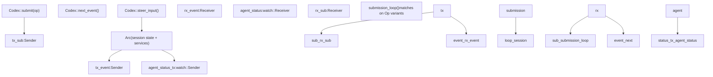

# Protocol Layer (Submission/Event System)

Relevant source files

-   [codex-rs/app-server-protocol/src/export.rs](https://github.com/openai/codex/blob/d807d44a/codex-rs/app-server-protocol/src/export.rs)
-   [codex-rs/app-server-protocol/src/lib.rs](https://github.com/openai/codex/blob/d807d44a/codex-rs/app-server-protocol/src/lib.rs)
-   [codex-rs/app-server-protocol/src/protocol/v1.rs](https://github.com/openai/codex/blob/d807d44a/codex-rs/app-server-protocol/src/protocol/v1.rs)
-   [codex-rs/app-server/tests/suite/v2/initialize.rs](https://github.com/openai/codex/blob/d807d44a/codex-rs/app-server/tests/suite/v2/initialize.rs)
-   [codex-rs/core/src/codex.rs](https://github.com/openai/codex/blob/d807d44a/codex-rs/core/src/codex.rs)
-   [codex-rs/core/src/context\_manager/updates.rs](https://github.com/openai/codex/blob/d807d44a/codex-rs/core/src/context_manager/updates.rs)
-   [codex-rs/core/src/rollout/policy.rs](https://github.com/openai/codex/blob/d807d44a/codex-rs/core/src/rollout/policy.rs)
-   [codex-rs/core/src/tools/network\_approval.rs](https://github.com/openai/codex/blob/d807d44a/codex-rs/core/src/tools/network_approval.rs)
-   [codex-rs/core/tests/suite/collaboration\_instructions.rs](https://github.com/openai/codex/blob/d807d44a/codex-rs/core/tests/suite/collaboration_instructions.rs)
-   [codex-rs/core/tests/suite/override\_updates.rs](https://github.com/openai/codex/blob/d807d44a/codex-rs/core/tests/suite/override_updates.rs)
-   [codex-rs/core/tests/suite/permissions\_messages.rs](https://github.com/openai/codex/blob/d807d44a/codex-rs/core/tests/suite/permissions_messages.rs)
-   [codex-rs/exec/src/event\_processor.rs](https://github.com/openai/codex/blob/d807d44a/codex-rs/exec/src/event_processor.rs)
-   [codex-rs/exec/src/event\_processor\_with\_human\_output.rs](https://github.com/openai/codex/blob/d807d44a/codex-rs/exec/src/event_processor_with_human_output.rs)
-   [codex-rs/mcp-server/src/codex\_tool\_runner.rs](https://github.com/openai/codex/blob/d807d44a/codex-rs/mcp-server/src/codex_tool_runner.rs)
-   [codex-rs/protocol/Cargo.toml](https://github.com/openai/codex/blob/d807d44a/codex-rs/protocol/Cargo.toml)
-   [codex-rs/protocol/src/account.rs](https://github.com/openai/codex/blob/d807d44a/codex-rs/protocol/src/account.rs)
-   [codex-rs/protocol/src/models.rs](https://github.com/openai/codex/blob/d807d44a/codex-rs/protocol/src/models.rs)
-   [codex-rs/protocol/src/protocol.rs](https://github.com/openai/codex/blob/d807d44a/codex-rs/protocol/src/protocol.rs)
-   [codex-rs/tui/src/app.rs](https://github.com/openai/codex/blob/d807d44a/codex-rs/tui/src/app.rs)
-   [codex-rs/tui/src/app\_event.rs](https://github.com/openai/codex/blob/d807d44a/codex-rs/tui/src/app_event.rs)
-   [codex-rs/tui/src/bottom\_pane/chat\_composer.rs](https://github.com/openai/codex/blob/d807d44a/codex-rs/tui/src/bottom_pane/chat_composer.rs)
-   [codex-rs/tui/src/bottom\_pane/mod.rs](https://github.com/openai/codex/blob/d807d44a/codex-rs/tui/src/bottom_pane/mod.rs)
-   [codex-rs/tui/src/chatwidget.rs](https://github.com/openai/codex/blob/d807d44a/codex-rs/tui/src/chatwidget.rs)
-   [codex-rs/tui/src/chatwidget/tests.rs](https://github.com/openai/codex/blob/d807d44a/codex-rs/tui/src/chatwidget/tests.rs)
-   [codex-rs/tui/src/history\_cell.rs](https://github.com/openai/codex/blob/d807d44a/codex-rs/tui/src/history_cell.rs)
-   [codex-rs/tui/src/slash\_command.rs](https://github.com/openai/codex/blob/d807d44a/codex-rs/tui/src/slash_command.rs)
-   [codex-rs/utils/image/Cargo.toml](https://github.com/openai/codex/blob/d807d44a/codex-rs/utils/image/Cargo.toml)
-   [codex-rs/utils/image/src/error.rs](https://github.com/openai/codex/blob/d807d44a/codex-rs/utils/image/src/error.rs)
-   [codex-rs/utils/image/src/lib.rs](https://github.com/openai/codex/blob/d807d44a/codex-rs/utils/image/src/lib.rs)

## Purpose and Scope

This page documents the core communication protocol used between all user-facing interfaces and the `codex-core` agent: the `Submission`/`Event` queue pair, the `Op` and `EventMsg` enums that define every operation and notification, and the `Codex` struct's `submit`/`next_event` interface.

The protocol is defined in the `codex-protocol` crate ([codex-rs/protocol/src/protocol.rs](https://github.com/openai/codex/blob/d807d44a/codex-rs/protocol/src/protocol.rs)) and implemented by the `Codex` struct in `codex-core` ([codex-rs/core/src/codex.rs](https://github.com/openai/codex/blob/d807d44a/codex-rs/core/src/codex.rs)). Every client—the TUI, the headless exec mode, the app server, and the MCP server—talks to the agent exclusively through this interface.

-   For how the agent uses this protocol internally to manage turns and session state, see **3.1 Codex Interface and Session Lifecycle**.
-   For sandbox and approval policy types (`SandboxPolicy`, `AskForApproval`) that appear as Op fields, see **2.4 Sandbox and Approval Policies**.
-   For how the TUI translates `EventMsg` into rendered history cells, see **4.1.2 ChatWidget and Conversation Display**.
-   For how the app server translates `EventMsg` into JSON-RPC notifications, see **4.5.3 Event Translation and Streaming**.

---

## Core Abstractions

### `Submission` and `Op`

A `Submission` is the envelope placed on the submission queue. It pairs a unique correlation ID with an operation and optional distributed trace context.

[codex-rs/protocol/src/protocol.rs102-111](https://github.com/openai/codex/blob/d807d44a/codex-rs/protocol/src/protocol.rs#L102-L111)

```
pub struct Submission {    pub id: String,   // Unique ID generated by Codex::submit()    pub op: Op,       // The operation to perform    pub trace: Option<W3cTraceContext>, // Distributed tracing metadata}
```
The `trace` field enables distributed tracing across async submission handoffs. When present, it carries `traceparent` and `tracestate` headers for OpenTelemetry integration [codex-rs/protocol/src/protocol.rs113-121](https://github.com/openai/codex/blob/d807d44a/codex-rs/protocol/src/protocol.rs#L113-L121)

Sources: [codex-rs/protocol/src/protocol.rs102-121](https://github.com/openai/codex/blob/d807d44a/codex-rs/protocol/src/protocol.rs#L102-L121) [codex-rs/core/src/codex.rs640-653](https://github.com/openai/codex/blob/d807d44a/codex-rs/core/src/codex.rs#L640-L653)

`Op` is a non-exhaustive enum covering every action a client can request, such as starting a turn, approving a tool call, or requesting a code review [codex-rs/protocol/src/protocol.rs181-479](https://github.com/openai/codex/blob/d807d44a/codex-rs/protocol/src/protocol.rs#L181-L479)

### `Event` and `EventMsg`

An `Event` is the envelope placed on the event queue. The `id` field echoes the `Submission.id` that triggered the event (where applicable) [codex-rs/protocol/src/protocol.rs555-560](https://github.com/openai/codex/blob/d807d44a/codex-rs/protocol/src/protocol.rs#L555-L560)

```
pub struct Event {    pub id: String,    pub msg: EventMsg,}
```
`EventMsg` is the tagged union of every notification the agent can emit, including streaming message deltas, tool execution status, and approval requests [codex-rs/protocol/src/protocol.rs563-1081](https://github.com/openai/codex/blob/d807d44a/codex-rs/protocol/src/protocol.rs#L563-L1081)

---

## The Async Queue Model

The protocol is implemented as a **Submission Queue / Event Queue** (SQ/EQ) pair backed by `async-channel` channels. This decouples callers from the agent's internal execution model.

**Queue Architecture: `Codex` struct, channels, and background task**


Sources: [codex-rs/core/src/codex.rs332-341](https://github.com/openai/codex/blob/d807d44a/codex-rs/core/src/codex.rs#L332-L341) [codex-rs/core/src/codex.rs422-424](https://github.com/openai/codex/blob/d807d44a/codex-rs/core/src/codex.rs#L422-L424) [codex-rs/core/src/codex.rs614-618](https://github.com/openai/codex/blob/d807d44a/codex-rs/core/src/codex.rs#L614-L618)

| Channel | Type | Capacity | Direction | Purpose |
| --- | --- | --- | --- | --- |
| Submission queue | `async_channel::bounded` | `SUBMISSION_CHANNEL_CAPACITY` = 512 | Caller → Session | Bounded to prevent memory pressure [codex-rs/core/src/codex.rs332](https://github.com/openai/codex/blob/d807d44a/codex-rs/core/src/codex.rs#L332-L332) |
| Event queue | `async_channel::unbounded` | Unlimited | Session → Caller | Unbounded to never block agent execution [codex-rs/core/src/codex.rs333](https://github.com/openai/codex/blob/d807d44a/codex-rs/core/src/codex.rs#L333-L333) |
| Agent status | `tokio::sync::watch` | 1 (latest value) | Session → Caller | Broadcast current agent status [codex-rs/core/src/codex.rs336](https://github.com/openai/codex/blob/d807d44a/codex-rs/core/src/codex.rs#L336-L336) |

The `submission_loop` task runs until `Op::Shutdown` is received [codex-rs/core/src/codex.rs585](https://github.com/openai/codex/blob/d807d44a/codex-rs/core/src/codex.rs#L585-L585) Each submission is matched against its `Op` variant and dispatched to the `Session`. The session emits `Event`s by sending to `tx_event`.

Sources: [codex-rs/core/src/codex.rs374-375](https://github.com/openai/codex/blob/d807d44a/codex-rs/core/src/codex.rs#L374-L375) [codex-rs/core/src/codex.rs422-424](https://github.com/openai/codex/blob/d807d44a/codex-rs/core/src/codex.rs#L422-L424) [codex-rs/core/src/codex.rs585](https://github.com/openai/codex/blob/d807d44a/codex-rs/core/src/codex.rs#L585-L585)

---

## `Codex` Interface

The `Codex` struct is the primary handle to a live agent session [codex-rs/core/src/codex.rs312-318](https://github.com/openai/codex/blob/d807d44a/codex-rs/core/src/codex.rs#L312-L318)

| Method | Signature | Description |
| --- | --- | --- |
| `spawn` | `async fn spawn(...)` | Creates the session, spawns `submission_loop`, returns `CodexSpawnOk` [codex-rs/core/src/codex.rs360](https://github.com/openai/codex/blob/d807d44a/codex-rs/core/src/codex.rs#L360-L360) |
| `submit` | `async fn submit(&self, op: Op)` | Wraps `op` in a `Submission` with a UUID v7 ID, sends it to the queue [codex-rs/core/src/codex.rs640](https://github.com/openai/codex/blob/d807d44a/codex-rs/core/src/codex.rs#L640-L640) |
| `submit_with_trace` | `async fn submit_with_trace(...)` | Like `submit`, but allows passing explicit trace context [codex-rs/core/src/codex.rs655](https://github.com/openai/codex/blob/d807d44a/codex-rs/core/src/codex.rs#L655-L655) |
| `next_event` | `async fn next_event(&self)` | Awaits and returns the next event from the agent [codex-rs/core/src/codex.rs694](https://github.com/openai/codex/blob/d807d44a/codex-rs/core/src/codex.rs#L694-L694) |
| `steer_input` | `async fn steer_input(...)` | Inject additional user input into an active turn without a new submission [codex-rs/core/src/codex.rs722](https://github.com/openai/codex/blob/d807d44a/codex-rs/core/src/codex.rs#L722-L722) |

Sources: [codex-rs/core/src/codex.rs636-722](https://github.com/openai/codex/blob/d807d44a/codex-rs/core/src/codex.rs#L636-L722)

---

## Op Variants Reference

**`Op` enum taxonomy**

```mermaid
flowchart TD
    Op["Op enum(codex-rs/protocol/src/protocol.rs)"]
    UserInputOps["User Input"]
    TurnControlOps["Turn Control"]
    ApprovalOps["Approval Responses"]
    ContextOps["Context & Memory"]
    DiscoveryOps["Discovery & Query"]
    RealtimeOps["Realtime"]
    UserInput["UserInput (legacy)"]
    UserTurn["UserTurn (preferred)"]
    OverrideTurnContext["OverrideTurnContext"]
    Interrupt["Interrupt"]
    Shutdown["Shutdown"]
    RunUserShellCommand["RunUserShellCommand"]
    ExecApproval["ExecApproval"]
    PatchApproval["PatchApproval"]
    ResolveElicitation["ResolveElicitation"]
    UserInputAnswer["UserInputAnswer"]
    DynamicToolResponse["DynamicToolResponse"]
    Compact["Compact"]
    Undo["Undo"]
    ThreadRollback["ThreadRollback"]
    Review["Review"]
    SetThreadName["SetThreadName"]
    DropMemories["DropMemories"]
    UpdateMemories["UpdateMemories"]
    ReloadUserConfig["ReloadUserConfig"]
    ListMcpTools["ListMcpTools"]
    ListCustomPrompts["ListCustomPrompts"]
    ListSkills["ListSkills"]
    RefreshMcpServers["RefreshMcpServers"]
    RealtimeConversationStart["RealtimeConversationStart"]
    RealtimeConversationAudio["RealtimeConversationAudio"]
    RealtimeConversationText["RealtimeConversationText"]
    RealtimeConversationClose["RealtimeConversationClose"]

    Op --> UserInputOps
    Op --> TurnControlOps
    Op --> ApprovalOps
    Op --> ContextOps
    Op --> DiscoveryOps
    Op --> RealtimeOps
    UserInputOps --> UserInput
    UserInputOps --> UserTurn
    UserInputOps --> OverrideTurnContext
    TurnControlOps --> Interrupt
    TurnControlOps --> Shutdown
    TurnControlOps --> RunUserShellCommand
    ApprovalOps --> ExecApproval
    ApprovalOps --> PatchApproval
    ApprovalOps --> ResolveElicitation
    ApprovalOps --> UserInputAnswer
    ApprovalOps --> DynamicToolResponse
    ContextOps --> Compact
    ContextOps --> Undo
    ContextOps --> ThreadRollback
    ContextOps --> Review
    ContextOps --> SetThreadName
    ContextOps --> DropMemories
    ContextOps --> UpdateMemories
    ContextOps --> ReloadUserConfig
    DiscoveryOps --> ListMcpTools
    DiscoveryOps --> ListCustomPrompts
    DiscoveryOps --> ListSkills
    DiscoveryOps --> RefreshMcpServers
    RealtimeOps --> RealtimeConversationStart
    RealtimeOps --> RealtimeConversationAudio
    RealtimeOps --> RealtimeConversationText
    RealtimeOps --> RealtimeConversationClose
```


Sources: [codex-rs/protocol/src/protocol.rs181-479](https://github.com/openai/codex/blob/d807d44a/codex-rs/protocol/src/protocol.rs#L181-L479)

### Key Op Variants

| Variant | Key Fields | Notes |
| --- | --- | --- |
| `UserTurn` | `items`, `cwd`, `sandbox_policy`, `model` | Primary entry point for starting an agent turn [codex-rs/protocol/src/protocol.rs198-216](https://github.com/openai/codex/blob/d807d44a/codex-rs/protocol/src/protocol.rs#L198-L216) |
| `Interrupt` | — | Aborts the current turn [codex-rs/protocol/src/protocol.rs242](https://github.com/openai/codex/blob/d807d44a/codex-rs/protocol/src/protocol.rs#L242-L242) |
| `ExecApproval` | `id`, `decision` | Responds to a shell command approval request [codex-rs/protocol/src/protocol.rs260-264](https://github.com/openai/codex/blob/d807d44a/codex-rs/protocol/src/protocol.rs#L260-L264) |
| `Compact` | — | Triggers history summarization [codex-rs/protocol/src/protocol.rs293](https://github.com/openai/codex/blob/d807d44a/codex-rs/protocol/src/protocol.rs#L293-L293) |
| `Review` | `review_request` | Spawns a sub-agent to review code changes [codex-rs/protocol/src/protocol.rs308-311](https://github.com/openai/codex/blob/d807d44a/codex-rs/protocol/src/protocol.rs#L308-L311) |

---

## EventMsg Variants Reference

**`EventMsg` enum taxonomy**

```mermaid
flowchart TD
    EventMsg["EventMsg enum(codex-rs/protocol/src/protocol.rs)"]
    SessionOps["Session Lifecycle"]
    AgentOutputOps["Agent Output"]
    ToolOps["Tool Execution"]
    ApprovalReqOps["Approval Requests"]
    StatusOps["Status & Errors"]
    CollabOps["Collaboration"]
    RealtimeEvOps["Realtime"]
    SessionConfigured["SessionConfigured"]
    TurnStarted["TurnStarted"]
    TurnComplete["TurnComplete"]
    TurnAborted["TurnAborted"]
    AgentMessageDelta["AgentMessageDelta"]
    AgentReasoningDelta["AgentReasoningDelta"]
    PlanDelta["PlanDelta"]
    ItemCompleted["ItemCompleted"]
    ExecCommandBegin["ExecCommandBegin"]
    ExecCommandEnd["ExecCommandEnd"]
    PatchApplyBegin["PatchApplyBegin"]
    PatchApplyEnd["PatchApplyEnd"]
    McpToolCallBegin["McpToolCallBegin"]
    ExecApprovalRequest["ExecApprovalRequest"]
    ApplyPatchApprovalRequest["ApplyPatchApprovalRequest"]
    ElicitationRequest["ElicitationRequest"]
    Error["Error"]
    Warning["Warning"]
    TokenCount["TokenCount"]
    BackgroundEvent["BackgroundEvent"]

    EventMsg --> SessionOps
    EventMsg --> AgentOutputOps
    EventMsg --> ToolOps
    EventMsg --> ApprovalReqOps
    EventMsg --> StatusOps
    EventMsg --> CollabOps
    EventMsg --> RealtimeEvOps
    SessionOps --> SessionConfigured
    SessionOps --> TurnStarted
    SessionOps --> TurnComplete
    SessionOps --> TurnAborted
    AgentOutputOps --> AgentMessageDelta
    AgentOutputOps --> AgentReasoningDelta
    AgentOutputOps --> PlanDelta
    AgentOutputOps --> ItemCompleted
    ToolOps --> ExecCommandBegin
    ToolOps --> ExecCommandEnd
    ToolOps --> PatchApplyBegin
    ToolOps --> PatchApplyEnd
    ToolOps --> McpToolCallBegin
    ApprovalReqOps --> ExecApprovalRequest
    ApprovalReqOps --> ApplyPatchApprovalRequest
    ApprovalReqOps --> ElicitationRequest
    StatusOps --> Error
    StatusOps --> Warning
    StatusOps --> TokenCount
    StatusOps --> BackgroundEvent
```


Sources: [codex-rs/protocol/src/protocol.rs563-1081](https://github.com/openai/codex/blob/d807d44a/codex-rs/protocol/src/protocol.rs#L563-L1081)

### Key EventMsg Variants

| Variant | Key Fields | Notes |
| --- | --- | --- |
| `TurnStarted` | `TurnStartedEvent` | Signals the beginning of a turn [codex-rs/protocol/src/protocol.rs577](https://github.com/openai/codex/blob/d807d44a/codex-rs/protocol/src/protocol.rs#L577-L577) |
| `AgentMessageDelta` | `AgentMessageDeltaEvent` | Streaming assistant text chunk [codex-rs/protocol/src/protocol.rs608](https://github.com/openai/codex/blob/d807d44a/codex-rs/protocol/src/protocol.rs#L608-L608) |
| `ExecCommandBegin` | `ExecCommandBeginEvent` | Shell command execution started [codex-rs/protocol/src/protocol.rs664](https://github.com/openai/codex/blob/d807d44a/codex-rs/protocol/src/protocol.rs#L664-L664) |
| `ExecApprovalRequest` | `ExecApprovalRequestEvent` | Agent is waiting for user approval to run a command [codex-rs/protocol/src/protocol.rs821](https://github.com/openai/codex/blob/d807d44a/codex-rs/protocol/src/protocol.rs#L821-L821) |
| `TurnComplete` | `TurnCompleteEvent` | Turn finished; contains final usage and text [codex-rs/protocol/src/protocol.rs589](https://github.com/openai/codex/blob/d807d44a/codex-rs/protocol/src/protocol.rs#L589-L589) |

---

## Typical Turn Lifecycle

**Sequence: `UserTurn` submission to `TurnComplete`**

> **[Mermaid sequence]**
> *(图表结构无法解析)*

Sources: [codex-rs/core/src/codex.rs636-653](https://github.com/openai/codex/blob/d807d44a/codex-rs/core/src/codex.rs#L636-L653) [codex-rs/core/src/codex.rs694-710](https://github.com/openai/codex/blob/d807d44a/codex-rs/core/src/codex.rs#L694-L710) [codex-rs/protocol/src/protocol.rs198-216](https://github.com/openai/codex/blob/d807d44a/codex-rs/protocol/src/protocol.rs#L198-L216)

---

## Event Persistence

The `EventPersistenceMode` controls which events are written to rollout files for session resumption [codex-rs/core/src/rollout/policy.rs94-186](https://github.com/openai/codex/blob/d807d44a/codex-rs/core/src/rollout/policy.rs#L94-L186)

-   **Limited (Default):** Persists major state transitions like `TurnStarted`, `TurnComplete`, and `AgentMessage` [codex-rs/core/src/rollout/policy.rs113-134](https://github.com/openai/codex/blob/d807d44a/codex-rs/core/src/rollout/policy.rs#L113-L134)
-   **Extended:** Includes tool execution results (`ExecCommandEnd`, `PatchApplyEnd`) and sub-agent interactions [codex-rs/core/src/rollout/policy.rs136-174](https://github.com/openai/codex/blob/d807d44a/codex-rs/core/src/rollout/policy.rs#L136-L174)
-   **Never Persisted:** Streaming deltas (`AgentMessageDelta`), UI-only warnings, and realtime audio frames [codex-rs/core/src/rollout/policy.rs176-186](https://github.com/openai/codex/blob/d807d44a/codex-rs/core/src/rollout/policy.rs#L176-L186)

Sources: [codex-rs/core/src/rollout/policy.rs94-186](https://github.com/openai/codex/blob/d807d44a/codex-rs/core/src/rollout/policy.rs#L94-L186)
