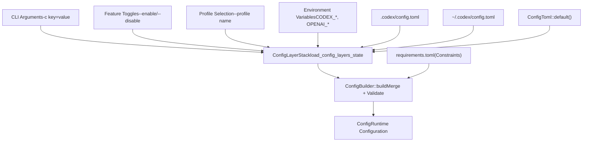
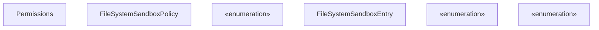
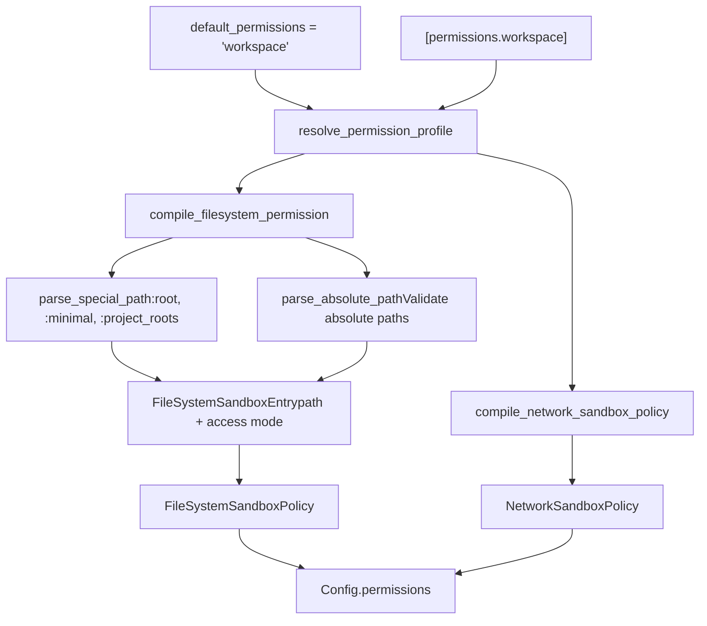
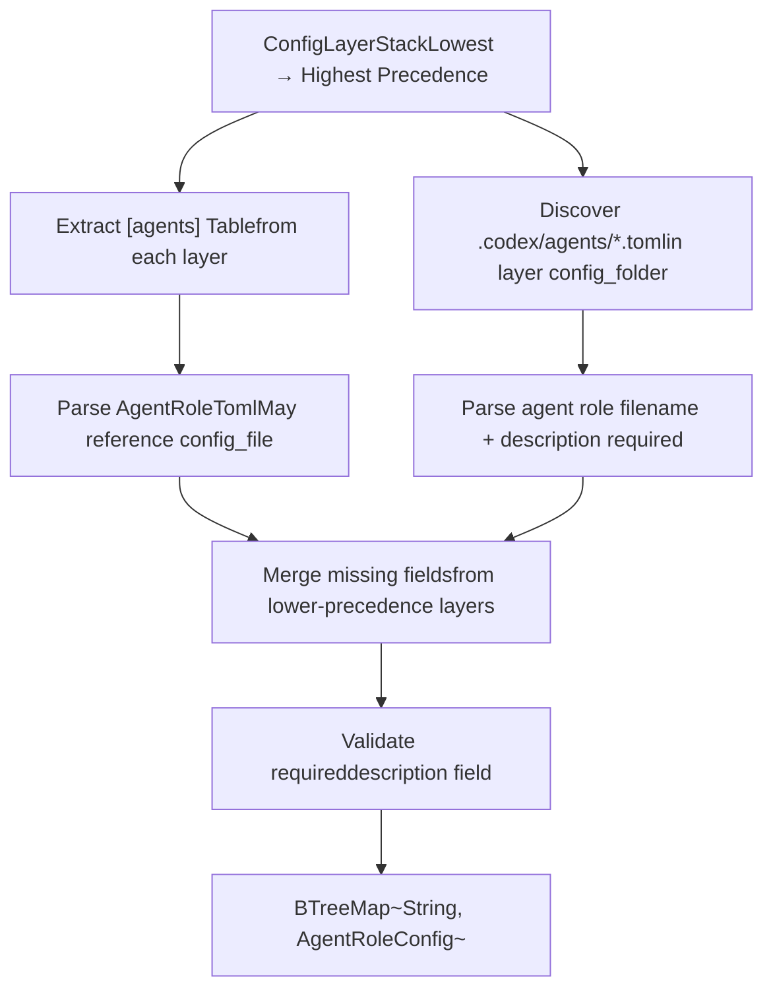

# Configuration System

Relevant source files

-   [codex-rs/Cargo.lock](https://github.com/openai/codex/blob/d807d44a/codex-rs/Cargo.lock)
-   [codex-rs/Cargo.toml](https://github.com/openai/codex/blob/d807d44a/codex-rs/Cargo.toml)
-   [codex-rs/README.md](https://github.com/openai/codex/blob/d807d44a/codex-rs/README.md?plain=1)
-   [codex-rs/app-server/src/config\_api.rs](https://github.com/openai/codex/blob/d807d44a/codex-rs/app-server/src/config_api.rs)
-   [codex-rs/app-server/tests/suite/v2/config\_rpc.rs](https://github.com/openai/codex/blob/d807d44a/codex-rs/app-server/tests/suite/v2/config_rpc.rs)
-   [codex-rs/cli/Cargo.toml](https://github.com/openai/codex/blob/d807d44a/codex-rs/cli/Cargo.toml)
-   [codex-rs/cli/src/lib.rs](https://github.com/openai/codex/blob/d807d44a/codex-rs/cli/src/lib.rs)
-   [codex-rs/cli/src/main.rs](https://github.com/openai/codex/blob/d807d44a/codex-rs/cli/src/main.rs)
-   [codex-rs/cloud-requirements/src/lib.rs](https://github.com/openai/codex/blob/d807d44a/codex-rs/cloud-requirements/src/lib.rs)
-   [codex-rs/config.md](https://github.com/openai/codex/blob/d807d44a/codex-rs/config.md?plain=1)
-   [codex-rs/config/src/cloud\_requirements.rs](https://github.com/openai/codex/blob/d807d44a/codex-rs/config/src/cloud_requirements.rs)
-   [codex-rs/config/src/config\_requirements.rs](https://github.com/openai/codex/blob/d807d44a/codex-rs/config/src/config_requirements.rs)
-   [codex-rs/config/src/lib.rs](https://github.com/openai/codex/blob/d807d44a/codex-rs/config/src/lib.rs)
-   [codex-rs/core/Cargo.toml](https://github.com/openai/codex/blob/d807d44a/codex-rs/core/Cargo.toml)
-   [codex-rs/core/config.schema.json](https://github.com/openai/codex/blob/d807d44a/codex-rs/core/config.schema.json)
-   [codex-rs/core/src/config/agent\_roles.rs](https://github.com/openai/codex/blob/d807d44a/codex-rs/core/src/config/agent_roles.rs)
-   [codex-rs/core/src/config/config\_tests.rs](https://github.com/openai/codex/blob/d807d44a/codex-rs/core/src/config/config_tests.rs)
-   [codex-rs/core/src/config/edit.rs](https://github.com/openai/codex/blob/d807d44a/codex-rs/core/src/config/edit.rs)
-   [codex-rs/core/src/config/mod.rs](https://github.com/openai/codex/blob/d807d44a/codex-rs/core/src/config/mod.rs)
-   [codex-rs/core/src/config/profile.rs](https://github.com/openai/codex/blob/d807d44a/codex-rs/core/src/config/profile.rs)
-   [codex-rs/core/src/config/service.rs](https://github.com/openai/codex/blob/d807d44a/codex-rs/core/src/config/service.rs)
-   [codex-rs/core/src/config/types.rs](https://github.com/openai/codex/blob/d807d44a/codex-rs/core/src/config/types.rs)
-   [codex-rs/core/src/config\_loader/README.md](https://github.com/openai/codex/blob/d807d44a/codex-rs/core/src/config_loader/README.md?plain=1)
-   [codex-rs/core/src/config\_loader/layer\_io.rs](https://github.com/openai/codex/blob/d807d44a/codex-rs/core/src/config_loader/layer_io.rs)
-   [codex-rs/core/src/config\_loader/macos.rs](https://github.com/openai/codex/blob/d807d44a/codex-rs/core/src/config_loader/macos.rs)
-   [codex-rs/core/src/config\_loader/mod.rs](https://github.com/openai/codex/blob/d807d44a/codex-rs/core/src/config_loader/mod.rs)
-   [codex-rs/core/src/config\_loader/tests.rs](https://github.com/openai/codex/blob/d807d44a/codex-rs/core/src/config_loader/tests.rs)
-   [codex-rs/core/src/flags.rs](https://github.com/openai/codex/blob/d807d44a/codex-rs/core/src/flags.rs)
-   [codex-rs/core/src/lib.rs](https://github.com/openai/codex/blob/d807d44a/codex-rs/core/src/lib.rs)
-   [codex-rs/core/src/model\_provider\_info.rs](https://github.com/openai/codex/blob/d807d44a/codex-rs/core/src/model_provider_info.rs)
-   [codex-rs/core/src/tools/handlers/mod.rs](https://github.com/openai/codex/blob/d807d44a/codex-rs/core/src/tools/handlers/mod.rs)
-   [codex-rs/core/src/tools/spec.rs](https://github.com/openai/codex/blob/d807d44a/codex-rs/core/src/tools/spec.rs)
-   [codex-rs/core/src/tools/spec\_tests.rs](https://github.com/openai/codex/blob/d807d44a/codex-rs/core/src/tools/spec_tests.rs)
-   [codex-rs/exec/Cargo.toml](https://github.com/openai/codex/blob/d807d44a/codex-rs/exec/Cargo.toml)
-   [codex-rs/exec/src/cli.rs](https://github.com/openai/codex/blob/d807d44a/codex-rs/exec/src/cli.rs)
-   [codex-rs/exec/src/lib.rs](https://github.com/openai/codex/blob/d807d44a/codex-rs/exec/src/lib.rs)
-   [codex-rs/tui/Cargo.toml](https://github.com/openai/codex/blob/d807d44a/codex-rs/tui/Cargo.toml)
-   [codex-rs/tui/src/cli.rs](https://github.com/openai/codex/blob/d807d44a/codex-rs/tui/src/cli.rs)
-   [codex-rs/tui/src/debug\_config.rs](https://github.com/openai/codex/blob/d807d44a/codex-rs/tui/src/debug_config.rs)
-   [codex-rs/tui/src/lib.rs](https://github.com/openai/codex/blob/d807d44a/codex-rs/tui/src/lib.rs)
-   [docs/config.md](https://github.com/openai/codex/blob/d807d44a/docs/config.md?plain=1)
-   [docs/example-config.md](https://github.com/openai/codex/blob/d807d44a/docs/example-config.md?plain=1)
-   [docs/skills.md](https://github.com/openai/codex/blob/d807d44a/docs/skills.md?plain=1)
-   [docs/slash\_commands.md](https://github.com/openai/codex/blob/d807d44a/docs/slash_commands.md?plain=1)

## Purpose and Scope

The Configuration System manages all runtime settings for Codex, including model selection, sandbox policies, feature flags, MCP server connections, and permission profiles. It implements a layered configuration model where settings from multiple sources (CLI arguments, environment variables, project files, global files, and built-in defaults) are merged with well-defined precedence rules.

For feature flag management specifically, see [Feature Flags](/openai/codex/2.3-feature-flags). For sandbox execution policies, see [Sandbox and Approval Policies](/openai/codex/2.4-sandbox-and-approval-policies).

---

## Configuration Architecture

### Configuration Sources and Precedence

Configuration is assembled from 7 layers, each with decreasing precedence:

| Priority | Layer | Source | Scope |
| --- | --- | --- | --- |
| 1 | CLI Arguments | `--enable`, `-c key=value`, `--profile` | Per-invocation |
| 2 | Feature Toggles | Runtime experimental menu, feature overrides | Session |
| 3 | Active Profile | `--profile name` or `default_profile` | Profile-scoped |
| 4 | Environment Variables | `CODEX_*`, `OPENAI_*`, `SQLITE_HOME_ENV` | Process |
| 5 | Project Config | `.codex/config.toml` in project root | Project |
| 6 | Global Config | `~/.codex/config.toml` | User |
| 7 | Built-in Defaults | Hardcoded in `ConfigToml::default()` | System |

Sources: [codex-rs/core/src/config/mod.rs546-642](https://github.com/openai/codex/blob/d807d44a/codex-rs/core/src/config/mod.rs#L546-L642) [codex-rs/core/src/config/mod.rs145-171](https://github.com/openai/codex/blob/d807d44a/codex-rs/core/src/config/mod.rs#L145-L171)

### Configuration Layer Merging


**Diagram: Configuration Layer Merging Flow**

The `ConfigLayerStack` merges TOML values from all sources using `merge_toml_values`, where higher-priority layers override lower-priority ones. The `ConfigBuilder` then validates the merged configuration against `requirements.toml` constraints (e.g., MCP server allowlists for enterprise deployments).

Sources: [codex-rs/core/src/config/mod.rs587-641](https://github.com/openai/codex/blob/d807d44a/codex-rs/core/src/config/mod.rs#L587-L641) [codex-rs/core/src/config\_loader/mod.rs31-41](https://github.com/openai/codex/blob/d807d44a/codex-rs/core/src/config_loader/mod.rs#L31-L41)

---

## ConfigBuilder and Loading Process

### ConfigBuilder Pattern

The `ConfigBuilder` provides a fluent API for constructing validated `Config` instances:


**Diagram: ConfigBuilder and Config Relationship**

### Build Process

The `ConfigBuilder::build()` method orchestrates configuration loading:

1.  **Resolve Paths**: Determine `codex_home` (via `CODEX_HOME` env or `~/.codex`) and `cwd` (from overrides or current directory). [codex-rs/core/src/config/mod.rs546-580](https://github.com/openai/codex/blob/d807d44a/codex-rs/core/src/config/mod.rs#L546-L580)
2.  **Load Layers**: Call `load_config_layers_state()` to read all configuration files and merge them into a `ConfigLayerStack`. [codex-rs/core/src/config/mod.rs587-600](https://github.com/openai/codex/blob/d807d44a/codex-rs/core/src/config/mod.rs#L587-L600)
3.  **Deserialize**: Convert merged TOML into `ConfigToml` using `AbsolutePathBufGuard` to resolve relative paths against config file locations. [codex-rs/core/src/config/mod.rs602-615](https://github.com/openai/codex/blob/d807d44a/codex-rs/core/src/config/mod.rs#L602-L615)
4.  **Apply Constraints**: Validate against `requirements.toml` using `apply_requirement_constrained_value()`. [codex-rs/core/src/config/mod.rs617-641](https://github.com/openai/codex/blob/d807d44a/codex-rs/core/src/config/mod.rs#L617-L641)
5.  **Construct Config**: Call `Config::load_config_with_layer_stack()` to build final runtime configuration. [codex-rs/core/src/config/mod.rs644-694](https://github.com/openai/codex/blob/d807d44a/codex-rs/core/src/config/mod.rs#L644-L694)

Sources: [codex-rs/core/src/config/mod.rs587-641](https://github.com/openai/codex/blob/d807d44a/codex-rs/core/src/config/mod.rs#L587-L641) [codex-rs/core/src/config/mod.rs644-694](https://github.com/openai/codex/blob/d807d44a/codex-rs/core/src/config/mod.rs#L644-L694)

---

## The Config Struct

### Primary Fields

The `Config` struct contains all runtime configuration:

| Field Category | Key Fields | Description |
| --- | --- | --- |
| **Provenance** | `config_layer_stack`, `startup_warnings` | Configuration sources and load warnings. [codex-rs/core/src/config/mod.rs163-170](https://github.com/openai/codex/blob/d807d44a/codex-rs/core/src/config/mod.rs#L163-L170) |
| **Model** | `model`, `service_tier`, `review_model`, `model_provider`, `model_reasoning_effort` | Model selection and behavior. [codex-rs/core/src/config/mod.rs215-245](https://github.com/openai/codex/blob/d807d44a/codex-rs/core/src/config/mod.rs#L215-L245) |
| **Permissions** | `permissions` | Sandbox policies, approval policies, filesystem/network access. [codex-rs/core/src/config/mod.rs175-195](https://github.com/openai/codex/blob/d807d44a/codex-rs/core/src/config/mod.rs#L175-L195) |
| **Features** | `features` | Centralized feature flag state. [codex-rs/core/src/config/mod.rs172](https://github.com/openai/codex/blob/d807d44a/codex-rs/core/src/config/mod.rs#L172-L172) |
| **Tools** | `mcp_servers`, `web_search_mode`, `web_search_config` | External tool configuration. [codex-rs/core/src/config/mod.rs340-365](https://github.com/openai/codex/blob/d807d44a/codex-rs/core/src/config/mod.rs#L340-L365) |
| **Paths** | `codex_home`, `sqlite_home`, `log_dir`, `cwd` | Filesystem locations. [codex-rs/core/src/config/mod.rs490-510](https://github.com/openai/codex/blob/d807d44a/codex-rs/core/src/config/mod.rs#L490-L510) |
| **Agents** | `agent_roles`, `agent_max_threads`, `agent_max_depth` | Multi-agent settings. [codex-rs/core/src/config/mod.rs310-335](https://github.com/openai/codex/blob/d807d44a/codex-rs/core/src/config/mod.rs#L310-L335) |
| **UI** | `tui_alternate_screen`, `tui_theme`, `tui_status_line` | TUI preferences. [codex-rs/core/src/config/mod.rs370-400](https://github.com/openai/codex/blob/d807d44a/codex-rs/core/src/config/mod.rs#L370-L400) |
| **Memories** | `memories` | Memory subsystem configuration. [codex-rs/core/src/config/mod.rs450-465](https://github.com/openai/codex/blob/d807d44a/codex-rs/core/src/config/mod.rs#L450-L465) |

Sources: [codex-rs/core/src/config/mod.rs163-544](https://github.com/openai/codex/blob/d807d44a/codex-rs/core/src/config/mod.rs#L163-L544)

### Permissions Substructure

The `Permissions` field contains all security-related settings:


**Diagram: Permissions Configuration Structure**

Sources: [codex-rs/core/src/config/mod.rs163-195](https://github.com/openai/codex/blob/d807d44a/codex-rs/core/src/config/mod.rs#L163-L195) [codex-rs/core/src/config/permissions.rs125-130](https://github.com/openai/codex/blob/d807d44a/codex-rs/core/src/config/permissions.rs#L125-L130)

---

## Configuration Profiles

### Profile Definition

Configuration profiles group related settings that can be activated together via `--profile name` or the `default_profile` setting. [codex-rs/core/src/config/profile.rs17-78](https://github.com/openai/codex/blob/d807d44a/codex-rs/core/src/config/profile.rs#L17-L78)


**Diagram: Configuration Profile Structure**

Profile settings take precedence over global config but are overridden by CLI arguments. Profiles enable quick switching between development and production configurations or between different model providers.

Sources: [codex-rs/core/src/config/profile.rs1-78](https://github.com/openai/codex/blob/d807d44a/codex-rs/core/src/config/profile.rs#L1-L78)

### Profile Application Example

```
# ~/.codex/config.tomldefault_profile = "dev" [profiles.dev]model = "gpt-4o"approval_policy = "on-request"sandbox_mode = "workspace-write" [profiles.prod]model = "gpt-4o-mini"approval_policy = "never"sandbox_mode = "read-only"
```
Activate with `codex --profile prod` or set `default_profile = "prod"`.

Sources: [codex-rs/core/src/config/profile.rs17-63](https://github.com/openai/codex/blob/d807d44a/codex-rs/core/src/config/profile.rs#L17-L63)

---

## Feature Flag System

Feature flags control experimental and optional functionality. See [Feature Flags](/openai/codex/2.3-feature-flags) for full details on the lifecycle and management.

### Feature Storage in Config


**Diagram: Feature Flag Configuration Integration**

### Feature Loading Order

1.  Start with `Features::with_defaults()` (built-in default states from `FEATURES` array). [codex-rs/core/src/features.rs395](https://github.com/openai/codex/blob/d807d44a/codex-rs/core/src/features.rs#L395-L395)
2.  Apply legacy toggles from `ConfigToml` (e.g., `experimental_use_unified_exec_tool`). [codex-rs/core/src/features.rs400](https://github.com/openai/codex/blob/d807d44a/codex-rs/core/src/features.rs#L400-L400)
3.  Apply `[features]` table from global config. [codex-rs/core/src/features.rs405](https://github.com/openai/codex/blob/d807d44a/codex-rs/core/src/features.rs#L405-L405)
4.  Apply legacy toggles from active `ConfigProfile`. [codex-rs/core/src/features.rs410](https://github.com/openai/codex/blob/d807d44a/codex-rs/core/src/features.rs#L410-L410)
5.  Apply `[features]` table from active profile. [codex-rs/core/src/features.rs415](https://github.com/openai/codex/blob/d807d44a/codex-rs/core/src/features.rs#L415-L415)
6.  Apply `FeatureOverrides` from code (e.g., for `codex exec` mode). [codex-rs/core/src/features.rs420](https://github.com/openai/codex/blob/d807d44a/codex-rs/core/src/features.rs#L420-L420)
7.  Normalize dependencies (e.g., `spawn_csv` requires `collab`). [codex-rs/core/src/features.rs430](https://github.com/openai/codex/blob/d807d44a/codex-rs/core/src/features.rs#L430-L430)

Sources: [codex-rs/core/src/features.rs390-439](https://github.com/openai/codex/blob/d807d44a/codex-rs/core/src/features.rs#L390-L439)

---

## Permissions System

### Permission Profiles

Permission profiles define filesystem and network access policies that can be referenced by name. [codex-rs/core/src/config/permissions.rs125-130](https://github.com/openai/codex/blob/d807d44a/codex-rs/core/src/config/permissions.rs#L125-L130)

```
# ~/.codex/config.tomldefault_permissions = "workspace" [permissions.workspace.filesystem]":minimal" = "read" [permissions.workspace.filesystem.":project_roots"]"." = "write""docs" = "read" [permissions.workspace.network]enabled = trueproxy_url = "http://127.0.0.1:43128"allowed_domains = ["openai.com"]
```
Sources: [codex-rs/core/src/config/permissions.rs21-136](https://github.com/openai/codex/blob/d807d44a/codex-rs/core/src/config/permissions.rs#L21-L136)

### Permission Profile Compilation


**Diagram: Permission Profile Compilation Flow**

The `compile_permission_profile()` function resolves named profiles into concrete policies:

1.  **Lookup Profile**: Find profile by name in `PermissionsToml.entries`. [codex-rs/core/src/config/permissions.rs150](https://github.com/openai/codex/blob/d807d44a/codex-rs/core/src/config/permissions.rs#L150-L150)
2.  **Compile Filesystem Entries**: Parse each filesystem entry (`:special` paths or absolute paths) into `FileSystemSandboxEntry`. [codex-rs/core/src/config/permissions.rs160](https://github.com/openai/codex/blob/d807d44a/codex-rs/core/src/config/permissions.rs#L160-L160)
3.  **Compile Network Policy**: Convert `NetworkToml.enabled` into `NetworkSandboxPolicy`. [codex-rs/core/src/config/permissions.rs180](https://github.com/openai/codex/blob/d807d44a/codex-rs/core/src/config/permissions.rs#L180-L180)
4.  **Construct Proxy Config**: If network enabled, build `NetworkProxySpec` from proxy settings. [codex-rs/core/src/config/permissions.rs190](https://github.com/openai/codex/blob/d807d44a/codex-rs/core/src/config/permissions.rs#L190-L190)
5.  **Project Legacy Policy**: Convert modern policy back to legacy `SandboxPolicy` for compatibility. [codex-rs/core/src/config/permissions.rs200](https://github.com/openai/codex/blob/d807d44a/codex-rs/core/src/config/permissions.rs#L200-L200)

Sources: [codex-rs/core/src/config/permissions.rs147-225](https://github.com/openai/codex/blob/d807d44a/codex-rs/core/src/config/permissions.rs#L147-L225) [codex-rs/core/src/config/mod.rs1450-1585](https://github.com/openai/codex/blob/d807d44a/codex-rs/core/src/config/mod.rs#L1450-L1585)

### Special Filesystem Paths

Special paths provide symbolic references that resolve at runtime:

| Special Path | Resolves To | Description |
| --- | --- | --- |
| `:root` | `/` (Unix) or drive roots (Windows) | Full filesystem access. [codex-rs/protocol/src/permissions.rs75](https://github.com/openai/codex/blob/d807d44a/codex-rs/protocol/src/permissions.rs#L75-L75) |
| `:minimal` | Platform-specific safe paths | Shell config, common libraries. [codex-rs/protocol/src/permissions.rs80](https://github.com/openai/codex/blob/d807d44a/codex-rs/protocol/src/permissions.rs#L80-L80) |
| `:project_roots` | Git repo roots or cwd | Project workspace roots. [codex-rs/protocol/src/permissions.rs85](https://github.com/openai/codex/blob/d807d44a/codex-rs/protocol/src/permissions.rs#L85-L85) |
| `:project_roots."subpath"` | `<project_root>/subpath` | Scoped project subpath. [codex-rs/protocol/src/permissions.rs90](https://github.com/openai/codex/blob/d807d44a/codex-rs/protocol/src/permissions.rs#L90-L90) |
| `:tmpdir` | `$TMPDIR` or `/tmp` | Temporary directory. [codex-rs/protocol/src/permissions.rs95](https://github.com/openai/codex/blob/d807d44a/codex-rs/protocol/src/permissions.rs#L95-L95) |
| `:slash_tmp` | `/tmp` | Unix temporary directory. [codex-rs/protocol/src/permissions.rs100](https://github.com/openai/codex/blob/d807d44a/codex-rs/protocol/src/permissions.rs#L100-L100) |

Sources: [codex-rs/core/src/config/permissions.rs275-289](https://github.com/openai/codex/blob/d807d44a/codex-rs/core/src/config/permissions.rs#L275-L289) [codex-rs/protocol/src/permissions.rs74-115](https://github.com/openai/codex/blob/d807d44a/codex-rs/protocol/src/permissions.rs#L74-L115)

---

## MCP Server Configuration

### MCP Server Definition

MCP servers are defined in `[mcp_servers.<name>]` tables with transport-specific fields. [codex-rs/core/src/config/types.rs63-237](https://github.com/openai/codex/blob/d807d44a/codex-rs/core/src/config/types.rs#L63-L237)

```
# ~/.codex/config.toml[mcp_servers.filesystem]command = "npx"args = ["-y", "@modelcontextprotocol/server-filesystem", "/home/user/data"]enabled = truestartup_timeout_sec = 30.0enabled_tools = ["read_file", "write_file"]
```
Sources: [codex-rs/core/src/config/types.rs63-237](https://github.com/openai/codex/blob/d807d44a/codex-rs/core/src/config/types.rs#L63-L237)

### MCP Transport Types


**Diagram: MCP Server Configuration Structure**

Sources: [codex-rs/core/src/config/types.rs63-120](https://github.com/openai/codex/blob/d807d44a/codex-rs/core/src/config/types.rs#L63-L120)

---

## Configuration Editing and Persistence

### ConfigEdit Operations

The `ConfigEdit` enum defines atomic configuration mutations. [codex-rs/core/src/config/edit.rs22-60](https://github.com/openai/codex/blob/d807d44a/codex-rs/core/src/config/edit.rs#L22-L60)


**Diagram: Configuration Editing Architecture**

### Edit Application Process

1.  **Load Document**: Read `config.toml` as `toml_edit::DocumentMut` to preserve formatting. [codex-rs/core/src/config/edit.rs625](https://github.com/openai/codex/blob/d807d44a/codex-rs/core/src/config/edit.rs#L625-L625)
2.  **Apply Edits**: Call `ConfigDocument::apply()` for each edit. [codex-rs/core/src/config/edit.rs640](https://github.com/openai/codex/blob/d807d44a/codex-rs/core/src/config/edit.rs#L640-L640)
    -   `SetPath` / `ClearPath`: Navigate segments, insert/remove value. [codex-rs/core/src/config/edit.rs400](https://github.com/openai/codex/blob/d807d44a/codex-rs/core/src/config/edit.rs#L400-L400)
    -   `SetModel`: Write to profile if active, else global scope. [codex-rs/core/src/config/edit.rs320](https://github.com/openai/codex/blob/d807d44a/codex-rs/core/src/config/edit.rs#L320-L320)
    -   `ReplaceMcpServers`: Serialize MCP configs, replace entire `[mcp_servers]` table. [codex-rs/core/src/config/edit.rs350](https://github.com/openai/codex/blob/d807d44a/codex-rs/core/src/config/edit.rs#L350-L350)
3.  **Write Atomically**: Use `write_atomically()` to prevent corruption. [codex-rs/core/src/config/edit.rs675](https://github.com/openai/codex/blob/d807d44a/codex-rs/core/src/config/edit.rs#L675-L675)

Sources: [codex-rs/core/src/config/edit.rs22-60](https://github.com/openai/codex/blob/d807d44a/codex-rs/core/src/config/edit.rs#L22-L60) [codex-rs/core/src/config/edit.rs314-432](https://github.com/openai/codex/blob/d807d44a/codex-rs/core/src/config/edit.rs#L314-L432)

---

## Agent Roles Configuration

### Role Discovery and Declaration

Agent roles can be declared explicitly in `[agents.<role_name>]` tables or auto-discovered from `.codex/agents/*.toml` files. [codex-rs/core/src/config/agent\_roles.rs18-106](https://github.com/openai/codex/blob/d807d44a/codex-rs/core/src/config/agent_roles.rs#L18-L106)

```
# ~/.codex/config.toml[agents]max_threads = 6max_depth = 1 [agents.researcher]description = "Research and summarize technical topics"config_file = "~/.codex/agents/researcher.toml"
```
Sources: [codex-rs/core/src/config/agent\_roles.rs18-106](https://github.com/openai/codex/blob/d807d44a/codex-rs/core/src/config/agent_roles.rs#L18-L106)

### Role Loading Process


**Diagram: Agent Role Loading and Merging**

Sources: [codex-rs/core/src/config/agent\_roles.rs17-106](https://github.com/openai/codex/blob/d807d44a/codex-rs/core/src/config/agent_roles.rs#L17-L106) [codex-rs/core/src/config/agent\_roles.rs212-305](https://github.com/openai/codex/blob/d807d44a/codex-rs/core/src/config/agent_roles.rs#L212-L305)

---

## Configuration Schema and Validation

### JSON Schema Generation

The configuration schema is generated from Rust types using `schemars`. [codex-rs/core/Cargo.toml13-14](https://github.com/openai/codex/blob/d807d44a/codex-rs/core/Cargo.toml#L13-L14)

```
// codex-rs/core/src/config/schema.rspub fn generate_config_schema() -> serde_json::Value {    let gen = SchemaGenerator::default();    gen.into_root_schema_for::<ConfigToml>()}
```
The schema file `codex-rs/core/config.schema.json` is used for IDE autocompletion and runtime validation.

Sources: [codex-rs/core/config.schema.json1-10](https://github.com/openai/codex/blob/d807d44a/codex-rs/core/config.schema.json#L1-L10) [codex-rs/core/src/config/schema.rs1-10](https://github.com/openai/codex/blob/d807d44a/codex-rs/core/src/config/schema.rs#L1-L10)

---

## Key Configuration Utilities

### Finding Codex Home

```
pub fn find_codex_home() -> std::io::Result<PathBuf> {    std::env::var_os("CODEX_HOME")        .map(PathBuf::from)        .or_else(|| dirs::home_dir().map(|h| h.join(".codex")))        .ok_or_else(|| std::io::Error::new(            std::io::ErrorKind::NotFound,            "could not determine CODEX_HOME"        ))}
```
Sources: [codex-rs/core/src/config/mod.rs138-151](https://github.com/openai/codex/blob/d807d44a/codex-rs/core/src/config/mod.rs#L138-L151)

### SQLite Home Resolution

SQLite state database location follows this precedence:

1.  `CODEX_SQLITE_HOME` environment variable. [codex-rs/core/src/config/mod.rs172](https://github.com/openai/codex/blob/d807d44a/codex-rs/core/src/config/mod.rs#L172-L172)
2.  `WorkspaceWrite` mode: temp directory (per-session isolation). [docs/config.md33-37](https://github.com/openai/codex/blob/d807d44a/docs/config.md?plain=1#L33-L37)
3.  Other modes: `CODEX_HOME` (persistent state). [docs/config.md33-37](https://github.com/openai/codex/blob/d807d44a/docs/config.md?plain=1#L33-L37)

Sources: [codex-rs/core/src/config/mod.rs139-151](https://github.com/openai/codex/blob/d807d44a/codex-rs/core/src/config/mod.rs#L139-L151) [docs/config.md33-37](https://github.com/openai/codex/blob/d807d44a/docs/config.md?plain=1#L33-L37)

---

## Configuration File Locations

| File | Purpose | Schema |
| --- | --- | --- |
| `~/.codex/config.toml` | Global user configuration | Full `ConfigToml` |
| `.codex/config.toml` | Project-specific overrides | Full `ConfigToml` |
| `~/.codex/agents/*.toml` | Agent role definitions | `RawAgentRoleFileToml` |
| `requirements.toml` | Enterprise constraints | Cloud-provided |

Sources: [codex-rs/core/src/config/mod.rs137](https://github.com/openai/codex/blob/d807d44a/codex-rs/core/src/config/mod.rs#L137-L137) [docs/config.md1-11](https://github.com/openai/codex/blob/d807d44a/docs/config.md?plain=1#L1-L11)
