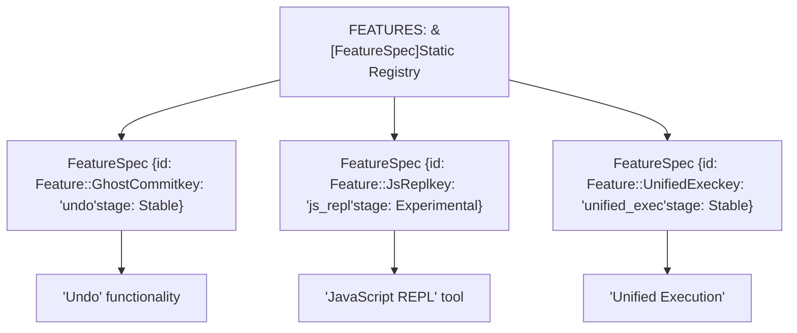
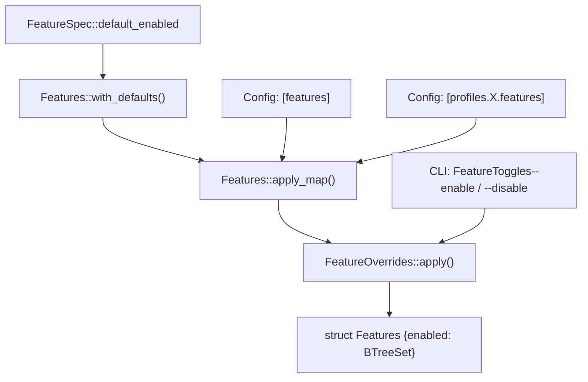
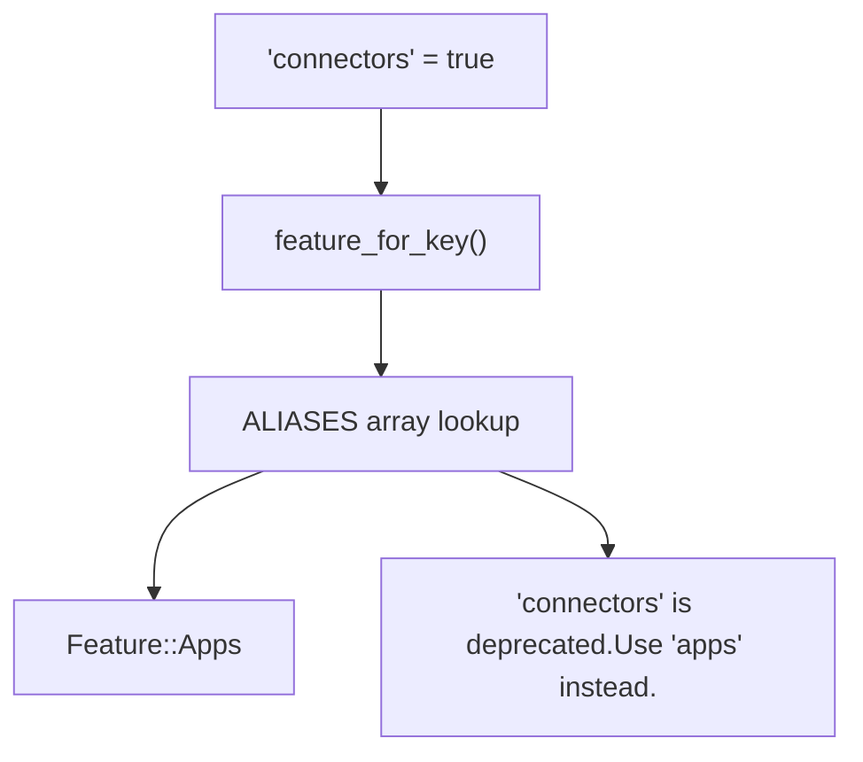

# Feature Flags

Relevant source files

-   [codex-rs/Cargo.lock](https://github.com/openai/codex/blob/d807d44a/codex-rs/Cargo.lock)
-   [codex-rs/Cargo.toml](https://github.com/openai/codex/blob/d807d44a/codex-rs/Cargo.toml)
-   [codex-rs/README.md](https://github.com/openai/codex/blob/d807d44a/codex-rs/README.md?plain=1)
-   [codex-rs/cli/Cargo.toml](https://github.com/openai/codex/blob/d807d44a/codex-rs/cli/Cargo.toml)
-   [codex-rs/cli/src/lib.rs](https://github.com/openai/codex/blob/d807d44a/codex-rs/cli/src/lib.rs)
-   [codex-rs/cli/src/main.rs](https://github.com/openai/codex/blob/d807d44a/codex-rs/cli/src/main.rs)
-   [codex-rs/config.md](https://github.com/openai/codex/blob/d807d44a/codex-rs/config.md?plain=1)
-   [codex-rs/core/Cargo.toml](https://github.com/openai/codex/blob/d807d44a/codex-rs/core/Cargo.toml)
-   [codex-rs/core/config.schema.json](https://github.com/openai/codex/blob/d807d44a/codex-rs/core/config.schema.json)
-   [codex-rs/core/src/config/agent\_roles.rs](https://github.com/openai/codex/blob/d807d44a/codex-rs/core/src/config/agent_roles.rs)
-   [codex-rs/core/src/config/config\_tests.rs](https://github.com/openai/codex/blob/d807d44a/codex-rs/core/src/config/config_tests.rs)
-   [codex-rs/core/src/config/edit.rs](https://github.com/openai/codex/blob/d807d44a/codex-rs/core/src/config/edit.rs)
-   [codex-rs/core/src/config/mod.rs](https://github.com/openai/codex/blob/d807d44a/codex-rs/core/src/config/mod.rs)
-   [codex-rs/core/src/config/profile.rs](https://github.com/openai/codex/blob/d807d44a/codex-rs/core/src/config/profile.rs)
-   [codex-rs/core/src/config/types.rs](https://github.com/openai/codex/blob/d807d44a/codex-rs/core/src/config/types.rs)
-   [codex-rs/core/src/flags.rs](https://github.com/openai/codex/blob/d807d44a/codex-rs/core/src/flags.rs)
-   [codex-rs/core/src/lib.rs](https://github.com/openai/codex/blob/d807d44a/codex-rs/core/src/lib.rs)
-   [codex-rs/core/src/model\_provider\_info.rs](https://github.com/openai/codex/blob/d807d44a/codex-rs/core/src/model_provider_info.rs)
-   [codex-rs/core/src/tools/handlers/mod.rs](https://github.com/openai/codex/blob/d807d44a/codex-rs/core/src/tools/handlers/mod.rs)
-   [codex-rs/core/src/tools/spec.rs](https://github.com/openai/codex/blob/d807d44a/codex-rs/core/src/tools/spec.rs)
-   [codex-rs/core/src/tools/spec\_tests.rs](https://github.com/openai/codex/blob/d807d44a/codex-rs/core/src/tools/spec_tests.rs)
-   [codex-rs/exec/Cargo.toml](https://github.com/openai/codex/blob/d807d44a/codex-rs/exec/Cargo.toml)
-   [codex-rs/exec/src/cli.rs](https://github.com/openai/codex/blob/d807d44a/codex-rs/exec/src/cli.rs)
-   [codex-rs/exec/src/lib.rs](https://github.com/openai/codex/blob/d807d44a/codex-rs/exec/src/lib.rs)
-   [codex-rs/tui/Cargo.toml](https://github.com/openai/codex/blob/d807d44a/codex-rs/tui/Cargo.toml)
-   [codex-rs/tui/src/cli.rs](https://github.com/openai/codex/blob/d807d44a/codex-rs/tui/src/cli.rs)
-   [codex-rs/tui/src/lib.rs](https://github.com/openai/codex/blob/d807d44a/codex-rs/tui/src/lib.rs)
-   [docs/config.md](https://github.com/openai/codex/blob/d807d44a/docs/config.md?plain=1)
-   [docs/example-config.md](https://github.com/openai/codex/blob/d807d44a/docs/example-config.md?plain=1)
-   [docs/skills.md](https://github.com/openai/codex/blob/d807d44a/docs/skills.md?plain=1)
-   [docs/slash\_commands.md](https://github.com/openai/codex/blob/d807d44a/docs/slash_commands.md?plain=1)

This document describes the feature flag system used throughout Codex to gate experimental, optional, and platform-specific functionality. Feature flags enable progressive feature rollout through well-defined lifecycle stages and provide users with fine-grained control over which capabilities are active in their sessions.

For information about configuring individual features, see the configuration reference documentation. For details on how features integrate with profiles and config layers, see [Configuration System (2.2)](https://github.com/openai/codex/blob/d807d44a/Configuration System (2.2))

---

## Overview

The feature flag system centralizes toggles for experimental and optional behavior across the codebase. Instead of scattering boolean configuration fields throughout multiple modules, Codex defines all features in a single registry (`FEATURES` array) with consistent metadata including lifecycle stage, default state, and canonical key.

Features are managed through the `Features` struct [codex-rs/core/src/flags.rs223-227](https://github.com/openai/codex/blob/d807d44a/codex-rs/core/src/flags.rs#L223-L227) which maintains an enabled set and tracks legacy usage patterns for deprecation warnings. The system supports multiple configuration sources with well-defined precedence, automatic dependency resolution, and graceful handling of deprecated feature keys.

**Sources:** [codex-rs/core/src/flags.rs1-920](https://github.com/openai/codex/blob/d807d44a/codex-rs/core/src/flags.rs#L1-L920)

---

## Feature Lifecycle Stages

Each feature progresses through a defined lifecycle, represented by the `Stage` enum [codex-rs/core/src/flags.rs29-74](https://github.com/openai/codex/blob/d807d44a/codex-rs/core/src/flags.rs#L29-L74) The stage determines visibility, stability guarantees, and user-facing presentation.

### Feature Lifecycle State Machine

Title: Feature Flag Lifecycle Stages

> **[Mermaid stateDiagram]**
> *(图表结构无法解析)*

### Stage Definitions

| Stage | Visibility | Default State | Purpose |
| --- | --- | --- | --- |
| `UnderDevelopment` | Internal only | `false` | Active development, not ready for external use |
| `Experimental` | `/experimental` menu | `false` | User-facing but unstable, opt-in required |
| `Stable` | Standard config | Varies | Production-ready, may be enabled by default |
| `Deprecated` | Standard config | `false` | Superseded, warns users to migrate |
| `Removed` | Config compat | `false` | No-op retained for config backwards compatibility |

**Sources:** [codex-rs/core/src/flags.rs29-74](https://github.com/openai/codex/blob/d807d44a/codex-rs/core/src/flags.rs#L29-L74)

---

## Feature Registry

All features are defined in the `FEATURES` array [codex-rs/core/src/flags.rs515-864](https://github.com/openai/codex/blob/d807d44a/codex-rs/core/src/flags.rs#L515-L864) a compile-time registry mapping `Feature` enum variants to their metadata via `FeatureSpec` structs.

### Code Entity Mapping: Feature Registry

Title: Mapping Feature Enums to Registry Metadata


### FeatureSpec Structure

Each `FeatureSpec` [codex-rs/core/src/flags.rs76-191](https://github.com/openai/codex/blob/d807d44a/codex-rs/core/src/flags.rs#L76-L191) contains:

-   **`id`**: The `Feature` enum variant.
-   **`key`**: Canonical string key used in `config.toml` (e.g., `"js_repl"`).
-   **`stage`**: Current lifecycle stage (e.g., `Stage::Stable`).
-   **`default_enabled`**: Whether the feature is enabled by default (often platform-conditional).

**Example registry entries:**

-   `Feature::GhostCommit`: key `"undo"`, stage `Stable`, default `false` [codex-rs/core/src/flags.rs530-535](https://github.com/openai/codex/blob/d807d44a/codex-rs/core/src/flags.rs#L530-L535)
-   `Feature::UnifiedExec`: key `"unified_exec"`, stage `Stable`, default `!cfg!(windows)` [codex-rs/core/src/flags.rs640-645](https://github.com/openai/codex/blob/d807d44a/codex-rs/core/src/flags.rs#L640-L645)

**Sources:** [codex-rs/core/src/flags.rs506-864](https://github.com/openai/codex/blob/d807d44a/codex-rs/core/src/flags.rs#L506-L864) [codex-rs/core/src/flags.rs76-191](https://github.com/openai/codex/blob/d807d44a/codex-rs/core/src/flags.rs#L76-L191)

---

## Configuration Sources and Precedence

Features can be toggled through multiple configuration sources, merged with well-defined precedence. The system respects the standard config layering described in [Configuration System (2.2)](https://github.com/openai/codex/blob/d807d44a/Configuration System (2.2))

### Data Flow: Feature Toggle Merging

Title: Feature Flag Configuration Precedence


### Configuration Examples

**Top-level features table in `config.toml`:**

```
[features]js_repl = trueunified_exec = false
```
**CLI override:**

```
codex --enable js_repl --disable unified_exec
```
The final effective feature set is computed in `Features::from_config()` [codex-rs/core/src/flags.rs390-424](https://github.com/openai/codex/blob/d807d44a/codex-rs/core/src/flags.rs#L390-L424) which merges these layers in order.

**Sources:** [codex-rs/core/src/flags.rs253-266](https://github.com/openai/codex/blob/d807d44a/codex-rs/core/src/flags.rs#L253-L266) [codex-rs/core/src/flags.rs390-424](https://github.com/openai/codex/blob/d807d44a/codex-rs/core/src/flags.rs#L390-L424) [codex-rs/core/src/config/mod.rs64-68](https://github.com/openai/codex/blob/d807d44a/codex-rs/core/src/config/mod.rs#L64-L68)

---

## Runtime Feature Detection

Code checks feature state through the `Features` struct methods. The most common pattern is `features.enabled(Feature::X)`.

### Basic Feature Checks

```
// In codex-rs/core/src/tools/spec.rsif features.enabled(Feature::JsRepl) {    // Add JS REPL tools to registry}
```
### Conditional Feature Checks

Some features require additional runtime conditions, such as authentication:

-   **Apps feature**: Requires `Feature::Apps` flag AND ChatGPT authentication [codex-rs/core/src/flags.rs272-291](https://github.com/openai/codex/blob/d807d44a/codex-rs/core/src/flags.rs#L272-L291)

**Sources:** [codex-rs/core/src/flags.rs268-305](https://github.com/openai/codex/blob/d807d44a/codex-rs/core/src/flags.rs#L268-L305) [codex-rs/core/src/tools/spec.rs33-34](https://github.com/openai/codex/blob/d807d44a/codex-rs/core/src/tools/spec.rs#L33-L34)

---

## Legacy Feature Support

The feature system maintains backwards compatibility for renamed or restructured feature keys through the `ALIASES` array [codex-rs/core/src/flags.rs441-471](https://github.com/openai/codex/blob/d807d44a/codex-rs/core/src/flags.rs#L441-L471)

### Legacy Key Mapping

Title: Resolving Legacy Feature Keys to Modern Enums


### Common Legacy Aliases

| Legacy Key | Current Feature | Context |
| --- | --- | --- |
| `connectors` | `Feature::Apps` | Renamed for clarity [codex-rs/core/src/flags.rs445-448](https://github.com/openai/codex/blob/d807d44a/codex-rs/core/src/flags.rs#L445-L448) |
| `web_search` | `Feature::WebSearchRequest` | Replaced by structured config [codex-rs/core/src/flags.rs465-468](https://github.com/openai/codex/blob/d807d44a/codex-rs/core/src/flags.rs#L465-L468) |

**Sources:** [codex-rs/core/src/flags.rs441-471](https://github.com/openai/codex/blob/d807d44a/codex-rs/core/src/flags.rs#L441-L471)

---

## Experimental Menu Integration

Features with `Stage::Experimental` are surfaced in the TUI's `/experimental` command menu.

-   **`experimental_menu_name()`**: Returns the display name for the UI [codex-rs/core/src/flags.rs49-55](https://github.com/openai/codex/blob/d807d44a/codex-rs/core/src/flags.rs#L49-L55)
-   **`experimental_menu_description()`**: Returns help text for the UI [codex-rs/core/src/flags.rs57-63](https://github.com/openai/codex/blob/d807d44a/codex-rs/core/src/flags.rs#L57-L63)

**Example:** The `JsRepl` feature provides a detailed menu description regarding Node.js requirements [codex-rs/core/src/flags.rs550-556](https://github.com/openai/codex/blob/d807d44a/codex-rs/core/src/flags.rs#L550-L556)

**Sources:** [codex-rs/core/src/flags.rs29-74](https://github.com/openai/codex/blob/d807d44a/codex-rs/core/src/flags.rs#L29-L74) [codex-rs/core/src/flags.rs550-556](https://github.com/openai/codex/blob/d807d44a/codex-rs/core/src/flags.rs#L550-L556)

---

## Unstable Feature Warnings

When any `Stage::UnderDevelopment` features are enabled, the system emits a warning event [codex-rs/core/src/flags.rs866-915](https://github.com/openai/codex/blob/d807d44a/codex-rs/core/src/flags.rs#L866-L915) This informs users that the feature is incomplete and may behave unpredictably. This warning can be suppressed via the `suppress_unstable_features_warning` config option [codex-rs/core/src/flags.rs871-873](https://github.com/openai/codex/blob/d807d44a/codex-rs/core/src/flags.rs#L871-L873)

**Sources:** [codex-rs/core/src/flags.rs866-915](https://github.com/openai/codex/blob/d807d44a/codex-rs/core/src/flags.rs#L866-L915)

---

## Telemetry Integration

The system tracks feature usage by emitting metrics when a feature's state differs from its default [codex-rs/core/src/flags.rs336-352](https://github.com/openai/codex/blob/d807d44a/codex-rs/core/src/flags.rs#L336-L352)

```
// codex-rs/core/src/flags.rs:341-350if self.enabled(feature.id) != feature.default_enabled {    otel.counter(        "codex.feature.state",        1,        &[            ("feature", feature.key),            ("value", &self.enabled(feature.id).to_string()),        ],    );}
```
**Sources:** [codex-rs/core/src/flags.rs336-352](https://github.com/openai/codex/blob/d807d44a/codex-rs/core/src/flags.rs#L336-L352)
