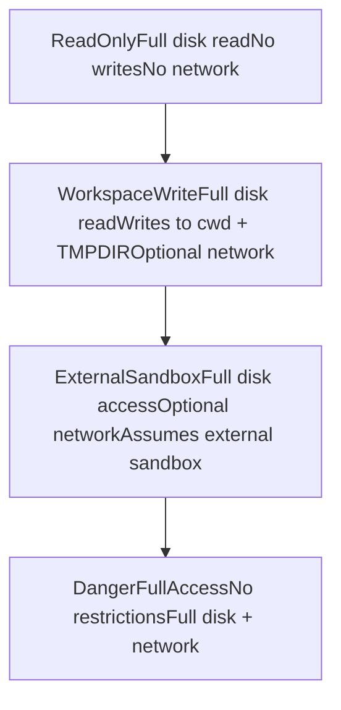
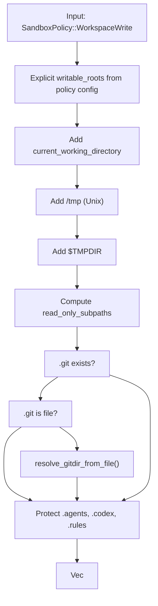
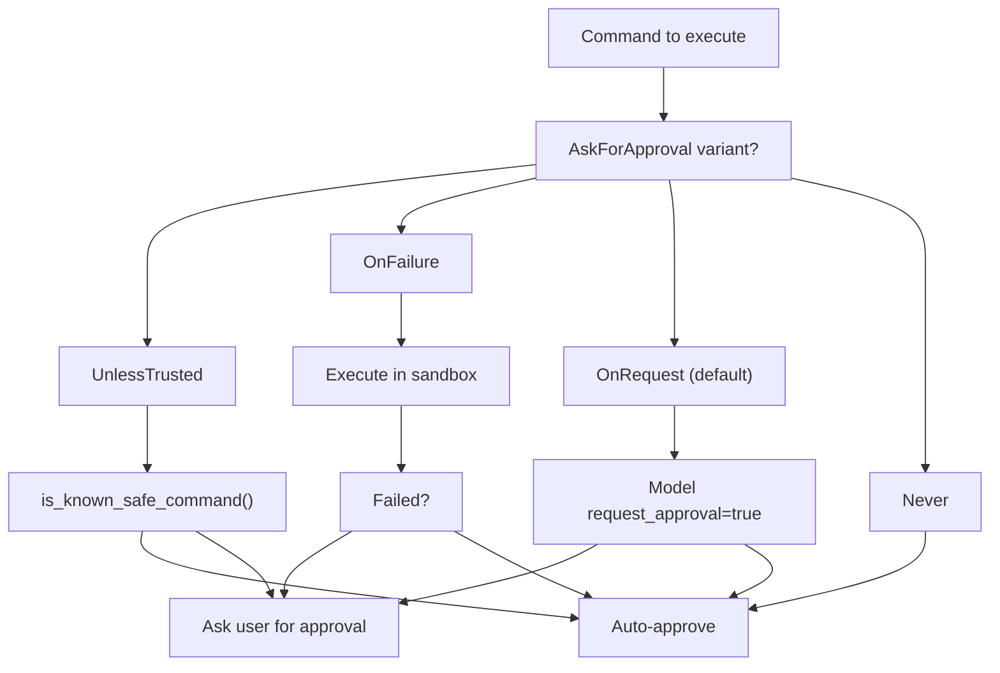

# Sandbox and Approval Policies

Relevant source files

-   [codex-rs/core/config.schema.json](https://github.com/openai/codex/blob/d807d44a/codex-rs/core/config.schema.json)
-   [codex-rs/core/src/config/agent\_roles.rs](https://github.com/openai/codex/blob/d807d44a/codex-rs/core/src/config/agent_roles.rs)
-   [codex-rs/core/src/config/config\_tests.rs](https://github.com/openai/codex/blob/d807d44a/codex-rs/core/src/config/config_tests.rs)
-   [codex-rs/core/src/config/edit.rs](https://github.com/openai/codex/blob/d807d44a/codex-rs/core/src/config/edit.rs)
-   [codex-rs/core/src/config/mod.rs](https://github.com/openai/codex/blob/d807d44a/codex-rs/core/src/config/mod.rs)
-   [codex-rs/core/src/config/permissions.rs](https://github.com/openai/codex/blob/d807d44a/codex-rs/core/src/config/permissions.rs)
-   [codex-rs/core/src/config/permissions\_tests.rs](https://github.com/openai/codex/blob/d807d44a/codex-rs/core/src/config/permissions_tests.rs)
-   [codex-rs/core/src/config/profile.rs](https://github.com/openai/codex/blob/d807d44a/codex-rs/core/src/config/profile.rs)
-   [codex-rs/core/src/config/types.rs](https://github.com/openai/codex/blob/d807d44a/codex-rs/core/src/config/types.rs)
-   [codex-rs/core/src/exec\_policy.rs](https://github.com/openai/codex/blob/d807d44a/codex-rs/core/src/exec_policy.rs)
-   [codex-rs/core/src/exec\_policy\_tests.rs](https://github.com/openai/codex/blob/d807d44a/codex-rs/core/src/exec_policy_tests.rs)
-   [codex-rs/core/src/seatbelt\_tests.rs](https://github.com/openai/codex/blob/d807d44a/codex-rs/core/src/seatbelt_tests.rs)
-   [codex-rs/core/src/tasks/review.rs](https://github.com/openai/codex/blob/d807d44a/codex-rs/core/src/tasks/review.rs)
-   [codex-rs/core/src/tools/handlers/mod.rs](https://github.com/openai/codex/blob/d807d44a/codex-rs/core/src/tools/handlers/mod.rs)
-   [codex-rs/core/src/tools/spec.rs](https://github.com/openai/codex/blob/d807d44a/codex-rs/core/src/tools/spec.rs)
-   [codex-rs/core/src/tools/spec\_tests.rs](https://github.com/openai/codex/blob/d807d44a/codex-rs/core/src/tools/spec_tests.rs)
-   [codex-rs/core/tests/suite/approvals.rs](https://github.com/openai/codex/blob/d807d44a/codex-rs/core/tests/suite/approvals.rs)
-   [codex-rs/core/tests/suite/codex\_delegate.rs](https://github.com/openai/codex/blob/d807d44a/codex-rs/core/tests/suite/codex_delegate.rs)
-   [codex-rs/core/tests/suite/otel.rs](https://github.com/openai/codex/blob/d807d44a/codex-rs/core/tests/suite/otel.rs)
-   [codex-rs/core/tests/suite/review.rs](https://github.com/openai/codex/blob/d807d44a/codex-rs/core/tests/suite/review.rs)
-   [codex-rs/protocol/src/permissions.rs](https://github.com/openai/codex/blob/d807d44a/codex-rs/protocol/src/permissions.rs)
-   [docs/config.md](https://github.com/openai/codex/blob/d807d44a/docs/config.md?plain=1)
-   [docs/example-config.md](https://github.com/openai/codex/blob/d807d44a/docs/example-config.md?plain=1)
-   [docs/skills.md](https://github.com/openai/codex/blob/d807d44a/docs/skills.md?plain=1)
-   [docs/slash\_commands.md](https://github.com/openai/codex/blob/d807d44a/docs/slash_commands.md?plain=1)

This document explains the dual security mechanisms that control tool execution in Codex: **Sandbox Policies** determine filesystem and network access restrictions for shell commands and other tools, while **Approval Policies** determine when the user must explicitly authorize an action before execution. These policies work together to provide graduated trust levels from fully sandboxed read-only access to unrestricted execution.

## Overview of Security Policies

Codex uses two orthogonal policy systems that are set per-turn and control different aspects of tool execution:

| Policy Type | Purpose | Configured Via |
| --- | --- | --- |
| `SandboxPolicy` | Controls filesystem write access, network access, and execution environment | `Op::UserTurn.sandbox_policy` |
| `AskForApproval` | Controls when user approval is required before executing commands | `Op::UserTurn.approval_policy` |

Both policies are passed in the `Op::UserTurn` submission and can be overridden via `Op::OverrideTurnContext` for subsequent turns in a session.

**Sources:** [codex-rs/protocol/src/protocol.rs108-143](https://github.com/openai/codex/blob/d807d44a/codex-rs/protocol/src/protocol.rs#L108-L143)

## Sandbox Policy System

### Policy Variants

The `SandboxPolicy` enum defines execution modes with increasing levels of access:

**Policy Characteristics:**

| Policy | Disk Read | Disk Write | Network | Protected Paths |
| --- | --- | --- | --- | --- |
| `ReadOnly` | Full | None | Disabled | N/A |
| `WorkspaceWrite` | Full | cwd + TMPDIR + configured roots | Optional | .git, .codex, .agents |
| `ExternalSandbox` | Full | Full | Optional | None (external sandbox enforces) |
| `DangerFullAccess` | Full | Full | Enabled | None |

**Sources:** [codex-rs/protocol/src/protocol.rs379-426](https://github.com/openai/codex/blob/d807d44a/codex-rs/protocol/src/protocol.rs#L379-L426) [codex-rs/protocol/src/protocol.rs467-507](https://github.com/openai/codex/blob/d807d44a/codex-rs/protocol/src/protocol.rs#L467-L507)

### Writable Roots Computation

For `WorkspaceWrite` policy, the system computes a set of `WritableRoot` objects. The function `get_writable_roots_with_cwd` defines which directories are writable and which subdirectories within those roots must remain read-only to prevent privilege escalation.

**Protected Subdirectories:**

The system automatically protects these subdirectories within writable roots:

1.  **`.git` directory** - Prevents modification of git hooks or config. If `.git` is a file (common in worktrees), it resolves the actual gitdir [codex-rs/protocol/src/protocol.rs641-654](https://github.com/openai/codex/blob/d807d44a/codex-rs/protocol/src/protocol.rs#L641-L654)
2.  **`.codex` directory** - Prevents modification of Codex configuration [codex-rs/protocol/src/protocol.rs624-630](https://github.com/openai/codex/blob/d807d44a/codex-rs/protocol/src/protocol.rs#L624-L630)
3.  **`.agents` directory** - Prevents modification of agent/skill configurations [codex-rs/protocol/src/protocol.rs632-638](https://github.com/openai/codex/blob/d807d44a/codex-rs/protocol/src/protocol.rs#L632-L638)

**Sources:** [codex-rs/protocol/src/protocol.rs511-622](https://github.com/openai/codex/blob/d807d44a/codex-rs/protocol/src/protocol.rs#L511-L622) [codex-rs/protocol/src/protocol.rs433-457](https://github.com/openai/codex/blob/d807d44a/codex-rs/protocol/src/protocol.rs#L433-L457) [codex-rs/protocol/src/protocol.rs624-687](https://github.com/openai/codex/blob/d807d44a/codex-rs/protocol/src/protocol.rs#L624-L687)

## Approval Policy System

### Policy Variants

The `AskForApproval` enum determines when user intervention is required. This can be granularly configured via `AskForApproval::Granular` to independently toggle rules and sandbox approval [codex-rs/core/src/exec\_policy.rs139-152](https://github.com/openai/codex/blob/d807d44a/codex-rs/core/src/exec_policy.rs#L139-L152)

**Sources:** [codex-rs/protocol/src/protocol.rs320-359](https://github.com/openai/codex/blob/d807d44a/codex-rs/protocol/src/protocol.rs#L320-L359) [codex-rs/core/src/exec\_policy.rs130-153](https://github.com/openai/codex/blob/d807d44a/codex-rs/core/src/exec_policy.rs#L130-L153) [codex-rs/core/config.schema.json92-123](https://github.com/openai/codex/blob/d807d44a/codex-rs/core/config.schema.json#L92-L123)

### Approval Request Events

When approval is required, the system emits events that UIs (like the TUI or App Server) intercept to prompt the user:

-   `ExecApprovalRequest`: Emitted for shell commands or process execution [codex-rs/protocol/src/protocol.rs52-56](https://github.com/openai/codex/blob/d807d44a/codex-rs/protocol/src/protocol.rs#L52-L56)
-   `ApplyPatchApprovalRequest`: Emitted when the `apply_patch` tool targets files outside allowed roots [codex-rs/protocol/src/protocol.rs194-227](https://github.com/openai/codex/blob/d807d44a/codex-rs/protocol/src/protocol.rs#L194-L227)
-   `ElicitationRequest`: Used by MCP servers to request credentials or confirmation [codex-rs/protocol/src/protocol.rs789-797](https://github.com/openai/codex/blob/d807d44a/codex-rs/protocol/src/protocol.rs#L789-L797)

**Sources:** [codex-rs/protocol/src/protocol.rs52-56](https://github.com/openai/codex/blob/d807d44a/codex-rs/protocol/src/protocol.rs#L52-L56) [codex-rs/protocol/src/protocol.rs789-797](https://github.com/openai/codex/blob/d807d44a/codex-rs/protocol/src/protocol.rs#L789-L797) [codex-rs/protocol/src/protocol.rs194-227](https://github.com/openai/codex/blob/d807d44a/codex-rs/protocol/src/protocol.rs#L194-L227)

## Execution Policy Manager

The `ExecPolicyManager` [codex-rs/core/src/exec\_policy.rs191-194](https://github.com/openai/codex/blob/d807d44a/codex-rs/core/src/exec_policy.rs#L191-L194) handles the evaluation of shell commands against a set of `.rules` files.

### Decision Evaluation

When a command is submitted, the manager performs a `Policy::evaluate` call.

-   **Prefix Rules**: If a command matches an allowed prefix in `default.rules`, it may be auto-approved.
-   **Dangerous Commands**: `command_might_be_dangerous` [codex-rs/core/src/exec\_policy.rs10](https://github.com/openai/codex/blob/d807d44a/codex-rs/core/src/exec_policy.rs#L10-L10) checks for destructive patterns (e.g., `rm -rf /`).
-   **Policy Amendments**: Users can approve a command and simultaneously add an `ExecPolicyAmendment` [codex-rs/protocol/src/protocol.rs52-56](https://github.com/openai/codex/blob/d807d44a/codex-rs/protocol/src/protocol.rs#L52-L56) to the ruleset, which is persisted to disk by `blocking_append_allow_prefix_rule` [codex-rs/core/src/exec\_policy.rs21](https://github.com/openai/codex/blob/d807d44a/codex-rs/core/src/exec_policy.rs#L21-L21)

**Sources:** [codex-rs/core/src/exec\_policy.rs191-214](https://github.com/openai/codex/blob/d807d44a/codex-rs/core/src/exec_policy.rs#L191-L214) [codex-rs/core/src/exec\_policy.rs10-22](https://github.com/openai/codex/blob/d807d44a/codex-rs/core/src/exec_policy.rs#L10-L22)

## Configuration and Profiles

Policies are defined in `config.toml` and resolved through a layered stack.

### Sandbox Mode Mapping

The `SandboxMode` configuration enum maps to `SandboxPolicy` variants:

| Config `sandbox_mode` | `SandboxPolicy` Result |
| --- | --- |
| `read-only` | `ReadOnly` |
| `workspace-write` | `WorkspaceWrite` |
| `full-access` | `DangerFullAccess` |
| `external-sandbox` | `ExternalSandbox` |

**Sources:** [codex-rs/core/config.schema.json319-331](https://github.com/openai/codex/blob/d807d44a/codex-rs/core/config.schema.json#L319-L331) [codex-rs/protocol/src/protocol.rs379-426](https://github.com/openai/codex/blob/d807d44a/codex-rs/protocol/src/protocol.rs#L379-L426)

### Profile Resolution

The `ConfigService` resolves the effective policy by merging global defaults, profile-specific overrides, and runtime CLI arguments. The `resolve_permission_profile` [codex-rs/core/src/config/mod.rs130](https://github.com/openai/codex/blob/d807d44a/codex-rs/core/src/config/mod.rs#L130-L130) function compiles these into the final `PermissionProfile` used by the agent.

**Sources:** [codex-rs/core/src/config/mod.rs100-130](https://github.com/openai/codex/blob/d807d44a/codex-rs/core/src/config/mod.rs#L100-L130) [codex-rs/core/src/config/profile.rs18-49](https://github.com/openai/codex/blob/d807d44a/codex-rs/core/src/config/profile.rs#L18-L49)

## Platform-Specific Implementation

### Linux (Bubblewrap/Firejail)

On Linux, Codex looks for system `bwrap` at `/usr/bin/bwrap` [codex-rs/core/src/config/mod.rs148](https://github.com/openai/codex/blob/d807d44a/codex-rs/core/src/config/mod.rs#L148-L148) If missing, it issues a warning and falls back to a vendored version [codex-rs/core/src/config/mod.rs156-164](https://github.com/openai/codex/blob/d807d44a/codex-rs/core/src/config/mod.rs#L156-L164)

### Windows (Restricted Tokens)

Windows uses `WindowsSandboxModeToml` (Elevated/Unelevated) [codex-rs/core/src/config/types.rs34-39](https://github.com/openai/codex/blob/d807d44a/codex-rs/core/src/config/types.rs#L34-L39) It can also launch processes on a private desktop (`sandbox_private_desktop`) to isolate UI interactions [codex-rs/core/src/config/types.rs47](https://github.com/openai/codex/blob/d807d44a/codex-rs/core/src/config/types.rs#L47-L47)

### macOS (Seatbelt)

Uses `MacOsSeatbeltProfileExtensions` [codex-rs/core/src/config/mod.rs81](https://github.com/openai/codex/blob/d807d44a/codex-rs/core/src/config/mod.rs#L81-L81) to define sandbox profiles that restrict filesystem and network access via the system `sandbox-exec` facility.

**Sources:** [codex-rs/core/src/config/mod.rs148-164](https://github.com/openai/codex/blob/d807d44a/codex-rs/core/src/config/mod.rs#L148-L164) [codex-rs/core/src/config/types.rs34-48](https://github.com/openai/codex/blob/d807d44a/codex-rs/core/src/config/types.rs#L34-L48) [codex-rs/core/src/config/mod.rs81](https://github.com/openai/codex/blob/d807d44a/codex-rs/core/src/config/mod.rs#L81-L81)

## Summary of Permissions

The system maintains a strict hierarchy where the `SandboxPolicy` defines the maximum "envelope" of what is physically possible for a process, while `AskForApproval` and `ExecPolicyManager` define the human-in-the-loop authorization requirements within that envelope.

**Sources:** [codex-rs/protocol/src/protocol.rs320-622](https://github.com/openai/codex/blob/d807d44a/codex-rs/protocol/src/protocol.rs#L320-L622) [codex-rs/core/src/exec\_policy.rs1-214](https://github.com/openai/codex/blob/d807d44a/codex-rs/core/src/exec_policy.rs#L1-L214)
