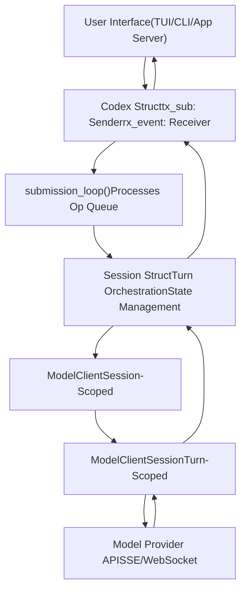
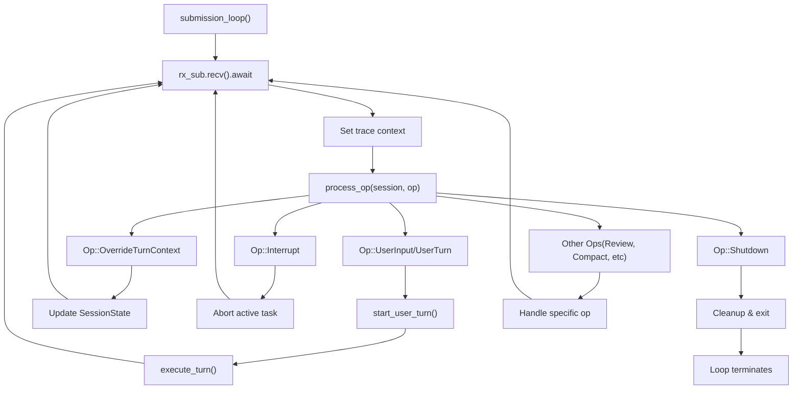
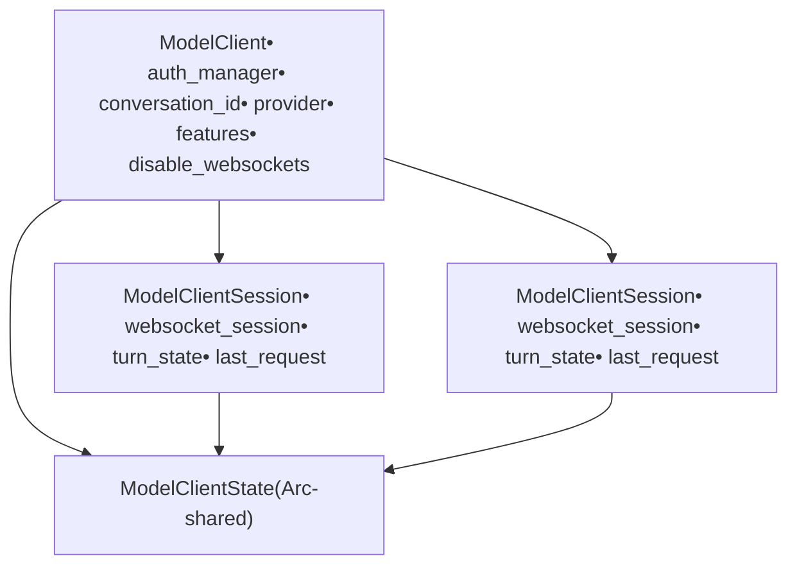
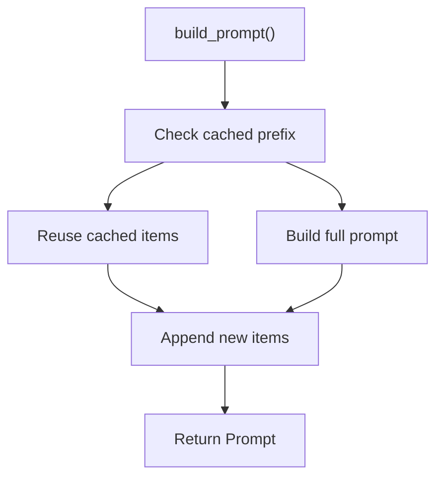
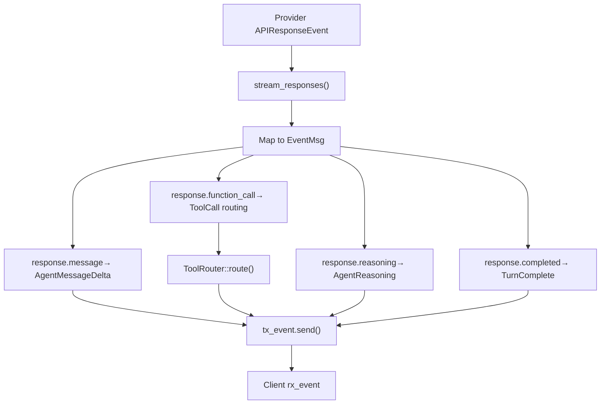
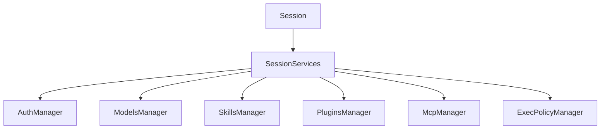
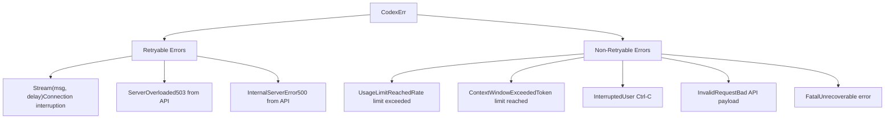

# Core Agent System (codex-core)

Relevant source files

-   [codex-rs/codex-api/src/common.rs](https://github.com/openai/codex/blob/d807d44a/codex-rs/codex-api/src/common.rs)
-   [codex-rs/codex-api/src/endpoint/responses\_websocket.rs](https://github.com/openai/codex/blob/d807d44a/codex-rs/codex-api/src/endpoint/responses_websocket.rs)
-   [codex-rs/codex-api/src/sse/responses.rs](https://github.com/openai/codex/blob/d807d44a/codex-rs/codex-api/src/sse/responses.rs)
-   [codex-rs/core/src/client.rs](https://github.com/openai/codex/blob/d807d44a/codex-rs/core/src/client.rs)
-   [codex-rs/core/src/client\_common.rs](https://github.com/openai/codex/blob/d807d44a/codex-rs/core/src/client_common.rs)
-   [codex-rs/core/src/codex.rs](https://github.com/openai/codex/blob/d807d44a/codex-rs/core/src/codex.rs)
-   [codex-rs/core/src/rollout/policy.rs](https://github.com/openai/codex/blob/d807d44a/codex-rs/core/src/rollout/policy.rs)
-   [codex-rs/core/tests/common/responses.rs](https://github.com/openai/codex/blob/d807d44a/codex-rs/core/tests/common/responses.rs)
-   [codex-rs/core/tests/responses\_headers.rs](https://github.com/openai/codex/blob/d807d44a/codex-rs/core/tests/responses_headers.rs)
-   [codex-rs/core/tests/suite/agent\_websocket.rs](https://github.com/openai/codex/blob/d807d44a/codex-rs/core/tests/suite/agent_websocket.rs)
-   [codex-rs/core/tests/suite/client.rs](https://github.com/openai/codex/blob/d807d44a/codex-rs/core/tests/suite/client.rs)
-   [codex-rs/core/tests/suite/client\_websockets.rs](https://github.com/openai/codex/blob/d807d44a/codex-rs/core/tests/suite/client_websockets.rs)
-   [codex-rs/core/tests/suite/prompt\_caching.rs](https://github.com/openai/codex/blob/d807d44a/codex-rs/core/tests/suite/prompt_caching.rs)
-   [codex-rs/core/tests/suite/turn\_state.rs](https://github.com/openai/codex/blob/d807d44a/codex-rs/core/tests/suite/turn_state.rs)
-   [codex-rs/core/tests/suite/websocket\_fallback.rs](https://github.com/openai/codex/blob/d807d44a/codex-rs/core/tests/suite/websocket_fallback.rs)
-   [codex-rs/exec/src/event\_processor.rs](https://github.com/openai/codex/blob/d807d44a/codex-rs/exec/src/event_processor.rs)
-   [codex-rs/exec/src/event\_processor\_with\_human\_output.rs](https://github.com/openai/codex/blob/d807d44a/codex-rs/exec/src/event_processor_with_human_output.rs)
-   [codex-rs/mcp-server/src/codex\_tool\_runner.rs](https://github.com/openai/codex/blob/d807d44a/codex-rs/mcp-server/src/codex_tool_runner.rs)
-   [codex-rs/protocol/src/protocol.rs](https://github.com/openai/codex/blob/d807d44a/codex-rs/protocol/src/protocol.rs)
-   [codex-rs/tui/src/app.rs](https://github.com/openai/codex/blob/d807d44a/codex-rs/tui/src/app.rs)
-   [codex-rs/tui/src/app\_event.rs](https://github.com/openai/codex/blob/d807d44a/codex-rs/tui/src/app_event.rs)
-   [codex-rs/tui/src/bottom\_pane/chat\_composer.rs](https://github.com/openai/codex/blob/d807d44a/codex-rs/tui/src/bottom_pane/chat_composer.rs)
-   [codex-rs/tui/src/bottom\_pane/mod.rs](https://github.com/openai/codex/blob/d807d44a/codex-rs/tui/src/bottom_pane/mod.rs)
-   [codex-rs/tui/src/chatwidget.rs](https://github.com/openai/codex/blob/d807d44a/codex-rs/tui/src/chatwidget.rs)
-   [codex-rs/tui/src/chatwidget/tests.rs](https://github.com/openai/codex/blob/d807d44a/codex-rs/tui/src/chatwidget/tests.rs)
-   [codex-rs/tui/src/history\_cell.rs](https://github.com/openai/codex/blob/d807d44a/codex-rs/tui/src/history_cell.rs)
-   [codex-rs/tui/src/slash\_command.rs](https://github.com/openai/codex/blob/d807d44a/codex-rs/tui/src/slash_command.rs)

The Core Agent System is the central orchestration layer of Codex, responsible for managing conversation turns, coordinating model API interactions, and maintaining session state. This document covers the fundamental architecture, execution flow, and key abstractions that power the Codex agent.

For information about specific user interfaces that interact with this system, see [User Interfaces](/openai/codex/4-user-interfaces). For details about tool execution and approval workflows, see [Tool System](/openai/codex/5-tool-system). For configuration and permissions, see [Sandbox and Approval Policies](/openai/codex/2.4-sandbox-and-approval-policies).

## Architecture Overview

The Core Agent System implements a **Submission Queue / Event Queue** (SQ/EQ) pattern for asynchronous communication between user interfaces and the agent. Users submit operations (`Op`) through a bounded channel, and the agent emits events (`EventMsg`) through an unbounded channel as work progresses.

### Submission/Event Pattern


**Sources:** [codex-rs/core/src/codex.rs330-343](https://github.com/openai/codex/blob/d807d44a/codex-rs/core/src/codex.rs#L330-L343) [codex-rs/core/src/codex.rs744-759](https://github.com/openai/codex/blob/d807d44a/codex-rs/core/src/codex.rs#L744-L759) [codex-rs/protocol/src/protocol.rs1-100](https://github.com/openai/codex/blob/d807d44a/codex-rs/protocol/src/protocol.rs#L1-L100)

### Key Components

| Component | Purpose | Location |
| --- | --- | --- |
| **Codex** | Public API interface, manages submission/event queues and session lifecycle | [codex-rs/core/src/codex.rs330-724](https://github.com/openai/codex/blob/d807d44a/codex-rs/core/src/codex.rs#L330-L724) |
| **Session** | Per-conversation state, orchestrates turn execution and tool calls | [codex-rs/core/src/codex.rs744-759](https://github.com/openai/codex/blob/d807d44a/codex-rs/core/src/codex.rs#L744-L759) |
| **ModelClient** | Session-scoped client for model API communication | [codex-rs/core/src/client.rs168-272](https://github.com/openai/codex/blob/d807d44a/codex-rs/core/src/client.rs#L168-L272) |
| **ModelClientSession** | Turn-scoped streaming session with WebSocket connection caching | [codex-rs/core/src/client.rs176-253](https://github.com/openai/codex/blob/d807d44a/codex-rs/core/src/client.rs#L176-L253) |
| **TurnContext** | Per-turn configuration snapshot (model, cwd, sandbox, permissions) | [codex-rs/core/src/codex.rs776-920](https://github.com/openai/codex/blob/d807d44a/codex-rs/core/src/codex.rs#L776-L920) |
| **Prompt** | API request payload with input items, tools, and instructions | [codex-rs/core/src/client\_common.rs26-65](https://github.com/openai/codex/blob/d807d44a/codex-rs/core/src/client_common.rs#L26-L65) |

**Sources:** [codex-rs/core/src/codex.rs330-759](https://github.com/openai/codex/blob/d807d44a/codex-rs/core/src/codex.rs#L330-L759) [codex-rs/core/src/client.rs158-253](https://github.com/openai/codex/blob/d807d44a/codex-rs/core/src/client.rs#L158-L253)

## Session Lifecycle

The `Codex` struct represents a single conversation thread. Sessions can be spawned fresh, resumed from disk, or forked from an existing session.

**Sources:** [codex-rs/core/src/codex.rs380-633](https://github.com/openai/codex/blob/d807d44a/codex-rs/core/src/codex.rs#L380-L633) [codex-rs/core/src/codex.rs1281-1528](https://github.com/openai/codex/blob/d807d44a/codex-rs/core/src/codex.rs#L1281-L1528)

### Codex::spawn() Flow

The spawn process initializes all required managers and constructs the session:

> **[Mermaid sequence]**
> *(图表结构无法解析)*

**Sources:** [codex-rs/core/src/codex.rs380-633](https://github.com/openai/codex/blob/d807d44a/codex-rs/core/src/codex.rs#L380-L633) [codex-rs/core/src/codex.rs869-1127](https://github.com/openai/codex/blob/d807d44a/codex-rs/core/src/codex.rs#L869-L1127)

### Submission Processing

The `submission_loop` is the core event processing loop that runs for the session lifetime:


**Sources:** [codex-rs/core/src/codex.rs1281-1528](https://github.com/openai/codex/blob/d807d44a/codex-rs/core/src/codex.rs#L1281-L1528)

## Turn Execution Flow

A user turn represents a complete request/response cycle with the model. The system builds a prompt from conversation history, streams the response, handles tool calls, and updates state.

### Complete Turn Flow

> **[Mermaid sequence]**
> *(图表结构无法解析)*

**Sources:** [codex-rs/core/src/codex.rs2418-2926](https://github.com/openai/codex/blob/d807d44a/codex-rs/core/src/codex.rs#L2418-L2926) [codex-rs/core/src/client.rs791-944](https://github.com/openai/codex/blob/d807d44a/codex-rs/core/src/client.rs#L791-L944)

### TurnContext Construction

Each turn creates a `TurnContext` snapshot containing all configuration needed for that turn:

```
// TurnContext fields (simplified)pub(crate) struct TurnContext {    pub(crate) sub_id: String,    pub(crate) model_info: ModelInfo,    pub(crate) cwd: PathBuf,    pub(crate) approval_policy: Constrained<AskForApproval>,    pub(crate) sandbox_policy: Constrained<SandboxPolicy>,    pub(crate) tools_config: ToolsConfig,    pub(crate) features: ManagedFeatures,    // ... ~30 more fields}
```
**Sources:** [codex-rs/core/src/codex.rs776-920](https://github.com/openai/codex/blob/d807d44a/codex-rs/core/src/codex.rs#L776-L920)

## Model Client Architecture

The model client layer separates session-scoped configuration from turn-scoped streaming state.

### Session-Scoped vs Turn-Scoped Clients


**Sources:** [codex-rs/core/src/client.rs117-272](https://github.com/openai/codex/blob/d807d44a/codex-rs/core/src/client.rs#L117-L272)

### WebSocket Connection Lifecycle

`ModelClientSession` maintains a cached WebSocket connection that can be reused across multiple requests within a turn:

> **[Mermaid stateDiagram]**
> *(图表结构无法解析)*

**Sources:** [codex-rs/core/src/client.rs734-774](https://github.com/openai/codex/blob/d807d44a/codex-rs/core/src/client.rs#L734-L774) [codex-rs/core/src/client.rs514-520](https://github.com/openai/codex/blob/d807d44a/codex-rs/core/src/client.rs#L514-L520)

### Transport Selection and Fallback

The client supports both WebSocket and HTTP SSE transports with automatic fallback:

| Transport | Used When | Features |
| --- | --- | --- |
| **WebSocket** | `responses_websocket_enabled()` returns true | Connection reuse, incremental requests, sticky routing via `x-codex-turn-state` header |
| **HTTP SSE** | Fallback or explicitly disabled | Stateless, simpler retry logic |

**Sources:** [codex-rs/core/src/client.rs423-433](https://github.com/openai/codex/blob/d807d44a/codex-rs/core/src/client.rs#L423-L433) [codex-rs/core/src/client.rs791-944](https://github.com/openai/codex/blob/d807d44a/codex-rs/core/src/client.rs#L791-L944)

## Prompt Construction

The `Prompt` struct encapsulates everything needed for a model API request:

```
pub struct Prompt {    pub input: Vec<ResponseItem>,           // Conversation history    pub(crate) tools: Vec<ToolSpec>,        // Available tools    pub(crate) parallel_tool_calls: bool,   // Allow parallel execution    pub base_instructions: BaseInstructions, // System prompt    pub personality: Option<Personality>,    // Tone/style    pub output_schema: Option<Value>,        // Structured output}
```
The `input` field contains the full conversation context as `ResponseItem` objects representing user messages, assistant messages, tool calls, and tool outputs.

**Sources:** [codex-rs/core/src/client\_common.rs26-65](https://github.com/openai/codex/blob/d807d44a/codex-rs/core/src/client_common.rs#L26-L65)

### Prompt Building with Caching

The `ContextManager` builds prompts with cached prefixes to reduce token usage and improve latency:


**Sources:** [codex-rs/core/src/codex.rs2598-2609](https://github.com/openai/codex/blob/d807d44a/codex-rs/core/src/codex.rs#L2598-L2609)

## Event Processing

The system translates provider API events (`ResponseEvent`) into protocol events (`EventMsg`) for emission to clients.

### Event Translation Pipeline


**Sources:** [codex-rs/core/src/codex.rs2700-3154](https://github.com/openai/codex/blob/d807d44a/codex-rs/core/src/codex.rs#L2700-L3154)

### Event Persistence

Events are selectively persisted to rollout files based on their type and the configured persistence mode:

| Persistence Mode | Persisted Events |
| --- | --- |
| **Limited** | User messages, agent messages, reasoning, turn lifecycle (TurnStarted, TurnComplete), token counts |
| **Extended** | All Limited events + tool call results, errors, warnings, diffs |
| **None** | Streaming deltas, approval requests, background events |

**Sources:** [codex-rs/core/src/rollout/policy.rs1-187](https://github.com/openai/codex/blob/d807d44a/codex-rs/core/src/rollout/policy.rs#L1-L187)

## State Management

The `Session` struct maintains mutable state through `SessionState`. All state mutations happen within locked critical sections to ensure consistency across concurrent operations (e.g., interrupts during active turns).

**Sources:** [codex-rs/core/src/codex.rs744-759](https://github.com/openai/codex/blob/d807d44a/codex-rs/core/src/codex.rs#L744-L759)

### Session Services

Shared services are initialized once per session and accessed via `SessionServices`:


**Sources:** [codex-rs/core/src/codex.rs756-757](https://github.com/openai/codex/blob/d807d44a/codex-rs/core/src/codex.rs#L756-L757)

## Error Handling

The core system defines a comprehensive error taxonomy with retry semantics.


**Sources:** [codex-rs/core/src/client.rs101-102](https://github.com/openai/codex/blob/d807d44a/codex-rs/core/src/client.rs#L101-L102) [codex-rs/protocol/src/protocol.rs109-111](https://github.com/openai/codex/blob/d807d44a/codex-rs/protocol/src/protocol.rs#L109-L111)

### Retry Logic

The session loop implements automatic retry for transient errors:

1.  Check `err.is_retryable()`
2.  If true, apply exponential backoff
3.  Rebuild prompt with current context
4.  Retry up to configured limit
5.  If limit exceeded, emit error event

**Sources:** [codex-rs/core/src/codex.rs3481-3554](https://github.com/openai/codex/blob/d807d44a/codex-rs/core/src/codex.rs#L3481-L3554)

## API Request Headers

The client attaches several headers to track requests:

| Header | Purpose |
| --- | --- |
| `x-client-request-id` | Conversation/thread identifier |
| `x-codex-turn-state` | Sticky routing token for turn continuity |
| `x-codex-turn-metadata` | Structured turn metadata (JSON) |
| `x-responsesapi-include-timing-metrics` | Request timing info from API |
| `OpenAI-Beta` | Feature flags (e.g., `responses_websockets=2026-02-06`) |

**Sources:** [codex-rs/core/src/client.rs115-120](https://github.com/openai/codex/blob/d807d44a/codex-rs/core/src/client.rs#L115-L120) [codex-rs/core/src/client.rs484-511](https://github.com/openai/codex/blob/d807d44a/codex-rs/core/src/client.rs#L484-L511)

## Summary

The Core Agent System provides:

-   **Queue-based architecture** with asynchronous Op submission and Event emission
-   **Session lifecycle management** supporting spawn, resume, and fork operations
-   **Turn orchestration** coordinating prompt building, model streaming, and tool execution
-   **Layered client design** separating session state from turn state
-   **Transport flexibility** with WebSocket connection caching and HTTP SSE fallback
-   **Comprehensive error handling** with automatic retry for transient failures
-   **Event translation** from provider-specific formats to protocol events

This architecture enables reliable, stateful conversations with external model providers while maintaining clean separation between the agent core, user interfaces, and tool execution systems.

**Sources:** [codex-rs/core/src/codex.rs](https://github.com/openai/codex/blob/d807d44a/codex-rs/core/src/codex.rs) [codex-rs/core/src/client.rs](https://github.com/openai/codex/blob/d807d44a/codex-rs/core/src/client.rs) [codex-rs/protocol/src/protocol.rs](https://github.com/openai/codex/blob/d807d44a/codex-rs/protocol/src/protocol.rs) [codex-rs/core/src/client\_common.rs](https://github.com/openai/codex/blob/d807d44a/codex-rs/core/src/client_common.rs)
