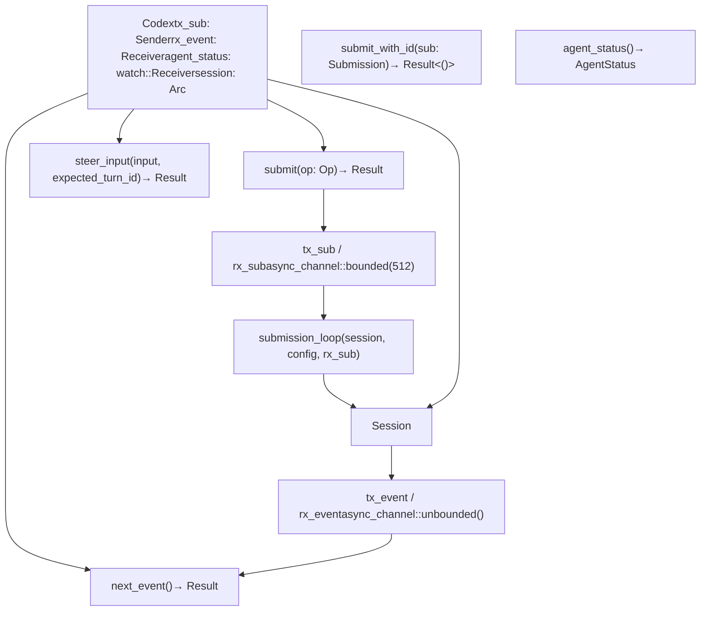
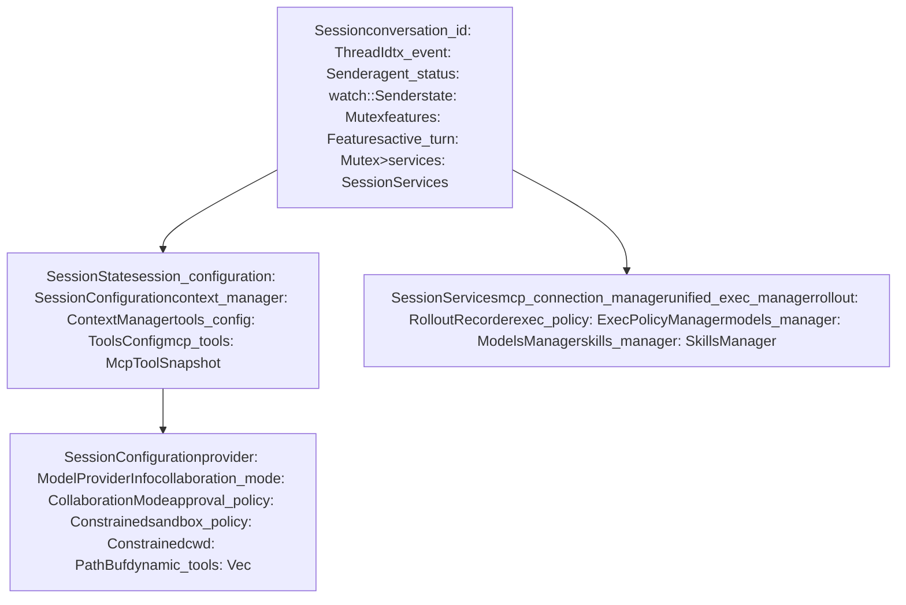
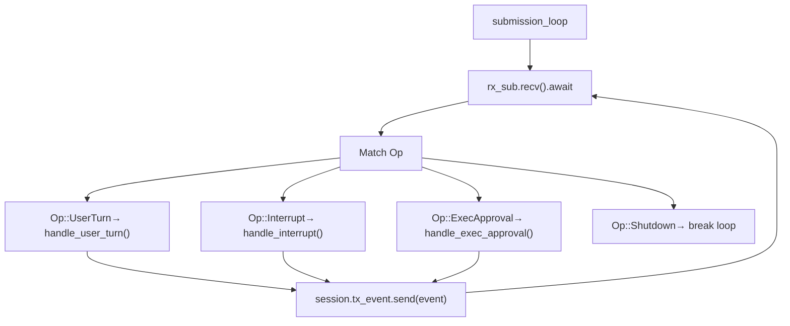

# Codex Interface and Session Lifecycle

Relevant source files

-   [codex-rs/app-server/tests/suite/v2/mcp\_server\_elicitation.rs](https://github.com/openai/codex/blob/d807d44a/codex-rs/app-server/tests/suite/v2/mcp_server_elicitation.rs)
-   [codex-rs/cli/src/mcp\_cmd.rs](https://github.com/openai/codex/blob/d807d44a/codex-rs/cli/src/mcp_cmd.rs)
-   [codex-rs/cli/tests/mcp\_add\_remove.rs](https://github.com/openai/codex/blob/d807d44a/codex-rs/cli/tests/mcp_add_remove.rs)
-   [codex-rs/cli/tests/mcp\_list.rs](https://github.com/openai/codex/blob/d807d44a/codex-rs/cli/tests/mcp_list.rs)
-   [codex-rs/core/src/codex.rs](https://github.com/openai/codex/blob/d807d44a/codex-rs/core/src/codex.rs)
-   [codex-rs/core/src/mcp\_connection\_manager.rs](https://github.com/openai/codex/blob/d807d44a/codex-rs/core/src/mcp_connection_manager.rs)
-   [codex-rs/core/src/mcp\_connection\_manager\_tests.rs](https://github.com/openai/codex/blob/d807d44a/codex-rs/core/src/mcp_connection_manager_tests.rs)
-   [codex-rs/core/src/rollout/policy.rs](https://github.com/openai/codex/blob/d807d44a/codex-rs/core/src/rollout/policy.rs)
-   [codex-rs/core/src/state/session.rs](https://github.com/openai/codex/blob/d807d44a/codex-rs/core/src/state/session.rs)
-   [codex-rs/core/src/state/turn.rs](https://github.com/openai/codex/blob/d807d44a/codex-rs/core/src/state/turn.rs)
-   [codex-rs/core/src/tasks/mod.rs](https://github.com/openai/codex/blob/d807d44a/codex-rs/core/src/tasks/mod.rs)
-   [codex-rs/core/src/tools/handlers/tool\_search\_tests.rs](https://github.com/openai/codex/blob/d807d44a/codex-rs/core/src/tools/handlers/tool_search_tests.rs)
-   [codex-rs/core/tests/suite/rmcp\_client.rs](https://github.com/openai/codex/blob/d807d44a/codex-rs/core/tests/suite/rmcp_client.rs)
-   [codex-rs/core/tests/suite/truncation.rs](https://github.com/openai/codex/blob/d807d44a/codex-rs/core/tests/suite/truncation.rs)
-   [codex-rs/core/tests/suite/user\_shell\_cmd.rs](https://github.com/openai/codex/blob/d807d44a/codex-rs/core/tests/suite/user_shell_cmd.rs)
-   [codex-rs/exec/src/event\_processor.rs](https://github.com/openai/codex/blob/d807d44a/codex-rs/exec/src/event_processor.rs)
-   [codex-rs/exec/src/event\_processor\_with\_human\_output.rs](https://github.com/openai/codex/blob/d807d44a/codex-rs/exec/src/event_processor_with_human_output.rs)
-   [codex-rs/mcp-server/src/codex\_tool\_runner.rs](https://github.com/openai/codex/blob/d807d44a/codex-rs/mcp-server/src/codex_tool_runner.rs)
-   [codex-rs/protocol/src/protocol.rs](https://github.com/openai/codex/blob/d807d44a/codex-rs/protocol/src/protocol.rs)
-   [codex-rs/rmcp-client/src/rmcp\_client.rs](https://github.com/openai/codex/blob/d807d44a/codex-rs/rmcp-client/src/rmcp_client.rs)
-   [codex-rs/rmcp-client/tests/streamable\_http\_recovery.rs](https://github.com/openai/codex/blob/d807d44a/codex-rs/rmcp-client/tests/streamable_http_recovery.rs)
-   [codex-rs/tui/src/app.rs](https://github.com/openai/codex/blob/d807d44a/codex-rs/tui/src/app.rs)
-   [codex-rs/tui/src/app\_event.rs](https://github.com/openai/codex/blob/d807d44a/codex-rs/tui/src/app_event.rs)
-   [codex-rs/tui/src/bottom\_pane/chat\_composer.rs](https://github.com/openai/codex/blob/d807d44a/codex-rs/tui/src/bottom_pane/chat_composer.rs)
-   [codex-rs/tui/src/bottom\_pane/mod.rs](https://github.com/openai/codex/blob/d807d44a/codex-rs/tui/src/bottom_pane/mod.rs)
-   [codex-rs/tui/src/chatwidget.rs](https://github.com/openai/codex/blob/d807d44a/codex-rs/tui/src/chatwidget.rs)
-   [codex-rs/tui/src/chatwidget/tests.rs](https://github.com/openai/codex/blob/d807d44a/codex-rs/tui/src/chatwidget/tests.rs)
-   [codex-rs/tui/src/history\_cell.rs](https://github.com/openai/codex/blob/d807d44a/codex-rs/tui/src/history_cell.rs)
-   [codex-rs/tui/src/slash\_command.rs](https://github.com/openai/codex/blob/d807d44a/codex-rs/tui/src/slash_command.rs)

This document describes the core interface for interacting with the Codex agent system and the complete lifecycle of a session from initialization through execution to shutdown. The `Codex` struct provides the public API for all user interfaces, while the `Session` manages the agent's execution context, state, and services.

## Core Components

### The Codex Public API

The `Codex` struct serves as the high-level interface to the Codex system, implementing a queue-pair pattern where clients submit operations and receive events asynchronously. It encapsulates the communication channels and the shared session state.

### Codex Public API Structure

**Key Responsibilities:**

-   **Operation Submission**: `submit()` generates a UUIDv7 ID and enqueues a `Submission` to the `tx_sub` channel [codex-rs/core/src/codex.rs470-520](https://github.com/openai/codex/blob/d807d44a/codex-rs/core/src/codex.rs#L470-L520)
-   **Event Consumption**: `next_event()` retrieves processed `EventMsg` items from the `rx_event` receiver, blocking until available [codex-rs/core/src/codex.rs418-460](https://github.com/openai/codex/blob/d807d44a/codex-rs/core/src/codex.rs#L418-L460)
-   **Status Tracking**: The `agent_status` field is a `watch::Receiver<AgentStatus>` that provides real-time updates on whether the agent is idle, working, or stalled [codex-rs/core/src/codex.rs274-280](https://github.com/openai/codex/blob/d807d44a/codex-rs/core/src/codex.rs#L274-L280)
-   **Steer Input**: `steer_input()` allows users to provide feedback or corrections while a turn is still in progress, a feature heavily used by the TUI [codex-rs/core/src/codex.rs480-510](https://github.com/openai/codex/blob/d807d44a/codex-rs/core/src/codex.rs#L480-L510)

Sources: [codex-rs/core/src/codex.rs270-520](https://github.com/openai/codex/blob/d807d44a/codex-rs/core/src/codex.rs#L270-L520) [codex-rs/protocol/src/protocol.rs102-111](https://github.com/openai/codex/blob/d807d44a/codex-rs/protocol/src/protocol.rs#L102-L111)

### Session Architecture

The `Session` struct represents the core agent context, managing all state, services, and execution resources required for a single conversation thread.

### Session Structure

The `Session` coordinates all agent activities:

-   **Mutable State**: `Mutex<SessionState>` protects the conversation history managed by `ContextManager` and tool configurations [codex-rs/core/src/codex.rs708-800](https://github.com/openai/codex/blob/d807d44a/codex-rs/core/src/codex.rs#L708-L800)
-   **Session Configuration**: A snapshot of settings including the model provider, sandbox policies, and working directory captured at initialization [codex-rs/core/src/codex.rs814-933](https://github.com/openai/codex/blob/d807d44a/codex-rs/core/src/codex.rs#L814-L933)
-   **Session Services**: Shared infrastructure components like the `McpConnectionManager` for tool discovery and the `UnifiedExecProcessManager` for managing shell processes [codex-rs/core/src/codex.rs933-1035](https://github.com/openai/codex/blob/d807d44a/codex-rs/core/src/codex.rs#L933-L1035)

Sources: [codex-rs/core/src/codex.rs525-539](https://github.com/openai/codex/blob/d807d44a/codex-rs/core/src/codex.rs#L525-L539) [codex-rs/core/src/codex.rs708-800](https://github.com/openai/codex/blob/d807d44a/codex-rs/core/src/codex.rs#L708-L800)

## Session Initialization Flow

### Spawn Process

The `Codex::spawn()` method orchestrates the complete initialization sequence, creating channels, loading configuration, initializing services, and launching the background submission loop.

> **[Mermaid sequence]**
> *(图表结构无法解析)*

**Initialization Stages:**

1.  **Skills Loading**: `SkillsManager` loads enabled skills for the working directory [codex-rs/core/src/codex.rs320-340](https://github.com/openai/codex/blob/d807d44a/codex-rs/core/src/codex.rs#L320-L340)
2.  **Model Resolution**: Retrieves model metadata (context window, capabilities) via `ModelsManager` [codex-rs/core/src/codex.rs350-370](https://github.com/openai/codex/blob/d807d44a/codex-rs/core/src/codex.rs#L350-L370)
3.  **Rollout Initialization**: The `RolloutRecorder` is set up to persist the conversation to a `.jsonl` file [codex-rs/core/src/codex.rs950-970](https://github.com/openai/codex/blob/d807d44a/codex-rs/core/src/codex.rs#L950-L970)
4.  **Submission Loop**: An asynchronous task is spawned to process `Op` items from the submission queue [codex-rs/core/src/codex.rs1137-1150](https://github.com/openai/codex/blob/d807d44a/codex-rs/core/src/codex.rs#L1137-L1150)

Sources: [codex-rs/core/src/codex.rs300-467](https://github.com/openai/codex/blob/d807d44a/codex-rs/core/src/codex.rs#L300-L467) [codex-rs/core/src/codex.rs814-933](https://github.com/openai/codex/blob/d807d44a/codex-rs/core/src/codex.rs#L814-L933)

## The Op/Event Communication Pattern

Codex uses a submission queue (SQ) / event queue (EQ) pattern to asynchronously communicate between the user interface and the agent [codex-rs/protocol/src/protocol.rs1-5](https://github.com/openai/codex/blob/d807d44a/codex-rs/protocol/src/protocol.rs#L1-L5)

### Submission Operations (`Op`)

Operations are requests from the user to the agent [codex-rs/protocol/src/protocol.rs101-103](https://github.com/openai/codex/blob/d807d44a/codex-rs/protocol/src/protocol.rs#L101-L103):

-   `UserTurn`: Submit a new message or instruction [codex-rs/protocol/src/protocol.rs200-210](https://github.com/openai/codex/blob/d807d44a/codex-rs/protocol/src/protocol.rs#L200-L210)
-   `Interrupt`: Abort the currently executing turn [codex-rs/protocol/src/protocol.rs220-225](https://github.com/openai/codex/blob/d807d44a/codex-rs/protocol/src/protocol.rs#L220-L225)
-   `ExecApproval` / `PatchApproval`: Respond to permission requests [codex-rs/protocol/src/protocol.rs230-245](https://github.com/openai/codex/blob/d807d44a/codex-rs/protocol/src/protocol.rs#L230-L245)
-   `Shutdown`: Terminate the session loop [codex-rs/protocol/src/protocol.rs250-255](https://github.com/openai/codex/blob/d807d44a/codex-rs/protocol/src/protocol.rs#L250-L255)

### Event Messages (`EventMsg`)

Events are emitted by the agent to notify the client of state changes or model output [codex-rs/protocol/src/protocol.rs300-305](https://github.com/openai/codex/blob/d807d44a/codex-rs/protocol/src/protocol.rs#L300-L305):

-   `AgentMessageDelta`: Streaming chunks of assistant text [codex-rs/protocol/src/protocol.rs350-360](https://github.com/openai/codex/blob/d807d44a/codex-rs/protocol/src/protocol.rs#L350-L360)
-   `ExecCommandBegin`: Notification that a shell command has started [codex-rs/protocol/src/protocol.rs370-380](https://github.com/openai/codex/blob/d807d44a/codex-rs/protocol/src/protocol.rs#L370-L380)
-   `TurnComplete`: Final event for a turn, including token usage [codex-rs/protocol/src/protocol.rs390-400](https://github.com/openai/codex/blob/d807d44a/codex-rs/protocol/src/protocol.rs#L390-L400)

Sources: [codex-rs/protocol/src/protocol.rs1-400](https://github.com/openai/codex/blob/d807d44a/codex-rs/protocol/src/protocol.rs#L1-L400) [codex-rs/core/src/codex.rs1137-1404](https://github.com/openai/codex/blob/d807d44a/codex-rs/core/src/codex.rs#L1137-L1404)

## Session Lifecycle Management

### The Submission Loop

The `submission_loop` is the heart of the session, processing operations sequentially to ensure state consistency.

### Active Turn and Interruption

When a `UserTurn` is processed, an `ActiveTurn` is stored in the session [codex-rs/core/src/codex.rs535](https://github.com/openai/codex/blob/d807d44a/codex-rs/core/src/codex.rs#L535-L535) This allows the `submission_loop` to handle `Op::Interrupt` by triggering a `CancellationToken` associated with the active turn, which immediately stops model streaming and cancels pending tool executions [codex-rs/core/src/codex.rs1200-1247](https://github.com/openai/codex/blob/d807d44a/codex-rs/core/src/codex.rs#L1200-L1247)

### Session Resumption and Forking

Sessions can be resumed or forked by replaying events from a rollout file. The `ThreadManager` facilitates this by loading history into a new `ContextManager` and initializing a fresh `Session` with the restored state [codex-rs/core/src/codex.rs300-350](https://github.com/openai/codex/blob/d807d44a/codex-rs/core/src/codex.rs#L300-L350)

Sources: [codex-rs/core/src/codex.rs1137-1404](https://github.com/openai/codex/blob/d807d44a/codex-rs/core/src/codex.rs#L1137-L1404) [codex-rs/core/src/codex.rs535](https://github.com/openai/codex/blob/d807d44a/codex-rs/core/src/codex.rs#L535-L535) [codex-rs/core/src/codex.rs1200-1247](https://github.com/openai/codex/blob/d807d44a/codex-rs/core/src/codex.rs#L1200-L1247)
