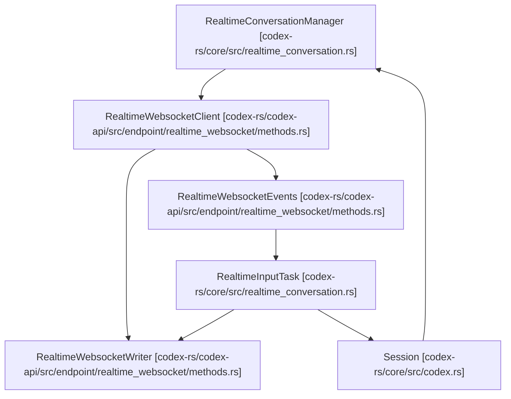

# Realtime Conversation

Relevant source files

-   [codex-rs/app-server/tests/suite/v2/realtime\_conversation.rs](https://github.com/openai/codex/blob/d807d44a/codex-rs/app-server/tests/suite/v2/realtime_conversation.rs)
-   [codex-rs/codex-api/src/endpoint/realtime\_websocket/methods.rs](https://github.com/openai/codex/blob/d807d44a/codex-rs/codex-api/src/endpoint/realtime_websocket/methods.rs)
-   [codex-rs/codex-api/src/endpoint/realtime\_websocket/methods\_common.rs](https://github.com/openai/codex/blob/d807d44a/codex-rs/codex-api/src/endpoint/realtime_websocket/methods_common.rs)
-   [codex-rs/codex-api/src/endpoint/realtime\_websocket/methods\_v1.rs](https://github.com/openai/codex/blob/d807d44a/codex-rs/codex-api/src/endpoint/realtime_websocket/methods_v1.rs)
-   [codex-rs/codex-api/src/endpoint/realtime\_websocket/methods\_v2.rs](https://github.com/openai/codex/blob/d807d44a/codex-rs/codex-api/src/endpoint/realtime_websocket/methods_v2.rs)
-   [codex-rs/codex-api/src/endpoint/realtime\_websocket/mod.rs](https://github.com/openai/codex/blob/d807d44a/codex-rs/codex-api/src/endpoint/realtime_websocket/mod.rs)
-   [codex-rs/codex-api/src/endpoint/realtime\_websocket/protocol.rs](https://github.com/openai/codex/blob/d807d44a/codex-rs/codex-api/src/endpoint/realtime_websocket/protocol.rs)
-   [codex-rs/codex-api/src/endpoint/realtime\_websocket/protocol\_common.rs](https://github.com/openai/codex/blob/d807d44a/codex-rs/codex-api/src/endpoint/realtime_websocket/protocol_common.rs)
-   [codex-rs/codex-api/src/endpoint/realtime\_websocket/protocol\_v1.rs](https://github.com/openai/codex/blob/d807d44a/codex-rs/codex-api/src/endpoint/realtime_websocket/protocol_v1.rs)
-   [codex-rs/codex-api/src/endpoint/realtime\_websocket/protocol\_v2.rs](https://github.com/openai/codex/blob/d807d44a/codex-rs/codex-api/src/endpoint/realtime_websocket/protocol_v2.rs)
-   [codex-rs/codex-api/src/lib.rs](https://github.com/openai/codex/blob/d807d44a/codex-rs/codex-api/src/lib.rs)
-   [codex-rs/codex-api/tests/realtime\_websocket\_e2e.rs](https://github.com/openai/codex/blob/d807d44a/codex-rs/codex-api/tests/realtime_websocket_e2e.rs)
-   [codex-rs/core/src/realtime\_conversation.rs](https://github.com/openai/codex/blob/d807d44a/codex-rs/core/src/realtime_conversation.rs)
-   [codex-rs/core/tests/suite/realtime\_conversation.rs](https://github.com/openai/codex/blob/d807d44a/codex-rs/core/tests/suite/realtime_conversation.rs)

The Realtime Conversation system provides a low-latency, bidirectional WebSocket interface for audio and text interactions. It allows the Codex agent to engage in voice-based sessions, handling streaming audio input/output, server-side voice activity detection (VAD), and automated handoffs between the realtime voice model and the core agentic reasoning system.

## System Architecture

The realtime system is built on a producer-consumer model using asynchronous channels to bridge the high-speed WebSocket transport with the internal session logic.

### Data Flow and Task Management

The `RealtimeConversationManager` coordinates the lifecycle of a realtime session. It manages two primary asynchronous tasks:

1.  **Input Task**: Handles the WebSocket connection, reading events from the server and writing outbound messages (audio frames, text, session updates).
2.  **Fanout Task**: Routes incoming events from the WebSocket to internal subscribers and translates them into protocol-level events.

### Realtime Component Interaction

This diagram illustrates how the `RealtimeWebsocketClient` connects the `codex-core` logic to the external API provider.

**Sources:** [codex-rs/core/src/realtime\_conversation.rs71-138](https://github.com/openai/codex/blob/d807d44a/codex-rs/core/src/realtime_conversation.rs#L71-L138) [codex-rs/codex-api/src/endpoint/realtime\_websocket/methods.rs12-15](https://github.com/openai/codex/blob/d807d44a/codex-rs/codex-api/src/endpoint/realtime_websocket/methods.rs#L12-L15)

## Protocol Versions

Codex supports multiple versions of the realtime protocol, abstracted through the `RealtimeEventParser` enum [codex-rs/codex-api/src/endpoint/realtime\_websocket/protocol.rs12-15](https://github.com/openai/codex/blob/d807d44a/codex-rs/codex-api/src/endpoint/realtime_websocket/protocol.rs#L12-L15)

| Feature | V1 (Quicksilver) | V2 (Realtime) |
| --- | --- | --- |
| **Session Type** | `Quicksilver` | `Realtime` |
| **Voice** | `Fathom` | `Marin` |
| **Turn Detection** | None (Client-side) | `ServerVad` |
| **Tools** | Not supported | `codex` tool for handoff |
| **Output Modality** | Audio | Audio |

**Sources:** [codex-rs/codex-api/src/endpoint/realtime\_websocket/methods\_v1.rs41-63](https://github.com/openai/codex/blob/d807d44a/codex-rs/codex-api/src/endpoint/realtime_websocket/methods_v1.rs#L41-L63) [codex-rs/codex-api/src/endpoint/realtime\_websocket/methods\_v2.rs59-108](https://github.com/openai/codex/blob/d807d44a/codex-rs/codex-api/src/endpoint/realtime_websocket/methods_v2.rs#L59-L108)

## Session Lifecycle

### 1\. Initialization

A session starts when a `ConversationStartParams` op is submitted [codex-rs/core/src/realtime\_conversation.rs155-160](https://github.com/openai/codex/blob/d807d44a/codex-rs/core/src/realtime_conversation.rs#L155-L160) The system builds a "startup context" using `build_realtime_startup_context` which injects current workspace state and memories into the model's instructions [codex-rs/core/src/realtime\_conversation.rs10](https://github.com/openai/codex/blob/d807d44a/codex-rs/core/src/realtime_conversation.rs#L10-L10)

### 2\. Connection Handling

The `RealtimeWebsocketClient` establishes the TLS connection and performs the handshake. It utilizes a `WsStream` pump task to handle concurrent sending and receiving of WebSocket `Message` types [codex-rs/codex-api/src/endpoint/realtime\_websocket/methods.rs65-151](https://github.com/openai/codex/blob/d807d44a/codex-rs/codex-api/src/endpoint/realtime_websocket/methods.rs#L65-L151)

### 3\. Audio Streaming

Audio is transmitted as Base64 encoded PCM data at 24kHz [codex-rs/codex-api/src/endpoint/realtime\_websocket/methods\_common.rs14](https://github.com/openai/codex/blob/d807d44a/codex-rs/codex-api/src/endpoint/realtime_websocket/methods_common.rs#L14-L14)

-   **Inbound**: `RealtimeAudioFrame` items are sent via `input_audio_buffer.append` [codex-rs/codex-api/src/endpoint/realtime\_websocket/protocol.rs35-36](https://github.com/openai/codex/blob/d807d44a/codex-rs/codex-api/src/endpoint/realtime_websocket/protocol.rs#L35-L36)
-   **Outbound**: The server emits `response.output_audio.delta` which is parsed into `RealtimeEvent::AudioOut` [codex-rs/codex-api/src/endpoint/realtime\_websocket/protocol\_v2.rs24-26](https://github.com/openai/codex/blob/d807d44a/codex-rs/codex-api/src/endpoint/realtime_websocket/protocol_v2.rs#L24-L26)

### 4\. Handoff Mechanism

Handoff occurs when the realtime model decides to delegate a complex task to the main Codex agent.

-   In V2, this is implemented as a tool call named `codex` [codex-rs/codex-api/src/endpoint/realtime\_websocket/protocol\_v2.rs14](https://github.com/openai/codex/blob/d807d44a/codex-rs/codex-api/src/endpoint/realtime_websocket/protocol_v2.rs#L14-L14)
-   When the server sends `conversation.item.done` with a `function_call` for `codex`, the system generates a `RealtimeHandoffRequested` event [codex-rs/codex-api/src/endpoint/realtime\_websocket/protocol\_v2.rs143-167](https://github.com/openai/codex/blob/d807d44a/codex-rs/codex-api/src/endpoint/realtime_websocket/protocol_v2.rs#L143-L167)

## Event Translation Map

The following diagram maps low-level WebSocket messages to the internal `EventMsg` used by the application server and TUI.

> **[Mermaid sequence]**
> *(图表结构无法解析)*

**Sources:** [codex-rs/core/src/realtime\_conversation.rs31-35](https://github.com/openai/codex/blob/d807d44a/codex-rs/core/src/realtime_conversation.rs#L31-L35) [codex-rs/codex-api/src/endpoint/realtime\_websocket/protocol\_v2.rs19-74](https://github.com/openai/codex/blob/d807d44a/codex-rs/codex-api/src/endpoint/realtime_websocket/protocol_v2.rs#L19-L74)

## Implementation Details

### RealtimeInputTask

This task is the core of the session loop. It uses `tokio::select!` to multiplex:

-   **User Text**: `user_text_rx` receives text from the UI to inject into the conversation [codex-rs/core/src/realtime\_conversation.rs199](https://github.com/openai/codex/blob/d807d44a/codex-rs/core/src/realtime_conversation.rs#L199-L199)
-   **Audio Data**: `audio_rx` receives raw audio frames for the buffer [codex-rs/core/src/realtime\_conversation.rs201](https://github.com/openai/codex/blob/d807d44a/codex-rs/core/src/realtime_conversation.rs#L201-L201)
-   **Server Events**: `events` stream provides parsed `RealtimeEvent` objects from the WebSocket [codex-rs/core/src/realtime\_conversation.rs198](https://github.com/openai/codex/blob/d807d44a/codex-rs/core/src/realtime_conversation.rs#L198-L198)

### Error Handling

If the connection encounters a conflict (e.g., trying to send audio while a response is already active), the manager detects the `ACTIVE_RESPONSE_CONFLICT_ERROR_PREFIX` and may trigger a cancellation or user notification [codex-rs/core/src/realtime\_conversation.rs56-57](https://github.com/openai/codex/blob/d807d44a/codex-rs/core/src/realtime_conversation.rs#L56-L57)

**Sources:** [codex-rs/core/src/realtime\_conversation.rs196-216](https://github.com/openai/codex/blob/d807d44a/codex-rs/core/src/realtime_conversation.rs#L196-L216) [codex-rs/codex-api/src/endpoint/realtime\_websocket/methods.rs68-149](https://github.com/openai/codex/blob/d807d44a/codex-rs/codex-api/src/endpoint/realtime_websocket/methods.rs#L68-L149)
