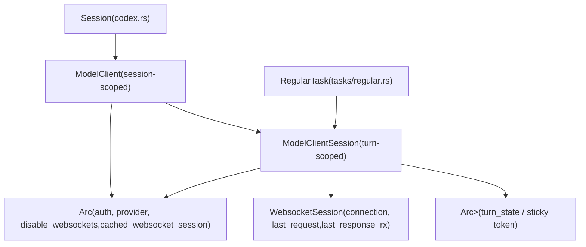
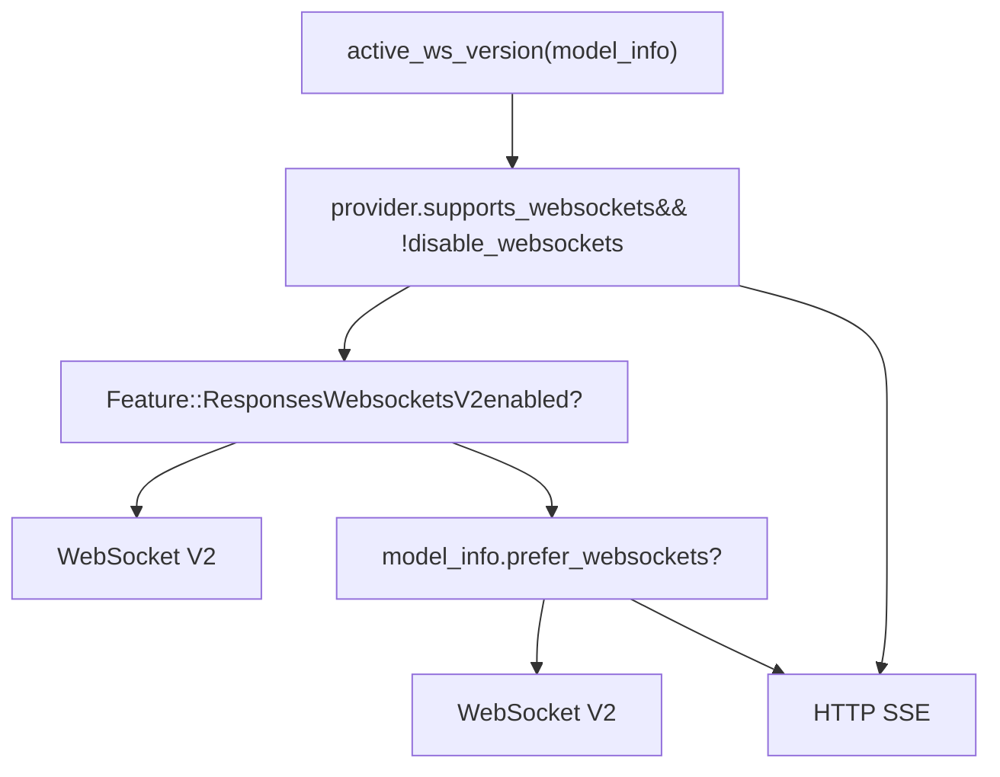

# Model Client and API Communication

Relevant source files

-   [codex-rs/codex-api/README.md](https://github.com/openai/codex/blob/d807d44a/codex-rs/codex-api/README.md?plain=1)
-   [codex-rs/codex-api/src/auth.rs](https://github.com/openai/codex/blob/d807d44a/codex-rs/codex-api/src/auth.rs)
-   [codex-rs/codex-api/src/common.rs](https://github.com/openai/codex/blob/d807d44a/codex-rs/codex-api/src/common.rs)
-   [codex-rs/codex-api/src/endpoint/compact.rs](https://github.com/openai/codex/blob/d807d44a/codex-rs/codex-api/src/endpoint/compact.rs)
-   [codex-rs/codex-api/src/endpoint/memories.rs](https://github.com/openai/codex/blob/d807d44a/codex-rs/codex-api/src/endpoint/memories.rs)
-   [codex-rs/codex-api/src/endpoint/mod.rs](https://github.com/openai/codex/blob/d807d44a/codex-rs/codex-api/src/endpoint/mod.rs)
-   [codex-rs/codex-api/src/endpoint/responses.rs](https://github.com/openai/codex/blob/d807d44a/codex-rs/codex-api/src/endpoint/responses.rs)
-   [codex-rs/codex-api/src/endpoint/responses\_websocket.rs](https://github.com/openai/codex/blob/d807d44a/codex-rs/codex-api/src/endpoint/responses_websocket.rs)
-   [codex-rs/codex-api/src/endpoint/session.rs](https://github.com/openai/codex/blob/d807d44a/codex-rs/codex-api/src/endpoint/session.rs)
-   [codex-rs/codex-api/src/error.rs](https://github.com/openai/codex/blob/d807d44a/codex-rs/codex-api/src/error.rs)
-   [codex-rs/codex-api/src/provider.rs](https://github.com/openai/codex/blob/d807d44a/codex-rs/codex-api/src/provider.rs)
-   [codex-rs/codex-api/src/rate\_limits.rs](https://github.com/openai/codex/blob/d807d44a/codex-rs/codex-api/src/rate_limits.rs)
-   [codex-rs/codex-api/src/requests/headers.rs](https://github.com/openai/codex/blob/d807d44a/codex-rs/codex-api/src/requests/headers.rs)
-   [codex-rs/codex-api/src/requests/mod.rs](https://github.com/openai/codex/blob/d807d44a/codex-rs/codex-api/src/requests/mod.rs)
-   [codex-rs/codex-api/src/requests/responses.rs](https://github.com/openai/codex/blob/d807d44a/codex-rs/codex-api/src/requests/responses.rs)
-   [codex-rs/codex-api/src/sse/responses.rs](https://github.com/openai/codex/blob/d807d44a/codex-rs/codex-api/src/sse/responses.rs)
-   [codex-rs/codex-api/src/telemetry.rs](https://github.com/openai/codex/blob/d807d44a/codex-rs/codex-api/src/telemetry.rs)
-   [codex-rs/codex-api/tests/clients.rs](https://github.com/openai/codex/blob/d807d44a/codex-rs/codex-api/tests/clients.rs)
-   [codex-rs/codex-api/tests/sse\_end\_to\_end.rs](https://github.com/openai/codex/blob/d807d44a/codex-rs/codex-api/tests/sse_end_to_end.rs)
-   [codex-rs/codex-client/Cargo.toml](https://github.com/openai/codex/blob/d807d44a/codex-rs/codex-client/Cargo.toml)
-   [codex-rs/codex-client/src/default\_client.rs](https://github.com/openai/codex/blob/d807d44a/codex-rs/codex-client/src/default_client.rs)
-   [codex-rs/codex-client/src/error.rs](https://github.com/openai/codex/blob/d807d44a/codex-rs/codex-client/src/error.rs)
-   [codex-rs/codex-client/src/lib.rs](https://github.com/openai/codex/blob/d807d44a/codex-rs/codex-client/src/lib.rs)
-   [codex-rs/codex-client/src/transport.rs](https://github.com/openai/codex/blob/d807d44a/codex-rs/codex-client/src/transport.rs)
-   [codex-rs/core/src/api\_bridge.rs](https://github.com/openai/codex/blob/d807d44a/codex-rs/core/src/api_bridge.rs)
-   [codex-rs/core/src/api\_bridge\_tests.rs](https://github.com/openai/codex/blob/d807d44a/codex-rs/core/src/api_bridge_tests.rs)
-   [codex-rs/core/src/client.rs](https://github.com/openai/codex/blob/d807d44a/codex-rs/core/src/client.rs)
-   [codex-rs/core/src/client\_common.rs](https://github.com/openai/codex/blob/d807d44a/codex-rs/core/src/client_common.rs)
-   [codex-rs/core/src/client\_tests.rs](https://github.com/openai/codex/blob/d807d44a/codex-rs/core/src/client_tests.rs)
-   [codex-rs/core/src/error.rs](https://github.com/openai/codex/blob/d807d44a/codex-rs/core/src/error.rs)
-   [codex-rs/core/src/error\_tests.rs](https://github.com/openai/codex/blob/d807d44a/codex-rs/core/src/error_tests.rs)
-   [codex-rs/core/src/memory\_trace.rs](https://github.com/openai/codex/blob/d807d44a/codex-rs/core/src/memory_trace.rs)
-   [codex-rs/core/tests/common/responses.rs](https://github.com/openai/codex/blob/d807d44a/codex-rs/core/tests/common/responses.rs)
-   [codex-rs/core/tests/responses\_headers.rs](https://github.com/openai/codex/blob/d807d44a/codex-rs/core/tests/responses_headers.rs)
-   [codex-rs/core/tests/suite/agent\_websocket.rs](https://github.com/openai/codex/blob/d807d44a/codex-rs/core/tests/suite/agent_websocket.rs)
-   [codex-rs/core/tests/suite/client.rs](https://github.com/openai/codex/blob/d807d44a/codex-rs/core/tests/suite/client.rs)
-   [codex-rs/core/tests/suite/client\_websockets.rs](https://github.com/openai/codex/blob/d807d44a/codex-rs/core/tests/suite/client_websockets.rs)
-   [codex-rs/core/tests/suite/prompt\_caching.rs](https://github.com/openai/codex/blob/d807d44a/codex-rs/core/tests/suite/prompt_caching.rs)
-   [codex-rs/core/tests/suite/turn\_state.rs](https://github.com/openai/codex/blob/d807d44a/codex-rs/core/tests/suite/turn_state.rs)
-   [codex-rs/core/tests/suite/websocket\_fallback.rs](https://github.com/openai/codex/blob/d807d44a/codex-rs/core/tests/suite/websocket_fallback.rs)

This page documents how `codex-core` constructs and sends requests to model provider APIs. It covers `ModelClient` (session-scoped) and `ModelClientSession` (turn-scoped), transport selection between WebSocket and SSE, connection reuse across turns, sticky-routing tokens, prewarm mechanics, and HTTP fallback on WebSocket failure.

For how the prompts sent to the API are assembled from conversation history, see [Turn Execution and Prompt Construction (3.3)](https://github.com/openai/codex/blob/d807d44a/Turn Execution and Prompt Construction (3.3)) For how the streamed response events are converted into `EventMsg` variants, see [Event Processing and State Management (3.4)](https://github.com/openai/codex/blob/d807d44a/Event Processing and State Management (3.4))

---

## Key Types

| Type | Scope | File | Role |
| --- | --- | --- | --- |
| `ModelClient` | Session | `core/src/client.rs` | Shared config, auth, WS fallback state |
| `ModelClientState` | Session (inner) | `core/src/client.rs` | `Arc`\-shared data behind `ModelClient` |
| `ModelClientSession` | Turn | `core/src/client.rs` | WS connection, sticky token, incremental append |
| `WebsocketSession` | Turn (inner) | `core/src/client.rs` | Active WS connection + last request/response |
| `Prompt` | Turn | `core/src/client_common.rs` | API request payload assembled per turn |
| `ResponsesApiRequest` | Wire | `codex-api/src/common.rs` | JSON body sent to Responses API |
| `ResponseEvent` | Stream item | `codex-api/src/common.rs` | Parsed events from SSE/WS stream |
| `ResponseStream` | Stream | `core/src/client_common.rs` | `mpsc` channel wrapper for `ResponseEvent` |

Sources: [codex-rs/core/src/client.rs132-220](https://github.com/openai/codex/blob/d807d44a/codex-rs/core/src/client.rs#L132-L220) [codex-rs/core/src/client\_common.rs26-65](https://github.com/openai/codex/blob/d807d44a/codex-rs/core/src/client_common.rs#L26-L65) [codex-rs/codex-api/src/common.rs66-95](https://github.com/openai/codex/blob/d807d44a/codex-rs/codex-api/src/common.rs#L66-L95)

---

## Ownership and Lifetime Diagram

**Diagram: Type lifetimes and ownership relationships**


Sources: [codex-rs/core/src/client.rs132-270](https://github.com/openai/codex/blob/d807d44a/codex-rs/core/src/client.rs#L132-L270) [codex-rs/core/src/client.rs499-505](https://github.com/openai/codex/blob/d807d44a/codex-rs/core/src/client.rs#L499-L505)

---

## `ModelClient`: Session-Scoped State

`ModelClient` is created once per Codex session and is cloned cheaply (it wraps `Arc<ModelClientState>`). It holds configuration that must remain stable across all turns:

-   **`auth_manager`**: `Option<Arc<AuthManager>>` — resolved per request via `current_client_setup()` [codex-rs/core/src/client.rs134](https://github.com/openai/codex/blob/d807d44a/codex-rs/core/src/client.rs#L134-L134)
-   **`conversation_id`**: `ThreadId` — included in `session_id` and `x-conversation-id` headers [codex-rs/core/src/client.rs135](https://github.com/openai/codex/blob/d807d44a/codex-rs/core/src/client.rs#L135-L135)
-   **`provider`**: `ModelProviderInfo` — base URL, wire API type, retry limits [codex-rs/core/src/client.rs136](https://github.com/openai/codex/blob/d807d44a/codex-rs/core/src/client.rs#L136-L136)
-   **`session_source`**: `SessionSource` — used to set `x-openai-subagent` header for sub-agents [codex-rs/core/src/client.rs138](https://github.com/openai/codex/blob/d807d44a/codex-rs/core/src/client.rs#L138-L138)
-   **`disable_websockets`**: `AtomicBool` — once set, all subsequent turns use HTTP SSE [codex-rs/core/src/client.rs143](https://github.com/openai/codex/blob/d807d44a/codex-rs/core/src/client.rs#L143-L143)
-   **`cached_websocket_session`**: `StdMutex<WebsocketSession>` — connection pool of size 1 [codex-rs/core/src/client.rs144](https://github.com/openai/codex/blob/d807d44a/codex-rs/core/src/client.rs#L144-L144)

`ModelClient::new()` accepts all of these explicitly [codex-rs/core/src/client.rs222-258](https://github.com/openai/codex/blob/d807d44a/codex-rs/core/src/client.rs#L222-L258) `ModelClient::new_session()` creates a `ModelClientSession` for each turn, transferring the cached WS session if one is available [codex-rs/core/src/client.rs260-288](https://github.com/openai/codex/blob/d807d44a/codex-rs/core/src/client.rs#L260-L288)

Sources: [codex-rs/core/src/client.rs132-288](https://github.com/openai/codex/blob/d807d44a/codex-rs/core/src/client.rs#L132-L288)

---

## `ModelClientSession`: Turn-Scoped State

A `ModelClientSession` is created at the start of each turn and dropped when the turn completes. Its `Drop` implementation returns the `WebsocketSession` back to `ModelClientState::cached_websocket_session` so the live connection can be reused by the next turn [codex-rs/core/src/client.rs499-505](https://github.com/openai/codex/blob/d807d44a/codex-rs/core/src/client.rs#L499-L505)

**Per-turn state it holds:**

| Field | Type | Purpose |
| --- | --- | --- |
| `client` | `ModelClient` | Back-reference for session state |
| `websocket_session` | `WebsocketSession` | Active WS connection and incremental append state |
| `turn_state` | `Arc<OnceLock<String>>` | Sticky-routing token (set once from server response header) |

The `WebsocketSession` struct within holds:

-   `connection: Option<ApiWebSocketConnection>` — the live WS connection [codex-rs/core/src/client.rs192](https://github.com/openai/codex/blob/d807d44a/codex-rs/core/src/client.rs#L192-L192)
-   `last_request: Option<ResponsesApiRequest>` — the last full request sent (for append diffing) [codex-rs/core/src/client.rs193](https://github.com/openai/codex/blob/d807d44a/codex-rs/core/src/client.rs#L193-L193)
-   `last_response_rx: Option<oneshot::Receiver<LastResponse>>` — channel for receiving `response_id` + items after the stream completes [codex-rs/core/src/client.rs194](https://github.com/openai/codex/blob/d807d44a/codex-rs/core/src/client.rs#L194-L194)

Sources: [codex-rs/core/src/client.rs191-220](https://github.com/openai/codex/blob/d807d44a/codex-rs/core/src/client.rs#L191-L220) [codex-rs/core/src/client.rs499-505](https://github.com/openai/codex/blob/d807d44a/codex-rs/core/src/client.rs#L499-L505)

---

## Transport Selection

The transport used for a turn is determined by `ModelClient::active_ws_version()` [codex-rs/core/src/client.rs401-413](https://github.com/openai/codex/blob/d807d44a/codex-rs/core/src/client.rs#L401-L413):

```
if provider.supports_websockets == false:
    → HTTP SSE

if disable_websockets == true (session-level fallback):
    → HTTP SSE

if Feature::ResponsesWebsocketsV2 is enabled:
    → WebSocket V2

elif model_info.prefer_websockets == true:
    → WebSocket V2 (implicit)

else:
    → HTTP SSE
```
**Diagram: Transport selection logic**


Sources: [codex-rs/core/src/client.rs401-413](https://github.com/openai/codex/blob/d807d44a/codex-rs/core/src/client.rs#L401-L413) [codex-rs/core/src/client.rs117-130](https://github.com/openai/codex/blob/d807d44a/codex-rs/core/src/client.rs#L117-L130)

---

## WebSocket Connection Lifecycle

**Diagram: WebSocket connection lifecycle across turns**

> **[Mermaid sequence]**
> *(图表结构无法解析)*

Sources: [codex-rs/core/src/client.rs260-290](https://github.com/openai/codex/blob/d807d44a/codex-rs/core/src/client.rs#L260-L290) [codex-rs/core/src/client.rs499-505](https://github.com/openai/codex/blob/d807d44a/codex-rs/core/src/client.rs#L499-L505) [codex-rs/core/src/client.rs735-777](https://github.com/openai/codex/blob/d807d44a/codex-rs/core/src/client.rs#L735-L777)

---

## Sticky Routing: `x-codex-turn-state`

The `turn_state` field on `ModelClientSession` is an `Arc<OnceLock<String>>` [codex-rs/core/src/client.rs205](https://github.com/openai/codex/blob/d807d44a/codex-rs/core/src/client.rs#L205-L205) The server sends the sticky-routing token in the `x-codex-turn-state` response header on the first response of a turn. The client:

1.  Sets the value into `OnceLock` on first receipt (subsequent sets are ignored) [codex-rs/codex-api/src/sse/responses.rs78-85](https://github.com/openai/codex/blob/d807d44a/codex-rs/codex-api/src/sse/responses.rs#L78-L85)
2.  Reads the value and sends it back in `x-codex-turn-state` on all subsequent requests within the same turn (retries, tool-output appends) [codex-rs/core/src/client.rs462-497](https://github.com/openai/codex/blob/d807d44a/codex-rs/core/src/client.rs#L462-L497)
3.  Never carries the token across turns — each `ModelClientSession` starts with a fresh `OnceLock`.

Relevant header constants:

| Constant | Value | File |
| --- | --- | --- |
| `X_CODEX_TURN_STATE_HEADER` | `"x-codex-turn-state"` | `core/src/client.rs:116` |
| `X_CODEX_TURN_METADATA_HEADER` | `"x-codex-turn-metadata"` | `core/src/client.rs:117` |
| `OPENAI_BETA_HEADER` | `"OpenAI-Beta"` | `core/src/client.rs:115` |
| `RESPONSES_WEBSOCKETS_V2_BETA_HEADER_VALUE` | `"responses_websockets=2026-02-06"` | `core/src/client.rs:120` |

Sources: [codex-rs/core/src/client.rs103-120](https://github.com/openai/codex/blob/d807d44a/codex-rs/core/src/client.rs#L103-L120) [codex-rs/codex-api/src/sse/responses.rs73-85](https://github.com/openai/codex/blob/d807d44a/codex-rs/codex-api/src/sse/responses.rs#L73-L85)

---

## Request Construction

`ModelClientSession::build_responses_request()` constructs a `ResponsesApiRequest` from a `Prompt` and per-turn parameters [codex-rs/core/src/client.rs517-582](https://github.com/openai/codex/blob/d807d44a/codex-rs/core/src/client.rs#L517-L582) Key fields:

| `ResponsesApiRequest` field | Source |
| --- | --- |
| `model` | `model_info.slug` |
| `instructions` | `prompt.base_instructions.text` |
| `input` | `prompt.get_formatted_input()` (may reserialize shell outputs) |
| `tools` | `create_tools_json_for_responses_api(&prompt.tools)` |
| `reasoning` | `Reasoning { effort, summary }` if model supports it |
| `service_tier` | `"priority"` when `ServiceTier::Fast`, else omitted |
| `prompt_cache_key` | `conversation_id.to_string()` |
| `text` | verbosity + optional JSON output schema |

The `Prompt` struct's `get_formatted_input()` rewrites `FunctionCallOutput` bodies for Freeform `apply_patch` tools to structured plaintext format [codex-rs/core/src/client\_common.rs48-64](https://github.com/openai/codex/blob/d807d44a/codex-rs/core/src/client_common.rs#L48-L64)

Sources: [codex-rs/core/src/client.rs517-582](https://github.com/openai/codex/blob/d807d44a/codex-rs/core/src/client.rs#L517-L582) [codex-rs/core/src/client\_common.rs48-64](https://github.com/openai/codex/blob/d807d44a/codex-rs/core/src/client_common.rs#L48-L64) [codex-rs/codex-api/src/common.rs154-171](https://github.com/openai/codex/blob/d807d44a/codex-rs/codex-api/src/common.rs#L154-L171)

---

## Prewarm Mechanics

Codex supports prewarming the WebSocket connection to reduce latency:

### Connection Prewarm

`ModelClientSession::preconnect_websocket()` opens the WebSocket handshake without sending any request body [codex-rs/core/src/client.rs735-777](https://github.com/openai/codex/blob/d807d44a/codex-rs/core/src/client.rs#L735-L777) The live connection is then available for the subsequent `stream()` call.

### Request Prewarm (V2 only)

`ModelClientSession::prewarm_websocket()` sends a `response.create` with `generate: false` [codex-rs/core/src/client.rs700-734](https://github.com/openai/codex/blob/d807d44a/codex-rs/core/src/client.rs#L700-L734) The server primes its caches and returns a `response_id`. When the actual turn request arrives, it uses `previous_response_id` pointing at the prewarm response and sends only the delta `input` items.

Sources: [codex-rs/core/src/client.rs700-777](https://github.com/openai/codex/blob/d807d44a/codex-rs/core/src/client.rs#L700-L777)

---

## Incremental Append (`previous_response_id`)

Within a single turn, tool call results are returned to the model as additional input items. `ModelClientSession::prepare_websocket_request()` decides whether to send a full `response.create` or an incremental update [codex-rs/core/src/client.rs658-698](https://github.com/openai/codex/blob/d807d44a/codex-rs/core/src/client.rs#L658-L698)

-   **V2 (`response.create` with `previous_response_id`)**: Sets `previous_response_id` to the last `response_id` and sends only the delta items in `input` [codex-rs/core/src/client.rs693-697](https://github.com/openai/codex/blob/d807d44a/codex-rs/core/src/client.rs#L693-L697)

`get_incremental_items()` computes the delta by checking that the non-input fields of both requests are identical and that the new `input` is a strict extension of the previous `input` [codex-rs/core/src/client.rs610-646](https://github.com/openai/codex/blob/d807d44a/codex-rs/core/src/client.rs#L610-L646)

Sources: [codex-rs/core/src/client.rs610-698](https://github.com/openai/codex/blob/d807d44a/codex-rs/core/src/client.rs#L610-L698)

---

## HTTP SSE Fallback

WebSocket fallback is session-scoped and permanent. `ModelClientSession::activate_http_fallback()` calls `disable_websockets.swap(true, Ordering::Relaxed)` on the shared `ModelClientState` [codex-rs/core/src/client.rs508-515](https://github.com/openai/codex/blob/d807d44a/codex-rs/core/src/client.rs#L508-L515) All subsequent `new_session()` calls switch to HTTP SSE for the remainder of the session.

Fallback is triggered when:

-   The WebSocket handshake fails or returns an error.
-   Stream retries are exhausted.

Sources: [codex-rs/core/src/client.rs508-515](https://github.com/openai/codex/blob/d807d44a/codex-rs/core/src/client.rs#L508-L515) [codex-rs/core/tests/suite/websocket\_fallback.rs27-121](https://github.com/openai/codex/blob/d807d44a/codex-rs/core/tests/suite/websocket_fallback.rs#L27-L121)

---

## Unary API Calls

`ModelClient` also exposes unary (non-streaming) calls used by background tasks:

### `compact_conversation_history()`

Called by the compaction subsystem. Uses `ApiCompactClient` over HTTP (`ReqwestTransport`). Sends a `CompactionInput` to the `/v1/compact` endpoint [codex-rs/core/src/client.rs289-366](https://github.com/openai/codex/blob/d807d44a/codex-rs/core/src/client.rs#L289-L366)

### `summarize_memories()`

Called by the memory pipeline. Uses `ApiMemoriesClient`. Sends a `MemorySummarizeInput` to `/v1/memories/trace_summarize` [codex-rs/core/src/client.rs368-393](https://github.com/openai/codex/blob/d807d44a/codex-rs/core/src/client.rs#L368-L393)

Sources: [codex-rs/core/src/client.rs289-393](https://github.com/openai/codex/blob/d807d44a/codex-rs/core/src/client.rs#L289-L393)

---

## Request Headers Summary

**Diagram: Headers sent per request type**

```mermaid
flowchart TD
    H9["x-codex-turn-state(sticky token)"]
    H10["x-codex-turn-metadata"]
    H11["x-codex-sandbox(if applicable)"]
    H5["OpenAI-Beta(responses_websockets=2026-02-06)"]
    H6["x-codex-turn-state(sticky token)"]
    H7["x-codex-turn-metadata"]
    H8["x-responsesapi-include-timing-metrics"]
    H1["session_id(conversation_id)"]
    H2["authorization(Bearer token)"]
    H3["x-conversation-id"]
    H4["x-openai-subagent(from session_source)"]
```


Sources: [codex-rs/core/src/client.rs462-497](https://github.com/openai/codex/blob/d807d44a/codex-rs/core/src/client.rs#L462-L497) [codex-rs/core/src/client.rs584-609](https://github.com/openai/codex/blob/d807d44a/codex-rs/core/src/client.rs#L584-L609) [codex-rs/core/tests/responses\_headers.rs27-136](https://github.com/openai/codex/blob/d807d44a/codex-rs/core/tests/responses_headers.rs#L27-L136)
