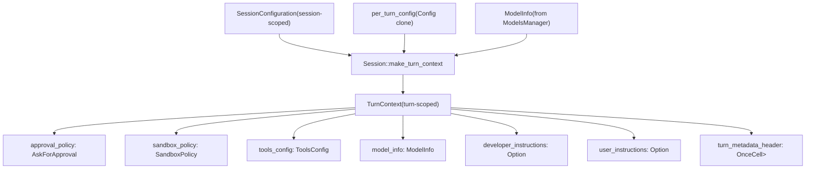
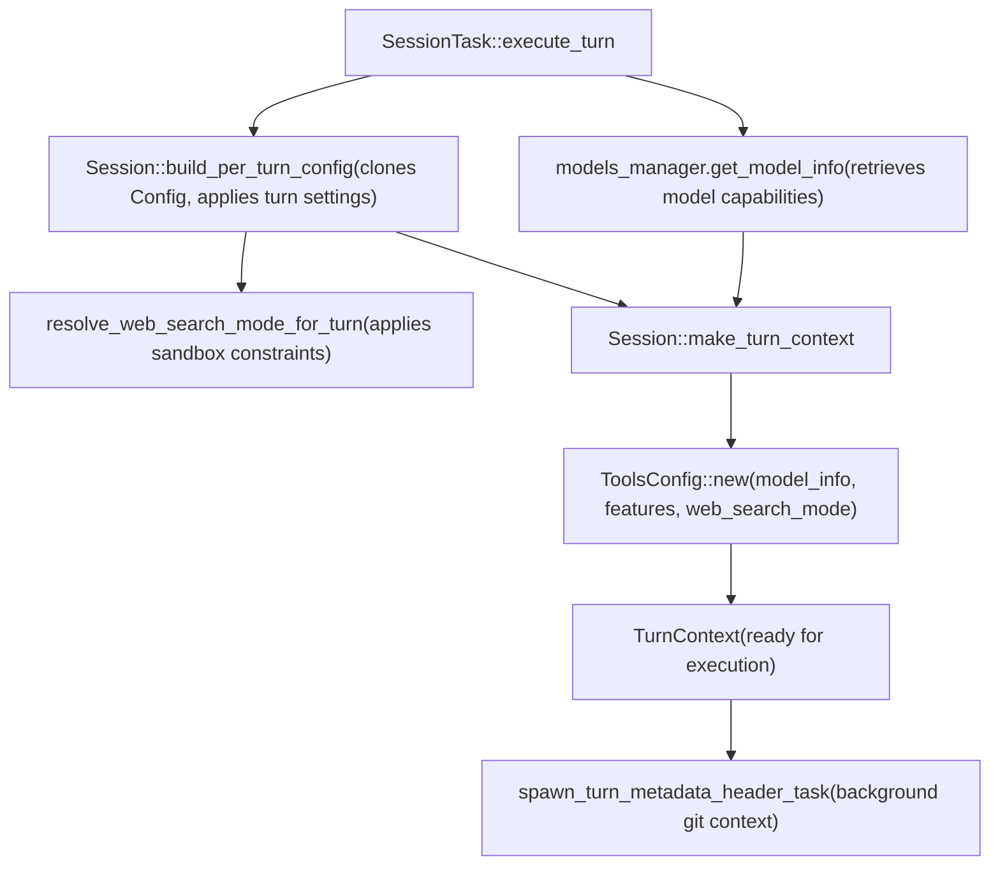
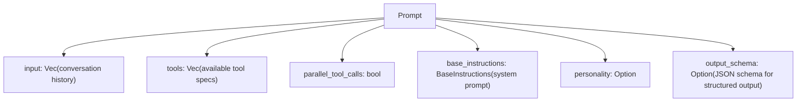
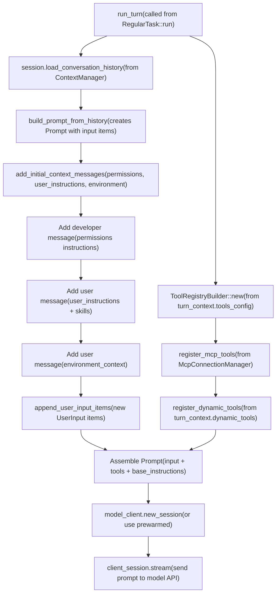
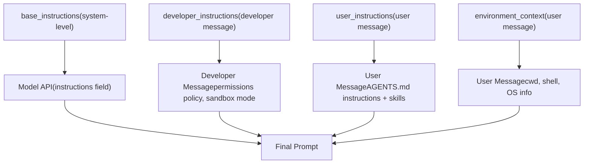
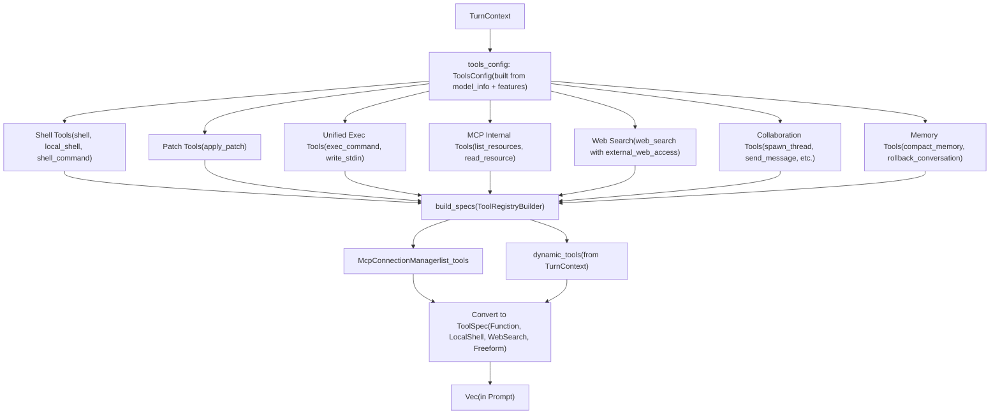
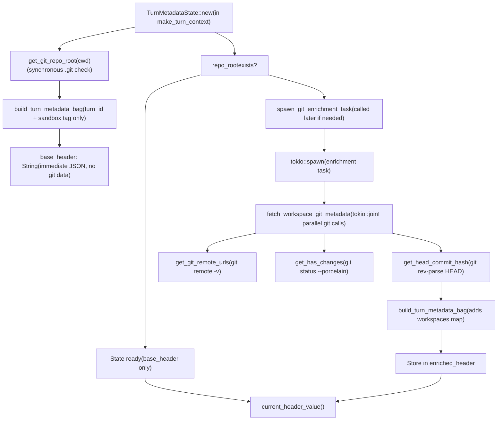

# Turn Execution and Prompt Construction

Relevant source files

-   [.npmrc](https://github.com/openai/codex/blob/d807d44a/.npmrc)
-   [.prettierignore](https://github.com/openai/codex/blob/d807d44a/.prettierignore)
-   [codex-rs/apply-patch/apply\_patch\_tool\_instructions.md](https://github.com/openai/codex/blob/d807d44a/codex-rs/apply-patch/apply_patch_tool_instructions.md?plain=1)
-   [codex-rs/codex-api/src/common.rs](https://github.com/openai/codex/blob/d807d44a/codex-rs/codex-api/src/common.rs)
-   [codex-rs/codex-api/src/endpoint/responses\_websocket.rs](https://github.com/openai/codex/blob/d807d44a/codex-rs/codex-api/src/endpoint/responses_websocket.rs)
-   [codex-rs/codex-api/src/sse/responses.rs](https://github.com/openai/codex/blob/d807d44a/codex-rs/codex-api/src/sse/responses.rs)
-   [codex-rs/core/prompt.md](https://github.com/openai/codex/blob/d807d44a/codex-rs/core/prompt.md?plain=1)
-   [codex-rs/core/src/client.rs](https://github.com/openai/codex/blob/d807d44a/codex-rs/core/src/client.rs)
-   [codex-rs/core/src/client\_common.rs](https://github.com/openai/codex/blob/d807d44a/codex-rs/core/src/client_common.rs)
-   [codex-rs/core/tests/common/responses.rs](https://github.com/openai/codex/blob/d807d44a/codex-rs/core/tests/common/responses.rs)
-   [codex-rs/core/tests/responses\_headers.rs](https://github.com/openai/codex/blob/d807d44a/codex-rs/core/tests/responses_headers.rs)
-   [codex-rs/core/tests/suite/agent\_websocket.rs](https://github.com/openai/codex/blob/d807d44a/codex-rs/core/tests/suite/agent_websocket.rs)
-   [codex-rs/core/tests/suite/client.rs](https://github.com/openai/codex/blob/d807d44a/codex-rs/core/tests/suite/client.rs)
-   [codex-rs/core/tests/suite/client\_websockets.rs](https://github.com/openai/codex/blob/d807d44a/codex-rs/core/tests/suite/client_websockets.rs)
-   [codex-rs/core/tests/suite/prompt\_caching.rs](https://github.com/openai/codex/blob/d807d44a/codex-rs/core/tests/suite/prompt_caching.rs)
-   [codex-rs/core/tests/suite/turn\_state.rs](https://github.com/openai/codex/blob/d807d44a/codex-rs/core/tests/suite/turn_state.rs)
-   [codex-rs/core/tests/suite/websocket\_fallback.rs](https://github.com/openai/codex/blob/d807d44a/codex-rs/core/tests/suite/websocket_fallback.rs)

This document describes how Codex constructs and executes a single turn. It covers the `TurnContext` structure, prompt assembly (history + tools + instructions), and request construction for the model API. For overall session lifecycle and thread management, see [3.1 Codex Interface and Session Lifecycle](https://github.com/openai/codex/blob/d807d44a/3.1 Codex Interface and Session Lifecycle) For how the model client sends requests and handles responses, see [3.2 Model Client and API Communication](https://github.com/openai/codex/blob/d807d44a/3.2 Model Client and API Communication) For how response events are processed and state updated, see [3.4 Event Processing and State Management](https://github.com/openai/codex/blob/d807d44a/3.4 Event Processing and State Management)

---

## TurnContext: Per-Turn Configuration

Each turn creates a `TurnContext` that holds all configuration, policies, and metadata needed for that specific turn. This allows per-turn overrides and ensures turn-scoped settings don't leak across turn boundaries.

**Structure and Fields**

The `TurnContext` struct contains:

| Field Category | Key Fields | Purpose |
| --- | --- | --- |
| **Identity** | `sub_id`, `session_source` | Unique submission ID, session origin (CLI/TUI/VS Code) |
| **Model Selection** | `model_info`, `provider`, `reasoning_effort`, `reasoning_summary` | Model capabilities, provider config, reasoning controls |
| **Policies** | `approval_policy`, `sandbox_policy`, `windows_sandbox_level` | Execution approval requirements, sandboxing strategy |
| **Instructions** | `base_instructions`, `developer_instructions`, `user_instructions`, `compact_prompt`, `personality` | System instructions and personality configuration |
| **Environment** | `cwd`, `shell_environment_policy` | Working directory, shell environment handling |
| **Tools** | `tools_config`, `dynamic_tools` | Available tool registry, custom tool specs |
| **Metadata** | `turn_metadata_header`, `otel_manager` | Git context, telemetry tracking |
| **State** | `tool_call_gate`, `truncation_policy`, `final_output_json_schema` | Tool execution readiness, truncation rules, output schema |

**TurnContext Data Flow**

**Sources:** [codex-rs/core/src/codex.rs506-592](https://github.com/openai/codex/blob/d807d44a/codex-rs/core/src/codex.rs#L506-L592) [codex-rs/core/src/codex.rs785-844](https://github.com/openai/codex/blob/d807d44a/codex-rs/core/src/codex.rs#L785-L844)

---

## TurnContext Construction

The `Session::make_turn_context` function creates a `TurnContext` by combining session configuration with per-turn settings.

**Construction Flow**

**Key Steps:**

1.  **Per-Turn Config Clone:** `Session::build_per_turn_config` creates a `Config` clone with turn-specific reasoning effort, reasoning summary, personality, and web search mode resolved against sandbox constraints.
2.  **Tools Configuration:** `ToolsConfig::new` determines which tools are available based on model capabilities, enabled features, and web search mode. This registry is passed to the model in the prompt.
3.  **Metadata Warmup:** `spawn_turn_metadata_header_task` starts background computation of git context (commit hash, remote URLs) for the `x-codex-turn-metadata` header. This is best-effort and times out after 250ms.

**Sources:** [codex-rs/core/src/codex.rs729-755](https://github.com/openai/codex/blob/d807d44a/codex-rs/core/src/codex.rs#L729-L755) [codex-rs/core/src/codex.rs785-844](https://github.com/openai/codex/blob/d807d44a/codex-rs/core/src/codex.rs#L785-L844) [codex-rs/core/src/codex.rs584-591](https://github.com/openai/codex/blob/d807d44a/codex-rs/core/src/codex.rs#L584-L591)

---

## Prompt Structure

The `Prompt` struct represents the complete API request payload for a single model turn.

**Prompt Fields**

The `input` vector contains the full conversation history in chronological order. Items are normalized; for example, if the `apply_patch` tool is present, shell outputs are reserialized from JSON to structured text to assist model performance [codex-rs/core/src/client\_common.rs48-64](https://github.com/openai/codex/blob/d807d44a/codex-rs/core/src/client_common.rs#L48-L64)

| Item Type | Purpose | Example |
| --- | --- | --- |
| **Developer message** | Permissions and policy instructions | Sandbox mode explanation, approval policy |
| **User message** | User instructions from `AGENTS.md` or config | Custom instructions, skill definitions |
| **User message** | Environment context | CWD, shell type, OS version |
| **User message** | Initial user input | User's request text |
| **Assistant message** | Prior assistant responses | Text output, reasoning, function calls |
| **Function call output** | Tool execution results | Shell command output, patch results |

**Sources:** [codex-rs/core/src/client\_common.rs26-45](https://github.com/openai/codex/blob/d807d44a/codex-rs/core/src/client_common.rs#L26-L45) [codex-rs/core/src/client\_common.rs67-108](https://github.com/openai/codex/blob/d807d44a/codex-rs/core/src/client_common.rs#L67-L108)

---

## Prompt Construction Process

Prompt construction happens within the `run_turn` function, which is called by task implementations like `RegularTask::run`. The process assembles history, tools, and instructions into a single `Prompt`.

**High-Level Flow**

**Sources:** [codex-rs/core/src/codex.rs1000-1500](https://github.com/openai/codex/blob/d807d44a/codex-rs/core/src/codex.rs#L1000-L1500) [codex-rs/core/src/tasks/regular.rs86-109](https://github.com/openai/codex/blob/d807d44a/codex-rs/core/src/tasks/regular.rs#L86-L109) [codex-rs/core/tests/suite/client.rs146-208](https://github.com/openai/codex/blob/d807d44a/codex-rs/core/tests/suite/client.rs#L146-L208)

---

## Instructions Assembly

Instructions are delivered through multiple message types in the prompt input, each with a specific role.

**Instructions Hierarchy**

**Base Instructions:** Set in `SessionConfiguration.base_instructions` at session initialization. Priority order:

1.  `config.base_instructions` override
2.  Resumed session's `session_meta.base_instructions`
3.  Model's default instructions (from `ModelInfo.get_model_instructions(personality)`)

**Developer Instructions:** Injected as the first developer-role message in the input. Contains permissions policy explanation and approval requirements.

**User Instructions:** Injected as the second user-role message. Contains `config.user_instructions` (from `~/.codex/config.toml` or `AGENTS.md`) and skills injections.

**Environment Context:** Injected as the third user-role message. Contains CWD, shell type, and OS info. If `apply_patch` is not natively supported by the model's toolset, `APPLY_PATCH_TOOL_INSTRUCTIONS` are appended to the instructions [codex-rs/core/tests/suite/prompt\_caching.rs211-213](https://github.com/openai/codex/blob/d807d44a/codex-rs/core/tests/suite/prompt_caching.rs#L211-L213)

**Sources:** [codex-rs/core/src/codex.rs336-348](https://github.com/openai/codex/blob/d807d44a/codex-rs/core/src/codex.rs#L336-L348) [codex-rs/core/tests/suite/client.rs605-668](https://github.com/openai/codex/blob/d807d44a/codex-rs/core/tests/suite/client.rs#L605-L668) [codex-rs/core/tests/suite/client.rs422-465](https://github.com/openai/codex/blob/d807d44a/codex-rs/core/tests/suite/client.rs#L422-L465) [codex-rs/core/tests/suite/prompt\_caching.rs188-192](https://github.com/openai/codex/blob/d807d44a/codex-rs/core/tests/suite/prompt_caching.rs#L188-L192)

---

## Tool Selection and Formatting

Tools are selected based on model capabilities and feature flags, then converted to the appropriate API format.

**Tool Selection Flow**

**Tool Spec Types:**

| ToolSpec Variant | API Type | Example Tools |
| --- | --- | --- |
| `ToolSpec::Function` | `type: "function"` | `shell`, `apply_patch`, MCP tools |
| `ToolSpec::LocalShell` | `type: "local_shell"` | Native local shell execution [codex-rs/core/src/client\_common.rs182-183](https://github.com/openai/codex/blob/d807d44a/codex-rs/core/src/client_common.rs#L182-L183) |
| `ToolSpec::WebSearch` | `type: "web_search"` | Web search with `external_web_access` [codex-rs/core/src/client\_common.rs191-193](https://github.com/openai/codex/blob/d807d44a/codex-rs/core/src/client_common.rs#L191-L193) |
| `ToolSpec::Freeform` | `type: "custom"` | Custom tools with freeform input format |

**Sources:** [codex-rs/core/src/client\_common.rs161-223](https://github.com/openai/codex/blob/d807d44a/codex-rs/core/src/client_common.rs#L161-L223) [codex-rs/core/tests/suite/prompt\_caching.rs169-185](https://github.com/openai/codex/blob/d807d44a/codex-rs/core/tests/suite/prompt_caching.rs#L169-L185)

---

## Request Options and Authentication

`ModelClientSession` assembles request-scoped headers and options for the Responses API.

**Sticky Routing and Context Caching** The `x-codex-turn-state` header is used for sticky routing. This token is returned by the server and replayed in subsequent requests within the same turn [codex-rs/core/src/client.rs11-13](https://github.com/openai/codex/blob/d807d44a/codex-rs/core/src/client.rs#L11-L13) For prompt caching, the `conversation_id` is typically mapped to the `prompt_cache_key` [codex-rs/codex-api/src/common.rs168](https://github.com/openai/codex/blob/d807d44a/codex-rs/codex-api/src/common.rs#L168-L168)

**Authentication and Metadata Headers**

-   `OpenAI-Beta`: Used to enable features like `responses_websockets=2026-02-06` [codex-rs/core/src/client.rs120](https://github.com/openai/codex/blob/d807d44a/codex-rs/core/src/client.rs#L120-L120)
-   `x-codex-turn-metadata`: Contains git context (commit hash, remotes) [codex-rs/core/src/client.rs117](https://github.com/openai/codex/blob/d807d44a/codex-rs/core/src/client.rs#L117-L117)
-   `x-openai-subagent`: Identifies the source of the turn (e.g., "review") [codex-rs/core/tests/responses\_headers.rs38](https://github.com/openai/codex/blob/d807d44a/codex-rs/core/tests/responses_headers.rs#L38-L38)

**Request Options Flow**

```mermaid
flowchart TD
    BuildOptions["build_responses_options"]
    reasoning["reasoning: Option<Reasoning>(effort + summary)"]
    include["include: Vec<String>(['reasoning.encrypted_content'])"]
    prompt_cache_key["prompt_cache_key: Some(conversation_id)"]
    text["text: Option<TextControls>(verbosity + output schema)"]
    conversation_id["conversation_id: Some(thread_id)"]
    session_source["session_source: SessionSource"]
    extra_headers["extra_headers: HeaderMap(beta features, turn state, turn metadata)"]
    compression["compression: Compression"]
    turn_state["turn_state: Arc<OnceLock<String>>(sticky routing token)"]

    BuildOptions --> reasoning
    BuildOptions --> include
    BuildOptions --> prompt_cache_key
    BuildOptions --> text
    BuildOptions --> conversation_id
    BuildOptions --> session_source
    BuildOptions --> extra_headers
    BuildOptions --> compression
    BuildOptions --> turn_state
```

**Sources:** [codex-rs/core/src/client.rs586-656](https://github.com/openai/codex/blob/d807d44a/codex-rs/core/src/client.rs#L586-L656) [codex-rs/codex-api/src/sse/responses.rs78-85](https://github.com/openai/codex/blob/d807d44a/codex-rs/codex-api/src/sse/responses.rs#L78-L85) [codex-rs/core/tests/responses\_headers.rs27-41](https://github.com/openai/codex/blob/d807d44a/codex-rs/core/tests/responses_headers.rs#L27-L41)

---

## Turn Metadata Construction

The `x-codex-turn-metadata` header provides git context to the model API. Construction uses a two-phase approach: immediate base metadata, then optional asynchronous git enrichment.

**Metadata Construction Flow**

**Sources:** [codex-rs/core/src/turn\_metadata.rs130-236](https://github.com/openai/codex/blob/d807d44a/codex-rs/core/src/turn_metadata.rs#L130-L236) [codex-rs/core/src/git\_info.rs47-261](https://github.com/openai/codex/blob/d807d44a/codex-rs/core/src/git_info.rs#L47-L261)
