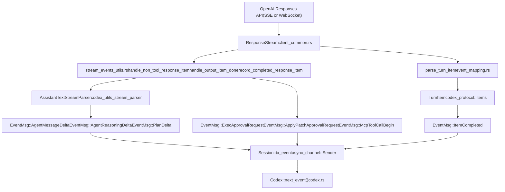
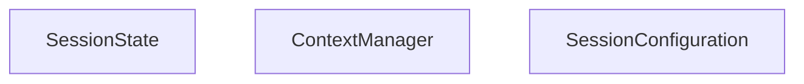

# Event Processing and State Management

Relevant source files

-   [codex-rs/core/src/codex.rs](https://github.com/openai/codex/blob/d807d44a/codex-rs/core/src/codex.rs)
-   [codex-rs/core/src/context\_manager/history.rs](https://github.com/openai/codex/blob/d807d44a/codex-rs/core/src/context_manager/history.rs)
-   [codex-rs/core/src/context\_manager/history\_tests.rs](https://github.com/openai/codex/blob/d807d44a/codex-rs/core/src/context_manager/history_tests.rs)
-   [codex-rs/core/src/context\_manager/mod.rs](https://github.com/openai/codex/blob/d807d44a/codex-rs/core/src/context_manager/mod.rs)
-   [codex-rs/core/src/context\_manager/normalize.rs](https://github.com/openai/codex/blob/d807d44a/codex-rs/core/src/context_manager/normalize.rs)
-   [codex-rs/core/src/event\_mapping.rs](https://github.com/openai/codex/blob/d807d44a/codex-rs/core/src/event_mapping.rs)
-   [codex-rs/core/src/rollout/policy.rs](https://github.com/openai/codex/blob/d807d44a/codex-rs/core/src/rollout/policy.rs)
-   [codex-rs/core/src/stream\_events\_utils.rs](https://github.com/openai/codex/blob/d807d44a/codex-rs/core/src/stream_events_utils.rs)
-   [codex-rs/core/src/stream\_events\_utils\_tests.rs](https://github.com/openai/codex/blob/d807d44a/codex-rs/core/src/stream_events_utils_tests.rs)
-   [codex-rs/core/src/tools/mod.rs](https://github.com/openai/codex/blob/d807d44a/codex-rs/core/src/tools/mod.rs)
-   [codex-rs/core/src/truncate.rs](https://github.com/openai/codex/blob/d807d44a/codex-rs/core/src/truncate.rs)
-   [codex-rs/core/tests/suite/items.rs](https://github.com/openai/codex/blob/d807d44a/codex-rs/core/tests/suite/items.rs)
-   [codex-rs/core/tests/suite/shell\_serialization.rs](https://github.com/openai/codex/blob/d807d44a/codex-rs/core/tests/suite/shell_serialization.rs)
-   [codex-rs/core/tests/suite/tool\_harness.rs](https://github.com/openai/codex/blob/d807d44a/codex-rs/core/tests/suite/tool_harness.rs)
-   [codex-rs/core/tests/suite/tools.rs](https://github.com/openai/codex/blob/d807d44a/codex-rs/core/tests/suite/tools.rs)
-   [codex-rs/exec/src/event\_processor.rs](https://github.com/openai/codex/blob/d807d44a/codex-rs/exec/src/event_processor.rs)
-   [codex-rs/exec/src/event\_processor\_with\_human\_output.rs](https://github.com/openai/codex/blob/d807d44a/codex-rs/exec/src/event_processor_with_human_output.rs)
-   [codex-rs/mcp-server/src/codex\_tool\_runner.rs](https://github.com/openai/codex/blob/d807d44a/codex-rs/mcp-server/src/codex_tool_runner.rs)
-   [codex-rs/protocol/src/items.rs](https://github.com/openai/codex/blob/d807d44a/codex-rs/protocol/src/items.rs)
-   [codex-rs/protocol/src/protocol.rs](https://github.com/openai/codex/blob/d807d44a/codex-rs/protocol/src/protocol.rs)
-   [codex-rs/tui/src/app.rs](https://github.com/openai/codex/blob/d807d44a/codex-rs/tui/src/app.rs)
-   [codex-rs/tui/src/app\_event.rs](https://github.com/openai/codex/blob/d807d44a/codex-rs/tui/src/app_event.rs)
-   [codex-rs/tui/src/bottom\_pane/chat\_composer.rs](https://github.com/openai/codex/blob/d807d44a/codex-rs/tui/src/bottom_pane/chat_composer.rs)
-   [codex-rs/tui/src/bottom\_pane/mod.rs](https://github.com/openai/codex/blob/d807d44a/codex-rs/tui/src/bottom_pane/mod.rs)
-   [codex-rs/tui/src/chatwidget.rs](https://github.com/openai/codex/blob/d807d44a/codex-rs/tui/src/chatwidget.rs)
-   [codex-rs/tui/src/chatwidget/tests.rs](https://github.com/openai/codex/blob/d807d44a/codex-rs/tui/src/chatwidget/tests.rs)
-   [codex-rs/tui/src/history\_cell.rs](https://github.com/openai/codex/blob/d807d44a/codex-rs/tui/src/history_cell.rs)
-   [codex-rs/tui/src/slash\_command.rs](https://github.com/openai/codex/blob/d807d44a/codex-rs/tui/src/slash_command.rs)

This page covers how the core agent system maps raw API streaming events into protocol-level `EventMsg` variants, how `SessionState` accumulates and updates per-turn data (token usage, rate limits, MCP tool selection, conversation history), and how those updates flow from the end of each turn back into the session for subsequent turns.

For the `Op` submission side of the protocol (how messages get *in* to the session), see [Protocol Layer (Submission/Event System)](/openai/codex/2.1-protocol-layer-(submissionevent-system)). For conversation history representation and truncation, see [Conversation History Management](/openai/codex/3.5-conversation-history-management). For how `RegularTask` assembles the prompt before streaming begins, see [Turn Execution and Prompt Construction](/openai/codex/3.3-turn-execution-and-prompt-construction).

---

## Event Processing Pipeline

When a turn runs, `ModelClientSession::stream()` returns a `ResponseStream` that yields raw `ResponseEvent` items from the OpenAI Responses API (over SSE or WebSocket) [codex-rs/core/src/client\_common.rs161](https://github.com/openai/codex/blob/d807d44a/codex-rs/core/src/client_common.rs#L161-L161) The turn runner—primarily `RegularTask`—consumes these events and maps them to two parallel outputs:

1.  **`EventMsg` variants** emitted over the `Session::tx_event` channel to be received by callers via `Codex::next_event()` [codex-rs/core/src/codex.rs115](https://github.com/openai/codex/blob/d807d44a/codex-rs/core/src/codex.rs#L115-L115)
2.  **`ResponseItem` records** stored in `ContextManager` (the history) for the next turn's prompt [codex-rs/core/src/context\_manager/mod.rs1-10](https://github.com/openai/codex/blob/d807d44a/codex-rs/core/src/context_manager/mod.rs#L1-L10)

The key intermediate functions are in `codex-rs/core/src/stream_events_utils.rs` and `codex-rs/core/src/event_mapping.rs`.

**API Response-to-EventMsg Pipeline**


Sources: [codex-rs/core/src/codex.rs43-48](https://github.com/openai/codex/blob/d807d44a/codex-rs/core/src/codex.rs#L43-L48) [codex-rs/core/src/client\_common.rs161](https://github.com/openai/codex/blob/d807d44a/codex-rs/core/src/client_common.rs#L161-L161) [codex-rs/core/src/codex.rs115](https://github.com/openai/codex/blob/d807d44a/codex-rs/core/src/codex.rs#L115-L115) [codex-rs/protocol/src/protocol.rs204-210](https://github.com/openai/codex/blob/d807d44a/codex-rs/protocol/src/protocol.rs#L204-L210)

### parse\_turn\_item

`parse_turn_item` converts a low-level `ResponseEvent` from the API into a higher-level `TurnItem` [codex-rs/core/src/codex.rs35](https://github.com/openai/codex/blob/d807d44a/codex-rs/core/src/codex.rs#L35-L35) The `TurnItem` enum covers the meaningful content types the agent can produce:

| `TurnItem` variant | Source data |
| --- | --- |
| `AgentMessageItem` | Text output from the assistant [codex-rs/tui/src/chatwidget.rs97](https://github.com/openai/codex/blob/d807d44a/codex-rs/tui/src/chatwidget.rs#L97-L97) |
| `ReasoningItem` | Encrypted or summarized reasoning blocks [codex-rs/protocol/src/protocol.rs40](https://github.com/openai/codex/blob/d807d44a/codex-rs/protocol/src/protocol.rs#L40-L40) |
| `UserMessageItem` | User-role messages injected by the system [codex-rs/protocol/src/protocol.rs88](https://github.com/openai/codex/blob/d807d44a/codex-rs/protocol/src/protocol.rs#L88-L88) |
| `WebSearchItem` | Web search calls and their results [codex-rs/protocol/src/protocol.rs42](https://github.com/openai/codex/blob/d807d44a/codex-rs/protocol/src/protocol.rs#L42-L42) |
| `Plan(PlanItem)` | Structured plan proposed by the model [codex-rs/protocol/src/protocol.rs86](https://github.com/openai/codex/blob/d807d44a/codex-rs/protocol/src/protocol.rs#L86-L86) |

After `parse_turn_item` produces a `TurnItem`, it is wrapped into an `EventMsg::ItemCompleted(ItemCompletedEvent { item, .. })` and emitted when the item is done [codex-rs/core/src/codex.rs99](https://github.com/openai/codex/blob/d807d44a/codex-rs/core/src/codex.rs#L99-L99)

Sources: [codex-rs/core/src/codex.rs35](https://github.com/openai/codex/blob/d807d44a/codex-rs/core/src/codex.rs#L35-L35) [codex-rs/protocol/src/protocol.rs30-42](https://github.com/openai/codex/blob/d807d44a/codex-rs/protocol/src/protocol.rs#L30-L42) [codex-rs/tui/src/chatwidget.rs96-104](https://github.com/openai/codex/blob/d807d44a/codex-rs/tui/src/chatwidget.rs#L96-L104)

### AssistantTextStreamParser

For streaming text output, `AssistantTextStreamParser` (from the `codex_utils_stream_parser` crate) accumulates `AssistantTextChunk` deltas [codex-rs/core/src/codex.rs120-121](https://github.com/openai/codex/blob/d807d44a/codex-rs/core/src/codex.rs#L120-L121) It also identifies `ProposedPlanSegment` blocks embedded in the streamed text [codex-rs/core/src/codex.rs122-123](https://github.com/openai/codex/blob/d807d44a/codex-rs/core/src/codex.rs#L122-L123) This drives two distinct delta event types:

-   `EventMsg::AgentMessageDelta` — raw text delta for the UI to append [codex-rs/tui/src/chatwidget.rs101](https://github.com/openai/codex/blob/d807d44a/codex-rs/tui/src/chatwidget.rs#L101-L101)
-   `EventMsg::PlanDelta` — emitted when a structured plan block is being streamed [codex-rs/tui/src/chatwidget.rs146](https://github.com/openai/codex/blob/d807d44a/codex-rs/tui/src/chatwidget.rs#L146-L146)

Sources: [codex-rs/core/src/codex.rs120-123](https://github.com/openai/codex/blob/d807d44a/codex-rs/core/src/codex.rs#L120-L123) [codex-rs/tui/src/chatwidget.rs101-146](https://github.com/openai/codex/blob/d807d44a/codex-rs/tui/src/chatwidget.rs#L101-L146)

---

## EventMsg Variant Taxonomy

`EventMsg` is the main discriminated union representing all observable state changes and notifications. It is defined in `codex-rs/protocol/src/protocol.rs` and consumed by every client (TUI, exec mode, app server, MCP server) [codex-rs/protocol/src/protocol.rs204-210](https://github.com/openai/codex/blob/d807d44a/codex-rs/protocol/src/protocol.rs#L204-L210)

**EventMsg Variant Groups**


Sources: [codex-rs/protocol/src/protocol.rs204-210](https://github.com/openai/codex/blob/d807d44a/codex-rs/protocol/src/protocol.rs#L204-L210) [codex-rs/tui/src/chatwidget.rs101-149](https://github.com/openai/codex/blob/d807d44a/codex-rs/tui/src/chatwidget.rs#L101-L149) [codex-rs/exec/src/event\_processor\_with\_human\_output.rs5-41](https://github.com/openai/codex/blob/d807d44a/codex-rs/exec/src/event_processor_with_human_output.rs#L5-L41)

Key event payloads:

| Event | Key payload fields |
| --- | --- |
| `SessionConfiguredEvent` | `session_id`, `model`, `initial_messages` [codex-rs/tui/src/history\_cell.rs59](https://github.com/openai/codex/blob/d807d44a/codex-rs/tui/src/history_cell.rs#L59-L59) |
| `TurnCompleteEvent` | `last_agent_message: Option<String>` [codex-rs/protocol/src/protocol.rs38](https://github.com/openai/codex/blob/d807d44a/codex-rs/protocol/src/protocol.rs#L38-L38) |
| `TurnAbortReason` | `reason: TurnAbortReason` [codex-rs/protocol/src/protocol.rs106](https://github.com/openai/codex/blob/d807d44a/codex-rs/protocol/src/protocol.rs#L106-L106) |
| `TokenCountEvent` | `info: Option<TokenUsageInfo>` [codex-rs/tui/src/chatwidget.rs143](https://github.com/openai/codex/blob/d807d44a/codex-rs/tui/src/chatwidget.rs#L143-L143) |
| `ExecApprovalRequestEvent` | `command`, `cwd`, `call_id`, `approval_id`, `reason` [codex-rs/protocol/src/protocol.rs63](https://github.com/openai/codex/blob/d807d44a/codex-rs/protocol/src/protocol.rs#L63-L63) |
| `StreamErrorEvent` | `message`, `additional_details` [codex-rs/protocol/src/protocol.rs140](https://github.com/openai/codex/blob/d807d44a/codex-rs/protocol/src/protocol.rs#L140-L140) |
| `TurnDiffEvent` | `changes: Vec<FileChange>` [codex-rs/protocol/src/protocol.rs146](https://github.com/openai/codex/blob/d807d44a/codex-rs/protocol/src/protocol.rs#L146-L146) |

Sources: [codex-rs/protocol/src/protocol.rs38-146](https://github.com/openai/codex/blob/d807d44a/codex-rs/protocol/src/protocol.rs#L38-L146) [codex-rs/tui/src/chatwidget.rs143](https://github.com/openai/codex/blob/d807d44a/codex-rs/tui/src/chatwidget.rs#L143-L143) [codex-rs/tui/src/history\_cell.rs59](https://github.com/openai/codex/blob/d807d44a/codex-rs/tui/src/history_cell.rs#L59-L59)

---

## SessionState Structure

`SessionState` is the mutable, per-session data store. It is held inside `Session::state: Mutex<SessionState>`, meaning all mutations happen under lock.

**SessionState Fields and Relationships**


Sources: [codex-rs/core/src/codex.rs1-155](https://github.com/openai/codex/blob/d807d44a/codex-rs/core/src/codex.rs#L1-L155) [codex-rs/protocol/src/protocol.rs101-111](https://github.com/openai/codex/blob/d807d44a/codex-rs/protocol/src/protocol.rs#L101-L111)

The `ContextManager` is where the actual conversation `ResponseItem` records live. `SessionState` delegates all history operations to it.

---

## Token Usage Tracking

Token usage data originates from the API response (in the SSE `response.completed` event or the WebSocket final frame). It flows through the following path:

1.  Turn runner receives completion data containing a `TokenUsage` struct [codex-rs/protocol/src/protocol.rs142](https://github.com/openai/codex/blob/d807d44a/codex-rs/protocol/src/protocol.rs#L142-L142)
2.  Calls `SessionState::update_token_info_from_usage(usage, model_context_window)`.
3.  This delegates to `ContextManager::update_token_info()`, which stores a `TokenUsageInfo` snapshot [codex-rs/protocol/src/protocol.rs143](https://github.com/openai/codex/blob/d807d44a/codex-rs/protocol/src/protocol.rs#L143-L143)
4.  When the turn runner emits `EventMsg::TokenCount(TokenCountEvent { info })`, it reads back the stored `TokenUsageInfo` to populate the event [codex-rs/tui/src/chatwidget.rs143](https://github.com/openai/codex/blob/d807d44a/codex-rs/tui/src/chatwidget.rs#L143-L143)

```
TokenUsage (API response payload)
  → SessionState::update_token_info_from_usage()
    → ContextManager::update_token_info()
      stored as Option<TokenUsageInfo>
  → SessionState::token_info()
    → EventMsg::TokenCount { info }
```
Sources: [codex-rs/protocol/src/protocol.rs142-143](https://github.com/openai/codex/blob/d807d44a/codex-rs/protocol/src/protocol.rs#L142-L143) [codex-rs/tui/src/chatwidget.rs143](https://github.com/openai/codex/blob/d807d44a/codex-rs/tui/src/chatwidget.rs#L143-L143)

---

## Rate Limit Tracking

Rate limit headers from the API response (e.g., `x-ratelimit-remaining-requests`, `x-ratelimit-remaining-tokens`) are extracted and converted into a `RateLimitSnapshot` [codex-rs/protocol/src/protocol.rs136](https://github.com/openai/codex/blob/d807d44a/codex-rs/protocol/src/protocol.rs#L136-L136) The snapshot is merged into `SessionState::latest_rate_limits`.

`RateLimitSnapshot` includes fields for requests and tokens across different windows [codex-rs/tui/src/chatwidget.rs136](https://github.com/openai/codex/blob/d807d44a/codex-rs/tui/src/chatwidget.rs#L136-L136) This handles cases where rate limit headers for requests and tokens arrive on different responses.

Sources: [codex-rs/protocol/src/protocol.rs136](https://github.com/openai/codex/blob/d807d44a/codex-rs/protocol/src/protocol.rs#L136-L136) [codex-rs/tui/src/chatwidget.rs136](https://github.com/openai/codex/blob/d807d44a/codex-rs/tui/src/chatwidget.rs#L136-L136)

---

## MCP Tool Selection State

`active_mcp_tool_selection` tracks which MCP tool names are currently selected for the session. This set grows over time as tools are mentioned by the model or selected by the user.

The `active_mcp_tool_selection` is read back at each turn to filter which MCP tools are offered to the model in the prompt's tool list, rather than including all tools from all configured MCP servers.

`active_connector_selection: HashSet<String>` serves a similar purpose for app connectors.

Sources: [codex-rs/core/src/codex.rs1-100](https://github.com/openai/codex/blob/d807d44a/codex-rs/core/src/codex.rs#L1-L100) [codex-rs/tui/src/chatwidget.rs128-133](https://github.com/openai/codex/blob/d807d44a/codex-rs/tui/src/chatwidget.rs#L128-L133)

---

## Per-Turn State Update Sequence

The diagram below shows the order of state mutations across a single complete turn:

**Per-Turn SessionState Update Flow**

Sources: [codex-rs/core/src/codex.rs43-55](https://github.com/openai/codex/blob/d807d44a/codex-rs/core/src/codex.rs#L43-L55) [codex-rs/core/src/stream\_events\_utils.rs43-48](https://github.com/openai/codex/blob/d807d44a/codex-rs/core/src/stream_events_utils.rs#L43-L48)

---

## Event Persistence Filtering

Not all events are written to the session's rollout JSONL file. `RolloutItem` wraps the persisted content [codex-rs/protocol/src/protocol.rs103](https://github.com/openai/codex/blob/d807d44a/codex-rs/protocol/src/protocol.rs#L103-L103):

| Rollout Item Variant | Description |
| --- | --- |
| `ResponseItem(ResponseItem)` | Conversation data [codex-rs/protocol/src/protocol.rs41](https://github.com/openai/codex/blob/d807d44a/codex-rs/protocol/src/protocol.rs#L41-L41) |
| `EventMsg(EventMsg)` | Selected protocol events [codex-rs/protocol/src/protocol.rs204-210](https://github.com/openai/codex/blob/d807d44a/codex-rs/protocol/src/protocol.rs#L204-L210) |
| `TurnContext(TurnContextItem)` | Per-turn config snapshot [codex-rs/protocol/src/protocol.rs107](https://github.com/openai/codex/blob/d807d44a/codex-rs/protocol/src/protocol.rs#L107-L107) |

Sources: [codex-rs/protocol/src/protocol.rs41-210](https://github.com/openai/codex/blob/d807d44a/codex-rs/protocol/src/protocol.rs#L41-L210)

---

## AgentStatus Watch Channel

`Session` maintains a `watch::Sender<AgentStatus>` [codex-rs/core/src/codex.rs140](https://github.com/openai/codex/blob/d807d44a/codex-rs/core/src/codex.rs#L140-L140) This is a Tokio watch channel, meaning any watcher always sees the most recent value without buffering all updates.

`AgentStatus` is derived from `EventMsg` values via the `agent_status_from_event` function [codex-rs/core/src/codex.rs14](https://github.com/openai/codex/blob/d807d44a/codex-rs/core/src/codex.rs#L14-L14) When a significant event arrives (turn start, turn complete, abort, etc.), the watch is updated.

Sources: [codex-rs/core/src/codex.rs14-140](https://github.com/openai/codex/blob/d807d44a/codex-rs/core/src/codex.rs#L14-L140)

---

## TurnContext Snapshot

`TurnContext` is assembled from `SessionState` at the start of each turn and passed to the running task. It is **not mutated** during the turn—it represents a frozen view of session settings for that turn's duration:

| `TurnContext` field | Source |
| --- | --- |
| `cwd: PathBuf` | From session or per-turn `Op::UserInput` [codex-rs/protocol/src/protocol.rs110](https://github.com/openai/codex/blob/d807d44a/codex-rs/protocol/src/protocol.rs#L110-L110) |
| `approval_policy` | From `SessionConfiguration` [codex-rs/protocol/src/protocol.rs85](https://github.com/openai/codex/blob/d807d44a/codex-rs/protocol/src/protocol.rs#L85-L85) |
| `sandbox_policy` | From `SessionConfiguration` [codex-rs/protocol/src/protocol.rs91](https://github.com/openai/codex/blob/d807d44a/codex-rs/protocol/src/protocol.rs#L91-L91) |
| `features: Features` | Invariant for session lifetime [codex-rs/core/src/codex.rs59](https://github.com/openai/codex/blob/d807d44a/codex-rs/core/src/codex.rs#L59-L59) |

`TurnContextItem` is stored in the rollout file as `RolloutItem::TurnContext`, making per-turn settings reproducible during session replay [codex-rs/protocol/src/protocol.rs107](https://github.com/openai/codex/blob/d807d44a/codex-rs/protocol/src/protocol.rs#L107-L107)

Sources: [codex-rs/core/src/codex.rs59](https://github.com/openai/codex/blob/d807d44a/codex-rs/core/src/codex.rs#L59-L59) [codex-rs/protocol/src/protocol.rs85-110](https://github.com/openai/codex/blob/d807d44a/codex-rs/protocol/src/protocol.rs#L85-L110)
