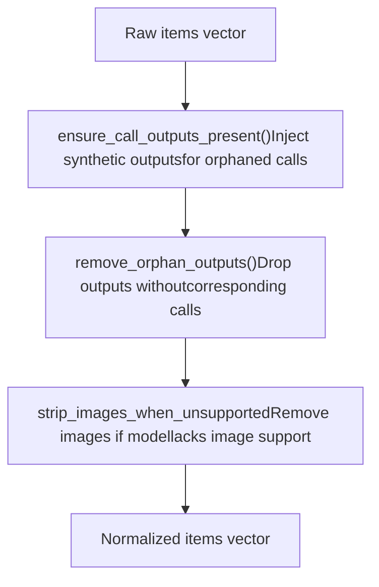
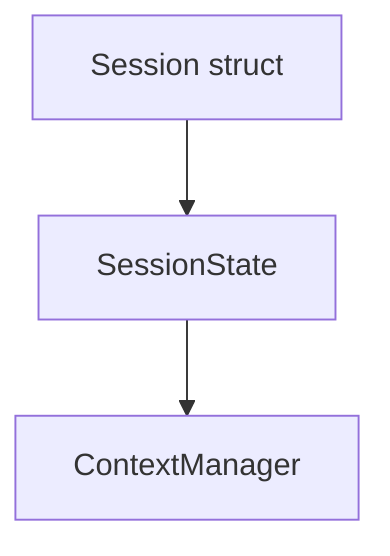

# Conversation History Management

Relevant source files

-   [codex-rs/app-server/tests/suite/v2/mcp\_server\_elicitation.rs](https://github.com/openai/codex/blob/d807d44a/codex-rs/app-server/tests/suite/v2/mcp_server_elicitation.rs)
-   [codex-rs/cli/src/mcp\_cmd.rs](https://github.com/openai/codex/blob/d807d44a/codex-rs/cli/src/mcp_cmd.rs)
-   [codex-rs/cli/tests/mcp\_add\_remove.rs](https://github.com/openai/codex/blob/d807d44a/codex-rs/cli/tests/mcp_add_remove.rs)
-   [codex-rs/cli/tests/mcp\_list.rs](https://github.com/openai/codex/blob/d807d44a/codex-rs/cli/tests/mcp_list.rs)
-   [codex-rs/core/src/context\_manager/history.rs](https://github.com/openai/codex/blob/d807d44a/codex-rs/core/src/context_manager/history.rs)
-   [codex-rs/core/src/context\_manager/history\_tests.rs](https://github.com/openai/codex/blob/d807d44a/codex-rs/core/src/context_manager/history_tests.rs)
-   [codex-rs/core/src/context\_manager/mod.rs](https://github.com/openai/codex/blob/d807d44a/codex-rs/core/src/context_manager/mod.rs)
-   [codex-rs/core/src/context\_manager/normalize.rs](https://github.com/openai/codex/blob/d807d44a/codex-rs/core/src/context_manager/normalize.rs)
-   [codex-rs/core/src/event\_mapping.rs](https://github.com/openai/codex/blob/d807d44a/codex-rs/core/src/event_mapping.rs)
-   [codex-rs/core/src/mcp\_connection\_manager.rs](https://github.com/openai/codex/blob/d807d44a/codex-rs/core/src/mcp_connection_manager.rs)
-   [codex-rs/core/src/mcp\_connection\_manager\_tests.rs](https://github.com/openai/codex/blob/d807d44a/codex-rs/core/src/mcp_connection_manager_tests.rs)
-   [codex-rs/core/src/state/session.rs](https://github.com/openai/codex/blob/d807d44a/codex-rs/core/src/state/session.rs)
-   [codex-rs/core/src/state/turn.rs](https://github.com/openai/codex/blob/d807d44a/codex-rs/core/src/state/turn.rs)
-   [codex-rs/core/src/stream\_events\_utils.rs](https://github.com/openai/codex/blob/d807d44a/codex-rs/core/src/stream_events_utils.rs)
-   [codex-rs/core/src/stream\_events\_utils\_tests.rs](https://github.com/openai/codex/blob/d807d44a/codex-rs/core/src/stream_events_utils_tests.rs)
-   [codex-rs/core/src/tasks/mod.rs](https://github.com/openai/codex/blob/d807d44a/codex-rs/core/src/tasks/mod.rs)
-   [codex-rs/core/src/tools/handlers/tool\_search\_tests.rs](https://github.com/openai/codex/blob/d807d44a/codex-rs/core/src/tools/handlers/tool_search_tests.rs)
-   [codex-rs/core/src/tools/mod.rs](https://github.com/openai/codex/blob/d807d44a/codex-rs/core/src/tools/mod.rs)
-   [codex-rs/core/src/truncate.rs](https://github.com/openai/codex/blob/d807d44a/codex-rs/core/src/truncate.rs)
-   [codex-rs/core/tests/suite/items.rs](https://github.com/openai/codex/blob/d807d44a/codex-rs/core/tests/suite/items.rs)
-   [codex-rs/core/tests/suite/rmcp\_client.rs](https://github.com/openai/codex/blob/d807d44a/codex-rs/core/tests/suite/rmcp_client.rs)
-   [codex-rs/core/tests/suite/shell\_serialization.rs](https://github.com/openai/codex/blob/d807d44a/codex-rs/core/tests/suite/shell_serialization.rs)
-   [codex-rs/core/tests/suite/tool\_harness.rs](https://github.com/openai/codex/blob/d807d44a/codex-rs/core/tests/suite/tool_harness.rs)
-   [codex-rs/core/tests/suite/tools.rs](https://github.com/openai/codex/blob/d807d44a/codex-rs/core/tests/suite/tools.rs)
-   [codex-rs/core/tests/suite/truncation.rs](https://github.com/openai/codex/blob/d807d44a/codex-rs/core/tests/suite/truncation.rs)
-   [codex-rs/core/tests/suite/user\_shell\_cmd.rs](https://github.com/openai/codex/blob/d807d44a/codex-rs/core/tests/suite/user_shell_cmd.rs)
-   [codex-rs/protocol/src/items.rs](https://github.com/openai/codex/blob/d807d44a/codex-rs/protocol/src/items.rs)
-   [codex-rs/rmcp-client/src/rmcp\_client.rs](https://github.com/openai/codex/blob/d807d44a/codex-rs/rmcp-client/src/rmcp_client.rs)
-   [codex-rs/rmcp-client/tests/streamable\_http\_recovery.rs](https://github.com/openai/codex/blob/d807d44a/codex-rs/rmcp-client/tests/streamable_http_recovery.rs)

This document describes how Codex maintains and manipulates the conversation history that forms the model's context window. It covers the `ContextManager` data structure, item recording and normalization, token estimation, and history lifecycle management.

For details on **summarizing and compacting** conversation history when context limits are approached, see [History Compaction System](/openai/codex/3.5.1-history-compaction-system). For information on **persisting history to disk** and replaying it during session resumption, see [Rollout Persistence and Replay](/openai/codex/3.5.2-rollout-persistence-and-replay).

---

## Overview

The conversation history manager is responsible for:

-   Storing `ResponseItem` entries (user messages, assistant messages, tool calls, tool outputs, reasoning items) [codex-rs/core/src/context\_manager/history.rs30-33](https://github.com/openai/codex/blob/d807d44a/codex-rs/core/src/context_manager/history.rs#L30-L33)
-   Normalizing history to maintain invariants, such as ensuring every tool call has a corresponding output [codex-rs/core/src/context\_manager/normalize.rs14-16](https://github.com/openai/codex/blob/d807d44a/codex-rs/core/src/context_manager/normalize.rs#L14-L16)
-   Tracking token usage from API responses and estimating tokens for locally-added items [codex-rs/core/src/context\_manager/history.rs126-133](https://github.com/openai/codex/blob/d807d44a/codex-rs/core/src/context_manager/history.rs#L126-L133)
-   Preparing history for prompt construction by filtering and transforming items [codex-rs/core/src/context\_manager/history.rs112-117](https://github.com/openai/codex/blob/d807d44a/codex-rs/core/src/context_manager/history.rs#L112-L117)
-   Supporting history modification operations like removal, replacement, and compaction [codex-rs/core/src/context\_manager/history.rs151-174](https://github.com/openai/codex/blob/d807d44a/codex-rs/core/src/context_manager/history.rs#L151-L174)

The primary entry point is the `ContextManager` struct, which is owned by `SessionState` and manipulated by `Session` methods [codex-rs/core/src/state/session.rs20-22](https://github.com/openai/codex/blob/d807d44a/codex-rs/core/src/state/session.rs#L20-L22)

**Sources:** [codex-rs/core/src/context\_manager/history.rs29-44](https://github.com/openai/codex/blob/d807d44a/codex-rs/core/src/context_manager/history.rs#L29-L44) [codex-rs/core/src/state/session.rs20-36](https://github.com/openai/codex/blob/d807d44a/codex-rs/core/src/state/session.rs#L20-L36)

---

## ContextManager Structure

**ContextManager Fields**

| Field | Type | Purpose |
| --- | --- | --- |
| `items` | `Vec<ResponseItem>` | Ordered history from oldest to newest [codex-rs/core/src/context\_manager/history.rs33](https://github.com/openai/codex/blob/d807d44a/codex-rs/core/src/context_manager/history.rs#L33-L33) |
| `token_info` | `Option<TokenUsageInfo>` | Last API-reported token usage [codex-rs/core/src/context\_manager/history.rs34](https://github.com/openai/codex/blob/d807d44a/codex-rs/core/src/context_manager/history.rs#L34-L34) |
| `reference_context_item` | `Option<TurnContextItem>` | Baseline for detecting settings changes [codex-rs/core/src/context\_manager/history.rs43](https://github.com/openai/codex/blob/d807d44a/codex-rs/core/src/context_manager/history.rs#L43-L43) |

The `items` vector maintains chronological order. Items at index 0 are oldest; items at the end are most recent [codex-rs/core/src/context\_manager/history.rs153-155](https://github.com/openai/codex/blob/d807d44a/codex-rs/core/src/context_manager/history.rs#L153-L155)

**Sources:** [codex-rs/core/src/context\_manager/history.rs30-44](https://github.com/openai/codex/blob/d807d44a/codex-rs/core/src/context_manager/history.rs#L30-L44) [codex-rs/core/src/context\_manager/history.rs54-63](https://github.com/openai/codex/blob/d807d44a/codex-rs/core/src/context_manager/history.rs#L54-L63)

---

## Recording Items into History

Items flow into the history manager through the `record_items` method, which accepts any iterator of `ResponseItem` references and a `TruncationPolicy` [codex-rs/core/src/context\_manager/history.rs91-95](https://github.com/openai/codex/blob/d807d44a/codex-rs/core/src/context_manager/history.rs#L91-L95):

> **[Mermaid sequence]**
> *(图表结构无法解析)*

### Item Filtering

Only items that contribute to model context are recorded. Messages with roles `"user"`, `"assistant"`, and `"developer"` are retained, while others are skipped [codex-rs/core/src/context\_manager/history.rs98-101](https://github.com/openai/codex/blob/d807d44a/codex-rs/core/src/context_manager/history.rs#L98-L101) `GhostSnapshot` items are also recorded to support session state tracking but are filtered out during prompt generation [codex-rs/core/src/context\_manager/history.rs114-116](https://github.com/openai/codex/blob/d807d44a/codex-rs/core/src/context_manager/history.rs#L114-L116)

**Sources:** [codex-rs/core/src/context\_manager/history.rs91-106](https://github.com/openai/codex/blob/d807d44a/codex-rs/core/src/context_manager/history.rs#L91-L106) [codex-rs/core/src/context\_manager/history.rs114-116](https://github.com/openai/codex/blob/d807d44a/codex-rs/core/src/context_manager/history.rs#L114-L116)

### Truncation Policies

The `TruncationPolicy` enum controls how large content is truncated [codex-rs/core/src/truncate.rs12-16](https://github.com/openai/codex/blob/d807d44a/codex-rs/core/src/truncate.rs#L12-L16):

| Policy | Description |
| --- | --- |
| `TruncationPolicy::Bytes(n)` | Limit content to `n` bytes [codex-rs/core/src/truncate.rs14](https://github.com/openai/codex/blob/d807d44a/codex-rs/core/src/truncate.rs#L14-L14) |
| `TruncationPolicy::Tokens(n)` | Limit content to approximately `n` tokens [codex-rs/core/src/truncate.rs15](https://github.com/openai/codex/blob/d807d44a/codex-rs/core/src/truncate.rs#L15-L15) |

Tool outputs are truncated during recording via `truncate_function_output_items_with_policy` to prevent excessive context usage [codex-rs/core/src/truncate.rs145-148](https://github.com/openai/codex/blob/d807d44a/codex-rs/core/src/truncate.rs#L145-L148)

**Sources:** [codex-rs/core/src/truncate.rs12-34](https://github.com/openai/codex/blob/d807d44a/codex-rs/core/src/truncate.rs#L12-L34) [codex-rs/core/src/truncate.rs145-195](https://github.com/openai/codex/blob/d807d44a/codex-rs/core/src/truncate.rs#L145-L195)

---

## History Normalization

Before history is sent to the model API, `normalize_history` enforces several invariants [codex-rs/core/src/context\_manager/history.rs113](https://github.com/openai/codex/blob/d807d44a/codex-rs/core/src/context_manager/history.rs#L113-L113):


### Invariant: Call/Output Pairing

Every `FunctionCall` must have a corresponding `FunctionCallOutput`. If a call is missing its output, a synthetic output is inserted to maintain the protocol's turn-based structure [codex-rs/core/src/context\_manager/normalize.rs14-20](https://github.com/openai/codex/blob/d807d44a/codex-rs/core/src/context_manager/normalize.rs#L14-L20) Conversely, orphaned outputs without calls are removed [codex-rs/core/src/context\_manager/normalize.rs116-120](https://github.com/openai/codex/blob/d807d44a/codex-rs/core/src/context_manager/normalize.rs#L116-L120)

**Sources:** [codex-rs/core/src/context\_manager/normalize.rs14-127](https://github.com/openai/codex/blob/d807d44a/codex-rs/core/src/context_manager/normalize.rs#L14-L127)

### Image Stripping

When the model's `input_modalities` do not include `InputModality::Image`, all image content is replaced with placeholder text stating the content was omitted [codex-rs/core/src/context\_manager/normalize.rs246-255](https://github.com/openai/codex/blob/d807d44a/codex-rs/core/src/context_manager/normalize.rs#L246-L255)

**Sources:** [codex-rs/core/src/context\_manager/normalize.rs246-296](https://github.com/openai/codex/blob/d807d44a/codex-rs/core/src/context_manager/normalize.rs#L246-L296)

---

## Preparing History for Prompts

The `for_prompt` method transforms the internal history representation into the final vector sent to the model API [codex-rs/core/src/context\_manager/history.rs112-117](https://github.com/openai/codex/blob/d807d44a/codex-rs/core/src/context_manager/history.rs#L112-L117):

1.  **Normalization**: Runs `normalize_history` to enforce invariants [codex-rs/core/src/context\_manager/history.rs113](https://github.com/openai/codex/blob/d807d44a/codex-rs/core/src/context_manager/history.rs#L113-L113)
2.  **Filtering**: `GhostSnapshot` items are removed as they are for internal session state and not model-visible [codex-rs/core/src/context\_manager/history.rs114-116](https://github.com/openai/codex/blob/d807d44a/codex-rs/core/src/context_manager/history.rs#L114-L116)

This ensures the model receives a clean, valid transcript.

**Sources:** [codex-rs/core/src/context\_manager/history.rs112-117](https://github.com/openai/codex/blob/d807d44a/codex-rs/core/src/context_manager/history.rs#L112-L117)

---

## Token Usage Tracking

Token usage is tracked using API-reported usage and local estimation [codex-rs/core/src/context\_manager/history.rs126-133](https://github.com/openai/codex/blob/d807d44a/codex-rs/core/src/context_manager/history.rs#L126-L133)

### Token Calculation Strategy

The `get_total_token_usage` method combines the last API response's total tokens with estimated tokens for items added since that response [codex-rs/core/src/context\_manager/history.rs275-285](https://github.com/openai/codex/blob/d807d44a/codex-rs/core/src/context_manager/history.rs#L275-L285):

```
total_tokens = last_api_response_total
             + estimated_tokens_for_items_added_since_last_response
```
**Sources:** [codex-rs/core/src/context\_manager/history.rs275-306](https://github.com/openai/codex/blob/d807d44a/codex-rs/core/src/context_manager/history.rs#L275-L306)

### Local Token Estimation

Token estimation uses a byte-based heuristic where approximately 4 bytes equal 1 token [codex-rs/core/src/truncate.rs10](https://github.com/openai/codex/blob/d807d44a/codex-rs/core/src/truncate.rs#L10-L10) This is used to provide immediate feedback on context usage before an API call is made [codex-rs/core/src/context\_manager/history.rs126-133](https://github.com/openai/codex/blob/d807d44a/codex-rs/core/src/context_manager/history.rs#L126-L133)

**Sources:** [codex-rs/core/src/truncate.rs10](https://github.com/openai/codex/blob/d807d44a/codex-rs/core/src/truncate.rs#L10-L10) [codex-rs/core/src/context\_manager/history.rs419-425](https://github.com/openai/codex/blob/d807d44a/codex-rs/core/src/context_manager/history.rs#L419-L425)

---

## History Modification Operations

### Removing Items

| Method | Description |
| --- | --- |
| `remove_first_item()` | Removes the oldest item and its paired counterpart [codex-rs/core/src/context\_manager/history.rs151-161](https://github.com/openai/codex/blob/d807d44a/codex-rs/core/src/context_manager/history.rs#L151-L161) |
| `remove_last_item()` | Removes the newest item and its paired counterpart [codex-rs/core/src/context\_manager/history.rs163-170](https://github.com/openai/codex/blob/d807d44a/codex-rs/core/src/context_manager/history.rs#L163-L170) |

These methods use `normalize::remove_corresponding_for` to ensure that removing a tool call also removes its output (and vice-versa) [codex-rs/core/src/context\_manager/history.rs159](https://github.com/openai/codex/blob/d807d44a/codex-rs/core/src/context_manager/history.rs#L159-L159)

**Sources:** [codex-rs/core/src/context\_manager/history.rs151-170](https://github.com/openai/codex/blob/d807d44a/codex-rs/core/src/context_manager/history.rs#L151-L170)

### Reference Context Item

The `reference_context_item` stores a snapshot of settings from the baseline turn [codex-rs/core/src/context\_manager/history.rs43](https://github.com/openai/codex/blob/d807d44a/codex-rs/core/src/context_manager/history.rs#L43-L43) This is used to diff against current settings to determine if a settings reinjection is required for the model [codex-rs/core/src/context\_manager/history.rs35-42](https://github.com/openai/codex/blob/d807d44a/codex-rs/core/src/context_manager/history.rs#L35-L42)

**Sources:** [codex-rs/core/src/context\_manager/history.rs35-43](https://github.com/openai/codex/blob/d807d44a/codex-rs/core/src/context_manager/history.rs#L35-L43) [codex-rs/core/src/context\_manager/history.rs73-79](https://github.com/openai/codex/blob/d807d44a/codex-rs/core/src/context_manager/history.rs#L73-L79)

---

## Integration with Session

The `SessionState` struct encapsulates the `ContextManager` [codex-rs/core/src/state/session.rs22](https://github.com/openai/codex/blob/d807d44a/codex-rs/core/src/state/session.rs#L22-L22)


The `SessionState` provides proxy methods for recording items and updating token usage, ensuring thread-safe access to the underlying history transcript [codex-rs/core/src/state/session.rs58-64](https://github.com/openai/codex/blob/d807d44a/codex-rs/core/src/state/session.rs#L58-L64)

**Sources:** [codex-rs/core/src/state/session.rs20-36](https://github.com/openai/codex/blob/d807d44a/codex-rs/core/src/state/session.rs#L20-L36) [codex-rs/core/src/state/session.rs58-109](https://github.com/openai/codex/blob/d807d44a/codex-rs/core/src/state/session.rs#L58-L109)
