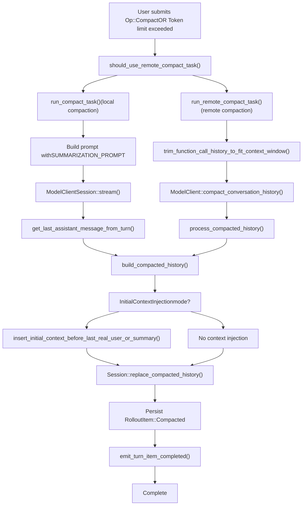

# History Compaction System

Relevant source files

-   [codex-rs/core/src/compact.rs](https://github.com/openai/codex/blob/d807d44a/codex-rs/core/src/compact.rs)
-   [codex-rs/core/src/compact\_remote.rs](https://github.com/openai/codex/blob/d807d44a/codex-rs/core/src/compact_remote.rs)
-   [codex-rs/core/src/tasks/compact.rs](https://github.com/openai/codex/blob/d807d44a/codex-rs/core/src/tasks/compact.rs)
-   [codex-rs/core/src/tasks/regular.rs](https://github.com/openai/codex/blob/d807d44a/codex-rs/core/src/tasks/regular.rs)
-   [codex-rs/core/tests/suite/compact.rs](https://github.com/openai/codex/blob/d807d44a/codex-rs/core/tests/suite/compact.rs)
-   [codex-rs/core/tests/suite/compact\_remote.rs](https://github.com/openai/codex/blob/d807d44a/codex-rs/core/tests/suite/compact_remote.rs)
-   [codex-rs/core/tests/suite/compact\_resume\_fork.rs](https://github.com/openai/codex/blob/d807d44a/codex-rs/core/tests/suite/compact_resume_fork.rs)

## Purpose and Scope

The History Compaction System manages conversation history size by replacing older messages with summaries when context limits are approached. This system supports both manual user-triggered compaction (`Op::Compact`) and automatic compaction when token usage exceeds configured thresholds. The system provides two implementations: local compaction using a summarization prompt, and remote compaction using specialized model endpoints.

For general history management, see page 3.5. For how compacted history is persisted and reloaded, see page 3.5.2.

---

## Compaction Types

The system supports two distinct compaction implementations, selected based on the model provider capabilities.

### Local vs Remote Compaction

| Aspect | Local Compaction | Remote Compaction |
| --- | --- | --- |
| **Provider** | Non-OpenAI providers | OpenAI providers |
| **Implementation** | `compact.rs::run_compact_task()` | `compact_remote.rs::run_remote_compact_task()` |
| **Mechanism** | Injects `SUMMARIZATION_PROMPT` as user message | POST to `/v1/responses/compact` endpoint |
| **Output** | Assistant reply used as summary | Server returns compacted `ResponseItem` list |
| **Selection** | `!should_use_remote_compact_task()` | `should_use_remote_compact_task()` returns true |

**Sources:** [codex-rs/core/src/compact.rs50-52](https://github.com/openai/codex/blob/d807d44a/codex-rs/core/src/compact.rs#L50-L52) [codex-rs/core/src/compact\_remote.rs28-48](https://github.com/openai/codex/blob/d807d44a/codex-rs/core/src/compact_remote.rs#L28-L48) [codex-rs/core/src/tasks/compact.rs32-46](https://github.com/openai/codex/blob/d807d44a/codex-rs/core/src/tasks/compact.rs#L32-L46)

---

## Compaction Decision Flow


**Sources:** [codex-rs/core/src/tasks/compact.rs15-49](https://github.com/openai/codex/blob/d807d44a/codex-rs/core/src/tasks/compact.rs#L15-L49) [codex-rs/core/src/compact.rs90-168](https://github.com/openai/codex/blob/d807d44a/codex-rs/core/src/compact.rs#L90-L168) [codex-rs/core/src/compact\_remote.rs51-166](https://github.com/openai/codex/blob/d807d44a/codex-rs/core/src/compact_remote.rs#L51-L166)

---

## Trigger Conditions

### Manual Compaction

Manual compaction is triggered by `Op::Compact` submission, typically from a user command like `/compact`.

**Flow:**

1.  `ThreadManager` receives `Op::Compact`.
2.  Spawns `CompactTask` with empty input.
3.  Emits `TurnStarted` event with turn-specific `turn_id` via `run_compact_task`.
4.  Runs compaction inner logic.
5.  Emits warning: "Heads up: Long threads and multiple compactions can cause the model to be less accurate...".

**Sources:** [codex-rs/core/src/compact.rs70-88](https://github.com/openai/codex/blob/d807d44a/codex-rs/core/src/compact.rs#L70-L88) [codex-rs/core/tests/suite/compact.rs71-72](https://github.com/openai/codex/blob/d807d44a/codex-rs/core/tests/suite/compact.rs#L71-L72)

### Automatic Compaction (Mid-Turn)

Automatic compaction occurs when a model response reports token usage exceeding configured limits.

**Trigger location:** `regular_task.rs` or `codex.rs` logic during turn execution.

**Differences from manual:**

-   Uses `InitialContextInjection::BeforeLastUserMessage` mode. [codex-rs/core/src/compact.rs41-43](https://github.com/openai/codex/blob/d807d44a/codex-rs/core/src/compact.rs#L41-L43)
-   No `TurnStarted` event (compaction runs within existing turn). [codex-rs/core/src/compact.rs54-68](https://github.com/openai/codex/blob/d807d44a/codex-rs/core/src/compact.rs#L54-L68)
-   Compaction summary must remain last in history for model training. [codex-rs/core/src/compact.rs41-43](https://github.com/openai/codex/blob/d807d44a/codex-rs/core/src/compact.rs#L41-L43)

**Sources:** [codex-rs/core/src/compact.rs35-48](https://github.com/openai/codex/blob/d807d44a/codex-rs/core/src/compact.rs#L35-L48) [codex-rs/core/src/compact.rs54-68](https://github.com/openai/codex/blob/d807d44a/codex-rs/core/src/compact.rs#L54-L68)

---

## Local Compaction Process

### Summarization Prompt

The local compaction system uses a predefined prompt template to request summarization:

```
pub const SUMMARIZATION_PROMPT: &str = include_str!("../templates/compact/prompt.md");pub const SUMMARY_PREFIX: &str = include_str!("../templates/compact/summary_prefix.md");
```
**Sources:** [codex-rs/core/src/compact.rs31-32](https://github.com/openai/codex/blob/d807d44a/codex-rs/core/src/compact.rs#L31-L32)

### Execution Flow

> **[Mermaid sequence]**
> *(图表结构无法解析)*

**Sources:** [codex-rs/core/src/compact.rs90-168](https://github.com/openai/codex/blob/d807d44a/codex-rs/core/src/compact.rs#L90-L168) [codex-rs/core/src/compact.rs232-279](https://github.com/openai/codex/blob/d807d44a/codex-rs/core/src/compact.rs#L232-L279)

---

## Remote Compaction Process

Remote compaction delegates summarization to a specialized endpoint (e.g., OpenAI's `/v1/responses/compact`), which returns a compacted history directly.

### History Trimming

Before sending the compact request, remote compaction trims history to fit the model context window:

**Function:** `trim_function_call_history_to_fit_context_window()` [codex-rs/core/src/compact\_remote.rs268-295](https://github.com/openai/codex/blob/d807d44a/codex-rs/core/src/compact_remote.rs#L268-L295)

**Logic:**

1.  Estimate token count of history + base instructions.
2.  If exceeds context window, remove the oldest Codex-generated item. [codex-rs/core/src/compact\_remote.rs286-291](https://github.com/openai/codex/blob/d807d44a/codex-rs/core/src/compact_remote.rs#L286-L291)
3.  Repeat until under limit or no more eligible items.

**Sources:** [codex-rs/core/src/compact\_remote.rs78-89](https://github.com/openai/codex/blob/d807d44a/codex-rs/core/src/compact_remote.rs#L78-L89) [codex-rs/core/src/compact\_remote.rs268-295](https://github.com/openai/codex/blob/d807d44a/codex-rs/core/src/compact_remote.rs#L268-L295)

### Processing Remote Output

The server-returned history is processed to clean stale context:

**Function:** `process_compacted_history()` [codex-rs/core/src/compact\_remote.rs168-188](https://github.com/openai/codex/blob/d807d44a/codex-rs/core/src/compact_remote.rs#L168-L188)

**Filtering rules:**

-   **Drop:** All `developer` role messages (stale permissions/personality). [codex-rs/core/src/compact\_remote.rs196-197](https://github.com/openai/codex/blob/d807d44a/codex-rs/core/src/compact_remote.rs#L196-L197)
-   **Drop:** `user` messages that aren't real user content (e.g., session prefix wrappers). [codex-rs/core/src/compact\_remote.rs198-199](https://github.com/openai/codex/blob/d807d44a/codex-rs/core/src/compact_remote.rs#L198-L199)
-   **Keep:** `assistant` messages, `Compaction` items, real `UserMessage` items. [codex-rs/core/src/compact\_remote.rs200-201](https://github.com/openai/codex/blob/d807d44a/codex-rs/core/src/compact_remote.rs#L200-L201)

**Sources:** [codex-rs/core/src/compact\_remote.rs168-202](https://github.com/openai/codex/blob/d807d44a/codex-rs/core/src/compact_remote.rs#L168-L202)

---

## History Replacement Strategy

### Building Compacted History

The `build_compacted_history()` function constructs the replacement history from:

1.  Initial context (reinjected if in `BeforeLastUserMessage` mode).
2.  Selected user messages (up to 20,000 tokens).
3.  Summary message with `SUMMARY_PREFIX`.

**User message selection:**

-   Iterate user messages in reverse (newest first). [codex-rs/core/src/compact.rs400-405](https://github.com/openai/codex/blob/d807d44a/codex-rs/core/src/compact.rs#L400-L405)
-   Include messages that fit within token budget. [codex-rs/core/src/compact.rs408-412](https://github.com/openai/codex/blob/d807d44a/codex-rs/core/src/compact.rs#L408-L412)
-   Truncate last message if it exceeds remaining budget. [codex-rs/core/src/compact.rs418-422](https://github.com/openai/codex/blob/d807d44a/codex-rs/core/src/compact.rs#L418-L422)

**Token budget:** `COMPACT_USER_MESSAGE_MAX_TOKENS = 20_000`. [codex-rs/core/src/compact.rs33](https://github.com/openai/codex/blob/d807d44a/codex-rs/core/src/compact.rs#L33-L33)

**Sources:** [codex-rs/core/src/compact.rs371-437](https://github.com/openai/codex/blob/d807d44a/codex-rs/core/src/compact.rs#L371-L437)

---

## Context Reinjection Modes

The `InitialContextInjection` enum controls where fresh context is reinjected after compaction.

### InitialContextInjection Enum

```
pub(crate) enum InitialContextInjection {    BeforeLastUserMessage,  // Mid-turn auto-compaction    DoNotInject,            // Pre-turn manual compaction}
```
| Mode | Use Case | Behavior | Rationale |
| --- | --- | --- | --- |
| `DoNotInject` | Manual `/compact` | Clears `reference_context_item`, next turn reinjects full context. [codex-rs/core/src/compact.rs37-40](https://github.com/openai/codex/blob/d807d44a/codex-rs/core/src/compact.rs#L37-L40) | Allows context to be refreshed on next request. |
| `BeforeLastUserMessage` | Mid-turn auto-compaction | Injects context before last real user message or summary. [codex-rs/core/src/compact.rs41-43](https://github.com/openai/codex/blob/d807d44a/codex-rs/core/src/compact.rs#L41-L43) | Model expects compaction item to remain last for training. |

**Sources:** [codex-rs/core/src/compact.rs35-48](https://github.com/openai/codex/blob/d807d44a/codex-rs/core/src/compact.rs#L35-L48)

### Context Insertion Logic

**Function:** `insert_initial_context_before_last_real_user_or_summary()` [codex-rs/core/src/compact.rs320-369](https://github.com/openai/codex/blob/d807d44a/codex-rs/core/src/compact.rs#L320-L369)

**Placement rules:**

1.  **Preferred:** Immediately before last real user message (non-summary). [codex-rs/core/src/compact.rs336-338](https://github.com/openai/codex/blob/d807d44a/codex-rs/core/src/compact.rs#L336-L338)
2.  **Fallback:** Before last summary message if no real user messages. [codex-rs/core/src/compact.rs341-343](https://github.com/openai/codex/blob/d807d44a/codex-rs/core/src/compact.rs#L341-L343)
3.  **Fallback:** Before last compaction item if no user messages. [codex-rs/core/src/compact.rs346-348](https://github.com/openai/codex/blob/d807d44a/codex-rs/core/src/compact.rs#L346-L348)
4.  **Fallback:** Append to end if no qualifying items. [codex-rs/core/src/compact.rs368](https://github.com/openai/codex/blob/d807d44a/codex-rs/core/src/compact.rs#L368-L368)

**Sources:** [codex-rs/core/src/compact.rs320-369](https://github.com/openai/codex/blob/d807d44a/codex-rs/core/src/compact.rs#L320-L369)

---

## Model Switch Handling

When a model switch occurs between turns, the system injects a `<model_switch>` developer message. Compaction must handle this carefully.

### Model Switch Stripping

**Function:** `extract_trailing_model_switch_update_for_compaction_request()` [codex-rs/core/src/compact.rs66-89](https://github.com/openai/codex/blob/d807d44a/codex-rs/core/src/compact.rs#L66-L89)

**Logic:**

1.  Find last user turn boundary. [codex-rs/core/src/compact.rs72-73](https://github.com/openai/codex/blob/d807d44a/codex-rs/core/src/compact.rs#L72-L73)
2.  Check if any developer message after that boundary starts with `<model_switch>\n`. [codex-rs/core/src/compact.rs76-78](https://github.com/openai/codex/blob/d807d44a/codex-rs/core/src/compact.rs#L76-L78)
3.  If found, remove from history before compaction. [codex-rs/core/src/compact.rs81-82](https://github.com/openai/codex/blob/d807d44a/codex-rs/core/src/compact.rs#L81-L82)
4.  Store removed item for later reattachment. [codex-rs/core/src/compact.rs85](https://github.com/openai/codex/blob/d807d44a/codex-rs/core/src/compact.rs#L85-L85)

**Sources:** [codex-rs/core/src/compact.rs66-89](https://github.com/openai/codex/blob/d807d44a/codex-rs/core/src/compact.rs#L66-L89)

---

## Event Emission

### Compaction Events

During compaction, the system emits several event types:

| Event | When | Purpose |
| --- | --- | --- |
| `TurnStarted` | Manual compaction only | Indicates new compaction turn with `turn_id`. [codex-rs/core/src/compact.rs75-79](https://github.com/openai/codex/blob/d807d44a/codex-rs/core/src/compact.rs#L75-L79) |
| `ItemStarted(ContextCompaction)` | Start of compaction | UI can show "Compacting..." indicator. [codex-rs/core/src/compact.rs97-98](https://github.com/openai/codex/blob/d807d44a/codex-rs/core/src/compact.rs#L97-L98) |
| `ItemCompleted(ContextCompaction)` | End of compaction | UI can hide indicator. [codex-rs/core/src/compact.rs276-277](https://github.com/openai/codex/blob/d807d44a/codex-rs/core/src/compact.rs#L276-L277) |
| `Warning` | After compaction | User warning about accuracy degradation. [codex-rs/core/src/compact.rs272-274](https://github.com/openai/codex/blob/d807d44a/codex-rs/core/src/compact.rs#L272-L274) |

**Sources:** [codex-rs/core/src/compact.rs75-80](https://github.com/openai/codex/blob/d807d44a/codex-rs/core/src/compact.rs#L75-L80) [codex-rs/core/src/compact.rs96-98](https://github.com/openai/codex/blob/d807d44a/codex-rs/core/src/compact.rs#L96-L98) [codex-rs/core/src/compact.rs272-277](https://github.com/openai/codex/blob/d807d44a/codex-rs/core/src/compact.rs#L272-L277)

---

## Error Handling and Retries

### Local Compaction Errors

**Retry logic:** Up to `stream_max_retries()` attempts with exponential backoff. [codex-rs/core/src/compact.rs109-110](https://github.com/openai/codex/blob/d807d44a/codex-rs/core/src/compact.rs#L109-L110)

**Context window exceeded handling:**

1.  If prompt too large for model, remove oldest history item via `history.remove_first_item()`. [codex-rs/core/src/compact.rs160](https://github.com/openai/codex/blob/d807d44a/codex-rs/core/src/compact.rs#L160-L160)
2.  Increment `truncated_count`. [codex-rs/core/src/compact.rs161](https://github.com/openai/codex/blob/d807d44a/codex-rs/core/src/compact.rs#L161-L161)
3.  Reset retry counter and try again. [codex-rs/core/src/compact.rs162-163](https://github.com/openai/codex/blob/d807d44a/codex-rs/core/src/compact.rs#L162-L163)

**Sources:** [codex-rs/core/src/compact.rs154-169](https://github.com/openai/codex/blob/d807d44a/codex-rs/core/src/compact.rs#L154-L169)

### Remote Compaction Errors

**Failure logging:** On compact failure, logs detailed breakdown via `log_remote_compact_failure`. [codex-rs/core/src/compact\_remote.rs131-136](https://github.com/openai/codex/blob/d807d44a/codex-rs/core/src/compact_remote.rs#L131-L136)

**Error emission:** Wraps error with "Error running remote compact task" context. [codex-rs/core/src/compact\_remote.rs59-61](https://github.com/openai/codex/blob/d807d44a/codex-rs/core/src/compact_remote.rs#L59-L61)

**Sources:** [codex-rs/core/src/compact\_remote.rs56-64](https://github.com/openai/codex/blob/d807d44a/codex-rs/core/src/compact_remote.rs#L56-L64) [codex-rs/core/src/compact\_remote.rs127-138](https://github.com/openai/codex/blob/d807d44a/codex-rs/core/src/compact_remote.rs#L127-L138)
