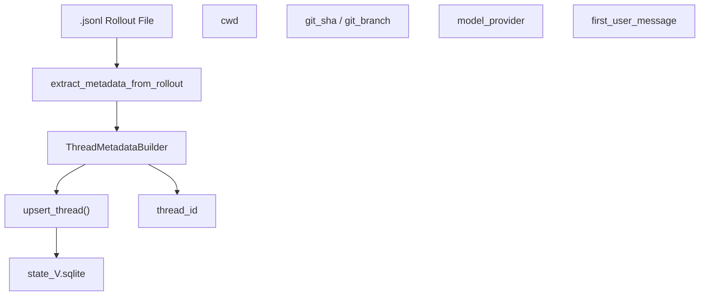
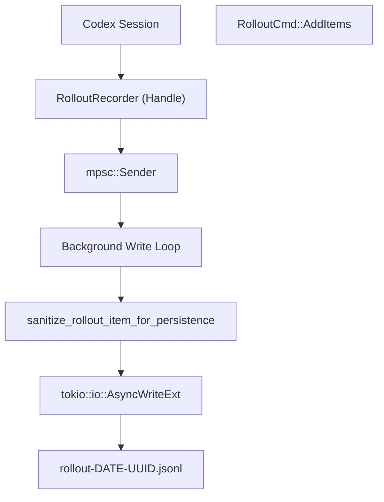

# Rollout Persistence and Replay

Relevant source files

-   [codex-rs/app-server/tests/common/rollout.rs](https://github.com/openai/codex/blob/d807d44a/codex-rs/app-server/tests/common/rollout.rs)
-   [codex-rs/app-server/tests/suite/v2/review.rs](https://github.com/openai/codex/blob/d807d44a/codex-rs/app-server/tests/suite/v2/review.rs)
-   [codex-rs/app-server/tests/suite/v2/thread\_archive.rs](https://github.com/openai/codex/blob/d807d44a/codex-rs/app-server/tests/suite/v2/thread_archive.rs)
-   [codex-rs/app-server/tests/suite/v2/thread\_fork.rs](https://github.com/openai/codex/blob/d807d44a/codex-rs/app-server/tests/suite/v2/thread_fork.rs)
-   [codex-rs/app-server/tests/suite/v2/thread\_list.rs](https://github.com/openai/codex/blob/d807d44a/codex-rs/app-server/tests/suite/v2/thread_list.rs)
-   [codex-rs/app-server/tests/suite/v2/thread\_resume.rs](https://github.com/openai/codex/blob/d807d44a/codex-rs/app-server/tests/suite/v2/thread_resume.rs)
-   [codex-rs/app-server/tests/suite/v2/thread\_start.rs](https://github.com/openai/codex/blob/d807d44a/codex-rs/app-server/tests/suite/v2/thread_start.rs)
-   [codex-rs/app-server/tests/suite/v2/thread\_unarchive.rs](https://github.com/openai/codex/blob/d807d44a/codex-rs/app-server/tests/suite/v2/thread_unarchive.rs)
-   [codex-rs/app-server/tests/suite/v2/turn\_start.rs](https://github.com/openai/codex/blob/d807d44a/codex-rs/app-server/tests/suite/v2/turn_start.rs)
-   [codex-rs/core/src/rollout/list.rs](https://github.com/openai/codex/blob/d807d44a/codex-rs/core/src/rollout/list.rs)
-   [codex-rs/core/src/rollout/metadata.rs](https://github.com/openai/codex/blob/d807d44a/codex-rs/core/src/rollout/metadata.rs)
-   [codex-rs/core/src/rollout/recorder.rs](https://github.com/openai/codex/blob/d807d44a/codex-rs/core/src/rollout/recorder.rs)
-   [codex-rs/core/src/rollout/tests.rs](https://github.com/openai/codex/blob/d807d44a/codex-rs/core/src/rollout/tests.rs)
-   [codex-rs/core/src/state\_db.rs](https://github.com/openai/codex/blob/d807d44a/codex-rs/core/src/state_db.rs)
-   [codex-rs/core/src/tools/handlers/agent\_jobs.rs](https://github.com/openai/codex/blob/d807d44a/codex-rs/core/src/tools/handlers/agent_jobs.rs)
-   [codex-rs/core/tests/suite/cli\_stream.rs](https://github.com/openai/codex/blob/d807d44a/codex-rs/core/tests/suite/cli_stream.rs)
-   [codex-rs/core/tests/suite/rollout\_list\_find.rs](https://github.com/openai/codex/blob/d807d44a/codex-rs/core/tests/suite/rollout_list_find.rs)
-   [codex-rs/core/tests/suite/sqlite\_state.rs](https://github.com/openai/codex/blob/d807d44a/codex-rs/core/tests/suite/sqlite_state.rs)
-   [codex-rs/debug-client/src/client.rs](https://github.com/openai/codex/blob/d807d44a/codex-rs/debug-client/src/client.rs)
-   [codex-rs/state/Cargo.toml](https://github.com/openai/codex/blob/d807d44a/codex-rs/state/Cargo.toml)
-   [codex-rs/state/logs\_migrations/0002\_logs\_feedback\_log\_body.sql](https://github.com/openai/codex/blob/d807d44a/codex-rs/state/logs_migrations/0002_logs_feedback_log_body.sql)
-   [codex-rs/state/migrations/0002\_logs.sql](https://github.com/openai/codex/blob/d807d44a/codex-rs/state/migrations/0002_logs.sql)
-   [codex-rs/state/migrations/0010\_logs\_process\_id.sql](https://github.com/openai/codex/blob/d807d44a/codex-rs/state/migrations/0010_logs_process_id.sql)
-   [codex-rs/state/src/bin/logs\_client.rs](https://github.com/openai/codex/blob/d807d44a/codex-rs/state/src/bin/logs_client.rs)
-   [codex-rs/state/src/lib.rs](https://github.com/openai/codex/blob/d807d44a/codex-rs/state/src/lib.rs)
-   [codex-rs/state/src/log\_db.rs](https://github.com/openai/codex/blob/d807d44a/codex-rs/state/src/log_db.rs)
-   [codex-rs/state/src/model/log.rs](https://github.com/openai/codex/blob/d807d44a/codex-rs/state/src/model/log.rs)
-   [codex-rs/state/src/model/mod.rs](https://github.com/openai/codex/blob/d807d44a/codex-rs/state/src/model/mod.rs)
-   [codex-rs/state/src/runtime.rs](https://github.com/openai/codex/blob/d807d44a/codex-rs/state/src/runtime.rs)
-   [codex-rs/state/src/runtime/agent\_jobs.rs](https://github.com/openai/codex/blob/d807d44a/codex-rs/state/src/runtime/agent_jobs.rs)
-   [codex-rs/state/src/runtime/backfill.rs](https://github.com/openai/codex/blob/d807d44a/codex-rs/state/src/runtime/backfill.rs)
-   [codex-rs/state/src/runtime/logs.rs](https://github.com/openai/codex/blob/d807d44a/codex-rs/state/src/runtime/logs.rs)
-   [codex-rs/tui/src/resume\_picker.rs](https://github.com/openai/codex/blob/d807d44a/codex-rs/tui/src/resume_picker.rs)

## Purpose and Scope

This document describes Codex's rollout persistence system, which records conversation history and session metadata to disk in JSONL format. Rollout files enable thread resumption, allow inspection of conversation state for debugging, and provide a durable audit trail of agent interactions. The system also includes a SQLite-backed state database that indexes these rollout files for fast searching and metadata retrieval.

For information about how history is managed in memory and prepared for model consumption, see [Conversation History Management](/openai/codex/3.5-conversation-history-management). For details on how compaction generates special rollout entries, see [History Compaction System](/openai/codex/3.5.1-history-compaction-system).

---

## Rollout File Format

Codex persists conversation state to **rollout files**: newline-delimited JSON files where each line contains a `RolloutLine` wrapping a `RolloutItem`. These files are stored in a hierarchical date-based structure under the sessions directory, e.g., `~/.codex/sessions/2025/05/07/rollout-2025-05-07T17-24-21-<uuid>.jsonl` [codex-rs/core/src/rollout/recorder.rs61-68](https://github.com/openai/codex/blob/d807d44a/codex-rs/core/src/rollout/recorder.rs#L61-L68)

### RolloutLine Structure

Each line in a rollout file follows this structure:

```
pub struct RolloutLine {    pub timestamp: OffsetDateTime,    pub item: RolloutItem,}
```
The `RolloutLine` type wraps a `RolloutItem` and adds a UTC timestamp for each persisted event [codex-rs/core/src/rollout/recorder.rs54-56](https://github.com/openai/codex/blob/d807d44a/codex-rs/core/src/rollout/recorder.rs#L54-L56)

---

## RolloutItem Types

The `RolloutItem` enum defines the high-level categories of data persisted to rollout files:

| Item Type | Description | Example Use Case |
| --- | --- | --- |
| `ResponseItem` | Raw model responses and tool calls | User messages, assistant replies, tool outputs |
| `EventMsg` | Protocol-level events | `TurnStarted`, `TurnComplete`, `ExecCommandEnd` |
| `TurnContext` | Snapshot of turn configuration | Model, CWD, and policies captured at turn start |
| `Compacted` | Compaction metadata | Summary message and replacement history after compaction |
| `SessionMeta` | Session-level metadata | Thread ID, source, and git info [codex-rs/core/src/rollout/metadata.rs38-63](https://github.com/openai/codex/blob/d807d44a/codex-rs/core/src/rollout/metadata.rs#L38-L63) |

**Sources:** [codex-rs/core/src/rollout/recorder.rs53](https://github.com/openai/codex/blob/d807d44a/codex-rs/core/src/rollout/recorder.rs#L53-L53) [codex-rs/core/src/rollout/metadata.rs12-15](https://github.com/openai/codex/blob/d807d44a/codex-rs/core/src/rollout/metadata.rs#L12-L15)

---

## Persistence Policies and Filtering

Codex supports two persistence granularities controlled by `EventPersistenceMode` [codex-rs/core/src/rollout/recorder.rs75](https://github.com/openai/codex/blob/d807d44a/codex-rs/core/src/rollout/recorder.rs#L75-L75)

### Sanitization and Truncation

Before items are written to disk, they undergo sanitization. For example, in `Extended` mode, `ExecCommandEnd` events have their `stdout` and `stderr` cleared, keeping only a bounded `aggregated_output` (max 10,000 bytes) to prevent rollout files from bloating with massive logs [codex-rs/core/src/rollout/recorder.rs135-160](https://github.com/openai/codex/blob/d807d44a/codex-rs/core/src/rollout/recorder.rs#L135-L160)

### Event Filtering

The `is_persisted_response_item` and `should_persist_event_msg` functions (defined in `policy.rs`) determine which events are written to the `.jsonl` file.

-   **Limited Mode**: Only essential turn lifecycle and message events.
-   **Extended Mode**: Adds tool completion events and detailed execution summaries.

---

## State Database (SQLite) Indexing

To support fast listing and searching of thousands of rollout files, Codex maintains a SQLite database (`state_V.sqlite`) that mirrors metadata extracted from the JSONL files [codex-rs/state/src/lib.rs1-5](https://github.com/openai/codex/blob/d807d44a/codex-rs/state/src/lib.rs#L1-L5)

### Metadata Extraction

The `StateRuntime` uses `extract_metadata_from_rollout` to parse JSONL files and populate the `ThreadMetadata` struct [codex-rs/core/src/rollout/metadata.rs96-132](https://github.com/openai/codex/blob/d807d44a/codex-rs/core/src/rollout/metadata.rs#L96-L132)


### Backfill Orchestration

When Codex starts, it checks the `BackfillStatus`. If incomplete, it spawns a background task `backfill_sessions` to scan the filesystem and sync the SQLite DB with existing rollout files [codex-rs/core/src/state\_db.rs54-60](https://github.com/openai/codex/blob/d807d44a/codex-rs/core/src/state_db.rs#L54-L60) It uses a lease mechanism (`try_claim_backfill`) to ensure only one instance performs backfill at a time [codex-rs/core/src/rollout/metadata.rs152-168](https://github.com/openai/codex/blob/d807d44a/codex-rs/core/src/rollout/metadata.rs#L152-L168)

**Sources:** [codex-rs/state/src/runtime.rs70-83](https://github.com/openai/codex/blob/d807d44a/codex-rs/state/src/runtime.rs#L70-L83) [codex-rs/core/src/state\_db.rs28-43](https://github.com/openai/codex/blob/d807d44a/codex-rs/core/src/state_db.rs#L28-L43) [codex-rs/core/src/rollout/metadata.rs134-168](https://github.com/openai/codex/blob/d807d44a/codex-rs/core/src/rollout/metadata.rs#L134-L168)

---

## RolloutRecorder Architecture

The `RolloutRecorder` manages the asynchronous writing of items to the filesystem.


### Command Handling

The recorder processes commands via an internal loop:

-   `AddItems(Vec<RolloutItem>)`: Buffers and writes new events [codex-rs/core/src/rollout/recorder.rs95](https://github.com/openai/codex/blob/d807d44a/codex-rs/core/src/rollout/recorder.rs#L95-L95)
-   `Flush`: Ensures all pending writes are committed to disk [codex-rs/core/src/rollout/recorder.rs100](https://github.com/openai/codex/blob/d807d44a/codex-rs/core/src/rollout/recorder.rs#L100-L100)
-   `Shutdown`: Closes the file handle cleanly [codex-rs/core/src/rollout/recorder.rs103](https://github.com/openai/codex/blob/d807d44a/codex-rs/core/src/rollout/recorder.rs#L103-L103)

**Sources:** [codex-rs/core/src/rollout/recorder.rs71-106](https://github.com/openai/codex/blob/d807d44a/codex-rs/core/src/rollout/recorder.rs#L71-L106) [codex-rs/core/src/rollout/recorder.rs137-160](https://github.com/openai/codex/blob/d807d44a/codex-rs/core/src/rollout/recorder.rs#L137-L160)

---

## Session Resumption via Event Replay

Resuming a session involves locating the correct rollout file and replaying its contents to reconstruct the `ContextManager` state.

### Thread Discovery

The `ThreadManager` uses `list_threads` (falling back to `list_threads_db` if the SQLite index is available) to find session files [codex-rs/core/src/rollout/recorder.rs165-187](https://github.com/openai/codex/blob/d807d44a/codex-rs/core/src/rollout/recorder.rs#L165-L187) Users can filter by `SessionSource` or `model_provider` [codex-rs/core/src/rollout/list.rs119-124](https://github.com/openai/codex/blob/d807d44a/codex-rs/core/src/rollout/list.rs#L119-L124)

### Replay Logic

When a thread is resumed (e.g., via the `thread/resume` endpoint), the following occurs:

1.  **Load**: `load_rollout_items` reads the JSONL and parses it into `Vec<RolloutItem>` [codex-rs/core/src/rollout/metadata.rs100-101](https://github.com/openai/codex/blob/d807d44a/codex-rs/core/src/rollout/metadata.rs#L100-L101)
2.  **Initialize**: A new session is spawned with `InitialHistory::Resumed` [codex-rs/app-server/tests/suite/v2/thread\_resume.rs154-184](https://github.com/openai/codex/blob/d807d44a/codex-rs/app-server/tests/suite/v2/thread_resume.rs#L154-L184)
3.  **Reconstruct**: The system iterates through items:
    -   `ResponseItem`s are added back to the conversation history.
    -   `TurnContext` items restore policies (Sandbox, Approval).
    -   `Compacted` items restore the summary and pruned history state [codex-rs/core/src/rollout/list.rs22-25](https://github.com/openai/codex/blob/d807d44a/codex-rs/core/src/rollout/list.rs#L22-L25)

### Resumption Validation

The system rejects resumption if the rollout file is missing or if the thread has not yet "materialized" (e.g., a thread started but no user message was ever sent to trigger the first disk write) [codex-rs/app-server/tests/suite/v2/thread\_resume.rs107-151](https://github.com/openai/codex/blob/d807d44a/codex-rs/app-server/tests/suite/v2/thread_resume.rs#L107-L151)

**Sources:** [codex-rs/core/src/rollout/recorder.rs165-187](https://github.com/openai/codex/blob/d807d44a/codex-rs/core/src/rollout/recorder.rs#L165-L187) [codex-rs/core/src/rollout/list.rs28-74](https://github.com/openai/codex/blob/d807d44a/codex-rs/core/src/rollout/list.rs#L28-L74) [codex-rs/app-server/tests/suite/v2/thread\_resume.rs107-184](https://github.com/openai/codex/blob/d807d44a/codex-rs/app-server/tests/suite/v2/thread_resume.rs#L107-L184)

---

## TUI Session Picker

The Terminal User Interface provides a `resume_picker` to interactively select sessions for resumption or forking.

-   **Pagination**: Uses `Cursor` (timestamp + UUID) to fetch pages of threads from the `RolloutRecorder` [codex-rs/tui/src/resume\_picker.rs122-136](https://github.com/openai/codex/blob/d807d44a/codex-rs/tui/src/resume_picker.rs#L122-L136)
-   **Sorting**: Supports toggling between `CreatedAt` and `UpdatedAt` [codex-rs/tui/src/resume\_picker.rs109-111](https://github.com/openai/codex/blob/d807d44a/codex-rs/tui/src/resume_picker.rs#L109-L111)
-   **Filtering**: Allows searching by working directory (CWD) or git branch [codex-rs/tui/src/resume\_picker.rs149-153](https://github.com/openai/codex/blob/d807d44a/codex-rs/tui/src/resume_picker.rs#L149-L153)

**Sources:** [codex-rs/tui/src/resume\_picker.rs40-111](https://github.com/openai/codex/blob/d807d44a/codex-rs/tui/src/resume_picker.rs#L40-L111) [codex-rs/tui/src/resume\_picker.rs157-179](https://github.com/openai/codex/blob/d807d44a/codex-rs/tui/src/resume_picker.rs#L157-L179)
