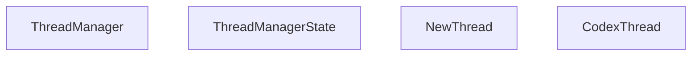
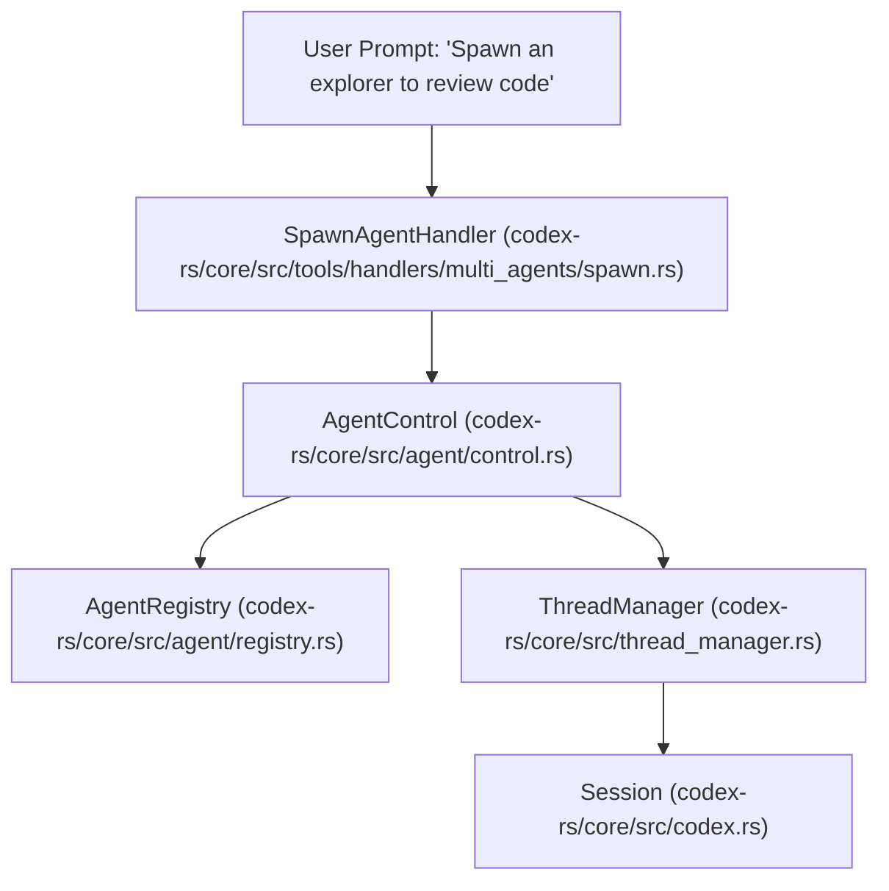

# Thread Management and Multi-Agent

Relevant source files

-   [codex-rs/app-server/tests/suite/v2/mcp\_server\_elicitation.rs](https://github.com/openai/codex/blob/d807d44a/codex-rs/app-server/tests/suite/v2/mcp_server_elicitation.rs)
-   [codex-rs/cli/src/mcp\_cmd.rs](https://github.com/openai/codex/blob/d807d44a/codex-rs/cli/src/mcp_cmd.rs)
-   [codex-rs/cli/tests/mcp\_add\_remove.rs](https://github.com/openai/codex/blob/d807d44a/codex-rs/cli/tests/mcp_add_remove.rs)
-   [codex-rs/cli/tests/mcp\_list.rs](https://github.com/openai/codex/blob/d807d44a/codex-rs/cli/tests/mcp_list.rs)
-   [codex-rs/core/src/agent/builtins/explorer.toml](https://github.com/openai/codex/blob/d807d44a/codex-rs/core/src/agent/builtins/explorer.toml)
-   [codex-rs/core/src/agent/control.rs](https://github.com/openai/codex/blob/d807d44a/codex-rs/core/src/agent/control.rs)
-   [codex-rs/core/src/agent/control\_tests.rs](https://github.com/openai/codex/blob/d807d44a/codex-rs/core/src/agent/control_tests.rs)
-   [codex-rs/core/src/agent/mod.rs](https://github.com/openai/codex/blob/d807d44a/codex-rs/core/src/agent/mod.rs)
-   [codex-rs/core/src/agent/registry.rs](https://github.com/openai/codex/blob/d807d44a/codex-rs/core/src/agent/registry.rs)
-   [codex-rs/core/src/agent/registry\_tests.rs](https://github.com/openai/codex/blob/d807d44a/codex-rs/core/src/agent/registry_tests.rs)
-   [codex-rs/core/src/agent/role.rs](https://github.com/openai/codex/blob/d807d44a/codex-rs/core/src/agent/role.rs)
-   [codex-rs/core/src/agent/role\_tests.rs](https://github.com/openai/codex/blob/d807d44a/codex-rs/core/src/agent/role_tests.rs)
-   [codex-rs/core/src/codex\_delegate.rs](https://github.com/openai/codex/blob/d807d44a/codex-rs/core/src/codex_delegate.rs)
-   [codex-rs/core/src/mcp\_connection\_manager.rs](https://github.com/openai/codex/blob/d807d44a/codex-rs/core/src/mcp_connection_manager.rs)
-   [codex-rs/core/src/mcp\_connection\_manager\_tests.rs](https://github.com/openai/codex/blob/d807d44a/codex-rs/core/src/mcp_connection_manager_tests.rs)
-   [codex-rs/core/src/state/session.rs](https://github.com/openai/codex/blob/d807d44a/codex-rs/core/src/state/session.rs)
-   [codex-rs/core/src/state/turn.rs](https://github.com/openai/codex/blob/d807d44a/codex-rs/core/src/state/turn.rs)
-   [codex-rs/core/src/tasks/mod.rs](https://github.com/openai/codex/blob/d807d44a/codex-rs/core/src/tasks/mod.rs)
-   [codex-rs/core/src/thread\_manager.rs](https://github.com/openai/codex/blob/d807d44a/codex-rs/core/src/thread_manager.rs)
-   [codex-rs/core/src/tools/handlers/multi\_agents.rs](https://github.com/openai/codex/blob/d807d44a/codex-rs/core/src/tools/handlers/multi_agents.rs)
-   [codex-rs/core/src/tools/handlers/multi\_agents/close\_agent.rs](https://github.com/openai/codex/blob/d807d44a/codex-rs/core/src/tools/handlers/multi_agents/close_agent.rs)
-   [codex-rs/core/src/tools/handlers/multi\_agents/resume\_agent.rs](https://github.com/openai/codex/blob/d807d44a/codex-rs/core/src/tools/handlers/multi_agents/resume_agent.rs)
-   [codex-rs/core/src/tools/handlers/multi\_agents/send\_input.rs](https://github.com/openai/codex/blob/d807d44a/codex-rs/core/src/tools/handlers/multi_agents/send_input.rs)
-   [codex-rs/core/src/tools/handlers/multi\_agents/spawn.rs](https://github.com/openai/codex/blob/d807d44a/codex-rs/core/src/tools/handlers/multi_agents/spawn.rs)
-   [codex-rs/core/src/tools/handlers/multi\_agents/wait.rs](https://github.com/openai/codex/blob/d807d44a/codex-rs/core/src/tools/handlers/multi_agents/wait.rs)
-   [codex-rs/core/src/tools/handlers/multi\_agents\_tests.rs](https://github.com/openai/codex/blob/d807d44a/codex-rs/core/src/tools/handlers/multi_agents_tests.rs)
-   [codex-rs/core/src/tools/handlers/tool\_search\_tests.rs](https://github.com/openai/codex/blob/d807d44a/codex-rs/core/src/tools/handlers/tool_search_tests.rs)
-   [codex-rs/core/templates/agents/orchestrator.md](https://github.com/openai/codex/blob/d807d44a/codex-rs/core/templates/agents/orchestrator.md?plain=1)
-   [codex-rs/core/templates/collab/experimental\_prompt.md](https://github.com/openai/codex/blob/d807d44a/codex-rs/core/templates/collab/experimental_prompt.md?plain=1)
-   [codex-rs/core/tests/suite/rmcp\_client.rs](https://github.com/openai/codex/blob/d807d44a/codex-rs/core/tests/suite/rmcp_client.rs)
-   [codex-rs/core/tests/suite/subagent\_notifications.rs](https://github.com/openai/codex/blob/d807d44a/codex-rs/core/tests/suite/subagent_notifications.rs)
-   [codex-rs/core/tests/suite/truncation.rs](https://github.com/openai/codex/blob/d807d44a/codex-rs/core/tests/suite/truncation.rs)
-   [codex-rs/core/tests/suite/user\_shell\_cmd.rs](https://github.com/openai/codex/blob/d807d44a/codex-rs/core/tests/suite/user_shell_cmd.rs)
-   [codex-rs/rmcp-client/src/rmcp\_client.rs](https://github.com/openai/codex/blob/d807d44a/codex-rs/rmcp-client/src/rmcp_client.rs)
-   [codex-rs/rmcp-client/tests/streamable\_http\_recovery.rs](https://github.com/openai/codex/blob/d807d44a/codex-rs/rmcp-client/tests/streamable_http_recovery.rs)

## Purpose and Scope

This document describes how Codex manages conversation threads and orchestrates multi-agent workflows. Thread management encompasses lifecycle operations (spawn, resume, fork) coordinated by `ThreadManager` and `ThreadManagerState`, while multi-agent support enables spawning specialized sub-agents for tasks like code review, history compaction, and collaborative problem solving. Each thread maintains independent state, and inter-agent communication is handled via `AgentControl` and specialized tool handlers.

## Thread Lifecycle and ThreadManager

The `ThreadManager` is the top-level owner of all active `CodexThread` instances. It manages their creation, persistence, and provides access to shared services like `AuthManager`, `ModelsManager`, and `McpManager`.

### ThreadManager Architecture

The `ThreadManager` uses an internal `ThreadManagerState` wrapped in an `Arc` to allow safe sharing across threads and with `AgentControl`.

Sources: [codex-rs/core/src/thread\_manager.rs142-162](https://github.com/openai/codex/blob/d807d44a/codex-rs/core/src/thread_manager.rs#L142-L162) [codex-rs/core/src/thread\_manager.rs164-190](https://github.com/openai/codex/blob/d807d44a/codex-rs/core/src/thread_manager.rs#L164-L190)

### Core Operations

| Operation | Implementation | Description |
| --- | --- | --- |
| **Spawn** | `Codex::spawn` | Creates a fresh session. If `InitialHistory::New` is used, it starts a clean slate. [codex-rs/core/src/codex.rs380-410](https://github.com/openai/codex/blob/d807d44a/codex-rs/core/src/codex.rs#L380-L410) |
| **Resume** | `InitialHistory::Resume` | Replays events from a `.jsonl` rollout file to reconstruct the `ContextManager` state. [codex-rs/core/src/codex.rs411-420](https://github.com/openai/codex/blob/d807d44a/codex-rs/core/src/codex.rs#L411-L420) |
| **Fork** | `InitialHistory::Fork` | Similar to resume, but assigns a new `ThreadId` while inheriting the parent's history. [codex-rs/core/src/codex.rs421-430](https://github.com/openai/codex/blob/d807d44a/codex-rs/core/src/codex.rs#L421-L430) |

## Multi-Agent Architecture

Codex implements a hierarchical multi-agent system where a "parent" session can spawn "sub-agents" via `AgentControl`. This is primarily driven by the `multi_agents` tool handlers.

### AgentControl and Registry

`AgentControl` is the control-plane handle for multi-agent operations. It is held by each `Session` and provides the capability to spawn new agents and facilitate inter-agent communication.

Sources: [codex-rs/core/src/agent/control.rs85-101](https://github.com/openai/codex/blob/d807d44a/codex-rs/core/src/agent/control.rs#L85-L101) [codex-rs/core/src/agent/control.rs126-160](https://github.com/openai/codex/blob/d807d44a/codex-rs/core/src/agent/control.rs#L126-L160)

### Sub-Agent Roles and Configuration

When an agent is spawned, it can be assigned a specific "role" (e.g., `explorer`, `reviewer`). The `apply_role_to_config` function loads role-specific configurations (from `built-in` or user `config.toml`) and overlays them on the session config.

-   **Role Resolution**: Uses `resolve_role_config` to find `AgentRoleConfig`. [codex-rs/core/src/agent/role.rs112-120](https://github.com/openai/codex/blob/d807d44a/codex-rs/core/src/agent/role.rs#L112-L120)
-   **Preservation Policy**: Ensures that the parent's `model_provider` and `profile` are preserved unless the role explicitly overrides them. [codex-rs/core/src/agent/role.rs122-141](https://github.com/openai/codex/blob/d807d44a/codex-rs/core/src/agent/role.rs#L122-L141)
-   **Layering**: Roles are inserted as high-precedence layers in the `ConfigLayerStack`. [codex-rs/core/src/agent/role.rs174-188](https://github.com/openai/codex/blob/d807d44a/codex-rs/core/src/agent/role.rs#L174-L188)

## Inter-Agent Communication (Collab Tools)

Communication between agents is handled through a set of specialized tools defined in `codex-rs/core/src/tools/handlers/multi_agents.rs`.

| Tool | Handler | Description |
| --- | --- | --- |
| `spawn_agent` | `SpawnAgentHandler` | Spawns a new sub-agent with a message or items. [codex-rs/core/src/tools/handlers/multi\_agents/spawn.rs](https://github.com/openai/codex/blob/d807d44a/codex-rs/core/src/tools/handlers/multi_agents/spawn.rs) |
| `send_input` | `SendInputHandler` | Sends a message to an existing sub-agent. [codex-rs/core/src/tools/handlers/multi\_agents/send\_input.rs](https://github.com/openai/codex/blob/d807d44a/codex-rs/core/src/tools/handlers/multi_agents/send_input.rs) |
| `wait_agent` | `WaitAgentHandler` | Pauses the parent turn until sub-agents reach a final status. [codex-rs/core/src/tools/handlers/multi\_agents/wait.rs](https://github.com/openai/codex/blob/d807d44a/codex-rs/core/src/tools/handlers/multi_agents/wait.rs) |
| `resume_agent` | `ResumeAgentHandler` | Resumes a sub-agent that is waiting for input. [codex-rs/core/src/tools/handlers/multi\_agents/resume\_agent.rs](https://github.com/openai/codex/blob/d807d44a/codex-rs/core/src/tools/handlers/multi_agents/resume_agent.rs) |

### Sub-Agent Event Forwarding

When a sub-agent is running interactively (e.g., during a `ReviewTask`), the `codex_delegate` module manages the bidirectional flow of operations and events.

> **[Mermaid sequence]**
> *(图表结构无法解析)*

Sources: [codex-rs/core/src/codex\_delegate.rs63-136](https://github.com/openai/codex/blob/d807d44a/codex-rs/core/src/codex_delegate.rs#L63-L136) [codex-rs/core/src/codex\_delegate.rs112-121](https://github.com/openai/codex/blob/d807d44a/codex-rs/core/src/codex_delegate.rs#L112-L121)

## Session Tasks and Multi-Agent Coordination

Multi-agent workflows are often encapsulated in `SessionTask` implementations.

-   **ReviewTask**: Spawns a sub-agent specifically to perform code reviews. It uses `run_codex_thread_one_shot` to trigger a single turn on the sub-agent and parses the result. [codex-rs/core/src/tasks/review.rs54-85](https://github.com/openai/codex/blob/d807d44a/codex-rs/core/src/tasks/review.rs#L54-L85)
-   **CompactTask**: Can spawn a sub-agent to summarize conversation history when the token limit is reached. [codex-rs/core/src/tasks/compact.rs](https://github.com/openai/codex/blob/d807d44a/codex-rs/core/src/tasks/compact.rs)
-   **Guardian**: Though not a full sub-agent in the `ThreadManager` sense, the `Guardian` system uses similar delegation logic to analyze tool calls for safety before requesting human approval. [codex-rs/core/src/codex\_delegate.rs42-50](https://github.com/openai/codex/blob/d807d44a/codex-rs/core/src/codex_delegate.rs#L42-L50)

## ThreadEventStore and State Management

To support the TUI and other interfaces that allow switching between threads, Codex uses event buffering.

-   **SessionState**: Stores the `ContextManager` (history), `session_configuration`, and `granted_permissions`. [codex-rs/core/src/state/session.rs20-36](https://github.com/openai/codex/blob/d807d44a/codex-rs/core/src/state/session.rs#L20-L36)
-   **Event Replay**: When a thread is resumed or forked, the `InitialHistory` logic ensures the `ContextManager` is rebuilt by re-processing events. [codex-rs/core/src/codex.rs411-430](https://github.com/openai/codex/blob/d807d44a/codex-rs/core/src/codex.rs#L411-L430)
-   **Token Tracking**: The `SessionState` tracks total token usage across the session, including sub-agent contributions if they are merged back. [codex-rs/core/src/state/session.rs132-135](https://github.com/openai/codex/blob/d807d44a/codex-rs/core/src/state/session.rs#L132-L135)

Sources: [codex-rs/core/src/state/session.rs20-55](https://github.com/openai/codex/blob/d807d44a/codex-rs/core/src/state/session.rs#L20-L55) [codex-rs/core/src/codex.rs411-430](https://github.com/openai/codex/blob/d807d44a/codex-rs/core/src/codex.rs#L411-L430)
