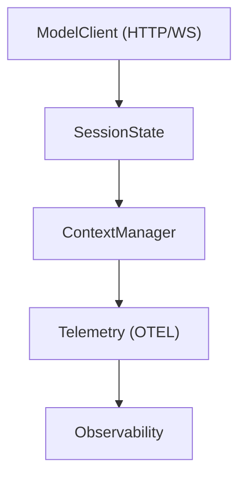

# Session Tasks and Turn State

Relevant source files

-   [codex-rs/app-server/tests/suite/v2/mcp\_server\_elicitation.rs](https://github.com/openai/codex/blob/d807d44a/codex-rs/app-server/tests/suite/v2/mcp_server_elicitation.rs)
-   [codex-rs/cli/src/mcp\_cmd.rs](https://github.com/openai/codex/blob/d807d44a/codex-rs/cli/src/mcp_cmd.rs)
-   [codex-rs/cli/tests/mcp\_add\_remove.rs](https://github.com/openai/codex/blob/d807d44a/codex-rs/cli/tests/mcp_add_remove.rs)
-   [codex-rs/cli/tests/mcp\_list.rs](https://github.com/openai/codex/blob/d807d44a/codex-rs/cli/tests/mcp_list.rs)
-   [codex-rs/core/src/codex\_tests.rs](https://github.com/openai/codex/blob/d807d44a/codex-rs/core/src/codex_tests.rs)
-   [codex-rs/core/src/codex\_tests\_guardian.rs](https://github.com/openai/codex/blob/d807d44a/codex-rs/core/src/codex_tests_guardian.rs)
-   [codex-rs/core/src/mcp\_connection\_manager.rs](https://github.com/openai/codex/blob/d807d44a/codex-rs/core/src/mcp_connection_manager.rs)
-   [codex-rs/core/src/mcp\_connection\_manager\_tests.rs](https://github.com/openai/codex/blob/d807d44a/codex-rs/core/src/mcp_connection_manager_tests.rs)
-   [codex-rs/core/src/state/service.rs](https://github.com/openai/codex/blob/d807d44a/codex-rs/core/src/state/service.rs)
-   [codex-rs/core/src/state/session.rs](https://github.com/openai/codex/blob/d807d44a/codex-rs/core/src/state/session.rs)
-   [codex-rs/core/src/state/turn.rs](https://github.com/openai/codex/blob/d807d44a/codex-rs/core/src/state/turn.rs)
-   [codex-rs/core/src/tasks/mod.rs](https://github.com/openai/codex/blob/d807d44a/codex-rs/core/src/tasks/mod.rs)
-   [codex-rs/core/src/tools/handlers/tool\_search\_tests.rs](https://github.com/openai/codex/blob/d807d44a/codex-rs/core/src/tools/handlers/tool_search_tests.rs)
-   [codex-rs/core/src/tools/runtimes/shell/unix\_escalation.rs](https://github.com/openai/codex/blob/d807d44a/codex-rs/core/src/tools/runtimes/shell/unix_escalation.rs)
-   [codex-rs/core/src/tools/runtimes/shell/unix\_escalation\_tests.rs](https://github.com/openai/codex/blob/d807d44a/codex-rs/core/src/tools/runtimes/shell/unix_escalation_tests.rs)
-   [codex-rs/core/tests/suite/rmcp\_client.rs](https://github.com/openai/codex/blob/d807d44a/codex-rs/core/tests/suite/rmcp_client.rs)
-   [codex-rs/core/tests/suite/skill\_approval.rs](https://github.com/openai/codex/blob/d807d44a/codex-rs/core/tests/suite/skill_approval.rs)
-   [codex-rs/core/tests/suite/truncation.rs](https://github.com/openai/codex/blob/d807d44a/codex-rs/core/tests/suite/truncation.rs)
-   [codex-rs/core/tests/suite/user\_shell\_cmd.rs](https://github.com/openai/codex/blob/d807d44a/codex-rs/core/tests/suite/user_shell_cmd.rs)
-   [codex-rs/rmcp-client/src/rmcp\_client.rs](https://github.com/openai/codex/blob/d807d44a/codex-rs/rmcp-client/src/rmcp_client.rs)
-   [codex-rs/rmcp-client/tests/streamable\_http\_recovery.rs](https://github.com/openai/codex/blob/d807d44a/codex-rs/rmcp-client/tests/streamable_http_recovery.rs)

This page explains the `SessionTask` trait, the lifecycle of background tasks (spawn/abort), the `TurnState` used to track pending operations, and how token usage is monitored across turns.

---

## Overview

In Codex, every interaction with a model or a specialized workflow (like a review or a shell command) is encapsulated as a **Session Task**. These tasks run asynchronously on background Tokio tasks, managed by the `Session`. This architecture allows the system to handle long-running operations (like tool execution or multi-step reasoning) while remaining responsive to interruptions or new user inputs.

---

## SessionTask Trait and Lifecycle

The `SessionTask` trait defines the interface for any unit of work that drives a `Session` turn. Implementations include `RegularTask` (standard chat), `ReviewTask` (sub-agent code reviews), and `UserShellCommandTask` (direct terminal interaction).

### Trait Definition

```
#[async_trait]pub(crate) trait SessionTask: Send + Sync + 'static {    fn kind(&self) -> TaskKind;    fn span_name(&self) -> &'static str;    async fn run(        self: Arc<Self>,        session: Arc<SessionTaskContext>,        ctx: Arc<TurnContext>,        input: Vec<UserInput>,        cancellation_token: CancellationToken,    ) -> Option<String>;    async fn abort(&self, session: Arc<SessionTaskContext>, ctx: Arc<TurnContext>);}
```
Sources: [codex-rs/core/src/tasks/mod.rs113-145](https://github.com/openai/codex/blob/d807d44a/codex-rs/core/src/tasks/mod.rs#L113-L145)

### Task Lifecycle (Spawn and Abort)

Tasks are initiated via `Session::spawn_task`. Before a new task starts, the session automatically aborts any existing tasks to ensure only one "turn" is active per thread.

**Task Execution Flow**

> **[Mermaid sequence]**
> *(图表结构无法解析)*

Sources: [codex-rs/core/src/tasks/mod.rs148-232](https://github.com/openai/codex/blob/d807d44a/codex-rs/core/src/tasks/mod.rs#L148-L232) [codex-rs/core/src/tasks/mod.rs252-270](https://github.com/openai/codex/blob/d807d44a/codex-rs/core/src/tasks/mod.rs#L252-L270)

---

## Turn State and Pending Operations

While a task is running, the system maintains a `TurnContext` and tracks the state of the active turn. This includes timing, model information, and any pending operations like tool calls or approval requests.

### TurnContext and SessionTaskContext

-   **`TurnContext`**: Contains the immutable parameters for the specific turn, such as the `sub_id` (submission ID), the selected `ModelInfo`, and the `SandboxPolicy` [codex-rs/core/src/codex.rs188-212](https://github.com/openai/codex/blob/d807d44a/codex-rs/core/src/codex.rs#L188-L212)
-   **`SessionTaskContext`**: A thin wrapper around the `Session` that provides tasks access to core services like `AuthManager` and `ModelsManager` without exposing the entire session internal state [codex-rs/core/src/tasks/mod.rs82-102](https://github.com/openai/codex/blob/d807d44a/codex-rs/core/src/tasks/mod.rs#L82-L102)

### Active Turn Management

The `Session` tracks the currently running task in an `ActiveTurn` structure, which holds the `JoinHandle` and the `CancellationToken` [codex-rs/core/src/state/session.rs19-36](https://github.com/openai/codex/blob/d807d44a/codex-rs/core/src/state/session.rs#L19-L36)

| Component | Responsibility |
| --- | --- |
| `CancellationToken` | Propagates cancellation from the `Session` to the `SessionTask::run` loop [codex-rs/core/src/tasks/mod.rs134-135](https://github.com/openai/codex/blob/d807d44a/codex-rs/core/src/tasks/mod.rs#L134-L135) |
| `TurnTimingState` | Tracks wall-clock time for the turn start and completion [codex-rs/core/src/tasks/mod.rs160-164](https://github.com/openai/codex/blob/d807d44a/codex-rs/core/src/tasks/mod.rs#L160-L164) |
| `TurnAbortReason` | Enum (e.g., `Interrupted`, `Replaced`, `Errored`) describing why a task stopped [codex-rs/core/src/tasks/mod.rs33-35](https://github.com/openai/codex/blob/d807d44a/codex-rs/core/src/tasks/mod.rs#L33-L35) |

Sources: [codex-rs/core/src/tasks/mod.rs31-48](https://github.com/openai/codex/blob/d807d44a/codex-rs/core/src/tasks/mod.rs#L31-L48) [codex-rs/core/src/state/session.rs19-36](https://github.com/openai/codex/blob/d807d44a/codex-rs/core/src/state/session.rs#L19-L36)

---

## Token Usage Tracking

Codex tracks token consumption at both the session and turn levels. This data is used for UI status indicators, rate limiting, and telemetry.

### Data Flow for Token Metrics

Token usage is updated whenever the `ModelClient` receives a response from the LLM provider. The `SessionState` aggregates these into a `TokenUsageInfo` snapshot.


Sources: [codex-rs/core/src/state/session.rs103-113](https://github.com/openai/codex/blob/d807d44a/codex-rs/core/src/state/session.rs#L103-L113) [codex-rs/core/src/tasks/mod.rs42-43](https://github.com/openai/codex/blob/d807d44a/codex-rs/core/src/tasks/mod.rs#L42-L43) [codex-rs/core/src/state/session.rs128-135](https://github.com/openai/codex/blob/d807d44a/codex-rs/core/src/state/session.rs#L128-L135)

### Key Functions and Metrics

-   **`total_token_usage()`**: Calculated by summing input and output tokens across the entire conversation history stored in the `ContextManager` [codex-rs/core/src/state/session.rs132-135](https://github.com/openai/codex/blob/d807d44a/codex-rs/core/src/state/session.rs#L132-L135)
-   **`TURN_TOKEN_USAGE_METRIC`**: An OpenTelemetry counter that records tokens consumed during a specific task execution [codex-rs/core/src/tasks/mod.rs42-43](https://github.com/openai/codex/blob/d807d44a/codex-rs/core/src/tasks/mod.rs#L42-L43)
-   **`TokenCountEvent`**: A protocol event emitted to the client (e.g., TUI or IDE) to update real-time usage counters [codex-rs/core/src/codex\_tests.rs40-42](https://github.com/openai/codex/blob/d807d44a/codex-rs/core/src/codex_tests.rs#L40-L42)

Sources: [codex-rs/core/src/state/session.rs103-135](https://github.com/openai/codex/blob/d807d44a/codex-rs/core/src/state/session.rs#L103-L135) [codex-rs/core/src/tasks/mod.rs40-43](https://github.com/openai/codex/blob/d807d44a/codex-rs/core/src/tasks/mod.rs#L40-L43)

---

## Specialized Task Implementations

| Task | File | Purpose |
| --- | --- | --- |
| `RegularTask` | [codex-rs/core/src/tasks/regular.rs](https://github.com/openai/codex/blob/d807d44a/codex-rs/core/src/tasks/regular.rs) | Standard LLM turn with tool-calling support. |
| `ReviewTask` | [codex-rs/core/src/tasks/review.rs](https://github.com/openai/codex/blob/d807d44a/codex-rs/core/src/tasks/review.rs) | Orchestrates a "Guardian" sub-agent to review code changes. |
| `UserShellCommandTask` | [codex-rs/core/src/tasks/user\_shell.rs](https://github.com/openai/codex/blob/d807d44a/codex-rs/core/src/tasks/user_shell.rs) | Handles interactive shell commands initiated by the user. |
| `CompactTask` | [codex-rs/core/src/tasks/compact.rs](https://github.com/openai/codex/blob/d807d44a/codex-rs/core/src/tasks/compact.rs) | Manages conversation history summarization and context window pruning. |

Sources: [codex-rs/core/src/tasks/mod.rs51-58](https://github.com/openai/codex/blob/d807d44a/codex-rs/core/src/tasks/mod.rs#L51-L58)
