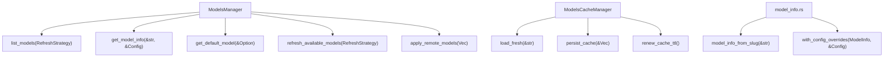
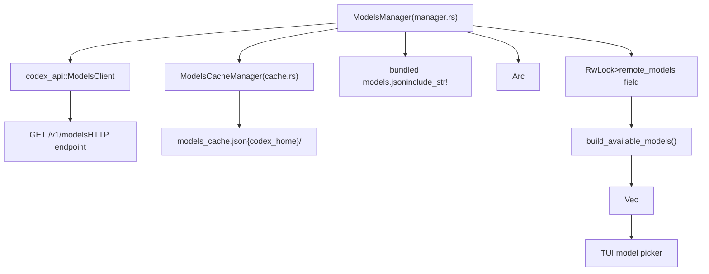
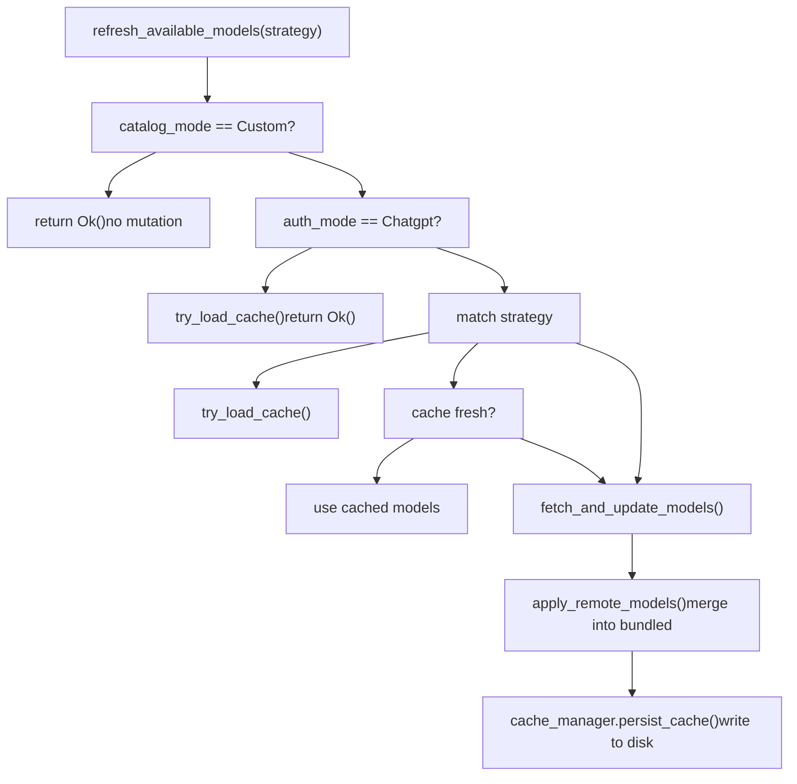
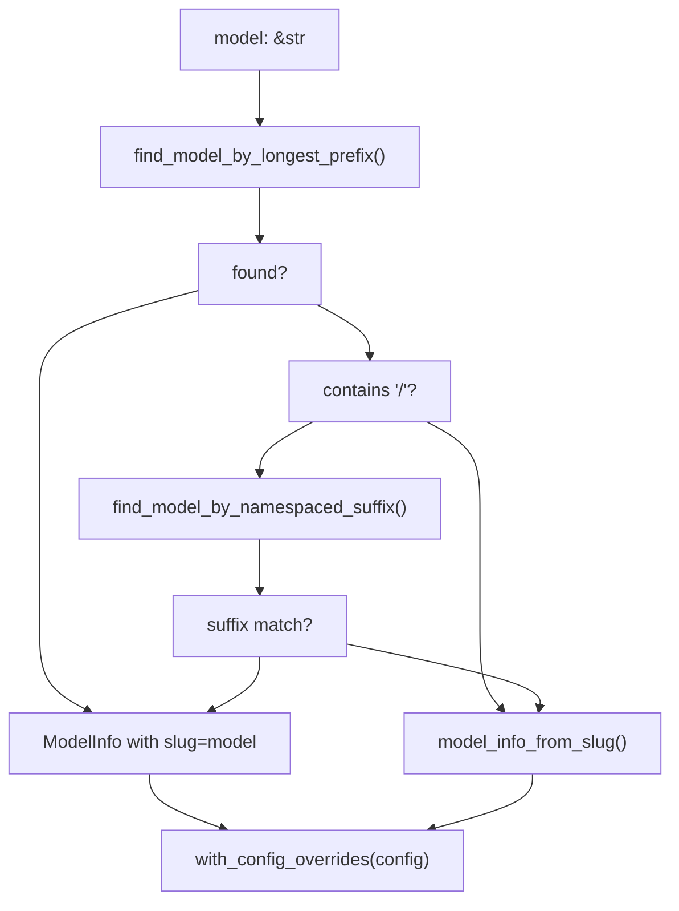

# Models Manager

Relevant source files

-   [codex-rs/app-server-protocol/schema/json/v2/ModelListResponse.json](https://github.com/openai/codex/blob/d807d44a/codex-rs/app-server-protocol/schema/json/v2/ModelListResponse.json)
-   [codex-rs/app-server-protocol/schema/typescript/v2/Model.ts](https://github.com/openai/codex/blob/d807d44a/codex-rs/app-server-protocol/schema/typescript/v2/Model.ts)
-   [codex-rs/app-server-protocol/schema/typescript/v2/ModelUpgradeInfo.ts](https://github.com/openai/codex/blob/d807d44a/codex-rs/app-server-protocol/schema/typescript/v2/ModelUpgradeInfo.ts)
-   [codex-rs/app-server/src/models.rs](https://github.com/openai/codex/blob/d807d44a/codex-rs/app-server/src/models.rs)
-   [codex-rs/app-server/tests/common/models\_cache.rs](https://github.com/openai/codex/blob/d807d44a/codex-rs/app-server/tests/common/models_cache.rs)
-   [codex-rs/app-server/tests/suite/v2/model\_list.rs](https://github.com/openai/codex/blob/d807d44a/codex-rs/app-server/tests/suite/v2/model_list.rs)
-   [codex-rs/codex-api/src/endpoint/models.rs](https://github.com/openai/codex/blob/d807d44a/codex-rs/codex-api/src/endpoint/models.rs)
-   [codex-rs/codex-api/tests/models\_integration.rs](https://github.com/openai/codex/blob/d807d44a/codex-rs/codex-api/tests/models_integration.rs)
-   [codex-rs/core/models.json](https://github.com/openai/codex/blob/d807d44a/codex-rs/core/models.json)
-   [codex-rs/core/src/models\_manager/cache.rs](https://github.com/openai/codex/blob/d807d44a/codex-rs/core/src/models_manager/cache.rs)
-   [codex-rs/core/src/models\_manager/manager.rs](https://github.com/openai/codex/blob/d807d44a/codex-rs/core/src/models_manager/manager.rs)
-   [codex-rs/core/src/models\_manager/mod.rs](https://github.com/openai/codex/blob/d807d44a/codex-rs/core/src/models_manager/mod.rs)
-   [codex-rs/core/src/models\_manager/model\_info.rs](https://github.com/openai/codex/blob/d807d44a/codex-rs/core/src/models_manager/model_info.rs)
-   [codex-rs/core/tests/suite/model\_switching.rs](https://github.com/openai/codex/blob/d807d44a/codex-rs/core/tests/suite/model_switching.rs)
-   [codex-rs/core/tests/suite/models\_cache\_ttl.rs](https://github.com/openai/codex/blob/d807d44a/codex-rs/core/tests/suite/models_cache_ttl.rs)
-   [codex-rs/core/tests/suite/personality.rs](https://github.com/openai/codex/blob/d807d44a/codex-rs/core/tests/suite/personality.rs)
-   [codex-rs/core/tests/suite/remote\_models.rs](https://github.com/openai/codex/blob/d807d44a/codex-rs/core/tests/suite/remote_models.rs)
-   [codex-rs/protocol/src/openai\_models.rs](https://github.com/openai/codex/blob/d807d44a/codex-rs/protocol/src/openai_models.rs)
-   [codex-rs/tui/src/chatwidget/snapshots/codex\_tui\_\_chatwidget\_\_tests\_\_model\_selection\_popup.snap](https://github.com/openai/codex/blob/d807d44a/codex-rs/tui/src/chatwidget/snapshots/codex_tui__chatwidget__tests__model_selection_popup.snap)

The Models Manager is the subsystem within `codex-core` responsible for discovering, caching, and resolving model metadata. It bridges the remote `/models` endpoint with the rest of the agent system, making model capabilities available to prompt construction, tool configuration, and UI pickers.

This page covers the `ModelsManager` struct, `ModelInfo`, `ModelPreset`, `ModelProviderInfo`, `ModelsCacheManager`, refresh strategies, slug resolution logic, and personality support.

---

## Core Types

**Model Metadata Types** — defined in [codex-rs/protocol/src/openai\_models.rs1-500](https://github.com/openai/codex/blob/d807d44a/codex-rs/protocol/src/openai_models.rs#L1-L500)

| Type | Purpose |
| --- | --- |
| `ModelInfo` | Full metadata returned by the `/models` endpoint |
| `ModelPreset` | Picker-ready summary derived from `ModelInfo` |
| `ModelsResponse` | Wire format wrapping `Vec<ModelInfo>` |
| `ReasoningEffort` | Enum: `None`, `Minimal`, `Low`, `Medium`, `High`, `XHigh` |
| `ReasoningEffortPreset` | Effort level + description pair shown in UIs |
| `ConfigShellToolType` | Shell execution mode: `Default`, `Local`, `UnifiedExec`, `Disabled`, `ShellCommand` |
| `ModelVisibility` | `List` (shown in picker), `Hide`, `None` |
| `TruncationPolicyConfig` | Truncation mode (`Bytes` or `Tokens`) and numeric limit |
| `ModelMessages` | Optional instructions template with personality variable slots |
| `ModelInstructionsVariables` | Per-personality text for `default`, `friendly`, `pragmatic` |
| `ModelUpgrade` | Recommended upgrade model and effort mapping |

**Key `ModelInfo` fields:**

| Field | Type | Notes |
| --- | --- | --- |
| `slug` | `String` | Stable model identifier sent to the API |
| `shell_type` | `ConfigShellToolType` | Determines which shell tool handler is activated |
| `truncation_policy` | `TruncationPolicyConfig` | Tool output truncation limits |
| `base_instructions` | `String` | System prompt content for this model |
| `model_messages` | `Option<ModelMessages>` | Template-based instructions enabling personality |
| `context_window` | `Option<i64>` | Maximum token context accepted |
| `supports_reasoning_summaries` | `bool` | Whether summary reasoning is available |
| `used_fallback_model_metadata` | `bool` | Internal marker; set when slug had no catalog match |

Sources: [codex-rs/protocol/src/openai\_models.rs118-287](https://github.com/openai/codex/blob/d807d44a/codex-rs/protocol/src/openai_models.rs#L118-L287)

---

## Key Code Entities

**Core Classes and Methods:**

Sources: [codex-rs/core/src/models\_manager/manager.rs168-368](https://github.com/openai/codex/blob/d807d44a/codex-rs/core/src/models_manager/manager.rs#L168-L368) [codex-rs/core/src/models\_manager/cache.rs31-116](https://github.com/openai/codex/blob/d807d44a/codex-rs/core/src/models_manager/cache.rs#L31-L116) [codex-rs/core/src/models\_manager/model\_info.rs24-95](https://github.com/openai/codex/blob/d807d44a/codex-rs/core/src/models_manager/model_info.rs#L24-L95)

---

**`ModelProviderInfo`** — defined in [codex-rs/core/src/model\_provider\_info.rs57-262](https://github.com/openai/codex/blob/d807d44a/codex-rs/core/src/model_provider_info.rs#L57-L262)

Represents a configured API endpoint (base URL, auth mechanism, retry limits, etc.).

| Field | Type | Notes |
| --- | --- | --- |
| `name` | `String` | Friendly display name (e.g., `"OpenAI"`) |
| `base_url` | `Option<String>` | Overrides default OpenAI/ChatGPT endpoint |
| `env_key` | `Option<String>` | Env var holding the API key |
| `request_max_retries` | `Option<u64>` | Max HTTP retry attempts (default: 4) |
| `stream_max_retries` | `Option<u64>` | Max stream reconnections (default: 5) |

Built-in providers are returned by `built_in_model_providers()` and include `"openai"`, `"ollama"`, and `"lmstudio"`.

Sources: [codex-rs/core/src/model\_provider\_info.rs218-292](https://github.com/openai/codex/blob/d807d44a/codex-rs/core/src/model_provider_info.rs#L218-L292)

---

## ModelsManager Architecture

**Overall data flow:**

Sources: [codex-rs/core/src/models\_manager/manager.rs54-100](https://github.com/openai/codex/blob/d807d44a/codex-rs/core/src/models_manager/manager.rs#L54-L100) [codex-rs/core/src/models\_manager/cache.rs14-28](https://github.com/openai/codex/blob/d807d44a/codex-rs/core/src/models_manager/cache.rs#L14-L28)

**`ModelsManager` struct fields:**

| Field | Type | Role |
| --- | --- | --- |
| `remote_models` | `RwLock<Vec<ModelInfo>>` | Active in-memory model catalog |
| `catalog_mode` | `CatalogMode` | `Default` (refreshable) or `Custom` (locked) |
| `auth_manager` | `Arc<AuthManager>` | Supplies auth tokens and mode detection |
| `etag` | `RwLock<Option<String>>` | HTTP ETag from last `/models` response |
| `cache_manager` | `ModelsCacheManager` | Reads/writes `models_cache.json` |

Sources: [codex-rs/core/src/models\_manager/manager.rs55-64](https://github.com/openai/codex/blob/d807d44a/codex-rs/core/src/models_manager/manager.rs#L55-L64)

---

## Refresh Strategies

`RefreshStrategy` controls when the network is consulted:

| Variant | Behavior |
| --- | --- |
| `Online` | Always fetches from the network, ignoring cache |
| `Offline` | Only reads from disk cache; never calls the network |
| `OnlineIfUncached` | Uses fresh cache if available; falls back to network |

**Refresh Decision Flow:**

Sources: [codex-rs/core/src/models\_manager/manager.rs242-305](https://github.com/openai/codex/blob/d807d44a/codex-rs/core/src/models_manager/manager.rs#L242-L305)

---

## Model Slug Resolution

`get_model_info(model: &str, config: &Config)` resolves the active `ModelInfo` for a given slug using two strategies:

1.  **Longest Prefix Match**: Scans catalog entries for the longest `slug` that is a prefix of the requested model string [codex-rs/core/src/models\_manager/manager.rs191-203](https://github.com/openai/codex/blob/d807d44a/codex-rs/core/src/models_manager/manager.rs#L191-L203)
2.  **Namespaced Suffix Match**: If a `/` is present, strips the namespace and retries prefix matching on the suffix [codex-rs/core/src/models\_manager/manager.rs205-223](https://github.com/openai/codex/blob/d807d44a/codex-rs/core/src/models_manager/manager.rs#L205-L223)

**Fallback**: If no match is found, `model_info_from_slug()` generates a synthetic fallback [codex-rs/core/src/models\_manager/model\_info.rs61-94](https://github.com/openai/codex/blob/d807d44a/codex-rs/core/src/models_manager/model_info.rs#L61-L94)

**Slug Resolution Decision Tree:**

Sources: [codex-rs/core/src/models\_manager/manager.rs168-223](https://github.com/openai/codex/blob/d807d44a/codex-rs/core/src/models_manager/manager.rs#L168-L223) [codex-rs/core/src/models\_manager/model\_info.rs60-95](https://github.com/openai/codex/blob/d807d44a/codex-rs/core/src/models_manager/model_info.rs#L60-L95)

---

## Disk Cache

`ModelsCacheManager` manages the on-disk file `{codex_home}/models_cache.json` [codex-rs/core/src/models\_manager/manager.rs42](https://github.com/openai/codex/blob/d807d44a/codex-rs/core/src/models_manager/manager.rs#L42-L42)

**Cache validity rules:**

-   `client_version` must match the running binary's version [codex-rs/core/src/models\_manager/cache.rs72-78](https://github.com/openai/codex/blob/d807d44a/codex-rs/core/src/models_manager/cache.rs#L72-L78)
-   The cache is considered fresh if `(now - fetched_at) ≤ TTL`. Default TTL is **300 seconds** [codex-rs/core/src/models\_manager/manager.rs43](https://github.com/openai/codex/blob/d807d44a/codex-rs/core/src/models_manager/manager.rs#L43-L43)
-   **ETag-based TTL renewal**: If the API returns a matching `X-Models-Etag`, the cache timestamp is renewed without a full `/models` fetch [codex-rs/core/tests/suite/models\_cache\_ttl.rs78-115](https://github.com/openai/codex/blob/d807d44a/codex-rs/core/tests/suite/models_cache_ttl.rs#L78-L115)

Sources: [codex-rs/core/src/models\_manager/cache.rs1-183](https://github.com/openai/codex/blob/d807d44a/codex-rs/core/src/models_manager/cache.rs#L1-L183) [codex-rs/core/src/models\_manager/manager.rs42-45](https://github.com/openai/codex/blob/d807d44a/codex-rs/core/src/models_manager/manager.rs#L42-L45)

---

## Personality Support

Personality is a model-level feature supported when `ModelInfo.model_messages` is present [codex-rs/core/src/models\_manager/model\_info.rs53-55](https://github.com/openai/codex/blob/d807d44a/codex-rs/core/src/models_manager/model_info.rs#L53-L55)

**`ModelMessages` structure:**

-   `instructions_template`: Instructions string with `{{ personality }}` placeholder [codex-rs/core/src/models\_manager/model\_info.rs100](https://github.com/openai/codex/blob/d807d44a/codex-rs/core/src/models_manager/model_info.rs#L100-L100)
-   `instructions_variables`: Per-personality text for `friendly`, `pragmatic`, etc [codex-rs/core/src/models\_manager/model\_info.rs102-106](https://github.com/openai/codex/blob/d807d44a/codex-rs/core/src/models_manager/model_info.rs#L102-L106)

If `config.base_instructions` is set, personality templates are disabled [codex-rs/core/src/models\_manager/model\_info.rs50-52](https://github.com/openai/codex/blob/d807d44a/codex-rs/core/src/models_manager/model_info.rs#L50-L52)

Sources: [codex-rs/protocol/src/openai\_models.rs287-313](https://github.com/openai/codex/blob/d807d44a/codex-rs/protocol/src/openai_models.rs#L287-L313) [codex-rs/core/src/models\_manager/model\_info.rs93-107](https://github.com/openai/codex/blob/d807d44a/codex-rs/core/src/models_manager/model_info.rs#L93-L107)
