# Memories System

Relevant source files

-   [codex-rs/core/src/contextual\_user\_message.rs](https://github.com/openai/codex/blob/d807d44a/codex-rs/core/src/contextual_user_message.rs)
-   [codex-rs/core/src/contextual\_user\_message\_tests.rs](https://github.com/openai/codex/blob/d807d44a/codex-rs/core/src/contextual_user_message_tests.rs)
-   [codex-rs/core/src/memories/README.md](https://github.com/openai/codex/blob/d807d44a/codex-rs/core/src/memories/README.md?plain=1)
-   [codex-rs/core/src/memories/mod.rs](https://github.com/openai/codex/blob/d807d44a/codex-rs/core/src/memories/mod.rs)
-   [codex-rs/core/src/memories/phase1.rs](https://github.com/openai/codex/blob/d807d44a/codex-rs/core/src/memories/phase1.rs)
-   [codex-rs/core/src/memories/phase1\_tests.rs](https://github.com/openai/codex/blob/d807d44a/codex-rs/core/src/memories/phase1_tests.rs)
-   [codex-rs/core/src/memories/phase2.rs](https://github.com/openai/codex/blob/d807d44a/codex-rs/core/src/memories/phase2.rs)
-   [codex-rs/core/src/memories/prompts.rs](https://github.com/openai/codex/blob/d807d44a/codex-rs/core/src/memories/prompts.rs)
-   [codex-rs/core/src/memories/start.rs](https://github.com/openai/codex/blob/d807d44a/codex-rs/core/src/memories/start.rs)
-   [codex-rs/core/src/memories/storage.rs](https://github.com/openai/codex/blob/d807d44a/codex-rs/core/src/memories/storage.rs)
-   [codex-rs/core/src/memories/tests.rs](https://github.com/openai/codex/blob/d807d44a/codex-rs/core/src/memories/tests.rs)
-   [codex-rs/core/src/realtime\_context.rs](https://github.com/openai/codex/blob/d807d44a/codex-rs/core/src/realtime_context.rs)
-   [codex-rs/core/src/realtime\_context\_tests.rs](https://github.com/openai/codex/blob/d807d44a/codex-rs/core/src/realtime_context_tests.rs)
-   [codex-rs/core/templates/memories/consolidation.md](https://github.com/openai/codex/blob/d807d44a/codex-rs/core/templates/memories/consolidation.md?plain=1)
-   [codex-rs/core/templates/memories/read\_path.md](https://github.com/openai/codex/blob/d807d44a/codex-rs/core/templates/memories/read_path.md?plain=1)
-   [codex-rs/core/templates/memories/stage\_one\_input.md](https://github.com/openai/codex/blob/d807d44a/codex-rs/core/templates/memories/stage_one_input.md?plain=1)
-   [codex-rs/core/templates/memories/stage\_one\_system.md](https://github.com/openai/codex/blob/d807d44a/codex-rs/core/templates/memories/stage_one_system.md?plain=1)
-   [codex-rs/core/tests/suite/memories.rs](https://github.com/openai/codex/blob/d807d44a/codex-rs/core/tests/suite/memories.rs)
-   [codex-rs/state/migrations/0020\_threads\_model\_reasoning\_effort.sql](https://github.com/openai/codex/blob/d807d44a/codex-rs/state/migrations/0020_threads_model_reasoning_effort.sql)
-   [codex-rs/state/src/extract.rs](https://github.com/openai/codex/blob/d807d44a/codex-rs/state/src/extract.rs)
-   [codex-rs/state/src/model/memories.rs](https://github.com/openai/codex/blob/d807d44a/codex-rs/state/src/model/memories.rs)
-   [codex-rs/state/src/model/thread\_metadata.rs](https://github.com/openai/codex/blob/d807d44a/codex-rs/state/src/model/thread_metadata.rs)
-   [codex-rs/state/src/runtime/memories.rs](https://github.com/openai/codex/blob/d807d44a/codex-rs/state/src/runtime/memories.rs)
-   [codex-rs/state/src/runtime/test\_support.rs](https://github.com/openai/codex/blob/d807d44a/codex-rs/state/src/runtime/test_support.rs)
-   [codex-rs/state/src/runtime/threads.rs](https://github.com/openai/codex/blob/d807d44a/codex-rs/state/src/runtime/threads.rs)

The Memories System is a multi-phase pipeline designed to extract, consolidate, and inject persistent knowledge from past conversation rollouts into the current agent context. It allows the agent to maintain long-term continuity, remember user preferences, and reuse proven workflows across different sessions.

## Architecture Overview

The system operates in two primary phases: **Startup Extraction (Phase 1)** and **Global Consolidation (Phase 2)**. These phases transition data from raw execution logs (rollouts) into a structured, searchable memory folder.

### Memory Pipeline Data Flow

The following diagram illustrates the flow from a completed `Rollout` to injected context in a new `Session`.

**Diagram: Memory Extraction and Consolidation Pipeline**

```mermaid
flowchart TD
    DB["SQLite (state_db)"]
    T_TBL["threads table"]
    S1_TBL["stage1_outputs table"]
    J_TBL["jobs table"]
    P1_RUN["phase1::run()"]
    CLAIM1["claim_stage1_jobs_for_startup()"]
    EXTRACT["Stage 1 Extraction Agent"]
    P2_RUN["phase2::run()"]
    CLAIM2["try_claim_global_phase2_job()"]
    CONSOLIDATE["Consolidation Sub-Agent"]
    ROLLOUTS["rollout_*.jsonl"]
    MEM_ROOT["/memories/"]
    RS_DIR["/rollout_summaries/"]
    RAW_MD["raw_memories.md"]
    SUM_MD["memory_summary.md"]

    ROLLOUTS --> P1_RUN
    T --> TBL_CLAIM1
    CLAIM1 --> P1_RUN
    P1 --> RUN_EXTRACT
    EXTRACT --> S1_TBL
    S1 --> TBL_P2_RUN
    CLAIM2 --> P2_RUN
    P2 --> RUN_CONSOLIDATE
    CONSOLIDATE --> RS_DIR
    CONSOLIDATE --> SUM_MD
    S1 --> TBL_RAW_MD
```

Sources: [codex-rs/core/src/memories/mod.rs1-15](https://github.com/openai/codex/blob/d807d44a/codex-rs/core/src/memories/mod.rs#L1-L15) [codex-rs/core/src/memories/phase1.rs81-123](https://github.com/openai/codex/blob/d807d44a/codex-rs/core/src/memories/phase1.rs#L81-L123) [codex-rs/core/src/memories/phase2.rs43-161](https://github.com/openai/codex/blob/d807d44a/codex-rs/core/src/memories/phase2.rs#L43-L161)

---

## Phase 1: Startup Extraction

Phase 1 identifies "stale" threads (those updated since their last memory extraction) and runs a lightweight agent to summarize them.

### Key Logic

1.  **Job Selection**: The system scans the `threads` table for active threads within an age window (e.g., `max_age_days`) that have been idle for a minimum duration (`min_rollout_idle_hours`) [codex-rs/state/src/runtime/memories.rs122-159](https://github.com/openai/codex/blob/d807d44a/codex-rs/state/src/runtime/memories.rs#L122-L159)
2.  **Concurrency**: Extraction jobs are run in parallel, governed by `CONCURRENCY_LIMIT` (default 8) [codex-rs/core/src/memories/mod.rs41](https://github.com/openai/codex/blob/d807d44a/codex-rs/core/src/memories/mod.rs#L41-L41)
3.  **Extraction**: A `gpt-5.1-codex-mini` model is typically used to transform a raw `.jsonl` rollout into a `StageOneOutput` struct containing `raw_memory` (detailed markdown) and `rollout_summary` (compact recap) [codex-rs/core/src/memories/phase1.rs35-79](https://github.com/openai/codex/blob/d807d44a/codex-rs/core/src/memories/phase1.rs#L35-L79)
4.  **Persistence**: Results are stored in the `stage1_outputs` table in the state database [codex-rs/state/src/runtime/memories.rs50-56](https://github.com/openai/codex/blob/d807d44a/codex-rs/state/src/runtime/memories.rs#L50-L56)

Sources: [codex-rs/core/src/memories/phase1.rs1-180](https://github.com/openai/codex/blob/d807d44a/codex-rs/core/src/memories/phase1.rs#L1-L180) [codex-rs/state/src/runtime/memories.rs122-218](https://github.com/openai/codex/blob/d807d44a/codex-rs/state/src/runtime/memories.rs#L122-L218)

---

## Phase 2: Global Consolidation

Phase 2 acts as a "Memory Writing Agent" that periodically merges individual stage-1 outputs into the global memory structure.

### Implementation Details

-   **Global Lock**: Only one consolidation process can run at a time per `codex_home`, managed by `try_claim_global_phase2_job` with a `JOB_KIND_MEMORY_CONSOLIDATE_GLOBAL` entry in the `jobs` table [codex-rs/state/src/runtime/memories.rs21-22](https://github.com/openai/codex/blob/d807d44a/codex-rs/state/src/runtime/memories.rs#L21-L22)
-   **Sub-Agent Dispatch**: It spawns a sub-agent with the source `SubAgentSource::MemoryConsolidation` [codex-rs/core/src/memories/phase2.rs131](https://github.com/openai/codex/blob/d807d44a/codex-rs/core/src/memories/phase2.rs#L131-L131)
-   **Artifact Synchronization**: Before the agent runs, the system syncs the local file system with the database using `sync_rollout_summaries_from_memories` and `rebuild_raw_memories_file_from_memories` [codex-rs/core/src/memories/phase2.rs98-114](https://github.com/openai/codex/blob/d807d44a/codex-rs/core/src/memories/phase2.rs#L98-L114)

**Diagram: Memory Storage Structure**

Sources: [codex-rs/core/src/memories/phase2.rs43-161](https://github.com/openai/codex/blob/d807d44a/codex-rs/core/src/memories/phase2.rs#L43-L161) [codex-rs/core/src/memories/storage.rs12-60](https://github.com/openai/codex/blob/d807d44a/codex-rs/core/src/memories/storage.rs#L12-L60) [codex-rs/core/templates/memories/consolidation.md17-36](https://github.com/openai/codex/blob/d807d44a/codex-rs/core/templates/memories/consolidation.md?plain=1#L17-L36)

---

## Storage and Layout

Memories are stored in a dedicated `memories` directory within `codex_home`.

| File/Directory | Purpose |
| --- | --- |
| `memory_summary.md` | High-level navigational summary injected into every prompt. |
| `MEMORY.md` | A searchable registry and handbook of aggregated insights. |
| `raw_memories.md` | A temporary merge of Phase 1 outputs used as input for Phase 2. |
| `rollout_summaries/` | Per-thread recaps containing lessons learned and evidence snippets. |
| `skills/` | Reusable procedures and scripts (e.g., `SKILL.md`). |

### Rollout Summary Naming

Filenames in `rollout_summaries/` are generated using `rollout_summary_file_stem`, which combines the `ThreadId`, a timestamp fragment, and an optional `rollout_slug` [codex-rs/core/src/memories/storage.rs171-200](https://github.com/openai/codex/blob/d807d44a/codex-rs/core/src/memories/storage.rs#L171-L200)

Sources: [codex-rs/core/src/memories/mod.rs101-111](https://github.com/openai/codex/blob/d807d44a/codex-rs/core/src/memories/mod.rs#L101-L111) [codex-rs/core/src/memories/storage.rs62-96](https://github.com/openai/codex/blob/d807d44a/codex-rs/core/src/memories/storage.rs#L62-L96) [codex-rs/core/templates/memories/consolidation.md20-35](https://github.com/openai/codex/blob/d807d44a/codex-rs/core/templates/memories/consolidation.md?plain=1#L20-L35)

---

## Context Injection (Startup)

During the initialization of a new `Session`, the system injects memory guidance into the model's developer instructions.

### The Read Path

The function `build_memory_tool_developer_instructions` reads `memory_summary.md` and wraps it in the `read_path.md` template [codex-rs/core/src/memories/prompts.rs158-179](https://github.com/openai/codex/blob/d807d44a/codex-rs/core/src/memories/prompts.rs#L158-L179)

-   **Token Limits**: The injected `memory_summary.md` is truncated to `MEMORY_TOOL_DEVELOPER_INSTRUCTIONS_SUMMARY_TOKEN_LIMIT` (5,000 tokens) to preserve context window [codex-rs/core/src/memories/mod.rs47](https://github.com/openai/codex/blob/d807d44a/codex-rs/core/src/memories/mod.rs#L47-L47)
-   **Citations**: The agent is instructed to use `<oai-mem-citation>` blocks to cite specific files and line ranges from the memory folder [codex-rs/core/templates/memories/read\_path.md82-122](https://github.com/openai/codex/blob/d807d44a/codex-rs/core/templates/memories/read_path.md?plain=1#L82-L122)
-   **Usage Tracking**: When the agent cites memories, the system calls `record_stage1_output_usage` to increment `usage_count` and update `last_usage` in the database [codex-rs/state/src/runtime/memories.rs89-120](https://github.com/openai/codex/blob/d807d44a/codex-rs/state/src/runtime/memories.rs#L89-L120)

Sources: [codex-rs/core/src/memories/prompts.rs158-179](https://github.com/openai/codex/blob/d807d44a/codex-rs/core/src/memories/prompts.rs#L158-L179) [codex-rs/core/templates/memories/read\_path.md1-130](https://github.com/openai/codex/blob/d807d44a/codex-rs/core/templates/memories/read_path.md?plain=1#L1-L130) [codex-rs/state/src/runtime/memories.rs89-120](https://github.com/openai/codex/blob/d807d44a/codex-rs/state/src/runtime/memories.rs#L89-L120)
