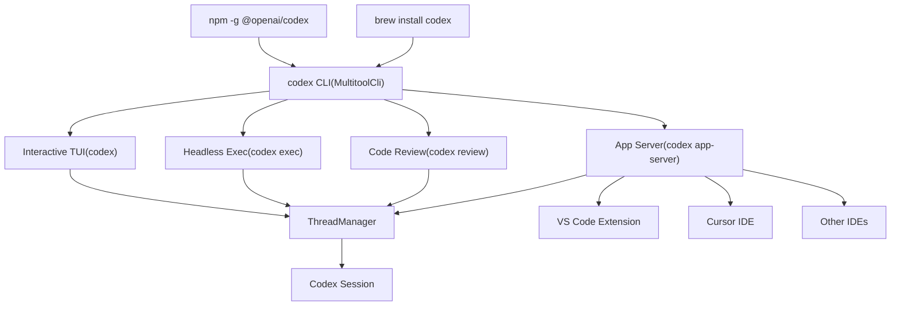
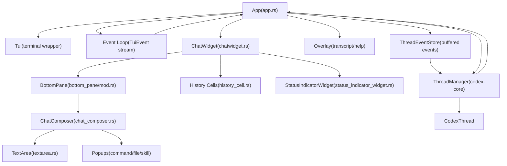
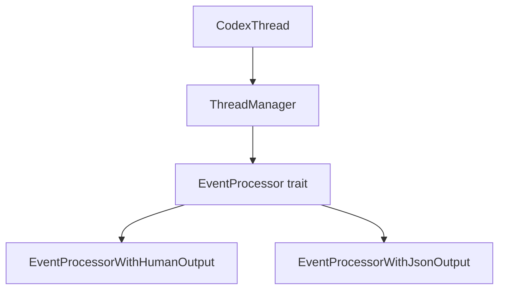

# User Interfaces

Relevant source files

-   [codex-rs/Cargo.lock](https://github.com/openai/codex/blob/d807d44a/codex-rs/Cargo.lock)
-   [codex-rs/Cargo.toml](https://github.com/openai/codex/blob/d807d44a/codex-rs/Cargo.toml)
-   [codex-rs/README.md](https://github.com/openai/codex/blob/d807d44a/codex-rs/README.md?plain=1)
-   [codex-rs/cli/Cargo.toml](https://github.com/openai/codex/blob/d807d44a/codex-rs/cli/Cargo.toml)
-   [codex-rs/cli/src/lib.rs](https://github.com/openai/codex/blob/d807d44a/codex-rs/cli/src/lib.rs)
-   [codex-rs/cli/src/main.rs](https://github.com/openai/codex/blob/d807d44a/codex-rs/cli/src/main.rs)
-   [codex-rs/config.md](https://github.com/openai/codex/blob/d807d44a/codex-rs/config.md?plain=1)
-   [codex-rs/core/Cargo.toml](https://github.com/openai/codex/blob/d807d44a/codex-rs/core/Cargo.toml)
-   [codex-rs/core/src/codex.rs](https://github.com/openai/codex/blob/d807d44a/codex-rs/core/src/codex.rs)
-   [codex-rs/core/src/flags.rs](https://github.com/openai/codex/blob/d807d44a/codex-rs/core/src/flags.rs)
-   [codex-rs/core/src/lib.rs](https://github.com/openai/codex/blob/d807d44a/codex-rs/core/src/lib.rs)
-   [codex-rs/core/src/model\_provider\_info.rs](https://github.com/openai/codex/blob/d807d44a/codex-rs/core/src/model_provider_info.rs)
-   [codex-rs/core/src/rollout/policy.rs](https://github.com/openai/codex/blob/d807d44a/codex-rs/core/src/rollout/policy.rs)
-   [codex-rs/exec/Cargo.toml](https://github.com/openai/codex/blob/d807d44a/codex-rs/exec/Cargo.toml)
-   [codex-rs/exec/src/cli.rs](https://github.com/openai/codex/blob/d807d44a/codex-rs/exec/src/cli.rs)
-   [codex-rs/exec/src/event\_processor.rs](https://github.com/openai/codex/blob/d807d44a/codex-rs/exec/src/event_processor.rs)
-   [codex-rs/exec/src/event\_processor\_with\_human\_output.rs](https://github.com/openai/codex/blob/d807d44a/codex-rs/exec/src/event_processor_with_human_output.rs)
-   [codex-rs/exec/src/lib.rs](https://github.com/openai/codex/blob/d807d44a/codex-rs/exec/src/lib.rs)
-   [codex-rs/mcp-server/src/codex\_tool\_runner.rs](https://github.com/openai/codex/blob/d807d44a/codex-rs/mcp-server/src/codex_tool_runner.rs)
-   [codex-rs/protocol/src/protocol.rs](https://github.com/openai/codex/blob/d807d44a/codex-rs/protocol/src/protocol.rs)
-   [codex-rs/tui/Cargo.toml](https://github.com/openai/codex/blob/d807d44a/codex-rs/tui/Cargo.toml)
-   [codex-rs/tui/src/app.rs](https://github.com/openai/codex/blob/d807d44a/codex-rs/tui/src/app.rs)
-   [codex-rs/tui/src/app\_event.rs](https://github.com/openai/codex/blob/d807d44a/codex-rs/tui/src/app_event.rs)
-   [codex-rs/tui/src/bottom\_pane/chat\_composer.rs](https://github.com/openai/codex/blob/d807d44a/codex-rs/tui/src/bottom_pane/chat_composer.rs)
-   [codex-rs/tui/src/bottom\_pane/mod.rs](https://github.com/openai/codex/blob/d807d44a/codex-rs/tui/src/bottom_pane/mod.rs)
-   [codex-rs/tui/src/chatwidget.rs](https://github.com/openai/codex/blob/d807d44a/codex-rs/tui/src/chatwidget.rs)
-   [codex-rs/tui/src/chatwidget/tests.rs](https://github.com/openai/codex/blob/d807d44a/codex-rs/tui/src/chatwidget/tests.rs)
-   [codex-rs/tui/src/cli.rs](https://github.com/openai/codex/blob/d807d44a/codex-rs/tui/src/cli.rs)
-   [codex-rs/tui/src/history\_cell.rs](https://github.com/openai/codex/blob/d807d44a/codex-rs/tui/src/history_cell.rs)
-   [codex-rs/tui/src/lib.rs](https://github.com/openai/codex/blob/d807d44a/codex-rs/tui/src/lib.rs)
-   [codex-rs/tui/src/slash\_command.rs](https://github.com/openai/codex/blob/d807d44a/codex-rs/tui/src/slash_command.rs)

## Purpose and Scope

This document describes the user-facing interfaces through which users interact with Codex: the **Terminal User Interface (TUI)** for interactive sessions, **headless execution mode** (`codex exec`) for non-interactive automation, the **CLI entry point** that dispatches to different modes, and the **App Server** for IDE integrations. Each interface provides a different interaction model while sharing the same underlying core engine.

For configuration of these interfaces, see [Configuration System](/openai/codex/2.2-configuration-system). For the protocol layer that coordinates async communication across all interfaces, see [Protocol Layer (Submission/Event System)](/openai/codex/2.1-protocol-layer-(submissionevent-system)).

---

## Execution Modes Overview

Codex supports four distinct execution modes, each optimized for different use cases:

**Execution Mode Characteristics:**

| Mode | Interactive | Output Format | Primary Use Case |
| --- | --- | --- | --- |
| TUI | Yes | Rich terminal UI | Human-driven development sessions |
| Exec | No | Plain text or JSONL | CI/CD, scripting, automation |
| Review | No | Plain text | Code review workflows |
| App Server | Yes (via IDE) | JSON-RPC | IDE integrations (VS Code, Cursor) |

Sources: [codex-rs/cli/src/main.rs56-111](https://github.com/openai/codex/blob/d807d44a/codex-rs/cli/src/main.rs#L56-L111) [codex-rs/tui/src/lib.rs1-139](https://github.com/openai/codex/blob/d807d44a/codex-rs/tui/src/lib.rs#L1-L139) [codex-rs/exec/src/lib.rs1-100](https://github.com/openai/codex/blob/d807d44a/codex-rs/exec/src/lib.rs#L1-L100)

---

## CLI Entry Point and Multitool Dispatch

The `codex` binary acts as a multitool that dispatches to different execution modes based on subcommands. The entry point is `MultitoolCli` defined in [codex-rs/cli/src/main.rs56-82](https://github.com/openai/codex/blob/d807d44a/codex-rs/cli/src/main.rs#L56-L82)

For details, see [CLI Entry Points and Multitool Dispatch](/openai/codex/4.3-cli-entry-points-and-multitool-dispatch).

---

## Terminal User Interface (TUI)

### Component Hierarchy

The TUI is structured as a layered widget hierarchy with clear separation between state management, input handling, and rendering:

**Key Components:**

| Component | File | Responsibility |
| --- | --- | --- |
| `App` | [codex-rs/tui/src/app.rs1-177](https://github.com/openai/codex/blob/d807d44a/codex-rs/tui/src/app.rs#L1-L177) | Top-level event loop, thread switching, and lifecycle management. |
| `ChatWidget` | [codex-rs/tui/src/chatwidget.rs1-150](https://github.com/openai/codex/blob/d807d44a/codex-rs/tui/src/chatwidget.rs#L1-L150) | Consumes protocol events, builds `HistoryCell`s, and drives viewport rendering. |
| `BottomPane` | [codex-rs/tui/src/bottom\_pane/mod.rs156-161](https://github.com/openai/codex/blob/d807d44a/codex-rs/tui/src/bottom_pane/mod.rs#L156-L161) | Owning container for prompt input and the view stack for focused interactions. |
| `ChatComposer` | [codex-rs/tui/src/bottom\_pane/chat\_composer.rs128-148](https://github.com/openai/codex/blob/d807d44a/codex-rs/tui/src/bottom_pane/chat_composer.rs#L128-L148) | Responsible for editing the input buffer and routing keys to active popups. |
| `HistoryCell` | [codex-rs/tui/src/history\_cell.rs98-168](https://github.com/openai/codex/blob/d807d44a/codex-rs/tui/src/history_cell.rs#L98-L168) | Trait representing a single renderable unit of conversation history. |

For details, see [Terminal User Interface (TUI)](/openai/codex/4.1-terminal-user-interface-(tui)).

---

## Headless Execution Mode (codex exec)

The `codex exec` mode provides non-interactive automation. It utilizes an `EventProcessor` trait to handle incoming protocol events and format them for terminal output or structured JSONL.

For details, see [Headless Execution Mode (codex exec)](/openai/codex/4.2-headless-execution-mode-(codex-exec)).

---

## Session Resumption and Forking

Codex supports resuming existing threads or forking them to create independent conversation paths. This is managed by replaying events from the rollout persistence layer into the UI state.

For details, see [Session Resumption and Forking](/openai/codex/4.4-session-resumption-and-forking).

---

## App Server and IDE Integration

The App Server exposes Codex functionality to IDE clients via a JSON-RPC 2.0 protocol. It manages the `ThreadManager` and routes requests such as `thread/start` and `turn/start`.

For details, see [App Server and IDE Integration](/openai/codex/4.5-app-server-and-ide-integration).

---

## TUI App Server Variant (tui\_app\_server)

The `tui_app_server` crate provides a TUI frontend that communicates with the core system via the App Server protocol rather than direct core integration.

For details, see [TUI App Server Variant (tui\_app\_server)](/openai/codex/4.6-tui-app-server-variant-(tui_app_server)).

---

## Sources Summary

-   **App Orchestration**: [codex-rs/tui/src/app.rs1-177](https://github.com/openai/codex/blob/d807d44a/codex-rs/tui/src/app.rs#L1-L177)
-   **TUI Core**: [codex-rs/tui/src/chatwidget.rs1-150](https://github.com/openai/codex/blob/d807d44a/codex-rs/tui/src/chatwidget.rs#L1-L150) [codex-rs/tui/src/history\_cell.rs1-168](https://github.com/openai/codex/blob/d807d44a/codex-rs/tui/src/history_cell.rs#L1-L168)
-   **Input System**: [codex-rs/tui/src/bottom\_pane/mod.rs1-161](https://github.com/openai/codex/blob/d807d44a/codex-rs/tui/src/bottom_pane/mod.rs#L1-L161) [codex-rs/tui/src/bottom\_pane/chat\_composer.rs1-148](https://github.com/openai/codex/blob/d807d44a/codex-rs/tui/src/bottom_pane/chat_composer.rs#L1-L148)
-   **CLI Dispatch**: [codex-rs/cli/src/main.rs56-111](https://github.com/openai/codex/blob/d807d44a/codex-rs/cli/src/main.rs#L56-L111)
-   **Protocol Definitions**: [codex-rs/protocol/src/protocol.rs101-180](https://github.com/openai/codex/blob/d807d44a/codex-rs/protocol/src/protocol.rs#L101-L180)
-   **Core Session**: [codex-rs/core/src/codex.rs1-189](https://github.com/openai/codex/blob/d807d44a/codex-rs/core/src/codex.rs#L1-L189)
