# Terminal User Interface (TUI)

Relevant source files

-   [codex-rs/clippy.toml](https://github.com/openai/codex/blob/d807d44a/codex-rs/clippy.toml)
-   [codex-rs/core/src/codex.rs](https://github.com/openai/codex/blob/d807d44a/codex-rs/core/src/codex.rs)
-   [codex-rs/core/src/rollout/policy.rs](https://github.com/openai/codex/blob/d807d44a/codex-rs/core/src/rollout/policy.rs)
-   [codex-rs/exec/src/event\_processor.rs](https://github.com/openai/codex/blob/d807d44a/codex-rs/exec/src/event_processor.rs)
-   [codex-rs/exec/src/event\_processor\_with\_human\_output.rs](https://github.com/openai/codex/blob/d807d44a/codex-rs/exec/src/event_processor_with_human_output.rs)
-   [codex-rs/mcp-server/src/codex\_tool\_runner.rs](https://github.com/openai/codex/blob/d807d44a/codex-rs/mcp-server/src/codex_tool_runner.rs)
-   [codex-rs/protocol/src/protocol.rs](https://github.com/openai/codex/blob/d807d44a/codex-rs/protocol/src/protocol.rs)
-   [codex-rs/tui/src/app.rs](https://github.com/openai/codex/blob/d807d44a/codex-rs/tui/src/app.rs)
-   [codex-rs/tui/src/app\_event.rs](https://github.com/openai/codex/blob/d807d44a/codex-rs/tui/src/app_event.rs)
-   [codex-rs/tui/src/bottom\_pane/chat\_composer.rs](https://github.com/openai/codex/blob/d807d44a/codex-rs/tui/src/bottom_pane/chat_composer.rs)
-   [codex-rs/tui/src/bottom\_pane/mod.rs](https://github.com/openai/codex/blob/d807d44a/codex-rs/tui/src/bottom_pane/mod.rs)
-   [codex-rs/tui/src/chatwidget.rs](https://github.com/openai/codex/blob/d807d44a/codex-rs/tui/src/chatwidget.rs)
-   [codex-rs/tui/src/chatwidget/tests.rs](https://github.com/openai/codex/blob/d807d44a/codex-rs/tui/src/chatwidget/tests.rs)
-   [codex-rs/tui/src/history\_cell.rs](https://github.com/openai/codex/blob/d807d44a/codex-rs/tui/src/history_cell.rs)
-   [codex-rs/tui/src/render/highlight.rs](https://github.com/openai/codex/blob/d807d44a/codex-rs/tui/src/render/highlight.rs)
-   [codex-rs/tui/src/render/snapshots/codex\_tui\_\_render\_\_highlight\_\_tests\_\_ansi\_family\_foreground\_palette.snap](https://github.com/openai/codex/blob/d807d44a/codex-rs/tui/src/render/snapshots/codex_tui__render__highlight__tests__ansi_family_foreground_palette.snap)
-   [codex-rs/tui/src/shimmer.rs](https://github.com/openai/codex/blob/d807d44a/codex-rs/tui/src/shimmer.rs)
-   [codex-rs/tui/src/slash\_command.rs](https://github.com/openai/codex/blob/d807d44a/codex-rs/tui/src/slash_command.rs)
-   [codex-rs/tui/src/snapshots/codex\_tui\_\_diff\_render\_\_tests\_\_theme\_scope\_background\_resolution.snap](https://github.com/openai/codex/blob/d807d44a/codex-rs/tui/src/snapshots/codex_tui__diff_render__tests__theme_scope_background_resolution.snap)
-   [codex-rs/tui/src/snapshots/codex\_tui\_\_pager\_overlay\_\_tests\_\_static\_overlay\_snapshot\_basic.snap](https://github.com/openai/codex/blob/d807d44a/codex-rs/tui/src/snapshots/codex_tui__pager_overlay__tests__static_overlay_snapshot_basic.snap)
-   [codex-rs/tui/src/style.rs](https://github.com/openai/codex/blob/d807d44a/codex-rs/tui/src/style.rs)
-   [codex-rs/tui/src/terminal\_palette.rs](https://github.com/openai/codex/blob/d807d44a/codex-rs/tui/src/terminal_palette.rs)
-   [codex-rs/tui/src/theme\_picker.rs](https://github.com/openai/codex/blob/d807d44a/codex-rs/tui/src/theme_picker.rs)
-   [codex-rs/tui/src/tui.rs](https://github.com/openai/codex/blob/d807d44a/codex-rs/tui/src/tui.rs)
-   [codex-rs/tui/src/tui/frame\_requester.rs](https://github.com/openai/codex/blob/d807d44a/codex-rs/tui/src/tui/frame_requester.rs)
-   [codex-rs/tui/styles.md](https://github.com/openai/codex/blob/d807d44a/codex-rs/tui/styles.md?plain=1)

## Purpose and Scope

The Terminal User Interface (TUI) is the interactive chat interface for Codex, implementing a full-featured terminal application using the `ratatui` rendering library. The TUI provides real-time conversation display, input composition, approval workflows, and multi-agent thread management.

This document covers the top-level TUI architecture, component hierarchy, and event-driven coordination. For detailed coverage of specific subsystems:

-   **[App Event Loop and Initialization](/openai/codex/4.1.1-app-event-loop-and-initialization)** - App event loop and initialization
-   **[ChatWidget and Conversation Display](/openai/codex/4.1.2-chatwidget-and-conversation-display)** - ChatWidget conversation display
-   **[BottomPane and Input System](/openai/codex/4.1.3-bottompane-and-input-system)** - BottomPane input system
-   **[Status Line and Footer Rendering](/openai/codex/4.1.4-status-line-and-footer-rendering)** - Status line and footer rendering
-   **[Interactive Overlays and Popups](/openai/codex/4.1.5-interactive-overlays-and-popups)** - Interactive overlays and popups

The TUI integrates with the core engine via the `Op` submission queue and `Event` stream, and manages UI state independently from the underlying agent execution.

---

## Component Hierarchy

### TUI Structural Overview

The TUI follows a layered widget architecture where the `App` coordinates between the protocol layer and the UI tree.

```mermaid
flowchart TD
    App["App(app.rs)Top-level coordinator"]
    TuiFramework["Tui Framework(tui.rs)Terminal management"]
    AppEventChannel["AppEvent ChannelUI coordination bus"]
    ChatWidget["ChatWidget(chatwidget.rs)Conversation state machine"]
    TranscriptCells["transcript_cells: Vec<Arc<dyn HistoryCell>>Committed history"]
    ActiveCell["active_cell: Option<Box<dyn HistoryCell>>Streaming in-progress cell"]
    BottomPane["BottomPane(bottom_pane/mod.rs)Footer container"]
    ChatComposer["ChatComposer(chat_composer.rs)Text input + history"]
    ViewStack["view_stack: Vec<Box<dyn BottomPaneView>>Overlays/popups"]
    StatusWidget["StatusIndicatorWidgetTask running indicator"]
    UserCell["UserHistoryCellUser message display"]
    AgentCell["AgentMessageCellAssistant output"]
    ExecCell["ExecCellShell command groups"]
    McpCell["McpToolCallCellMCP tool invocations"]
    WebSearchCell["WebSearchCellWeb search results"]
    ApprovalOverlay["ApprovalOverlayApproval requests"]
    SelectionView["list_selection_viewGeneric picker"]
    RequestUserInputOverlay["RequestUserInputOverlayMCP input forms"]
    OpChannel["codex_op_txUnboundedSender<Op>"]
    EventStream["Event streamfrom ThreadManager"]

    App --> TuiFramework
    App --> ChatWidget
    App --> BottomPane
    App --> AppEventChannel
    ChatWidget --> TranscriptCells
    ChatWidget --> ActiveCell
    ChatWidget --> OpChannel
    TranscriptCells --> UserCell
    TranscriptCells --> AgentCell
    TranscriptCells --> ExecCell
    TranscriptCells --> McpCell
    TranscriptCells --> WebSearchCell
    BottomPane --> ChatComposer
    BottomPane --> ViewStack
    BottomPane --> StatusWidget
    ViewStack --> ApprovalOverlay
    ViewStack --> SelectionView
    ViewStack --> RequestUserInputOverlay
    ChatWidget --> AppEventChannel
    BottomPane --> AppEventChannel
    EventStream --> ChatWidget
    ChatWidget --> EventStream
```

1.  **App** ([codex-rs/tui/src/app.rs171-400](https://github.com/openai/codex/blob/d807d44a/codex-rs/tui/src/app.rs#L171-L400)) owns the top-level state and orchestrates rendering, input routing, and thread management.
2.  **ChatWidget** ([codex-rs/tui/src/chatwidget.rs542-711](https://github.com/openai/codex/blob/d807d44a/codex-rs/tui/src/chatwidget.rs#L542-L711)) maintains conversation history as `transcript_cells` (committed) and `active_cell` (streaming), and translates protocol events into UI updates.
3.  **BottomPane** ([codex-rs/tui/src/bottom\_pane/mod.rs161-189](https://github.com/openai/codex/blob/d807d44a/codex-rs/tui/src/bottom_pane/mod.rs#L161-L189)) contains the `ChatComposer` for input and a `view_stack` for transient overlays like approval prompts.
4.  **HistoryCell** ([codex-rs/tui/src/history\_cell.rs98-168](https://github.com/openai/codex/blob/d807d44a/codex-rs/tui/src/history_cell.rs#L98-L168)) trait defines renderable transcript units with width-aware layout.

Sources: [codex-rs/tui/src/app.rs171-400](https://github.com/openai/codex/blob/d807d44a/codex-rs/tui/src/app.rs#L171-L400) [codex-rs/tui/src/chatwidget.rs542-711](https://github.com/openai/codex/blob/d807d44a/codex-rs/tui/src/chatwidget.rs#L542-L711) [codex-rs/tui/src/bottom\_pane/mod.rs161-189](https://github.com/openai/codex/blob/d807d44a/codex-rs/tui/src/bottom_pane/mod.rs#L161-L189) [codex-rs/tui/src/history\_cell.rs98-168](https://github.com/openai/codex/blob/d807d44a/codex-rs/tui/src/history_cell.rs#L98-L168)

---

## Event-Driven Architecture

The TUI uses a dual-channel event architecture to manage asynchronous updates from the agent while remaining responsive to user input.

### Event Flow Pattern

> **[Mermaid sequence]**
> *(图表结构无法解析)*

1.  **Input Path**: User key events flow through `Tui` → `App` → widget tree. `BottomPane` handles most input locally, returning `InputResult` for submission/commands. `ChatWidget` processes unhandled keys (navigation, interrupts).
2.  **Protocol Path**: Core events arrive on the `ThreadManager` event stream, are routed through `App::handle_codex_event`, and dispatched to `ChatWidget::handle_codex_event` ([codex-rs/tui/src/chatwidget.rs1458-2056](https://github.com/openai/codex/blob/d807d44a/codex-rs/tui/src/chatwidget.rs#L1458-L2056)).
3.  **AppEvent Bus**: Widgets emit `AppEvent` ([codex-rs/tui/src/app\_event.rs75-455](https://github.com/openai/codex/blob/d807d44a/codex-rs/tui/src/app_event.rs#L75-L455)) to request app-level actions (open picker, persist config, exit). The `App` polls `app_event_rx` in the main loop and dispatches to handlers.
4.  **Animation Coordination**: Streaming output uses `AppEvent::StartCommitAnimation` / `StopCommitAnimation` to spawn/stop a background thread that sends periodic `CommitTick` events, which trigger buffer drains and UI updates.

Sources: [codex-rs/tui/src/app\_event.rs75-455](https://github.com/openai/codex/blob/d807d44a/codex-rs/tui/src/app_event.rs#L75-L455) [codex-rs/tui/src/chatwidget.rs1458-2056](https://github.com/openai/codex/blob/d807d44a/codex-rs/tui/src/chatwidget.rs#L1458-L2056) [codex-rs/tui/src/app.rs1119-1250](https://github.com/openai/codex/blob/d807d44a/codex-rs/tui/src/app.rs#L1119-L1250)

---

## Main Components

### App

The `App` struct is the top-level coordinator. It multiplexes input from the terminal, the internal `AppEvent` bus, and the protocol event stream from the active agent thread ([codex-rs/tui/src/app.rs171-400](https://github.com/openai/codex/blob/d807d44a/codex-rs/tui/src/app.rs#L171-L400)).

**Thread Management**: Each thread has a `ThreadEventChannel` with a bounded MPSC channel and a store that buffers events ([codex-rs/tui/src/app.rs138-143](https://github.com/openai/codex/blob/d807d44a/codex-rs/tui/src/app.rs#L138-L143)). When switching threads, the app replays buffered events into a fresh `ChatWidget` to restore UI state.

### ChatWidget

`ChatWidget` ([codex-rs/tui/src/chatwidget.rs542-711](https://github.com/openai/codex/blob/d807d44a/codex-rs/tui/src/chatwidget.rs#L542-L711)) is the conversation state machine. It translates `EventMsg` variants (like `AgentMessageDelta` or `ExecCommandBegin`) into updates for the `active_cell` or appends new `HistoryCell`s to the transcript.

### BottomPane

`BottomPane` ([codex-rs/tui/src/bottom\_pane/mod.rs161-189](https://github.com/openai/codex/blob/d807d44a/codex-rs/tui/src/bottom_pane/mod.rs#L161-L189)) manages the interactive footer. It owns the `ChatComposer` ([codex-rs/tui/src/bottom\_pane/chat\_composer.rs144-146](https://github.com/openai/codex/blob/d807d44a/codex-rs/tui/src/bottom_pane/chat_composer.rs#L144-L146)) for text input and a `view_stack` for transient overlays. Input is routed to the top-most view in the stack before falling back to the composer.

### HistoryCell System

The `HistoryCell` trait ([codex-rs/tui/src/history\_cell.rs98-168](https://github.com/openai/codex/blob/d807d44a/codex-rs/tui/src/history_cell.rs#L98-L168)) defines the rendering contract for transcript entries. It supports both standard display and a specialized "transcript" view (triggered by `Ctrl+T`).

| Cell Type | Purpose |
| --- | --- |
| `UserHistoryCell` | User messages with text elements and attachments ([codex-rs/tui/src/history\_cell.rs200-371](https://github.com/openai/codex/blob/d807d44a/codex-rs/tui/src/history_cell.rs#L200-L371)). |
| `AgentMessageCell` | Assistant text output with markdown support ([codex-rs/tui/src/history\_cell.rs440-471](https://github.com/openai/codex/blob/d807d44a/codex-rs/tui/src/history_cell.rs#L440-L471)). |
| `ExecCell` | Displays shell command groups and tool outputs. |
| `McpToolCallCell` | Renders Model Context Protocol tool invocations ([codex-rs/tui/src/history\_cell.rs1014-1177](https://github.com/openai/codex/blob/d807d44a/codex-rs/tui/src/history_cell.rs#L1014-L1177)). |

Sources: [codex-rs/tui/src/app.rs171-400](https://github.com/openai/codex/blob/d807d44a/codex-rs/tui/src/app.rs#L171-L400) [codex-rs/tui/src/chatwidget.rs542-711](https://github.com/openai/codex/blob/d807d44a/codex-rs/tui/src/chatwidget.rs#L542-L711) [codex-rs/tui/src/bottom\_pane/mod.rs161-189](https://github.com/openai/codex/blob/d807d44a/codex-rs/tui/src/bottom_pane/mod.rs#L161-L189) [codex-rs/tui/src/history\_cell.rs98-168](https://github.com/openai/codex/blob/d807d44a/codex-rs/tui/src/history_cell.rs#L98-L168)

---

## Slash Commands

The TUI implements slash commands via the `SlashCommand` enum ([codex-rs/tui/src/slash\_command.rs12-67](https://github.com/openai/codex/blob/d807d44a/codex-rs/tui/src/slash_command.rs#L12-L67)) and associated popup UI.

-   **Discovery**: `SlashCommand::description()` provides the help text shown in the fuzzy-matched popup ([codex-rs/tui/src/slash\_command.rs71-119](https://github.com/openai/codex/blob/d807d44a/codex-rs/tui/src/slash_command.rs#L71-L119)).
-   **Arguments**: Commands like `/review` or `/plan` support inline arguments ([codex-rs/tui/src/slash\_command.rs128-137](https://github.com/openai/codex/blob/d807d44a/codex-rs/tui/src/slash_command.rs#L128-L137)).
-   **Task Constraints**: `available_during_task()` determines if a command can be executed while the agent is busy ([codex-rs/tui/src/slash\_command.rs140-185](https://github.com/openai/codex/blob/d807d44a/codex-rs/tui/src/slash_command.rs#L140-L185)).

Sources: [codex-rs/tui/src/slash\_command.rs12-185](https://github.com/openai/codex/blob/d807d44a/codex-rs/tui/src/slash_command.rs#L12-L185)

---

## Status and Footer

The footer area contains the `StatusIndicatorWidget` ([codex-rs/tui/src/bottom\_pane/mod.rs150](https://github.com/openai/codex/blob/d807d44a/codex-rs/tui/src/bottom_pane/mod.rs#L150-L150)), which provides visual feedback on agent activity, including:

-   **Task Running**: Animated spinners and "Working" headers.
-   **Elapsed Time**: Duration of the current turn.
-   **Interrupt Hints**: Guidance on how to stop a running task (e.g., "esc to interrupt").

For details, see **[Status Line and Footer Rendering](/openai/codex/4.1.4-status-line-and-footer-rendering)**.

Sources: [codex-rs/tui/src/bottom\_pane/mod.rs150](https://github.com/openai/codex/blob/d807d44a/codex-rs/tui/src/bottom_pane/mod.rs#L150-L150) [codex-rs/tui/src/chatwidget.rs18-27](https://github.com/openai/codex/blob/d807d44a/codex-rs/tui/src/chatwidget.rs#L18-L27)
