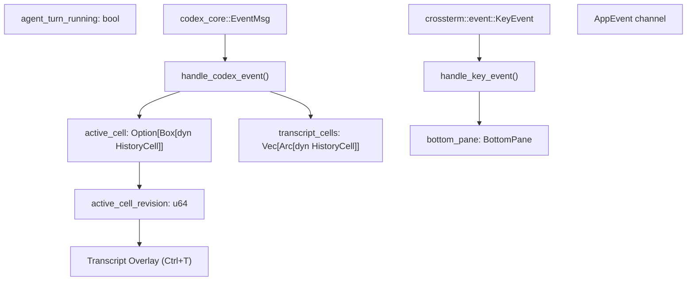
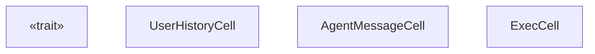

# ChatWidget and Conversation Display

Relevant source files

-   [codex-rs/core/src/codex.rs](https://github.com/openai/codex/blob/d807d44a/codex-rs/core/src/codex.rs)
-   [codex-rs/core/src/rollout/policy.rs](https://github.com/openai/codex/blob/d807d44a/codex-rs/core/src/rollout/policy.rs)
-   [codex-rs/exec/src/event\_processor.rs](https://github.com/openai/codex/blob/d807d44a/codex-rs/exec/src/event_processor.rs)
-   [codex-rs/exec/src/event\_processor\_with\_human\_output.rs](https://github.com/openai/codex/blob/d807d44a/codex-rs/exec/src/event_processor_with_human_output.rs)
-   [codex-rs/mcp-server/src/codex\_tool\_runner.rs](https://github.com/openai/codex/blob/d807d44a/codex-rs/mcp-server/src/codex_tool_runner.rs)
-   [codex-rs/protocol/src/protocol.rs](https://github.com/openai/codex/blob/d807d44a/codex-rs/protocol/src/protocol.rs)
-   [codex-rs/tui/src/app.rs](https://github.com/openai/codex/blob/d807d44a/codex-rs/tui/src/app.rs)
-   [codex-rs/tui/src/app\_backtrack.rs](https://github.com/openai/codex/blob/d807d44a/codex-rs/tui/src/app_backtrack.rs)
-   [codex-rs/tui/src/app\_event.rs](https://github.com/openai/codex/blob/d807d44a/codex-rs/tui/src/app_event.rs)
-   [codex-rs/tui/src/bottom\_pane/app\_link\_view.rs](https://github.com/openai/codex/blob/d807d44a/codex-rs/tui/src/bottom_pane/app_link_view.rs)
-   [codex-rs/tui/src/bottom\_pane/chat\_composer.rs](https://github.com/openai/codex/blob/d807d44a/codex-rs/tui/src/bottom_pane/chat_composer.rs)
-   [codex-rs/tui/src/bottom\_pane/mod.rs](https://github.com/openai/codex/blob/d807d44a/codex-rs/tui/src/bottom_pane/mod.rs)
-   [codex-rs/tui/src/chatwidget.rs](https://github.com/openai/codex/blob/d807d44a/codex-rs/tui/src/chatwidget.rs)
-   [codex-rs/tui/src/chatwidget/snapshots/codex\_tui\_\_chatwidget\_\_tests\_\_deltas\_then\_same\_final\_message\_are\_rendered\_snapshot.snap](https://github.com/openai/codex/blob/d807d44a/codex-rs/tui/src/chatwidget/snapshots/codex_tui__chatwidget__tests__deltas_then_same_final_message_are_rendered_snapshot.snap)
-   [codex-rs/tui/src/chatwidget/snapshots/codex\_tui\_\_chatwidget\_\_tests\_\_final\_reasoning\_then\_message\_without\_deltas\_are\_rendered.snap](https://github.com/openai/codex/blob/d807d44a/codex-rs/tui/src/chatwidget/snapshots/codex_tui__chatwidget__tests__final_reasoning_then_message_without_deltas_are_rendered.snap)
-   [codex-rs/tui/src/chatwidget/snapshots/codex\_tui\_\_chatwidget\_\_tests\_\_unified\_exec\_unknown\_end\_with\_active\_exploring\_cell.snap](https://github.com/openai/codex/blob/d807d44a/codex-rs/tui/src/chatwidget/snapshots/codex_tui__chatwidget__tests__unified_exec_unknown_end_with_active_exploring_cell.snap)
-   [codex-rs/tui/src/chatwidget/snapshots/codex\_tui\_\_chatwidget\_\_tests\_\_user\_shell\_ls\_output.snap](https://github.com/openai/codex/blob/d807d44a/codex-rs/tui/src/chatwidget/snapshots/codex_tui__chatwidget__tests__user_shell_ls_output.snap)
-   [codex-rs/tui/src/chatwidget/tests.rs](https://github.com/openai/codex/blob/d807d44a/codex-rs/tui/src/chatwidget/tests.rs)
-   [codex-rs/tui/src/exec\_cell/model.rs](https://github.com/openai/codex/blob/d807d44a/codex-rs/tui/src/exec_cell/model.rs)
-   [codex-rs/tui/src/exec\_cell/render.rs](https://github.com/openai/codex/blob/d807d44a/codex-rs/tui/src/exec_cell/render.rs)
-   [codex-rs/tui/src/history\_cell.rs](https://github.com/openai/codex/blob/d807d44a/codex-rs/tui/src/history_cell.rs)
-   [codex-rs/tui/src/insert\_history.rs](https://github.com/openai/codex/blob/d807d44a/codex-rs/tui/src/insert_history.rs)
-   [codex-rs/tui/src/markdown.rs](https://github.com/openai/codex/blob/d807d44a/codex-rs/tui/src/markdown.rs)
-   [codex-rs/tui/src/markdown\_render.rs](https://github.com/openai/codex/blob/d807d44a/codex-rs/tui/src/markdown_render.rs)
-   [codex-rs/tui/src/markdown\_render\_tests.rs](https://github.com/openai/codex/blob/d807d44a/codex-rs/tui/src/markdown_render_tests.rs)
-   [codex-rs/tui/src/markdown\_stream.rs](https://github.com/openai/codex/blob/d807d44a/codex-rs/tui/src/markdown_stream.rs)
-   [codex-rs/tui/src/pager\_overlay.rs](https://github.com/openai/codex/blob/d807d44a/codex-rs/tui/src/pager_overlay.rs)
-   [codex-rs/tui/src/render/mod.rs](https://github.com/openai/codex/blob/d807d44a/codex-rs/tui/src/render/mod.rs)
-   [codex-rs/tui/src/render/renderable.rs](https://github.com/openai/codex/blob/d807d44a/codex-rs/tui/src/render/renderable.rs)
-   [codex-rs/tui/src/slash\_command.rs](https://github.com/openai/codex/blob/d807d44a/codex-rs/tui/src/slash_command.rs)
-   [codex-rs/tui/src/snapshots/codex\_tui\_\_markdown\_render\_\_markdown\_render\_tests\_\_markdown\_render\_file\_link\_snapshot.snap](https://github.com/openai/codex/blob/d807d44a/codex-rs/tui/src/snapshots/codex_tui__markdown_render__markdown_render_tests__markdown_render_file_link_snapshot.snap)
-   [codex-rs/tui/src/snapshots/codex\_tui\_\_pager\_overlay\_\_tests\_\_transcript\_overlay\_renders\_live\_tail.snap](https://github.com/openai/codex/blob/d807d44a/codex-rs/tui/src/snapshots/codex_tui__pager_overlay__tests__transcript_overlay_renders_live_tail.snap)
-   [codex-rs/tui/src/snapshots/codex\_tui\_\_pager\_overlay\_\_tests\_\_transcript\_overlay\_snapshot\_basic.snap](https://github.com/openai/codex/blob/d807d44a/codex-rs/tui/src/snapshots/codex_tui__pager_overlay__tests__transcript_overlay_snapshot_basic.snap)
-   [codex-rs/tui/src/streaming/controller.rs](https://github.com/openai/codex/blob/d807d44a/codex-rs/tui/src/streaming/controller.rs)
-   [codex-rs/tui/src/streaming/mod.rs](https://github.com/openai/codex/blob/d807d44a/codex-rs/tui/src/streaming/mod.rs)
-   [codex-rs/tui/src/wrapping.rs](https://github.com/openai/codex/blob/d807d44a/codex-rs/tui/src/wrapping.rs)

## Purpose and Scope

This page documents the `ChatWidget` component, which owns the conversation history display and coordinates the main chat viewport in the TUI. It manages history cells (committed transcript entries), an in-flight active cell for streaming content, and event processing from `codex-core`. For input handling and the composer, see [BottomPane and Input System](/openai/codex/4.1.3-bottompane-and-input-system). For the overall TUI event loop, see [App Event Loop and Initialization](/openai/codex/4.1.1-app-event-loop-and-initialization).

---

## ChatWidget Architecture

### Core Structure

`ChatWidget` is the stateful container for the conversation display. It consumes protocol events, builds and updates history cells, and drives rendering for both the main viewport and overlay UIs [codex-rs/tui/src/chatwidget.rs1-4](https://github.com/openai/codex/blob/d807d44a/codex-rs/tui/src/chatwidget.rs#L1-L4)

**Key Responsibilities:**

-   Maintain committed history cells (finalized `HistoryCell`s) [codex-rs/tui/src/chatwidget.rs6-7](https://github.com/openai/codex/blob/d807d44a/codex-rs/tui/src/chatwidget.rs#L6-L7)
-   Track the in-flight `active_cell` during streaming (often representing a coalesced exec/tool group) [codex-rs/tui/src/chatwidget.rs7-10](https://github.com/openai/codex/blob/d807d44a/codex-rs/tui/src/chatwidget.rs#L7-L10)
-   Process `Event` messages from `codex-core` and translate them into UI state [codex-rs/tui/src/chatwidget.rs1344-1350](https://github.com/openai/codex/blob/d807d44a/codex-rs/tui/src/chatwidget.rs#L1344-L1350)
-   Synchronize "task running" indicators for the bottom pane based on agent turns and MCP startup [codex-rs/tui/src/chatwidget.rs18-22](https://github.com/openai/codex/blob/d807d44a/codex-rs/tui/src/chatwidget.rs#L18-L22)


**Sources:** [codex-rs/tui/src/chatwidget.rs1-22](https://github.com/openai/codex/blob/d807d44a/codex-rs/tui/src/chatwidget.rs#L1-L22) [codex-rs/tui/src/chatwidget.rs515-665](https://github.com/openai/codex/blob/d807d44a/codex-rs/tui/src/chatwidget.rs#L515-L665) [codex-rs/tui/src/app.rs518-584](https://github.com/openai/codex/blob/d807d44a/codex-rs/tui/src/app.rs#L518-L584)

### State Management

The widget maintains several categories of state to manage the conversation lifecycle:

| Category | Fields | Purpose |
| --- | --- | --- |
| **Streaming** | `active_cell`, `active_cell_revision` | In-flight cell and cache invalidation key for overlays [codex-rs/tui/src/chatwidget.rs520-530](https://github.com/openai/codex/blob/d807d44a/codex-rs/tui/src/chatwidget.rs#L520-L530) |
| **History** | Owned by `App.transcript_cells` | Committed conversation history [codex-rs/tui/src/app.rs525-530](https://github.com/openai/codex/blob/d807d44a/codex-rs/tui/src/app.rs#L525-L530) |
| **Input** | `bottom_pane` | Prompt composer and transient view stack [codex-rs/tui/src/chatwidget.rs518-520](https://github.com/openai/codex/blob/d807d44a/codex-rs/tui/src/chatwidget.rs#L518-L520) |
| **Turn State** | `agent_turn_running`, `mcp_startup_status` | Lifecycles tracked independently and synced via `update_task_running_state` [codex-rs/tui/src/chatwidget.rs20-22](https://github.com/openai/codex/blob/d807d44a/codex-rs/tui/src/chatwidget.rs#L20-L22) |
| **Status** | `current_status_header`, `token_info` | Visual indicators for turn progress and token usage [codex-rs/tui/src/chatwidget.rs540-560](https://github.com/openai/codex/blob/d807d44a/codex-rs/tui/src/chatwidget.rs#L540-L560) |

**Sources:** [codex-rs/tui/src/chatwidget.rs1-27](https://github.com/openai/codex/blob/d807d44a/codex-rs/tui/src/chatwidget.rs#L1-L27) [codex-rs/tui/src/chatwidget.rs515-665](https://github.com/openai/codex/blob/d807d44a/codex-rs/tui/src/chatwidget.rs#L515-L665)

---

## History Cell Management

### HistoryCell Trait

All conversation entries implement the `HistoryCell` trait, which defines how a single renderable unit of conversation history behaves [codex-rs/tui/src/history\_cell.rs89-98](https://github.com/openai/codex/blob/d807d44a/codex-rs/tui/src/history_cell.rs#L89-L98)


**Key Methods:**

-   `display_lines`: Returns logical lines for the main chat viewport [codex-rs/tui/src/history\_cell.rs100](https://github.com/openai/codex/blob/d807d44a/codex-rs/tui/src/history_cell.rs#L100-L100)
-   `desired_height`: Measures viewport rows after character wrapping [codex-rs/tui/src/history\_cell.rs109-112](https://github.com/openai/codex/blob/d807d44a/codex-rs/tui/src/history_cell.rs#L109-L112)
-   `transcript_lines`: Lines for the `Ctrl+T` overlay; defaults to `display_lines` [codex-rs/tui/src/history\_cell.rs122-124](https://github.com/openai/codex/blob/d807d44a/codex-rs/tui/src/history_cell.rs#L122-L124)
-   `transcript_animation_tick`: Returns a coarse tick when output is time-dependent (e.g., spinners), signaling the overlay to refresh its cached tail [codex-rs/tui/src/history\_cell.rs165-167](https://github.com/openai/codex/blob/d807d44a/codex-rs/tui/src/history_cell.rs#L165-L167)

**Sources:** [codex-rs/tui/src/history\_cell.rs89-168](https://github.com/openai/codex/blob/d807d44a/codex-rs/tui/src/history_cell.rs#L89-L168)

### Cell Lifecycle

Cells transition from an "active" (streaming) state to a "committed" (history) state.

> **[Mermaid sequence]**
> *(图表结构无法解析)*

**Sources:** [codex-rs/tui/src/chatwidget.rs6-16](https://github.com/openai/codex/blob/d807d44a/codex-rs/tui/src/chatwidget.rs#L6-L16) [codex-rs/tui/src/chatwidget.rs1500-1550](https://github.com/openai/codex/blob/d807d44a/codex-rs/tui/src/chatwidget.rs#L1500-L1550) [codex-rs/tui/src/app.rs1227-1260](https://github.com/openai/codex/blob/d807d44a/codex-rs/tui/src/app.rs#L1227-L1260)

---

## Active Cell Streaming

### Streaming Model

The `active_cell` allows for in-place mutation of streaming content. This is particularly important for `ExecCell`, which coalesces multiple tool calls into a single UI block [codex-rs/tui/src/chatwidget.rs6-10](https://github.com/openai/codex/blob/d807d44a/codex-rs/tui/src/chatwidget.rs#L6-L10)

**Design:**

-   **In-place Mutation**: `active_cell` is an `Option<Box<dyn HistoryCell>>` that is updated as deltas arrive [codex-rs/tui/src/chatwidget.rs520](https://github.com/openai/codex/blob/d807d44a/codex-rs/tui/src/chatwidget.rs#L520-L520)
-   **Revision Tracking**: `active_cell_revision` is incremented whenever the cell mutates, acting as a cache invalidation key for overlays [codex-rs/tui/src/chatwidget.rs12-16](https://github.com/openai/codex/blob/d807d44a/codex-rs/tui/src/chatwidget.rs#L12-L16)
-   **Commentary Handling**: For preamble-capable models, the status row is hidden during commentary streaming to avoid visual noise [codex-rs/tui/src/chatwidget.rs24-27](https://github.com/openai/codex/blob/d807d44a/codex-rs/tui/src/chatwidget.rs#L24-L27)

**Sources:** [codex-rs/tui/src/chatwidget.rs6-27](https://github.com/openai/codex/blob/d807d44a/codex-rs/tui/src/chatwidget.rs#L6-L27) [codex-rs/tui/src/chatwidget.rs520-530](https://github.com/openai/codex/blob/d807d44a/codex-rs/tui/src/chatwidget.rs#L520-L530)

### Streaming and Cache Invalidation

The transcript overlay (`Ctrl+T`) renders committed cells plus a cached "live tail" derived from the current active cell [codex-rs/tui/src/chatwidget.rs8-10](https://github.com/openai/codex/blob/d807d44a/codex-rs/tui/src/chatwidget.rs#L8-L10)

```
// From chatwidget.rspub(crate) struct ActiveCellTranscriptKey {    pub(crate) revision: u64,    pub(crate) is_stream_continuation: bool,    pub(crate) animation_tick: Option<u64>,}
```
The cache key is designed to change when the active cell mutates or when its output is time-dependent (e.g., an active tool spinner) [codex-rs/tui/src/chatwidget.rs14-16](https://github.com/openai/codex/blob/d807d44a/codex-rs/tui/src/chatwidget.rs#L14-L16)

**Sources:** [codex-rs/tui/src/chatwidget.rs8-16](https://github.com/openai/codex/blob/d807d44a/codex-rs/tui/src/chatwidget.rs#L8-L16) [codex-rs/tui/src/chatwidget.rs667-690](https://github.com/openai/codex/blob/d807d44a/codex-rs/tui/src/chatwidget.rs#L667-L690)

---

## Event Processing

### handle\_codex\_event

This function is the main entry point for protocol events. It dispatches `EventMsg` variants to specific handlers that update the widget state [codex-rs/tui/src/chatwidget.rs1344-1350](https://github.com/openai/codex/blob/d807d44a/codex-rs/tui/src/chatwidget.rs#L1344-L1350)

| Event Variant | Handler Action |
| --- | --- |
| `AgentMessageDelta` | Appends text to `AgentMessageCell` in `active_cell` [codex-rs/tui/src/chatwidget.rs1515-1530](https://github.com/openai/codex/blob/d807d44a/codex-rs/tui/src/chatwidget.rs#L1515-L1530) |
| `ExecCommandBegin` | Initializes or adds a call to an `ExecCell` in `active_cell` [codex-rs/tui/src/chatwidget.rs1640-1660](https://github.com/openai/codex/blob/d807d44a/codex-rs/tui/src/chatwidget.rs#L1640-L1660) |
| `McpToolCallBegin` | Creates an `McpToolCallCell` in `active_cell` [codex-rs/tui/src/chatwidget.rs1720-1740](https://github.com/openai/codex/blob/d807d44a/codex-rs/tui/src/chatwidget.rs#L1720-L1740) |
| `TurnComplete` | Takes the `active_cell` and emits `AppEvent::InsertHistoryCell` to commit it [codex-rs/tui/src/chatwidget.rs1880-1900](https://github.com/openai/codex/blob/d807d44a/codex-rs/tui/src/chatwidget.rs#L1880-L1900) |
| `ErrorEvent` | Creates a `PlainHistoryCell` with error details and commits it immediately [codex-rs/tui/src/chatwidget.rs1450-1470](https://github.com/openai/codex/blob/d807d44a/codex-rs/tui/src/chatwidget.rs#L1450-L1470) |

**Sources:** [codex-rs/tui/src/chatwidget.rs1344-1900](https://github.com/openai/codex/blob/d807d44a/codex-rs/tui/src/chatwidget.rs#L1344-L1900) [codex-rs/protocol/src/protocol.rs178-250](https://github.com/openai/codex/blob/d807d44a/codex-rs/protocol/src/protocol.rs#L178-L250)

---

## Transcript Overlay

The transcript overlay is kept in sync by `App::overlay_forward_event` [codex-rs/tui/src/chatwidget.rs12](https://github.com/openai/codex/blob/d807d44a/codex-rs/tui/src/chatwidget.rs#L12-L12) It uses the following mechanism:

1.  **Live Tail Sync**: During draws, it derives a live tail from the current active cell using `active_cell_transcript_lines()` [codex-rs/tui/src/chatwidget.rs13](https://github.com/openai/codex/blob/d807d44a/codex-rs/tui/src/chatwidget.rs#L13-L13)
2.  **Cached Rendering**: To avoid rebuilding the entire tail on every draw, it checks the `ActiveCellTranscriptKey` [codex-rs/tui/src/chatwidget.rs14-16](https://github.com/openai/codex/blob/d807d44a/codex-rs/tui/src/chatwidget.rs#L14-L16)
3.  **Animation Support**: If a cell (like `ExecCell`) has a time-dependent component, `transcript_animation_tick()` ensures the overlay refreshes even if no new protocol data has arrived [codex-rs/tui/src/history\_cell.rs165-168](https://github.com/openai/codex/blob/d807d44a/codex-rs/tui/src/history_cell.rs#L165-L168)

**Sources:** [codex-rs/tui/src/chatwidget.rs8-17](https://github.com/openai/codex/blob/d807d44a/codex-rs/tui/src/chatwidget.rs#L8-L17) [codex-rs/tui/src/history\_cell.rs165-168](https://github.com/openai/codex/blob/d807d44a/codex-rs/tui/src/history_cell.rs#L165-L168)

---

## Key Event Handling

`ChatWidget` coordinates input routing. High-level intents (interrupt, quit) are handled here, while editing is delegated to the `BottomPane` [codex-rs/tui/src/bottom\_pane/mod.rs7-12](https://github.com/openai/codex/blob/d807d44a/codex-rs/tui/src/bottom_pane/mod.rs#L7-L12)

-   **Interrupt**: Handled by checking `agent_turn_running` and emitting an `Op::Interrupt` [codex-rs/tui/src/chatwidget.rs18-20](https://github.com/openai/codex/blob/d807d44a/codex-rs/tui/src/chatwidget.rs#L18-L20)
-   **Quit**: Manages the "press again to quit" hint lifecycle [codex-rs/tui/src/bottom\_pane/mod.rs14-15](https://github.com/openai/codex/blob/d807d44a/codex-rs/tui/src/bottom_pane/mod.rs#L14-L15)
-   **View Stack**: The `BottomPane` manages a stack of `BottomPaneView`s (popups/modals) that temporarily replace the composer [codex-rs/tui/src/bottom\_pane/mod.rs3-5](https://github.com/openai/codex/blob/d807d44a/codex-rs/tui/src/bottom_pane/mod.rs#L3-L5)

**Sources:** [codex-rs/tui/src/chatwidget.rs18-22](https://github.com/openai/codex/blob/d807d44a/codex-rs/tui/src/chatwidget.rs#L18-L22) [codex-rs/tui/src/bottom\_pane/mod.rs1-15](https://github.com/openai/codex/blob/d807d44a/codex-rs/tui/src/bottom_pane/mod.rs#L1-L15)
