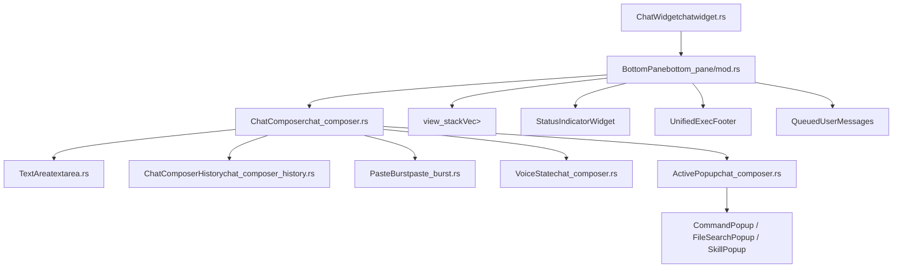
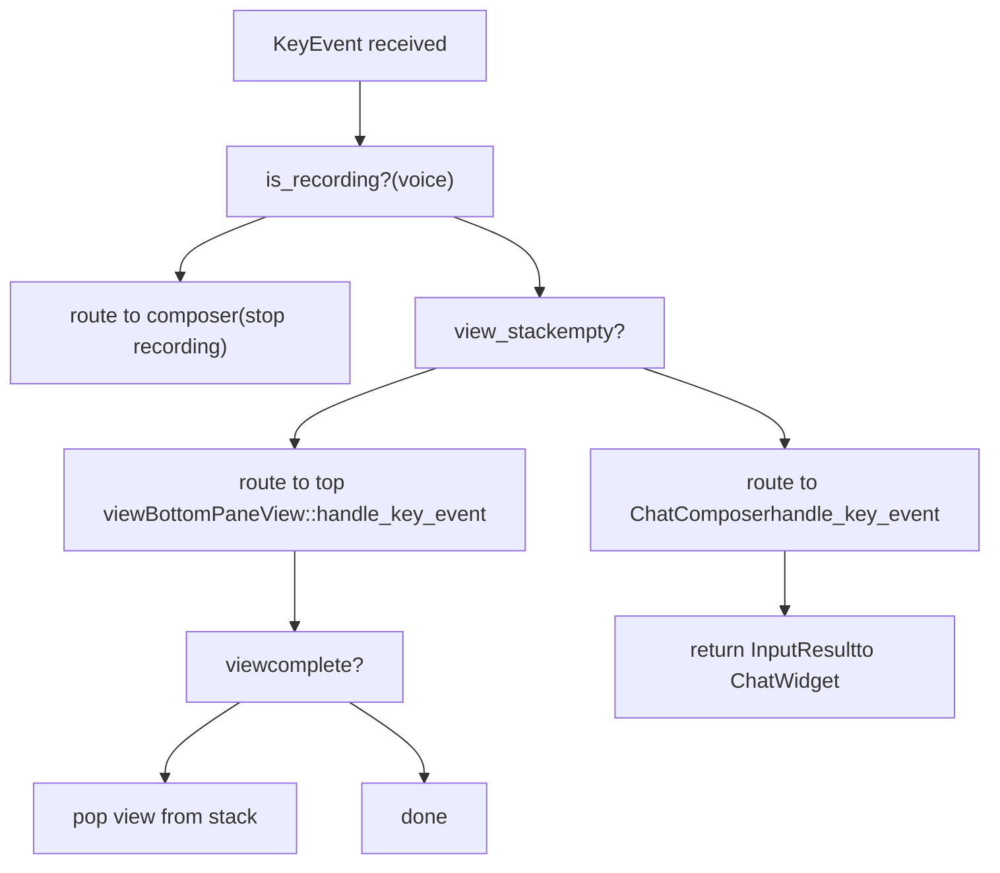
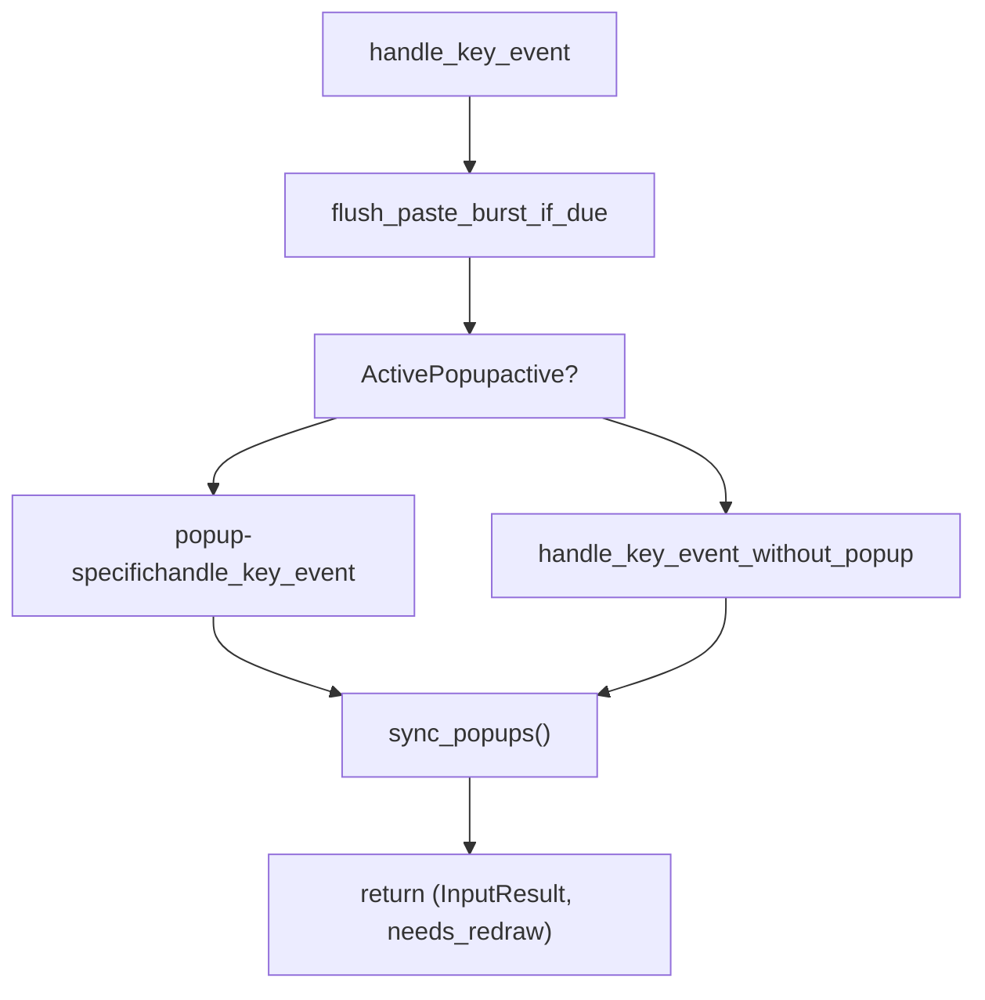
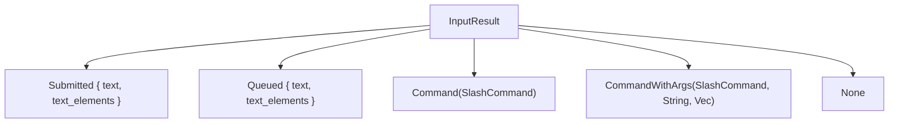
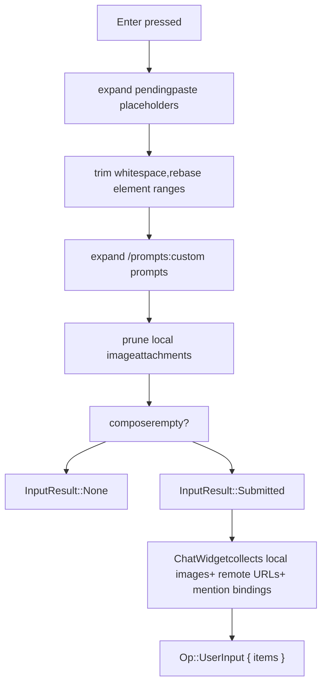

# BottomPane and Input System

Relevant source files

-   [codex-rs/core/src/codex.rs](https://github.com/openai/codex/blob/d807d44a/codex-rs/core/src/codex.rs)
-   [codex-rs/core/src/rollout/policy.rs](https://github.com/openai/codex/blob/d807d44a/codex-rs/core/src/rollout/policy.rs)
-   [codex-rs/exec/src/event\_processor.rs](https://github.com/openai/codex/blob/d807d44a/codex-rs/exec/src/event_processor.rs)
-   [codex-rs/exec/src/event\_processor\_with\_human\_output.rs](https://github.com/openai/codex/blob/d807d44a/codex-rs/exec/src/event_processor_with_human_output.rs)
-   [codex-rs/mcp-server/src/codex\_tool\_runner.rs](https://github.com/openai/codex/blob/d807d44a/codex-rs/mcp-server/src/codex_tool_runner.rs)
-   [codex-rs/protocol/src/protocol.rs](https://github.com/openai/codex/blob/d807d44a/codex-rs/protocol/src/protocol.rs)
-   [codex-rs/tui/src/app.rs](https://github.com/openai/codex/blob/d807d44a/codex-rs/tui/src/app.rs)
-   [codex-rs/tui/src/app\_event.rs](https://github.com/openai/codex/blob/d807d44a/codex-rs/tui/src/app_event.rs)
-   [codex-rs/tui/src/bottom\_pane/chat\_composer.rs](https://github.com/openai/codex/blob/d807d44a/codex-rs/tui/src/bottom_pane/chat_composer.rs)
-   [codex-rs/tui/src/bottom\_pane/command\_popup.rs](https://github.com/openai/codex/blob/d807d44a/codex-rs/tui/src/bottom_pane/command_popup.rs)
-   [codex-rs/tui/src/bottom\_pane/file\_search\_popup.rs](https://github.com/openai/codex/blob/d807d44a/codex-rs/tui/src/bottom_pane/file_search_popup.rs)
-   [codex-rs/tui/src/bottom\_pane/footer.rs](https://github.com/openai/codex/blob/d807d44a/codex-rs/tui/src/bottom_pane/footer.rs)
-   [codex-rs/tui/src/bottom\_pane/list\_selection\_view.rs](https://github.com/openai/codex/blob/d807d44a/codex-rs/tui/src/bottom_pane/list_selection_view.rs)
-   [codex-rs/tui/src/bottom\_pane/mod.rs](https://github.com/openai/codex/blob/d807d44a/codex-rs/tui/src/bottom_pane/mod.rs)
-   [codex-rs/tui/src/bottom\_pane/selection\_popup\_common.rs](https://github.com/openai/codex/blob/d807d44a/codex-rs/tui/src/bottom_pane/selection_popup_common.rs)
-   [codex-rs/tui/src/bottom\_pane/skill\_popup.rs](https://github.com/openai/codex/blob/d807d44a/codex-rs/tui/src/bottom_pane/skill_popup.rs)
-   [codex-rs/tui/src/bottom\_pane/slash\_commands.rs](https://github.com/openai/codex/blob/d807d44a/codex-rs/tui/src/bottom_pane/slash_commands.rs)
-   [codex-rs/tui/src/bottom\_pane/snapshots/codex\_tui\_\_bottom\_pane\_\_chat\_composer\_\_tests\_\_footer\_mode\_shortcut\_overlay.snap](https://github.com/openai/codex/blob/d807d44a/codex-rs/tui/src/bottom_pane/snapshots/codex_tui__bottom_pane__chat_composer__tests__footer_mode_shortcut_overlay.snap)
-   [codex-rs/tui/src/bottom\_pane/snapshots/codex\_tui\_\_bottom\_pane\_\_chat\_composer\_\_tests\_\_mention\_popup\_type\_prefixes.snap](https://github.com/openai/codex/blob/d807d44a/codex-rs/tui/src/bottom_pane/snapshots/codex_tui__bottom_pane__chat_composer__tests__mention_popup_type_prefixes.snap)
-   [codex-rs/tui/src/bottom\_pane/snapshots/codex\_tui\_\_bottom\_pane\_\_chat\_composer\_\_tests\_\_plugin\_mention\_popup.snap](https://github.com/openai/codex/blob/d807d44a/codex-rs/tui/src/bottom_pane/snapshots/codex_tui__bottom_pane__chat_composer__tests__plugin_mention_popup.snap)
-   [codex-rs/tui/src/bottom\_pane/snapshots/codex\_tui\_\_bottom\_pane\_\_footer\_\_tests\_\_footer\_ctrl\_c\_quit\_idle.snap](https://github.com/openai/codex/blob/d807d44a/codex-rs/tui/src/bottom_pane/snapshots/codex_tui__bottom_pane__footer__tests__footer_ctrl_c_quit_idle.snap)
-   [codex-rs/tui/src/bottom\_pane/snapshots/codex\_tui\_\_bottom\_pane\_\_footer\_\_tests\_\_footer\_ctrl\_c\_quit\_running.snap](https://github.com/openai/codex/blob/d807d44a/codex-rs/tui/src/bottom_pane/snapshots/codex_tui__bottom_pane__footer__tests__footer_ctrl_c_quit_running.snap)
-   [codex-rs/tui/src/bottom\_pane/snapshots/codex\_tui\_\_bottom\_pane\_\_footer\_\_tests\_\_footer\_shortcuts\_default.snap](https://github.com/openai/codex/blob/d807d44a/codex-rs/tui/src/bottom_pane/snapshots/codex_tui__bottom_pane__footer__tests__footer_shortcuts_default.snap)
-   [codex-rs/tui/src/bottom\_pane/snapshots/codex\_tui\_\_bottom\_pane\_\_footer\_\_tests\_\_footer\_shortcuts\_shift\_and\_esc.snap](https://github.com/openai/codex/blob/d807d44a/codex-rs/tui/src/bottom_pane/snapshots/codex_tui__bottom_pane__footer__tests__footer_shortcuts_shift_and_esc.snap)
-   [codex-rs/tui/src/chatwidget.rs](https://github.com/openai/codex/blob/d807d44a/codex-rs/tui/src/chatwidget.rs)
-   [codex-rs/tui/src/chatwidget/tests.rs](https://github.com/openai/codex/blob/d807d44a/codex-rs/tui/src/chatwidget/tests.rs)
-   [codex-rs/tui/src/clipboard\_paste.rs](https://github.com/openai/codex/blob/d807d44a/codex-rs/tui/src/clipboard_paste.rs)
-   [codex-rs/tui/src/history\_cell.rs](https://github.com/openai/codex/blob/d807d44a/codex-rs/tui/src/history_cell.rs)
-   [codex-rs/tui/src/key\_hint.rs](https://github.com/openai/codex/blob/d807d44a/codex-rs/tui/src/key_hint.rs)
-   [codex-rs/tui/src/slash\_command.rs](https://github.com/openai/codex/blob/d807d44a/codex-rs/tui/src/slash_command.rs)
-   [codex-rs/tui/src/snapshots/codex\_tui\_\_status\_indicator\_widget\_\_tests\_\_renders\_with\_queued\_messages@macos.snap](https://github.com/openai/codex/blob/d807d44a/codex-rs/tui/src/snapshots/codex_tui__status_indicator_widget__tests__renders_with_queued_messages@macos.snap)
-   [codex-rs/tui\_app\_server/src/bottom\_pane/chat\_composer.rs](https://github.com/openai/codex/blob/d807d44a/codex-rs/tui_app_server/src/bottom_pane/chat_composer.rs)
-   [codex-rs/tui\_app\_server/src/bottom\_pane/command\_popup.rs](https://github.com/openai/codex/blob/d807d44a/codex-rs/tui_app_server/src/bottom_pane/command_popup.rs)
-   [codex-rs/tui\_app\_server/src/bottom\_pane/mod.rs](https://github.com/openai/codex/blob/d807d44a/codex-rs/tui_app_server/src/bottom_pane/mod.rs)
-   [codex-rs/tui\_app\_server/src/bottom\_pane/slash\_commands.rs](https://github.com/openai/codex/blob/d807d44a/codex-rs/tui_app_server/src/bottom_pane/slash_commands.rs)

This page covers the interactive input layer at the bottom of the Codex TUI: the `BottomPane` container, the `ChatComposer` text-input state machine, the `TextArea` editing buffer, slash command routing, and the `BottomPaneView` overlay stack. It does not cover the conversation history display above the input area (see page [4.1.2](https://github.com/openai/codex/blob/d807d44a/4.1.2)) or the status line rendering (see page [4.1.4](https://github.com/openai/codex/blob/d807d44a/4.1.4)).

---

## Component Hierarchy

The bottom pane is a composable stack. `ChatWidget` owns one `BottomPane`, which in turn owns the `ChatComposer` and a view stack for transient overlays.

**Component ownership and key types diagram:**

Sources: [codex-rs/tui/src/bottom\_pane/mod.rs161-185](https://github.com/openai/codex/blob/d807d44a/codex-rs/tui/src/bottom_pane/mod.rs#L161-L185) [codex-rs/tui/src/bottom\_pane/chat\_composer.rs349-409](https://github.com/openai/codex/blob/d807d44a/codex-rs/tui/src/bottom_pane/chat_composer.rs#L349-L409)

---

## BottomPane

`BottomPane` is declared in [codex-rs/tui/src/bottom\_pane/mod.rs161-185](https://github.com/openai/codex/blob/d807d44a/codex-rs/tui/src/bottom_pane/mod.rs#L161-L185)

### Fields

| Field | Type | Purpose |
| --- | --- | --- |
| `composer` | `ChatComposer` | Retained even when a view is active so draft state is preserved |
| `view_stack` | `Vec<Box<dyn BottomPaneView>>` | Stack of transient overlays/modals |
| `status` | `Option<StatusIndicatorWidget>` | Inline status row shown while a task is running |
| `unified_exec_footer` | `UnifiedExecFooter` | Shows unified exec session summary |
| `queued_user_messages` | `QueuedUserMessages` | Shows messages queued during a running turn |
| `pending_thread_approvals` | `PendingThreadApprovals` | Inactive threads with pending approval requests |
| `is_task_running` | `bool` | Controls spinner and interrupt hints |
| `context_window_percent` | `Option<i64>` | Forwarded to composer for footer display |

### Key Event Routing

`BottomPane::handle_key_event` [codex-rs/tui/src/bottom\_pane/mod.rs352-420](https://github.com/openai/codex/blob/d807d44a/codex-rs/tui/src/bottom_pane/mod.rs#L352-L420) routes input in this priority order:

The `CancellationEvent` enum (`Handled` | `NotHandled`) signals to the parent whether a `Ctrl+C` was consumed locally. If the view didn't handle it, `ChatWidget` decides whether it means interrupt or quit.

Sources: [codex-rs/tui/src/bottom\_pane/mod.rs137-142](https://github.com/openai/codex/blob/d807d44a/codex-rs/tui/src/bottom_pane/mod.rs#L137-L142) [codex-rs/tui/src/bottom\_pane/mod.rs352-420](https://github.com/openai/codex/blob/d807d44a/codex-rs/tui/src/bottom_pane/mod.rs#L352-L420)

---

## ChatComposer

`ChatComposer` [codex-rs/tui/src/bottom\_pane/chat\_composer.rs349-409](https://github.com/openai/codex/blob/d807d44a/codex-rs/tui/src/bottom_pane/chat_composer.rs#L349-L409) is the main input state machine. It handles:

-   Editing the `TextArea` buffer with placeholder elements (attachments, mentions)
-   Routing keys to the active popup (slash commands, file search, skills)
-   Promoting typed slash commands into atomic elements when the command name is completed
-   Enter (submit) vs. Tab (queue) vs. Shift+Enter (newline)
-   Non-bracketed paste burst detection via `PasteBurst`
-   Voice hold-to-talk via `VoiceState`

### ChatComposerConfig

`ChatComposerConfig` [codex-rs/tui/src/bottom\_pane/chat\_composer.rs288-319](https://github.com/openai/codex/blob/d807d44a/codex-rs/tui/src/bottom_pane/chat_composer.rs#L288-L319) gates optional behaviors:

| Flag | Default | Effect when `false` |
| --- | --- | --- |
| `popups_enabled` | `true` | `sync_popups()` forces `ActivePopup::None` |
| `slash_commands_enabled` | `true` | `/...` input is not parsed as commands; custom prompt expansion is skipped |
| `image_paste_enabled` | `true` | File-path paste image attachment is skipped |

The static constructor `ChatComposerConfig::plain_text()` disables all three, making the composer a simple text field for embedding in other surfaces.

### ActivePopup State Machine

At most one popup can be active at any time:

> **[Mermaid stateDiagram]**
> *(图表结构无法解析)*

After every handled key, `sync_popups()` [codex-rs/tui/src/bottom\_pane/chat\_composer.rs1260-1380](https://github.com/openai/codex/blob/d807d44a/codex-rs/tui/src/bottom_pane/chat_composer.rs#L1260-L1380) re-evaluates which popup should be visible based on the current buffer text and cursor position.

### Key Event Routing Inside ChatComposer

Sources: [codex-rs/tui/src/bottom\_pane/chat\_composer.rs12-18](https://github.com/openai/codex/blob/d807d44a/codex-rs/tui/src/bottom_pane/chat_composer.rs#L12-L18) [codex-rs/tui/src/bottom\_pane/chat\_composer.rs650-750](https://github.com/openai/codex/blob/d807d44a/codex-rs/tui/src/bottom_pane/chat_composer.rs#L650-L750)

---

## TextArea

`TextArea` is declared in [codex-rs/tui/src/bottom\_pane/textarea.rs62-70](https://github.com/openai/codex/blob/d807d44a/codex-rs/tui/src/bottom_pane/textarea.rs#L62-L70)

### Core Fields

| Field | Type | Purpose |
| --- | --- | --- |
| `text` | `String` | Raw UTF-8 buffer |
| `cursor_pos` | `usize` | Byte offset of the cursor |
| `elements` | `Vec<TextElement>` | Ranges marking placeholder spans that edit atomically |
| `kill_buffer` | `String` | Single-entry kill ring for `Ctrl+K`/`Ctrl+Y` |
| `wrap_cache` | `RefCell<Option<WrapCache>>` | Cached line-wrap state invalidated on edits |
| `preferred_col` | `Option<usize>` | Sticky column for vertical cursor movement |

### Text Elements

`TextElement` [codex-rs/protocol/src/user\_input.rs25-30](https://github.com/openai/codex/blob/d807d44a/codex-rs/protocol/src/user_input.rs#L25-L30) (aliased in [codex-rs/tui/src/bottom\_pane/textarea.rs39-44](https://github.com/openai/codex/blob/d807d44a/codex-rs/tui/src/bottom_pane/textarea.rs#L39-L44)) is an internal span `(id, range, name)` that represents a placeholder like `[Image #1]` or a slash command token. The invariants enforced by `TextArea`:

-   The cursor cannot rest inside an element boundary; it snaps to the nearest valid boundary.
-   `replace_range` expands the edit to fully cover any overlapping element.
-   `shift_elements` adjusts all element ranges after any insertion or deletion.

### Kill Buffer

`Ctrl+K` (kill-to-end-of-line) stores the killed span in `kill_buffer`. `Ctrl+Y` (yank) reinserts it. The kill buffer intentionally **survives** whole-buffer replacements via `set_text_clearing_elements` and `set_text_with_elements`, so flows like submit → change setting → yank-back-draft work correctly.

### Key Editing Bindings

| Binding | Action |
| --- | --- |
| `Ctrl+K` | Kill to end of line → kill buffer |
| `Ctrl+Y` | Yank kill buffer at cursor |
| `Ctrl+A` / `Home` | Beginning of line |
| `Ctrl+E` / `End` | End of line |
| `Ctrl+W` / `Alt+Backspace` | Delete word backward |
| `Alt+D` | Delete word forward |
| `Ctrl+Left` / `Alt+Left` | Word backward |
| `Ctrl+Right` / `Alt+Right` | Word forward |

Sources: [codex-rs/tui/src/bottom\_pane/textarea.rs62-70](https://github.com/openai/codex/blob/d807d44a/codex-rs/tui/src/bottom_pane/textarea.rs#L62-L70) [codex-rs/tui/src/bottom\_pane/textarea.rs84-200](https://github.com/openai/codex/blob/d807d44a/codex-rs/tui/src/bottom_pane/textarea.rs#L84-L200)

---

## Slash Command System

### SlashCommand Enum

`SlashCommand` [codex-rs/tui/src/slash\_command.rs12-67](https://github.com/openai/codex/blob/d807d44a/codex-rs/tui/src/slash_command.rs#L12-L67) is a `strum`\-derived enum. The variant declaration order is the presentation order in the popup (most-used first).

Selected variants and their routing:

| Variant | Command | Description |
| --- | --- | --- |
| `Model` | `/model` | Choose model and reasoning effort |
| `Approvals` | `/approvals` | Choose what Codex is allowed to do |
| `Review` | `/review` | Review current changes and find issues |
| `Plan` | `/plan` | Switch to Plan mode |
| `Rename` | `/rename` | Rename the current thread |
| `Resume` | `/resume` | Resume a saved chat |
| `Fork` | `/fork` | Fork the current chat |
| `Compact` | `/compact` | Summarize conversation to prevent hitting context limit |
| `Status` | `/status` | Show current session configuration and token usage |
| `Diff` | `/diff` | Show git diff (including untracked files) |
| `Copy` | `/copy` | Copy the latest Codex output to clipboard |
| `Quit` / `Exit` | `/quit` | Exit Codex |

`supports_inline_args()` [codex-rs/tui/src/slash\_command.rs128-137](https://github.com/openai/codex/blob/d807d44a/codex-rs/tui/src/slash_command.rs#L128-L137) returns `true` for commands like `/review` or `/rename`. `available_during_task()` [codex-rs/tui/src/slash\_command.rs140-185](https://github.com/openai/codex/blob/d807d44a/codex-rs/tui/src/slash_command.rs#L140-L185) governs whether the command can fire while an agent turn is in progress.

### InputResult

`InputResult` [codex-rs/tui/src/bottom\_pane/chat\_composer.rs247-259](https://github.com/openai/codex/blob/d807d44a/codex-rs/tui/src/bottom_pane/chat_composer.rs#L247-L259) is the return type from `ChatComposer::handle_key_event` and propagates upward to `ChatWidget`:

-   `Submitted` → `ChatWidget` constructs an `Op::UserInput` and forwards it to core.
-   `Queued` → `ChatWidget` holds the message for later submission (Tab while task is running).
-   `Command` / `CommandWithArgs` → `ChatWidget` handles the slash action.

Sources: [codex-rs/tui/src/slash\_command.rs12-185](https://github.com/openai/codex/blob/d807d44a/codex-rs/tui/src/slash_command.rs#L12-L185) [codex-rs/tui/src/bottom\_pane/chat\_composer.rs247-259](https://github.com/openai/codex/blob/d807d44a/codex-rs/tui/src/bottom_pane/chat_composer.rs#L247-L259)

---

## Submission Flow

**Tab while task is running** follows the same preparation path but returns `InputResult::Queued` instead of `Submitted`. If no task is running, Tab behaves like Enter (except for `!` shell commands).

Sources: [codex-rs/tui/src/bottom\_pane/chat\_composer.rs32-55](https://github.com/openai/codex/blob/d807d44a/codex-rs/tui/src/bottom_pane/chat_composer.rs#L32-L55) [codex-rs/tui/src/bottom\_pane/chat\_composer.rs900-1050](https://github.com/openai/codex/blob/d807d44a/codex-rs/tui/src/bottom_pane/chat_composer.rs#L900-L1050)

---

## History Navigation (ChatComposerHistory)

`ChatComposerHistory` [codex-rs/tui/src/bottom\_pane/chat\_composer\_history.rs87-110](https://github.com/openai/codex/blob/d807d44a/codex-rs/tui/src/bottom_pane/chat_composer_history.rs#L87-L110) manages shell-style Up/Down recall.

### Two History Sources

| Source | Storage | What Is Preserved |
| --- | --- | --- |
| **Persistent** | `~/.codex/history.jsonl` | Text only |
| **Local** | In-memory `local_history` | Full draft: text, `TextElement` ranges, local image paths, remote image URLs |

Recalling a persistent entry only restores text. Recalling a local entry (`HistoryEntry` [codex-rs/tui/src/bottom\_pane/chat\_composer\_history.rs13-26](https://github.com/openai/codex/blob/d807d44a/codex-rs/tui/src/bottom_pane/chat_composer_history.rs#L13-L26)) rehydrates all attachment state.

Sources: [codex-rs/tui/src/bottom\_pane/chat\_composer\_history.rs13-110](https://github.com/openai/codex/blob/d807d44a/codex-rs/tui/src/bottom_pane/chat_composer_history.rs#L13-L110)

---

## Paste Burst Detection (PasteBurst)

On terminals without bracketed paste (notably Windows), multi-line pastes arrive as a stream of `KeyCode::Char` and `KeyCode::Enter` events. `PasteBurst` [codex-rs/tui/src/bottom\_pane/paste\_burst.rs](https://github.com/openai/codex/blob/d807d44a/codex-rs/tui/src/bottom_pane/paste_burst.rs) detects and buffers these.

### State Machine

Sources: [codex-rs/tui/src/bottom\_pane/paste\_burst.rs1-147](https://github.com/openai/codex/blob/d807d44a/codex-rs/tui/src/bottom_pane/paste_burst.rs#L1-L147) [codex-rs/tui/src/bottom\_pane/chat\_composer.rs75-96](https://github.com/openai/codex/blob/d807d44a/codex-rs/tui/src/bottom_pane/chat_composer.rs#L75-L96)

---

## BottomPaneView Overlay Stack

`BottomPaneView` is a trait implemented by all transient overlays. The `view_stack` in `BottomPane` holds a `Vec<Box<dyn BottomPaneView>>`.

### Known View Implementations

| Type | File | Purpose |
| --- | --- | --- |
| `ApprovalOverlay` | `approval_overlay.rs` | Exec/patch approval prompts |
| `RequestUserInputOverlay` | `request_user_input.rs` | Agent-requested text prompts |
| `AppLinkView` | `app_link_view.rs` | App connector link info |
| `ListSelectionView` | `list_selection_view.rs` | Generic selection list |
| `ExperimentalFeaturesView` | `experimental_features_view.rs` | Feature flag toggles |
| `SkillsToggleView` | `skills_toggle_view.rs` | Enable/disable skills |

Sources: [codex-rs/tui/src/bottom\_pane/mod.rs29-61](https://github.com/openai/codex/blob/d807d44a/codex-rs/tui/src/bottom_pane/mod.rs#L29-L61) [codex-rs/tui/src/bottom\_pane/mod.rs161-185](https://github.com/openai/codex/blob/d807d44a/codex-rs/tui/src/bottom_pane/mod.rs#L161-L185)

---

## Quit / Interrupt Routing

Quit shortcut behavior is shared between `BottomPane` and `ChatWidget`:

-   `QUIT_SHORTCUT_TIMEOUT` [codex-rs/tui/src/bottom\_pane/mod.rs125](https://github.com/openai/codex/blob/d807d44a/codex-rs/tui/src/bottom_pane/mod.rs#L125-L125) = 1 second. The "press again to quit" hint expires after this duration.
-   `DOUBLE_PRESS_QUIT_SHORTCUT_ENABLED` [codex-rs/tui/src/bottom\_pane/mod.rs130](https://github.com/openai/codex/blob/d807d44a/codex-rs/tui/src/bottom_pane/mod.rs#L130-L130) is currently `false` (single press exits).
-   `ChatWidget` handles the higher-level logic of mapping `Ctrl+C` to an interrupt (if a task is running) or a quit (if idle).

Sources: [codex-rs/tui/src/bottom\_pane/mod.rs112-130](https://github.com/openai/codex/blob/d807d44a/codex-rs/tui/src/bottom_pane/mod.rs#L112-L130) [codex-rs/tui/src/app.rs168-178](https://github.com/openai/codex/blob/d807d44a/codex-rs/tui/src/app.rs#L168-L178)
