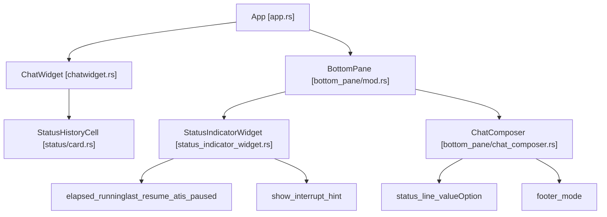
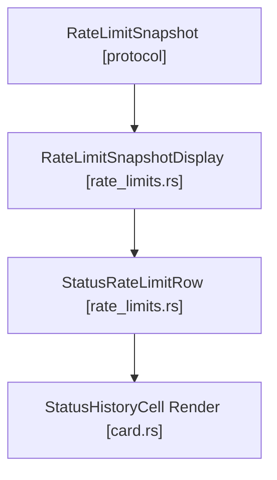

# Status Line and Footer Rendering

Relevant source files

-   [codex-rs/tui/src/bottom\_pane/bottom\_pane\_view.rs](https://github.com/openai/codex/blob/d807d44a/codex-rs/tui/src/bottom_pane/bottom_pane_view.rs)
-   [codex-rs/tui/src/bottom\_pane/multi\_select\_picker.rs](https://github.com/openai/codex/blob/d807d44a/codex-rs/tui/src/bottom_pane/multi_select_picker.rs)
-   [codex-rs/tui/src/bottom\_pane/snapshots/codex\_tui\_\_bottom\_pane\_\_tests\_\_status\_and\_composer\_fill\_height\_without\_bottom\_padding.snap](https://github.com/openai/codex/blob/d807d44a/codex-rs/tui/src/bottom_pane/snapshots/codex_tui__bottom_pane__tests__status_and_composer_fill_height_without_bottom_padding.snap)
-   [codex-rs/tui/src/bottom\_pane/snapshots/codex\_tui\_\_bottom\_pane\_\_tests\_\_status\_hidden\_when\_height\_too\_small\_height\_1.snap](https://github.com/openai/codex/blob/d807d44a/codex-rs/tui/src/bottom_pane/snapshots/codex_tui__bottom_pane__tests__status_hidden_when_height_too_small_height_1.snap)
-   [codex-rs/tui/src/chatwidget/snapshots/codex\_tui\_\_chatwidget\_\_tests\_\_chat\_small\_idle\_h3.snap](https://github.com/openai/codex/blob/d807d44a/codex-rs/tui/src/chatwidget/snapshots/codex_tui__chatwidget__tests__chat_small_idle_h3.snap)
-   [codex-rs/tui/src/chatwidget/snapshots/codex\_tui\_\_chatwidget\_\_tests\_\_chat\_small\_running\_h2.snap](https://github.com/openai/codex/blob/d807d44a/codex-rs/tui/src/chatwidget/snapshots/codex_tui__chatwidget__tests__chat_small_running_h2.snap)
-   [codex-rs/tui/src/chatwidget/snapshots/codex\_tui\_\_chatwidget\_\_tests\_\_chat\_small\_running\_h3.snap](https://github.com/openai/codex/blob/d807d44a/codex-rs/tui/src/chatwidget/snapshots/codex_tui__chatwidget__tests__chat_small_running_h3.snap)
-   [codex-rs/tui/src/chatwidget/snapshots/codex\_tui\_\_chatwidget\_\_tests\_\_unified\_exec\_begin\_restores\_working\_status.snap](https://github.com/openai/codex/blob/d807d44a/codex-rs/tui/src/chatwidget/snapshots/codex_tui__chatwidget__tests__unified_exec_begin_restores_working_status.snap)
-   [codex-rs/tui/src/line\_truncation.rs](https://github.com/openai/codex/blob/d807d44a/codex-rs/tui/src/line_truncation.rs)
-   [codex-rs/tui/src/snapshots/codex\_tui\_\_status\_indicator\_widget\_\_tests\_\_renders\_truncated.snap](https://github.com/openai/codex/blob/d807d44a/codex-rs/tui/src/snapshots/codex_tui__status_indicator_widget__tests__renders_truncated.snap)
-   [codex-rs/tui/src/snapshots/codex\_tui\_\_status\_indicator\_widget\_\_tests\_\_renders\_with\_queued\_messages.snap](https://github.com/openai/codex/blob/d807d44a/codex-rs/tui/src/snapshots/codex_tui__status_indicator_widget__tests__renders_with_queued_messages.snap)
-   [codex-rs/tui/src/snapshots/codex\_tui\_\_status\_indicator\_widget\_\_tests\_\_renders\_with\_working\_header.snap](https://github.com/openai/codex/blob/d807d44a/codex-rs/tui/src/snapshots/codex_tui__status_indicator_widget__tests__renders_with_working_header.snap)
-   [codex-rs/tui/src/status/card.rs](https://github.com/openai/codex/blob/d807d44a/codex-rs/tui/src/status/card.rs)
-   [codex-rs/tui/src/status/rate\_limits.rs](https://github.com/openai/codex/blob/d807d44a/codex-rs/tui/src/status/rate_limits.rs)
-   [codex-rs/tui/src/status/snapshots/codex\_tui\_\_status\_\_tests\_\_status\_snapshot\_includes\_monthly\_limit.snap](https://github.com/openai/codex/blob/d807d44a/codex-rs/tui/src/status/snapshots/codex_tui__status__tests__status_snapshot_includes_monthly_limit.snap)
-   [codex-rs/tui/src/status/snapshots/codex\_tui\_\_status\_\_tests\_\_status\_snapshot\_includes\_reasoning\_details.snap](https://github.com/openai/codex/blob/d807d44a/codex-rs/tui/src/status/snapshots/codex_tui__status__tests__status_snapshot_includes_reasoning_details.snap)
-   [codex-rs/tui/src/status/snapshots/codex\_tui\_\_status\_\_tests\_\_status\_snapshot\_shows\_empty\_limits\_message.snap](https://github.com/openai/codex/blob/d807d44a/codex-rs/tui/src/status/snapshots/codex_tui__status__tests__status_snapshot_shows_empty_limits_message.snap)
-   [codex-rs/tui/src/status/snapshots/codex\_tui\_\_status\_\_tests\_\_status\_snapshot\_shows\_missing\_limits\_message.snap](https://github.com/openai/codex/blob/d807d44a/codex-rs/tui/src/status/snapshots/codex_tui__status__tests__status_snapshot_shows_missing_limits_message.snap)
-   [codex-rs/tui/src/status/snapshots/codex\_tui\_\_status\_\_tests\_\_status\_snapshot\_shows\_stale\_limits\_message.snap](https://github.com/openai/codex/blob/d807d44a/codex-rs/tui/src/status/snapshots/codex_tui__status__tests__status_snapshot_shows_stale_limits_message.snap)
-   [codex-rs/tui/src/status/snapshots/codex\_tui\_\_status\_\_tests\_\_status\_snapshot\_truncates\_in\_narrow\_terminal.snap](https://github.com/openai/codex/blob/d807d44a/codex-rs/tui/src/status/snapshots/codex_tui__status__tests__status_snapshot_truncates_in_narrow_terminal.snap)
-   [codex-rs/tui/src/status/tests.rs](https://github.com/openai/codex/blob/d807d44a/codex-rs/tui/src/status/tests.rs)
-   [codex-rs/tui/src/status\_indicator\_widget.rs](https://github.com/openai/codex/blob/d807d44a/codex-rs/tui/src/status_indicator_widget.rs)

This page documents how the TUI renders the status line (configurable information strip) and footer (contextual hints and shortcuts) in the Codex terminal interface. It specifically details the `StatusIndicatorWidget` for task progress, the `/status` command output, and the layout of the bottom pane.

## Component Architecture

The status and footer rendering involves coordination between multiple layers of the TUI:

Title: Status and Footer Component Hierarchy


Sources:

-   [codex-rs/tui/src/status\_indicator\_widget.rs44-60](https://github.com/openai/codex/blob/d807d44a/codex-rs/tui/src/status_indicator_widget.rs#L44-L60)
-   [codex-rs/tui/src/status/card.rs63-77](https://github.com/openai/codex/blob/d807d44a/codex-rs/tui/src/status/card.rs#L63-L77)
-   [codex-rs/tui/src/bottom\_pane/mod.rs158-189](https://github.com/openai/codex/blob/d807d44a/codex-rs/tui/src/bottom_pane/mod.rs#L158-L189)
-   [codex-rs/tui/src/bottom\_pane/chat\_composer.rs352-415](https://github.com/openai/codex/blob/d807d44a/codex-rs/tui/src/bottom_pane/chat_composer.rs#L352-L415)

## StatusIndicatorWidget

The `StatusIndicatorWidget` is a live task status row rendered above the composer while the agent is busy. It provides visual feedback about ongoing work and allows users to interrupt operations.

### Core Responsibilities

| Responsibility | Implementation Detail |
| --- | --- |
| **Spinner animation** | Time-based animation using `last_resume_at` instant and `crate::exec_cell::spinner` |
| **Elapsed time tracking** | Accumulates duration in `elapsed_running`, formatted as "0s", "1m 00s", "1h 00m 00s" |
| **Interrupt hint** | Displays "esc to interrupt" when `show_interrupt_hint == true` |
| **Status header** | Stores and renders animated `header` string (e.g., "Working") |
| **Optional details** | Wraps `details` text below main line, truncated to `details_max_lines` |
| **Inline message** | Appends `inline_message` after elapsed time segment (e.g., background process counts) |

Sources:

-   [codex-rs/tui/src/status\_indicator\_widget.rs44-60](https://github.com/openai/codex/blob/d807d44a/codex-rs/tui/src/status_indicator_widget.rs#L44-L60)
-   [codex-rs/tui/src/status\_indicator\_widget.rs78-98](https://github.com/openai/codex/blob/d807d44a/codex-rs/tui/src/status_indicator_widget.rs#L78-L98)
-   [codex-rs/tui/src/status\_indicator\_widget.rs63-76](https://github.com/openai/codex/blob/d807d44a/codex-rs/tui/src/status_indicator_widget.rs#L63-L76)

### Timer State Machine

The widget tracks elapsed time with pause/resume support to accurately reflect actual model/tool work time.

Title: Status Timer State Transitions

> **[Mermaid stateDiagram]**
> *(图表结构无法解析)*

The timer is paused when the UI is waiting for user input (e.g., approval overlays or direct user input requests), ensuring the "Working" duration doesn't include human idle time.

Sources:

-   [codex-rs/tui/src/status\_indicator\_widget.rs158-189](https://github.com/openai/codex/blob/d807d44a/codex-rs/tui/src/status_indicator_widget.rs#L158-L189)

### Details and Capitalization

When updating details (the secondary line of the status), callers specify capitalization behavior via `StatusDetailsCapitalization`. The text is prefixed with `└` (defined as `DETAILS_PREFIX`).

```
pub(crate) enum StatusDetailsCapitalization {    CapitalizeFirst,    Preserve,}
```
Sources:

-   [codex-rs/tui/src/status\_indicator\_widget.rs34-41](https://github.com/openai/codex/blob/d807d44a/codex-rs/tui/src/status_indicator_widget.rs#L34-L41)
-   [codex-rs/tui/src/status\_indicator\_widget.rs110-126](https://github.com/openai/codex/blob/d807d44a/codex-rs/tui/src/status_indicator_widget.rs#L110-L126)

## The /status Command (StatusHistoryCell)

When a user runs `/status`, the TUI renders a `StatusHistoryCell`. This is a detailed "card" containing session metadata, rate limits, and token usage.

### Status Card Data Structure

The `StatusHistoryCell` aggregates data from the `Config`, `AuthManager`, and protocol-level `TokenUsageInfo`.

| Field | Description | Source |
| --- | --- | --- |
| `model_name` | Current model string | `config.model` |
| `directory` | Working directory | `config.cwd` |
| `permissions` | Sandbox and approval policy | `config.permissions` |
| `token_usage` | Total, input, and output tokens | `TokenUsage` protocol msg |
| `rate_limits` | 5h, weekly, or monthly limits | `RateLimitSnapshot` |

Sources:

-   [codex-rs/tui/src/status/card.rs63-77](https://github.com/openai/codex/blob/d807d44a/codex-rs/tui/src/status/card.rs#L63-L77)
-   [codex-rs/tui/src/status/card.rs152-166](https://github.com/openai/codex/blob/d807d44a/codex-rs/tui/src/status/card.rs#L152-L166)

### Rate Limit Display Logic

Rate limit data is processed into `StatusRateLimitData`. It can be `Available`, `Stale`, or `Missing`. Data is considered stale if the snapshot age exceeds `RATE_LIMIT_STALE_THRESHOLD_MINUTES` (15 minutes).

Title: Rate Limit Processing Flow


The UI renders progress bars using `█` (filled) and `░` (empty) segments, typically across 20 segments.

Sources:

-   [codex-rs/tui/src/status/rate\_limits.rs20-22](https://github.com/openai/codex/blob/d807d44a/codex-rs/tui/src/status/rate_limits.rs#L20-L22)
-   [codex-rs/tui/src/status/rate\_limits.rs48-58](https://github.com/openai/codex/blob/d807d44a/codex-rs/tui/src/status/rate_limits.rs#L48-L58)
-   [codex-rs/tui/src/status/rate\_limits.rs117-122](https://github.com/openai/codex/blob/d807d44a/codex-rs/tui/src/status/rate_limits.rs#L117-L122)
-   [codex-rs/tui/src/status/rate\_limits.rs158-166](https://github.com/openai/codex/blob/d807d44a/codex-rs/tui/src/status/rate_limits.rs#L158-L166)

## Bottom Pane Layout

The `BottomPane` manages the vertical stacking of the status line, composer, and various overlays.

### Vertical Stacking Order

The pane renders components from top to bottom. If a component has no content, it is skipped, and the height is reclaimed.

1.  **Pending Thread Approvals**: Notifications about threads requiring attention.
2.  **Status Indicator**: The `StatusIndicatorWidget` (Working... spinner).
3.  **Unified Exec Footer**: Background process summaries.
4.  **Pending Input Preview**: Queued messages or steers.
5.  **Active View / Composer**: The primary input area or a modal view (like `MultiSelectPicker`).

Sources:

-   [codex-rs/tui/src/bottom\_pane/mod.rs537-599](https://github.com/openai/codex/blob/d807d44a/codex-rs/tui/src/bottom_pane/mod.rs#L537-L599)
-   [codex-rs/tui/src/bottom\_pane/bottom\_pane\_view.rs10-40](https://github.com/openai/codex/blob/d807d44a/codex-rs/tui/src/bottom_pane/bottom_pane_view.rs#L10-L40)

### Height Calculation

The `desired_height` of the `BottomPane` is the sum of the heights of all visible components. The `StatusIndicatorWidget` typically contributes 1 line for the header and up to `STATUS_DETAILS_DEFAULT_MAX_LINES` (3) for details.

Sources:

-   [codex-rs/tui/src/status\_indicator\_widget.rs34-35](https://github.com/openai/codex/blob/d807d44a/codex-rs/tui/src/status_indicator_widget.rs#L34-L35)
-   [codex-rs/tui/src/bottom\_pane/mod.rs537-550](https://github.com/openai/codex/blob/d807d44a/codex-rs/tui/src/bottom_pane/mod.rs#L537-L550)

## Footer and Keyboard Hints

The footer (rendered by `ChatComposer`) provides contextual keyboard shortcuts.

### Interrupt Handling

When `StatusIndicatorWidget` is active, it listens for `Op::Interrupt`. The UI displays "esc to interrupt" as a hint. If the user presses Escape, the widget sends an `AppEvent::CodexOp(Op::Interrupt)` through the `AppEventSender`.

Sources:

-   [codex-rs/tui/src/status\_indicator\_widget.rs100-102](https://github.com/openai/codex/blob/d807d44a/codex-rs/tui/src/status_indicator_widget.rs#L100-L102)
-   [codex-rs/tui/src/status\_indicator\_widget.rs232-289](https://github.com/openai/codex/blob/d807d44a/codex-rs/tui/src/status_indicator_widget.rs#L232-L289)

### Unified Exec Integration

If background processes are running via `unified-exec`, the `StatusIndicatorWidget` can display an `inline_message` such as "1 background terminal running". This provides persistent visibility of background tasks even when the main agent turn is idle.

Sources:

-   [codex-rs/tui/src/status\_indicator\_widget.rs50-51](https://github.com/openai/codex/blob/d807d44a/codex-rs/tui/src/status_indicator_widget.rs#L50-L51)
-   [codex-rs/tui/src/chatwidget/snapshots/codex\_tui\_\_chatwidget\_\_tests\_\_unified\_exec\_begin\_restores\_working\_status.snap6](https://github.com/openai/codex/blob/d807d44a/codex-rs/tui/src/chatwidget/snapshots/codex_tui__chatwidget__tests__unified_exec_begin_restores_working_status.snap#L6-L6)
