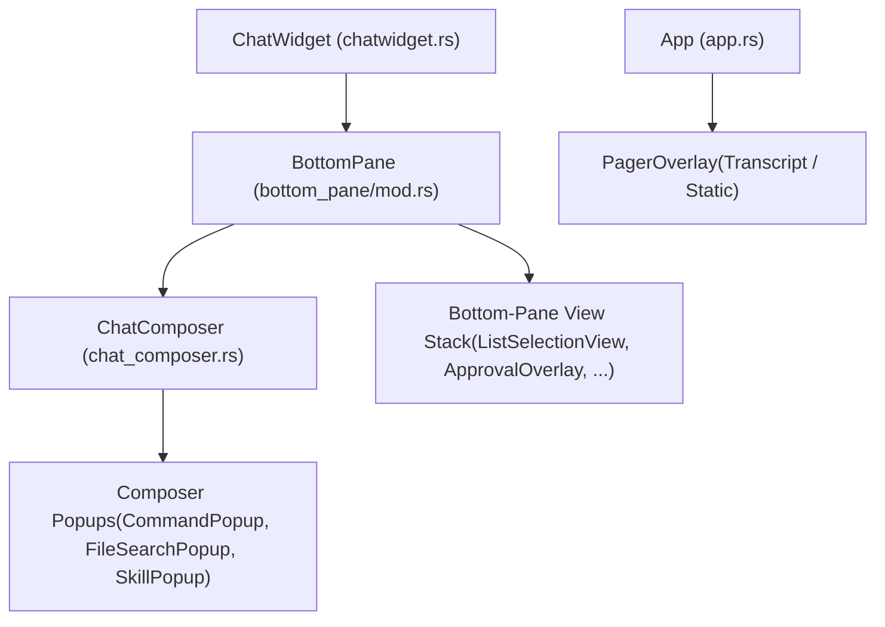
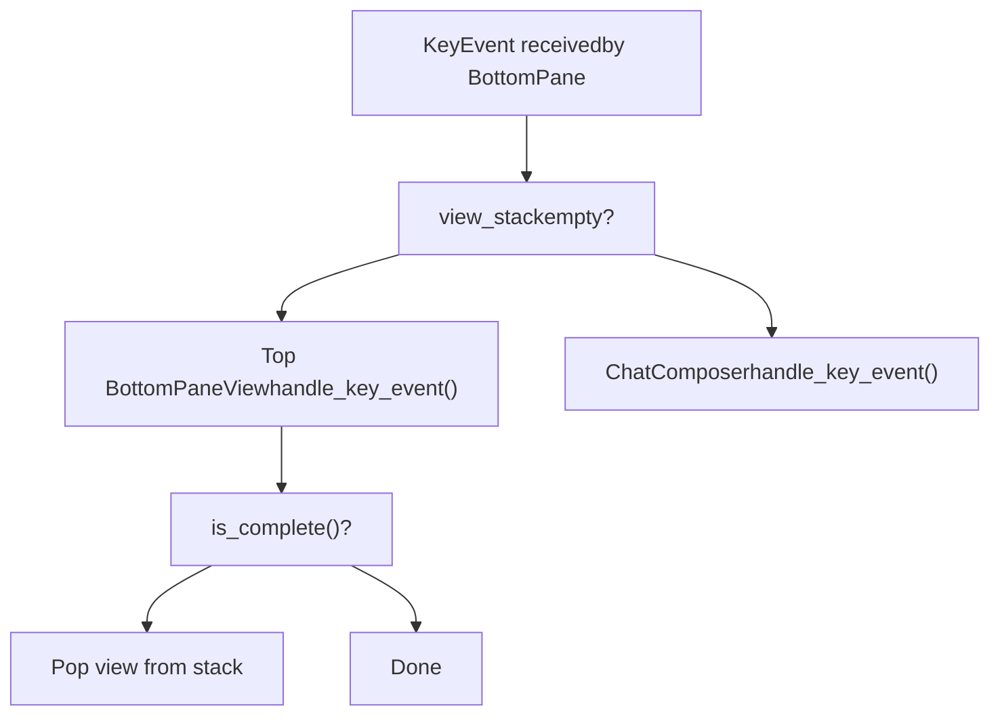
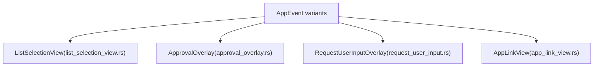

# Interactive Overlays and Popups

Relevant source files

-   [codex-rs/tui/src/bottom\_pane/approval\_overlay.rs](https://github.com/openai/codex/blob/d807d44a/codex-rs/tui/src/bottom_pane/approval_overlay.rs)
-   [codex-rs/tui/src/bottom\_pane/command\_popup.rs](https://github.com/openai/codex/blob/d807d44a/codex-rs/tui/src/bottom_pane/command_popup.rs)
-   [codex-rs/tui/src/bottom\_pane/file\_search\_popup.rs](https://github.com/openai/codex/blob/d807d44a/codex-rs/tui/src/bottom_pane/file_search_popup.rs)
-   [codex-rs/tui/src/bottom\_pane/list\_selection\_view.rs](https://github.com/openai/codex/blob/d807d44a/codex-rs/tui/src/bottom_pane/list_selection_view.rs)
-   [codex-rs/tui/src/bottom\_pane/request\_user\_input/layout.rs](https://github.com/openai/codex/blob/d807d44a/codex-rs/tui/src/bottom_pane/request_user_input/layout.rs)
-   [codex-rs/tui/src/bottom\_pane/request\_user\_input/mod.rs](https://github.com/openai/codex/blob/d807d44a/codex-rs/tui/src/bottom_pane/request_user_input/mod.rs)
-   [codex-rs/tui/src/bottom\_pane/request\_user\_input/render.rs](https://github.com/openai/codex/blob/d807d44a/codex-rs/tui/src/bottom_pane/request_user_input/render.rs)
-   [codex-rs/tui/src/bottom\_pane/request\_user\_input/snapshots/codex\_tui\_\_bottom\_pane\_\_request\_user\_input\_\_tests\_\_request\_user\_input\_footer\_wrap.snap](https://github.com/openai/codex/blob/d807d44a/codex-rs/tui/src/bottom_pane/request_user_input/snapshots/codex_tui__bottom_pane__request_user_input__tests__request_user_input_footer_wrap.snap)
-   [codex-rs/tui/src/bottom\_pane/request\_user\_input/snapshots/codex\_tui\_\_bottom\_pane\_\_request\_user\_input\_\_tests\_\_request\_user\_input\_freeform.snap](https://github.com/openai/codex/blob/d807d44a/codex-rs/tui/src/bottom_pane/request_user_input/snapshots/codex_tui__bottom_pane__request_user_input__tests__request_user_input_freeform.snap)
-   [codex-rs/tui/src/bottom\_pane/request\_user\_input/snapshots/codex\_tui\_\_bottom\_pane\_\_request\_user\_input\_\_tests\_\_request\_user\_input\_multi\_question\_first.snap](https://github.com/openai/codex/blob/d807d44a/codex-rs/tui/src/bottom_pane/request_user_input/snapshots/codex_tui__bottom_pane__request_user_input__tests__request_user_input_multi_question_first.snap)
-   [codex-rs/tui/src/bottom\_pane/request\_user\_input/snapshots/codex\_tui\_\_bottom\_pane\_\_request\_user\_input\_\_tests\_\_request\_user\_input\_multi\_question\_last.snap](https://github.com/openai/codex/blob/d807d44a/codex-rs/tui/src/bottom_pane/request_user_input/snapshots/codex_tui__bottom_pane__request_user_input__tests__request_user_input_multi_question_last.snap)
-   [codex-rs/tui/src/bottom\_pane/request\_user\_input/snapshots/codex\_tui\_\_bottom\_pane\_\_request\_user\_input\_\_tests\_\_request\_user\_input\_options.snap](https://github.com/openai/codex/blob/d807d44a/codex-rs/tui/src/bottom_pane/request_user_input/snapshots/codex_tui__bottom_pane__request_user_input__tests__request_user_input_options.snap)
-   [codex-rs/tui/src/bottom\_pane/request\_user\_input/snapshots/codex\_tui\_\_bottom\_pane\_\_request\_user\_input\_\_tests\_\_request\_user\_input\_options\_notes\_visible.snap](https://github.com/openai/codex/blob/d807d44a/codex-rs/tui/src/bottom_pane/request_user_input/snapshots/codex_tui__bottom_pane__request_user_input__tests__request_user_input_options_notes_visible.snap)
-   [codex-rs/tui/src/bottom\_pane/request\_user\_input/snapshots/codex\_tui\_\_bottom\_pane\_\_request\_user\_input\_\_tests\_\_request\_user\_input\_scrolling\_options.snap](https://github.com/openai/codex/blob/d807d44a/codex-rs/tui/src/bottom_pane/request_user_input/snapshots/codex_tui__bottom_pane__request_user_input__tests__request_user_input_scrolling_options.snap)
-   [codex-rs/tui/src/bottom\_pane/request\_user\_input/snapshots/codex\_tui\_\_bottom\_pane\_\_request\_user\_input\_\_tests\_\_request\_user\_input\_tight\_height.snap](https://github.com/openai/codex/blob/d807d44a/codex-rs/tui/src/bottom_pane/request_user_input/snapshots/codex_tui__bottom_pane__request_user_input__tests__request_user_input_tight_height.snap)
-   [codex-rs/tui/src/bottom\_pane/request\_user\_input/snapshots/codex\_tui\_\_bottom\_pane\_\_request\_user\_input\_\_tests\_\_request\_user\_input\_wrapped\_options.snap](https://github.com/openai/codex/blob/d807d44a/codex-rs/tui/src/bottom_pane/request_user_input/snapshots/codex_tui__bottom_pane__request_user_input__tests__request_user_input_wrapped_options.snap)
-   [codex-rs/tui/src/bottom\_pane/selection\_popup\_common.rs](https://github.com/openai/codex/blob/d807d44a/codex-rs/tui/src/bottom_pane/selection_popup_common.rs)
-   [codex-rs/tui/src/bottom\_pane/skill\_popup.rs](https://github.com/openai/codex/blob/d807d44a/codex-rs/tui/src/bottom_pane/skill_popup.rs)
-   [codex-rs/tui/src/bottom\_pane/slash\_commands.rs](https://github.com/openai/codex/blob/d807d44a/codex-rs/tui/src/bottom_pane/slash_commands.rs)
-   [codex-rs/tui/src/bottom\_pane/snapshots/codex\_tui\_\_bottom\_pane\_\_chat\_composer\_\_tests\_\_mention\_popup\_type\_prefixes.snap](https://github.com/openai/codex/blob/d807d44a/codex-rs/tui/src/bottom_pane/snapshots/codex_tui__bottom_pane__chat_composer__tests__mention_popup_type_prefixes.snap)
-   [codex-rs/tui/src/bottom\_pane/snapshots/codex\_tui\_\_bottom\_pane\_\_chat\_composer\_\_tests\_\_plugin\_mention\_popup.snap](https://github.com/openai/codex/blob/d807d44a/codex-rs/tui/src/bottom_pane/snapshots/codex_tui__bottom_pane__chat_composer__tests__plugin_mention_popup.snap)
-   [codex-rs/tui/src/chatwidget/snapshots/codex\_tui\_\_chatwidget\_\_tests\_\_approval\_modal\_exec.snap](https://github.com/openai/codex/blob/d807d44a/codex-rs/tui/src/chatwidget/snapshots/codex_tui__chatwidget__tests__approval_modal_exec.snap)
-   [codex-rs/tui/src/chatwidget/snapshots/codex\_tui\_\_chatwidget\_\_tests\_\_approval\_modal\_exec\_no\_reason.snap](https://github.com/openai/codex/blob/d807d44a/codex-rs/tui/src/chatwidget/snapshots/codex_tui__chatwidget__tests__approval_modal_exec_no_reason.snap)
-   [codex-rs/tui/src/chatwidget/snapshots/codex\_tui\_\_chatwidget\_\_tests\_\_approval\_modal\_patch.snap](https://github.com/openai/codex/blob/d807d44a/codex-rs/tui/src/chatwidget/snapshots/codex_tui__chatwidget__tests__approval_modal_patch.snap)
-   [codex-rs/tui/src/chatwidget/snapshots/codex\_tui\_\_chatwidget\_\_tests\_\_exec\_approval\_modal\_exec.snap](https://github.com/openai/codex/blob/d807d44a/codex-rs/tui/src/chatwidget/snapshots/codex_tui__chatwidget__tests__exec_approval_modal_exec.snap)
-   [codex-rs/tui/src/chatwidget/snapshots/codex\_tui\_\_chatwidget\_\_tests\_\_status\_widget\_and\_approval\_modal.snap](https://github.com/openai/codex/blob/d807d44a/codex-rs/tui/src/chatwidget/snapshots/codex_tui__chatwidget__tests__status_widget_and_approval_modal.snap)
-   [codex-rs/tui\_app\_server/src/bottom\_pane/chat\_composer.rs](https://github.com/openai/codex/blob/d807d44a/codex-rs/tui_app_server/src/bottom_pane/chat_composer.rs)
-   [codex-rs/tui\_app\_server/src/bottom\_pane/command\_popup.rs](https://github.com/openai/codex/blob/d807d44a/codex-rs/tui_app_server/src/bottom_pane/command_popup.rs)
-   [codex-rs/tui\_app\_server/src/bottom\_pane/mod.rs](https://github.com/openai/codex/blob/d807d44a/codex-rs/tui_app_server/src/bottom_pane/mod.rs)
-   [codex-rs/tui\_app\_server/src/bottom\_pane/slash\_commands.rs](https://github.com/openai/codex/blob/d807d44a/codex-rs/tui_app_server/src/bottom_pane/slash_commands.rs)
-   [docs/tui-request-user-input.md](https://github.com/openai/codex/blob/d807d44a/docs/tui-request-user-input.md?plain=1)

This page documents the overlay and popup system in the Codex TUI: how each overlay type is structured, how keyboard input is intercepted and routed, and how overlays dispatch actions through the `AppEvent` message bus.

For general TUI layout and widget hierarchy, see [4.1](https://github.com/openai/codex/blob/d807d44a/4.1) For the `BottomPane` and input system that hosts many of these overlays, see [4.1.3](https://github.com/openai/codex/blob/d807d44a/4.1.3) For the `AppEvent` bus itself, see [4.1.1](https://github.com/openai/codex/blob/d807d44a/4.1.1)

---

## Overlay Architecture

The TUI has **three distinct overlay layers**, each at a different scope in the widget hierarchy:

**Overlay layers diagram**


| Layer | Owner | Scope | Examples |
| --- | --- | --- | --- |
| Composer popups | `ChatComposer.active_popup` | Above text input | `CommandPopup`, `FileSearchPopup`, `SkillPopup` |
| Bottom-pane view stack | `BottomPane.view_stack` | Replaces composer | `ListSelectionView`, `ApprovalOverlay`, `RequestUserInputOverlay` |
| Full-screen overlay | `App.overlay` | Replaces entire screen | `TranscriptOverlay`, `StaticOverlay` |

Sources: [codex-rs/tui\_app\_server/src/bottom\_pane/mod.rs162-163](https://github.com/openai/codex/blob/d807d44a/codex-rs/tui_app_server/src/bottom_pane/mod.rs#L162-L163) [codex-rs/tui\_app\_server/src/bottom\_pane/chat\_composer.rs12-18](https://github.com/openai/codex/blob/d807d44a/codex-rs/tui_app_server/src/bottom_pane/chat_composer.rs#L12-L18) [codex-rs/tui/src/bottom\_pane/mod.rs150-181](https://github.com/openai/codex/blob/d807d44a/codex-rs/tui/src/bottom_pane/mod.rs#L150-L181) [codex-rs/tui/src/bottom\_pane/chat\_composer.rs349-409](https://github.com/openai/codex/blob/d807d44a/codex-rs/tui/src/bottom_pane/chat_composer.rs#L349-L409)

---

## The `BottomPaneView` Trait

All bottom-pane views implement a common trait (`bottom_pane_view::BottomPaneView`) that enables the `BottomPane` to manage a polymorphic stack.

Key methods on the trait (from `bottom_pane/bottom_pane_view.rs`):

-   `handle_key_event(key_event)` — processes input
-   `on_ctrl_c() -> CancellationEvent` — returns `Handled` to dismiss the view on Ctrl+C
-   `is_complete() -> bool` — signals the view should be popped off the stack
-   `is_in_paste_burst() -> bool` — used to schedule deferred paste-burst timers
-   `prefer_esc_to_handle_key_event() -> bool` — routes Esc to `handle_key_event` instead of `on_ctrl_c`

`BottomPane` routes every key event through its view stack at [codex-rs/tui/src/bottom\_pane/mod.rs352-430](https://github.com/openai/codex/blob/d807d44a/codex-rs/tui/src/bottom_pane/mod.rs#L352-L430):

1.  If the view stack is non-empty, the top view gets the key first.
2.  Esc may call `on_ctrl_c()` or `handle_key_event()` based on `prefer_esc_to_handle_key_event()`.
3.  When `is_complete()` returns true, the view is popped from the stack.
4.  If the stack is empty, input falls through to `ChatComposer`.

**View stack input routing**


Sources: [codex-rs/tui/src/bottom\_pane/mod.rs350-430](https://github.com/openai/codex/blob/d807d44a/codex-rs/tui/src/bottom_pane/mod.rs#L350-L430) [codex-rs/tui\_app\_server/src/bottom\_pane/mod.rs7-12](https://github.com/openai/codex/blob/d807d44a/codex-rs/tui_app_server/src/bottom_pane/mod.rs#L7-L12)

---

## Composer-Level Popups

These popups are managed inside `ChatComposer` and are rendered overlaid directly above the text input area. At most one can be active at a time, tracked by the `ActivePopup` enum.

```
// codex-rs/tui/src/bottom_pane/chat_composer.rs (line ~424)enum ActivePopup {    None,    Command(CommandPopup),    File(FileSearchPopup),    Skill(SkillPopup),}
```
### `CommandPopup`

File: [codex-rs/tui/src/bottom\_pane/command\_popup.rs](https://github.com/openai/codex/blob/d807d44a/codex-rs/tui/src/bottom_pane/command_popup.rs)

Shown when the user types `/` in the composer. Lists built-in slash commands and custom user prompts.

**Key types:**

| Type | Purpose |
| --- | --- |
| `CommandPopup` | Manages filtered list state and scroll [codex-rs/tui/src/bottom\_pane/command\_popup.rs30-35](https://github.com/openai/codex/blob/d807d44a/codex-rs/tui/src/bottom_pane/command_popup.rs#L30-L35) |
| `CommandItem` | `Builtin(SlashCommand)` or `UserPrompt(usize)` [codex-rs/tui/src/bottom\_pane/command\_popup.rs24-28](https://github.com/openai/codex/blob/d807d44a/codex-rs/tui/src/bottom_pane/command_popup.rs#L24-L28) |
| `CommandPopupFlags` | Feature gates (collaboration, connectors, fast mode, etc.) [codex-rs/tui/src/bottom\_pane/command\_popup.rs38-47](https://github.com/openai/codex/blob/d807d44a/codex-rs/tui/src/bottom_pane/command_popup.rs#L38-L47) |

**Filtering logic** ([codex-rs/tui/src/bottom\_pane/command\_popup.rs103-128](https://github.com/openai/codex/blob/d807d44a/codex-rs/tui/src/bottom_pane/command_popup.rs#L103-L128)):

-   `on_composer_text_change(text)` updates `command_filter` from the first token after `/`.
-   `filtered()` runs prefix and exact matching over builtins and user prompts, returning `(CommandItem, Option<Vec<usize>>)` pairs where the `Vec<usize>` contains character positions to bold [codex-rs/tui/src/bottom\_pane/command\_popup.rs142-168](https://github.com/openai/codex/blob/d807d44a/codex-rs/tui/src/bottom_pane/command_popup.rs#L142-L168)
-   Alias commands (`Quit` is an alias of `Exit`, `Approvals` is an alias of `Permissions`) are hidden from the default unfiltered list [codex-rs/tui/src/bottom\_pane/command\_popup.rs18-20](https://github.com/openai/codex/blob/d807d44a/codex-rs/tui/src/bottom_pane/command_popup.rs#L18-L20)

Command availability is gated by `BuiltinCommandFlags` (from [codex-rs/tui/src/bottom\_pane/slash\_commands.rs](https://github.com/openai/codex/blob/d807d44a/codex-rs/tui/src/bottom_pane/slash_commands.rs)) and whether `SlashCommand::available_during_task()` returns true for the current task state.

### `FileSearchPopup`

File: [codex-rs/tui/src/bottom\_pane/file\_search\_popup.rs](https://github.com/openai/codex/blob/d807d44a/codex-rs/tui/src/bottom_pane/file_search_popup.rs)

Shown when the user types `@` in the composer. Displays file search results asynchronously.

State machine:

-   `set_query(query)` puts the popup into `waiting = true` [codex-rs/tui/src/bottom\_pane/file\_search\_popup.rs43-52](https://github.com/openai/codex/blob/d807d44a/codex-rs/tui/src/bottom_pane/file_search_popup.rs#L43-L52)
-   When results arrive, `set_matches(query, matches)` updates the visible list (only if `query == pending_query` to discard stale results) [codex-rs/tui/src/bottom\_pane/file\_search\_popup.rs67-78](https://github.com/openai/codex/blob/d807d44a/codex-rs/tui/src/bottom_pane/file_search_popup.rs#L67-L78)
-   `set_empty_prompt()` is used for an empty `@` query to show a hint instead of matches [codex-rs/tui/src/bottom\_pane/file\_search\_popup.rs56-63](https://github.com/openai/codex/blob/d807d44a/codex-rs/tui/src/bottom_pane/file_search_popup.rs#L56-L63)

| Field | Meaning |
| --- | --- |
| `display_query` | Query corresponding to the `matches` currently shown |
| `pending_query` | Latest query typed by the user (may be ahead of results) |
| `waiting` | True while waiting for results for `pending_query` |
| `matches: Vec<FileMatch>` | Cached matches from the last completed search |

Sources: [codex-rs/tui/src/bottom\_pane/file\_search\_popup.rs17-29](https://github.com/openai/codex/blob/d807d44a/codex-rs/tui/src/bottom_pane/file_search_popup.rs#L17-L29)

### `SkillPopup`

File: [codex-rs/tui/src/bottom\_pane/skill\_popup.rs](https://github.com/openai/codex/blob/d807d44a/codex-rs/tui/src/bottom_pane/skill_popup.rs)

Shown when the user types `$` in the composer. Lists available skills and app connectors as `MentionItem`s.

`MentionItem` fields [codex-rs/tui/src/bottom\_pane/skill\_popup.rs21-29](https://github.com/openai/codex/blob/d807d44a/codex-rs/tui/src/bottom_pane/skill_popup.rs#L21-L29):

| Field | Purpose |
| --- | --- |
| `display_name` | Text shown in the popup row |
| `description` | Optional grey subtitle |
| `insert_text` | Text inserted into the composer on selection |
| `search_terms` | Additional strings for fuzzy matching |
| `path` | Canonical path (skill `.md` file or `app://...` URI) |
| `category_tag` | Right-side label (e.g. `skill`, `app`) |

Fuzzy matching is performed by `codex_utils_fuzzy_match::fuzzy_match` [codex-rs/tui/src/bottom\_pane/skill\_popup.rs142-168](https://github.com/openai/codex/blob/d807d44a/codex-rs/tui/src/bottom_pane/skill_popup.rs#L142-L168) The popup uses `render_rows_single_line` from `selection_popup_common` for its condensed display [codex-rs/tui/src/bottom\_pane/skill\_popup.rs201-210](https://github.com/openai/codex/blob/d807d44a/codex-rs/tui/src/bottom_pane/skill_popup.rs#L201-L210)

---

## Bottom-Pane View Stack

These overlays replace the `ChatComposer` entirely and are managed by `BottomPane.view_stack`.

**Key types and their triggering events**


### `ListSelectionView`

File: [codex-rs/tui/src/bottom\_pane/list\_selection\_view.rs](https://github.com/openai/codex/blob/d807d44a/codex-rs/tui/src/bottom_pane/list_selection_view.rs)

The generic selection popup used for model pickers, approvals presets, theme selection, skills management, and many other interactive choices.

**`SelectionViewParams`** (construction-time config) [codex-rs/tui/src/bottom\_pane/list\_selection\_view.rs138-176](https://github.com/openai/codex/blob/d807d44a/codex-rs/tui/src/bottom_pane/list_selection_view.rs#L138-L176):

| Field | Purpose |
| --- | --- |
| `title` / `subtitle` | Header text |
| `items: Vec<SelectionItem>` | Row data |
| `is_searchable` | Enables a search/filter text input |
| `col_width_mode: ColumnWidthMode` | `AutoVisible`, `AutoAllRows`, or `Fixed` column widths |
| `side_content: Box<dyn Renderable>` | Rich content shown beside the list (e.g. syntax preview) |
| `side_content_width: SideContentWidth` | `Fixed(n)` or `Half` |
| `on_selection_changed` | Callback fired on navigation |
| `on_cancel` | Callback fired on Esc/Ctrl+C |

**`SelectionItem`** (per-row model) [codex-rs/tui/src/bottom\_pane/list\_selection\_view.rs113-126](https://github.com/openai/codex/blob/d807d44a/codex-rs/tui/src/bottom_pane/list_selection_view.rs#L113-L126):

| Field | Purpose |
| --- | --- |
| `name` | Display text |
| `display_shortcut` | Numeric shortcut shown on the right |
| `description` / `selected_description` | Subtitle text |
| `is_current` / `is_default` | Marks the currently-selected or default item |
| `is_disabled` / `disabled_reason` | Prevents selection; shows reason |
| `actions: Vec<SelectionAction>` | Closures called on `AppEventSender` when item is accepted |
| `dismiss_on_select` | Whether accepting this item closes the popup |

**Side-by-side layout**: when terminal width is sufficient, `side_by_side_layout_widths()` divides the content area into a list pane and a side-content pane [codex-rs/tui/src/bottom\_pane/list\_selection\_view.rs76-91](https://github.com/openai/codex/blob/d807d44a/codex-rs/tui/src/bottom_pane/list_selection_view.rs#L76-L91) The threshold is `MIN_LIST_WIDTH_FOR_SIDE = 40` columns [codex-rs/tui/src/bottom\_pane/list\_selection\_view.rs39](https://github.com/openai/codex/blob/d807d44a/codex-rs/tui/src/bottom_pane/list_selection_view.rs#L39-L39)

### `ApprovalOverlay`

File: [codex-rs/tui/src/bottom\_pane/approval\_overlay.rs](https://github.com/openai/codex/blob/d807d44a/codex-rs/tui/src/bottom_pane/approval_overlay.rs)

Shown when the agent requests approval to execute a command, apply a patch, or grant permissions.

**`ApprovalRequest` variants** [codex-rs/tui/src/bottom\_pane/approval\_overlay.rs48-81](https://github.com/openai/codex/blob/d807d44a/codex-rs/tui/src/bottom_pane/approval_overlay.rs#L48-L81):

-   `Exec`: For shell commands and network access.
-   `Permissions`: For granting specific platform capabilities (macOS Contacts, etc.).
-   `ApplyPatch`: For file system edits.
-   `McpElicitation`: For external MCP server user requests.

The overlay renders the command detail and a selection list of options (e.g., "Yes, proceed", "Yes, and don't ask again", "No") [codex-rs/tui/src/bottom\_pane/approval\_overlay.rs149-183](https://github.com/openai/codex/blob/d807d44a/codex-rs/tui/src/bottom_pane/approval_overlay.rs#L149-L183)

### `RequestUserInputOverlay`

File: [codex-rs/tui/src/bottom\_pane/request\_user\_input/mod.rs](https://github.com/openai/codex/blob/d807d44a/codex-rs/tui/src/bottom_pane/request_user_input/mod.rs)

A multi-question state machine for complex elicitation.

-   **Answer State**: Each question can have a selected option and/or freeform notes [codex-rs/tui/src/bottom\_pane/request\_user\_input/mod.rs88-97](https://github.com/openai/codex/blob/d807d44a/codex-rs/tui/src/bottom_pane/request_user_input/mod.rs#L88-L97)
-   **Focus Switching**: Users can toggle focus between `Options` and `Notes` [codex-rs/tui/src/bottom\_pane/request\_user\_input/mod.rs57-60](https://github.com/openai/codex/blob/d807d44a/codex-rs/tui/src/bottom_pane/request_user_input/mod.rs#L57-L60)
-   **Composer Integration**: Uses an internal `ChatComposer` configured for plain text to capture freeform input [codex-rs/tui/src/bottom\_pane/request\_user\_input/mod.rs148-155](https://github.com/openai/codex/blob/d807d44a/codex-rs/tui/src/bottom_pane/request_user_input/mod.rs#L148-L155)

---

## Full-Screen Pager Overlays

File: [codex-rs/tui/src/pager\_overlay.rs](https://github.com/openai/codex/blob/d807d44a/codex-rs/tui/src/pager_overlay.rs)

Full-screen overlays live on `App.overlay: Option<Overlay>` and capture all keyboard input.

```
pub(crate) enum Overlay {    Transcript(TranscriptOverlay),    Static(StaticOverlay),}
```
### `TranscriptOverlay`

Triggered by `Ctrl+T`. Shows committed `HistoryCell`s plus an optional **live tail** from the current in-flight `active_cell`.

The live tail is cached to avoid re-rendering on every frame. `App` calls `TranscriptOverlay::sync_live_tail(key, lines_fn)` during each draw.

### `StaticOverlay`

Triggered by `/diff` or other commands that produce a one-shot viewable document. Constructed with either `new_static_with_lines(lines, title)` or `new_static_with_renderables(renderables, title)`.

---

## Rendering Primitives Shared by Popups

Most popups delegate row rendering to helpers in `bottom_pane/selection_popup_common.rs`.

| Helper | Purpose |
| --- | --- |
| `render_menu_surface(area, buf)` | Paints shared background; returns inset content rect [codex-rs/tui/src/bottom\_pane/selection\_popup\_common.rs84-92](https://github.com/openai/codex/blob/d807d44a/codex-rs/tui/src/bottom_pane/selection_popup_common.rs#L84-L92) |
| `render_rows(...)` | Renders `Vec<GenericDisplayRow>` with selection and scroll [codex-rs/tui/src/bottom\_pane/selection\_popup\_common.rs31](https://github.com/openai/codex/blob/d807d44a/codex-rs/tui/src/bottom_pane/selection_popup_common.rs#L31-L31) |
| `measure_rows_height(...)` | Calculates required height given viewport and scroll state [codex-rs/tui/src/bottom\_pane/selection\_popup\_common.rs28-30](https://github.com/openai/codex/blob/d807d44a/codex-rs/tui/src/bottom_pane/selection_popup_common.rs#L28-L30) |
| `wrap_styled_line(line, width)` | Wraps a styled `Line` preserving span styles [codex-rs/tui/src/bottom\_pane/selection\_popup\_common.rs98-107](https://github.com/openai/codex/blob/d807d44a/codex-rs/tui/src/bottom_pane/selection_popup_common.rs#L98-L107) |

`GenericDisplayRow` is the render-ready model for one popup row [codex-rs/tui/src/bottom\_pane/selection\_popup\_common.rs30-40](https://github.com/openai/codex/blob/d807d44a/codex-rs/tui/src/bottom_pane/selection_popup_common.rs#L30-L40):

| Field | Purpose |
| --- | --- |
| `name` | Primary text |
| `match_indices` | Character positions to bold (search highlights) |
| `description` | Greyed secondary text |
| `category_tag` | Right-aligned label |
| `disabled_reason` | Shown for disabled rows |
| `display_shortcut` | Key binding shown on the right |

Sources: [codex-rs/tui/src/bottom\_pane/selection\_popup\_common.rs30-107](https://github.com/openai/codex/blob/d807d44a/codex-rs/tui/src/bottom_pane/selection_popup_common.rs#L30-L107)

---

## Data Flow: Slash Command Selection

**Slash command selection flow diagram**

> **[Mermaid sequence]**
> *(图表结构无法解析)*

Sources: [codex-rs/tui/src/bottom\_pane/chat\_composer.rs12-18](https://github.com/openai/codex/blob/d807d44a/codex-rs/tui/src/bottom_pane/chat_composer.rs#L12-L18) [codex-rs/tui/src/bottom\_pane/command\_popup.rs103-128](https://github.com/openai/codex/blob/d807d44a/codex-rs/tui/src/bottom_pane/command_popup.rs#L103-L128) [codex-rs/tui/src/bottom\_pane/mod.rs150-160](https://github.com/openai/codex/blob/d807d44a/codex-rs/tui/src/bottom_pane/mod.rs#L150-L160)

---

## Data Flow: Exec Approval

> **[Mermaid sequence]**
> *(图表结构无法解析)*

Sources: [codex-rs/tui/src/bottom\_pane/approval\_overlay.rs104-129](https://github.com/openai/codex/blob/d807d44a/codex-rs/tui/src/bottom_pane/approval_overlay.rs#L104-L129) [codex-rs/tui/src/bottom\_pane/mod.rs350-430](https://github.com/openai/codex/blob/d807d44a/codex-rs/tui/src/bottom_pane/mod.rs#L350-L430)
