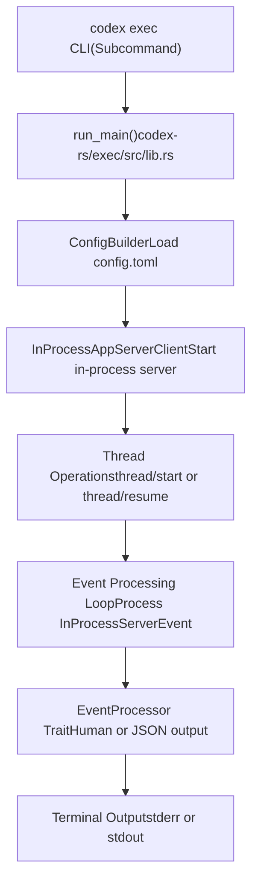
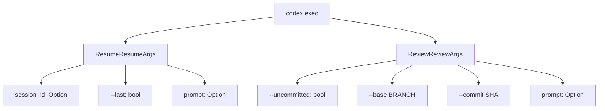
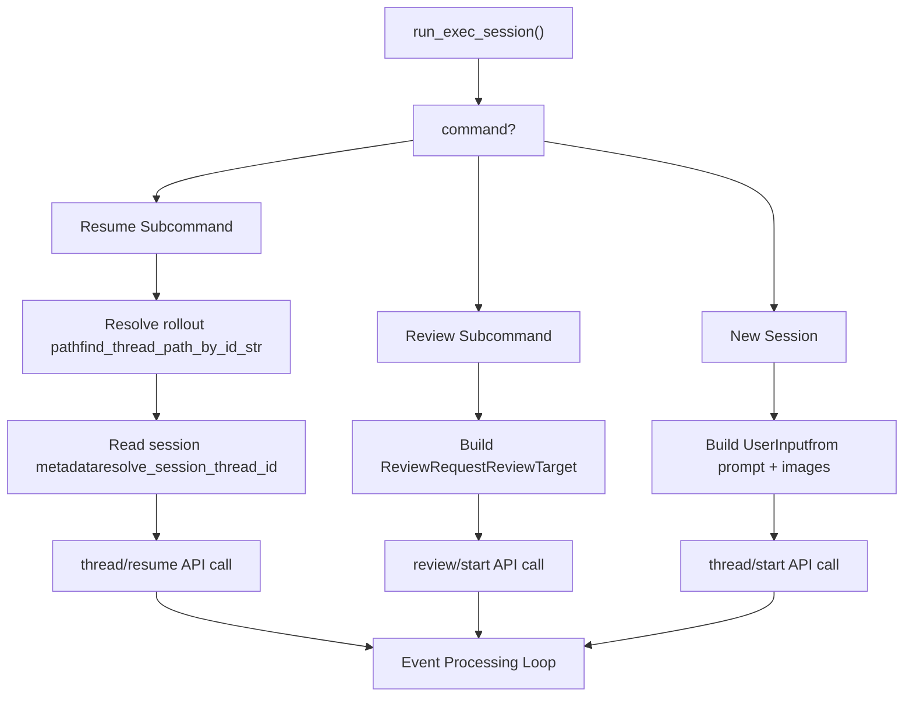
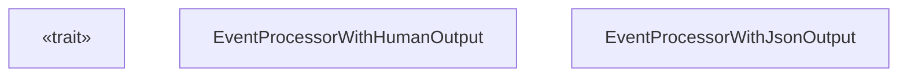

# Headless Execution Mode (codex exec)

Relevant source files

-   [codex-rs/Cargo.lock](https://github.com/openai/codex/blob/d807d44a/codex-rs/Cargo.lock)
-   [codex-rs/Cargo.toml](https://github.com/openai/codex/blob/d807d44a/codex-rs/Cargo.toml)
-   [codex-rs/README.md](https://github.com/openai/codex/blob/d807d44a/codex-rs/README.md?plain=1)
-   [codex-rs/cli/Cargo.toml](https://github.com/openai/codex/blob/d807d44a/codex-rs/cli/Cargo.toml)
-   [codex-rs/cli/src/lib.rs](https://github.com/openai/codex/blob/d807d44a/codex-rs/cli/src/lib.rs)
-   [codex-rs/cli/src/main.rs](https://github.com/openai/codex/blob/d807d44a/codex-rs/cli/src/main.rs)
-   [codex-rs/config.md](https://github.com/openai/codex/blob/d807d44a/codex-rs/config.md?plain=1)
-   [codex-rs/core/Cargo.toml](https://github.com/openai/codex/blob/d807d44a/codex-rs/core/Cargo.toml)
-   [codex-rs/core/src/flags.rs](https://github.com/openai/codex/blob/d807d44a/codex-rs/core/src/flags.rs)
-   [codex-rs/core/src/lib.rs](https://github.com/openai/codex/blob/d807d44a/codex-rs/core/src/lib.rs)
-   [codex-rs/core/src/model\_provider\_info.rs](https://github.com/openai/codex/blob/d807d44a/codex-rs/core/src/model_provider_info.rs)
-   [codex-rs/exec/Cargo.toml](https://github.com/openai/codex/blob/d807d44a/codex-rs/exec/Cargo.toml)
-   [codex-rs/exec/src/cli.rs](https://github.com/openai/codex/blob/d807d44a/codex-rs/exec/src/cli.rs)
-   [codex-rs/exec/src/event\_processor\_with\_jsonl\_output.rs](https://github.com/openai/codex/blob/d807d44a/codex-rs/exec/src/event_processor_with_jsonl_output.rs)
-   [codex-rs/exec/src/exec\_events.rs](https://github.com/openai/codex/blob/d807d44a/codex-rs/exec/src/exec_events.rs)
-   [codex-rs/exec/src/lib.rs](https://github.com/openai/codex/blob/d807d44a/codex-rs/exec/src/lib.rs)
-   [codex-rs/exec/tests/event\_processor\_with\_json\_output.rs](https://github.com/openai/codex/blob/d807d44a/codex-rs/exec/tests/event_processor_with_json_output.rs)
-   [codex-rs/tui/Cargo.toml](https://github.com/openai/codex/blob/d807d44a/codex-rs/tui/Cargo.toml)
-   [codex-rs/tui/src/cli.rs](https://github.com/openai/codex/blob/d807d44a/codex-rs/tui/src/cli.rs)
-   [codex-rs/tui/src/lib.rs](https://github.com/openai/codex/blob/d807d44a/codex-rs/tui/src/lib.rs)

The headless execution mode (`codex exec`) is a non-interactive command-line interface for running Codex programmatically or in automation workflows. Unlike the interactive TUI (see [Terminal User Interface (TUI)](/openai/codex/4.1-terminal-user-interface-(tui))), exec mode runs a single session to completion without user interaction, emits events to stdout/stderr, and exits when the agent determines the task is complete. It also supports resuming previous sessions and running code reviews non-interactively.

For information about the interactive terminal UI, see [Terminal User Interface (TUI)](/openai/codex/4.1-terminal-user-interface-(tui)). For app server integration with IDEs, see [App Server and IDE Integration](/openai/codex/4.5-app-server-and-ide-integration).

---

## Architecture Overview

The exec mode uses the same core engine as the TUI and app server but wraps it in a non-interactive event processor. The `run_main` function initializes an `InProcessAppServerClient` (which manages a `ThreadManager` internally) and processes events in a loop until the session completes.

### Execution Mode Architecture

**Sources**: [codex-rs/exec/src/lib.rs162-465](https://github.com/openai/codex/blob/d807d44a/codex-rs/exec/src/lib.rs#L162-L465) [codex-rs/cli/src/main.rs88-92](https://github.com/openai/codex/blob/d807d44a/codex-rs/cli/src/main.rs#L88-L92) [codex-rs/exec/src/cli.rs8-14](https://github.com/openai/codex/blob/d807d44a/codex-rs/exec/src/cli.rs#L8-L14)

---

## Command-Line Interface

### Basic Usage

The `Cli` struct in `codex-rs/exec/src/cli.rs` defines the non-interactive interface.

| Argument | Type | Description |
| --- | --- | --- |
| `prompt` | `Option<String>` | Task instructions (positional or `-` for stdin) [codex-rs/exec/src/cli.rs111-114](https://github.com/openai/codex/blob/d807d44a/codex-rs/exec/src/cli.rs#L111-L114) |
| `--image, -i` | `Vec<PathBuf>` | Image attachments for initial prompt [codex-rs/exec/src/cli.rs16-23](https://github.com/openai/codex/blob/d807d44a/codex-rs/exec/src/cli.rs#L16-L23) |
| `--model, -m` | `Option<String>` | Override model selection [codex-rs/exec/src/cli.rs25-27](https://github.com/openai/codex/blob/d807d44a/codex-rs/exec/src/cli.rs#L25-L27) |
| `--sandbox, -s` | `SandboxModeCliArg` | Sandbox policy (read-only/workspace-write/danger-full-access) [codex-rs/exec/src/cli.rs38-41](https://github.com/openai/codex/blob/d807d44a/codex-rs/exec/src/cli.rs#L38-L41) |
| `--full-auto` | `bool` | Enable workspace-write sandbox + on-request approvals [codex-rs/exec/src/cli.rs47-49](https://github.com/openai/codex/blob/d807d44a/codex-rs/exec/src/cli.rs#L47-L49) |
| `--yolo` | `bool` | Bypass all approvals and sandboxing (dangerous) [codex-rs/exec/src/cli.rs51-60](https://github.com/openai/codex/blob/d807d44a/codex-rs/exec/src/cli.rs#L51-L60) |
| `--json` | `bool` | Output events as JSONL to stdout [codex-rs/exec/src/cli.rs93-100](https://github.com/openai/codex/blob/d807d44a/codex-rs/exec/src/cli.rs#L93-L100) |
| `--output-last-message, -o` | `Option<PathBuf>` | Write final agent message to file [codex-rs/exec/src/cli.rs102-109](https://github.com/openai/codex/blob/d807d44a/codex-rs/exec/src/cli.rs#L102-L109) |
| `--ephemeral` | `bool` | Skip persisting session rollout files [codex-rs/exec/src/cli.rs74-76](https://github.com/openai/codex/blob/d807d44a/codex-rs/exec/src/cli.rs#L74-L76) |

**Sources**: [codex-rs/exec/src/cli.rs8-115](https://github.com/openai/codex/blob/d807d44a/codex-rs/exec/src/cli.rs#L8-L115)

### Subcommands

The exec mode supports two subcommands defined in the `Command` enum:

**Sources**: [codex-rs/exec/src/cli.rs117-124](https://github.com/openai/codex/blob/d807d44a/codex-rs/exec/src/cli.rs#L117-L124) [codex-rs/exec/src/cli.rs158-175](https://github.com/openai/codex/blob/d807d44a/codex-rs/exec/src/cli.rs#L158-L175)

---

## Execution Flow

The `run_main` function orchestrates the following steps:

1.  **Parse CLI arguments**: Extract `Cli` struct from command line [codex-rs/exec/src/lib.rs162-188](https://github.com/openai/codex/blob/d807d44a/codex-rs/exec/src/lib.rs#L162-L188)
2.  **Load configuration**: Merge `config.toml`, environment variables, and CLI overrides [codex-rs/exec/src/lib.rs238-367](https://github.com/openai/codex/blob/d807d44a/codex-rs/exec/src/lib.rs#L238-L367)
3.  **Validate exec policy**: Check for policy warnings with `check_execpolicy_for_warnings` [codex-rs/exec/src/lib.rs370-379](https://github.com/openai/codex/blob/d807d44a/codex-rs/exec/src/lib.rs#L370-L379)
4.  **Enforce login restrictions**: Verify authentication requirements via `enforce_login_restrictions` [codex-rs/exec/src/lib.rs383-386](https://github.com/openai/codex/blob/d807d44a/codex-rs/exec/src/lib.rs#L383-L386)
5.  **Initialize client**: Create `InProcessAppServerClient` [codex-rs/exec/src/lib.rs431-446](https://github.com/openai/codex/blob/d807d44a/codex-rs/exec/src/lib.rs#L431-L446)
6.  **Delegate to `run_exec_session`**: Execute the main event loop [codex-rs/exec/src/lib.rs447-465](https://github.com/openai/codex/blob/d807d44a/codex-rs/exec/src/lib.rs#L447-L465)

### Session Initialization

The `run_exec_session` function determines the session type (New, Resume, or Review) and makes the corresponding API call to the in-process server.

**Sources**: [codex-rs/exec/src/lib.rs543-640](https://github.com/openai/codex/blob/d807d44a/codex-rs/exec/src/lib.rs#L543-L640) [codex-rs/core/src/lib.rs145-146](https://github.com/openai/codex/blob/d807d44a/codex-rs/core/src/lib.rs#L145-L146)

---

## Event Processing

### Event Processor Trait

The `EventProcessor` trait [codex-rs/exec/src/event\_processor.rs15-40](https://github.com/openai/codex/blob/d807d44a/codex-rs/exec/src/event_processor.rs#L15-L40) defines the interface for handling events emitted by the in-process app server.

**Sources**: [codex-rs/exec/src/event\_processor.rs15-40](https://github.com/openai/codex/blob/d807d44a/codex-rs/exec/src/event_processor.rs#L15-L40) [codex-rs/exec/src/event\_processor\_with\_human\_output.rs30-50](https://github.com/openai/codex/blob/d807d44a/codex-rs/exec/src/event_processor_with_human_output.rs#L30-L50) [codex-rs/exec/src/event\_processor\_with\_jsonl\_output.rs1-20](https://github.com/openai/codex/blob/d807d44a/codex-rs/exec/src/event_processor_with_jsonl_output.rs#L1-L20)

### Output Modes

1.  **`EventProcessorWithHumanOutput`**: Formats output for terminal users. It writes message deltas and tool results to stderr [codex-rs/exec/src/event\_processor\_with\_human\_output.rs1-400](https://github.com/openai/codex/blob/d807d44a/codex-rs/exec/src/event_processor_with_human_output.rs#L1-L400) It handles animated spinners when `cursor_ansi` is enabled [codex-rs/exec/src/event\_processor\_with\_human\_output.rs200-250](https://github.com/openai/codex/blob/d807d44a/codex-rs/exec/src/event_processor_with_human_output.rs#L200-L250)
2.  **`EventProcessorWithJsonOutput`**: Serializes `ThreadEvent` objects as JSONL to stdout [codex-rs/exec/src/event\_processor\_with\_jsonl\_output.rs1-150](https://github.com/openai/codex/blob/d807d44a/codex-rs/exec/src/event_processor_with_jsonl_output.rs#L1-L150)

For details on formatting and terminal behavior, see [Exec Mode Event Processing](/openai/codex/4.2.1-exec-mode-event-processing).

### Approval Handling

Because exec mode is non-interactive, **approval requests cause immediate failure** unless policies are set to auto-approve. If a `ServerRequest::NeedApprovalRequest` is received, the processor typically prints an error and exits [codex-rs/exec/src/event\_processor\_with\_human\_output.rs300-320](https://github.com/openai/codex/blob/d807d44a/codex-rs/exec/src/event_processor_with_human_output.rs#L300-L320)

---

## Session Management

### Resuming and Reviewing

-   **Resuming**: Uses `find_thread_path_by_id_str` to locate previous rollout files [codex-rs/exec/src/lib.rs545-620](https://github.com/openai/codex/blob/d807d44a/codex-rs/exec/src/lib.rs#L545-L620)
-   **Reviewing**: Constructs a `ReviewRequest` which triggers a sub-agent specialized for code analysis [codex-rs/exec/src/lib.rs641-720](https://github.com/openai/codex/blob/d807d44a/codex-rs/exec/src/lib.rs#L641-L720)

For details on session persistence and sub-agent delegation, see [Resume and Review Commands](/openai/codex/4.2.2-resume-and-review-commands).

### Last Message File

The `--output-last-message` flag captures the final response from the agent. The `EventProcessor` implementations buffer the `agent_message` deltas and write the full content to the specified file upon completion [codex-rs/exec/src/event\_processor\_with\_human\_output.rs350-370](https://github.com/openai/codex/blob/d807d44a/codex-rs/exec/src/event_processor_with_human_output.rs#L350-L370)

**Sources**: [codex-rs/exec/src/cli.rs102-109](https://github.com/openai/codex/blob/d807d44a/codex-rs/exec/src/cli.rs#L102-L109) [codex-rs/exec/src/event\_processor\_with\_jsonl\_output.rs100-120](https://github.com/openai/codex/blob/d807d44a/codex-rs/exec/src/event_processor_with_jsonl_output.rs#L100-L120)

---

## Integration with Core

The exec mode utilizes the `InProcessAppServerClient` from `codex-app-server-client` [codex-rs/exec/src/lib.rs17-19](https://github.com/openai/codex/blob/d807d44a/codex-rs/exec/src/lib.rs#L17-L19) This client manages a `ThreadManager` internally and communicates via `mpsc` channels with a default capacity of 10,000 [codex-rs/exec/src/lib.rs16](https://github.com/openai/codex/blob/d807d44a/codex-rs/exec/src/lib.rs#L16-L16)

### Core Event Mapping

| Core Event (`EventMsg`) | Exec Event (`ThreadEvent`) |
| --- | --- |
| `SessionConfigured` | `ThreadStarted` |
| `TurnStarted` | `TurnStarted` |
| `WebSearchEnd` | `ItemCompleted` |
| `AgentMessage` | (Buffered for final msg) |

**Sources**: [codex-rs/exec/tests/event\_processor\_with\_json\_output.rs84-164](https://github.com/openai/codex/blob/d807d44a/codex-rs/exec/tests/event_processor_with_json_output.rs#L84-L164) [codex-rs/protocol/src/protocol.rs1-100](https://github.com/openai/codex/blob/d807d44a/codex-rs/protocol/src/protocol.rs#L1-L100)
