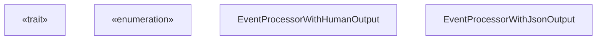
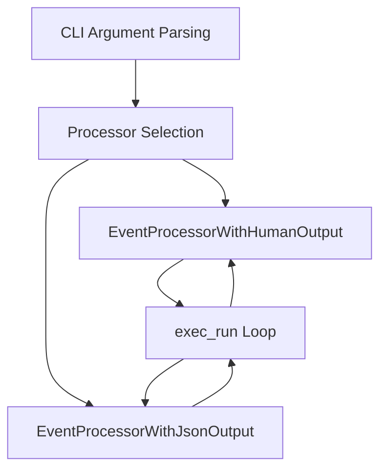
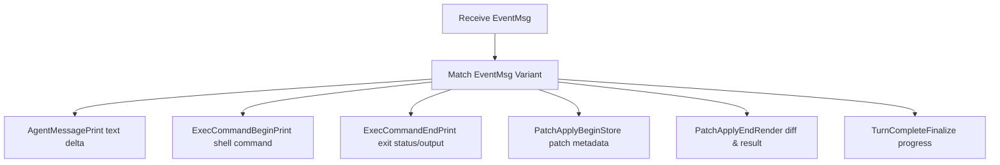

# Exec Mode Event Processing

Relevant source files

-   [codex-rs/core/src/codex.rs](https://github.com/openai/codex/blob/d807d44a/codex-rs/core/src/codex.rs)
-   [codex-rs/core/src/rollout/policy.rs](https://github.com/openai/codex/blob/d807d44a/codex-rs/core/src/rollout/policy.rs)
-   [codex-rs/exec/src/event\_processor.rs](https://github.com/openai/codex/blob/d807d44a/codex-rs/exec/src/event_processor.rs)
-   [codex-rs/exec/src/event\_processor\_with\_human\_output.rs](https://github.com/openai/codex/blob/d807d44a/codex-rs/exec/src/event_processor_with_human_output.rs)
-   [codex-rs/exec/src/event\_processor\_with\_jsonl\_output.rs](https://github.com/openai/codex/blob/d807d44a/codex-rs/exec/src/event_processor_with_jsonl_output.rs)
-   [codex-rs/exec/src/exec\_events.rs](https://github.com/openai/codex/blob/d807d44a/codex-rs/exec/src/exec_events.rs)
-   [codex-rs/exec/tests/event\_processor\_with\_json\_output.rs](https://github.com/openai/codex/blob/d807d44a/codex-rs/exec/tests/event_processor_with_json_output.rs)
-   [codex-rs/mcp-server/src/codex\_tool\_runner.rs](https://github.com/openai/codex/blob/d807d44a/codex-rs/mcp-server/src/codex_tool_runner.rs)
-   [codex-rs/protocol/src/protocol.rs](https://github.com/openai/codex/blob/d807d44a/codex-rs/protocol/src/protocol.rs)
-   [codex-rs/tui/src/app.rs](https://github.com/openai/codex/blob/d807d44a/codex-rs/tui/src/app.rs)
-   [codex-rs/tui/src/app\_event.rs](https://github.com/openai/codex/blob/d807d44a/codex-rs/tui/src/app_event.rs)
-   [codex-rs/tui/src/bottom\_pane/chat\_composer.rs](https://github.com/openai/codex/blob/d807d44a/codex-rs/tui/src/bottom_pane/chat_composer.rs)
-   [codex-rs/tui/src/bottom\_pane/mod.rs](https://github.com/openai/codex/blob/d807d44a/codex-rs/tui/src/bottom_pane/mod.rs)
-   [codex-rs/tui/src/chatwidget.rs](https://github.com/openai/codex/blob/d807d44a/codex-rs/tui/src/chatwidget.rs)
-   [codex-rs/tui/src/chatwidget/tests.rs](https://github.com/openai/codex/blob/d807d44a/codex-rs/tui/src/chatwidget/tests.rs)
-   [codex-rs/tui/src/history\_cell.rs](https://github.com/openai/codex/blob/d807d44a/codex-rs/tui/src/history_cell.rs)
-   [codex-rs/tui/src/slash\_command.rs](https://github.com/openai/codex/blob/d807d44a/codex-rs/tui/src/slash_command.rs)

## Purpose and Scope

This document describes how `codex exec` processes and formats events from the agent core in non-interactive (headless) mode. The event processing layer translates internal protocol events into human-readable terminal output or machine-parseable JSONL, handles approval requests synchronously, and manages progress indication.

The primary implementation for terminal output is `EventProcessorWithHumanOutput`, which manages ANSI styling, diff rendering for patches, and synchronous stdin-based approval prompts.

## EventProcessor Architecture

The event processing system uses a trait-based design to support multiple output formats. All processors implement the `EventProcessor` trait, which defines the contract for consuming agent events and producing formatted output.

### Core Trait Definition

**Sources:** [codex-rs/exec/src/event\_processor.rs7-26](https://github.com/openai/codex/blob/d807d44a/codex-rs/exec/src/event_processor.rs#L7-L26) [codex-rs/exec/src/event\_processor\_with\_human\_output.rs65-93](https://github.com/openai/codex/blob/d807d44a/codex-rs/exec/src/event_processor_with_human_output.rs#L65-L93)

### Processor Selection

The exec mode selects the appropriate processor based on CLI flags. Human-readable output uses ANSI formatting (when supported) and writes structured text to stderr, while JSONL mode outputs one JSON object per line to stdout.

**Sources:** [codex-rs/exec/src/event\_processor\_with\_human\_output.rs95-151](https://github.com/openai/codex/blob/d807d44a/codex-rs/exec/src/event_processor_with_human_output.rs#L95-L151)

## Human-Readable Output Formatting

`EventProcessorWithHumanOutput` formats events for terminal display using the `owo-colors` crate for ANSI escape codes. It maintains internal state to handle multi-part messages and progress indication.

### ANSI Style Management

The processor initializes `owo_colors::Style` fields based on whether ANSI is enabled. If disabled, styles are initialized as empty to ensure no escape codes are emitted [codex-rs/exec/src/event\_processor\_with\_human\_output.rs104-150](https://github.com/openai/codex/blob/d807d44a/codex-rs/exec/src/event_processor_with_human_output.rs#L104-L150)

| Field | Style | Usage |
| --- | --- | --- |
| `bold` | Bold | Headings and important labels |
| `italic` | Italic | Metadata and hints |
| `dimmed` | Dimmed | Timestamps and secondary info |
| `magenta` | Magenta | Agent reasoning headers |
| `red` | Red | Errors and failures |
| `green` | Green | Success states and additions |
| `cyan` | Cyan | Tool calls and system messages |
| `yellow` | Yellow | Warnings and pending states |

**Sources:** [codex-rs/exec/src/event\_processor\_with\_human\_output.rs71-80](https://github.com/openai/codex/blob/d807d44a/codex-rs/exec/src/event_processor_with_human_output.rs#L71-L80) [codex-rs/exec/src/event\_processor\_with\_human\_output.rs104-150](https://github.com/openai/codex/blob/d807d44a/codex-rs/exec/src/event_processor_with_human_output.rs#L104-L150)

### Configuration Summary Display

On session start, `print_config_summary` outputs a summary of the session configuration, including model info and sandbox policies [codex-rs/exec/src/event\_processor\_with\_human\_output.rs181-281](https://github.com/openai/codex/blob/d807d44a/codex-rs/exec/src/event_processor_with_human_output.rs#L181-L281) It uses `create_config_summary_entries` from the sandbox summary utility to generate standard policy descriptions [codex-rs/exec/src/event\_processor\_with\_human\_output.rs194-195](https://github.com/openai/codex/blob/d807d44a/codex-rs/exec/src/event_processor_with_human_output.rs#L194-L195)

## Event Type Handling

The processor implements `process_event`, matching on `EventMsg` variants to drive terminal output [codex-rs/exec/src/event\_processor\_with\_human\_output.rs283-888](https://github.com/openai/codex/blob/d807d44a/codex-rs/exec/src/event_processor_with_human_output.rs#L283-L888)

### Core Event Processing Flow

**Sources:** [codex-rs/exec/src/event\_processor\_with\_human\_output.rs283-888](https://github.com/openai/codex/blob/d807d44a/codex-rs/exec/src/event_processor_with_human_output.rs#L283-L888)

### Tool Call and Execution Output

-   **Shell Commands:** `ExecCommandBeginEvent` prints the command being run [codex-rs/exec/src/event\_processor\_with\_human\_output.rs364-386](https://github.com/openai/codex/blob/d807d44a/codex-rs/exec/src/event_processor_with_human_output.rs#L364-L386) `ExecCommandEndEvent` prints the exit status and up to `MAX_OUTPUT_LINES_FOR_EXEC_TOOL_CALL` (20 lines) of output [codex-rs/exec/src/event\_processor\_with\_human\_output.rs387-489](https://github.com/openai/codex/blob/d807d44a/codex-rs/exec/src/event_processor_with_human_output.rs#L387-L489)
-   **Patch Application:** The processor tracks patch start times in `call_id_to_patch` [codex-rs/exec/src/event\_processor\_with\_human\_output.rs510-517](https://github.com/openai/codex/blob/d807d44a/codex-rs/exec/src/event_processor_with_human_output.rs#L510-L517) Upon completion, it renders the diff and success/failure status [codex-rs/exec/src/event\_processor\_with\_human\_output.rs518-624](https://github.com/openai/codex/blob/d807d44a/codex-rs/exec/src/event_processor_with_human_output.rs#L518-L624)
-   **MCP Tools:** Displays the server and tool name, arguments, and the resulting content [codex-rs/exec/src/event\_processor\_with\_human\_output.rs490-509](https://github.com/openai/codex/blob/d807d44a/codex-rs/exec/src/event_processor_with_human_output.rs#L490-L509)

## Approval Handling

Unlike the TUI, which uses asynchronous overlays, Exec mode handles approvals synchronously by blocking and reading from `stdin`.

### Exec Approval Flow

> **[Mermaid sequence]**
> *(图表结构无法解析)*

**Sources:** [codex-rs/exec/src/event\_processor\_with\_human\_output.rs895-1074](https://github.com/openai/codex/blob/d807d44a/codex-rs/exec/src/event_processor_with_human_output.rs#L895-L1074)

The approval logic supports:

-   **Yes/No:** Standard confirmation [codex-rs/exec/src/event\_processor\_with\_human\_output.rs1011-1014](https://github.com/openai/codex/blob/d807d44a/codex-rs/exec/src/event_processor_with_human_output.rs#L1011-L1014)
-   **Edit:** Prompts for a new command string to execute instead of the proposed one [codex-rs/exec/src/event\_processor\_with\_human\_output.rs1015-1033](https://github.com/openai/codex/blob/d807d44a/codex-rs/exec/src/event_processor_with_human_output.rs#L1015-L1033)
-   **Always:** Approves the current request and signals the core to auto-approve similar future requests [codex-rs/exec/src/event\_processor\_with\_human\_output.rs1034-1037](https://github.com/openai/codex/blob/d807d44a/codex-rs/exec/src/event_processor_with_human_output.rs#L1034-L1037)

## Progress and Token Usage

The processor manages a "progress" line (spinner) during active turns. If `use_ansi_cursor` is enabled, it uses ANSI escape sequences to update the spinner in-place [codex-rs/exec/src/event\_processor\_with\_human\_output.rs1201-1280](https://github.com/openai/codex/blob/d807d44a/codex-rs/exec/src/event_processor_with_human_output.rs#L1201-L1280)

Token usage is tracked via `last_total_token_usage` and printed during `TurnComplete` or when the session ends [codex-rs/exec/src/event\_processor\_with\_human\_output.rs806-810](https://github.com/openai/codex/blob/d807d44a/codex-rs/exec/src/event_processor_with_human_output.rs#L806-L810)

**Sources:** [codex-rs/exec/src/event\_processor\_with\_human\_output.rs85](https://github.com/openai/codex/blob/d807d44a/codex-rs/exec/src/event_processor_with_human_output.rs#L85-L85) [codex-rs/exec/src/event\_processor\_with\_human\_output.rs1201-1280](https://github.com/openai/codex/blob/d807d44a/codex-rs/exec/src/event_processor_with_human_output.rs#L1201-L1280)
