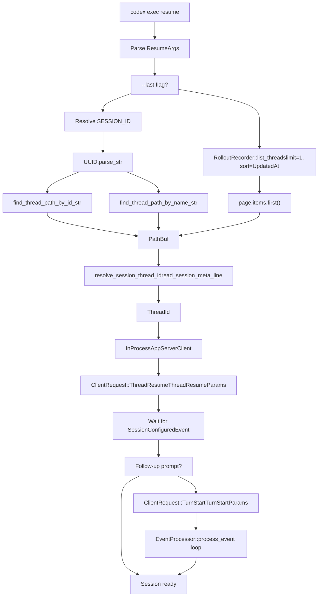
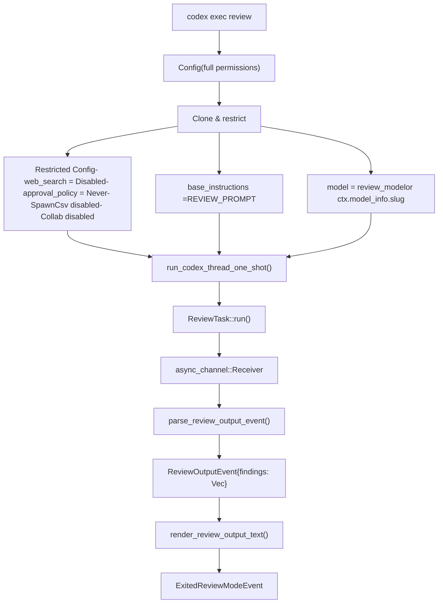
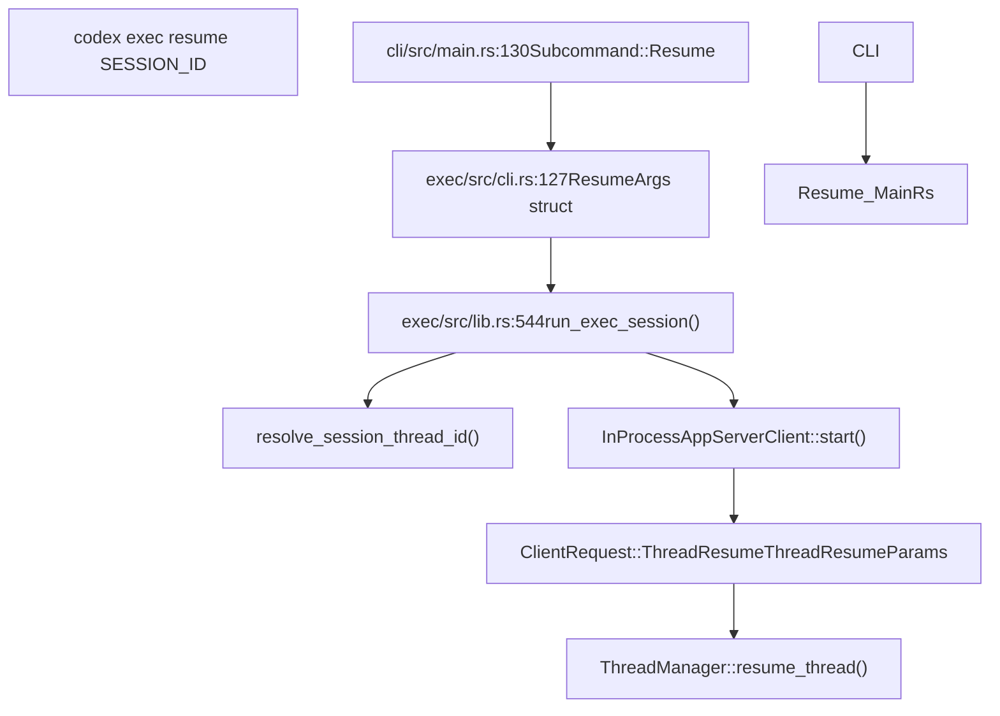
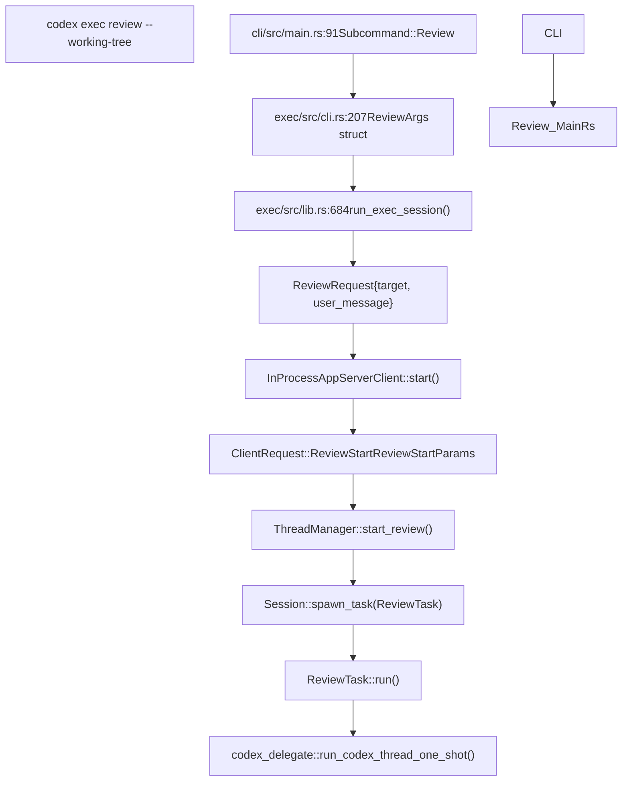

# Resume and Review Commands

Relevant source files

-   [.bazelignore](https://github.com/openai/codex/blob/d807d44a/.bazelignore)
-   [codex-rs/apply-patch/tests/suite/scenarios.rs](https://github.com/openai/codex/blob/d807d44a/codex-rs/apply-patch/tests/suite/scenarios.rs)
-   [codex-rs/cli/tests/features.rs](https://github.com/openai/codex/blob/d807d44a/codex-rs/cli/tests/features.rs)
-   [codex-rs/core/src/exec\_policy.rs](https://github.com/openai/codex/blob/d807d44a/codex-rs/core/src/exec_policy.rs)
-   [codex-rs/core/src/exec\_policy\_tests.rs](https://github.com/openai/codex/blob/d807d44a/codex-rs/core/src/exec_policy_tests.rs)
-   [codex-rs/core/src/tasks/review.rs](https://github.com/openai/codex/blob/d807d44a/codex-rs/core/src/tasks/review.rs)
-   [codex-rs/core/tests/suite/approvals.rs](https://github.com/openai/codex/blob/d807d44a/codex-rs/core/tests/suite/approvals.rs)
-   [codex-rs/core/tests/suite/codex\_delegate.rs](https://github.com/openai/codex/blob/d807d44a/codex-rs/core/tests/suite/codex_delegate.rs)
-   [codex-rs/core/tests/suite/otel.rs](https://github.com/openai/codex/blob/d807d44a/codex-rs/core/tests/suite/otel.rs)
-   [codex-rs/core/tests/suite/review.rs](https://github.com/openai/codex/blob/d807d44a/codex-rs/core/tests/suite/review.rs)
-   [codex-rs/exec/tests/suite/auth\_env.rs](https://github.com/openai/codex/blob/d807d44a/codex-rs/exec/tests/suite/auth_env.rs)
-   [codex-rs/exec/tests/suite/resume.rs](https://github.com/openai/codex/blob/d807d44a/codex-rs/exec/tests/suite/resume.rs)
-   [codex-rs/utils/cargo-bin/Cargo.toml](https://github.com/openai/codex/blob/d807d44a/codex-rs/utils/cargo-bin/Cargo.toml)
-   [codex-rs/utils/cargo-bin/src/lib.rs](https://github.com/openai/codex/blob/d807d44a/codex-rs/utils/cargo-bin/src/lib.rs)

This page documents the non-interactive `resume` and `review` commands available through `codex exec`. These commands enable headless session continuation and code review workflows without requiring the full TUI.

---

## Overview

The `codex exec` subcommand supports two specialized workflows:

-   **Resume**: Continue a previously saved session by ID or thread name, optionally sending a follow-up prompt after restoration.
-   **Review**: Spawn a restricted sub-agent to analyze code changes or specific files without modifying the working tree.

Both commands leverage the app server protocol to manage thread lifecycle and event streaming without requiring terminal UI components.

**Sources:** [codex-rs/exec/src/cli.rs117-124](https://github.com/openai/codex/blob/d807d44a/codex-rs/exec/src/cli.rs#L117-L124) [codex-rs/cli/src/main.rs86-91](https://github.com/openai/codex/blob/d807d44a/codex-rs/cli/src/main.rs#L86-L91)

---

## Resume Command Structure

### Command-Line Interface

The resume command accepts the following arguments:

| Argument | Description | Type |
| --- | --- | --- |
| `SESSION_ID` | UUID or thread name to resume | Optional positional |
| `--last` | Resume most recent session without picker | Flag |
| `--all` | Show all sessions (disables cwd filtering) | Flag |
| `--image` / `-i` | Attach images to follow-up prompt | Repeatable path |
| `PROMPT` | Optional prompt to send after resuming | Positional |

When `--last` is specified without an explicit prompt, the positional argument is interpreted as the prompt rather than a session ID.

**Sources:** [codex-rs/exec/src/cli.rs127-175](https://github.com/openai/codex/blob/d807d44a/codex-rs/exec/src/cli.rs#L127-L175)

### Session Resolution Flow

**Diagram: Resume session resolution and initialization flow**

The resolution logic prioritizes UUIDs over thread names when parsing `SESSION_ID`. The `--all` flag disables CWD-based filtering, allowing resume of sessions started in different directories. Verification of resumption is handled by checking the updated rollout file for new markers.

**Sources:** [codex-rs/exec/src/lib.rs544-666](https://github.com/openai/codex/blob/d807d44a/codex-rs/exec/src/lib.rs#L544-L666) [codex-rs/exec/tests/suite/resume.rs116-167](https://github.com/openai/codex/blob/d807d44a/codex-rs/exec/tests/suite/resume.rs#L116-L167)

---

## Review Command Architecture

### Command-Line Interface

The review command accepts:

| Argument | Description | Type |
| --- | --- | --- |
| `--working-tree` / `-w` | Review uncommitted changes in working tree | Flag |
| `--target` / `-t` | Specific file paths to review | Repeatable path |
| `PROMPT` | Optional instructions for review focus | Positional |

At least one of `--working-tree` or `--target` must be specified.

**Sources:** [codex-rs/exec/src/cli.rs207-270](https://github.com/openai/codex/blob/d807d44a/codex-rs/exec/src/cli.rs#L207-L270)

### Sub-Agent Delegation Model

**Diagram: Review sub-agent architecture and configuration inheritance**

The review sub-agent inherits the primary session's configuration but applies strict overrides to prevent side effects:

-   `web_search_mode` is set to `WebSearchMode::Disabled` [codex-rs/core/src/tasks/review.rs98-102](https://github.com/openai/codex/blob/d807d44a/codex-rs/core/src/tasks/review.rs#L98-L102)
-   `approval_policy` is set to `AskForApproval::Never` [codex-rs/core/src/tasks/review.rs108](https://github.com/openai/codex/blob/d807d44a/codex-rs/core/src/tasks/review.rs#L108-L108)
-   Features `SpawnCsv` and `Collab` are explicitly disabled [codex-rs/core/src/tasks/review.rs103-104](https://github.com/openai/codex/blob/d807d44a/codex-rs/core/src/tasks/review.rs#L103-L104)
-   `base_instructions` is replaced with `REVIEW_PROMPT` template [codex-rs/core/src/tasks/review.rs107](https://github.com/openai/codex/blob/d807d44a/codex-rs/core/src/tasks/review.rs#L107-L107)

**Sources:** [codex-rs/core/src/tasks/review.rs87-130](https://github.com/openai/codex/blob/d807d44a/codex-rs/core/src/tasks/review.rs#L87-L130) [codex-rs/core/tests/suite/review.rs39-87](https://github.com/openai/codex/blob/d807d44a/codex-rs/core/tests/suite/review.rs#L39-L87)

### Review Output Processing

The review sub-agent returns a structured `ReviewOutputEvent` containing an array of `ReviewFinding` objects. If the model returns plain text instead of JSON, `parse_review_output_event` attempts to extract the first JSON object or falls back to wrapping the text in an `overall_explanation`.

> **[Mermaid sequence]**
> *(图表结构无法解析)*

**Diagram: Review event processing and structured output extraction**

**Sources:** [codex-rs/core/src/tasks/review.rs132-186](https://github.com/openai/codex/blob/d807d44a/codex-rs/core/src/tasks/review.rs#L132-L186) [codex-rs/core/src/tasks/review.rs187-202](https://github.com/openai/codex/blob/d807d44a/codex-rs/core/src/tasks/review.rs#L187-L202)

---

## Approval Handling in Exec Mode

In `exec` mode, approval requests are evaluated against the `ExecPolicyManager`. If a command matches a forbidden rule or requires approval but the `AskForApproval` policy is set to `Never`, the request is rejected automatically.

### Policy Conflict Resolution

The system checks if a prompt is rejected by policy using `prompt_is_rejected_by_policy`. This honors granular settings for `rules` vs `sandbox_approval`.

| Condition | Rejection Reason |
| --- | --- |
| Policy is `Never` | `PROMPT_CONFLICT_REASON` |
| `prompt_is_rule` is true but rules approval disabled | `REJECT_RULES_APPROVAL_REASON` |
| Sandbox approval required but disabled | `REJECT_SANDBOX_APPROVAL_REASON` |

**Sources:** [codex-rs/core/src/exec\_policy.rs130-153](https://github.com/openai/codex/blob/d807d44a/codex-rs/core/src/exec_policy.rs#L130-L153) [codex-rs/core/src/exec\_policy.rs41-46](https://github.com/openai/codex/blob/d807d44a/codex-rs/core/src/exec_policy.rs#L41-L46)

---

## Code Entity Mapping

### Resume Command Path

**Diagram: Resume command code path from CLI to session restoration**

**Sources:** [codex-rs/cli/src/main.rs130](https://github.com/openai/codex/blob/d807d44a/codex-rs/cli/src/main.rs#L130-L130) [codex-rs/exec/src/cli.rs127-193](https://github.com/openai/codex/blob/d807d44a/codex-rs/exec/src/cli.rs#L127-L193) [codex-rs/exec/src/lib.rs544-666](https://github.com/openai/codex/blob/d807d44a/codex-rs/exec/src/lib.rs#L544-L666)

### Review Command Path

**Diagram: Review command code path from CLI to structured output**

**Sources:** [codex-rs/cli/src/main.rs91](https://github.com/openai/codex/blob/d807d44a/codex-rs/cli/src/main.rs#L91-L91) [codex-rs/exec/src/cli.rs207-270](https://github.com/openai/codex/blob/d807d44a/codex-rs/exec/src/cli.rs#L207-L270) [codex-rs/core/src/tasks/review.rs42-85](https://github.com/openai/codex/blob/d807d44a/codex-rs/core/src/tasks/review.rs#L42-L85)

---

## Implementation Details

### Session Resolution Helper

The `resolve_session_thread_id()` helper reads metadata from rollout files to extract the thread ID. It parses the first line of the rollout file (JSONL format) to find the `SessionMeta` payload.

**Sources:** [codex-rs/exec/src/lib.rs1204-1240](https://github.com/openai/codex/blob/d807d44a/codex-rs/exec/src/lib.rs#L1204-L1240) [codex-rs/exec/tests/suite/resume.rs61-72](https://github.com/openai/codex/blob/d807d44a/codex-rs/exec/tests/suite/resume.rs#L61-L72)

### Review Sub-Agent Restrictions

The `ReviewTask` ensures that the sub-agent cannot perform dangerous actions by explicitly disabling features and setting the model to the specified `review_model` or the current session's model.

**Sources:** [codex-rs/core/src/tasks/review.rs93-114](https://github.com/openai/codex/blob/d807d44a/codex-rs/core/src/tasks/review.rs#L93-L114) [codex-rs/core/tests/suite/review.rs100-114](https://github.com/openai/codex/blob/d807d44a/codex-rs/core/tests/suite/review.rs#L100-L114)
