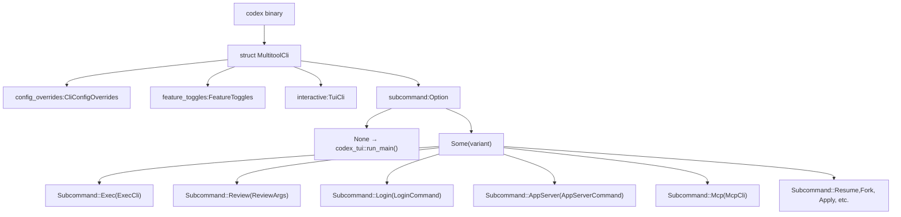
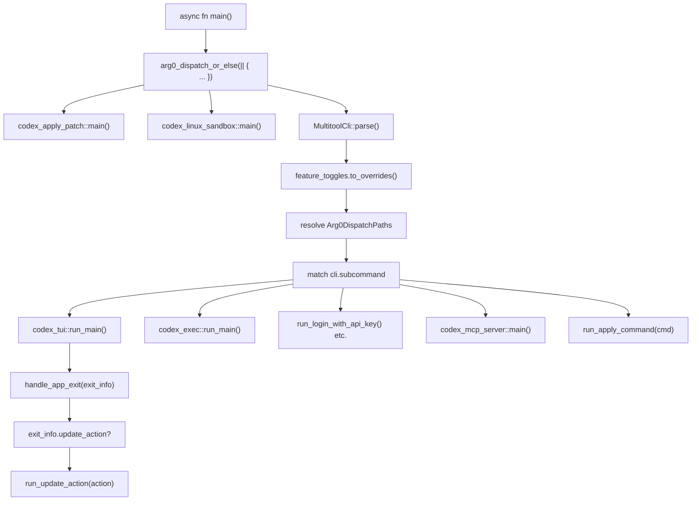
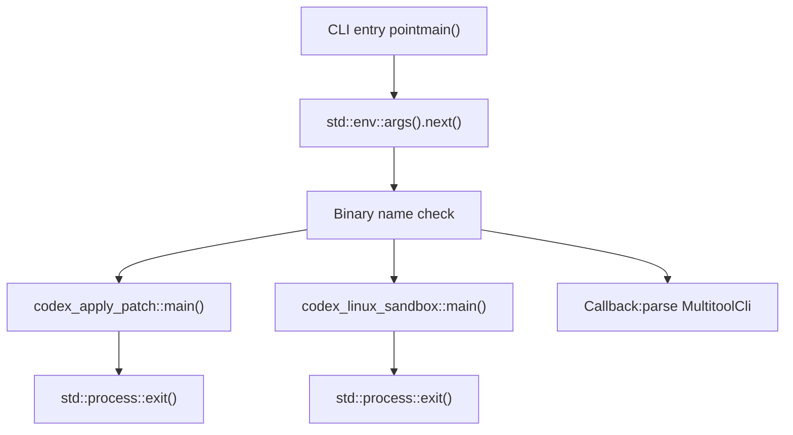

# CLI Entry Points and Multitool Dispatch

Relevant source files

-   [.github/dotslash-config.json](https://github.com/openai/codex/blob/d807d44a/.github/dotslash-config.json)
-   [codex-cli/.gitignore](https://github.com/openai/codex/blob/d807d44a/codex-cli/.gitignore)
-   [codex-cli/README.md](https://github.com/openai/codex/blob/d807d44a/codex-cli/README.md?plain=1)
-   [codex-cli/bin/codex.js](https://github.com/openai/codex/blob/d807d44a/codex-cli/bin/codex.js)
-   [codex-cli/bin/rg](https://github.com/openai/codex/blob/d807d44a/codex-cli/bin/rg)
-   [codex-cli/scripts/README.md](https://github.com/openai/codex/blob/d807d44a/codex-cli/scripts/README.md?plain=1)
-   [codex-cli/scripts/build\_npm\_package.py](https://github.com/openai/codex/blob/d807d44a/codex-cli/scripts/build_npm_package.py)
-   [codex-cli/scripts/install\_native\_deps.py](https://github.com/openai/codex/blob/d807d44a/codex-cli/scripts/install_native_deps.py)
-   [codex-rs/Cargo.lock](https://github.com/openai/codex/blob/d807d44a/codex-rs/Cargo.lock)
-   [codex-rs/Cargo.toml](https://github.com/openai/codex/blob/d807d44a/codex-rs/Cargo.toml)
-   [codex-rs/README.md](https://github.com/openai/codex/blob/d807d44a/codex-rs/README.md?plain=1)
-   [codex-rs/cli/Cargo.toml](https://github.com/openai/codex/blob/d807d44a/codex-rs/cli/Cargo.toml)
-   [codex-rs/cli/src/lib.rs](https://github.com/openai/codex/blob/d807d44a/codex-rs/cli/src/lib.rs)
-   [codex-rs/cli/src/main.rs](https://github.com/openai/codex/blob/d807d44a/codex-rs/cli/src/main.rs)
-   [codex-rs/config.md](https://github.com/openai/codex/blob/d807d44a/codex-rs/config.md?plain=1)
-   [codex-rs/core/Cargo.toml](https://github.com/openai/codex/blob/d807d44a/codex-rs/core/Cargo.toml)
-   [codex-rs/core/src/flags.rs](https://github.com/openai/codex/blob/d807d44a/codex-rs/core/src/flags.rs)
-   [codex-rs/core/src/lib.rs](https://github.com/openai/codex/blob/d807d44a/codex-rs/core/src/lib.rs)
-   [codex-rs/core/src/model\_provider\_info.rs](https://github.com/openai/codex/blob/d807d44a/codex-rs/core/src/model_provider_info.rs)
-   [codex-rs/exec/Cargo.toml](https://github.com/openai/codex/blob/d807d44a/codex-rs/exec/Cargo.toml)
-   [codex-rs/exec/src/cli.rs](https://github.com/openai/codex/blob/d807d44a/codex-rs/exec/src/cli.rs)
-   [codex-rs/exec/src/lib.rs](https://github.com/openai/codex/blob/d807d44a/codex-rs/exec/src/lib.rs)
-   [codex-rs/process-hardening/README.md](https://github.com/openai/codex/blob/d807d44a/codex-rs/process-hardening/README.md?plain=1)
-   [codex-rs/responses-api-proxy/npm/README.md](https://github.com/openai/codex/blob/d807d44a/codex-rs/responses-api-proxy/npm/README.md?plain=1)
-   [codex-rs/responses-api-proxy/npm/bin/codex-responses-api-proxy.js](https://github.com/openai/codex/blob/d807d44a/codex-rs/responses-api-proxy/npm/bin/codex-responses-api-proxy.js)
-   [codex-rs/tui/Cargo.toml](https://github.com/openai/codex/blob/d807d44a/codex-rs/tui/Cargo.toml)
-   [codex-rs/tui/src/cli.rs](https://github.com/openai/codex/blob/d807d44a/codex-rs/tui/src/cli.rs)
-   [codex-rs/tui/src/lib.rs](https://github.com/openai/codex/blob/d807d44a/codex-rs/tui/src/lib.rs)
-   [scripts/stage\_npm\_packages.py](https://github.com/openai/codex/blob/d807d44a/scripts/stage_npm_packages.py)

## Purpose and Scope

This page documents the **CLI entry point architecture** in the Codex binary, specifically how the `codex` executable acts as a **multitool dispatcher** that routes invocations to different execution modes (TUI, Exec, App Server, etc.) based on command-line arguments and binary name. The dispatch mechanism uses a `clap`\-based parser with subcommand routing and an **arg0 dispatch** system for specialized binary invocations.

For details on the **TUI mode** itself, see [4.1](https://github.com/openai/codex/blob/d807d44a/4.1) For **Exec mode** implementation, see [4.2](https://github.com/openai/codex/blob/d807d44a/4.2) For **App Server** protocol handling, see [4.5](https://github.com/openai/codex/blob/d807d44a/4.5) This page focuses solely on the routing layer that selects which mode to invoke.

---

## MultitoolCli Structure and Subcommand Hierarchy

The `codex` binary uses a single `MultitoolCli` parser that defines the top-level command structure. When no subcommand is provided, the CLI defaults to **interactive TUI mode**. The parser structure is defined in [codex-rs/cli/src/main.rs71-86](https://github.com/openai/codex/blob/d807d44a/codex-rs/cli/src/main.rs#L71-L86)

**Diagram: MultitoolCli Structure and Field Composition**

**Sources**: [codex-rs/cli/src/main.rs71-86](https://github.com/openai/codex/blob/d807d44a/codex-rs/cli/src/main.rs#L71-L86) [codex-rs/cli/src/main.rs88-153](https://github.com/openai/codex/blob/d807d44a/codex-rs/cli/src/main.rs#L88-L153)

The `#[clap(subcommand_negates_reqs = true)]` attribute on `MultitoolCli` [codex-rs/cli/src/main.rs64](https://github.com/openai/codex/blob/d807d44a/codex-rs/cli/src/main.rs#L64-L64) means that when a subcommand is present, top-level interactive arguments are not validated, allowing different argument requirements depending on invocation mode. The `interactive: TuiCli` field is flattened via `#[clap(flatten)]` [codex-rs/cli/src/main.rs81-82](https://github.com/openai/codex/blob/d807d44a/codex-rs/cli/src/main.rs#L81-L82) making TUI-specific flags available at the top level when no subcommand is specified.

---

## Subcommand Routing Table

The following table maps each subcommand to its implementation crate and primary use case:

| Subcommand | Enum Variant | Struct | Crate | Purpose |
| --- | --- | --- | --- | --- |
| *(none)* | N/A | `TuiCli` | `codex-tui` | Interactive terminal UI (default mode) |
| `exec` | `Subcommand::Exec` | `ExecCli` | `codex-exec` | Headless, non-interactive execution |
| `review` | `Subcommand::Review` | `ReviewArgs` | `codex-exec` | Code review mode (delegates to exec) |
| `login` | `Subcommand::Login` | `LoginCommand` | `codex-cli` | Authenticate with ChatGPT or API key |
| `logout` | `Subcommand::Logout` | `LogoutCommand` | `codex-cli` | Remove stored credentials |
| `mcp` | `Subcommand::Mcp` | `McpCli` | `codex-cli` | Manage external MCP servers |
| `mcp-server` | `Subcommand::McpServer` | *(unit variant)* | `codex-mcp-server` | Run Codex as an MCP server (stdio) |
| `app-server` | `Subcommand::AppServer` | `AppServerCommand` | `codex-cli` | JSON-RPC 2.0 server for IDE integration |
| `app` | `Subcommand::App` | `AppCommand` | `codex-cli` | Launch Codex desktop app (macOS only) |
| `apply` | `Subcommand::Apply` | `ApplyCommand` | `codex-chatgpt` | Apply agent-generated diffs to working tree |
| `resume` | `Subcommand::Resume` | `ResumeCommand` | `codex-cli` | Resume a previous session (TUI picker) |
| `fork` | `Subcommand::Fork` | `ForkCommand` | `codex-cli` | Fork a previous session |
| `sandbox` | `Subcommand::Sandbox` | `SandboxArgs` | `codex-cli` | Test sandbox execution directly |
| `completion` | `Subcommand::Completion` | `CompletionCommand` | `codex-cli` | Generate shell completion scripts |
| `features` | `Subcommand::Features` | `FeaturesCli` | `codex-cli` | Inspect feature flags |
| `cloud` | `Subcommand::Cloud` | `CloudTasksCli` | `codex-cloud-tasks` | Browse and apply Codex Cloud tasks |
| `debug` | `Subcommand::Debug` | `DebugCommand` | `codex-cli` | Debugging utilities |

**Sources**: [codex-rs/cli/src/main.rs88-153](https://github.com/openai/codex/blob/d807d44a/codex-rs/cli/src/main.rs#L88-L153)

---

## Dispatch Flow and Main Function

The `main` function orchestrates the dispatch logic. The entry point uses `#[tokio::main]` attribute to provide async runtime support for all modes.

**Diagram: Main Function Dispatch Flow**

**Sources**: [codex-rs/cli/src/main.rs1-86](https://github.com/openai/codex/blob/d807d44a/codex-rs/cli/src/main.rs#L1-L86) [codex-rs/arg0/src/lib.rs28-73](https://github.com/openai/codex/blob/d807d44a/codex-rs/arg0/src/lib.rs#L28-L73)

### Key Dispatch Points

1.  **Arg0 dispatch**: The `arg0_dispatch_or_else()` function from `codex-arg0` checks the binary name (`std::env::args().next()`) before parsing CLI args. If it matches a specialized pattern (e.g., ending in `-apply-patch` or `-linux-sandbox`), the handler runs immediately and exits [codex-rs/arg0/src/lib.rs28-73](https://github.com/openai/codex/blob/d807d44a/codex-rs/arg0/src/lib.rs#L28-L73)

2.  **MultitoolCli parsing**: If not arg0-dispatched, `MultitoolCli::parse()` uses `clap` to parse all arguments and flags [codex-rs/cli/src/main.rs3](https://github.com/openai/codex/blob/d807d44a/codex-rs/cli/src/main.rs#L3-L3)

3.  **Feature toggle expansion**: The `FeatureToggles` flags are converted into configuration overrides for the core system [codex-rs/cli/src/main.rs75-76](https://github.com/openai/codex/blob/d807d44a/codex-rs/cli/src/main.rs#L75-L76)

4.  **Subcommand match**: A large `match` statement on `cli.subcommand` routes execution to the appropriate handler function or crate entry point [codex-rs/cli/src/main.rs88-153](https://github.com/openai/codex/blob/d807d44a/codex-rs/cli/src/main.rs#L88-L153)

---

## Arg0 Dispatch for Specialized Binaries

The **arg0 dispatch** mechanism allows the same binary to be invoked under different names to trigger specialized behavior. This is implemented in the `codex-arg0` crate via the `arg0_dispatch_or_else` function [codex-rs/arg0/src/lib.rs28-73](https://github.com/openai/codex/blob/d807d44a/codex-rs/arg0/src/lib.rs#L28-L73)

### Specialized Binary Names

| Binary Name Pattern | Handler Function | Crate | Purpose |
| --- | --- | --- | --- |
| `*-apply-patch` | `codex_apply_patch::main()` | `codex-apply-patch` | Apply patches from stdin to filesystem |
| `*-linux-sandbox` | `codex_linux_sandbox::main()` | `codex-linux-sandbox` | Run commands under Landlock+seccomp on Linux |

The pattern matching is **suffix-based**: any binary name ending with `-apply-patch` or `-linux-sandbox` triggers the respective handler [codex-rs/arg0/src/lib.rs40-42](https://github.com/openai/codex/blob/d807d44a/codex-rs/arg0/src/lib.rs#L40-L42)

### Arg0 Dispatch Flow

**Sources**: [codex-rs/arg0/src/lib.rs28-73](https://github.com/openai/codex/blob/d807d44a/codex-rs/arg0/src/lib.rs#L28-L73)

---

## Default Mode Selection: TUI When No Subcommand

When no subcommand is provided, the CLI defaults to **TUI mode**. The `TuiCli` struct is flattened into `MultitoolCli` via `#[clap(flatten)]` [codex-rs/cli/src/main.rs81-82](https://github.com/openai/codex/blob/d807d44a/codex-rs/cli/src/main.rs#L81-L82) so TUI-specific arguments are available at the top level.

When `cli.subcommand` is `None`, the code path invokes `codex_tui::run_main()` [codex-rs/cli/src/main.rs85-86](https://github.com/openai/codex/blob/d807d44a/codex-rs/cli/src/main.rs#L85-L86)

### Resume and Fork as TUI Variants

The `resume` [codex-rs/cli/src/main.rs197-216](https://github.com/openai/codex/blob/d807d44a/codex-rs/cli/src/main.rs#L197-L216) and `fork` [codex-rs/cli/src/main.rs219-235](https://github.com/openai/codex/blob/d807d44a/codex-rs/cli/src/main.rs#L219-L235) subcommands are specialized TUI invocations. The main function maps these subcommands into a `TuiCli` struct with specific flags set and then launches the TUI.

**Sources**: [codex-rs/cli/src/main.rs197-235](https://github.com/openai/codex/blob/d807d44a/codex-rs/cli/src/main.rs#L197-L235)

---

## Common CLI Infrastructure

### CliConfigOverrides

All modes share the `CliConfigOverrides` struct from `codex-utils-cli`, which provides the `-c key=value` syntax for overriding `config.toml` values at runtime [codex-rs/cli/src/main.rs72-73](https://github.com/openai/codex/blob/d807d44a/codex-rs/cli/src/main.rs#L72-L73)

### FeatureToggles

The `FeatureToggles` struct [codex-rs/cli/src/main.rs75-76](https://github.com/openai/codex/blob/d807d44a/codex-rs/cli/src/main.rs#L75-L76) provides `--enable FEATURE` and `--disable FEATURE` flags. These are validated against known features using `is_known_feature_key()` from `codex-features` [codex-rs/cli/src/main.rs53](https://github.com/openai/codex/blob/d807d44a/codex-rs/cli/src/main.rs#L53-L53)

**Sources**: [codex-rs/cli/src/main.rs51-53](https://github.com/openai/codex/blob/d807d44a/codex-rs/cli/src/main.rs#L51-L53) [codex-rs/cli/src/main.rs75-76](https://github.com/openai/codex/blob/d807d44a/codex-rs/cli/src/main.rs#L75-L76)

---

## Exit Handling and Update Actions

After TUI or Exec mode completes, control returns to the main function, which calls `handle_app_exit()` to process the exit status. This function performs:

1.  **Fatal error reporting**: Reporting errors if the session crashed.
2.  **Token usage summary**: Displaying how many tokens were consumed during the turn.
3.  **Update action execution**: If an `UpdateAction` is present (e.g., user requested update from TUI), run the update command [codex-rs/cli/src/main.rs30](https://github.com/openai/codex/blob/d807d44a/codex-rs/cli/src/main.rs#L30-L30)

**Sources**: [codex-rs/cli/src/main.rs27-30](https://github.com/openai/codex/blob/d807d44a/codex-rs/cli/src/main.rs#L27-L30)

---

## Summary of Entry Point Responsibilities

The CLI entry point layer provides:

1.  **Unified binary interface**: Single `codex` executable with subcommand-based mode selection [codex-rs/cli/src/main.rs71-86](https://github.com/openai/codex/blob/d807d44a/codex-rs/cli/src/main.rs#L71-L86)
2.  **Arg0 dispatch**: Specialized behavior when invoked under different names [codex-rs/arg0/src/lib.rs28-73](https://github.com/openai/codex/blob/d807d44a/codex-rs/arg0/src/lib.rs#L28-L73)
3.  **Default to TUI**: Interactive mode is the default experience [codex-rs/cli/src/main.rs85-86](https://github.com/openai/codex/blob/d807d44a/codex-rs/cli/src/main.rs#L85-L86)
4.  **Config override propagation**: `-c` and feature flags are forwarded to all modes [codex-rs/cli/src/main.rs72-76](https://github.com/openai/codex/blob/d807d44a/codex-rs/cli/src/main.rs#L72-L76)
5.  **Platform-specific paths**: Resolution of helper binaries like the Linux sandbox [codex-rs/arg0/src/lib.rs10-26](https://github.com/openai/codex/blob/d807d44a/codex-rs/arg0/src/lib.rs#L10-L26)

**Sources**: [codex-rs/cli/src/main.rs71-153](https://github.com/openai/codex/blob/d807d44a/codex-rs/cli/src/main.rs#L71-L153) [codex-rs/arg0/src/lib.rs10-73](https://github.com/openai/codex/blob/d807d44a/codex-rs/arg0/src/lib.rs#L10-L73)
